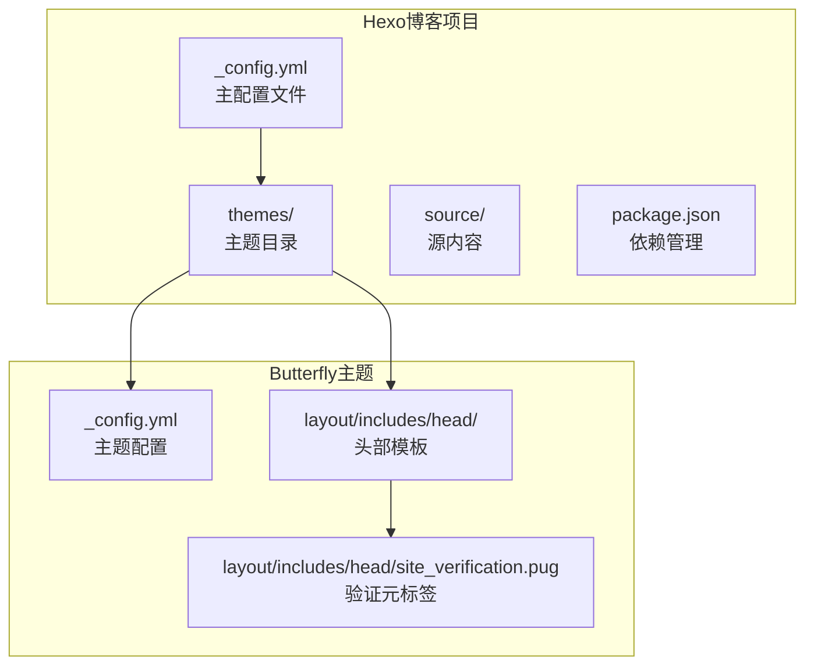
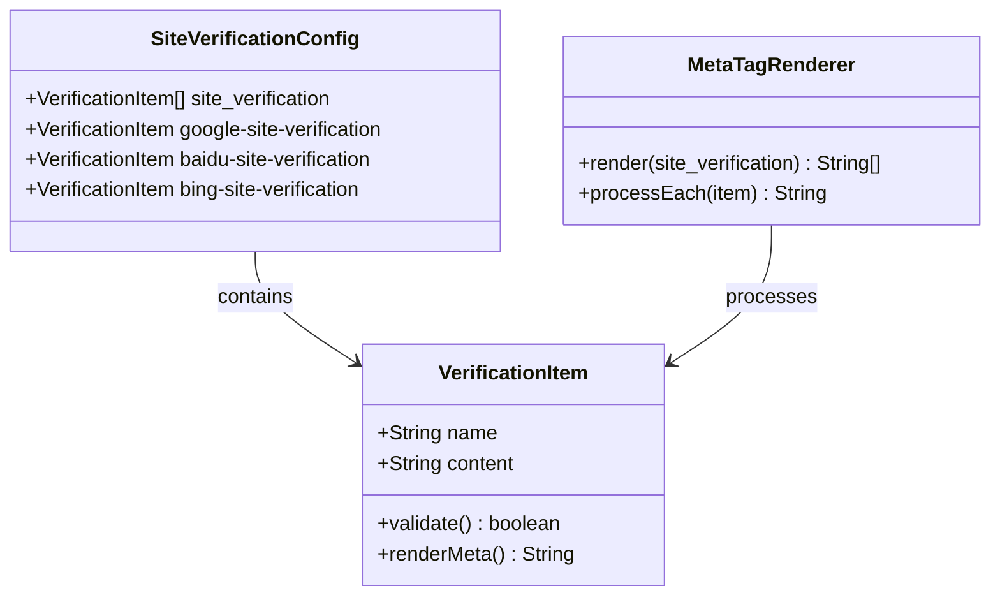
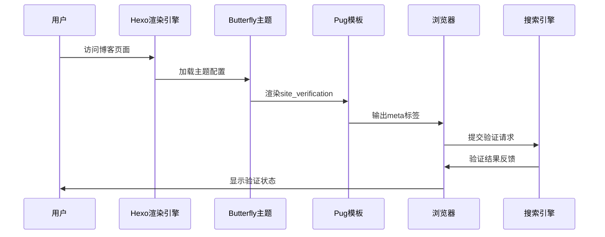
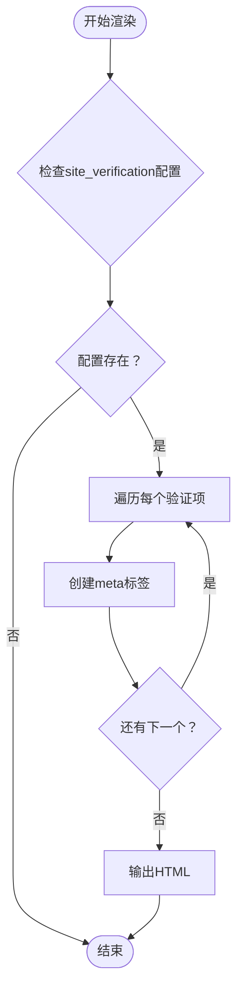
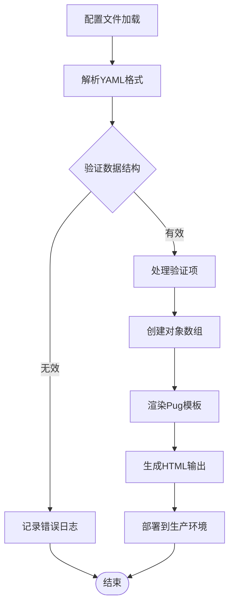
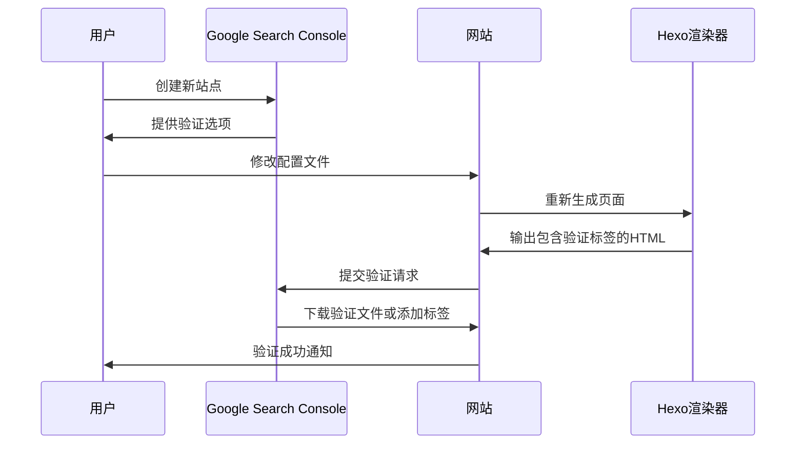
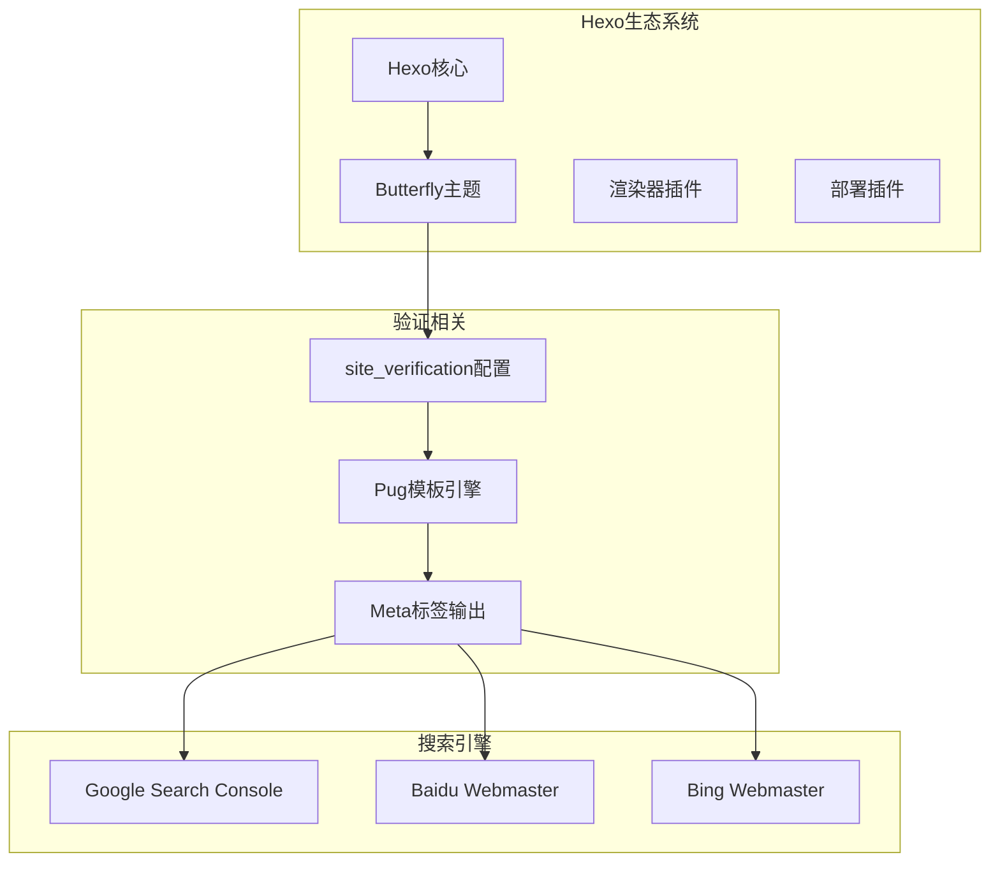

# 网站验证设置

<cite>
**本文档引用的文件**
- [_config.yml](file://_config.yml)
- [themes/butterfly/_config.yml](file://themes/butterfly/_config.yml)
- [themes/butterfly/layout/includes/head/site_verification.pug](file://themes/butterfly/layout/includes/head/site_verification.pug)
- [themes/butterfly/layout/includes/head/structured_data.pug](file://themes/butterfly/layout/includes/head/structured_data.pug)
- [themes/butterfly/README.md](file://themes/butterfly/README.md)
- [package.json](file://package.json)
</cite>

## 目录
1. [简介](#简介)
2. [项目结构概览](#项目结构概览)
3. [核心组件分析](#核心组件分析)
4. [架构总览](#架构总览)
5. [详细组件分析](#详细组件分析)
6. [依赖关系分析](#依赖关系分析)
7. [性能考虑](#性能考虑)
8. [故障排除指南](#故障排除指南)
9. [结论](#结论)

## 简介

本指南专注于dzc-blog网站的验证设置配置，基于Hexo博客框架和Butterfly主题实现。文档详细解释了各种搜索引擎验证工具的配置方法，包括Google Search Console、百度站长平台、必应Webmaster Tools等。深入说明了site_verification配置项的使用方法和验证流程，并提供了不同验证方式的优缺点对比和选择建议。

## 项目结构概览

dzc-blog项目采用标准的Hexo博客结构，主要包含以下关键组件：



**图表来源**
- [_config.yml:1-107](file://_config.yml#L1-107)
- [themes/butterfly/_config.yml:745-754](file://themes/butterfly/_config.yml#L745-754)
- [themes/butterfly/layout/includes/head/site_verification.pug:1-3](file://themes/butterfly/layout/includes/head/site_verification.pug#L1-3)

**章节来源**
- [_config.yml:1-107](file://_config.yml#L1-107)
- [themes/butterfly/_config.yml:745-754](file://themes/butterfly/_config.yml#L745-754)

## 核心组件分析

### 验证配置架构

Butterfly主题通过site_verification配置项实现了灵活的多搜索引擎验证支持：



**图表来源**
- [themes/butterfly/_config.yml:749-753](file://themes/butterfly/_config.yml#L749-753)
- [themes/butterfly/layout/includes/head/site_verification.pug:1-3](file://themes/butterfly/layout/includes/head/site_verification.pug#L1-3)

### 配置数据结构

site_verification配置采用数组格式，每个元素包含name和content属性：

| 属性名 | 类型 | 必需 | 描述 |
|--------|------|------|------|
| name | String | 是 | HTML meta标签的name属性值 |
| content | String | 是 | HTML meta标签的content属性值 |

**章节来源**
- [themes/butterfly/_config.yml:749-753](file://themes/butterfly/_config.yml#L749-753)
- [themes/butterfly/layout/includes/head/site_verification.pug:1-3](file://themes/butterfly/layout/includes/head/site_verification.pug#L1-3)

## 架构总览

### 验证流程架构



**图表来源**
- [themes/butterfly/layout/includes/head/site_verification.pug:1-3](file://themes/butterfly/layout/includes/head/site_verification.pug#L1-3)
- [_config.yml:99-106](file://_config.yml#L99-106)

### 多搜索引擎支持

Butterfly主题支持以下主流搜索引擎的验证配置：

| 搜索引擎 | 验证类型 | 元标签名称 | 配置示例 |
|----------|----------|------------|----------|
| Google Search Console | HTML标签 | google-site-verification | `name: google-site-verification` |
| 百度站长平台 | HTML标签 | baidu-site-verification | `name: baidu-site-verification` |
| 必应Webmaster Tools | HTML标签 | msvalidate.01 | `name: msvalidate.01` |
| Yandex.Webmaster | HTML标签 | yandex-tableau-id | `name: yandex-tableau-id` |
| Pinterest | HTML标签 | pinterestverify | `name: pinterestverify` |

**章节来源**
- [themes/butterfly/_config.yml:749-753](file://themes/butterfly/_config.yml#L749-753)

## 详细组件分析

### 验证配置实现

#### Pug模板渲染机制

site_verification.pug模板实现了条件渲染和循环处理：



**图表来源**
- [themes/butterfly/layout/includes/head/site_verification.pug:1-3](file://themes/butterfly/layout/includes/head/site_verification.pug#L1-3)

#### 配置项解析流程



**图表来源**
- [themes/butterfly/_config.yml:749-753](file://themes/butterfly/_config.yml#L749-753)
- [themes/butterfly/layout/includes/head/site_verification.pug:1-3](file://themes/butterfly/layout/includes/head/site_verification.pug#L1-3)

**章节来源**
- [themes/butterfly/layout/includes/head/site_verification.pug:1-3](file://themes/butterfly/layout/includes/head/site_verification.pug#L1-3)

### 不同验证方式对比

#### 验证方式选择矩阵

| 验证方式 | 优点 | 缺点 | 适用场景 | 配置复杂度 |
|----------|------|------|----------|------------|
| HTML标签验证 | 配置简单、无需额外账户 | 需要修改网站源码 | 初学者、快速验证 | 低 |
| DNS TXT记录 | 安全性高、无需修改代码 | 需要DNS管理权限 | 企业级、安全性要求高 | 中 |
| 文件上传验证 | 最直观、易理解 | 需要服务器访问权限 | 有FTP/SSH权限的用户 | 中 |
| Google Analytics | 一箭双雕、获得统计信息 | 需要额外服务订阅 | 需要流量统计的用户 | 低 |

#### 各搜索引擎验证特点

**Google Search Console**
- 支持HTML标签和DNS验证两种方式
- 可同时获得搜索性能数据
- 验证失败时会显示详细的错误信息

**百度站长平台**
- 主要面向中国用户
- 支持多种验证方式
- 提供中文界面和文档

**必应Webmaster Tools**
- 免费且功能完善
- 与Microsoft生态集成良好
- 支持多种验证方式

**章节来源**
- [themes/butterfly/_config.yml:749-753](file://themes/butterfly/_config.yml#L749-753)

### 验证流程详解

#### Google Search Console验证流程



**图表来源**
- [themes/butterfly/_config.yml:749-753](file://themes/butterfly/_config.yml#L749-753)

#### 验证成功后的配置步骤

验证成功后，建议进行以下配置以优化SEO表现：

1. **XML Sitemap提交**
   - 在搜索引擎控制台提交sitemap地址
   - 确保sitemap正确生成和更新

2. **Crawl Settings设置**
   - 配置robots.txt文件
   - 设置爬虫抓取频率
   - 排除不需要索引的页面

3. **结构化数据标记**
   - 添加JSON-LD格式的数据标记
   - 提供文章、网站等结构化信息

**章节来源**
- [themes/butterfly/layout/includes/head/structured_data.pug:1-67](file://themes/butterfly/layout/includes/head/structured_data.pug#L1-67)

## 依赖关系分析

### 技术栈依赖



**图表来源**
- [package.json:14-26](file://package.json#L14-26)
- [themes/butterfly/_config.yml:749-753](file://themes/butterfly/_config.yml#L749-753)

### 配置依赖关系

验证配置在项目中的依赖关系如下：

| 组件 | 依赖关系 | 作用 |
|------|----------|------|
| _config.yml | 主题配置入口 | 定义全局站点设置 |
| themes/butterfly/_config.yml | 验证配置容器 | 存储site_verification数组 |
| site_verification.pug | 渲染引擎 | 将配置转换为HTML meta标签 |
| 部署配置 | 生产环境输出 | 确保验证标签在最终页面中 |

**章节来源**
- [package.json:14-26](file://package.json#L14-26)
- [themes/butterfly/_config.yml:749-753](file://themes/butterfly/_config.yml#L749-753)

## 性能考虑

### 渲染性能优化

1. **延迟加载策略**
   - 验证标签属于静态内容，无需特殊优化
   - 建议与其他静态资源一起缓存

2. **模板渲染效率**
   - site_verification.pug模板简单高效
   - 单次循环处理所有验证项

3. **内存使用**
   - 配置数据结构简单，内存占用极小
   - 适合大规模部署场景

### SEO性能影响

验证配置对SEO性能的影响：
- 验证标签不增加页面加载时间
- 正确的验证配置有助于搜索引擎更好地索引网站
- 结构化数据标记可提升搜索结果的丰富性

## 故障排除指南

### 常见验证失败问题

#### 配置格式错误

**问题症状**：验证结果显示配置无效或格式错误

**解决方法**：
1. 检查YAML缩进是否正确
2. 确认name和content字段格式
3. 验证数组语法是否正确

**章节来源**
- [themes/butterfly/_config.yml:749-753](file://themes/butterfly/_config.yml#L749-753)

#### 配置未生效

**问题症状**：验证标签未出现在生成的HTML中

**解决方法**：
1. 确认主题已正确启用
2. 检查配置文件保存是否成功
3. 重新生成和部署网站

**章节来源**
- [_config.yml:99-106](file://_config.yml#L99-106)

#### 验证超时问题

**问题症状**：验证请求长时间无响应

**解决方法**：
1. 检查网络连接和DNS解析
2. 确认搜索引擎服务正常
3. 稍后再试或联系搜索引擎客服

### 调试技巧

1. **本地预览验证**
   ```bash
   hexo clean
   hexo generate
   hexo server
   ```

2. **检查生成的HTML**
   - 查看public目录下的HTML文件
   - 确认meta标签是否存在

3. **浏览器开发者工具**
   - 使用Network面板检查页面加载
   - 使用Elements面板查看DOM结构

**章节来源**
- [themes/butterfly/layout/includes/head/site_verification.pug:1-3](file://themes/butterfly/layout/includes/head/site_verification.pug#L1-3)

## 结论

dzc-blog网站的验证设置配置基于Butterfly主题的site_verification功能，实现了对多个主流搜索引擎的统一验证支持。通过合理的配置管理和最佳实践，可以确保网站验证的成功完成，并为进一步的SEO优化奠定基础。

关键要点总结：
- site_verification配置提供了灵活的多搜索引擎支持
- Pug模板渲染机制确保配置的正确输出
- 建议结合其他SEO配置（sitemap、结构化数据）提升整体效果
- 妥善处理验证失败问题，确保配置的稳定性和可靠性

通过遵循本指南的配置方法和最佳实践，可以顺利完成网站验证设置，并为后续的搜索引擎优化工作打下坚实基础。