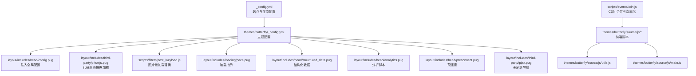
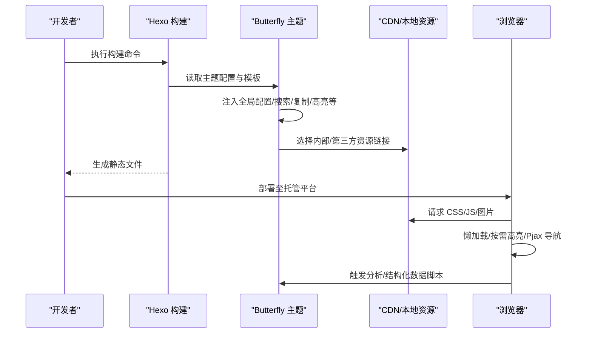
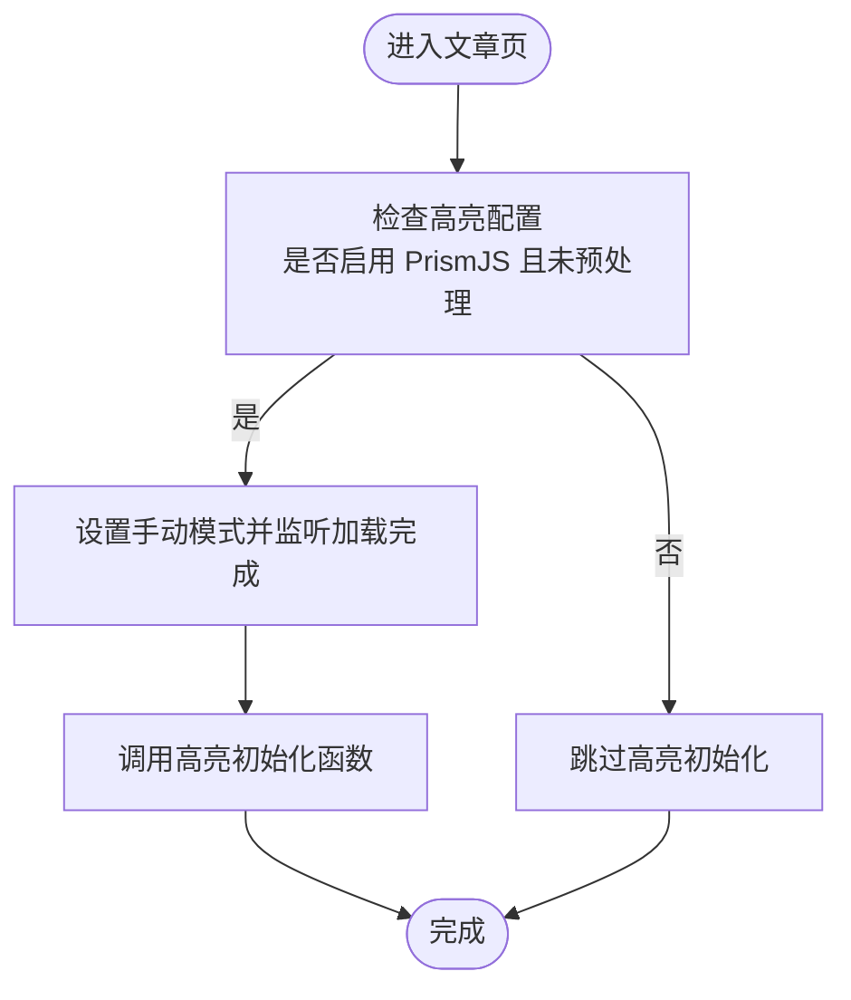
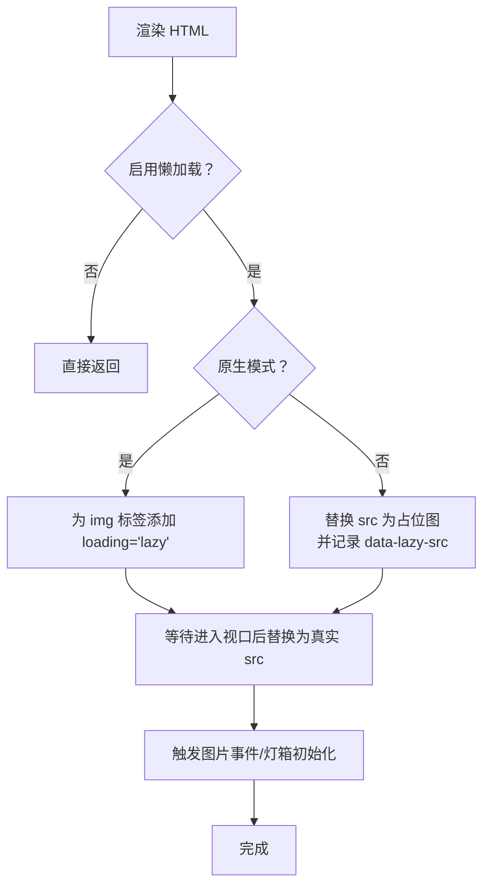
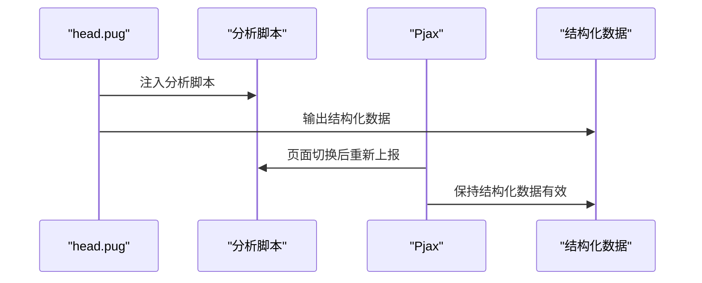
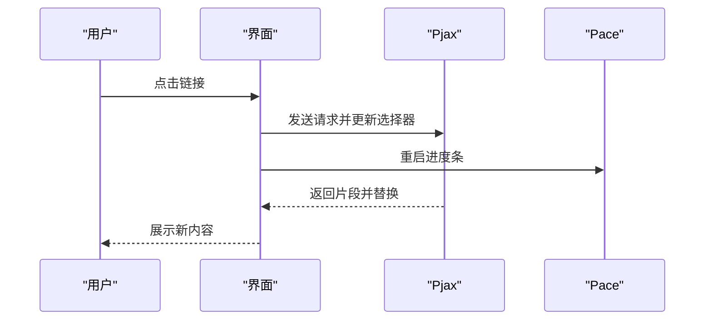
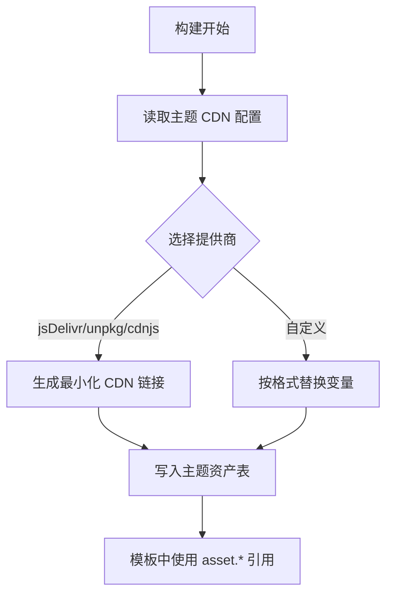
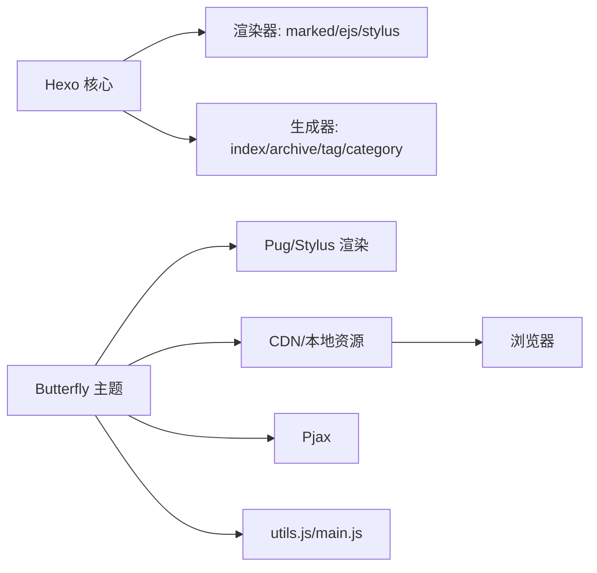

# 性能优化

<cite>
**本文引用的文件**
- [_config.yml](file://_config.yml)
- [themes/butterfly/_config.yml](file://themes/butterfly/_config.yml)
- [themes/butterfly/layout/includes/head/config.pug](file://themes/butterfly/layout/includes/head/config.pug)
- [themes/butterfly/layout/includes/third-party/prismjs.pug](file://themes/butterfly/layout/includes/third-party/prismjs.pug)
- [themes/butterfly/scripts/filters/post_lazyload.js](file://themes/butterfly/scripts/filters/post_lazyload.js)
- [themes/butterfly/layout/includes/loading/pace.pug](file://themes/butterfly/layout/includes/loading/pace.pug)
- [themes/butterfly/layout/includes/head/structured_data.pug](file://themes/butterfly/layout/includes/head/structured_data.pug)
- [themes/butterfly/layout/includes/head/analytics.pug](file://themes/butterfly/layout/includes/head/analytics.pug)
- [themes/butterfly/layout/includes/head/preconnect.pug](file://themes/butterfly/layout/includes/head/preconnect.pug)
- [themes/butterfly/layout/includes/third-party/pjax.pug](file://themes/butterfly/layout/includes/third-party/pjax.pug)
- [themes/butterfly/scripts/events/cdn.js](file://themes/butterfly/scripts/events/cdn.js)
- [themes/butterfly/source/js/utils.js](file://themes/butterfly/source/js/utils.js)
- [themes/butterfly/source/js/main.js](file://themes/butterfly/source/js/main.js)
- [package.json](file://package.json)
- [themes/butterfly/package.json](file://themes/butterfly/package.json)
</cite>

## 目录
1. [简介](#简介)
2. [项目结构](#项目结构)
3. [核心组件](#核心组件)
4. [架构总览](#架构总览)
5. [详细组件分析](#详细组件分析)
6. [依赖关系分析](#依赖关系分析)
7. [性能考量](#性能考量)
8. [故障排查指南](#故障排查指南)
9. [结论](#结论)
10. [附录](#附录)

## 简介
本指南面向静态博客（Hexo + Butterfly 主题）的性能优化，围绕资源压缩与缓存、加载优化、代码高亮、图片懒加载、第三方资源优化、SEO 结构化数据与元标签、CDN 集成与网络优化、性能监控与分析、以及可复用的优化案例与测试方法展开。目标是帮助读者在不牺牲功能与体验的前提下，显著降低页面加载时间、提升首屏渲染速度，并改善搜索引擎可见性。

## 项目结构
本项目采用 Hexo 静态站点生成器，主题为 Butterfly。关键性能相关模块分布如下：
- 全局配置：站点 URL、永久链接、分页、语法高亮等
- 主题配置：导航、代码块、懒加载、搜索、评论、分析、广告、CDN 等
- 模板与过滤器：Pug 模板注入全局配置、PrismJS 高亮按需加载、图片懒加载替换
- 前端脚本：Pjax 无刷新导航、Pace 加载指示、图片画廊与灯箱、工具函数
- 构建事件：CDN 合并与资源版本化

图表来源
- [_config.yml:1-107](file://_config.yml#L1-L107)
- [themes/butterfly/_config.yml:1-1140](file://themes/butterfly/_config.yml#L1-L1140)
- [themes/butterfly/layout/includes/head/config.pug:1-126](file://themes/butterfly/layout/includes/head/config.pug#L1-L126)
- [themes/butterfly/layout/includes/third-party/prismjs.pug:1-23](file://themes/butterfly/layout/includes/third-party/prismjs.pug#L1-L23)
- [themes/butterfly/scripts/filters/post_lazyload.js:1-41](file://themes/butterfly/scripts/filters/post_lazyload.js#L1-L41)
- [themes/butterfly/layout/includes/loading/pace.pug:1-12](file://themes/butterfly/layout/includes/loading/pace.pug#L1-L12)
- [themes/butterfly/layout/includes/head/structured_data.pug:1-68](file://themes/butterfly/layout/includes/head/structured_data.pug#L1-L68)
- [themes/butterfly/layout/includes/head/analytics.pug:1-45](file://themes/butterfly/layout/includes/head/analytics.pug#L1-L45)
- [themes/butterfly/layout/includes/head/preconnect.pug:1-35](file://themes/butterfly/layout/includes/head/preconnect.pug#L1-L35)
- [themes/butterfly/layout/includes/third-party/pjax.pug:1-73](file://themes/butterfly/layout/includes/third-party/pjax.pug#L1-L73)
- [themes/butterfly/scripts/events/cdn.js:1-96](file://themes/butterfly/scripts/events/cdn.js#L1-L96)
- [themes/butterfly/source/js/utils.js:156-198](file://themes/butterfly/source/js/utils.js#L156-L198)
- [themes/butterfly/source/js/main.js:270-389](file://themes/butterfly/source/js/main.js#L270-L389)

章节来源
- [_config.yml:1-107](file://_config.yml#L1-L107)
- [themes/butterfly/_config.yml:1-1140](file://themes/butterfly/_config.yml#L1-L1140)

## 核心组件
- 全局配置与渲染
  - 站点 URL、永久链接、分页、语法高亮与 PrismJS 设置
- 主题配置与模板
  - 代码块样式、复制/语言栏、懒加载开关、搜索、评论、分析、CDN 提供商
  - 结构化数据（Article/WebSite）、分析脚本注入、预连接优化
- 过滤器与事件
  - 图片懒加载替换（原生 lazy 或占位图）
  - CDN 资源合并与版本化
- 前端脚本
  - Pjax 无刷新导航、Pace 加载指示、图片画廊与灯箱、工具函数

章节来源
- [_config.yml:14-57](file://_config.yml#L14-L57)
- [themes/butterfly/_config.yml:27-509](file://themes/butterfly/_config.yml#L27-L509)
- [themes/butterfly/layout/includes/head/config.pug:75-125](file://themes/butterfly/layout/includes/head/config.pug#L75-L125)
- [themes/butterfly/scripts/events/cdn.js:11-95](file://themes/butterfly/scripts/events/cdn.js#L11-L95)

## 架构总览
下图展示从构建到运行时的关键路径：Hexo 渲染 → 主题注入配置 → CDN 资源选择 → 按需加载与懒加载 → 无刷新导航与分析上报。

图表来源
- [themes/butterfly/layout/includes/head/config.pug:87-125](file://themes/butterfly/layout/includes/head/config.pug#L87-L125)
- [themes/butterfly/scripts/events/cdn.js:90-95](file://themes/butterfly/scripts/events/cdn.js#L90-L95)
- [themes/butterfly/layout/includes/third-party/pjax.pug:18-73](file://themes/butterfly/layout/includes/third-party/pjax.pug#L18-L73)
- [themes/butterfly/layout/includes/head/analytics.pug:1-45](file://themes/butterfly/layout/includes/head/analytics.pug#L1-L45)

## 详细组件分析

### 代码高亮配置与按需加载
- 配置入口
  - 全局语法高亮器选择与 PrismJS 参数
  - 主题侧代码块 UI 行为（复制、语言栏、高度限制、全屏等）
- 模板注入
  - 将高亮提供方与行为注入到全局配置对象，供前端脚本使用
- 按需加载
  - 当启用 PrismJS 且未开启自动预处理时，延迟执行高亮初始化
- 实践建议
  - 在文章较多或代码量大时，优先使用按需加载以减少首屏 JS 执行
  - 控制行号与全屏按钮的启用范围，避免不必要的 DOM 与计算

图表来源
- [themes/butterfly/layout/includes/third-party/prismjs.pug:5-23](file://themes/butterfly/layout/includes/third-party/prismjs.pug#L5-L23)
- [themes/butterfly/layout/includes/head/config.pug:75-84](file://themes/butterfly/layout/includes/head/config.pug#L75-L84)

章节来源
- [_config.yml:46-56](file://_config.yml#L46-L56)
- [themes/butterfly/_config.yml:27-44](file://themes/butterfly/_config.yml#L27-L44)
- [themes/butterfly/layout/includes/third-party/prismjs.pug:1-23](file://themes/butterfly/layout/includes/third-party/prismjs.pug#L1-L23)
- [themes/butterfly/layout/includes/head/config.pug:75-84](file://themes/butterfly/layout/includes/head/config.pug#L75-L84)

### 图片懒加载实现
- 运行时机
  - 支持两种模式：原生 loading="lazy" 与自定义占位图
  - 可针对站点整体或仅文章内容生效
- 替换策略
  - 将 src 替换为 data-lazy-src，并设置占位图，滚动进入视口后替换回真实 src
  - 避免对 script 内部的图片进行替换
- 前端联动
  - 前端工具函数支持将图片包裹为灯箱或中等缩放，配合懒加载使用
- 实践建议
  - 大图/相册场景建议开启懒加载；小图标可考虑内联或雪碧图
  - 自定义占位图建议使用极小尺寸 Base64，缩短首屏等待

图表来源
- [themes/butterfly/scripts/filters/post_lazyload.js:11-27](file://themes/butterfly/scripts/filters/post_lazyload.js#L11-L27)
- [themes/butterfly/source/js/utils.js:172-198](file://themes/butterfly/source/js/utils.js#L172-L198)

章节来源
- [themes/butterfly/_config.yml:509-517](file://themes/butterfly/_config.yml#L509-L517)
- [themes/butterfly/scripts/filters/post_lazyload.js:1-41](file://themes/butterfly/scripts/filters/post_lazyload.js#L1-L41)
- [themes/butterfly/source/js/utils.js:172-198](file://themes/butterfly/source/js/utils.js#L172-L198)

### 第三方资源优化
- 分析脚本
  - 百度统计、Google Analytics、Cloudflare Insights、Microsoft Clarity、Google Tag Manager
  - 通过模板注入并在 Pjax 完成后重新上报页面路径
- 结构化数据
  - 文章页输出 BlogPosting，首页根路径输出 WebSite，增强 SEO 可见性
- 预连接
  - 对 CDN、分析服务、字体与访客计数服务进行预连接，降低握手延迟
- 实践建议
  - 仅启用必要的分析脚本，避免阻塞主渲染
  - 使用异步/延迟加载分析脚本，确保不影响首屏时间

图表来源
- [themes/butterfly/layout/includes/head/analytics.pug:1-45](file://themes/butterfly/layout/includes/head/analytics.pug#L1-L45)
- [themes/butterfly/layout/includes/head/structured_data.pug:1-68](file://themes/butterfly/layout/includes/head/structured_data.pug#L1-L68)
- [themes/butterfly/layout/includes/head/preconnect.pug:1-35](file://themes/butterfly/layout/includes/head/preconnect.pug#L1-L35)
- [themes/butterfly/layout/includes/third-party/pjax.pug:18-73](file://themes/butterfly/layout/includes/third-party/pjax.pug#L18-L73)

章节来源
- [themes/butterfly/layout/includes/head/analytics.pug:1-45](file://themes/butterfly/layout/includes/head/analytics.pug#L1-L45)
- [themes/butterfly/layout/includes/head/structured_data.pug:1-68](file://themes/butterfly/layout/includes/head/structured_data.pug#L1-L68)
- [themes/butterfly/layout/includes/head/preconnect.pug:1-35](file://themes/butterfly/layout/includes/head/preconnect.pug#L1-L35)

### 加载优化与用户体验
- 加载指示
  - 使用 Pace 在 Pjax 切换时显示进度条，提升感知性能
- 无刷新导航
  - Pjax 仅更新关键选择器，减少整页重载
- 实践建议
  - 为关键区域设置骨架屏或占位图，结合懒加载与按需高亮
  - 控制 Pjax 更新的选择器数量，避免过度重绘

图表来源
- [themes/butterfly/layout/includes/loading/pace.pug:1-12](file://themes/butterfly/layout/includes/loading/pace.pug#L1-L12)
- [themes/butterfly/layout/includes/third-party/pjax.pug:18-73](file://themes/butterfly/layout/includes/third-party/pjax.pug#L18-L73)

章节来源
- [themes/butterfly/layout/includes/loading/pace.pug:1-12](file://themes/butterfly/layout/includes/loading/pace.pug#L1-L12)
- [themes/butterfly/layout/includes/third-party/pjax.pug:1-73](file://themes/butterfly/layout/includes/third-party/pjax.pug#L1-L73)

### CDN 集成与静态资源托管
- 资源合并与版本化
  - 构建前根据主题配置选择内部或第三方提供商，生成最小化链接
  - 支持 jsDelivr、unpkg、cdnjs、自定义格式，按需附加版本参数
- 预连接与缓存
  - 预连接常用域名，减少 DNS 与 TLS 握手开销
- 实践建议
  - 生产环境优先使用稳定 CDN；开发调试可回退本地资源
  - 启用长期缓存策略（静态资源带哈希名），结合版本参数控制失效

图表来源
- [themes/butterfly/scripts/events/cdn.js:11-95](file://themes/butterfly/scripts/events/cdn.js#L11-L95)
- [themes/butterfly/layout/includes/head/preconnect.pug:1-35](file://themes/butterfly/layout/includes/head/preconnect.pug#L1-L35)

章节来源
- [themes/butterfly/scripts/events/cdn.js:1-96](file://themes/butterfly/scripts/events/cdn.js#L1-L96)
- [themes/butterfly/layout/includes/head/preconnect.pug:1-35](file://themes/butterfly/layout/includes/head/preconnect.pug#L1-L35)

### SEO 最佳实践
- 结构化数据
  - 文章页输出 BlogPosting，首页根路径输出 WebSite，包含名称、alternateName、URL、图像、作者等
- 元标签与描述
  - 自动生成 meta generator（可关闭）
  - 通过 Open Graph 等扩展提升社交分享效果（如启用）
- URL 设计
  - 永久链接规则清晰，利于搜索引擎索引与缓存
- 实践建议
  - 为每篇文章设置封面图或作者信息，完善结构化数据
  - 使用 canonical 链接与 Open Graph 标签，统一分享与索引

章节来源
- [themes/butterfly/layout/includes/head/structured_data.pug:1-68](file://themes/butterfly/layout/includes/head/structured_data.pug#L1-L68)
- [_config.yml:72-83](file://_config.yml#L72-L83)

### 性能监控与分析
- 分析脚本
  - 百度统计、Google Analytics、Cloudflare Insights、Microsoft Clarity、Google Tag Manager
  - Pjax 完成后自动上报页面路径，便于跨页分析
- 建议指标
  - 首字节时间（TTFB）、首屏渲染时间（FCP/LCP）、交互时间（INP）、页面体积与请求数
- 工具推荐
  - Lighthouse、WebPageTest、Chrome DevTools Performance、Sentry（错误监控）

章节来源
- [themes/butterfly/layout/includes/head/analytics.pug:1-45](file://themes/butterfly/layout/includes/head/analytics.pug#L1-L45)
- [themes/butterfly/layout/includes/third-party/pjax.pug:41-73](file://themes/butterfly/layout/includes/third-party/pjax.pug#L41-L73)

## 依赖关系分析
- 构建阶段
  - Hexo 与渲染器、生成器插件
  - Butterfly 主题及其渲染依赖（Pug、Stylus）
- 运行时
  - 前端脚本依赖于主题注入的全局配置与资产表
  - Pjax 与分析脚本协同工作，保证 SPA 体验与数据采集

图表来源
- [package.json:14-26](file://package.json#L14-L26)
- [themes/butterfly/package.json:25-30](file://themes/butterfly/package.json#L25-L30)
- [themes/butterfly/scripts/events/cdn.js:11-95](file://themes/butterfly/scripts/events/cdn.js#L11-L95)
- [themes/butterfly/source/js/main.js:270-389](file://themes/butterfly/source/js/main.js#L270-L389)

章节来源
- [package.json:1-29](file://package.json#L1-L29)
- [themes/butterfly/package.json:1-35](file://themes/butterfly/package.json#L1-L35)

## 性能考量
- 资源压缩与缓存
  - 使用 CDN 最小化文件，启用长期缓存与版本参数
  - 控制第三方脚本数量与加载方式，避免阻塞渲染
- 加载优化
  - 懒加载与按需高亮，减少首屏 JS 与 DOM 计算
  - Pjax 仅更新必要区域，提升交互感知
- 图片与媒体
  - 优先使用现代格式（WebP AVIF）与合适尺寸；懒加载与占位图结合
- 网络优化
  - 预连接常用域名，减少握手时间；合理设置缓存头
- SEO
  - 结构化数据与元标签完善，URL 设计简洁明确

## 故障排查指南
- 图片未懒加载
  - 检查主题懒加载开关与作用域（站点/文章）
  - 确认未被 script 内容干扰
- 代码高亮未生效
  - 确认高亮提供方与模板注入配置一致
  - 检查是否启用自动预处理导致初始化被跳过
- 分析脚本未上报
  - 确认分析 ID 正确，Pjax 完成回调是否触发
- CDN 资源 404
  - 检查提供商与版本参数，确认最小化文件存在
- Pjax 错误处理
  - 404 时回退到 404 页面或跳转外部链接

章节来源
- [themes/butterfly/scripts/filters/post_lazyload.js:29-40](file://themes/butterfly/scripts/filters/post_lazyload.js#L29-L40)
- [themes/butterfly/layout/includes/third-party/prismjs.pug:5-23](file://themes/butterfly/layout/includes/third-party/prismjs.pug#L5-L23)
- [themes/butterfly/layout/includes/head/analytics.pug:10-23](file://themes/butterfly/layout/includes/head/analytics.pug#L10-L23)
- [themes/butterfly/scripts/events/cdn.js:68-78](file://themes/butterfly/scripts/events/cdn.js#L68-L78)
- [themes/butterfly/layout/includes/third-party/pjax.pug:66-72](file://themes/butterfly/layout/includes/third-party/pjax.pug#L66-L72)

## 结论
通过合理配置主题与模板、启用按需加载与懒加载、利用 CDN 与预连接、完善结构化数据与分析脚本，可以在不牺牲功能与体验的前提下显著提升静态博客的性能与 SEO 表现。建议在生产环境中启用最小化资源、长期缓存与版本化策略，并持续使用性能监控工具进行迭代优化。

## 附录
- 实际优化案例
  - 案例一：启用 PrismJS 按需加载与行号分离，减少首屏 JS 体积
  - 案例二：开启图片懒加载与原生 loading="lazy"，降低首屏渲染压力
  - 案例三：配置 CDN 并启用预连接，缩短关键资源加载时间
- 性能测试方法
  - 使用 Lighthouse 与 WebPageTest 测量关键指标
  - Chrome DevTools Network 与 Performance 面板定位瓶颈
  - 持续监控分析脚本上报与用户交互指标（INP/CLS）