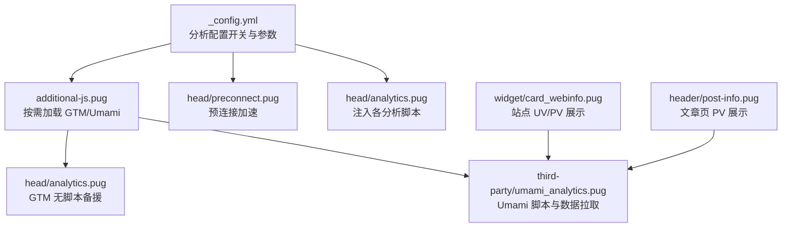
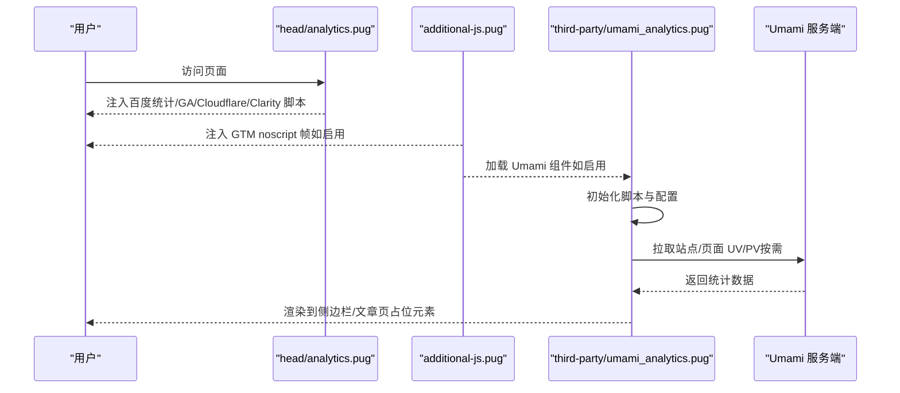
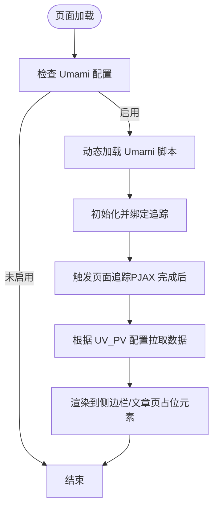
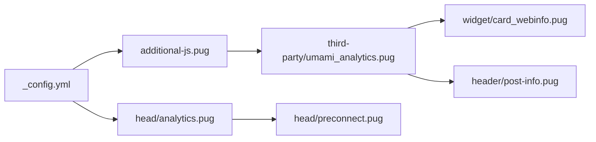

# 分析工具集成

<cite>
**本文引用的文件**
- [themes/butterfly/_config.yml](file://themes/butterfly/_config.yml)
- [themes/butterfly/layout/includes/head/analytics.pug](file://themes/butterfly/layout/includes/head/analytics.pug)
- [themes/butterfly/layout/includes/third-party/umami_analytics.pug](file://themes/butterfly/layout/includes/third-party/umami_analytics.pug)
- [themes/butterfly/layout/includes/additional-js.pug](file://themes/butterfly/layout/includes/additional-js.pug)
- [themes/butterfly/layout/includes/head/preconnect.pug](file://themes/butterfly/layout/includes/head/preconnect.pug)
- [themes/butterfly/layout/includes/widget/card_webinfo.pug](file://themes/butterfly/layout/includes/widget/card_webinfo.pug)
- [themes/butterfly/layout/includes/header/post-info.pug](file://themes/butterfly/layout/includes/header/post-info.pug)
- [themes/butterfly/layout/includes/head/config_site.pug](file://themes/butterfly/layout/includes/head/config_site.pug)
</cite>

## 目录
1. [简介](#简介)
2. [项目结构](#项目结构)
3. [核心组件](#核心组件)
4. [架构总览](#架构总览)
5. [详细组件分析](#详细组件分析)
6. [依赖关系分析](#依赖关系分析)
7. [性能考量](#性能考量)
8. [故障排查指南](#故障排查指南)
9. [结论](#结论)
10. [附录](#附录)

## 简介
本指南面向在 Hexo 主题 Butterfly 中集成第三方分析工具的用户，覆盖以下分析服务的配置与使用：  
- 百度统计（Baidu Analytics）  
- Google Analytics（含 Google Tag Manager）  
- Cloudflare Analytics  
- Microsoft Clarity  
- Umami Analytics（支持云版与自托管）  

内容包括：各工具特点与适用场景、配置参数说明、完整配置示例路径、数据获取与验证方法、调试技巧，以及对站点性能的影响与优化策略。

## 项目结构
围绕分析工具的集成，涉及主题配置文件与模板片段，关键位置如下：
- 主题配置：用于开启/关闭各分析工具并填写必要参数
- 头部注入：在页面头部动态插入分析脚本
- 额外脚本：按需加载 GTM 无脚本备援、Umami 统计脚本与数据展示
- 预连接：为第三方域名建立预连接以降低首包延迟
- 数据展示：侧边栏与文章页的 UV/PV 展示占位与异步拉取

图表来源
- [themes/butterfly/_config.yml](file://themes/butterfly/_config.yml)
- [themes/butterfly/layout/includes/head/analytics.pug](file://themes/butterfly/layout/includes/head/analytics.pug)
- [themes/butterfly/layout/includes/third-party/umami_analytics.pug](file://themes/butterfly/layout/includes/third-party/umami_analytics.pug)
- [themes/butterfly/layout/includes/additional-js.pug](file://themes/butterfly/layout/includes/additional-js.pug)
- [themes/butterfly/layout/includes/head/preconnect.pug](file://themes/butterfly/layout/includes/head/preconnect.pug)
- [themes/butterfly/layout/includes/widget/card_webinfo.pug](file://themes/butterfly/layout/includes/widget/card_webinfo.pug)
- [themes/butterfly/layout/includes/header/post-info.pug](file://themes/butterfly/layout/includes/header/post-info.pug)

章节来源
- [themes/butterfly/_config.yml](file://themes/butterfly/_config.yml)
- [themes/butterfly/layout/includes/head/analytics.pug](file://themes/butterfly/layout/includes/head/analytics.pug)
- [themes/butterfly/layout/includes/third-party/umami_analytics.pug](file://themes/butterfly/layout/includes/third-party/umami_analytics.pug)
- [themes/butterfly/layout/includes/additional-js.pug](file://themes/butterfly/layout/includes/additional-js.pug)
- [themes/butterfly/layout/includes/head/preconnect.pug](file://themes/butterfly/layout/includes/head/preconnect.pug)
- [themes/butterfly/layout/includes/widget/card_webinfo.pug](file://themes/butterfly/layout/includes/widget/card_webinfo.pug)
- [themes/butterfly/layout/includes/header/post-info.pug](file://themes/butterfly/layout/includes/header/post-info.pug)

## 核心组件
- 分析配置项（主题配置文件）
  - 百度统计：通过键名开启并填入站点 ID
  - Google Analytics：填入测量 ID
  - Cloudflare Analytics：填入站点令牌
  - Microsoft Clarity：填入项目 ID
  - Google Tag Manager：填入容器 ID，可选指定域地址
  - Umami Analytics：支持云版与自托管，包含服务器地址、脚本名、站点 ID、选项与 UV/PV 开关、访问令牌
- 头部注入逻辑（head/analytics.pug）
  - 条件性插入各分析脚本；为 GA/GTM 在 PJAX 完成后重配页面路径
- 额外脚本（additional-js.pug）
  - 按需加载 GTM 的 noscript 帧与 Umami 组件
- 预连接（head/preconnect.pug）
  - 对 GA/Baidu/Cloudflare/Clarity 等域名进行预连接，减少首包延迟
- 数据展示（card_webinfo.pug、post-info.pug）
  - 侧边栏与文章页的 UV/PV 占位元素，配合 Umami 异步拉取并渲染

章节来源
- [themes/butterfly/_config.yml](file://themes/butterfly/_config.yml)
- [themes/butterfly/layout/includes/head/analytics.pug](file://themes/butterfly/layout/includes/head/analytics.pug)
- [themes/butterfly/layout/includes/additional-js.pug](file://themes/butterfly/layout/includes/additional-js.pug)
- [themes/butterfly/layout/includes/head/preconnect.pug](file://themes/butterfly/layout/includes/head/preconnect.pug)
- [themes/butterfly/layout/includes/widget/card_webinfo.pug](file://themes/butterfly/layout/includes/widget/card_webinfo.pug)
- [themes/butterfly/layout/includes/header/post-info.pug](file://themes/butterfly/layout/includes/header/post-info.pug)

## 架构总览
下图展示了从配置到脚本注入、数据拉取与展示的整体流程：

图表来源
- [themes/butterfly/layout/includes/head/analytics.pug](file://themes/butterfly/layout/includes/head/analytics.pug)
- [themes/butterfly/layout/includes/additional-js.pug](file://themes/butterfly/layout/includes/additional-js.pug)
- [themes/butterfly/layout/includes/third-party/umami_analytics.pug](file://themes/butterfly/layout/includes/third-party/umami_analytics.pug)

## 详细组件分析

### 百度统计（Baidu Analytics）
- 特点与适用场景
  - 国内主流统计平台，适合国内用户与合规要求
  - 支持 PV/UV、页面浏览、自定义事件等
- 配置参数
  - 键名：baidu_analytics
  - 值：站点 ID（字符串）
- 集成方式
  - 在主题配置中开启并填入 ID
  - 头部模板条件注入脚本，并在 PJAX 完成后上报新页面路径
- 最佳实践
  - 仅在需要时开启，避免不必要的网络请求
  - 如需跨域或隐私合规，结合预连接与脚本加载时机优化
- 数据获取与验证
  - 登录百度统计后台查看实时/历史数据
  - 使用浏览器开发者工具 Network 面板确认脚本加载与上报请求
- 性能影响与优化
  - 利用预连接减少首包延迟
  - 避免在移动端频繁触发额外请求

章节来源
- [themes/butterfly/_config.yml](file://themes/butterfly/_config.yml)
- [themes/butterfly/layout/includes/head/analytics.pug](file://themes/butterfly/layout/includes/head/analytics.pug)
- [themes/butterfly/layout/includes/head/preconnect.pug](file://themes/butterfly/layout/includes/head/preconnect.pug)

### Google Analytics（含 Google Tag Manager）
- 特点与适用场景
  - 全球通用统计平台，功能丰富，支持事件追踪、转化跟踪
  - GTM 提供可视化容器管理，便于非技术用户维护
- 配置参数
  - Google Analytics：键名 google_analytics，值为测量 ID
  - Google Tag Manager：键名 google_tag_manager，包含 tag_id 与可选 domain
- 集成方式
  - 头部模板注入 gtag 脚本与 GA 配置
  - 在 PJAX 完成后重新配置页面路径
  - 额外脚本注入 GTM 的 noscript 帧作为降级方案
- 最佳实践
  - 优先使用 GA4（Measurement ID），确保与 gtag 兼容
  - GTM 建议启用 noscript 帧，提升隐私模式下的兼容性
- 数据获取与验证
  - 在 GA4 控制台查看实时报告与调试视图
  - 使用浏览器 Network/Console 面板检查脚本加载与事件上报
- 性能影响与优化
  - 将脚本 defer 或异步加载，避免阻塞主线程
  - 合理设置 PJAX 事件回调，减少重复上报

章节来源
- [themes/butterfly/_config.yml](file://themes/butterfly/_config.yml)
- [themes/butterfly/layout/includes/head/analytics.pug](file://themes/butterfly/layout/includes/head/analytics.pug)
- [themes/butterfly/layout/includes/additional-js.pug](file://themes/butterfly/layout/includes/additional-js.pug)

### Cloudflare Analytics
- 特点与适用场景
  - 由 Cloudflare 提供的轻量级分析，强调隐私保护与低开销
  - 适合对性能与隐私敏感的站点
- 配置参数
  - 键名 cloudflare_analytics，值为站点令牌（token）
- 集成方式
  - 头部模板注入 Cloudflare Beacon 脚本，并传入 token
- 最佳实践
  - 与 Cloudflare Workers/缓存策略协同，减少重复请求
- 数据获取与验证
  - 登录 Cloudflare 仪表盘查看分析数据
  - 使用 Network 面板确认 beacon 请求
- 性能影响与优化
  - 脚本已内置优化，通常对性能影响较小

章节来源
- [themes/butterfly/_config.yml](file://themes/butterfly/_config.yml)
- [themes/butterfly/layout/includes/head/analytics.pug](file://themes/butterfly/layout/includes/head/analytics.pug)

### Microsoft Clarity
- 特点与适用场景
  - 录制用户会话与热力图，帮助理解用户行为路径
  - 适合产品体验优化与用户研究
- 配置参数
  - 键名 microsoft_clarity，值为项目 ID
- 集成方式
  - 头部模板注入 Clarity 脚本
- 最佳实践
  - 注意隐私合规，避免采集敏感信息
  - 仅在必要页面启用，控制数据量
- 数据获取与验证
  - 登录 Clarity 控制台查看录制与报告
  - 使用 Network 面板确认脚本加载
- 性能影响与优化
  - 录制类脚本可能带来额外开销，建议按需启用

章节来源
- [themes/butterfly/_config.yml](file://themes/butterfly/_config.yml)
- [themes/butterfly/layout/includes/head/analytics.pug](file://themes/butterfly/layout/includes/head/analytics.pug)

### Umami Analytics（云版与自托管）
- 特点与适用场景
  - 开源、注重隐私，默认不追踪个人身份信息
  - 支持云版与自托管，适合对隐私有高要求的站点
- 配置参数
  - enable：是否启用
  - serverURL：自托管实例地址（可选）
  - script_name：脚本文件名（默认 script.js）
  - website_id：站点 ID
  - option：传递给脚本的额外属性对象
  - UV_PV：控制站点 UV/PV/页面 PV 的展示与拉取
  - token：云版使用 Bearer Token，自托管使用 x-umami-api-key
- 集成方式
  - 额外脚本按需加载 Umami 组件
  - 组件内部动态加载脚本并初始化
  - 在 PJAX 完成后触发一次页面追踪
  - 页面加载完成后异步拉取并渲染 UV/PV 数据
- 数据获取与验证
  - 登录 Umami 控制台查看实时/历史数据
  - 使用 Network 面板确认 API 请求与返回
  - 检查侧边栏与文章页占位元素是否被替换为数值
- 最佳实践
  - 自托管时务必配置正确的 token 与 API 地址
  - 仅在需要时开启 UV/PV 拉取，避免频繁请求
  - 结合 PJAX 事件确保页面切换时的追踪一致性
- 性能影响与优化
  - 脚本按需加载，避免常驻内存
  - API 拉取采用异步与错误处理，不影响主流程

图表来源
- [themes/butterfly/layout/includes/third-party/umami_analytics.pug](file://themes/butterfly/layout/includes/third-party/umami_analytics.pug)
- [themes/butterfly/layout/includes/widget/card_webinfo.pug](file://themes/butterfly/layout/includes/widget/card_webinfo.pug)
- [themes/butterfly/layout/includes/header/post-info.pug](file://themes/butterfly/layout/includes/header/post-info.pug)

章节来源
- [themes/butterfly/_config.yml](file://themes/butterfly/_config.yml)
- [themes/butterfly/layout/includes/third-party/umami_analytics.pug](file://themes/butterfly/layout/includes/third-party/umami_analytics.pug)
- [themes/butterfly/layout/includes/widget/card_webinfo.pug](file://themes/butterfly/layout/includes/widget/card_webinfo.pug)
- [themes/butterfly/layout/includes/header/post-info.pug](file://themes/butterfly/layout/includes/header/post-info.pug)

## 依赖关系分析
- 配置到注入
  - 主题配置决定是否注入对应脚本
  - 头部模板与额外脚本共同完成注入与降级
- 脚本到数据
  - 分析脚本负责采集与上报
  - Umami 组件负责数据拉取与渲染
- 预连接优化
  - 针对 GA/Baidu/Cloudflare/Clarity 的域名建立预连接，降低首包延迟

图表来源
- [themes/butterfly/_config.yml](file://themes/butterfly/_config.yml)
- [themes/butterfly/layout/includes/head/analytics.pug](file://themes/butterfly/layout/includes/head/analytics.pug)
- [themes/butterfly/layout/includes/additional-js.pug](file://themes/butterfly/layout/includes/additional-js.pug)
- [themes/butterfly/layout/includes/head/preconnect.pug](file://themes/butterfly/layout/includes/head/preconnect.pug)
- [themes/butterfly/layout/includes/third-party/umami_analytics.pug](file://themes/butterfly/layout/includes/third-party/umami_analytics.pug)
- [themes/butterfly/layout/includes/widget/card_webinfo.pug](file://themes/butterfly/layout/includes/widget/card_webinfo.pug)
- [themes/butterfly/layout/includes/header/post-info.pug](file://themes/butterfly/layout/includes/header/post-info.pug)

章节来源
- [themes/butterfly/_config.yml](file://themes/butterfly/_config.yml)
- [themes/butterfly/layout/includes/head/analytics.pug](file://themes/butterfly/layout/includes/head/analytics.pug)
- [themes/butterfly/layout/includes/additional-js.pug](file://themes/butterfly/layout/includes/additional-js.pug)
- [themes/butterfly/layout/includes/head/preconnect.pug](file://themes/butterfly/layout/includes/head/preconnect.pug)
- [themes/butterfly/layout/includes/third-party/umami_analytics.pug](file://themes/butterfly/layout/includes/third-party/umami_analytics.pug)
- [themes/butterfly/layout/includes/widget/card_webinfo.pug](file://themes/butterfly/layout/includes/widget/card_webinfo.pug)
- [themes/butterfly/layout/includes/header/post-info.pug](file://themes/butterfly/layout/includes/header/post-info.pug)

## 性能考量
- 脚本加载策略
  - 使用异步/延迟加载，避免阻塞渲染
  - 仅在需要时注入脚本，减少冗余请求
- 预连接与缓存
  - 对第三方域名启用预连接，降低 DNS 与握手时间
  - 合理利用 CDN 与缓存策略
- 追踪频率与范围
  - 控制事件上报频率，避免高频请求
  - 仅在必要页面启用录制类分析（如 Clarity）
- 数据拉取优化（Umami）
  - 异步拉取与错误处理，不影响首屏渲染
  - 限制 UV/PV 拉取范围与频率

## 故障排查指南
- 脚本未加载
  - 检查主题配置中对应键名是否正确填写
  - 查看 Network 面板是否存在 4xx/5xx 错误
- 上报数据为空
  - 确认测量 ID/令牌有效且未过期
  - 使用 Console 面板查看是否有脚本报错
- 数据未更新
  - 确认 PJAX 完成后的页面路径重配逻辑生效
  - 对于 Umami，检查 UV_PV 配置与 token 设置
- 性能异常
  - 关闭非必要的分析工具进行对比测试
  - 检查预连接与脚本加载时机是否合理

章节来源
- [themes/butterfly/layout/includes/head/analytics.pug](file://themes/butterfly/layout/includes/head/analytics.pug)
- [themes/butterfly/layout/includes/third-party/umami_analytics.pug](file://themes/butterfly/layout/includes/third-party/umami_analytics.pug)
- [themes/butterfly/layout/includes/additional-js.pug](file://themes/butterfly/layout/includes/additional-js.pug)

## 结论
通过 Butterfly 主题提供的配置与模板机制，可以灵活地集成多种分析工具。建议根据站点目标与隐私要求选择合适的分析方案，并遵循异步加载、预连接与最小化追踪的原则，以获得更优的性能与用户体验。

## 附录
- 配置示例路径（请在相应键下填写真实值）
  - 百度统计：[themes/butterfly/_config.yml](file://themes/butterfly/_config.yml)
  - Google Analytics：[themes/butterfly/_config.yml](file://themes/butterfly/_config.yml)
  - Cloudflare Analytics：[themes/butterfly/_config.yml](file://themes/butterfly/_config.yml)
  - Microsoft Clarity：[themes/butterfly/_config.yml](file://themes/butterfly/_config.yml)
  - Google Tag Manager：[themes/butterfly/_config.yml](file://themes/butterfly/_config.yml)
  - Umami Analytics：[themes/butterfly/_config.yml](file://themes/butterfly/_config.yml)
- 注入与展示模板路径
  - 头部注入：[themes/butterfly/layout/includes/head/analytics.pug](file://themes/butterfly/layout/includes/head/analytics.pug)
  - 额外脚本与 GTM 降级：[themes/butterfly/layout/includes/additional-js.pug](file://themes/butterfly/layout/includes/additional-js.pug)
  - 预连接：[themes/butterfly/layout/includes/head/preconnect.pug](file://themes/butterfly/layout/includes/head/preconnect.pug)
  - Umami 组件：[themes/butterfly/layout/includes/third-party/umami_analytics.pug](file://themes/butterfly/layout/includes/third-party/umami_analytics.pug)
  - 站点 UV/PV 展示：[themes/butterfly/layout/includes/widget/card_webinfo.pug](file://themes/butterfly/layout/includes/widget/card_webinfo.pug)
  - 文章页 PV 展示：[themes/butterfly/layout/includes/header/post-info.pug](file://themes/butterfly/layout/includes/header/post-info.pug)
  - 全局站点配置（用于脚本间共享）：[themes/butterfly/layout/includes/head/config_site.pug](file://themes/butterfly/layout/includes/head/config_site.pug)