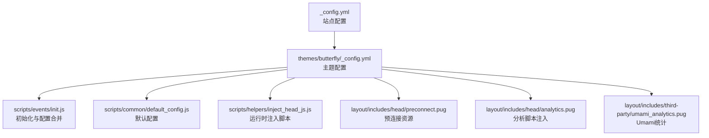
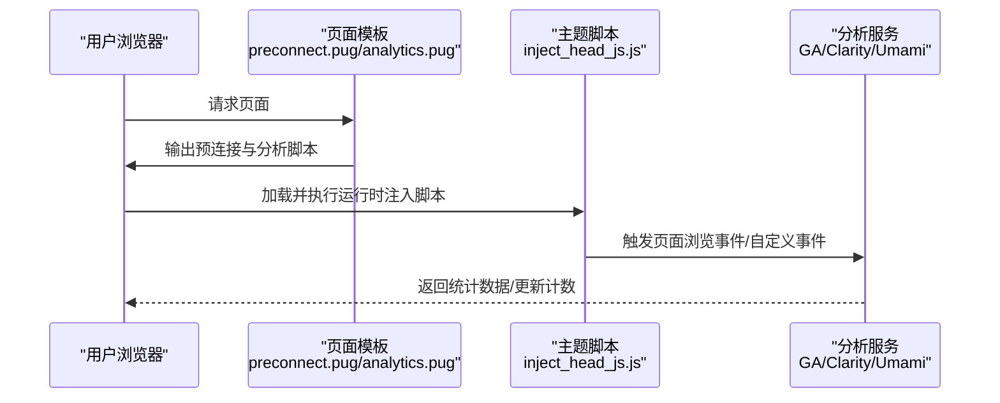
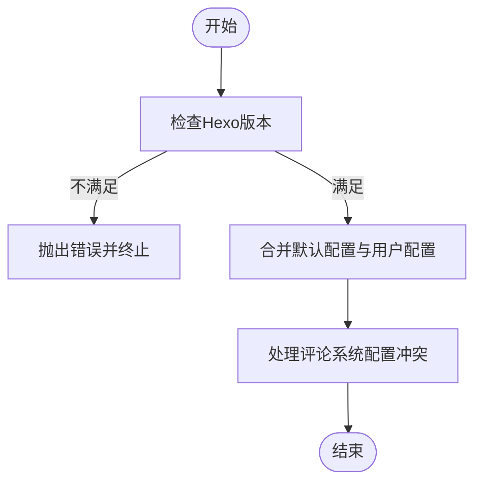
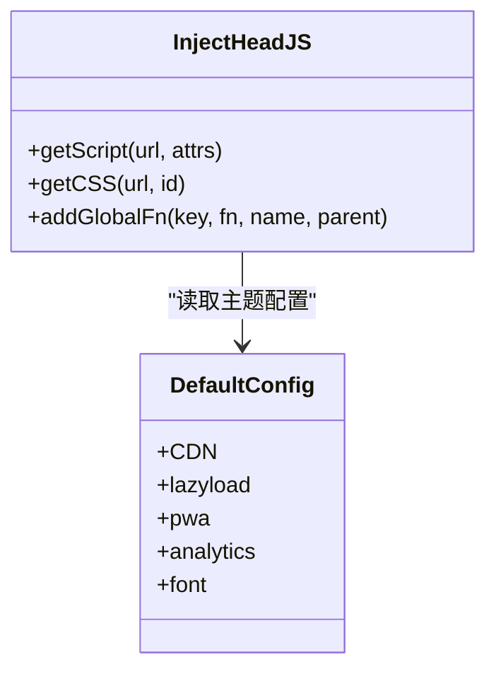
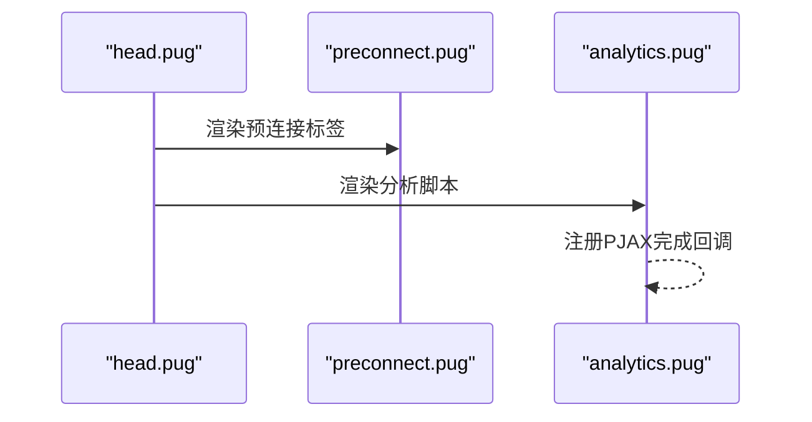
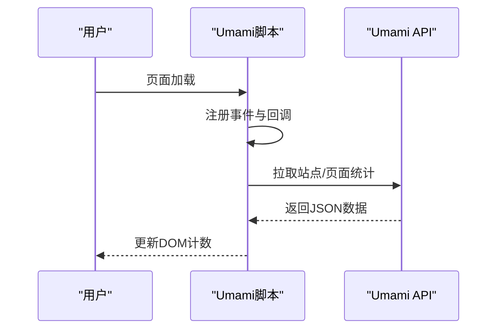
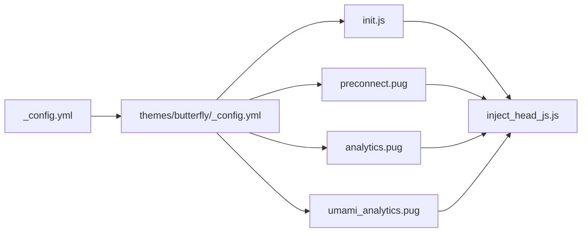

# 性能指标监控

<cite>
**本文引用的文件**
- [_config.yml](file://_config.yml)
- [package.json](file://package.json)
- [themes/butterfly/_config.yml](file://themes/butterfly/_config.yml)
- [themes/butterfly/scripts/events/init.js](file://themes/butterfly/scripts/events/init.js)
- [themes/butterfly/scripts/common/default_config.js](file://themes/butterfly/scripts/common/default_config.js)
- [themes/butterfly/scripts/helpers/inject_head_js.js](file://themes/butterfly/scripts/helpers/inject_head_js.js)
- [themes/butterfly/layout/includes/head/preconnect.pug](file://themes/butterfly/layout/includes/head/preconnect.pug)
- [themes/butterfly/layout/includes/head/analytics.pug](file://themes/butterfly/layout/includes/head/analytics.pug)
- [themes/butterfly/layout/includes/third-party/umami_analytics.pug](file://themes/butterfly/layout/includes/third-party/umami_analytics.pug)
</cite>

## 目录
1. [简介](#简介)
2. [项目结构](#项目结构)
3. [核心组件](#核心组件)
4. [架构总览](#架构总览)
5. [详细组件分析](#详细组件分析)
6. [依赖关系分析](#依赖关系分析)
7. [性能考量](#性能考量)
8. [故障排查指南](#故障排查指南)
9. [结论](#结论)
10. [附录](#附录)

## 简介
本指南面向dzc-blog项目，聚焦于Core Web Vitals（LCP、FID、CLS）与关键性能指标（页面加载时间、用户交互延迟、视觉稳定性）的监控与优化。结合项目现有主题配置与脚本，给出可落地的监控方案、测试工具使用建议、数据采集与可视化路径，以及优化与排障实践。

## 项目结构
dzc-blog基于Hexo静态站点生成器，采用Butterfly主题。项目的关键性能相关点主要分布在：
- 站点配置：基础URL、分页、部署等
- 主题配置：CDN提供商、分析埋点、懒加载、PWA、预连接等
- 主题脚本：初始化校验、默认配置合并、运行时注入脚本、事件钩子
- 模板片段：头部分析脚本注入、预连接资源、第三方统计集成

图表来源
- [_config.yml:1-107](file://_config.yml#L1-L107)
- [themes/butterfly/_config.yml:1-1140](file://themes/butterfly/_config.yml#L1-L1140)
- [themes/butterfly/scripts/events/init.js:1-87](file://themes/butterfly/scripts/events/init.js#L1-L87)
- [themes/butterfly/scripts/common/default_config.js:1-602](file://themes/butterfly/scripts/common/default_config.js#L1-L602)
- [themes/butterfly/scripts/helpers/inject_head_js.js:1-156](file://themes/butterfly/scripts/helpers/inject_head_js.js#L1-L156)
- [themes/butterfly/layout/includes/head/preconnect.pug:1-35](file://themes/butterfly/layout/includes/head/preconnect.pug#L1-L35)
- [themes/butterfly/layout/includes/head/analytics.pug:1-45](file://themes/butterfly/layout/includes/head/analytics.pug#L1-L45)
- [themes/butterfly/layout/includes/third-party/umami_analytics.pug:1-110](file://themes/butterfly/layout/includes/third-party/umami_analytics.pug#L1-L110)

章节来源
- [_config.yml:1-107](file://_config.yml#L1-L107)
- [themes/butterfly/_config.yml:1-1140](file://themes/butterfly/_config.yml#L1-L1140)

## 核心组件
- 站点配置与部署
  - URL、分页、部署到GitHub Pages等在站点配置中定义，影响首屏加载与缓存策略。
- 主题配置与CDN
  - 主题配置支持CDN提供商选择、字体预连接、分析脚本开关等，直接影响资源加载性能。
- 初始化与配置合并
  - 主题初始化脚本负责环境检查、默认配置合并与评论系统冲突处理，确保后续注入逻辑稳定。
- 运行时注入脚本
  - 注入通用工具函数、动态加载脚本/样式、全局事件钩子（如PJAX完成回调），为性能埋点与统计提供统一入口。
- 预连接与分析脚本
  - 通过预连接减少DNS/TCP耗时；分析脚本按需注入，支持GA、百度统计、Cloudflare Clarity、Google Tag Manager、Umami等。

章节来源
- [themes/butterfly/scripts/events/init.js:1-87](file://themes/butterfly/scripts/events/init.js#L1-L87)
- [themes/butterfly/scripts/common/default_config.js:1-602](file://themes/butterfly/scripts/common/default_config.js#L1-L602)
- [themes/butterfly/scripts/helpers/inject_head_js.js:1-156](file://themes/butterfly/scripts/helpers/inject_head_js.js#L1-L156)
- [themes/butterfly/layout/includes/head/preconnect.pug:1-35](file://themes/butterfly/layout/includes/head/preconnect.pug#L1-L35)
- [themes/butterfly/layout/includes/head/analytics.pug:1-45](file://themes/butterfly/layout/includes/head/analytics.pug#L1-L45)
- [themes/butterfly/layout/includes/third-party/umami_analytics.pug:1-110](file://themes/butterfly/layout/includes/third-party/umami_analytics.pug#L1-L110)

## 架构总览
下图展示了从页面渲染到性能数据采集的整体流程，涵盖资源预连接、分析脚本注入、统计调用与数据回传。

图表来源
- [themes/butterfly/layout/includes/head/preconnect.pug:1-35](file://themes/butterfly/layout/includes/head/preconnect.pug#L1-L35)
- [themes/butterfly/layout/includes/head/analytics.pug:1-45](file://themes/butterfly/layout/includes/head/analytics.pug#L1-L45)
- [themes/butterfly/scripts/helpers/inject_head_js.js:1-156](file://themes/butterfly/scripts/helpers/inject_head_js.js#L1-L156)
- [themes/butterfly/layout/includes/third-party/umami_analytics.pug:1-110](file://themes/butterfly/layout/includes/third-party/umami_analytics.pug#L1-L110)

## 详细组件分析

### 组件A：初始化与配置合并（init.js）
- 功能要点
  - 检查Hexo版本是否满足最低要求
  - 合并默认配置与用户配置
  - 处理评论系统配置冲突
- 性能意义
  - 防止旧版Hexo导致构建异常，保障后续注入脚本与模板渲染稳定

图表来源
- [themes/butterfly/scripts/events/init.js:1-87](file://themes/butterfly/scripts/events/init.js#L1-L87)

章节来源
- [themes/butterfly/scripts/events/init.js:1-87](file://themes/butterfly/scripts/events/init.js#L1-L87)

### 组件B：默认配置与运行时注入（default_config.js、inject_head_js.js）
- 默认配置
  - 提供CDN、懒加载、PWA、分析、字体等默认项，便于统一开启/关闭
- 运行时注入
  - 提供getScript/getCSS、addGlobalFn等工具，支持异步加载与事件钩子注册
  - 支持暗色模式切换、侧栏状态、设备检测等行为，间接影响交互体验

图表来源
- [themes/butterfly/scripts/helpers/inject_head_js.js:1-156](file://themes/butterfly/scripts/helpers/inject_head_js.js#L1-L156)
- [themes/butterfly/scripts/common/default_config.js:1-602](file://themes/butterfly/scripts/common/default_config.js#L1-L602)

章节来源
- [themes/butterfly/scripts/common/default_config.js:1-602](file://themes/butterfly/scripts/common/default_config.js#L1-L602)
- [themes/butterfly/scripts/helpers/inject_head_js.js:1-156](file://themes/butterfly/scripts/helpers/inject_head_js.js#L1-L156)

### 组件C：预连接与分析脚本注入（preconnect.pug、analytics.pug）
- 预连接
  - 对CDN、分析服务、字体源进行预连接，降低DNS解析与TCP握手开销
- 分析脚本
  - 条件性注入GA、百度统计、Cloudflare Clarity、GTAG等，并在PJAX完成后刷新页面路径或触发事件

图表来源
- [themes/butterfly/layout/includes/head/preconnect.pug:1-35](file://themes/butterfly/layout/includes/head/preconnect.pug#L1-L35)
- [themes/butterfly/layout/includes/head/analytics.pug:1-45](file://themes/butterfly/layout/includes/head/analytics.pug#L1-L45)

章节来源
- [themes/butterfly/layout/includes/head/preconnect.pug:1-35](file://themes/butterfly/layout/includes/head/preconnect.pug#L1-L35)
- [themes/butterfly/layout/includes/head/analytics.pug:1-45](file://themes/butterfly/layout/includes/head/analytics.pug#L1-L45)

### 组件D：Umami统计集成（umami_analytics.pug）
- 能力
  - 动态加载Umami脚本，注册自定义事件跟踪
  - 在页面加载后拉取站点/页面访问量并插入DOM元素
  - 支持本地与云服务两种部署方式
- 性能意义
  - 通过异步加载避免阻塞主线程；统计接口返回值用于可视化展示

图表来源
- [themes/butterfly/layout/includes/third-party/umami_analytics.pug:1-110](file://themes/butterfly/layout/includes/third-party/umami_analytics.pug#L1-L110)

章节来源
- [themes/butterfly/layout/includes/third-party/umami_analytics.pug:1-110](file://themes/butterfly/layout/includes/third-party/umami_analytics.pug#L1-L110)

## 依赖关系分析
- 配置耦合
  - 站点配置决定URL与分页，影响分析脚本的页面路径上报
  - 主题配置决定CDN与分析服务开关，影响资源加载与数据采集
- 运行时依赖
  - 注入脚本依赖主题配置中的CDN与分析开关
  - Umami统计依赖网络请求与DOM更新，需考虑失败重试与降级

图表来源
- [_config.yml:1-107](file://_config.yml#L1-L107)
- [themes/butterfly/_config.yml:1-1140](file://themes/butterfly/_config.yml#L1-L1140)
- [themes/butterfly/scripts/events/init.js:1-87](file://themes/butterfly/scripts/events/init.js#L1-L87)
- [themes/butterfly/layout/includes/head/preconnect.pug:1-35](file://themes/butterfly/layout/includes/head/preconnect.pug#L1-L35)
- [themes/butterfly/layout/includes/head/analytics.pug:1-45](file://themes/butterfly/layout/includes/head/analytics.pug#L1-L45)
- [themes/butterfly/layout/includes/third-party/umami_analytics.pug:1-110](file://themes/butterfly/layout/includes/third-party/umami_analytics.pug#L1-L110)
- [themes/butterfly/scripts/helpers/inject_head_js.js:1-156](file://themes/butterfly/scripts/helpers/inject_head_js.js#L1-L156)

章节来源
- [themes/butterfly/_config.yml:1-1140](file://themes/butterfly/_config.yml#L1-L1140)
- [themes/butterfly/scripts/events/init.js:1-87](file://themes/butterfly/scripts/events/init.js#L1-L87)

## 性能考量
- Core Web Vitals指标
  - LCP（最大内容绘制）：关注首屏图片与关键元素的加载时机，结合预连接与CDN加速
  - FID（首次输入延迟）：减少主线程阻塞，避免大脚本同步加载；利用异步加载与事件钩子
  - CLS（累积布局偏移）：为图片/iframe设置尺寸，避免动态插入内容导致位移
- 关键指标
  - 页面加载时间：预连接、CDN、缓存策略
  - 用户交互延迟：脚本异步化、事件节流/防抖
  - 视觉稳定性：占位符、固定尺寸、骨架屏
- 工具链
  - WebPageTest：跨地域、跨设备对比测试
  - Lighthouse：自动化审计与报告
  - Chrome DevTools：Network/Performance/Rendering面板深度分析

[本节为通用指导，无需列出具体文件来源]

## 故障排查指南
- 分析脚本未生效
  - 检查主题配置中对应分析服务的开关与参数是否正确
  - 确认模板已输出相应脚本与预连接标签
- Umami统计异常
  - 网络请求失败：查看控制台错误与网络面板
  - 数据为空：确认token与API地址配置正确
- PJAX完成后事件未触发
  - 确认运行时注入脚本已加载，且addGlobalFn注册成功
- 资源加载缓慢
  - 检查CDN提供商与预连接配置，确认DNS/TCP耗时是否降低

章节来源
- [themes/butterfly/layout/includes/head/analytics.pug:1-45](file://themes/butterfly/layout/includes/head/analytics.pug#L1-L45)
- [themes/butterfly/layout/includes/third-party/umami_analytics.pug:1-110](file://themes/butterfly/layout/includes/third-party/umami_analytics.pug#L1-L110)
- [themes/butterfly/scripts/helpers/inject_head_js.js:1-156](file://themes/butterfly/scripts/helpers/inject_head_js.js#L1-L156)

## 结论
通过合理配置CDN与预连接、按需注入分析脚本、利用异步加载与事件钩子，dzc-blog可在保证功能完整性的同时提升关键性能指标表现。建议以WebPageTest、Lighthouse、DevTools为工具，持续监测LCP/FID/CLS与加载时间、交互延迟、视觉稳定性，并结合Umami等统计进行长期趋势追踪与优化闭环。

[本节为总结性内容，无需列出具体文件来源]

## 附录
- 性能测试工具使用建议
  - WebPageTest：选择目标URL与测试地点，观察瀑布图与关键指标曲线
  - Lighthouse：定期生成报告，关注性能、可访问性、SEO等维度
  - Chrome DevTools：录制性能、捕获内存快照、启用Rendering面板观察布局偏移
- 数据采集与可视化
  - 使用Umami API拉取统计数据，结合前端DOM更新或独立仪表盘展示
  - 将分析脚本的事件上报与页面路径刷新纳入统一埋点体系
- 最佳实践清单
  - 开启预连接与CDN
  - 异步加载非关键脚本
  - 为图片设置宽高，避免CLS
  - 控制主线程任务，缩短FID
  - 定期评估与回归测试

[本节为通用指导，无需列出具体文件来源]