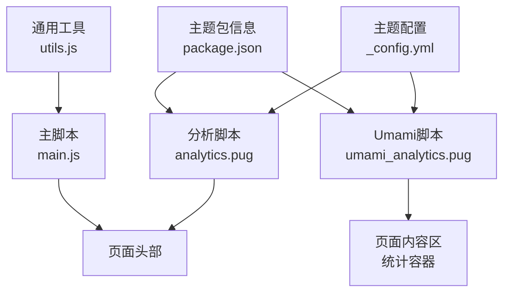
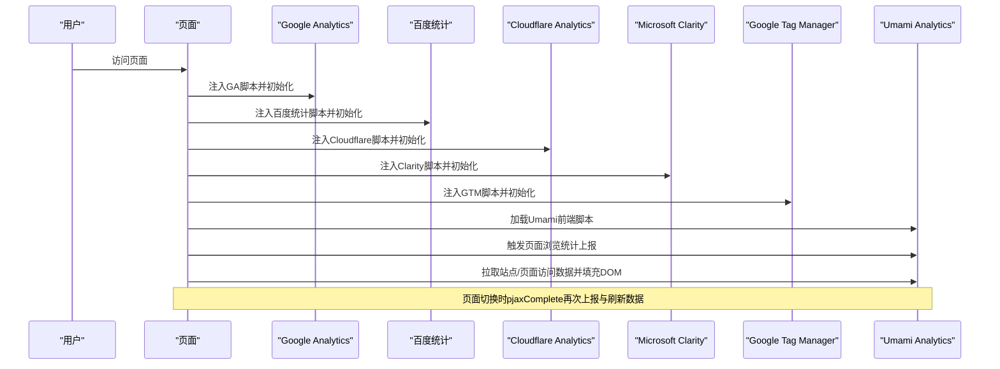
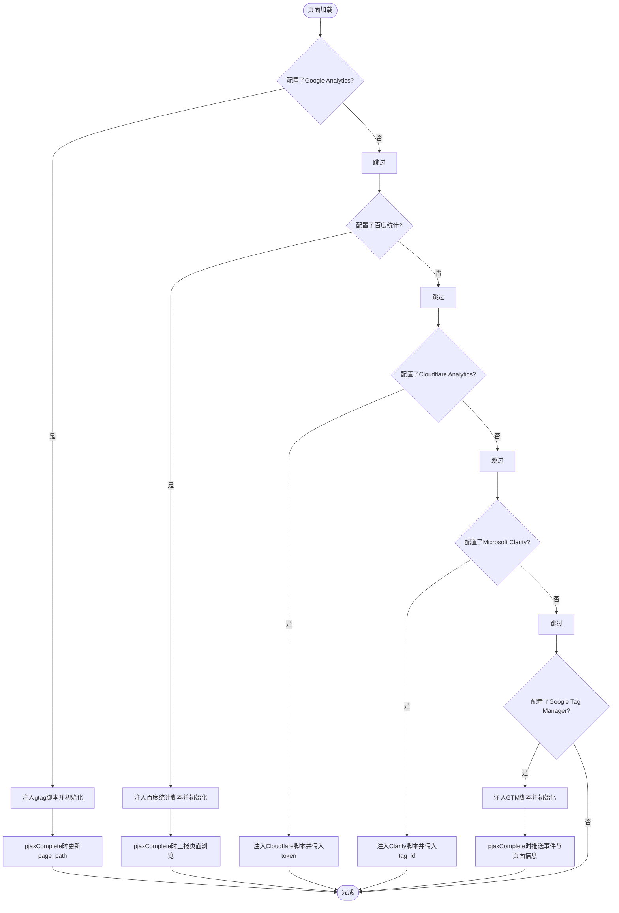
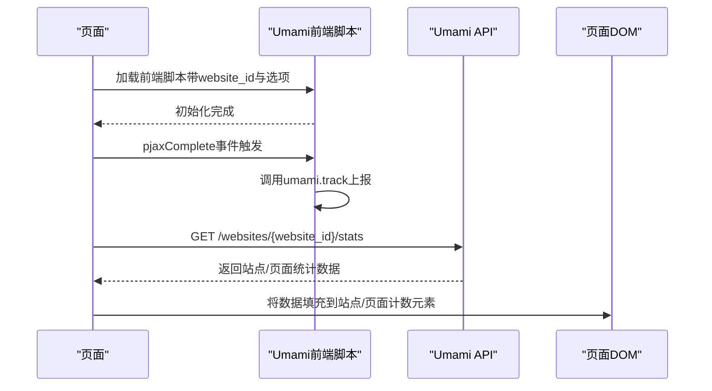
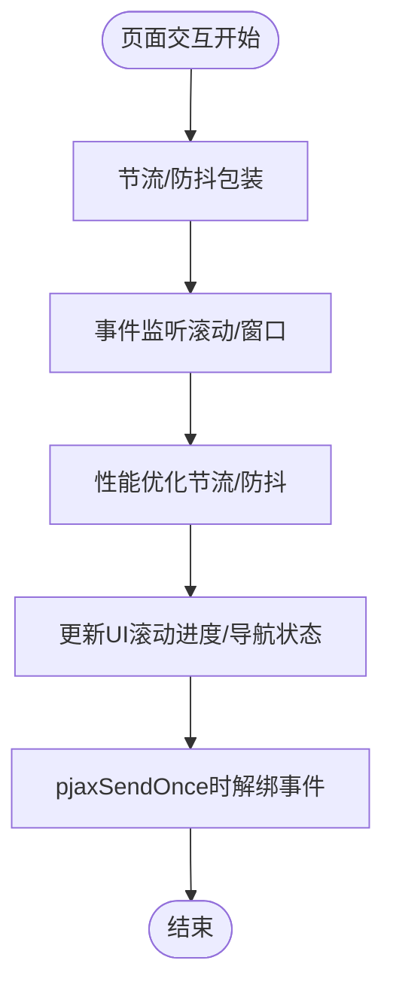
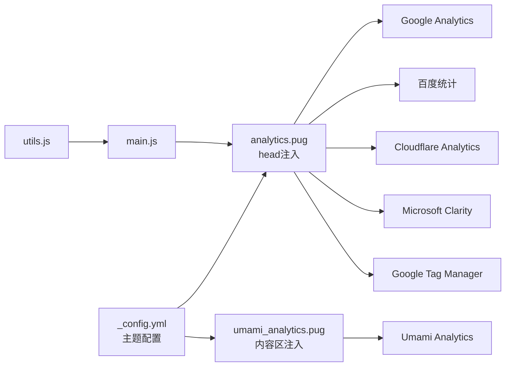

# 性能监控

<cite>
**本文引用的文件**
- [主题配置（_config.yml）](file://themes/butterfly/_config.yml)
- [默认配置（default_config.js）](file://themes/butterfly/scripts/common/default_config.js)
- [分析脚本（analytics.pug）](file://themes/butterfly/layout/includes/head/analytics.pug)
- [Umami 分析脚本（umami_analytics.pug）](file://themes/butterfly/layout/includes/third-party/umami_analytics.pug)
- [通用工具（utils.js）](file://themes/butterfly/source/js/utils.js)
- [主脚本（main.js）](file://themes/butterfly/source/js/main.js)
- [主题包信息（package.json）](file://themes/butterfly/package.json)
</cite>

## 目录
1. [简介](#简介)
2. [项目结构](#项目结构)
3. [核心组件](#核心组件)
4. [架构总览](#架构总览)
5. [详细组件分析](#详细组件分析)
6. [依赖关系分析](#依赖关系分析)
7. [性能考量](#性能考量)
8. [故障排查指南](#故障排查指南)
9. [结论](#结论)
10. [附录](#附录)

## 简介
本指南面向dzc-blog项目，聚焦于基于Butterfly主题的性能监控实践。内容覆盖加载时间测量、用户行为分析与错误追踪策略，以及与第三方分析平台（Google Analytics、百度统计、Cloudflare Analytics、Microsoft Clarity、Google Tag Manager、Umami Analytics）的集成配置。文档同时给出性能指标（如Core Web Vitals中的LCP、FID、CLS）的定义与计算思路，并提供性能测试工具使用建议与数据分析技巧，帮助读者建立可落地的性能监控体系。

## 项目结构
dzc-blog采用Hexo + Butterfly主题的静态博客架构。性能监控能力主要由Butterfly主题在页面头部注入分析脚本与在文章页侧边栏/内容区插入数据展示容器实现。关键位置如下：
- 主题配置：集中定义各分析平台开关与参数
- 分析脚本：在<head>中按需注入第三方统计脚本
- Umami脚本：负责加载Umami前端脚本并拉取站点/页面访问数据
- 通用工具：提供节流/防抖、滚动进度、平滑滚动等基础能力
- 主脚本：页面交互、滚动处理、TOC锚点等逻辑入口

**图表来源**
- [主题配置（_config.yml）](file://themes/butterfly/_config.yml)
- [分析脚本（analytics.pug）](file://themes/butterfly/layout/includes/head/analytics.pug)
- [Umami 分析脚本（umami_analytics.pug）](file://themes/butterfly/layout/includes/third-party/umami_analytics.pug)
- [通用工具（utils.js）](file://themes/butterfly/source/js/utils.js)
- [主脚本（main.js）](file://themes/butterfly/source/js/main.js)
- [主题包信息（package.json）](file://themes/butterfly/package.json)

**章节来源**
- [主题配置（_config.yml）](file://themes/butterfly/_config.yml)
- [分析脚本（analytics.pug）](file://themes/butterfly/layout/includes/head/analytics.pug)
- [Umami 分析脚本（umami_analytics.pug）](file://themes/butterfly/layout/includes/third-party/umami_analytics.pug)
- [通用工具（utils.js）](file://themes/butterfly/source/js/utils.js)
- [主脚本（main.js）](file://themes/butterfly/source/js/main.js)
- [主题包信息（package.json）](file://themes/butterfly/package.json)

## 核心组件
- 分析平台配置与开关
  - 百度统计、Google Analytics、Cloudflare Analytics、Microsoft Clarity、Google Tag Manager、Umami Analytics均通过主题配置项开启/关闭与参数注入。
  - 默认配置文件提供了完整的字段清单与默认值，便于统一管理与扩展。
- 分析脚本注入
  - 在<head>中按条件加载对应平台脚本；对GA、Baidu、Clarity、GTM分别注入初始化与页面切换事件（pjaxComplete）回调。
- Umami 数据拉取
  - 加载前端脚本后，通过定时或页面事件触发统计上报；同时支持从API拉取站点/页面访问数据并填充到指定DOM节点。
- 通用工具与主脚本
  - 提供节流/防抖、滚动进度计算、平滑滚动、事件绑定与解绑等能力，为性能优化与交互体验提供基础。

**章节来源**
- [主题配置（_config.yml）](file://themes/butterfly/_config.yml)
- [默认配置（default_config.js）](file://themes/butterfly/scripts/common/default_config.js)
- [分析脚本（analytics.pug）](file://themes/butterfly/layout/includes/head/analytics.pug)
- [Umami 分析脚本（umami_analytics.pug）](file://themes/butterfly/layout/includes/third-party/umami_analytics.pug)
- [通用工具（utils.js）](file://themes/butterfly/source/js/utils.js)
- [主脚本（main.js）](file://themes/butterfly/source/js/main.js)

## 架构总览
下图展示了页面生命周期中分析脚本与Umami数据拉取的关键流程：

**图表来源**
- [分析脚本（analytics.pug）](file://themes/butterfly/layout/includes/head/analytics.pug)
- [Umami 分析脚本（umami_analytics.pug）](file://themes/butterfly/layout/includes/third-party/umami_analytics.pug)

## 详细组件分析

### 组件A：分析脚本注入（analytics.pug）
- 功能要点
  - 条件加载：仅当配置项存在时才注入对应脚本。
  - 初始化：为GA、Baidu、Clarity、GTM分别注入初始化代码。
  - 页面切换：在pjaxComplete事件中重新上报或更新页面路径/标题。
- 关键行为
  - GA：注入gtag初始化与页面路径更新。
  - 百度统计：注入_hmt初始化与pjaxComplete页面浏览上报。
  - Cloudflare：注入beacon脚本并传入token。
  - Microsoft Clarity：注入clarity脚本并传入tag_id。
  - GTM：注入gtm脚本并在pjaxComplete时推送事件与页面信息。

**图表来源**
- [分析脚本（analytics.pug）](file://themes/butterfly/layout/includes/head/analytics.pug)

**章节来源**
- [分析脚本（analytics.pug）](file://themes/butterfly/layout/includes/head/analytics.pug)

### 组件B：Umami Analytics（umami_analytics.pug）
- 功能要点
  - 前端脚本加载：根据serverURL选择云端或自托管地址，注入前端脚本并传入website_id与选项。
  - 上报触发：在pjaxComplete时调用umami.track进行页面浏览统计。
  - 数据拉取：通过API查询站点/页面访问数据，填充到指定DOM节点（如站点PV、UV或页面PV）。
  - 错误处理：对脚本加载失败、API请求失败与数据格式异常进行日志输出与容错。
- 关键行为
  - 自托管与云端模式：根据serverURL自动切换API域名与鉴权头（Authorization或x-umami-api-key）。
  - DOM填充：根据pageType与配置决定是否填充页面PV与站点PV/UV。
  - 生命周期：在DOMContentLoaded或延迟执行时触发数据拉取。

**图表来源**
- [Umami 分析脚本（umami_analytics.pug）](file://themes/butterfly/layout/includes/third-party/umami_analytics.pug)

**章节来源**
- [Umami 分析脚本（umami_analytics.pug）](file://themes/butterfly/layout/includes/third-party/umami_analytics.pug)

### 组件C：通用工具与主脚本（utils.js、main.js）
- 通用工具（utils.js）
  - 节流/防抖：用于高频事件（如滚动、窗口大小变化）的性能优化。
  - 滚动进度：计算页面滚动百分比，用于右侧进度指示。
  - 平滑滚动：兼容性处理与动画帧驱动的平滑滚动。
  - 事件绑定：统一的addEventListener封装，配合pjaxSendOnce解绑，避免内存泄漏。
- 主脚本（main.js）
  - 处理导航、侧边栏、滚动、TOC锚点、图片灯箱、无限画廊等交互。
  - 使用节流/防抖优化滚动与窗口事件，降低主线程压力。

**图表来源**
- [通用工具（utils.js）](file://themes/butterfly/source/js/utils.js)
- [主脚本（main.js）](file://themes/butterfly/source/js/main.js)

**章节来源**
- [通用工具（utils.js）](file://themes/butterfly/source/js/utils.js)
- [主脚本（main.js）](file://themes/butterfly/source/js/main.js)

## 依赖关系分析
- 配置层
  - 主题配置文件集中声明各分析平台的开关与参数，确保一致性与可维护性。
  - 默认配置文件提供字段清单与默认值，便于二次开发与扩展。
- 渲染层
  - analytics.pug与umami_analytics.pug在<head>与页面内容区注入脚本与数据容器，形成“声明式”的监控能力。
- 运行时层
  - utils.js与main.js提供事件处理、性能优化与交互逻辑，间接影响监控数据的采集质量与用户体验。

**图表来源**
- [主题配置（_config.yml）](file://themes/butterfly/_config.yml)
- [分析脚本（analytics.pug）](file://themes/butterfly/layout/includes/head/analytics.pug)
- [Umami 分析脚本（umami_analytics.pug）](file://themes/butterfly/layout/includes/third-party/umami_analytics.pug)
- [通用工具（utils.js）](file://themes/butterfly/source/js/utils.js)
- [主脚本（main.js）](file://themes/butterfly/source/js/main.js)

**章节来源**
- [主题配置（_config.yml）](file://themes/butterfly/_config.yml)
- [默认配置（default_config.js）](file://themes/butterfly/scripts/common/default_config.js)
- [分析脚本（analytics.pug）](file://themes/butterfly/layout/includes/head/analytics.pug)
- [Umami 分析脚本（umami_analytics.pug）](file://themes/butterfly/layout/includes/third-party/umami_analytics.pug)
- [通用工具（utils.js）](file://themes/butterfly/source/js/utils.js)
- [主脚本（main.js）](file://themes/butterfly/source/js/main.js)

## 性能考量
- 加载时间测量
  - 利用浏览器Performance API与资源加载事件（如navigation timing）在页面初始化阶段记录关键时间点，结合分析平台的页面浏览事件进行对比验证。
  - 对于PWA或SPA场景，可在pjaxComplete事件中记录页面切换耗时，作为“感知加载时间”的补充。
- 用户行为分析
  - 通过GA/Clarity/GTM等平台的事件追踪与自定义变量，记录用户点击、滚动深度、停留时长等行为指标。
  - 结合Umami的数据拉取能力，实现站点/页面访问量的实时展示与对比。
- 错误追踪策略
  - 在脚本加载失败、API请求异常、数据格式不合法等场景下，记录console错误与网络状态码，辅助定位问题。
  - 对关键事件（如pjaxComplete）增加重试与降级逻辑，保证监控数据的连续性。
- 性能优化建议
  - 合理使用节流/防抖，减少高频事件对主线程的压力。
  - 将非关键脚本（如分析脚本）设置为异步加载，避免阻塞首屏渲染。
  - 对图片与媒体资源启用懒加载与合适的尺寸，降低CLS风险。

[本节为通用指导，无需列出具体文件来源]

## 故障排查指南
- 分析脚本未生效
  - 检查主题配置中对应平台的开关与参数是否正确填写。
  - 查看页面源码确认<head>中是否注入了相应脚本。
  - 若使用pjax，请确认pjaxComplete事件是否触发上报逻辑。
- Umami 数据不显示
  - 确认website_id与token配置正确，区分云端与自托管模式的鉴权头。
  - 检查API响应状态码与返回数据结构，关注控制台错误日志。
  - 确认页面DOM中存在用于填充数据的目标元素（如站点/页面计数容器）。
- 页面切换后数据未更新
  - 确认pjaxComplete事件已绑定并执行。
  - 检查页面类型判断与条件渲染逻辑（如仅在文章页显示页面PV）。
- 性能问题
  - 使用utils.js提供的节流/防抖函数优化高频事件处理。
  - 对图片灯箱、无限画廊等组件，检查加载时机与资源大小，避免阻塞主线程。

**章节来源**
- [分析脚本（analytics.pug）](file://themes/butterfly/layout/includes/head/analytics.pug)
- [Umami 分析脚本（umami_analytics.pug）](file://themes/butterfly/layout/includes/third-party/umami_analytics.pug)
- [通用工具（utils.js）](file://themes/butterfly/source/js/utils.js)
- [主脚本（main.js）](file://themes/butterfly/source/js/main.js)

## 结论
dzc-blog通过Butterfly主题实现了对多平台分析的统一接入与灵活配置。借助analytics.pug与umami_analytics.pug，项目能够在页面生命周期内稳定地采集用户行为与访问数据；配合utils.js与main.js的性能优化手段，可进一步提升用户体验与监控数据的准确性。建议在实际部署中：
- 明确各分析平台的职责边界与数据口径，避免重复采集。
- 建立监控告警机制，对关键指标异常与脚本错误进行及时通知。
- 定期评估性能指标（如LCP、FID、CLS），持续优化加载与交互体验。

[本节为总结性内容，无需列出具体文件来源]

## 附录

### 性能指标定义与计算方法（Core Web Vitals）
- LCP（最大内容绘制）
  - 定义：页面可见区域内最大图像或文本块的渲染时间。
  - 计算：以navigationStart为起点，记录最大内容元素的firstContentfulPaint至其完成渲染的时间差。
- FID（首次输入延迟）
  - 定义：从用户首次发生交互到浏览器实际响应该交互的时间。
  - 计算：记录用户第一次交互事件与回调函数开始执行之间的时间差。
- CLS（累积布局偏移）
  - 定义：页面在生命周期内发生的意外布局移动的累计得分。
  - 计算：对所有意外布局移动的单个位移分数求和，位移分数由移动距离与视口尺寸共同决定。

[本节为通用概念介绍，无需列出具体文件来源]

### 监控配置示例（路径指引）
- 启用Google Analytics
  - 在主题配置中设置google_analytics字段，参考路径：[主题配置（_config.yml）](file://themes/butterfly/_config.yml)
  - 对应注入逻辑位于：[分析脚本（analytics.pug）](file://themes/butterfly/layout/includes/head/analytics.pug)
- 启用百度统计
  - 在主题配置中设置baidu_analytics字段，参考路径：[主题配置（_config.yml）](file://themes/butterfly/_config.yml)
  - 对应注入逻辑位于：[分析脚本（analytics.pug）](file://themes/butterfly/layout/includes/head/analytics.pug)
- 启用Cloudflare Analytics
  - 在主题配置中设置cloudflare_analytics字段，参考路径：[主题配置（_config.yml）](file://themes/butterfly/_config.yml)
  - 对应注入逻辑位于：[分析脚本（analytics.pug）](file://themes/butterfly/layout/includes/head/analytics.pug)
- 启用Microsoft Clarity
  - 在主题配置中设置microsoft_clarity字段，参考路径：[主题配置（_config.yml）](file://themes/butterfly/_config.yml)
  - 对应注入逻辑位于：[分析脚本（analytics.pug）](file://themes/butterfly/layout/includes/head/analytics.pug)
- 启用Google Tag Manager
  - 在主题配置中设置google_tag_manager字段，参考路径：[主题配置（_config.yml）](file://themes/butterfly/_config.yml)
  - 对应注入逻辑位于：[分析脚本（analytics.pug）](file://themes/butterfly/layout/includes/head/analytics.pug)
- 启用Umami Analytics
  - 在主题配置中设置umami_analytics.enable与website_id等字段，参考路径：[主题配置（_config.yml）](file://themes/butterfly/_config.yml)
  - 对应注入逻辑位于：[Umami 分析脚本（umami_analytics.pug）](file://themes/butterfly/layout/includes/third-party/umami_analytics.pug)

**章节来源**
- [主题配置（_config.yml）](file://themes/butterfly/_config.yml)
- [分析脚本（analytics.pug）](file://themes/butterfly/layout/includes/head/analytics.pug)
- [Umami 分析脚本（umami_analytics.pug）](file://themes/butterfly/layout/includes/third-party/umami_analytics.pug)