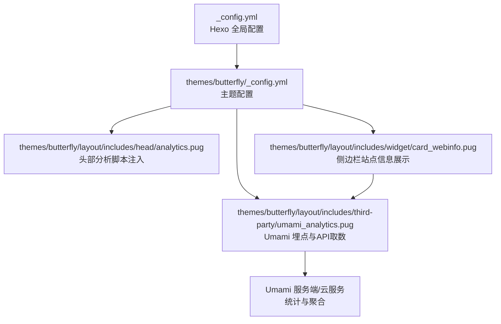
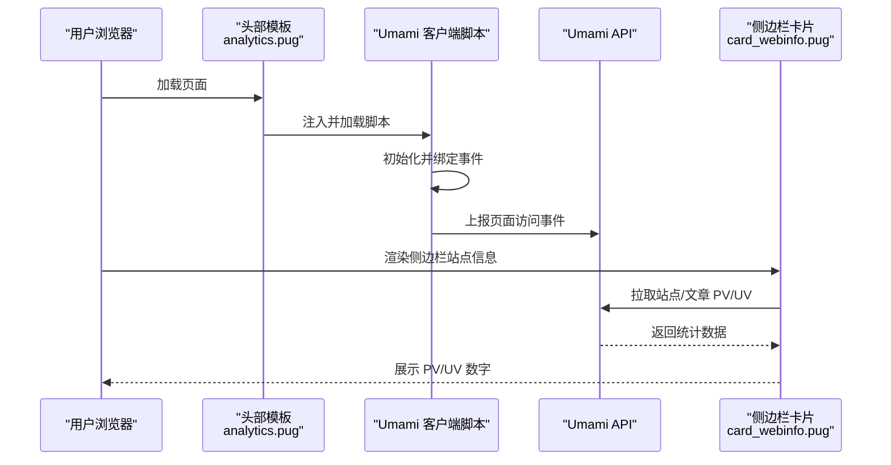
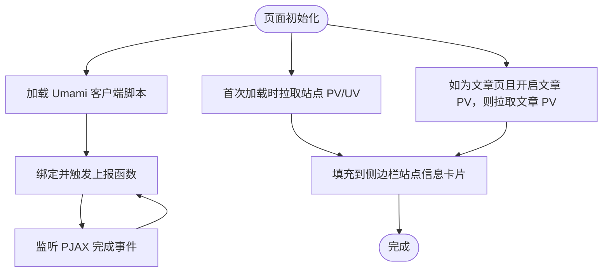
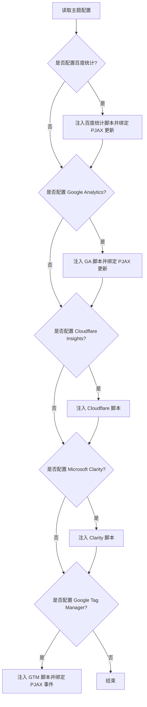
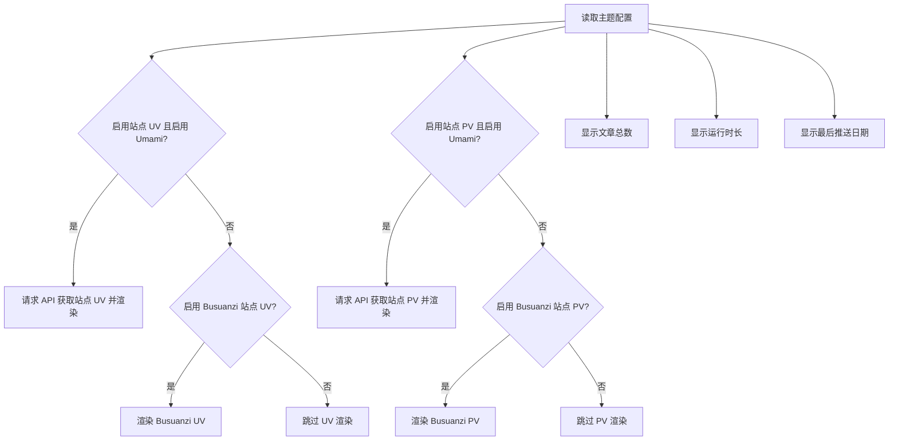
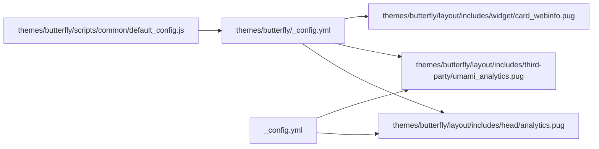

# 用户行为分析

<cite>
**本文引用的文件**
- [themes/butterfly/layout/includes/third-party/umami_analytics.pug](file://themes/butterfly/layout/includes/third-party/umami_analytics.pug)
- [themes/butterfly/layout/includes/head/analytics.pug](file://themes/butterfly/layout/includes/head/analytics.pug)
- [themes/butterfly/layout/includes/widget/card_webinfo.pug](file://themes/butterfly/layout/includes/widget/card_webinfo.pug)
- [themes/butterfly/_config.yml](file://themes/butterfly/_config.yml)
- [themes/butterfly/scripts/common/default_config.js](file://themes/butterfly/scripts/common/default_config.js)
- [_config.yml](file://_config.yml)
</cite>

## 目录
1. [简介](#简介)
2. [项目结构](#项目结构)
3. [核心组件](#核心组件)
4. [架构总览](#架构总览)
5. [详细组件分析](#详细组件分析)
6. [依赖关系分析](#依赖关系分析)
7. [性能考量](#性能考量)
8. [故障排查指南](#故障排查指南)
9. [结论](#结论)
10. [附录](#附录)

## 简介
本指南围绕 ddddzc’s blog 的用户行为分析能力，系统讲解页面浏览量（PV）、独立访客（UV）、页面停留时间与跳出率等关键指标的采集与展示路径；覆盖来源分析、设备与浏览器兼容性统计、地理位置分布等多维分析思路；并提供隐私友好的 Umami Analytics 配置与使用方法，以及数据解读、趋势分析与业务洞察提取技巧，帮助你基于前端埋点与 API 数据驱动内容优化与个性化推荐。

## 项目结构
dzc-blog 使用 Hexo + Butterfly 主题，用户行为分析主要通过主题配置与模板片段实现：
- 分析脚本注入：在站点头部模板中按需加载百度统计、Google Analytics、Cloudflare Insights、Microsoft Clarity、Google Tag Manager 等第三方分析脚本。
- Umami 埋点与展示：通过第三方分析模板片段动态加载 Umami 客户端脚本并上报页面访问事件；同时通过 API 获取站点与文章级 PV/UV 并渲染到侧边栏“站点信息”卡片。
- 默认配置：主题默认配置文件提供各项分析开关与参数的默认值，便于统一管理。

图表来源
- [_config.yml:1-107](file://_config.yml#L1-L107)
- [themes/butterfly/_config.yml:687-722](file://themes/butterfly/_config.yml#L687-L722)
- [themes/butterfly/layout/includes/head/analytics.pug:1-45](file://themes/butterfly/layout/includes/head/analytics.pug#L1-L45)
- [themes/butterfly/layout/includes/third-party/umami_analytics.pug:1-110](file://themes/butterfly/layout/includes/third-party/umami_analytics.pug#L1-L110)
- [themes/butterfly/layout/includes/widget/card_webinfo.pug:1-44](file://themes/butterfly/layout/includes/widget/card_webinfo.pug#L1-L44)

章节来源
- [_config.yml:1-107](file://_config.yml#L1-L107)
- [themes/butterfly/_config.yml:687-722](file://themes/butterfly/_config.yml#L687-L722)

## 核心组件
- 头部分析脚本注入：根据主题配置在页面头部动态插入百度统计、Google Analytics、Cloudflare Insights、Microsoft Clarity、Google Tag Manager 等脚本，并在 PJAX 页面切换时触发页面路径更新或事件上报。
- Umami 埋点与展示：动态加载 Umami 客户端脚本，上报页面访问事件；通过 API 获取站点与文章级 PV/UV 数据并填充到侧边栏卡片元素。
- 侧边栏站点信息：根据配置显示站点 PV/UV、文章数量、运行时长、最后推送日期等信息；当启用 Umami 时优先展示其 PV/UV，否则回退到 Busuanzi 统计。

章节来源
- [themes/butterfly/layout/includes/head/analytics.pug:1-45](file://themes/butterfly/layout/includes/head/analytics.pug#L1-L45)
- [themes/butterfly/layout/includes/third-party/umami_analytics.pug:1-110](file://themes/butterfly/layout/includes/third-party/umami_analytics.pug#L1-L110)
- [themes/butterfly/layout/includes/widget/card_webinfo.pug:1-44](file://themes/butterfly/layout/includes/widget/card_webinfo.pug#L1-L44)
- [themes/butterfly/_config.yml:687-722](file://themes/butterfly/_config.yml#L687-L722)

## 架构总览
下图展示了从页面加载到数据上报与展示的关键流程：

图表来源
- [themes/butterfly/layout/includes/head/analytics.pug:1-45](file://themes/butterfly/layout/includes/head/analytics.pug#L1-L45)
- [themes/butterfly/layout/includes/third-party/umami_analytics.pug:1-110](file://themes/butterfly/layout/includes/third-party/umami_analytics.pug#L1-L110)
- [themes/butterfly/layout/includes/widget/card_webinfo.pug:1-44](file://themes/butterfly/layout/includes/widget/card_webinfo.pug#L1-L44)

## 详细组件分析

### Umami 埋点与数据展示组件
该组件负责：
- 动态加载 Umami 客户端脚本（支持自托管与云服务两种模式）。
- 在页面切换（PJAX）后重新上报访问事件。
- 通过 API 获取站点与文章级 PV/UV，并填充到对应 DOM 元素。

图表来源
- [themes/butterfly/layout/includes/third-party/umami_analytics.pug:1-110](file://themes/butterfly/layout/includes/third-party/umami_analytics.pug#L1-L110)
- [themes/butterfly/layout/includes/widget/card_webinfo.pug:1-44](file://themes/butterfly/layout/includes/widget/card_webinfo.pug#L1-L44)

章节来源
- [themes/butterfly/layout/includes/third-party/umami_analytics.pug:1-110](file://themes/butterfly/layout/includes/third-party/umami_analytics.pug#L1-L110)
- [themes/butterfly/layout/includes/widget/card_webinfo.pug:1-44](file://themes/butterfly/layout/includes/widget/card_webinfo.pug#L1-L44)

### 头部分析脚本注入组件
该组件根据主题配置在页面头部注入多种分析脚本，并在 PJAX 页面切换时更新页面路径或触发事件上报，确保多平台分析的一致性。

图表来源
- [themes/butterfly/layout/includes/head/analytics.pug:1-45](file://themes/butterfly/layout/includes/head/analytics.pug#L1-L45)

章节来源
- [themes/butterfly/layout/includes/head/analytics.pug:1-45](file://themes/butterfly/layout/includes/head/analytics.pug#L1-L45)

### 侧边栏站点信息组件
该组件根据配置决定展示哪些统计项，优先使用 Umami 提供的 PV/UV，若未启用则回退到 Busuanzi。

图表来源
- [themes/butterfly/layout/includes/widget/card_webinfo.pug:1-44](file://themes/butterfly/layout/includes/widget/card_webinfo.pug#L1-L44)
- [themes/butterfly/_config.yml:687-722](file://themes/butterfly/_config.yml#L687-L722)

章节来源
- [themes/butterfly/layout/includes/widget/card_webinfo.pug:1-44](file://themes/butterfly/layout/includes/widget/card_webinfo.pug#L1-L44)
- [themes/butterfly/_config.yml:687-722](file://themes/butterfly/_config.yml#L687-L722)

## 依赖关系分析
- 主题配置文件集中定义了分析开关与参数，默认配置文件提供了各项分析的默认值，便于统一管理与扩展。
- 头部模板与第三方分析模板共同决定最终注入的分析脚本集合。
- 侧边栏站点信息依赖于 Umami 或 Busuanzi 的数据渲染，二者互为备选。

图表来源
- [themes/butterfly/_config.yml:687-722](file://themes/butterfly/_config.yml#L687-L722)
- [themes/butterfly/scripts/common/default_config.js:405-417](file://themes/butterfly/scripts/common/default_config.js#L405-L417)
- [themes/butterfly/layout/includes/head/analytics.pug:1-45](file://themes/butterfly/layout/includes/head/analytics.pug#L1-L45)
- [themes/butterfly/layout/includes/third-party/umami_analytics.pug:1-110](file://themes/butterfly/layout/includes/third-party/umami_analytics.pug#L1-L110)
- [themes/butterfly/layout/includes/widget/card_webinfo.pug:1-44](file://themes/butterfly/layout/includes/widget/card_webinfo.pug#L1-L44)
- [_config.yml:1-107](file://_config.yml#L1-L107)

章节来源
- [themes/butterfly/_config.yml:687-722](file://themes/butterfly/_config.yml#L687-L722)
- [themes/butterfly/scripts/common/default_config.js:405-417](file://themes/butterfly/scripts/common/default_config.js#L405-L417)
- [themes/butterfly/layout/includes/head/analytics.pug:1-45](file://themes/butterfly/layout/includes/head/analytics.pug#L1-L45)
- [themes/butterfly/layout/includes/third-party/umami_analytics.pug:1-110](file://themes/butterfly/layout/includes/third-party/umami_analytics.pug#L1-L110)
- [themes/butterfly/layout/includes/widget/card_webinfo.pug:1-44](file://themes/butterfly/layout/includes/widget/card_webinfo.pug#L1-L44)
- [_config.yml:1-107](file://_config.yml#L1-L107)

## 性能考量
- 脚本加载策略：头部模板按需注入分析脚本，避免不必要的资源开销；Umami 客户端脚本通过动态加载并在加载完成后执行上报，减少对首屏渲染的影响。
- API 取数时机：侧边栏数据在 DOMContentLoaded 或 PJAX 完成后异步拉取，避免阻塞页面交互。
- 缓存与预连接：可通过预连接链接优化第三方域名的解析与连接延迟，提升整体加载性能。
- 建议：在高并发场景下，建议对 API 请求进行节流与缓存，避免频繁重复请求；对 PV/UV 的更新采用合理的刷新间隔，平衡实时性与性能。

## 故障排查指南
- Umami 埋点无效
  - 检查主题配置中的 Umami 开关、网站 ID、脚本名称与令牌设置是否正确。
  - 查看控制台是否存在脚本加载失败或上报函数不可用的警告。
  - 确认 PJAX 完成事件是否正常触发，以保证页面切换后的上报逻辑生效。
- API 数据为空或异常
  - 确认请求头中携带的认证方式（云服务使用 Bearer，自托管使用 API Key）与配置一致。
  - 检查返回状态码与响应体，定位网络或权限问题。
- 侧边栏 PV/UV 不显示
  - 确认已启用站点 PV/UV 且 Umami 已配置；若未启用 Umami，则检查 Busuanzi 是否开启。
  - 检查对应 DOM 元素是否存在且未被样式遮挡。

章节来源
- [themes/butterfly/layout/includes/third-party/umami_analytics.pug:1-110](file://themes/butterfly/layout/includes/third-party/umami_analytics.pug#L1-L110)
- [themes/butterfly/layout/includes/widget/card_webinfo.pug:1-44](file://themes/butterfly/layout/includes/widget/card_webinfo.pug#L1-L44)

## 结论
dzc-blog 通过主题配置与模板片段实现了灵活的用户行为分析能力：既能利用多种主流分析平台进行流量与来源分析，也能借助隐私友好的 Umami 实现本地化与可控的数据采集。结合侧边栏 PV/UV 展示与 API 数据拉取，可快速形成对网站访问情况的可视化监控，并为进一步的趋势分析与业务洞察提供基础。

## 附录

### 配置与使用要点（Umami）
- 启用开关与参数
  - 在主题配置中启用 Umami，并填写网站 ID、脚本名称与令牌；如使用自托管实例，还需提供服务端地址。
- 埋点与上报
  - 客户端脚本会在页面加载与 PJAX 切换时自动上报页面访问事件。
- 数据展示
  - 侧边栏站点信息卡片会根据配置优先展示 Umami 提供的 PV/UV；未启用 Umami 时回退到 Busuanzi。
- API 认证
  - 云服务使用 Bearer Token，自托管使用 x-umami-api-key；请确保请求头与配置一致。

章节来源
- [themes/butterfly/_config.yml:702-716](file://themes/butterfly/_config.yml#L702-L716)
- [themes/butterfly/layout/includes/third-party/umami_analytics.pug:1-110](file://themes/butterfly/layout/includes/third-party/umami_analytics.pug#L1-L110)
- [themes/butterfly/layout/includes/widget/card_webinfo.pug:1-44](file://themes/butterfly/layout/includes/widget/card_webinfo.pug#L1-L44)

### 关键指标与分析方法
- 页面浏览量（PV）
  - 文章页：通过 API 获取当前文章的 PV 并渲染到页面元素。
  - 站点级：通过 API 获取站点总 PV 并渲染到侧边栏卡片。
- 独立访客（UV）
  - 通过 API 获取站点级 UV 并渲染到侧边栏卡片。
- 停留时间与跳出率
  - 当前实现侧重 PV/UV 展示；如需停留时间与跳出率，可在客户端脚本中补充会话时长计算与页面退出事件上报，并在服务端聚合统计。
- 来源分析、设备与浏览器、地理分布
  - 可通过头部模板注入的分析平台（如 Google Analytics、百度统计）获取来源、设备、浏览器与地理分布等维度数据；Umami 亦支持多维归因，具体取决于服务端配置与数据采集范围。

章节来源
- [themes/butterfly/layout/includes/third-party/umami_analytics.pug:1-110](file://themes/butterfly/layout/includes/third-party/umami_analytics.pug#L1-L110)
- [themes/butterfly/layout/includes/head/analytics.pug:1-45](file://themes/butterfly/layout/includes/head/analytics.pug#L1-L45)

### 数据解读与业务洞察
- 趋势分析
  - 对比不同时间段的 PV/UV 变化，识别内容热点与流量高峰时段。
- 内容优化
  - 将 PV/UV 与文章标签、分类关联，筛选高价值内容并优化同类内容的呈现。
- 个性化推荐
  - 基于用户来源、设备与浏览器偏好，结合文章 PV/UV 与评论互动数据，构建用户画像并输出推荐列表。
- 隐私与合规
  - 优先采用隐私友好的方案（如 Umami），明确数据收集范围与目的，保障用户知情权与选择权。