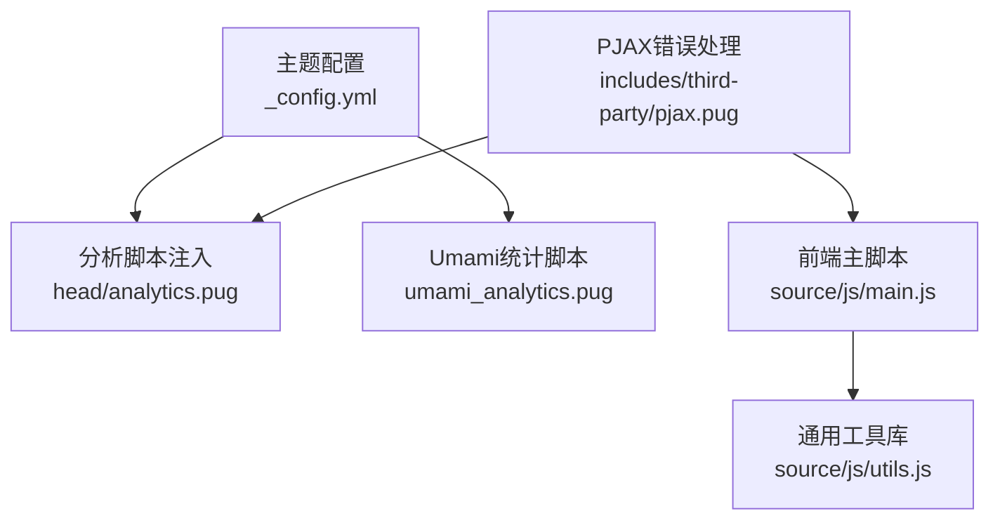
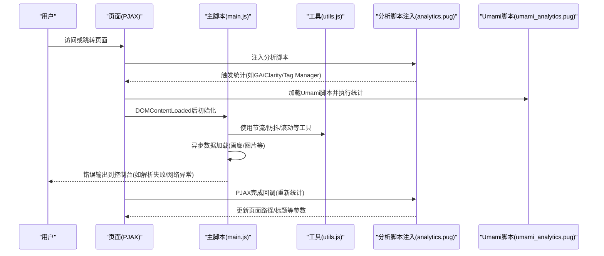
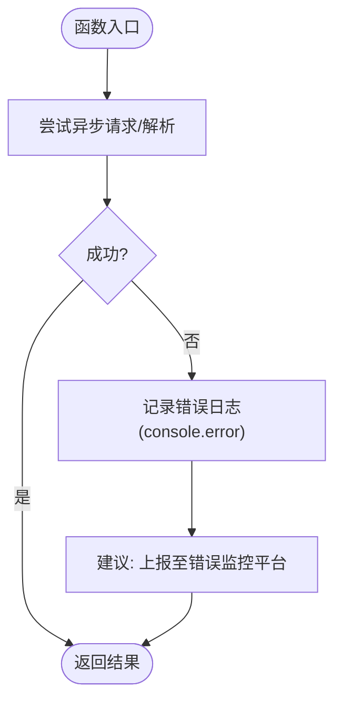
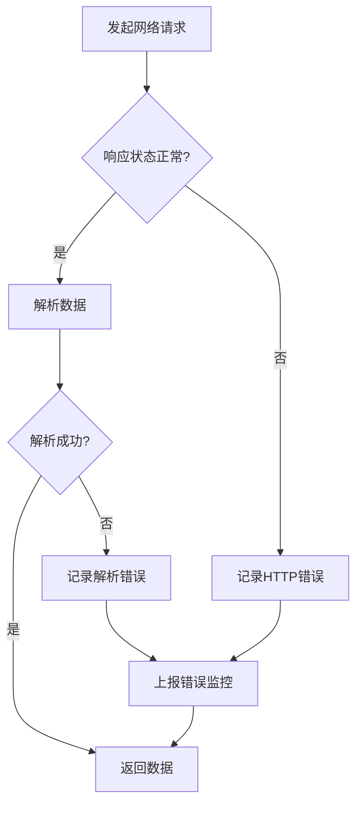
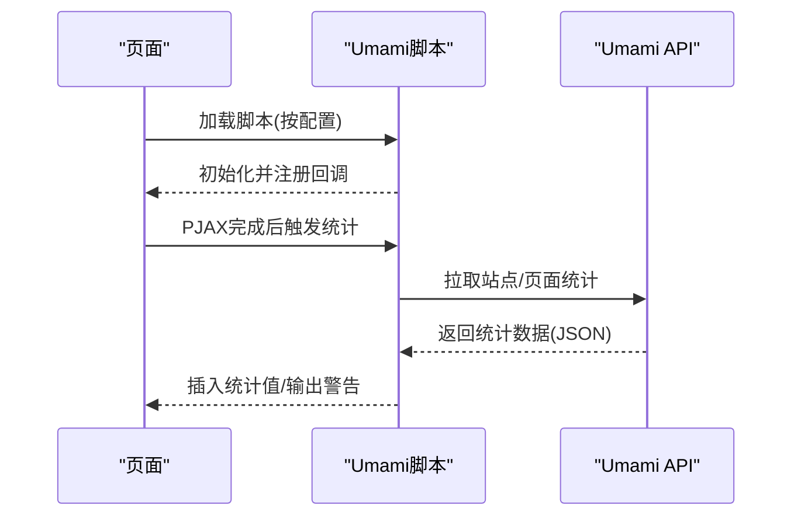
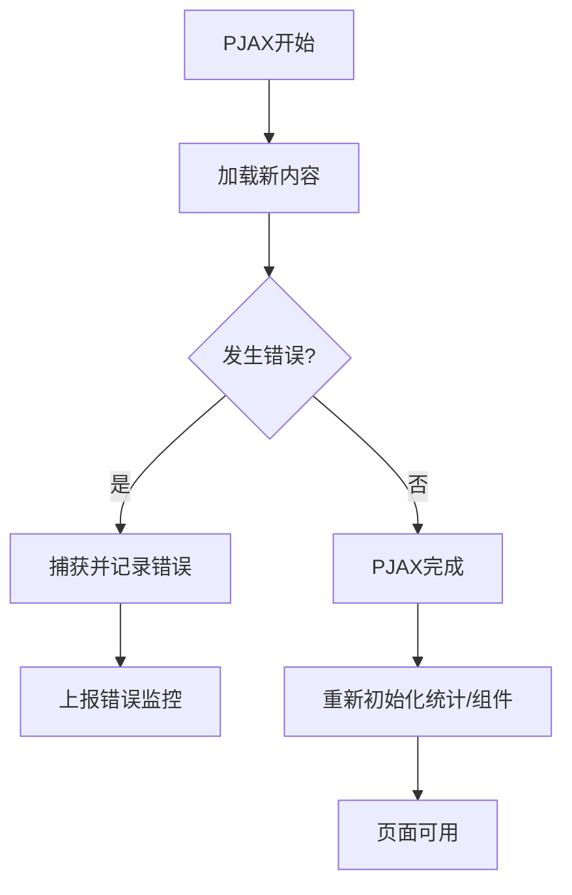
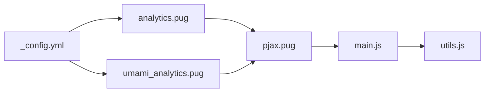

# 错误追踪与监控

<cite>
**本文引用的文件**
- [themes/butterfly/_config.yml](file://themes/butterfly/_config.yml)
- [themes/butterfly/scripts/common/default_config.js](file://themes/butterfly/scripts/common/default_config.js)
- [themes/butterfly/layout/includes/head/analytics.pug](file://themes/butterfly/layout/includes/head/analytics.pug)
- [themes/butterfly/layout/includes/third-party/umami_analytics.pug](file://themes/butterfly/layout/includes/third-party/umami_analytics.pug)
- [themes/butterfly/source/js/main.js](file://themes/butterfly/source/js/main.js)
- [themes/butterfly/source/js/utils.js](file://themes/butterfly/source/js/utils.js)
- [themes/butterfly/layout/includes/third-party/pjax.pug](file://themes/butterfly/layout/includes/third-party/pjax.pug)
- [package.json](file://package.json)
</cite>

## 目录
1. [简介](#简介)
2. [项目结构](#项目结构)
3. [核心组件](#核心组件)
4. [架构总览](#架构总览)
5. [详细组件分析](#详细组件分析)
6. [依赖关系分析](#依赖关系分析)
7. [性能考量](#性能考量)
8. [故障排查指南](#故障排查指南)
9. [结论](#结论)
10. [附录](#附录)

## 简介
本指南面向dzc-blog（基于Hexo与Butterfly主题）的前端错误追踪与监控，聚焦以下方面：
- 前端JavaScript运行时错误、网络请求失败、资源加载异常的监控与追踪
- 错误日志的采集、分类与分析策略
- 与专业错误监控服务（如Sentry、Bugsnag）的集成思路
- 错误优先级划分、影响范围评估与修复优先级制定
- 常见错误类型诊断与解决方案，以及预防性监控最佳实践

当前仓库未内置专业错误监控SDK，但具备完善的前端脚本与第三方统计埋点能力，可作为扩展基础。

## 项目结构
围绕错误监控的关键位置如下：
- 主题配置：用于开启/关闭分析与第三方统计（如Umami、百度/谷歌分析等）
- 前端脚本：负责页面交互、异步数据加载、图片画廊、滚动与节流防抖等逻辑
- 统计埋点：在页面生命周期中注入分析脚本，并在PJAX切换时触发重统计
- PJAX错误处理：对PJAX过程中的错误进行捕获与提示

图表来源
- [themes/butterfly/_config.yml](file://themes/butterfly/_config.yml)
- [themes/butterfly/layout/includes/head/analytics.pug](file://themes/butterfly/layout/includes/head/analytics.pug)
- [themes/butterfly/layout/includes/third-party/umami_analytics.pug](file://themes/butterfly/layout/includes/third-party/umami_analytics.pug)
- [themes/butterfly/source/js/main.js](file://themes/butterfly/source/js/main.js)
- [themes/butterfly/source/js/utils.js](file://themes/butterfly/source/js/utils.js)
- [themes/butterfly/layout/includes/third-party/pjax.pug](file://themes/butterfly/layout/includes/third-party/pjax.pug)

章节来源
- [themes/butterfly/_config.yml](file://themes/butterfly/_config.yml)
- [themes/butterfly/layout/includes/head/analytics.pug](file://themes/butterfly/layout/includes/head/analytics.pug)
- [themes/butterfly/layout/includes/third-party/umami_analytics.pug](file://themes/butterfly/layout/includes/third-party/umami_analytics.pug)
- [themes/butterfly/source/js/main.js](file://themes/butterfly/source/js/main.js)
- [themes/butterfly/source/js/utils.js](file://themes/butterfly/source/js/utils.js)
- [themes/butterfly/layout/includes/third-party/pjax.pug](file://themes/butterfly/layout/includes/third-party/pjax.pug)

## 核心组件
- 分析与统计注入：通过配置项启用百度统计、Google Analytics、Cloudflare分析、Microsoft Clarity、Google Tag Manager等；在PJAX完成时重新触发统计
- Umami统计：按站点配置加载Umami脚本，支持页面浏览量与访客数的异步拉取与展示
- 前端脚本与工具：
  - 异步数据加载与错误处理（如画廊数据解析失败、网络请求失败）
  - 节流/防抖工具，降低高频事件开销
  - 图片灯箱、无限画廊、滚动百分比等交互
- PJAX错误处理：捕获PJAX错误并输出到控制台，便于定位路由切换问题

章节来源
- [themes/butterfly/layout/includes/head/analytics.pug](file://themes/butterfly/layout/includes/head/analytics.pug)
- [themes/butterfly/layout/includes/third-party/umami_analytics.pug](file://themes/butterfly/layout/includes/third-party/umami_analytics.pug)
- [themes/butterfly/source/js/main.js](file://themes/butterfly/source/js/main.js)
- [themes/butterfly/source/js/utils.js](file://themes/butterfly/source/js/utils.js)
- [themes/butterfly/layout/includes/third-party/pjax.pug](file://themes/butterfly/layout/includes/third-party/pjax.pug)

## 架构总览
下图展示了从页面初始化到PJAX切换期间的错误监控与统计流程：

图表来源
- [themes/butterfly/layout/includes/head/analytics.pug](file://themes/butterfly/layout/includes/head/analytics.pug)
- [themes/butterfly/layout/includes/third-party/umami_analytics.pug](file://themes/butterfly/layout/includes/third-party/umami_analytics.pug)
- [themes/butterfly/source/js/main.js](file://themes/butterfly/source/js/main.js)
- [themes/butterfly/source/js/utils.js](file://themes/butterfly/source/js/utils.js)

## 详细组件分析

### 组件A：前端JavaScript错误监控与日志采集
- 关键点
  - 画廊数据解析失败与网络请求失败均通过console输出错误，便于在浏览器开发者工具中定位
  - 复制功能在权限或剪贴板API不可用时输出错误日志
  - 无限画廊在请求追加时使用节流/防抖，避免频繁触发
- 建议
  - 在生产环境增加统一错误上报（如Sentry/Bugsnag），将console.error内容转换为结构化事件
  - 对高频事件（滚动、缩放、请求追加）使用节流/防抖，减少重复错误上报
  - 为异步加载失败场景增加重试与降级提示

图表来源
- [themes/butterfly/source/js/main.js](file://themes/butterfly/source/js/main.js)

章节来源
- [themes/butterfly/source/js/main.js](file://themes/butterfly/source/js/main.js)

### 组件B：网络请求失败与资源加载异常
- 关键点
  - 画廊数据解析失败会输出错误日志
  - Umami脚本加载失败与API调用失败均有错误输出
- 建议
  - 对fetch请求增加超时与重试策略
  - 对第三方CDN资源增加备用源或降级方案
  - 将失败次数与失败URL结构化上报，便于趋势分析

图表来源
- [themes/butterfly/layout/includes/third-party/umami_analytics.pug](file://themes/butterfly/layout/includes/third-party/umami_analytics.pug)
- [themes/butterfly/source/js/main.js](file://themes/butterfly/source/js/main.js)

章节来源
- [themes/butterfly/layout/includes/third-party/umami_analytics.pug](file://themes/butterfly/layout/includes/third-party/umami_analytics.pug)
- [themes/butterfly/source/js/main.js](file://themes/butterfly/source/js/main.js)

### 组件C：Umami统计与错误上报
- 关键点
  - 按配置加载Umami脚本，支持自托管与云服务两种模式
  - 页面切换时通过PJAX回调重新触发统计
  - API拉取失败与数据格式异常有明确错误输出
- 建议
  - 将Umami统计失败纳入错误监控，区分“脚本加载失败”与“API调用失败”
  - 对统计接口增加缓存与降级，避免统计异常影响主业务

图表来源
- [themes/butterfly/layout/includes/third-party/umami_analytics.pug](file://themes/butterfly/layout/includes/third-party/umami_analytics.pug)

章节来源
- [themes/butterfly/layout/includes/third-party/umami_analytics.pug](file://themes/butterfly/layout/includes/third-party/umami_analytics.pug)

### 组件D：PJAX错误处理与页面生命周期
- 关键点
  - PJAX错误事件被捕获并输出到控制台
  - 分析脚本在PJAX完成后重新配置（如GA、Tag Manager）
- 建议
  - 将PJAX错误结构化上报，包含URL、错误类型、堆栈信息
  - 在PJAX开始/结束阶段增加埋点，辅助定位路由切换问题

图表来源
- [themes/butterfly/layout/includes/third-party/pjax.pug](file://themes/butterfly/layout/includes/third-party/pjax.pug)
- [themes/butterfly/layout/includes/head/analytics.pug](file://themes/butterfly/layout/includes/head/analytics.pug)

章节来源
- [themes/butterfly/layout/includes/third-party/pjax.pug](file://themes/butterfly/layout/includes/third-party/pjax.pug)
- [themes/butterfly/layout/includes/head/analytics.pug](file://themes/butterfly/layout/includes/head/analytics.pug)

### 组件E：复制与剪贴板错误
- 关键点
  - 复制到剪贴板失败时输出错误日志
- 建议
  - 对不支持的浏览器或权限限制场景提供替代方案（如提示用户手动复制）
  - 结构化上报失败原因（浏览器兼容性、权限、剪贴板API）

章节来源
- [themes/butterfly/source/js/main.js](file://themes/butterfly/source/js/main.js)

## 依赖关系分析
- 主题配置与分析脚本
  - 主题配置决定是否启用各类分析与统计
  - 分析脚本在页面头部注入，PJAX完成后再次触发
- 前端脚本与工具
  - main.js依赖utils.js提供的节流/防抖、滚动、加载指示等通用能力
- PJAX与统计联动
  - PJAX错误处理与统计回调共同作用于页面生命周期

图表来源
- [themes/butterfly/_config.yml](file://themes/butterfly/_config.yml)
- [themes/butterfly/layout/includes/head/analytics.pug](file://themes/butterfly/layout/includes/head/analytics.pug)
- [themes/butterfly/layout/includes/third-party/umami_analytics.pug](file://themes/butterfly/layout/includes/third-party/umami_analytics.pug)
- [themes/butterfly/layout/includes/third-party/pjax.pug](file://themes/butterfly/layout/includes/third-party/pjax.pug)
- [themes/butterfly/source/js/main.js](file://themes/butterfly/source/js/main.js)
- [themes/butterfly/source/js/utils.js](file://themes/butterfly/source/js/utils.js)

章节来源
- [themes/butterfly/_config.yml](file://themes/butterfly/_config.yml)
- [themes/butterfly/layout/includes/head/analytics.pug](file://themes/butterfly/layout/includes/head/analytics.pug)
- [themes/butterfly/layout/includes/third-party/umami_analytics.pug](file://themes/butterfly/layout/includes/third-party/umami_analytics.pug)
- [themes/butterfly/layout/includes/third-party/pjax.pug](file://themes/butterfly/layout/includes/third-party/pjax.pug)
- [themes/butterfly/source/js/main.js](file://themes/butterfly/source/js/main.js)
- [themes/butterfly/source/js/utils.js](file://themes/butterfly/source/js/utils.js)

## 性能考量
- 节流与防抖
  - 对滚动、尺寸变化、请求追加等高频事件使用节流/防抖，降低CPU占用与重复请求
- 资源加载
  - 对第三方CDN资源增加降级与缓存策略，避免因外部服务波动影响页面稳定性
- 统计与监控
  - 统一错误上报应采用批量发送与去抖动，避免对性能造成额外负担

## 故障排查指南
- 常见问题与定位
  - 画廊/图片加载异常：检查数据源URL与跨域设置，查看控制台错误输出
  - Umami统计异常：确认脚本加载地址与token配置，关注API返回状态
  - PJAX错误：查看控制台错误事件，结合URL与路由配置定位问题
- 建议流程
  - 收集：错误时间、URL、设备/浏览器、错误堆栈
  - 分类：前端运行时错误、网络请求失败、资源加载异常、统计/监控异常
  - 评估：影响范围（全局/特定页面/特定功能）、用户占比、复现难度
  - 修复：优先修复高影响与高频率错误，配合灰度发布验证

章节来源
- [themes/butterfly/layout/includes/third-party/umami_analytics.pug](file://themes/butterfly/layout/includes/third-party/umami_analytics.pug)
- [themes/butterfly/layout/includes/third-party/pjax.pug](file://themes/butterfly/layout/includes/third-party/pjax.pug)
- [themes/butterfly/source/js/main.js](file://themes/butterfly/source/js/main.js)

## 结论
- 当前项目已具备良好的前端脚本与统计埋点基础，可通过统一错误上报实现更全面的错误监控
- 建议引入专业错误监控服务（如Sentry、Bugsnag），将现有console输出转化为结构化事件
- 结合PJAX生命周期与统计回调，构建完整的错误监控闭环，提升问题定位效率与用户体验

## 附录

### 错误监控工具集成建议（Sentry/Bugsnag）
- 集成步骤
  - 在页面头部注入SDK脚本或通过包管理器安装
  - 初始化SDK并配置DSN、版本、用户上下文等
  - 包装全局错误捕获（window.onerror、unhandledrejection）与AJAX拦截
  - 对异步加载失败、画廊解析失败等场景补充上下文信息
- 上报字段建议
  - 错误类型、消息、堆栈、URL、用户代理、页面停留时长
  - 资源加载失败时包含资源URL与HTTP状态码
  - PJAX错误时包含路由参数与前后页面信息

### 错误优先级与修复策略
- 优先级划分
  - P0：导致页面崩溃或核心功能不可用
  - P1：影响大量用户或关键路径
  - P2：影响部分用户或非关键路径
  - P3：轻微体验问题或低频异常
- 影响范围评估
  - 用户规模、访问路径、设备/浏览器分布
  - 是否存在降级方案与回滚路径
- 修复优先级制定
  - 先P0/P1，再P2/P3；结合回归测试与灰度发布

### 预防性监控最佳实践
- 前置校验
  - 对第三方资源增加健康检查与备用源
  - 对异步接口增加超时与重试策略
- 实时告警
  - 设置错误率阈值与趋势告警
  - 对关键错误类型进行分级告警
- 回归保障
  - 将典型错误用例纳入自动化测试
  - 发布前进行A/B对比与性能基线检查