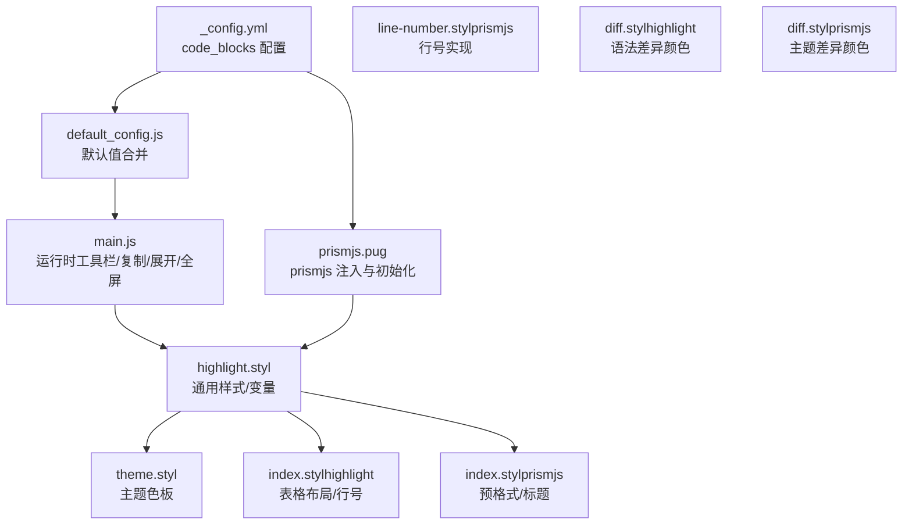
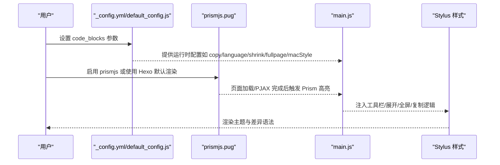
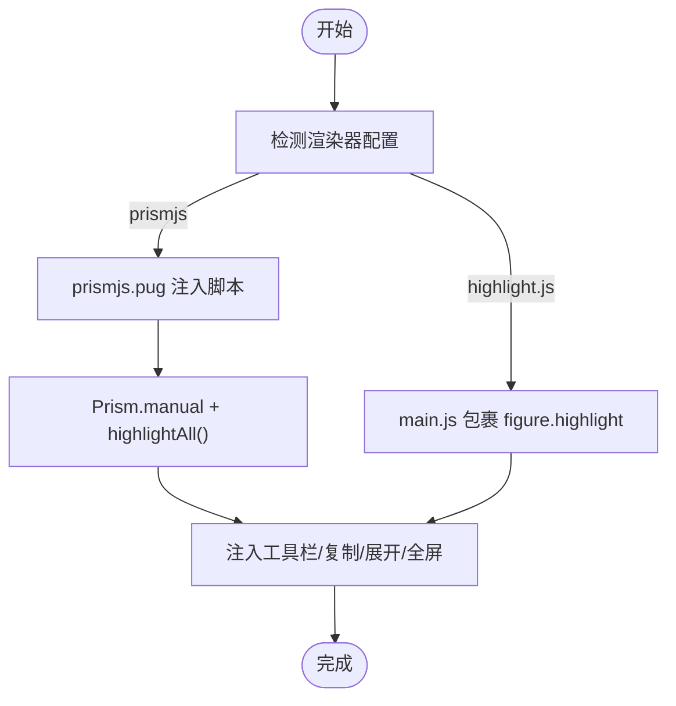
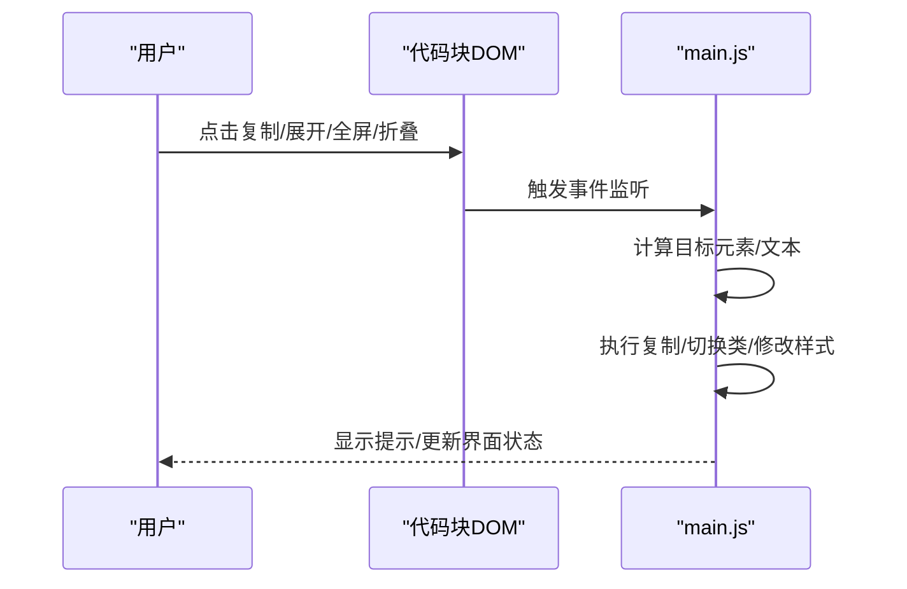
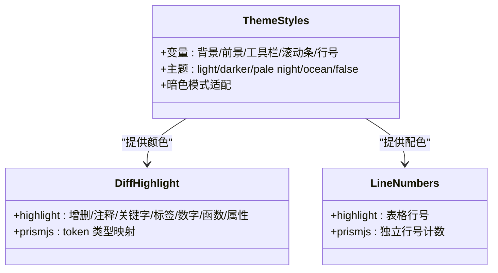
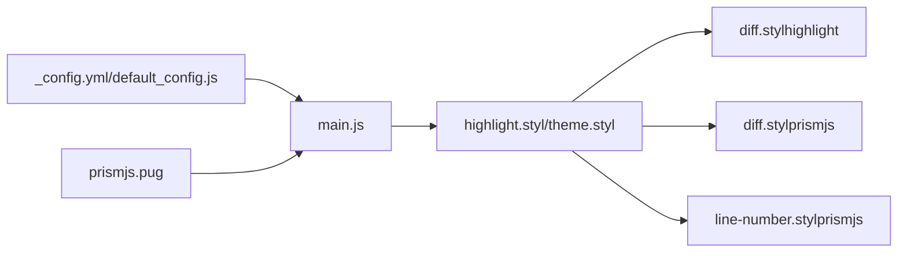

# 代码高亮配置

<cite>
**本文引用的文件**
- [_config.yml](file://themes/butterfly/_config.yml)
- [default_config.js](file://themes/butterfly/scripts/common/default_config.js)
- [main.js](file://themes/butterfly/source/js/main.js)
- [prismjs.pug](file://themes/butterfly/layout/includes/third-party/prismjs.pug)
- [highlight.styl](file://themes/butterfly/source/css/_highlight/highlight.styl)
- [theme.styl](file://themes/butterfly/source/css/_highlight/theme.styl)
- [index.styl（highlight）](file://themes/butterfly/source/css/_highlight/highlight/index.styl)
- [index.styl（prismjs）](file://themes/butterfly/source/css/_highlight/prismjs/index.styl)
- [line-number.styl（prismjs）](file://themes/butterfly/source/css/_highlight/prismjs/line-number.styl)
- [diff.styl（highlight）](file://themes/butterfly/source/css/_highlight/highlight/diff.styl)
- [diff.styl（prismjs）](file://themes/butterfly/source/css/_highlight/prismjs/diff.styl)
</cite>

## 目录
1. [简介](#简介)
2. [项目结构](#项目结构)
3. [核心组件](#核心组件)
4. [架构总览](#架构总览)
5. [详细组件分析](#详细组件分析)
6. [依赖关系分析](#依赖关系分析)
7. [性能考量](#性能考量)
8. [故障排查指南](#故障排查指南)
9. [结论](#结论)
10. [附录](#附录)

## 简介
本指南聚焦于 Butterfly 主题中的代码高亮系统，覆盖两种渲染器（prismjs 与 highlight.js）的选择与集成方式，并深入解析 code_blocks 配置项：主题选择（light/darker/pale night/ocean/false）、mac 风格窗口装饰、高度限制与自动展开、工具栏（复制、语言标识、全屏）等。文档同时提供配置示例与视觉效果对比思路、性能优化建议与常见问题解决方案。

## 项目结构
与代码高亮相关的关键位置：
- 配置入口：主题配置文件与默认配置脚本
- 渲染器注入：prismjs 的模板片段
- 样式层：Stylus 定义主题色板、滚动条、行号、差异高亮等
- 运行时增强：JavaScript 动态注入工具栏、复制、展开与全屏

**图表来源**
- [_config.yml](file://themes/butterfly/_config.yml)
- [default_config.js](file://themes/butterfly/scripts/common/default_config.js)
- [main.js](file://themes/butterfly/source/js/main.js)
- [prismjs.pug](file://themes/butterfly/layout/includes/third-party/prismjs.pug)
- [highlight.styl](file://themes/butterfly/source/css/_highlight/highlight.styl)
- [theme.styl](file://themes/butterfly/source/css/_highlight/theme.styl)
- [index.styl（highlight）](file://themes/butterfly/source/css/_highlight/highlight/index.styl)
- [index.styl（prismjs）](file://themes/butterfly/source/css/_highlight/prismjs/index.styl)
- [line-number.styl（prismjs）](file://themes/butterfly/source/css/_highlight/prismjs/line-number.styl)
- [diff.styl（highlight）](file://themes/butterfly/source/css/_highlight/highlight/diff.styl)
- [diff.styl（prismjs）](file://themes/butterfly/source/css/_highlight/prismjs/diff.styl)

**章节来源**
- [_config.yml](file://themes/butterfly/_config.yml)
- [default_config.js](file://themes/butterfly/scripts/common/default_config.js)
- [prismjs.pug](file://themes/butterfly/layout/includes/third-party/prismjs.pug)
- [highlight.styl](file://themes/butterfly/source/css/_highlight/highlight.styl)
- [theme.styl](file://themes/butterfly/source/css/_highlight/theme.styl)
- [index.styl（highlight）](file://themes/butterfly/source/css/_highlight/highlight/index.styl)
- [index.styl（prismjs）](file://themes/butterfly/source/css/_highlight/prismjs/index.styl)
- [line-number.styl（prismjs）](file://themes/butterfly/source/css/_highlight/prismjs/line-number.styl)
- [diff.styl（highlight）](file://themes/butterfly/source/css/_highlight/highlight/diff.styl)
- [diff.styl（prismjs）](file://themes/butterfly/source/css/_highlight/prismjs/diff.styl)

## 核心组件
- 配置项 code_blocks
  - 主题：light/darker/pale night/ocean/false
  - macStyle：是否显示 macOS 风格窗口装饰
  - height_limit：高度阈值（px），超过则显示“展开”按钮
  - word_wrap：是否开启自动换行
  - 工具栏：copy（复制）、language（语言显示）、shrink（自动折叠）、fullpage（全屏）
- 渲染器选择
  - prismjs：通过模板注入脚本并在页面加载与 PJAX 完成后触发高亮
  - highlight.js：默认由 Hexo 渲染器输出，Butterfly 在运行时为 figure.highlight 注入工具栏与交互
- 样式主题
  - Stylus 读取配置生成主题色板与差异语法颜色
  - 支持暗色模式适配

**章节来源**
- [_config.yml](file://themes/butterfly/_config.yml)
- [default_config.js](file://themes/butterfly/scripts/common/default_config.js)
- [prismjs.pug](file://themes/butterfly/layout/includes/third-party/prismjs.pug)
- [highlight.styl](file://themes/butterfly/source/css/_highlight/highlight.styl)
- [theme.styl](file://themes/butterfly/source/css/_highlight/theme.styl)

## 架构总览
代码高亮从配置到渲染再到交互的整体流程如下：

**图表来源**
- [_config.yml](file://themes/butterfly/_config.yml)
- [default_config.js](file://themes/butterfly/scripts/common/default_config.js)
- [prismjs.pug](file://themes/butterfly/layout/includes/third-party/prismjs.pug)
- [main.js](file://themes/butterfly/source/js/main.js)
- [highlight.styl](file://themes/butterfly/source/css/_highlight/highlight.styl)

## 详细组件分析

### 配置项详解（code_blocks）
- 主题选择
  - 支持 light/darker/pale night/ocean/false；false 表示不应用内置主题色板
  - 主题色板在 Stylus 中按主题名映射变量，支持暗色模式适配
- macStyle
  - 开启后在代码块顶部显示 macOS 风格的圆点按钮区域
- height_limit
  - 当代码块高度超过阈值时，显示“双倍向下箭头”展开按钮
- word_wrap
  - 开启后启用行号计数与换行，影响行号样式与容器布局
- 工具栏
  - copy：复制按钮，点击后通过剪贴板 API 复制代码文本
  - language：显示语言标识（基于类名或 data-language）
  - shrink：自动折叠（true 时初始折叠）
  - fullpage：全屏按钮，切换代码块全屏展示并隐藏 body 滚动

配置示例（仅列出关键键位，值可按需调整）：
- 主题与外观
  - code_blocks.theme: "light"
  - code_blocks.macStyle: true
  - code_blocks.height_limit: 300
  - code_blocks.word_wrap: true
- 工具栏
  - code_blocks.copy: true
  - code_blocks.language: true
  - code_blocks.shrink: false
  - code_blocks.fullpage: true

注意：上述示例仅为键位与可选值说明，具体数值请根据实际需求设置。

**章节来源**
- [_config.yml](file://themes/butterfly/_config.yml)
- [default_config.js](file://themes/butterfly/scripts/common/default_config.js)
- [highlight.styl](file://themes/butterfly/source/css/_highlight/highlight.styl)
- [theme.styl](file://themes/butterfly/source/css/_highlight/theme.styl)

### 渲染器选择与注入
- highlight.js（默认）
  - 由 Hexo 渲染器输出 figure.highlight 结构
  - Butterfly 在运行时为每个代码块包裹 figure.highlight 并注入工具栏与交互
- prismjs
  - 通过 prismjs.pug 注入脚本与手动触发机制
  - 在页面加载与 PJAX 完成后调用 Prism.highlightAll
  - 可选加载行号脚本

**图表来源**
- [prismjs.pug](file://themes/butterfly/layout/includes/third-party/prismjs.pug)
- [main.js](file://themes/butterfly/source/js/main.js)

**章节来源**
- [prismjs.pug](file://themes/butterfly/layout/includes/third-party/prismjs.pug)
- [main.js](file://themes/butterfly/source/js/main.js)

### 工具栏与交互逻辑
- 工具栏元素
  - macOS 风格装饰条（可选）
  - 折叠/展开按钮（可选）
  - 语言标识（可选）
  - 复制按钮（可选）
  - 全屏按钮（可选）
- 交互行为
  - 复制：读取代码文本并通过剪贴板 API 写入，支持提示反馈
  - 展开：点击“双倍向下箭头”展开完整代码
  - 全屏：切换代码块全屏并隐藏 body 滚动
  - 折叠：初始状态可由 shrink 控制

**图表来源**
- [main.js](file://themes/butterfly/source/js/main.js)

**章节来源**
- [main.js](file://themes/butterfly/source/js/main.js)

### 样式主题与差异高亮
- 主题色板
  - Stylus 读取主题名映射背景、前景、工具栏、滚动条、行号等变量
  - 暗色模式下变量会进行适配
- 差异高亮
  - highlight：为增删差异、注释、关键字、标签等提供颜色映射
  - prismjs：按主题提供 token 颜色映射，覆盖注释、属性、标签、字符串、数字、函数等
- 行号
  - highlight：表格布局 + 行号列
  - prismjs：独立行号实现，支持换行与计数

**图表来源**
- [theme.styl](file://themes/butterfly/source/css/_highlight/theme.styl)
- [diff.styl（highlight）](file://themes/butterfly/source/css/_highlight/highlight/diff.styl)
- [diff.styl（prismjs）](file://themes/butterfly/source/css/_highlight/prismjs/diff.styl)
- [index.styl（highlight）](file://themes/butterfly/source/css/_highlight/highlight/index.styl)
- [line-number.styl（prismjs）](file://themes/butterfly/source/css/_highlight/prismjs/line-number.styl)

**章节来源**
- [theme.styl](file://themes/butterfly/source/css/_highlight/theme.styl)
- [highlight.styl](file://themes/butterfly/source/css/_highlight/highlight.styl)
- [index.styl（highlight）](file://themes/butterfly/source/css/_highlight/highlight/index.styl)
- [index.styl（prismjs）](file://themes/butterfly/source/css/_highlight/prismjs/index.styl)
- [line-number.styl（prismjs）](file://themes/butterfly/source/css/_highlight/prismjs/line-number.styl)
- [diff.styl（highlight）](file://themes/butterfly/source/css/_highlight/highlight/diff.styl)
- [diff.styl（prismjs）](file://themes/butterfly/source/css/_highlight/prismjs/diff.styl)

## 依赖关系分析
- 配置到运行时
  - _config.yml 与 default_config.js 提供运行时参数
  - main.js 依据参数决定是否注入工具栏与交互
- 渲染器到样式
  - prismjs.pug 与 main.js 分别负责渲染器注入与运行时增强
  - highlight.styl 作为样式入口，按主题与开关引入不同模块
- 样式到主题
  - theme.styl 定义主题变量，diff.styl 提供语法差异颜色

**图表来源**
- [_config.yml](file://themes/butterfly/_config.yml)
- [default_config.js](file://themes/butterfly/scripts/common/default_config.js)
- [prismjs.pug](file://themes/butterfly/layout/includes/third-party/prismjs.pug)
- [main.js](file://themes/butterfly/source/js/main.js)
- [highlight.styl](file://themes/butterfly/source/css/_highlight/highlight.styl)
- [theme.styl](file://themes/butterfly/source/css/_highlight/theme.styl)
- [diff.styl（highlight）](file://themes/butterfly/source/css/_highlight/highlight/diff.styl)
- [diff.styl（prismjs）](file://themes/butterfly/source/css/_highlight/prismjs/diff.styl)
- [line-number.styl（prismjs）](file://themes/butterfly/source/css/_highlight/prismjs/line-number.styl)

**章节来源**
- [_config.yml](file://themes/butterfly/_config.yml)
- [default_config.js](file://themes/butterfly/scripts/common/default_config.js)
- [prismjs.pug](file://themes/butterfly/layout/includes/third-party/prismjs.pug)
- [main.js](file://themes/butterfly/source/js/main.js)
- [highlight.styl](file://themes/butterfly/source/css/_highlight/highlight.styl)
- [theme.styl](file://themes/butterfly/source/css/_highlight/theme.styl)

## 性能考量
- 渲染器选择
  - 若使用 prismjs，建议在内容较多时开启行号按需加载，减少首屏计算量
  - 使用 highlight.js 时，尽量避免一次性渲染大量代码块，可通过分页或延迟加载策略降低峰值内存占用
- 工具栏与交互
  - 工具栏仅在存在代码块且启用相关功能时注入，避免不必要的 DOM 操作
  - 展开/全屏切换会触发重排，建议在长列表中谨慎使用全屏
- 样式层面
  - 主题色板与差异颜色在构建期确定，运行时仅做变量替换，开销较小
  - 行号与换行会影响容器高度计算，建议在移动端或窄屏上适度关闭行号或换行
- 加载优化
  - 对 prismjs 的脚本采用 defer 加载，避免阻塞渲染
  - 在 PJAX 场景下，确保在“完成”回调中重新触发高亮，避免部分代码块未渲染

[本节为通用性能建议，无需特定文件引用]

## 故障排查指南
- 代码块未高亮
  - 若使用 prismjs，请确认模板已正确注入脚本，且在页面加载与 PJAX 完成后触发了高亮
  - 若使用 highlight.js，请确认文章中代码块被渲染为 figure.highlight 结构
- 工具栏不显示
  - 检查 code_blocks 中对应功能开关（copy/language/shrink/fullpage/macStyle）
  - 确认运行时环境允许剪贴板 API（HTTPS 或 localhost）
- 复制失败
  - 浏览器安全策略限制非 HTTPS 环境的剪贴板访问
  - 移动端浏览器可能需要用户手势触发
- 高度限制无效
  - height_limit 仅在代码块真实高度超过阈值时生效
  - 若容器被隐藏（如 tab 切换），需在显示后重新计算高度或手动展开
- 行号显示异常
  - highlight：检查是否启用了换行与行号列
  - prismjs：确认已加载行号脚本且未禁用行号

**章节来源**
- [prismjs.pug](file://themes/butterfly/layout/includes/third-party/prismjs.pug)
- [main.js](file://themes/butterfly/source/js/main.js)
- [highlight.styl](file://themes/butterfly/source/css/_highlight/highlight.styl)
- [line-number.styl（prismjs）](file://themes/butterfly/source/css/_highlight/prismjs/line-number.styl)

## 结论
Butterfly 的代码高亮系统通过配置驱动与运行时增强相结合，实现了对 prismjs 与 highlight.js 的无缝支持。合理配置 code_blocks 可获得一致的主题风格与良好的交互体验。在性能敏感场景下，建议结合渲染器特性与样式开关进行权衡，并遵循本文提供的优化与排障建议。

[本节为总结性内容，无需特定文件引用]

## 附录
- 配置项速查
  - 主题：light/darker/pale night/ocean/false
  - macStyle：true/false
  - height_limit：数值（px）或 false
  - word_wrap：true/false
  - 工具栏：copy/language/shrink/fullpage（true/false）
- 视觉效果对比思路
  - 主题对比：分别设置 theme 为 light/darker/pale night/ocean，观察背景/前景/差异颜色差异
  - 工具栏对比：开启/关闭 copy/language/shrink/fullpage，观察工具栏出现与交互
  - 行号对比：开启/关闭 word_wrap 与行号，观察布局变化
- 常见问题清单
  - 未高亮：检查渲染器注入与高亮触发时机
  - 工具栏缺失：检查对应开关与运行时注入条件
  - 复制失败：检查协议与浏览器权限
  - 高度限制无效：确认容器可见性与高度计算

[本节为补充信息，无需特定文件引用]