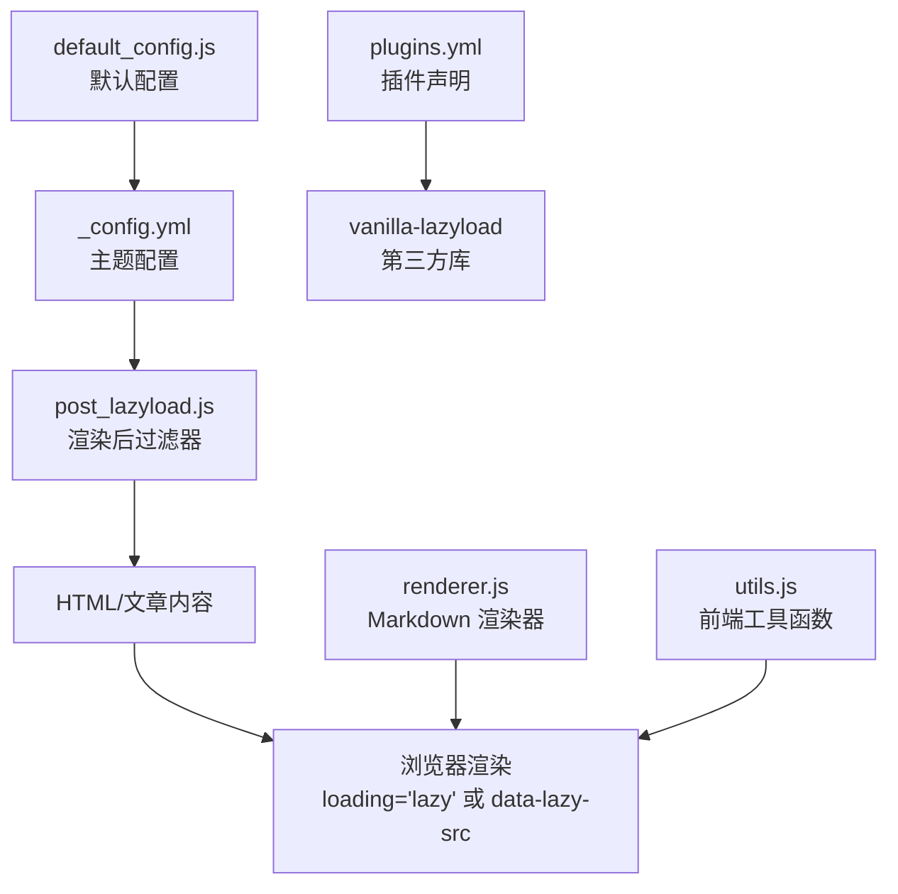
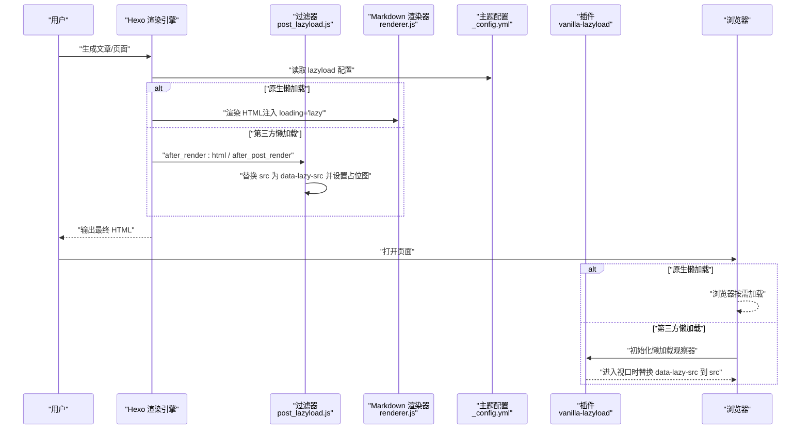
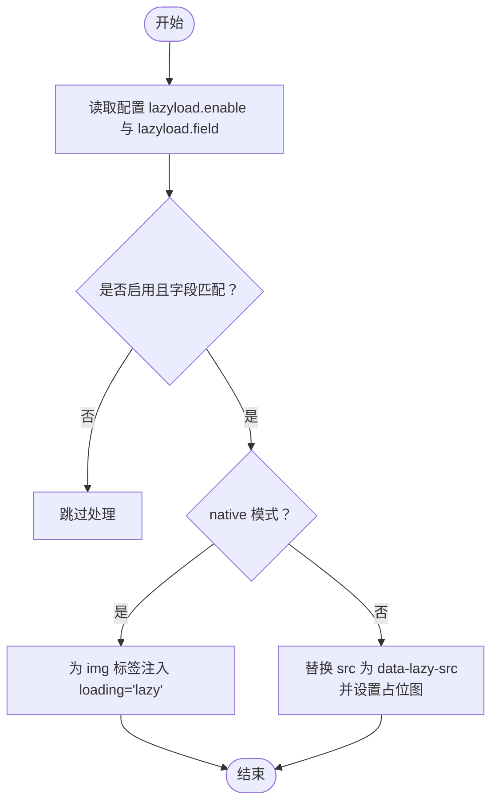
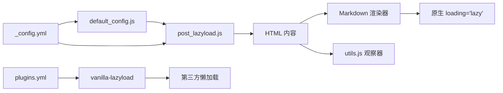

# 图片懒加载

<cite>
**本文引用的文件**
- [post_lazyload.js](file://themes/butterfly/scripts/filters/post_lazyload.js)
- [_config.yml（主题配置）](file://themes/butterfly/_config.yml)
- [default_config.js（默认配置）](file://themes/butterfly/scripts/common/default_config.js)
- [plugins.yml（插件配置）](file://themes/butterfly/plugins.yml)
- [utils.js（工具函数）](file://themes/butterfly/source/js/utils.js)
- [renderer.js（渲染器）](file://node_modules/hexo-renderer-marked/lib/renderer.js)
</cite>

## 目录
1. [简介](#简介)
2. [项目结构](#项目结构)
3. [核心组件](#核心组件)
4. [架构总览](#架构总览)
5. [详细组件分析](#详细组件分析)
6. [依赖关系分析](#依赖关系分析)
7. [性能考量](#性能考量)
8. [故障排查指南](#故障排查指南)
9. [结论](#结论)
10. [附录](#附录)

## 简介
本指南围绕 Hexo 主题 Butterfly 的图片懒加载能力展开，重点解析 post_lazyload 过滤器的工作原理与技术实现细节，覆盖以下内容：
- 触发机制：站点级与文章级两种模式
- 性能优化策略：占位图、模糊占位、原生懒加载与第三方库选择
- 用户体验提升：减少首屏阻塞、平滑过渡、避免空白闪烁
- 配置参数详解：启用开关、字段范围、占位图与模糊策略
- 使用示例与最佳实践：何时启用、如何配置、常见问题
- 兼容性与集成：与 Markdown 渲染器、第三方懒加载库的关系
- 性能测试与监控：可量化的指标与测试方法

## 项目结构
与图片懒加载直接相关的文件与职责如下：
- scripts/filters/post_lazyload.js：在渲染后阶段对 HTML 或文章内容进行替换，注入懒加载逻辑
- themes/butterfly/_config.yml：主题配置入口，定义 lazyload 开关、字段范围、占位图、模糊策略等
- themes/butterfly/scripts/common/default_config.js：默认配置，包含 lazyload 字段的默认值
- themes/butterfly/plugins.yml：声明 vanilla-lazyload 插件及其文件路径
- themes/butterfly/source/js/utils.js：前端工具函数，包含与懒加载相关的观察与处理逻辑
- node_modules/hexo-renderer-marked/lib/renderer.js：Markdown 渲染器，支持原生 loading="lazy"

图表来源
- [post_lazyload.js:11-40](file://themes/butterfly/scripts/filters/post_lazyload.js#L11-L40)
- [_config.yml:1014-1024](file://themes/butterfly/_config.yml#L1014-L1024)
- [default_config.js:566-572](file://themes/butterfly/scripts/common/default_config.js#L566-L572)
- [plugins.yml:121-124](file://themes/butterfly/plugins.yml#L121-L124)
- [renderer.js:156](file://node_modules/hexo-renderer-marked/lib/renderer.js#L156)
- [utils.js:105-117](file://themes/butterfly/source/js/utils.js#L105-L117)

章节来源
- [post_lazyload.js:11-40](file://themes/butterfly/scripts/filters/post_lazyload.js#L11-L40)
- [_config.yml:1014-1024](file://themes/butterfly/_config.yml#L1014-L1024)
- [default_config.js:566-572](file://themes/butterfly/scripts/common/default_config.js#L566-L572)
- [plugins.yml:121-124](file://themes/butterfly/plugins.yml#L121-L124)
- [renderer.js:156](file://node_modules/hexo-renderer-marked/lib/renderer.js#L156)
- [utils.js:105-117](file://themes/butterfly/source/js/utils.js#L105-L117)

## 核心组件
- 渲染后过滤器（post_lazyload）
  - 在站点渲染阶段或文章渲染阶段执行，根据配置决定是否启用
  - 支持两种模式：
    - 原生懒加载：为 img 标签添加 loading="lazy"
    - 第三方懒加载：将真实 src 替换为 data-lazy-src，并使用占位图占位
- 主题配置（_config.yml）
  - lazyload.enable：是否启用懒加载
  - lazyload.field：应用范围（site 或 post）
  - lazyload.native：是否使用原生懒加载
  - lazyload.placeholder：占位图路径或数据 URI
  - lazyload.blur：是否启用模糊占位
- 默认配置（default_config.js）
  - 提供 lazyload 字段的默认值，确保未显式配置时有合理行为
- 插件声明（plugins.yml）
  - 声明 vanilla-lazyload 插件文件路径，用于非原生模式下的懒加载行为
- 前端工具（utils.js）
  - 提供基于 IntersectionObserver 的懒加载观察逻辑，便于与第三方库协同
- Markdown 渲染器（renderer.js）
  - 当开启原生懒加载时，渲染器会自动为 img 标签注入 loading="lazy"

章节来源
- [post_lazyload.js:11-40](file://themes/butterfly/scripts/filters/post_lazyload.js#L11-L40)
- [_config.yml:1014-1024](file://themes/butterfly/_config.yml#L1014-L1024)
- [default_config.js:566-572](file://themes/butterfly/scripts/common/default_config.js#L566-L572)
- [plugins.yml:121-124](file://themes/butterfly/plugins.yml#L121-L124)
- [utils.js:105-117](file://themes/butterfly/source/js/utils.js#L105-L117)
- [renderer.js:156](file://node_modules/hexo-renderer-marked/lib/renderer.js#L156)

## 架构总览
下图展示了从内容生成到页面渲染的完整流程，以及懒加载在各阶段的作用点。

图表来源
- [post_lazyload.js:29-40](file://themes/butterfly/scripts/filters/post_lazyload.js#L29-L40)
- [renderer.js:156](file://node_modules/hexo-renderer-marked/lib/renderer.js#L156)
- [_config.yml:1014-1024](file://themes/butterfly/_config.yml#L1014-L1024)
- [plugins.yml:121-124](file://themes/butterfly/plugins.yml#L121-L124)

## 详细组件分析

### 组件一：post_lazyload 过滤器
- 功能定位
  - 在 HTML 输出阶段或文章内容阶段，对 img 标签进行替换，实现懒加载
- 执行时机
  - 注册了两个过滤器钩子：after_render:html（站点级）与 after_post_render（文章级）
  - 受配置项 lazyload.enable 与 lazyload.field 控制
- 实现要点
  - 原生模式：检测是否已存在 loading 属性，若无则注入 loading="lazy"
  - 第三方模式：统一匹配 src 属性（含引号与无引号），将真实地址保存到 data-lazy-src，同时将 src 替换为占位图
  - 占位图来源：优先使用配置的 lazyload.placeholder，否则回退到内置 base64 数据 URI
  - 安全性：排除 script 标签内的 img，避免误替换
- 关键路径
  - 过滤器注册与条件判断：[post_lazyload.js:29-40](file://themes/butterfly/scripts/filters/post_lazyload.js#L29-L40)
  - 原生替换逻辑：[post_lazyload.js:12-17](file://themes/butterfly/scripts/filters/post_lazyload.js#L12-L17)
  - 第三方替换逻辑：[post_lazyload.js:19-26](file://themes/butterfly/scripts/filters/post_lazyload.js#L19-L26)

图表来源
- [post_lazyload.js:11-40](file://themes/butterfly/scripts/filters/post_lazyload.js#L11-L40)

章节来源
- [post_lazyload.js:11-40](file://themes/butterfly/scripts/filters/post_lazyload.js#L11-L40)

### 组件二：主题配置与默认配置
- 配置项说明
  - enable：启用/禁用懒加载
  - native：是否使用浏览器原生懒加载
  - field：应用范围（site 或 post）
  - placeholder：占位图路径或数据 URI
  - blur：是否启用模糊占位（与占位图配合）
- 默认值
  - 默认关闭，字段为 site，占位图为内置 base64，blur 关闭
- 配置位置
  - 主题配置文件与默认配置文件分别定义了这些字段

章节来源
- [_config.yml:1014-1024](file://themes/butterfly/_config.yml#L1014-L1024)
- [default_config.js:566-572](file://themes/butterfly/scripts/common/default_config.js#L566-L572)

### 组件三：第三方懒加载库（vanilla-lazyload）
- 作用
  - 在非原生模式下，通过 IntersectionObserver 等机制实现图片进入视口后再加载
- 集成方式
  - 在 plugins.yml 中声明插件名称与文件路径
  - 由前端工具函数或页面脚本初始化与调用
- 与过滤器的关系
  - 过滤器负责将 src 替换为 data-lazy-src，库负责监听视口并替换回 src

章节来源
- [plugins.yml:121-124](file://themes/butterfly/plugins.yml#L121-L124)
- [utils.js:105-117](file://themes/butterfly/source/js/utils.js#L105-L117)

### 组件四：Markdown 渲染器（原生懒加载）
- 行为
  - 当开启原生懒加载时，渲染器会在 img 标签上注入 loading="lazy"
- 与过滤器的协作
  - 若 native=true，则过滤器不再替换 src，避免重复处理

章节来源
- [renderer.js:156](file://node_modules/hexo-renderer-marked/lib/renderer.js#L156)
- [post_lazyload.js:12-17](file://themes/butterfly/scripts/filters/post_lazyload.js#L12-L17)

## 依赖关系分析
- 配置依赖
  - post_lazyload 依赖 _config.yml 与 default_config.js 中的 lazyload 字段
- 插件依赖
  - 第三方懒加载模式依赖 vanilla-lazyload 插件（plugins.yml 声明）
- 渲染器依赖
  - 原生懒加载模式依赖 hexo-renderer-marked 的渲染逻辑
- 前端依赖
  - utils.js 中的 IntersectionObserver 逻辑可用于懒加载场景

图表来源
- [_config.yml:1014-1024](file://themes/butterfly/_config.yml#L1014-L1024)
- [default_config.js:566-572](file://themes/butterfly/scripts/common/default_config.js#L566-L572)
- [post_lazyload.js:11-40](file://themes/butterfly/scripts/filters/post_lazyload.js#L11-L40)
- [plugins.yml:121-124](file://themes/butterfly/plugins.yml#L121-L124)
- [utils.js:105-117](file://themes/butterfly/source/js/utils.js#L105-L117)
- [renderer.js:156](file://node_modules/hexo-renderer-marked/lib/renderer.js#L156)

章节来源
- [_config.yml:1014-1024](file://themes/butterfly/_config.yml#L1014-L1024)
- [default_config.js:566-572](file://themes/butterfly/scripts/common/default_config.js#L566-L572)
- [post_lazyload.js:11-40](file://themes/butterfly/scripts/filters/post_lazyload.js#L11-L40)
- [plugins.yml:121-124](file://themes/butterfly/plugins.yml#L121-L124)
- [utils.js:105-117](file://themes/butterfly/source/js/utils.js#L105-L117)
- [renderer.js:156](file://node_modules/hexo-renderer-marked/lib/renderer.js#L156)

## 性能考量
- 首屏加载时间
  - 启用占位图可显著减少图片加载前的空白闪烁，改善感知性能
  - 原生懒加载无需额外 JS，减少初始包体与解析时间
- CPU/内存占用
  - 第三方懒加载库需要维护观察器与事件，应结合实际页面图片数量评估
  - 合理设置占位图尺寸与格式，避免过大导致内存压力
- 网络与带宽
  - 延迟加载可降低首屏并发请求数，缓解服务器压力
  - 对于移动端网络环境，建议开启模糊占位以提升感知速度
- 可访问性
  - 原生懒加载与第三方懒加载均不影响可访问性；如需增强，可在占位图中加入描述性文本或 aria-label

## 故障排查指南
- 症状：图片未懒加载
  - 检查 lazyload.enable 是否开启
  - 检查 lazyload.field 是否与当前页面类型匹配（site 或 post）
  - 若使用原生模式，确认浏览器支持 loading="lazy"
- 症状：占位图不生效
  - 检查 lazyload.placeholder 是否正确配置
  - 确认过滤器未被其他插件覆盖或二次处理
- 症状：第三方懒加载无效
  - 确认 vanilla-lazyload 插件已正确引入
  - 检查 data-lazy-src 是否被正确注入
- 症状：与评论系统冲突
  - 若评论系统采用懒加载策略，注意避免双重懒加载
  - 可通过延迟初始化或独立观察器解决冲突

章节来源
- [post_lazyload.js:29-40](file://themes/butterfly/scripts/filters/post_lazyload.js#L29-L40)
- [plugins.yml:121-124](file://themes/butterfly/plugins.yml#L121-L124)
- [_config.yml:1014-1024](file://themes/butterfly/_config.yml#L1014-L1024)

## 结论
Butterfly 的图片懒加载方案提供了“原生”与“第三方”两条路径，兼顾性能与兼容性。通过合理的配置与最佳实践，可以在保证首屏体验的同时，有效降低资源消耗并提升整体性能。建议在大图较多的站点优先考虑原生懒加载，配合占位图与模糊策略进一步优化用户体验。

## 附录

### 配置参数说明
- enable：布尔值，控制是否启用懒加载
- native：布尔值，是否使用浏览器原生懒加载
- field：字符串，应用范围（site 或 post）
- placeholder：字符串，占位图路径或数据 URI
- blur：布尔值，是否启用模糊占位

章节来源
- [_config.yml:1014-1024](file://themes/butterfly/_config.yml#L1014-L1024)
- [default_config.js:566-572](file://themes/butterfly/scripts/common/default_config.js#L566-L572)

### 使用示例与最佳实践
- 示例一：站点级启用原生懒加载
  - 将 lazyload.enable 设为 true，lazyload.native 设为 true，lazyload.field 设为 site
- 示例二：文章级启用第三方懒加载
  - 将 lazyload.enable 设为 true，lazyload.native 设为 false，lazyload.field 设为 post，并配置合适的占位图
- 最佳实践
  - 大图较多的页面优先使用原生懒加载
  - 移动端建议开启模糊占位，提升感知速度
  - 避免在同一页面同时启用多种懒加载策略，防止冲突

章节来源
- [post_lazyload.js:11-40](file://themes/butterfly/scripts/filters/post_lazyload.js#L11-L40)
- [_config.yml:1014-1024](file://themes/butterfly/_config.yml#L1014-L1024)

### 兼容性与解决方案
- 与 Markdown 渲染器
  - 原生模式下由渲染器注入 loading="lazy"，第三方模式下由过滤器替换 src
- 与第三方懒加载库
  - 通过 data-lazy-src 与库的观察器协同工作，避免重复处理
- 与评论系统
  - 若评论系统也采用懒加载，建议统一策略或延迟初始化，避免相互干扰

章节来源
- [renderer.js:156](file://node_modules/hexo-renderer-marked/lib/renderer.js#L156)
- [post_lazyload.js:12-17](file://themes/butterfly/scripts/filters/post_lazyload.js#L12-L17)
- [utils.js:105-117](file://themes/butterfly/source/js/utils.js#L105-L117)

### 性能测试方法与监控指标
- 测试方法
  - 使用浏览器开发者工具的 Network 面板，对比启用与禁用懒加载时的首屏请求数与总下载字节
  - 使用 Performance 面板记录首屏渲染时间与关键帧
- 监控指标
  - 首屏图片请求数、首屏渲染完成时间、页面总下载字节、CPU 使用率、内存占用
  - 用户感知指标：FCP、LCP、CLS（布局偏移）