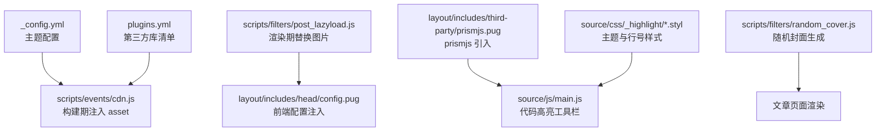
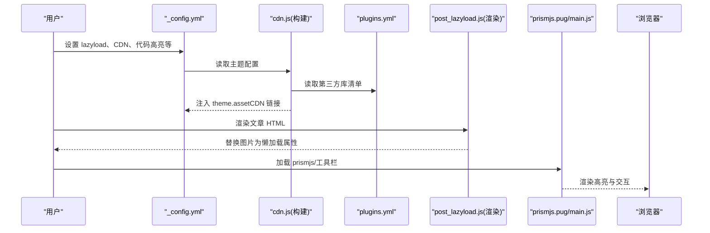
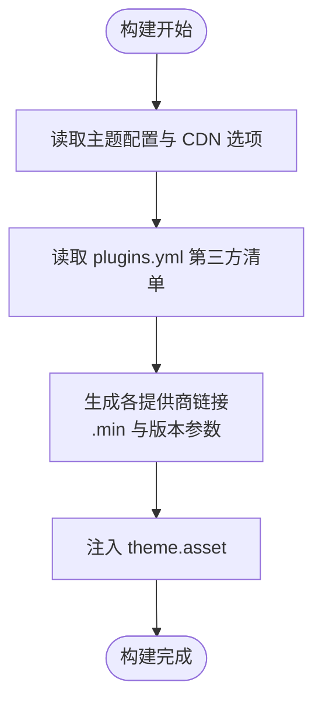
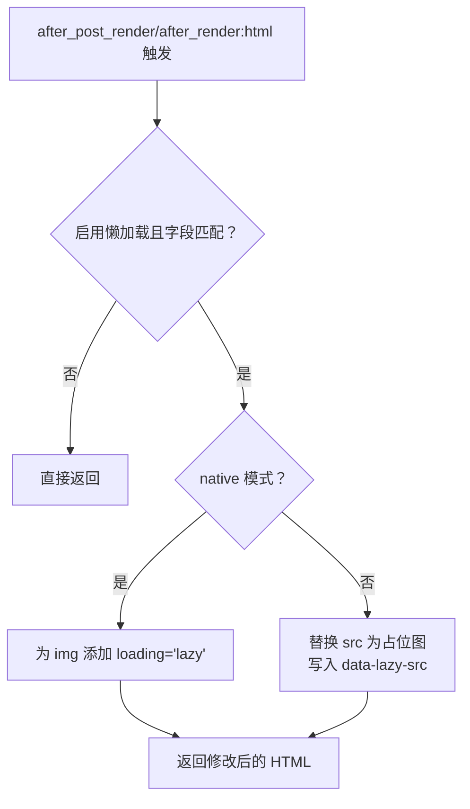
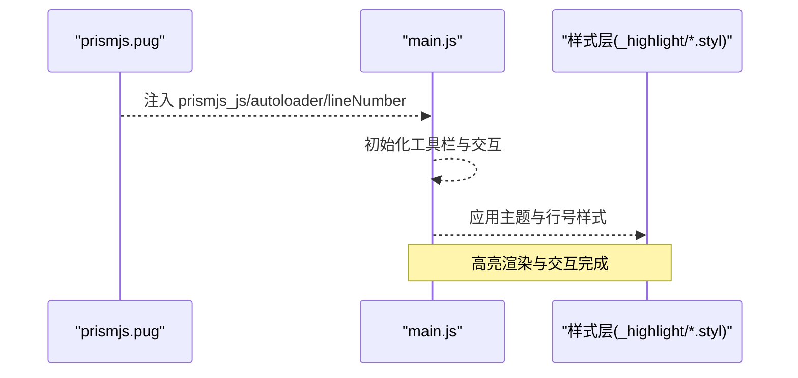
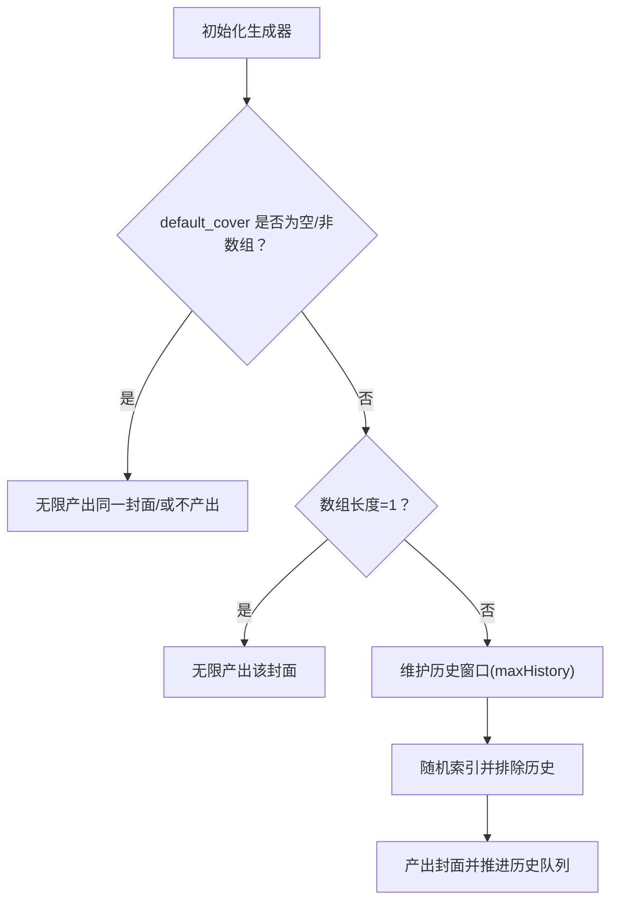
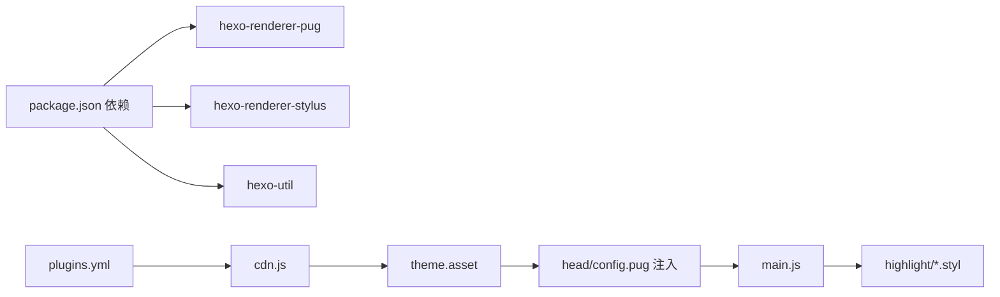

# 资源优化

<cite>
**本文引用的文件**
- [themes/butterfly/_config.yml](file://themes/butterfly/_config.yml)
- [themes/butterfly/scripts/common/default_config.js](file://themes/butterfly/scripts/common/default_config.js)
- [themes/butterfly/scripts/events/cdn.js](file://themes/butterfly/scripts/events/cdn.js)
- [themes/butterfly/plugins.yml](file://themes/butterfly/plugins.yml)
- [themes/butterfly/scripts/filters/post_lazyload.js](file://themes/butterfly/scripts/filters/post_lazyload.js)
- [themes/butterfly/scripts/filters/random_cover.js](file://themes/butterfly/scripts/filters/random_cover.js)
- [themes/butterfly/layout/includes/third-party/prismjs.pug](file://themes/butterfly/layout/includes/third-party/prismjs.pug)
- [themes/butterfly/layout/includes/head/config.pug](file://themes/butterfly/layout/includes/head/config.pug)
- [themes/butterfly/source/js/main.js](file://themes/butterfly/source/js/main.js)
- [themes/butterfly/source/js/utils.js](file://themes/butterfly/source/js/utils.js)
- [themes/butterfly/source/css/_highlight/theme.styl](file://themes/butterfly/source/css/_highlight/theme.styl)
- [themes/butterfly/source/css/_highlight/highlight/index.styl](file://themes/butterfly/source/css/_highlight/highlight/index.styl)
- [themes/butterfly/source/css/_highlight/prismjs/index.styl](file://themes/butterfly/source/css/_highlight/prismjs/index.styl)
- [themes/butterfly/package.json](file://themes/butterfly/package.json)
</cite>

## 目录
1. [简介](#简介)
2. [项目结构](#项目结构)
3. [核心组件](#核心组件)
4. [架构总览](#架构总览)
5. [详细组件分析](#详细组件分析)
6. [依赖关系分析](#依赖关系分析)
7. [性能考量](#性能考量)
8. [故障排查指南](#故障排查指南)
9. [结论](#结论)
10. [附录：配置与最佳实践](#附录配置与最佳实践)

## 简介
本指南聚焦于 dzb-blog（基于 Hexo Butterfly 主题）的资源优化实践，覆盖静态资源的压缩、合并与缓存策略，CSS/JS/图片资源的优化路径；详解代码高亮（prismjs 与 highlight.js）的配置、主题选择与性能影响；深入解析图片懒加载的实现原理与配置项；并提供随机封面图的技术实现与性能考虑。文档同时给出可操作的配置示例与最佳实践建议。

## 项目结构
围绕资源优化的关键位置如下：
- 主题配置与默认配置：用于开启/关闭懒加载、CDN 合并、代码高亮等
- 生成期事件：在构建阶段计算并注入 CDN 链接
- 渲染期过滤器：对 HTML 进行图片懒加载替换
- 前端脚本：负责代码高亮工具栏、复制、展开、全屏等功能
- 样式层：定义代码高亮主题与行号样式
- 插件清单：声明第三方库版本与文件路径，供 CDN 生成使用

**图表来源**
- [themes/butterfly/_config.yml](file://themes/butterfly/_config.yml)
- [themes/butterfly/scripts/events/cdn.js](file://themes/butterfly/scripts/events/cdn.js)
- [themes/butterfly/plugins.yml](file://themes/butterfly/plugins.yml)
- [themes/butterfly/scripts/filters/post_lazyload.js](file://themes/butterfly/scripts/filters/post_lazyload.js)
- [themes/butterfly/layout/includes/head/config.pug](file://themes/butterfly/layout/includes/head/config.pug)
- [themes/butterfly/layout/includes/third-party/prismjs.pug](file://themes/butterfly/layout/includes/third-party/prismjs.pug)
- [themes/butterfly/source/js/main.js](file://themes/butterfly/source/js/main.js)
- [themes/butterfly/source/css/_highlight/theme.styl](file://themes/butterfly/source/css/_highlight/theme.styl)

**章节来源**
- [themes/butterfly/_config.yml](file://themes/butterfly/_config.yml)
- [themes/butterfly/scripts/common/default_config.js](file://themes/butterfly/scripts/common/default_config.js)

## 核心组件
- CDN 合并与版本控制：在构建阶段根据配置与插件清单生成最终资源链接，支持本地与多个 CDN 提供商
- 图片懒加载：通过渲染期过滤器替换图片属性，结合前端工具链实现占位图与延迟加载
- 代码高亮：支持 highlight.js 与 prismjs，提供主题、语言标签、复制、展开、全屏等交互
- 随机封面：为未设置封面的文章分配不重复的历史窗口内的随机封面，兼顾美观与性能

**章节来源**
- [themes/butterfly/scripts/events/cdn.js](file://themes/butterfly/scripts/events/cdn.js)
- [themes/butterfly/scripts/filters/post_lazyload.js](file://themes/butterfly/scripts/filters/post_lazyload.js)
- [themes/butterfly/layout/includes/third-party/prismjs.pug](file://themes/butterfly/layout/includes/third-party/prismjs.pug)
- [themes/butterfly/scripts/filters/random_cover.js](file://themes/butterfly/scripts/filters/random_cover.js)

## 架构总览
从“配置—构建—渲染—前端执行”的角度，资源优化的主流程如下：

**图表来源**
- [themes/butterfly/_config.yml](file://themes/butterfly/_config.yml)
- [themes/butterfly/scripts/events/cdn.js](file://themes/butterfly/scripts/events/cdn.js)
- [themes/butterfly/plugins.yml](file://themes/butterfly/plugins.yml)
- [themes/butterfly/scripts/filters/post_lazyload.js](file://themes/butterfly/scripts/filters/post_lazyload.js)
- [themes/butterfly/layout/includes/third-party/prismjs.pug](file://themes/butterfly/layout/includes/third-party/prismjs.pug)
- [themes/butterfly/source/js/main.js](file://themes/butterfly/source/js/main.js)

## 详细组件分析

### 组件一：CDN 合并与静态资源缓存
- 构建期生成策略
  - 读取主题配置中的 CDN 选项与第三方插件清单，按提供商生成资源链接
  - 支持本地、jsdelivr、unpkg、cdnjs、自定义格式等
  - 自动为文件名添加 .min 后缀以启用压缩版本
  - 可选附加版本号参数，便于浏览器缓存失效与回滚
- 性能影响
  - 使用成熟的 CDN 可显著降低首包时间与服务器压力
  - .min 文件与版本参数有助于长期缓存与增量更新
- 配置要点
  - 内部资源与第三方库分别处理，确保内部 JS/CSS 与外部库的路径一致
  - 自定义格式支持通过占位符注入名称、版本、文件路径等

**图表来源**
- [themes/butterfly/scripts/events/cdn.js](file://themes/butterfly/scripts/events/cdn.js)
- [themes/butterfly/plugins.yml](file://themes/butterfly/plugins.yml)

**章节来源**
- [themes/butterfly/scripts/events/cdn.js](file://themes/butterfly/scripts/events/cdn.js)
- [themes/butterfly/_config.yml](file://themes/butterfly/_config.yml)
- [themes/butterfly/scripts/common/default_config.js](file://themes/butterfly/scripts/common/default_config.js)
- [themes/butterfly/plugins.yml](file://themes/butterfly/plugins.yml)

### 组件二：图片懒加载（post_lazyload 过滤器）
- 工作机制
  - 在渲染阶段对 HTML 中的图片进行替换：
    - 若启用原生懒加载，则为图片添加 loading=lazy
    - 否则用占位图替换 src，并将真实地址写入 data-lazy-src
  - 支持站点级与文章级两种触发字段，避免误伤脚本内图片
- 前端配合
  - 前端通过全局配置识别是否启用懒加载插件，结合图片数据属性进行延迟加载
  - 支持 medium-zoom、fancybox 等灯箱库对懒加载图片的兼容处理
- 性能收益
  - 显著减少首屏请求数量与带宽占用
  - 降低主线程阻塞，提升滚动与交互流畅度
- 配置示例路径
  - 主题配置中 lazyload.enable/native/field/placeholder 等项
  - 默认配置中 lazyload 的字段与默认值

**图表来源**
- [themes/butterfly/scripts/filters/post_lazyload.js](file://themes/butterfly/scripts/filters/post_lazyload.js)
- [themes/butterfly/layout/includes/head/config.pug](file://themes/butterfly/layout/includes/head/config.pug)
- [themes/butterfly/source/js/utils.js](file://themes/butterfly/source/js/utils.js)

**章节来源**
- [themes/butterfly/scripts/filters/post_lazyload.js](file://themes/butterfly/scripts/filters/post_lazyload.js)
- [themes/butterfly/layout/includes/head/config.pug](file://themes/butterfly/layout/includes/head/config.pug)
- [themes/butterfly/source/js/utils.js](file://themes/butterfly/source/js/utils.js)
- [themes/butterfly/scripts/common/default_config.js](file://themes/butterfly/scripts/common/default_config.js)

### 组件三：代码高亮（prismjs 与 highlight.js）
- 配置入口
  - 主题配置中 code_blocks 与 prismjs/syntax_highlighter 等字段决定高亮方案
  - PrismJS 自动加载器在页面加载时手动触发高亮
- 功能特性
  - 工具栏：复制、语言标签、展开/收起、全屏
  - 主题：darker/pale night/ocean/light/false 等
  - 行号：可选开启
  - 高度限制：超过阈值自动显示展开按钮
- 性能影响
  - highlight.js 与 prismjs 在不同场景下各有优势，需结合站点体量与交互需求权衡
  - 行号与工具栏会增加 DOM 结构与计算开销，建议按需启用
- 样式与主题
  - 主题变量集中于 theme.styl，按主题映射颜色与滚动条样式
  - highlight 与 prismjs 的样式分别由各自 index.styl 控制

**图表来源**
- [themes/butterfly/layout/includes/third-party/prismjs.pug](file://themes/butterfly/layout/includes/third-party/prismjs.pug)
- [themes/butterfly/source/js/main.js](file://themes/butterfly/source/js/main.js)
- [themes/butterfly/source/css/_highlight/theme.styl](file://themes/butterfly/source/css/_highlight/theme.styl)
- [themes/butterfly/source/css/_highlight/highlight/index.styl](file://themes/butterfly/source/css/_highlight/highlight/index.styl)
- [themes/butterfly/source/css/_highlight/prismjs/index.styl](file://themes/butterfly/source/css/_highlight/prismjs/index.styl)

**章节来源**
- [themes/butterfly/layout/includes/third-party/prismjs.pug](file://themes/butterfly/layout/includes/third-party/prismjs.pug)
- [themes/butterfly/source/js/main.js](file://themes/butterfly/source/js/main.js)
- [themes/butterfly/source/css/_highlight/theme.styl](file://themes/butterfly/source/css/_highlight/theme.styl)
- [themes/butterfly/source/css/_highlight/highlight/index.styl](file://themes/butterfly/source/css/_highlight/highlight/index.styl)
- [themes/butterfly/source/css/_highlight/prismjs/index.styl](file://themes/butterfly/source/css/_highlight/prismjs/index.styl)

### 组件四：随机封面图（随机封面生成器）
- 技术实现
  - 生成器维护一个历史窗口（默认最大长度 3），避免短期内重复
  - 当 default_cover 为数组时，循环输出不与历史重复的封面
  - 支持 post_asset_folder 模式下自动拼接相对路径
- 性能考虑
  - 仅在生成阶段进行随机与历史记录维护，不引入运行时复杂度
  - 历史窗口大小与数组长度成比例，避免过度内存占用
- 使用建议
  - 将 default_cover 设为多张高质量封面，提升视觉多样性
  - 如需固定封面，可设为单元素数组或字符串

**图表来源**
- [themes/butterfly/scripts/filters/random_cover.js](file://themes/butterfly/scripts/filters/random_cover.js)

**章节来源**
- [themes/butterfly/scripts/filters/random_cover.js](file://themes/butterfly/scripts/filters/random_cover.js)
- [themes/butterfly/_config.yml](file://themes/butterfly/_config.yml)

## 依赖关系分析
- 主题依赖
  - 依赖 hexo-renderer-pug、hexo-renderer-stylus、hexo-util 等渲染器与工具
  - 插件清单统一管理第三方库版本与文件路径
- 构建期依赖
  - cdn.js 依赖 plugins.yml 与主题配置，生成 theme.asset
- 运行期依赖
  - main.js 依赖全局配置（来自 head/config.pug 注入）、样式层主题与行号样式
  - lazyload 依赖 utils.js 的图片处理与灯箱集成

**图表来源**
- [themes/butterfly/package.json](file://themes/butterfly/package.json)
- [themes/butterfly/plugins.yml](file://themes/butterfly/plugins.yml)
- [themes/butterfly/scripts/events/cdn.js](file://themes/butterfly/scripts/events/cdn.js)
- [themes/butterfly/layout/includes/head/config.pug](file://themes/butterfly/layout/includes/head/config.pug)
- [themes/butterfly/source/js/main.js](file://themes/butterfly/source/js/main.js)
- [themes/butterfly/source/css/_highlight/*.styl](file://themes/butterfly/source/css/_highlight/*.styl)

**章节来源**
- [themes/butterfly/package.json](file://themes/butterfly/package.json)
- [themes/butterfly/plugins.yml](file://themes/butterfly/plugins.yml)
- [themes/butterfly/scripts/events/cdn.js](file://themes/butterfly/scripts/events/cdn.js)

## 性能考量
- 静态资源压缩与合并
  - 优先使用 .min 文件与成熟 CDN，减少体积与网络往返
  - 版本参数用于缓存失效控制，建议在大版本升级时变更
- 图片懒加载
  - 首屏只加载必要图片，滚动时再加载其余图片，显著降低初始带宽
  - 占位图建议使用极小尺寸的 base64 或透明 GIF，避免闪烁
- 代码高亮
  - 按需开启行号与工具栏，避免不必要的 DOM 与计算
  - 主题颜色与字体大小应适配站点整体风格，避免过度装饰导致渲染压力
- 随机封面
  - 仅在生成阶段工作，不引入运行时开销
  - 建议封面尺寸与比例统一，减少布局抖动

[本节为通用指导，无需特定文件引用]

## 故障排查指南
- 图片懒加载无效
  - 检查 lazyload.enable 与 field 字段是否正确
  - 确认渲染期过滤器已注册并生效
  - 若使用原生模式，请确认浏览器支持 loading=lazy
- 代码高亮未显示
  - 确认 syntax_highlighter 或 prismjs.enable 已开启
  - 检查 prismjs_js/prismjs_autoloader 是否成功加载
  - 确保样式层主题与行号样式已编译
- 随机封面重复过多
  - 调整 default_cover 数组长度与历史窗口上限
  - 避免数组过短导致频繁重复
- CDN 链接错误
  - 检查 CDN.provider 与 custom_format 占位符
  - 确认 plugins.yml 中第三方库版本与文件路径正确

**章节来源**
- [themes/butterfly/scripts/filters/post_lazyload.js](file://themes/butterfly/scripts/filters/post_lazyload.js)
- [themes/butterfly/layout/includes/third-party/prismjs.pug](file://themes/butterfly/layout/includes/third-party/prismjs.pug)
- [themes/butterfly/scripts/filters/random_cover.js](file://themes/butterfly/scripts/filters/random_cover.js)
- [themes/butterfly/scripts/events/cdn.js](file://themes/butterfly/scripts/events/cdn.js)

## 结论
通过构建期 CDN 合并、渲染期图片懒加载、按需启用的代码高亮与随机封面策略，dzb-blog 在保证良好用户体验的同时实现了显著的性能优化。建议在生产环境中启用 .min 资源与版本参数、合理配置懒加载与高亮功能，并结合实际访问特征持续调优。

[本节为总结性内容，无需特定文件引用]

## 附录：配置与最佳实践
- CDN 与缓存
  - 推荐使用 jsdelivr 或 cdnjs，开启 version 参数以便缓存控制
  - 对内部 JS/CSS 与第三方库分别配置，确保路径一致
- 图片懒加载
  - 首选原生 loading=lazy（若浏览器支持），否则使用占位图 + data-lazy-src
  - 将 lazyload.field 设为 site 或 post，按需启用
- 代码高亮
  - 优先选择 highlight.js 或 prismjs 其一，避免双重高亮
  - 主题选择 light/darker/pale night/ocean，结合站点色系
  - 按需开启行号与工具栏，控制高度限制阈值
- 随机封面
  - default_cover 设为多张高质量封面，避免单一化
  - 启用 post_asset_folder 时注意相对路径拼接规则

**章节来源**
- [themes/butterfly/_config.yml](file://themes/butterfly/_config.yml)
- [themes/butterfly/scripts/common/default_config.js](file://themes/butterfly/scripts/common/default_config.js)
- [themes/butterfly/scripts/events/cdn.js](file://themes/butterfly/scripts/events/cdn.js)
- [themes/butterfly/scripts/filters/post_lazyload.js](file://themes/butterfly/scripts/filters/post_lazyload.js)
- [themes/butterfly/layout/includes/third-party/prismjs.pug](file://themes/butterfly/layout/includes/third-party/prismjs.pug)
- [themes/butterfly/scripts/filters/random_cover.js](file://themes/butterfly/scripts/filters/random_cover.js)