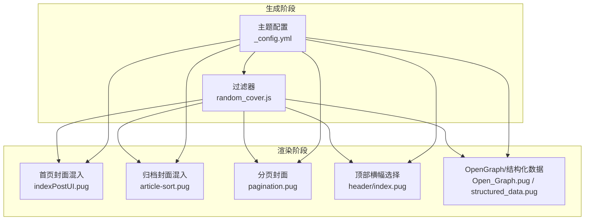
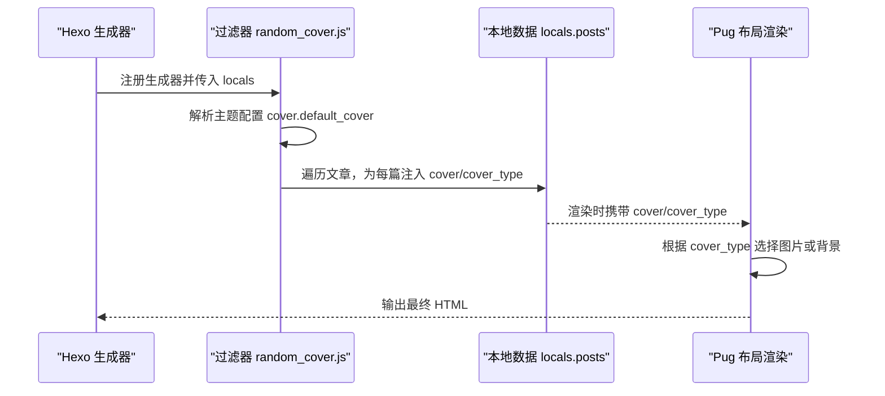
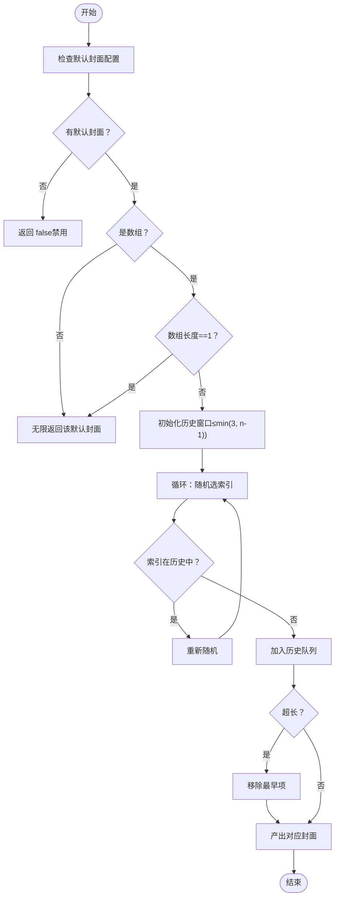
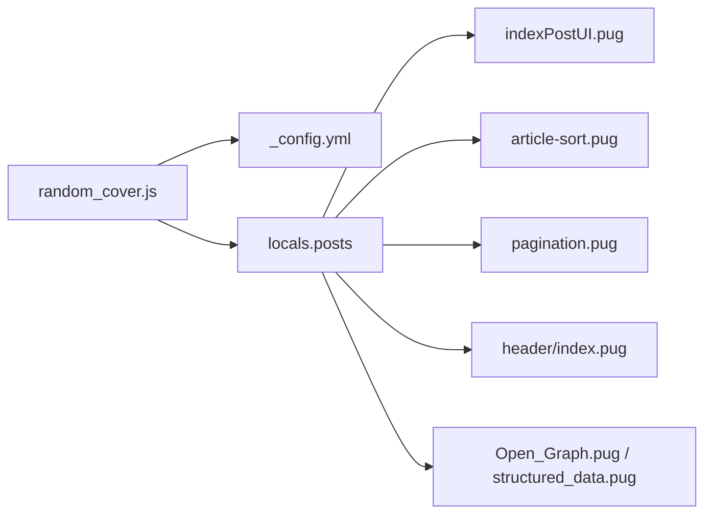

# 随机封面图

<cite>
**本文引用的文件**
- [themes/butterfly/scripts/filters/random_cover.js](file://themes/butterfly/scripts/filters/random_cover.js)
- [themes/butterfly/_config.yml](file://themes/butterfly/_config.yml)
- [themes/butterfly/layout/includes/header/index.pug](file://themes/butterfly/layout/includes/header/index.pug)
- [themes/butterfly/layout/includes/header/post-info.pug](file://themes/butterfly/layout/includes/header/post-info.pug)
- [themes/butterfly/layout/includes/mixins/indexPostUI.pug](file://themes/butterfly/layout/includes/mixins/indexPostUI.pug)
- [themes/butterfly/layout/includes/mixins/article-sort.pug](file://themes/butterfly/layout/includes/mixins/article-sort.pug)
- [themes/butterfly/layout/includes/pagination.pug](file://themes/butterfly/layout/includes/pagination.pug)
- [themes/butterfly/layout/includes/head/Open_Graph.pug](file://themes/butterfly/layout/includes/head/Open_Graph.pug)
- [themes/butterfly/layout/includes/head/structured_data.pug](file://themes/butterfly/layout/includes/head/structured_data.pug)
- [themes/butterfly/layout/post.pug](file://themes/butterfly/layout/post.pug)
</cite>

## 目录
1. [简介](#简介)
2. [项目结构](#项目结构)
3. [核心组件](#核心组件)
4. [架构总览](#架构总览)
5. [详细组件分析](#详细组件分析)
6. [依赖关系分析](#依赖关系分析)
7. [性能考量](#性能考量)
8. [故障排除指南](#故障排除指南)
9. [结论](#结论)
10. [附录](#附录)

## 简介
本指南围绕 Hexo 主题 Butterfly 的“随机封面图”能力展开，系统讲解 random_cover 过滤器的技术实现原理、算法逻辑、配置方法（启用条件、图片来源、缓存策略等）、使用场景、与主题其他功能的集成方式以及兼容性处理，并提供故障排除建议。

## 项目结构
随机封面图功能由以下部分协同完成：
- 过滤器：在生成阶段为文章数据注入随机封面图路径
- 主题配置：定义默认封面图数组、启用开关与页面覆盖逻辑
- 布局渲染：在首页、归档、侧边栏等位置按规则显示封面图或占位背景
- 元标签与分享：在 Open Graph、结构化数据中回退到头像以保证社交预览一致性

图表来源
- [themes/butterfly/scripts/filters/random_cover.js:1-91](file://themes/butterfly/scripts/filters/random_cover.js#L1-L91)
- [themes/butterfly/_config.yml:98-106](file://themes/butterfly/_config.yml#L98-L106)
- [themes/butterfly/layout/includes/mixins/indexPostUI.pug:10-20](file://themes/butterfly/layout/includes/mixins/indexPostUI.pug#L10-L20)
- [themes/butterfly/layout/includes/mixins/article-sort.pug:5-17](file://themes/butterfly/layout/includes/mixins/article-sort.pug#L5-L17)
- [themes/butterfly/layout/includes/pagination.pug:20-23](file://themes/butterfly/layout/includes/pagination.pug#L20-L23)
- [themes/butterfly/layout/includes/header/index.pug:8-28](file://themes/butterfly/layout/includes/header/index.pug#L8-L28)
- [themes/butterfly/layout/includes/head/Open_Graph.pug:1-5](file://themes/butterfly/layout/includes/head/Open_Graph.pug#L1-L5)
- [themes/butterfly/layout/includes/head/structured_data.pug:1-10](file://themes/butterfly/layout/includes/head/structured_data.pug#L1-L10)

章节来源
- [themes/butterfly/scripts/filters/random_cover.js:1-91](file://themes/butterfly/scripts/filters/random_cover.js#L1-L91)
- [themes/butterfly/_config.yml:98-106](file://themes/butterfly/_config.yml#L98-L106)

## 核心组件
- random_cover 过滤器：负责在生成阶段为每篇文章注入封面图字段，支持从默认数组中随机选取、避免短期内重复、自动补齐相对路径等
- 主题配置 cover 段落：定义默认封面数组、启用开关（首页/侧边/归档）
- 渲染混入：在首页、归档、分页等位置根据 cover 字段与 cover_type 决定是图片还是纯色背景
- 顶部横幅与元标签：在无自定义 top_img 时回退到 cover 或默认横幅；OG/结构化数据在非图片时回退到头像

章节来源
- [themes/butterfly/scripts/filters/random_cover.js:7-90](file://themes/butterfly/scripts/filters/random_cover.js#L7-L90)
- [themes/butterfly/_config.yml:98-106](file://themes/butterfly/_config.yml#L98-L106)
- [themes/butterfly/layout/includes/header/index.pug:8-28](file://themes/butterfly/layout/includes/header/index.pug#L8-L28)
- [themes/butterfly/layout/includes/head/Open_Graph.pug:1-5](file://themes/butterfly/layout/includes/head/Open_Graph.pug#L1-L5)
- [themes/butterfly/layout/includes/head/structured_data.pug:1-10](file://themes/butterfly/layout/includes/head/structured_data.pug#L1-L10)

## 架构总览
随机封面图的端到端流程如下：

图表来源
- [themes/butterfly/scripts/filters/random_cover.js:7-90](file://themes/butterfly/scripts/filters/random_cover.js#L7-L90)
- [themes/butterfly/layout/includes/mixins/indexPostUI.pug:10-20](file://themes/butterfly/layout/includes/mixins/indexPostUI.pug#L10-L20)
- [themes/butterfly/layout/includes/mixins/article-sort.pug:5-17](file://themes/butterfly/layout/includes/mixins/article-sort.pug#L5-L17)
- [themes/butterfly/layout/includes/pagination.pug:20-23](file://themes/butterfly/layout/includes/pagination.pug#L20-L23)

## 详细组件分析

### random_cover 过滤器实现原理与算法
- 输入与上下文
  - 读取主题配置中的默认封面数组
  - 读取站点配置中的文章资源目录开关，用于补全相对路径
- 生成器设计
  - 使用生成器函数维护一个历史索引队列，避免短期内重复抽取同一张封面
  - 当仅有一张默认封面时，直接返回该值
  - 当未配置默认封面时，返回 false 以禁用随机封面
- 封面注入策略
  - 若文章未显式设置封面，则注入随机封面
  - 若封面为相对路径且位于文章资源目录下，自动拼接文章路径前缀
  - 判断封面是否为外链或图片格式，设置 cover_type 为图片类型
- 时间复杂度
  - 单次注入近似 O(1)，但需注意历史队列长度上限导致的 O(k) 检查（k 为历史窗口大小）

图表来源
- [themes/butterfly/scripts/filters/random_cover.js:12-39](file://themes/butterfly/scripts/filters/random_cover.js#L12-L39)

章节来源
- [themes/butterfly/scripts/filters/random_cover.js:7-90](file://themes/butterfly/scripts/filters/random_cover.js#L7-L90)

### 配置方法与启用条件
- 启用条件
  - 在主题配置中设置 cover.default_cover 为一个或多个图片地址数组
  - 若未设置，默认行为为禁用随机封面（返回 false）
- 图片来源设置
  - 支持绝对 URL、相对 URL、主题内静态资源路径
  - 当启用文章资源目录时，相对路径会被自动拼接为文章路径前缀
- 缓存策略
  - random_cover 本身不引入额外缓存；封面图的浏览器缓存由服务器与 CDN 控制
  - 历史窗口避免短期内重复，减少重复加载概率
- 示例配置要点
  - 在主题配置中添加 cover.default_cover 数组，至少包含 2 张不同图片以发挥随机效果
  - 可结合 cover.index_enable / cover.aside_enable / cover.archives_enable 控制各页面展示

章节来源
- [themes/butterfly/_config.yml:98-106](file://themes/butterfly/_config.yml#L98-L106)
- [themes/butterfly/scripts/filters/random_cover.js:47-57](file://themes/butterfly/scripts/filters/random_cover.js#L47-L57)

### 与主题其他功能的集成与兼容性
- 首页与归档
  - 首页与归档列表通过混入组件根据 cover 与 cover_type 决定渲染图片或纯色背景
  - 归档页面在无封面时可隐藏封面区域
- 分页
  - 上一页/下一页卡片在存在封面时优先使用 pagination_cover，否则回退到 cover
- 顶部横幅
  - 顶部横幅优先使用 top_img；若未设置则回退到 cover 或默认横幅
- 社交预览
  - Open Graph 与结构化数据在非图片封面时回退到头像，确保分享卡片正常显示
- 文章页
  - 文章页布局在无 top_img 时显示文章信息，封面由顶部横幅或文章内容决定

章节来源
- [themes/butterfly/layout/includes/mixins/indexPostUI.pug:10-20](file://themes/butterfly/layout/includes/mixins/indexPostUI.pug#L10-L20)
- [themes/butterfly/layout/includes/mixins/article-sort.pug:5-17](file://themes/butterfly/layout/includes/mixins/article-sort.pug#L5-L17)
- [themes/butterfly/layout/includes/pagination.pug:20-23](file://themes/butterfly/layout/includes/pagination.pug#L20-L23)
- [themes/butterfly/layout/includes/header/index.pug:8-28](file://themes/butterfly/layout/includes/header/index.pug#L8-L28)
- [themes/butterfly/layout/includes/head/Open_Graph.pug:1-5](file://themes/butterfly/layout/includes/head/Open_Graph.pug#L1-L5)
- [themes/butterfly/layout/includes/head/structured_data.pug:1-10](file://themes/butterfly/layout/includes/head/structured_data.pug#L1-L10)
- [themes/butterfly/layout/post.pug:5-6](file://themes/butterfly/layout/post.pug#L5-L6)

## 依赖关系分析
- 过滤器依赖
  - 主题配置：读取 cover.default_cover、post_asset_folder
  - 本地数据：遍历文章集合，注入 cover/cover_type
- 渲染依赖
  - 首页/归档/分页/顶部横幅/元标签均依赖 cover 与 cover_type 的正确设置
- 外部依赖
  - 图片格式识别正则与外链判断，确保 cover_type 的准确性

图表来源
- [themes/butterfly/scripts/filters/random_cover.js:7-90](file://themes/butterfly/scripts/filters/random_cover.js#L7-L90)
- [themes/butterfly/_config.yml:98-106](file://themes/butterfly/_config.yml#L98-L106)
- [themes/butterfly/layout/includes/mixins/indexPostUI.pug:10-20](file://themes/butterfly/layout/includes/mixins/indexPostUI.pug#L10-L20)
- [themes/butterfly/layout/includes/mixins/article-sort.pug:5-17](file://themes/butterfly/layout/includes/mixins/article-sort.pug#L5-L17)
- [themes/butterfly/layout/includes/pagination.pug:20-23](file://themes/butterfly/layout/includes/pagination.pug#L20-L23)
- [themes/butterfly/layout/includes/header/index.pug:8-28](file://themes/butterfly/layout/includes/header/index.pug#L8-L28)
- [themes/butterfly/layout/includes/head/Open_Graph.pug:1-5](file://themes/butterfly/layout/includes/head/Open_Graph.pug#L1-L5)
- [themes/butterfly/layout/includes/head/structured_data.pug:1-10](file://themes/butterfly/layout/includes/head/structured_data.pug#L1-L10)

## 性能考量
- 随机算法
  - 使用简单随机与历史窗口避免重复，时间复杂度低，适合大量文章场景
- 路径拼接
  - 仅在启用文章资源目录时进行路径拼接，避免不必要的字符串处理
- 渲染开销
  - 首页/归档/分页等处对 cover_type 的判断为常数时间分支，整体开销可控
- 缓存建议
  - 将封面图放置于 CDN 并设置合理缓存策略，降低带宽与延迟

## 故障排除指南
- 症状：封面未生效或显示为占位背景
  - 排查：确认主题配置中已设置 cover.default_cover 数组且至少包含两张不同图片
  - 关联：若未设置，默认返回 false，随机封面被禁用
  - 参考
    - [themes/butterfly/_config.yml:98-106](file://themes/butterfly/_config.yml#L98-L106)
    - [themes/butterfly/scripts/filters/random_cover.js:12-18](file://themes/butterfly/scripts/filters/random_cover.js#L12-L18)
- 症状：相对路径封面无法加载
  - 排查：确认站点配置启用了文章资源目录，以便自动拼接文章路径前缀
  - 参考
    - [themes/butterfly/scripts/filters/random_cover.js:47-57](file://themes/butterfly/scripts/filters/random_cover.js#L47-L57)
- 症状：社交平台分享卡片显示异常
  - 排查：当封面非图片时，OG/结构化数据会回退到头像；请确保头像配置有效
  - 参考
    - [themes/butterfly/layout/includes/head/Open_Graph.pug:1-5](file://themes/butterfly/layout/includes/head/Open_Graph.pug#L1-L5)
    - [themes/butterfly/layout/includes/head/structured_data.pug:1-10](file://themes/butterfly/layout/includes/head/structured_data.pug#L1-L10)
- 症状：首页/归档封面不显示
  - 排查：检查 cover.index_enable / cover.archives_enable 是否开启
  - 参考
    - [themes/butterfly/_config.yml:98-106](file://themes/butterfly/_config.yml#L98-L106)
    - [themes/butterfly/layout/includes/mixins/indexPostUI.pug:10-20](file://themes/butterfly/layout/includes/mixins/indexPostUI.pug#L10-L20)
    - [themes/butterfly/layout/includes/mixins/article-sort.pug:5-17](file://themes/butterfly/layout/includes/mixins/article-sort.pug#L5-L17)

## 结论
random_cover 过滤器通过轻量的生成器与历史窗口机制，在 Hexo 生成阶段为文章注入随机封面图，配合主题配置与多处渲染混入，实现了跨首页、归档、分页、顶部横幅与社交预览的一致体验。合理配置默认封面数组与启用开关，即可获得良好的视觉多样性与性能表现。

## 附录
- 使用场景建议
  - 适用于博客主页、归档页、侧边栏近期文章等需要封面图的区域
  - 对于文章页，通常由顶部横幅承载封面，random_cover 仍可作为兜底策略
- 最佳实践
  - 准备至少 3–5 张风格统一的封面图，避免短期内重复
  - 使用 CDN 加速封面图加载，提升首屏性能
  - 在社交分享场景下，确保头像可用以保证 OG/结构化数据回退正常