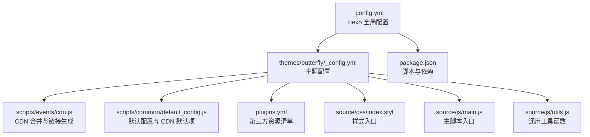
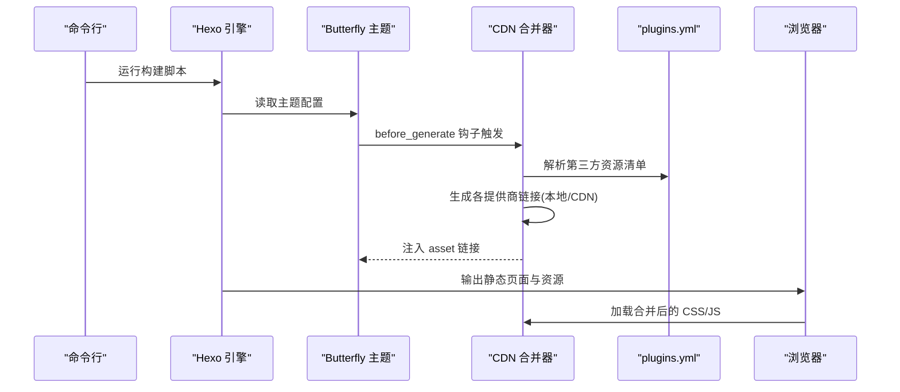
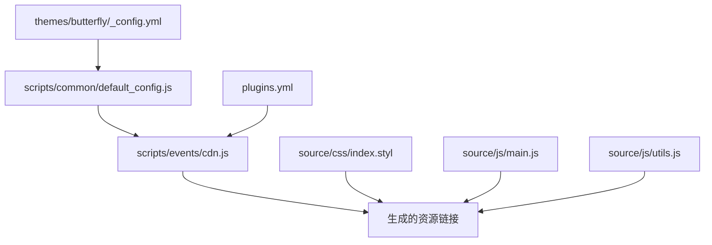

# 静态资源压缩

<cite>
**本文引用的文件**
- [_config.yml](file://_config.yml)
- [package.json](file://package.json)
- [themes/butterfly/_config.yml](file://themes/butterfly/_config.yml)
- [themes/butterfly/scripts/events/cdn.js](file://themes/butterfly/scripts/events/cdn.js)
- [themes/butterfly/scripts/common/default_config.js](file://themes/butterfly/scripts/common/default_config.js)
- [themes/butterfly/plugins.yml](file://themes/butterfly/plugins.yml)
- [themes/butterfly/source/css/index.styl](file://themes/butterfly/source/css/index.styl)
- [themes/butterfly/source/js/main.js](file://themes/butterfly/source/js/main.js)
- [themes/butterfly/source/js/utils.js](file://themes/butterfly/source/js/utils.js)
</cite>

## 目录
1. [简介](#简介)
2. [项目结构](#项目结构)
3. [核心组件](#核心组件)
4. [架构总览](#架构总览)
5. [详细组件分析](#详细组件分析)
6. [依赖关系分析](#依赖关系分析)
7. [性能考量](#性能考量)
8. [故障排查指南](#故障排查指南)
9. [结论](#结论)
10. [附录](#附录)

## 简介
本指南围绕 Hexo 博客在构建阶段对静态资源（CSS、JavaScript、图片）进行压缩与优化的完整流程展开，结合当前主题与脚本的实际实现，给出可落地的策略、配置路径与优化建议，并补充 CDN 集成、缓存策略、版本管理与浏览器缓存最佳实践，以及性能监控与评估方法。

## 项目结构
本项目采用 Hexo + Butterfly 主题的典型结构：站点根目录包含 Hexo 配置与脚本；主题位于 themes/butterfly，内含样式入口、脚本入口、CDN 合并与默认配置等关键模块。

**图表来源**
- [_config.yml:1-107](file://_config.yml#L1-L107)
- [themes/butterfly/_config.yml:1-1140](file://themes/butterfly/_config.yml#L1-L1140)
- [themes/butterfly/scripts/events/cdn.js:1-96](file://themes/butterfly/scripts/events/cdn.js#L1-L96)
- [themes/butterfly/scripts/common/default_config.js:1-602](file://themes/butterfly/scripts/common/default_config.js#L1-L602)
- [themes/butterfly/plugins.yml:1-208](file://themes/butterfly/plugins.yml#L1-L208)
- [themes/butterfly/source/css/index.styl:1-15](file://themes/butterfly/source/css/index.styl#L1-L15)
- [themes/butterfly/source/js/main.js:1-988](file://themes/butterfly/source/js/main.js#L1-L988)
- [themes/butterfly/source/js/utils.js:1-339](file://themes/butterfly/source/js/utils.js#L1-L339)

**章节来源**
- [_config.yml:1-107](file://_config.yml#L1-L107)
- [package.json:1-29](file://package.json#L1-L29)

## 核心组件
- 构建与部署脚本：通过 package.json 的脚本定义执行 hexo generate、hexo deploy 等命令。
- 主题配置：themes/butterfly/_config.yml 提供主题功能开关与 CDN 配置项。
- CDN 合并器：scripts/events/cdn.js 在 before_generate 阶段解析 plugins.yml 与主题默认资源，生成各 CDN 提供商的链接，并注入到主题配置中。
- 默认配置：scripts/common/default_config.js 定义了 CDN 默认提供商、版本参数与自定义格式化模板。
- 第三方资源清单：plugins.yml 列出主题扩展与第三方 JS/CSS 资源及其版本号。
- 样式入口：source/css/index.styl 统一引入全局、页面、布局、标签页与模式样式。
- 脚本入口与工具：source/js/main.js 与 utils.js 提供交互逻辑、节流防抖、滚动处理、加载器等基础能力。

**章节来源**
- [themes/butterfly/scripts/events/cdn.js:1-96](file://themes/butterfly/scripts/events/cdn.js#L1-L96)
- [themes/butterfly/scripts/common/default_config.js:594-600](file://themes/butterfly/scripts/common/default_config.js#L594-L600)
- [themes/butterfly/plugins.yml:1-208](file://themes/butterfly/plugins.yml#L1-L208)
- [themes/butterfly/source/css/index.styl:1-15](file://themes/butterfly/source/css/index.styl#L1-L15)
- [themes/butterfly/source/js/main.js:1-988](file://themes/butterfly/source/js/main.js#L1-L988)
- [themes/butterfly/source/js/utils.js:1-339](file://themes/butterfly/source/js/utils.js#L1-L339)

## 架构总览
下图展示从 Hexo 构建到主题资源加载的关键路径，重点体现 CSS/JS 的入口与 CDN 合并流程。

**图表来源**
- [themes/butterfly/scripts/events/cdn.js:11-95](file://themes/butterfly/scripts/events/cdn.js#L11-L95)
- [themes/butterfly/plugins.yml:1-208](file://themes/butterfly/plugins.yml#L1-L208)
- [themes/butterfly/source/css/index.styl:1-15](file://themes/butterfly/source/css/index.styl#L1-L15)
- [themes/butterfly/source/js/main.js:1-988](file://themes/butterfly/source/js/main.js#L1-L988)

## 详细组件分析

### CSS 压缩与优化策略
- 样式入口组织：index.styl 通过 @import 统一引入全局、高亮、页面、布局、标签页与模式样式，便于后续构建工具集中处理。
- 压缩建议：
  - 使用 Stylus 渲染时启用压缩输出（在 Hexo 渲染器或构建工具链中配置）。
  - 将 normalize 等第三方 CSS 以最小化版本引入，如已存在 normalize.min.css。
  - 对业务样式进行去重、合并与注释清理。
  - 通过 CDN 提供的 min 版本链接减少体积与网络往返。
- 实现依据：
  - 样式入口文件路径与导入顺序见 [index.styl:1-15](file://themes/butterfly/source/css/index.styl#L1-L15)。
  - CDN 合并器会自动为 CSS 文件名添加 .min 后缀，参见 [cdn.js:44-46](file://themes/butterfly/scripts/events/cdn.js#L44-L46)。

**章节来源**
- [themes/butterfly/source/css/index.styl:1-15](file://themes/butterfly/source/css/index.styl#L1-L15)
- [themes/butterfly/scripts/events/cdn.js:44-46](file://themes/butterfly/scripts/events/cdn.js#L44-L46)

### JavaScript 压缩与优化策略
- 资源入口与合并：
  - 主题内置资源包括 main.js、utils.js、tw_cn.js 与搜索脚本等，CDN 合并器会为这些资源生成 min 版本链接。
  - 第三方插件（如 mermaid、chart.js、katex、fancybox 等）由 plugins.yml 统一声明版本与文件路径。
- 压缩建议：
  - 使用打包工具（如 webpack/vite）在构建阶段进行 Tree Shaking、死代码消除与压缩。
  - 将非关键脚本延迟加载或按需动态导入，降低首屏阻塞。
  - 启用资源分片与缓存版本号，提升缓存命中率。
- 实现依据：
  - 内部资源映射与 min 文件规则见 [cdn.js:16-42](file://themes/butterfly/scripts/events/cdn.js#L16-L42)。
  - 第三方资源清单见 [plugins.yml:1-208](file://themes/butterfly/plugins.yml#L1-L208)。
  - 主题默认配置中的 CDN 选项见 [default_config.js:594-600](file://themes/butterfly/scripts/common/default_config.js#L594-L600)。

**章节来源**
- [themes/butterfly/scripts/events/cdn.js:16-42](file://themes/butterfly/scripts/events/cdn.js#L16-L42)
- [themes/butterfly/plugins.yml:1-208](file://themes/butterfly/plugins.yml#L1-L208)
- [themes/butterfly/scripts/common/default_config.js:594-600](file://themes/butterfly/scripts/common/default_config.js#L594-L600)

### 图片资源优化策略
- 压缩建议：
  - 使用现代格式（WebP/AVIF）并提供回退方案（JPEG/PNG），在不同网络条件下选择最优格式。
  - 对大图采用懒加载与响应式尺寸（srcset/sizes），减少带宽占用。
  - 对重复图片进行去重与复用，统一存放于 source/images 并通过 CDN 分发。
- 实施要点：
  - 在文章中使用相对路径引用图片，确保构建后路径正确。
  - 结合主题的图片懒加载与画廊组件，优化加载体验。

[本节为通用实践说明，不直接分析具体文件，故无“章节来源”]

### Hexo 构建流程与资源优化工具链
- 构建脚本：通过 package.json 的 build/deploy/server 脚本驱动 Hexo 生成与部署。
- 主题钩子：before_generate 阶段执行 CDN 合并逻辑，确保在生成静态页面前完成资源链接替换。
- 工具链建议：
  - 在 CI 中集成压缩与校验步骤（如 CSS/JS 最小化、图片压缩、HTML/CSS/JS 校验）。
  - 使用构建产物的指纹（hash）作为版本标识，配合 CDN 缓存策略。
- 实现依据：
  - 构建脚本见 [package.json:5-10](file://package.json#L5-L10)。
  - CDN 钩子注册见 [cdn.js:11-11](file://themes/butterfly/scripts/events/cdn.js#L11-L11)。

**章节来源**
- [package.json:5-10](file://package.json#L5-L10)
- [themes/butterfly/scripts/events/cdn.js:11-11](file://themes/butterfly/scripts/events/cdn.js#L11-L11)

### CDN 集成与缓存策略
- CDN 提供商与链接生成：
  - 支持本地、jsDelivr、unpkg、cdnjs 与自定义格式化模板。
  - 自动根据文件名生成 .min 版本链接，同时支持版本号查询参数或路径后缀。
- 缓存策略建议：
  - 静态资源设置长缓存（immutable 或强缓存），并以内容哈希命名文件。
  - HTML 设置较短缓存或 no-cache，避免模板变更被长期缓存。
  - CDN 边缘节点开启压缩（Gzip/Brotli）与 HTTP/2 多路复用。
- 实现依据：
  - 链接生成逻辑见 [cdn.js:48-78](file://themes/butterfly/scripts/events/cdn.js#L48-L78)。
  - 默认配置中的 CDN 选项见 [default_config.js:594-600](file://themes/butterfly/scripts/common/default_config.js#L594-L600)。

**章节来源**
- [themes/butterfly/scripts/events/cdn.js:48-78](file://themes/butterfly/scripts/events/cdn.js#L48-L78)
- [themes/butterfly/scripts/common/default_config.js:594-600](file://themes/butterfly/scripts/common/default_config.js#L594-L600)

### 资源版本管理与浏览器缓存最佳实践
- 版本管理：
  - 使用主题配置中的版本开关，为资源附加版本号参数或路径后缀，实现“禁用缓存”与“强制更新”的灵活控制。
  - 在 CI 中为构建产物生成唯一哈希，作为长期缓存的标识符。
- 浏览器缓存：
  - 对 CSS/JS 设置极长 max-age，对 HTML 设置短缓存或协商缓存。
  - 使用 ETag/Last-Modified 实现条件请求，减少带宽消耗。
- 实现依据：
  - 版本参数拼接逻辑见 [cdn.js:56-56](file://themes/butterfly/scripts/events/cdn.js#L56-L56)。
  - 默认 CDN 选项见 [default_config.js:594-600](file://themes/butterfly/scripts/common/default_config.js#L594-L600)。

**章节来源**
- [themes/butterfly/scripts/events/cdn.js:56-56](file://themes/butterfly/scripts/events/cdn.js#L56-L56)
- [themes/butterfly/scripts/common/default_config.js:594-600](file://themes/butterfly/scripts/common/default_config.js#L594-L600)

### 性能监控与优化效果评估
- 监控指标：
  - 首屏时间（FCP/LCP）、交互时间（FID/INP）、页面速度指数（CLS）。
  - 资源体积分布（CSS/JS/图片）、请求数量、缓存命中率。
- 评估方法：
  - 使用 Lighthouse/Chrome DevTools Performance/Network 面板进行基准测试。
  - 在灰度环境中对比优化前后指标变化，持续迭代。
- 实施建议：
  - 将关键 CSS 内联，其余 CSS 异步加载。
  - 将非关键 JS 延迟加载或拆分为独立 chunk。
  - 对图片进行格式转换与尺寸裁剪，必要时启用懒加载。

[本节为通用实践说明，不直接分析具体文件，故无“章节来源”]

## 依赖关系分析
下图展示主题配置、CDN 合并器与第三方资源之间的依赖关系。

**图表来源**
- [themes/butterfly/_config.yml:1-1140](file://themes/butterfly/_config.yml#L1-L1140)
- [themes/butterfly/scripts/common/default_config.js:594-600](file://themes/butterfly/scripts/common/default_config.js#L594-L600)
- [themes/butterfly/scripts/events/cdn.js:11-95](file://themes/butterfly/scripts/events/cdn.js#L11-L95)
- [themes/butterfly/plugins.yml:1-208](file://themes/butterfly/plugins.yml#L1-L208)
- [themes/butterfly/source/css/index.styl:1-15](file://themes/butterfly/source/css/index.styl#L1-L15)
- [themes/butterfly/source/js/main.js:1-988](file://themes/butterfly/source/js/main.js#L1-L988)
- [themes/butterfly/source/js/utils.js:1-339](file://themes/butterfly/source/js/utils.js#L1-L339)

**章节来源**
- [themes/butterfly/_config.yml:1-1140](file://themes/butterfly/_config.yml#L1-L1140)
- [themes/butterfly/scripts/common/default_config.js:594-600](file://themes/butterfly/scripts/common/default_config.js#L594-L600)
- [themes/butterfly/scripts/events/cdn.js:11-95](file://themes/butterfly/scripts/events/cdn.js#L11-L95)
- [themes/butterfly/plugins.yml:1-208](file://themes/butterfly/plugins.yml#L1-L208)
- [themes/butterfly/source/css/index.styl:1-15](file://themes/butterfly/source/css/index.styl#L1-L15)
- [themes/butterfly/source/js/main.js:1-988](file://themes/butterfly/source/js/main.js#L1-L988)
- [themes/butterfly/source/js/utils.js:1-339](file://themes/butterfly/source/js/utils.js#L1-L339)

## 性能考量
- 构建阶段优化：
  - 在 Hexo 渲染器中启用 CSS/JS 压缩与 HTML 去空白。
  - 使用打包工具进行 Tree Shaking 与代码分割。
- 运行时优化：
  - 启用 CDN 压缩与边缘缓存，合理设置缓存头。
  - 对图片进行格式转换与尺寸裁剪，结合懒加载与响应式适配。
- 监控与回归：
  - 建立自动化性能基线，定期对比关键指标，防止回归。

[本节为通用指导，不直接分析具体文件，故无“章节来源”]

## 故障排查指南
- CDN 链接异常：
  - 检查主题配置中的 CDN 提供商与版本开关，确认生成的链接是否包含 .min 与版本号。
  - 参考：[cdn.js:48-78](file://themes/butterfly/scripts/events/cdn.js#L48-L78)、[default_config.js:594-600](file://themes/butterfly/scripts/common/default_config.js#L594-L600)。
- 第三方资源缺失：
  - 核对 plugins.yml 中的资源名称、文件路径与版本号是否正确。
  - 参考：[plugins.yml:1-208](file://themes/butterfly/plugins.yml#L1-L208)。
- 样式或脚本未生效：
  - 确认 index.styl 的 @import 顺序与文件存在性。
  - 参考：[index.styl:1-15](file://themes/butterfly/source/css/index.styl#L1-L15)、[main.js:1-988](file://themes/butterfly/source/js/main.js#L1-L988)、[utils.js:1-339](file://themes/butterfly/source/js/utils.js#L1-L339)。
- 构建失败或耗时过长：
  - 检查渲染器与插件版本兼容性，必要时降级或升级至稳定版本。
  - 参考：[_config.yml:96-107](file://_config.yml#L96-L107)、[package.json:14-28](file://package.json#L14-L28)。

**章节来源**
- [themes/butterfly/scripts/events/cdn.js:48-78](file://themes/butterfly/scripts/events/cdn.js#L48-L78)
- [themes/butterfly/scripts/common/default_config.js:594-600](file://themes/butterfly/scripts/common/default_config.js#L594-L600)
- [themes/butterfly/plugins.yml:1-208](file://themes/butterfly/plugins.yml#L1-L208)
- [themes/butterfly/source/css/index.styl:1-15](file://themes/butterfly/source/css/index.styl#L1-L15)
- [themes/butterfly/source/js/main.js:1-988](file://themes/butterfly/source/js/main.js#L1-L988)
- [themes/butterfly/source/js/utils.js:1-339](file://themes/butterfly/source/js/utils.js#L1-L339)
- [_config.yml:96-107](file://_config.yml#L96-L107)
- [package.json:14-28](file://package.json#L14-L28)

## 结论
通过在 Hexo 构建阶段集成 CDN 合并与资源压缩，结合合理的缓存策略与版本管理，可显著提升页面加载性能与用户体验。建议在现有主题与脚本基础上，进一步完善打包与监控体系，形成可量化、可持续的优化闭环。

## 附录
- 关键配置与脚本路径速览：
  - 构建脚本：[package.json:5-10](file://package.json#L5-L10)
  - 主题配置：[themes/butterfly/_config.yml:1-1140](file://themes/butterfly/_config.yml#L1-L1140)
  - CDN 合并器：[themes/butterfly/scripts/events/cdn.js:1-96](file://themes/butterfly/scripts/events/cdn.js#L1-L96)
  - 默认 CDN 选项：[themes/butterfly/scripts/common/default_config.js:594-600](file://themes/butterfly/scripts/common/default_config.js#L594-L600)
  - 第三方资源清单：[themes/butterfly/plugins.yml:1-208](file://themes/butterfly/plugins.yml#L1-L208)
  - 样式入口：[themes/butterfly/source/css/index.styl:1-15](file://themes/butterfly/source/css/index.styl#L1-L15)
  - 脚本入口与工具：[themes/butterfly/source/js/main.js:1-988](file://themes/butterfly/source/js/main.js#L1-L988)、[themes/butterfly/source/js/utils.js:1-339](file://themes/butterfly/source/js/utils.js#L1-L339)