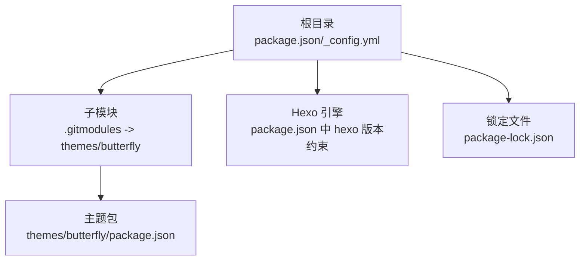
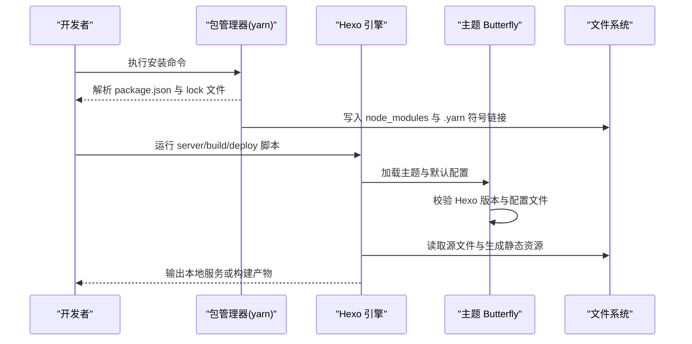
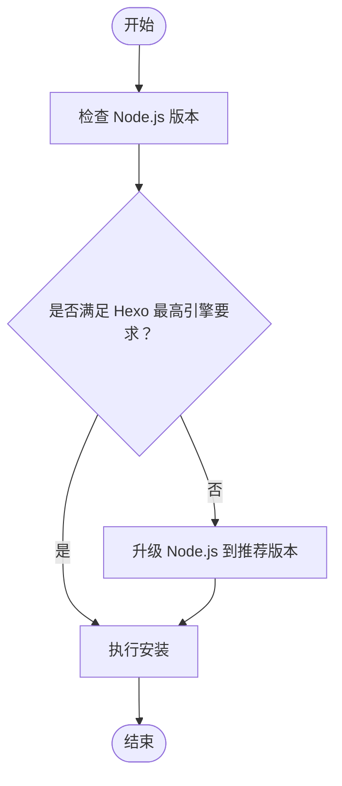
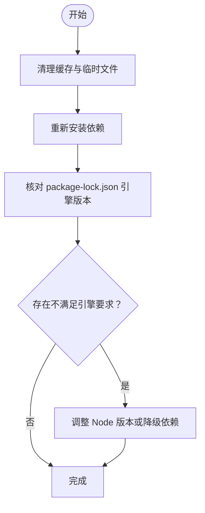
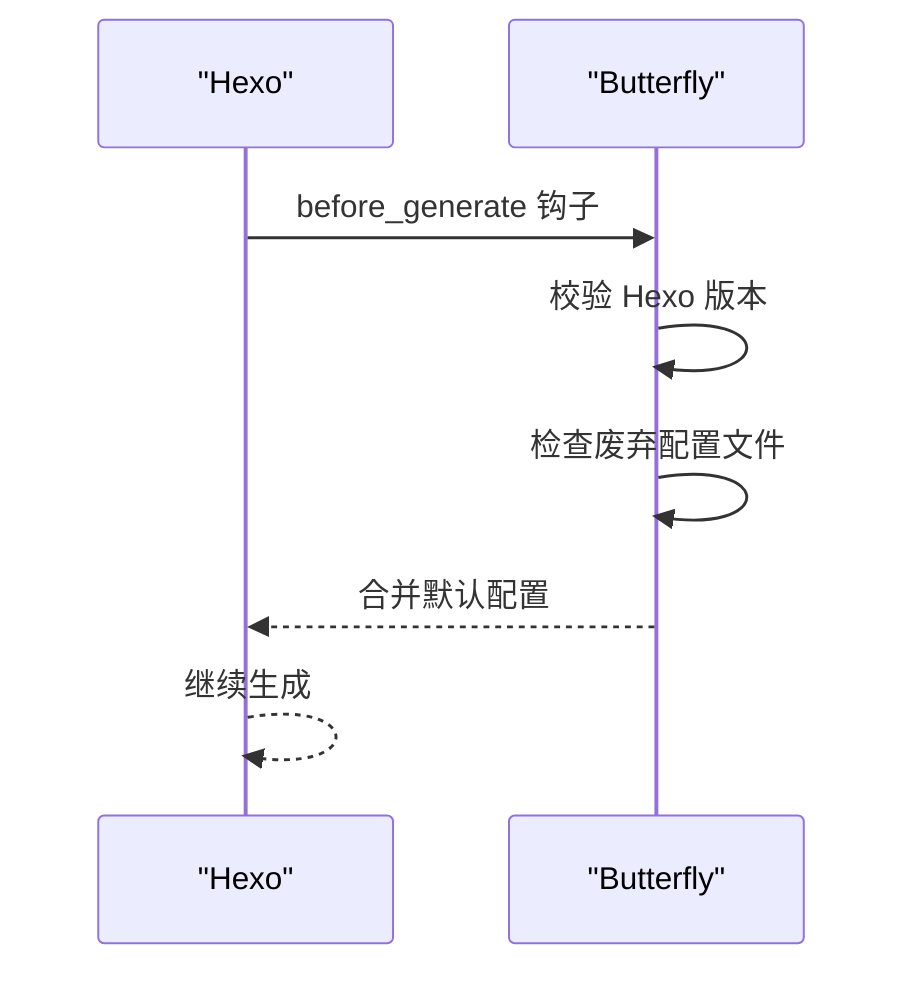
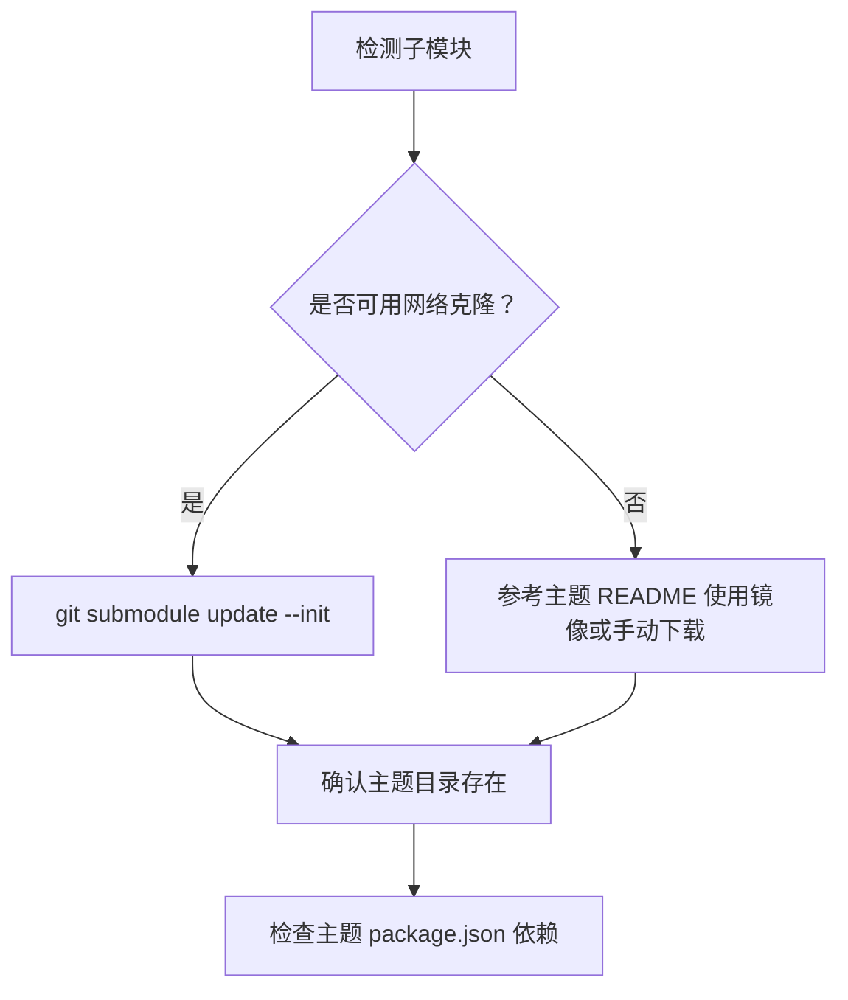
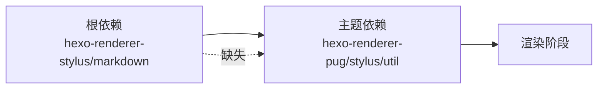

# 安装问题

<cite>
**本文引用的文件**
- [package.json](file://package.json)
- [package-lock.json](file://package-lock.json)
- [_config.yml](file://_config.yml)
- [.gitmodules](file://.gitmodules)
- [themes/butterfly/package.json](file://themes/butterfly/package.json)
- [themes/butterfly/scripts/events/init.js](file://themes/butterfly/scripts/events/init.js)
- [themes/butterfly/README.md](file://themes/butterfly/README.md)
- [.github/dependabot.yml](file://.github/dependabot.yml)
</cite>

## 目录
1. [简介](#简介)
2. [项目结构](#项目结构)
3. [核心组件](#核心组件)
4. [架构总览](#架构总览)
5. [详细组件分析](#详细组件分析)
6. [依赖关系分析](#依赖关系分析)
7. [性能与稳定性建议](#性能与稳定性建议)
8. [故障排查指南](#故障排查指南)
9. [结论](#结论)
10. [附录](#附录)

## 简介
本指南面向首次或在不同环境下安装 dzz-blog 的用户，聚焦以下常见安装问题：
- Node.js 版本不兼容导致的安装/运行失败
- npm/yarn 依赖安装失败（含锁文件与引擎要求）
- Hexo 框架初始化错误
- GitHub 子模块克隆失败
- 主题包安装与渲染器依赖缺失
- 网络代理、权限与缓存清理等通用障碍

目标是帮助你在最短时间内定位并解决问题，顺利启动本地预览与部署。

## 项目结构
本仓库采用 Hexo 静态博客标准目录，并通过 Git 子模块引入主题。关键文件与职责如下：
- 根级配置：_config.yml 控制站点、主题与部署
- 包管理：package.json 声明脚本与依赖；package-lock.json 锁定版本
- 子模块：.gitmodules 指向主题仓库地址
- 主题：themes/butterfly 提供主题包与默认配置校验逻辑

图表来源
- [package.json:1-29](file://package.json#L1-L29)
- [_config.yml:1-107](file://_config.yml#L1-L107)
- [.gitmodules:1-4](file://.gitmodules#L1-L4)
- [themes/butterfly/package.json:1-35](file://themes/butterfly/package.json#L1-L35)

章节来源
- [package.json:1-29](file://package.json#L1-L29)
- [_config.yml:1-107](file://_config.yml#L1-L107)
- [.gitmodules:1-4](file://.gitmodules#L1-L4)
- [themes/butterfly/package.json:1-35](file://themes/butterfly/package.json#L1-L35)

## 核心组件
- Hexo 引擎与脚本
  - 根 package.json 声明了 build、clean、deploy、server 等脚本，且通过 hexo 字段声明了 Hexo 版本范围。
- 依赖与引擎要求
  - package-lock.json 显示各依赖的最低 Node.js 引擎版本要求，如 hexo 要求 Node >= 20.19.0，部分子依赖要求 Node >= 14/18。
- 主题与渲染器
  - 主题 themes/butterfly/package.json 依赖 hexo-renderer-pug 与 hexo-renderer-stylus；但根 package.json 已包含 hexo-renderer-stylus 与 hexo-renderer-marked，缺少 hexo-renderer-pug 可能导致主题渲染异常。
- 部署配置
  - _config.yml 中已配置 type: git、repo、branch，可直接进行一键部署。

章节来源
- [package.json:5-13](file://package.json#L5-L13)
- [package-lock.json:1038-1040](file://package-lock.json#L1038-L1040)
- [themes/butterfly/package.json:25-30](file://themes/butterfly/package.json#L25-L30)
- [_config.yml:101-107](file://_config.yml#L101-L107)

## 架构总览
下图展示从安装到本地服务启动的关键流程与依赖关系：

图表来源
- [package.json:5-13](file://package.json#L5-L13)
- [themes/butterfly/scripts/events/init.js:10-32](file://themes/butterfly/scripts/events/init.js#L10-L32)
- [themes/butterfly/README.md:30-71](file://themes/butterfly/README.md#L30-L71)

## 详细组件分析

### 组件一：Node.js 与 Hexo 引擎版本要求
- Hexo 根包要求 Node >= 20.19.0（来自 hexo 引擎字段）
- 多个子依赖对 Node 版本有更高要求（如 >=18、>=14），需确保全局 Node 版本满足最高要求
- 若 Node 版本过低，安装阶段会因引擎不匹配而失败，或在运行时抛出版本不兼容错误

图表来源
- [package-lock.json:1038-1040](file://package-lock.json#L1038-L1040)
- [package-lock.json:1121-1123](file://package-lock.json#L1121-L1123)
- [package-lock.json:1394-1396](file://package-lock.json#L1394-L1396)

章节来源
- [package-lock.json:1038-1040](file://package-lock.json#L1038-L1040)
- [package-lock.json:1121-1123](file://package-lock.json#L1121-L1123)
- [package-lock.json:1394-1396](file://package-lock.json#L1394-L1396)

### 组件二：依赖安装与冲突排查
- 使用 yarn@4.6.0+...（由 package.json 的 packageManager 字段声明）进行安装
- 若安装失败，优先检查 package-lock.json 中是否存在引擎不满足的依赖
- 建议先清理缓存再重试，避免锁文件与缓存导致的冲突

图表来源
- [package.json:27-28](file://package.json#L27-L28)
- [package-lock.json:1038-1040](file://package-lock.json#L1038-L1040)

章节来源
- [package.json:27-28](file://package.json#L27-L28)
- [package-lock.json:1038-1040](file://package-lock.json#L1038-L1040)

### 组件三：Hexo 初始化与主题加载
- 主题事件脚本会在生成前检查 Hexo 版本与废弃配置文件，若版本过低或使用旧配置将直接报错
- 如未启用渲染器，主题渲染会失败

图表来源
- [themes/butterfly/scripts/events/init.js:10-32](file://themes/butterfly/scripts/events/init.js#L10-L32)
- [themes/butterfly/scripts/events/init.js:79-86](file://themes/butterfly/scripts/events/init.js#L79-L86)

章节来源
- [themes/butterfly/scripts/events/init.js:10-32](file://themes/butterfly/scripts/events/init.js#L10-L32)
- [themes/butterfly/scripts/events/init.js:79-86](file://themes/butterfly/scripts/events/init.js#L79-L86)

### 组件四：GitHub 子模块克隆与主题安装
- .gitmodules 指向主题仓库地址，需确保网络可达
- 主题 README 提供两种安装方式：Git 克隆与 NPM 安装
- 若使用 NPM 安装，需满足主题要求的 Hexo 版本

图表来源
- [.gitmodules:1-4](file://.gitmodules#L1-L4)
- [themes/butterfly/README.md:30-71](file://themes/butterfly/README.md#L30-L71)

章节来源
- [.gitmodules:1-4](file://.gitmodules#L1-L4)
- [themes/butterfly/README.md:30-71](file://themes/butterfly/README.md#L30-L71)

## 依赖关系分析
- 根依赖与主题依赖的关系
  - 根 package.json 已包含 hexo-renderer-stylus 与 hexo-renderer-marked，但缺少 hexo-renderer-pug
  - 主题 themes/butterfly/package.json 明确需要 hexo-renderer-pug 与 hexo-renderer-stylus
  - 缺少 hexo-renderer-pug 将导致主题渲染阶段报错

图表来源
- [package.json:14-26](file://package.json#L14-L26)
- [themes/butterfly/package.json:25-30](file://themes/butterfly/package.json#L25-L30)

章节来源
- [package.json:14-26](file://package.json#L14-L26)
- [themes/butterfly/package.json:25-30](file://themes/butterfly/package.json#L25-L30)

## 性能与稳定性建议
- 使用官方推荐的 Node.js 版本（满足 hexo 的最低要求）
- 优先使用 yarn 并固定版本，避免 npm 与 yarn 混用造成锁文件差异
- 在中国大陆网络环境下，可考虑使用镜像源或代理，减少子模块与依赖下载失败率
- 定期更新依赖，结合 .github/dependabot.yml 的策略保持安全与兼容性

章节来源
- [.github/dependabot.yml:1-7](file://.github/dependabot.yml#L1-L7)

## 故障排查指南

### 场景一：Node.js 版本不兼容
- 症状
  - 安装阶段提示“engine”不满足
  - 运行时报“请升级 Hexo 到 V5.3.0 或更高”
- 排查步骤
  - 确认 Node 版本满足 hexo 的最低要求（>=20.19.0）
  - 若使用多版本管理工具（如 nvm），切换到正确版本后重试
- 相关依据
  - [package-lock.json:1038-1040](file://package-lock.json#L1038-L1040)
  - [themes/butterfly/scripts/events/init.js:10-21](file://themes/butterfly/scripts/events/init.js#L10-L21)

章节来源
- [package-lock.json:1038-1040](file://package-lock.json#L1038-L1040)
- [themes/butterfly/scripts/events/init.js:10-21](file://themes/butterfly/scripts/events/init.js#L10-L21)

### 场景二：npm/yarn 依赖安装失败
- 症状
  - 安装卡住、超时或报“engine”不满足
  - 依赖树中出现多个版本冲突
- 排查步骤
  - 清理缓存：yarn cache clean
  - 删除 node_modules/.yarn* 与 lock 文件后重装
  - 确认 packageManager 字段与实际使用的包管理器一致
- 相关依据
  - [package.json:27-28](file://package.json#L27-L28)
  - [package-lock.json:1038-1040](file://package-lock.json#L1038-L1040)

章节来源
- [package.json:27-28](file://package.json#L27-L28)
- [package-lock.json:1038-1040](file://package-lock.json#L1038-L1040)

### 场景三：Hexo 初始化错误
- 症状
  - 报错“请把 Hexo 升级到 V5.3.0 或更高的版本！”
  - 报错“butterfly.yml 已经弃用，请使用 _config.butterfly.yml”
- 排查步骤
  - 升级 Hexo 至 V5.3.0+
  - 将主题配置文件重命名为 _config.butterfly.yml
- 相关依据
  - [themes/butterfly/scripts/events/init.js:10-32](file://themes/butterfly/scripts/events/init.js#L10-L32)

章节来源
- [themes/butterfly/scripts/events/init.js:10-32](file://themes/butterfly/scripts/events/init.js#L10-L32)

### 场景四：GitHub 子模块克隆失败
- 症状
  - git submodule update 失败，提示网络错误
- 排查步骤
  - 使用镜像地址或代理
  - 手动下载主题压缩包至 themes/butterfly
- 相关依据
  - [.gitmodules:1-4](file://.gitmodules#L1-L4)
  - [themes/butterfly/README.md:30-48](file://themes/butterfly/README.md#L30-L48)

章节来源
- [.gitmodules:1-4](file://.gitmodules#L1-L4)
- [themes/butterfly/README.md:30-48](file://themes/butterfly/README.md#L30-L48)

### 场景五：主题包安装问题（渲染器缺失）
- 症状
  - 生成阶段渲染器报错，找不到 hexo-renderer-pug
- 排查步骤
  - 在根 package.json 中添加 hexo-renderer-pug
  - 重新安装依赖
- 相关依据
  - [themes/butterfly/package.json:25-30](file://themes/butterfly/package.json#L25-L30)
  - [package.json:14-26](file://package.json#L14-L26)

章节来源
- [themes/butterfly/package.json:25-30](file://themes/butterfly/package.json#L25-L30)
- [package.json:14-26](file://package.json#L14-L26)

### 场景六：网络代理设置
- 建议
  - 设置 npm/yarn 代理或使用国内镜像源
  - 子模块克隆时配置 git 代理
- 相关依据
  - [themes/butterfly/README.md:34-36](file://themes/butterfly/README.md#L34-L36)

章节来源
- [themes/butterfly/README.md:34-36](file://themes/butterfly/README.md#L34-L36)

### 场景七：权限问题
- 建议
  - 以管理员身份运行终端
  - 检查 node_modules 目录写权限
- 相关依据
  - [package-lock.json:1038-1040](file://package-lock.json#L1038-L1040)

章节来源
- [package-lock.json:1038-1040](file://package-lock.json#L1038-L1040)

### 场景八：缓存清理
- 建议
  - yarn cache clean
  - 删除 node_modules 与 lock 文件后重装
- 相关依据
  - [package.json:27-28](file://package.json#L27-L28)

章节来源
- [package.json:27-28](file://package.json#L27-L28)

## 结论
安装问题多源于 Node.js 版本不满足、依赖引擎限制、主题渲染器缺失与网络环境不稳定。按本指南逐项排查，通常可在数分钟内完成修复。建议在团队内统一 Node 与包管理器版本，配合镜像与代理策略，提升安装稳定性。

## 附录

### 常见错误与对应处理清单
- “engine”不满足
  - 处理：升级 Node.js 至满足 hexo 的最低要求
  - 依据：[package-lock.json:1038-1040](file://package-lock.json#L1038-L1040)
- “请升级 Hexo 到 V5.3.0 或更高”
  - 处理：升级 Hexo 至 V5.3.0+
  - 依据：[themes/butterfly/scripts/events/init.js:10-21](file://themes/butterfly/scripts/events/init.js#L10-L21)
- “butterfly.yml 已弃用”
  - 处理：改名为 _config.butterfly.yml
  - 依据：[themes/butterfly/scripts/events/init.js:23-31](file://themes/butterfly/scripts/events/init.js#L23-L31)
- 子模块克隆失败
  - 处理：使用镜像或代理；或手动下载主题
  - 依据：[.gitmodules:1-4](file://.gitmodules#L1-L4)，[themes/butterfly/README.md:34-48](file://themes/butterfly/README.md#L34-L48)
- 缺少 hexo-renderer-pug
  - 处理：在根 package.json 添加该依赖并重装
  - 依据：[themes/butterfly/package.json:25-30](file://themes/butterfly/package.json#L25-L30)，[package.json:14-26](file://package.json#L14-L26)