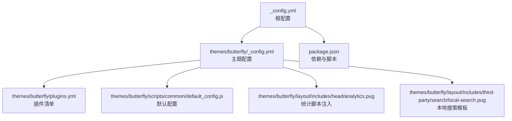
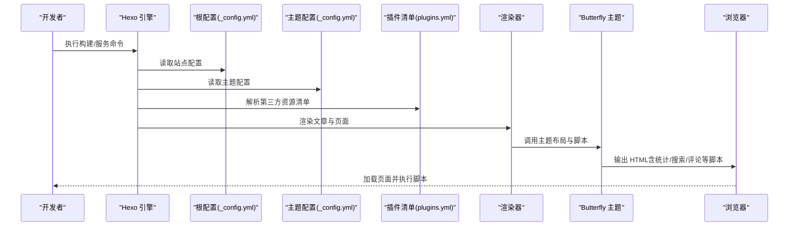
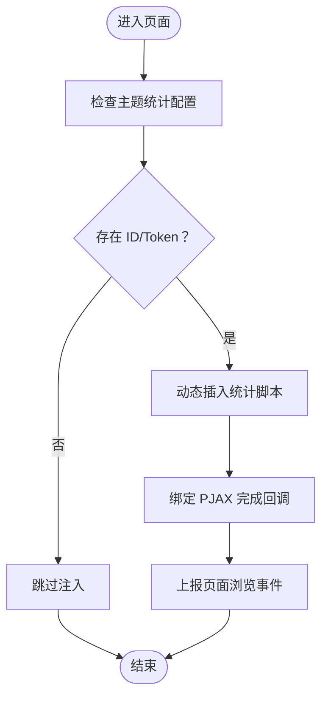
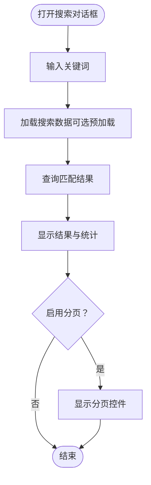
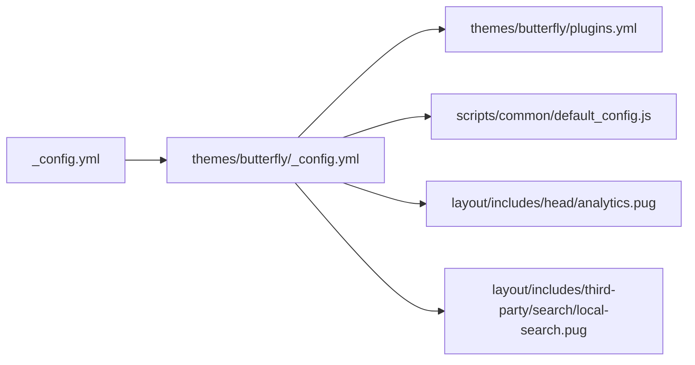

# 故障排除

<cite>
**本文引用的文件**
- [_config.yml](file://_config.yml)
- [package.json](file://package.json)
- [themes/butterfly/_config.yml](file://themes/butterfly/_config.yml)
- [themes/butterfly/package.json](file://themes/butterfly/package.json)
- [themes/butterfly/plugins.yml](file://themes/butterfly/plugins.yml)
- [themes/butterfly/scripts/common/default_config.js](file://themes/butterfly/scripts/common/default_config.js)
- [themes/butterfly/layout/includes/head/analytics.pug](file://themes/butterfly/layout/includes/head/analytics.pug)
- [themes/butterfly/layout/includes/third-party/search/local-search.pug](file://themes/butterfly/layout/includes/third-party/search/local-search.pug)
</cite>

## 目录
1. [简介](#简介)
2. [项目结构](#项目结构)
3. [核心组件](#核心组件)
4. [架构总览](#架构总览)
5. [详细组件分析](#详细组件分析)
6. [依赖关系分析](#依赖关系分析)
7. [性能考量](#性能考量)
8. [故障排除指南](#故障排除指南)
9. [结论](#结论)
10. [附录](#附录)

## 简介
本指南面向 dzz-blog 项目（Hexo + Butterfly 主题）的维护者与开发者，聚焦于常见问题的定位与解决，覆盖安装失败、配置错误、渲染异常、部署问题；提供调试工具使用方法（日志分析、错误追踪、性能诊断）；涵盖主题相关问题（样式冲突、脚本错误、模板渲染问题）；给出第三方服务集成（评论系统、统计分析、搜索）的排障建议；并说明开发与生产环境差异（缓存清理、配置校验、版本兼容性），辅以真实案例与解决步骤。

## 项目结构
- 根目录包含 Hexo 配置、包管理与脚本定义，以及主题目录 themes/butterfly。
- 主题目录内含布局、样式、脚本、语言包、插件清单等，支持多种第三方服务与功能模块。
- 关键配置文件：
  - 根配置：站点信息、URL、分页、高亮、部署等。
  - 主题配置：导航、代码块、封面图、统计、评论、搜索、分享、广告等。
  - 插件清单：声明第三方库版本与文件路径，用于按需加载。
  - 默认配置脚本：主题默认参数与开关，便于对比用户配置是否生效。

图表来源
- [_config.yml](file://_config.yml)
- [themes/butterfly/_config.yml](file://themes/butterfly/_config.yml)
- [themes/butterfly/plugins.yml](file://themes/butterfly/plugins.yml)
- [themes/butterfly/scripts/common/default_config.js](file://themes/butterfly/scripts/common/default_config.js)
- [themes/butterfly/layout/includes/head/analytics.pug](file://themes/butterfly/layout/includes/head/analytics.pug)
- [themes/butterfly/layout/includes/third-party/search/local-search.pug](file://themes/butterfly/layout/includes/third-party/search/local-search.pug)

章节来源
- [_config.yml](file://_config.yml)
- [package.json](file://package.json)
- [themes/butterfly/_config.yml](file://themes/butterfly/_config.yml)

## 核心组件
- 站点配置（根配置）
  - 站点元数据、URL、永久链接、分页、高亮与 PrismJS 设置、部署方式等。
- 主题配置（Butterfly）
  - 导航、封面图、副标题、TOC、版权、侧栏卡片、深色模式、读屏模式、数学公式、搜索、分享、评论、聊天、统计、广告、站点验证等。
- 插件清单（Butterfly）
  - 声明第三方库（如 Algolia、KaTeX、Mermaid、Twikoo、Waline、Giscus 等）的名称、版本与文件路径，决定页面按需加载哪些资源。
- 默认配置脚本（Butterfly）
  - 提供主题所有可配置项的默认值，便于核对用户配置是否覆盖或遗漏。
- 统计与分析注入（Butterfly）
  - 在头部动态注入百度统计、Google Analytics、Cloudflare Insights、Microsoft Clarity、Google Tag Manager 等脚本。
- 本地搜索模板（Butterfly）
  - 定义本地搜索对话框、输入框、结果容器与遮罩层，并在页面中加载搜索脚本。

章节来源
- [_config.yml](file://_config.yml)
- [themes/butterfly/_config.yml](file://themes/butterfly/_config.yml)
- [themes/butterfly/plugins.yml](file://themes/butterfly/plugins.yml)
- [themes/butterfly/scripts/common/default_config.js](file://themes/butterfly/scripts/common/default_config.js)
- [themes/butterfly/layout/includes/head/analytics.pug](file://themes/butterfly/layout/includes/head/analytics.pug)
- [themes/butterfly/layout/includes/third-party/search/local-search.pug](file://themes/butterfly/layout/includes/third-party/search/local-search.pug)

## 架构总览
下图展示从生成到渲染的关键流程：Hexo 读取根配置与主题配置，调用渲染器与主题脚本，注入统计与第三方资源，最终输出静态页面。

图表来源
- [_config.yml](file://_config.yml)
- [themes/butterfly/_config.yml](file://themes/butterfly/_config.yml)
- [themes/butterfly/plugins.yml](file://themes/butterfly/plugins.yml)

## 详细组件分析

### 组件一：统计与分析注入
- 功能要点
  - 条件注入：仅当主题配置中存在对应 ID 或 Token 时才插入脚本。
  - GA4/Clarity/云存图：通过动态 script 标签与全局函数绑定，实现 PJAX 页面切换后的事件上报。
  - GTM：支持自定义域名与事件推送。
- 常见问题
  - ID/Token 未填写导致脚本不加载。
  - 域名或路径变更后未同步更新配置。
  - 生产环境与本地环境域名不一致导致埋点异常。
- 排障步骤
  - 检查主题配置中的统计字段是否已填写。
  - 在页面源码中确认对应脚本标签是否存在。
  - 使用浏览器开发者工具 Network/Console 查看脚本加载与错误。
  - 对比 GA/GTM 的页面路径与实际路由是否一致。

图表来源
- [themes/butterfly/layout/includes/head/analytics.pug](file://themes/butterfly/layout/includes/head/analytics.pug)

章节来源
- [themes/butterfly/layout/includes/head/analytics.pug](file://themes/butterfly/layout/includes/head/analytics.pug)
- [themes/butterfly/_config.yml](file://themes/butterfly/_config.yml)

### 组件二：本地搜索
- 功能要点
  - 模板包含搜索对话框、输入框、结果区域与分页控件。
  - 通过 url_for 加载本地搜索脚本。
  - 支持预加载、结果数量与分页配置。
- 常见问题
  - 未启用本地搜索或未生成索引数据。
  - 预加载开启但数据量大导致首屏卡顿。
  - 分页配置与实际结果不匹配。
- 排障步骤
  - 确认主题配置中已选择本地搜索并设置占位符。
  - 检查生成目录中是否存在搜索数据文件。
  - 在页面源码中确认搜索脚本 URL 正确。
  - 调整预加载与分页参数观察效果。

图表来源
- [themes/butterfly/layout/includes/third-party/search/local-search.pug](file://themes/butterfly/layout/includes/third-party/search/local-search.pug)
- [themes/butterfly/_config.yml](file://themes/butterfly/_config.yml)

章节来源
- [themes/butterfly/layout/includes/third-party/search/local-search.pug](file://themes/butterfly/layout/includes/third-party/search/local-search.pug)
- [themes/butterfly/_config.yml](file://themes/butterfly/_config.yml)

### 组件三：评论系统（以 Giscus 为例）
- 功能要点
  - 支持多套评论系统，Giscus 为默认示例之一。
  - 通过仓库、分类、主题与脚本参数控制外观与行为。
- 常见问题
  - 仓库/分类 ID 错误导致无法加载。
  - 主题与站点主题不一致导致显示异常。
  - 跨域或网络限制导致脚本加载失败。
- 排障步骤
  - 校验仓库 ID、分类 ID 是否正确。
  - 切换至浅色/深色主题测试显示差异。
  - 在 Network 中查看评论脚本加载状态与错误。
  - 参考主题默认配置脚本核对缺失项。

章节来源
- [themes/butterfly/_config.yml](file://themes/butterfly/_config.yml)
- [themes/butterfly/scripts/common/default_config.js](file://themes/butterfly/scripts/common/default_config.js)

### 组件四：第三方库与资源加载（插件清单）
- 功能要点
  - plugins.yml 声明各第三方库的名称、版本与文件路径。
  - 主题根据配置按需加载，避免不必要的资源体积。
- 常见问题
  - 版本不兼容导致运行时错误。
  - CDN 源不可用或跨域策略影响加载。
  - 自定义路径与实际文件不一致。
- 排障步骤
  - 对照主题配置与插件清单，确认启用项与版本。
  - 使用 Network 面板检查资源 404 与跨域错误。
  - 如需自定义路径，确保路径与实际文件一致。

章节来源
- [themes/butterfly/plugins.yml](file://themes/butterfly/plugins.yml)
- [themes/butterfly/_config.yml](file://themes/butterfly/_config.yml)

## 依赖关系分析
- 根配置依赖主题配置：根配置决定渲染器、主题与部署方式；主题配置决定具体功能与资源加载。
- 主题配置依赖插件清单：主题按需启用第三方库，插件清单提供版本与文件路径。
- 运行时依赖浏览器环境：统计、搜索、评论等脚本在浏览器端执行。

图表来源
- [_config.yml](file://_config.yml)
- [themes/butterfly/_config.yml](file://themes/butterfly/_config.yml)
- [themes/butterfly/plugins.yml](file://themes/butterfly/plugins.yml)
- [themes/butterfly/scripts/common/default_config.js](file://themes/butterfly/scripts/common/default_config.js)
- [themes/butterfly/layout/includes/head/analytics.pug](file://themes/butterfly/layout/includes/head/analytics.pug)
- [themes/butterfly/layout/includes/third-party/search/local-search.pug](file://themes/butterfly/layout/includes/third-party/search/local-search.pug)

章节来源
- [_config.yml](file://_config.yml)
- [themes/butterfly/_config.yml](file://themes/butterfly/_config.yml)
- [themes/butterfly/plugins.yml](file://themes/butterfly/plugins.yml)

## 性能考量
- 资源加载优化
  - 合理启用懒加载与按需加载，减少首屏负担。
  - 选择合适的 CDN 与版本，避免频繁升级带来的不稳定。
- 渲染性能
  - 控制首页摘要长度与图片尺寸，减少 DOM 结构复杂度。
  - 关闭不必要的统计与广告，降低额外请求。
- 搜索性能
  - 本地搜索建议关闭预加载，或在数据量较大时分页显示。
- 缓存策略
  - 生产环境启用浏览器缓存与 CDN 缓存，注意版本号与哈希更新。

## 故障排除指南

### 一、安装与环境问题
- 症状：安装依赖失败或启动报错
  - 可能原因
    - 包管理器版本不兼容或网络受限。
    - Hexo 版本与插件版本不匹配。
  - 处理步骤
    - 清理缓存并重装依赖：执行清理与重新安装命令。
    - 校验根配置中的 Hexo 版本与依赖版本范围。
    - 更换镜像源或代理后重试。
  - 参考文件
    - [package.json](file://package.json)
    - [_config.yml](file://_config.yml)

章节来源
- [package.json](file://package.json)
- [_config.yml](file://_config.yml)

### 二、配置错误
- 症状：页面空白、样式错乱、功能不生效
  - 可能原因
    - 主题配置字段拼写错误或类型不符。
    - 未启用必要的渲染器或主题。
    - 部署配置与目标仓库不一致。
  - 处理步骤
    - 对照默认配置脚本逐项核对，确认未遗漏必填项。
    - 检查根配置中的主题与渲染器是否正确。
    - 校验部署仓库地址与分支是否匹配。
  - 参考文件
    - [themes/butterfly/scripts/common/default_config.js](file://themes/butterfly/scripts/common/default_config.js)
    - [themes/butterfly/_config.yml](file://themes/butterfly/_config.yml)
    - [_config.yml](file://_config.yml)

章节来源
- [themes/butterfly/scripts/common/default_config.js](file://themes/butterfly/scripts/common/default_config.js)
- [themes/butterfly/_config.yml](file://themes/butterfly/_config.yml)
- [_config.yml](file://_config.yml)

### 三、渲染异常
- 症状：文章内容缺失、代码高亮失效、数学公式不显示
  - 可能原因
    - 渲染器未安装或版本不匹配。
    - 高亮配置与渲染器冲突（highlight.js 与 prismjs）。
    - 数学公式开关未启用或 per_page 配置不当。
  - 处理步骤
    - 确认已安装并启用对应的渲染器。
    - 保持高亮配置唯一（二选一），避免冲突。
    - 按需启用数学公式，或在文章 Front Matter 中显式声明。
  - 参考文件
    - [_config.yml](file://_config.yml)
    - [themes/butterfly/_config.yml](file://themes/butterfly/_config.yml)

章节来源
- [_config.yml](file://_config.yml)
- [themes/butterfly/_config.yml](file://themes/butterfly/_config.yml)

### 四、部署问题
- 症状：部署失败、页面未更新、404
  - 可能原因
    - 仓库地址或分支配置错误。
    - 缺少 SSH/Token 权限或网络受限。
    - 生成目录 public 未正确上传。
  - 处理步骤
    - 校验部署配置与目标仓库一致。
    - 使用本地服务器验证生成结果后再部署。
    - 清理生成缓存后重新部署。
  - 参考文件
    - [_config.yml](file://_config.yml)

章节来源
- [_config.yml](file://_config.yml)

### 五、主题样式与脚本问题
- 症状：样式冲突、按钮无响应、动画异常
  - 可能原因
    - 自定义 CSS 与主题样式优先级冲突。
    - 第三方脚本加载顺序或版本不兼容。
    - PJAX 切换后未正确触发初始化。
  - 处理步骤
    - 使用浏览器开发者工具检查样式来源与覆盖关系。
    - 核对插件清单与版本，必要时降级或升级。
    - 确认 PJAX 完成回调是否被正确绑定。
  - 参考文件
    - [themes/butterfly/plugins.yml](file://themes/butterfly/plugins.yml)
    - [themes/butterfly/layout/includes/head/analytics.pug](file://themes/butterfly/layout/includes/head/analytics.pug)

章节来源
- [themes/butterfly/plugins.yml](file://themes/butterfly/plugins.yml)
- [themes/butterfly/layout/includes/head/analytics.pug](file://themes/butterfly/layout/includes/head/analytics.pug)

### 六、第三方服务集成问题
- 统计分析
  - 症状：无数据或数据异常
  - 处理：核对 ID/Token、域名与路径，检查脚本加载与回调。
  - 参考文件
    - [themes/butterfly/layout/includes/head/analytics.pug](file://themes/butterfly/layout/includes/head/analytics.pug)
    - [themes/butterfly/_config.yml](file://themes/butterfly/_config.yml)
- 评论系统
  - 症状：评论区空白或加载失败
  - 处理：校验仓库/分类 ID、主题与网络，查看脚本错误。
  - 参考文件
    - [themes/butterfly/_config.yml](file://themes/butterfly/_config.yml)
    - [themes/butterfly/scripts/common/default_config.js](file://themes/butterfly/scripts/common/default_config.js)
- 搜索功能
  - 症状：搜索无结果或加载缓慢
  - 处理：启用本地搜索、调整预加载与分页，检查数据文件。
  - 参考文件
    - [themes/butterfly/layout/includes/third-party/search/local-search.pug](file://themes/butterfly/layout/includes/third-party/search/local-search.pug)
    - [themes/butterfly/_config.yml](file://themes/butterfly/_config.yml)

章节来源
- [themes/butterfly/layout/includes/head/analytics.pug](file://themes/butterfly/layout/includes/head/analytics.pug)
- [themes/butterfly/_config.yml](file://themes/butterfly/_config.yml)
- [themes/butterfly/scripts/common/default_config.js](file://themes/butterfly/scripts/common/default_config.js)
- [themes/butterfly/layout/includes/third-party/search/local-search.pug](file://themes/butterfly/layout/includes/third-party/search/local-search.pug)

### 七、开发与生产差异
- 缓存清理
  - 开发：使用清理命令清除缓存与生成目录，避免旧资源干扰。
  - 生产：确保 CDN 缓存失效或使用带版本号的资源路径。
- 配置验证
  - 使用默认配置脚本作为对照表，逐项核对用户配置。
- 版本兼容性
  - 严格遵循主题与插件的版本范围，避免跨大版本升级。
- 参考文件
  - [themes/butterfly/scripts/common/default_config.js](file://themes/butterfly/scripts/common/default_config.js)
  - [themes/butterfly/plugins.yml](file://themes/butterfly/plugins.yml)

章节来源
- [themes/butterfly/scripts/common/default_config.js](file://themes/butterfly/scripts/common/default_config.js)
- [themes/butterfly/plugins.yml](file://themes/butterfly/plugins.yml)

### 八、调试工具使用
- 日志分析
  - 构建日志：关注依赖安装、渲染器报错与部署阶段的错误信息。
  - 浏览器控制台：查看脚本报错、资源 404 与跨域拦截。
- 错误追踪
  - 统计与评论脚本：结合 Network 面板与 Console 定位加载与初始化问题。
  - 搜索：确认数据文件存在与脚本加载成功。
- 性能诊断
  - 使用 Performance 面板观察首屏渲染耗时与资源加载瀑布。
  - 评估懒加载与分页策略对性能的影响。

## 结论
通过系统化地梳理配置、主题与第三方服务，配合调试工具与版本兼容性管理，大多数问题可在“定位配置—核对清单—验证加载—复现修复”的闭环中高效解决。建议建立标准化的排障流程与知识库，持续沉淀真实案例与最佳实践。

## 附录
- 实际案例（示例）
  - 案例一：评论区空白
    - 现象：页面出现评论占位但无内容。
    - 排查：检查仓库/分类 ID 是否正确；查看 Network 中脚本加载状态；切换主题观察差异。
    - 解决：修正配置后刷新页面，确认回调事件正常触发。
  - 案例二：本地搜索无结果
    - 现象：输入关键词无提示。
    - 排查：确认已启用本地搜索；检查搜索数据文件是否存在；查看脚本加载与错误。
    - 解决：关闭预加载或分页，逐步缩小问题范围直至定位数据生成问题。