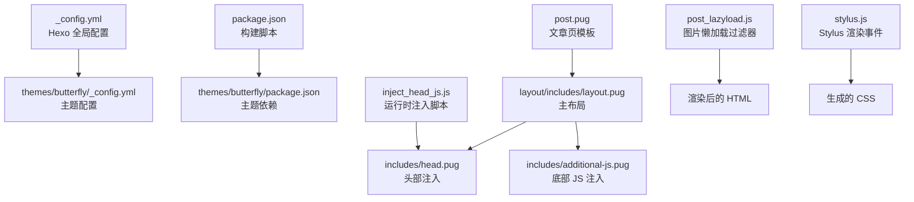
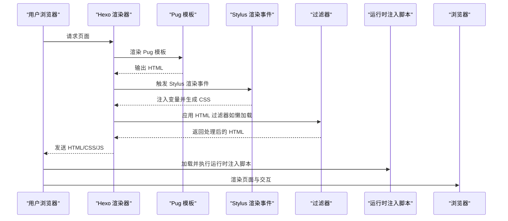
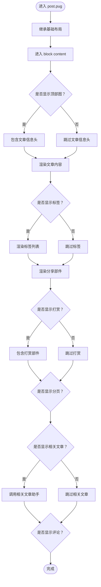
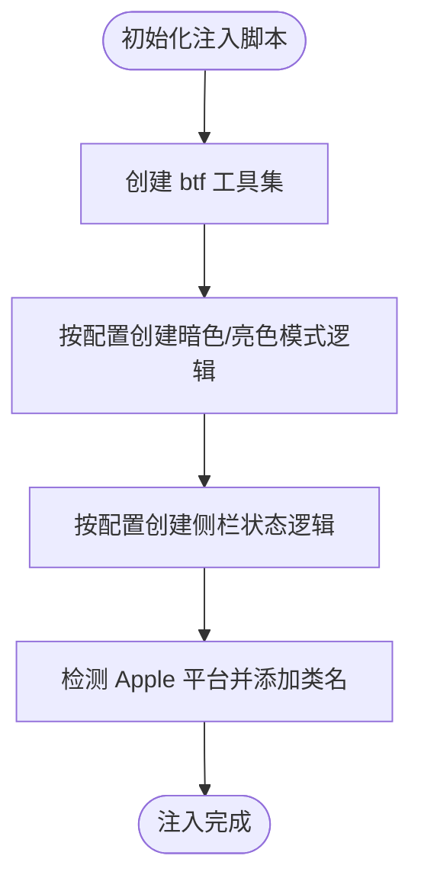
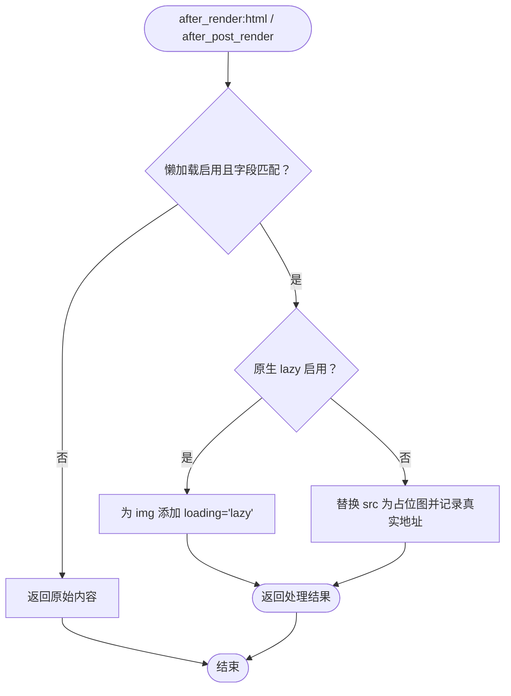
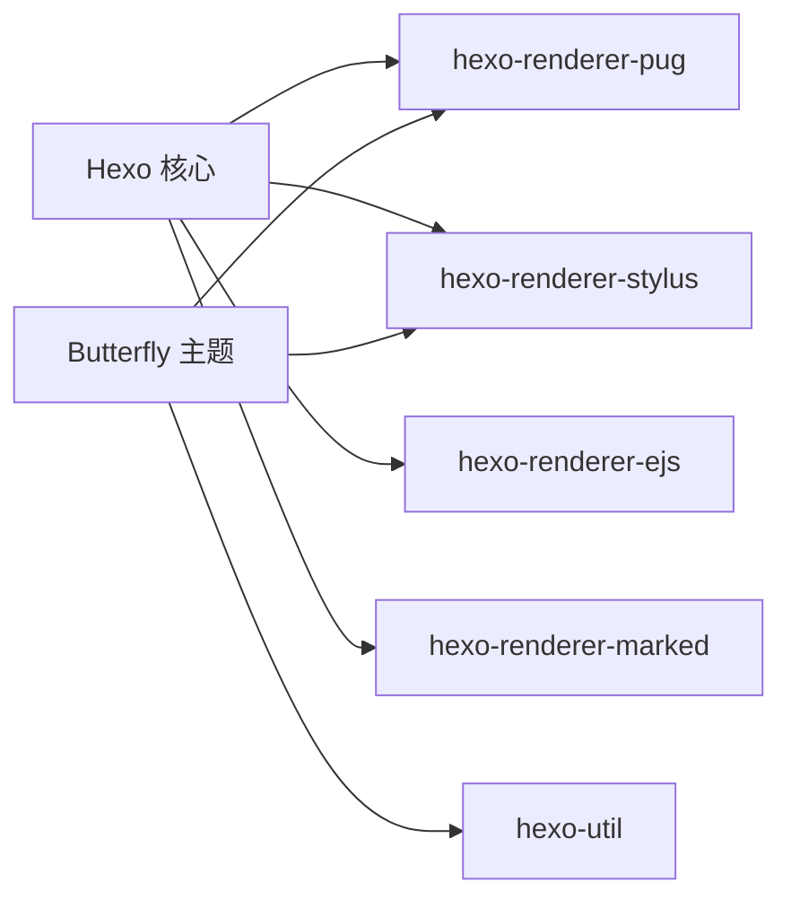

# 渲染问题

<cite>
**本文引用的文件**
- [_config.yml](file://_config.yml)
- [themes/butterfly/_config.yml](file://themes/butterfly/_config.yml)
- [package.json](file://package.json)
- [themes/butterfly/package.json](file://themes/butterfly/package.json)
- [themes/butterfly/layout/includes/layout.pug](file://themes/butterfly/layout/includes/layout.pug)
- [themes/butterfly/layout/includes/head.pug](file://themes/butterfly/layout/includes/head.pug)
- [themes/butterfly/layout/includes/additional-js.pug](file://themes/butterfly/layout/includes/additional-js.pug)
- [themes/butterfly/layout/post.pug](file://themes/butterfly/layout/post.pug)
- [themes/butterfly/scripts/helpers/inject_head_js.js](file://themes/butterfly/scripts/helpers/inject_head_js.js)
- [themes/butterfly/scripts/filters/post_lazyload.js](file://themes/butterfly/scripts/filters/post_lazyload.js)
- [themes/butterfly/scripts/events/stylus.js](file://themes/butterfly/scripts/events/stylus.js)
- [themes/butterfly/scripts/common/default_config.js](file://themes/butterfly/scripts/common/default_config.js)
</cite>

## 目录
1. [简介](#简介)
2. [项目结构](#项目结构)
3. [核心组件](#核心组件)
4. [架构总览](#架构总览)
5. [详细组件分析](#详细组件分析)
6. [依赖分析](#依赖分析)
7. [性能考虑](#性能考虑)
8. [故障排除指南](#故障排除指南)
9. [结论](#结论)
10. [附录](#附录)

## 简介
本指南聚焦于 dzz-blog 项目的渲染问题诊断与修复，覆盖 Pug 模板渲染错误、CSS 样式渲染异常、JavaScript 执行错误等常见症状。内容基于 Hexo + Butterfly 主题的实际代码实现，结合渲染链路（模板编译、静态资源注入、过滤器处理、运行时脚本）给出可操作的排查步骤与定位方法。

## 项目结构
本项目采用 Hexo 静态站点生成器，主题为 Butterfly。关键目录与文件如下：
- 全局配置：_config.yml
- 主题配置：themes/butterfly/_config.yml
- 构建脚本：package.json（包含 build/server/deploy）
- 主题依赖：themes/butterfly/package.json（含渲染器与工具依赖）
- 渲染链路关键文件：
  - 布局与头部：themes/butterfly/layout/includes/layout.pug、themes/butterfly/layout/includes/head.pug
  - 资源注入：themes/butterfly/layout/includes/additional-js.pug
  - 文章页模板：themes/butterfly/layout/post.pug
  - 运行时注入脚本：themes/butterfly/scripts/helpers/inject_head_js.js
  - 图片懒加载过滤器：themes/butterfly/scripts/filters/post_lazyload.js
  - Stylus 渲染事件：themes/butterfly/scripts/events/stylus.js
  - 主题默认配置：themes/butterfly/scripts/common/default_config.js

**图示来源**
- [_config.yml:1-107](file://_config.yml#L1-L107)
- [themes/butterfly/_config.yml:1-800](file://themes/butterfly/_config.yml#L1-L800)
- [package.json:1-29](file://package.json#L1-L29)
- [themes/butterfly/package.json:1-35](file://themes/butterfly/package.json#L1-L35)
- [themes/butterfly/layout/includes/layout.pug:1-59](file://themes/butterfly/layout/includes/layout.pug#L1-L59)
- [themes/butterfly/layout/includes/head.pug:1-78](file://themes/butterfly/layout/includes/head.pug#L1-L78)
- [themes/butterfly/layout/includes/additional-js.pug:1-61](file://themes/butterfly/layout/includes/additional-js.pug#L1-L61)
- [themes/butterfly/layout/post.pug:1-36](file://themes/butterfly/layout/post.pug#L1-L36)
- [themes/butterfly/scripts/helpers/inject_head_js.js:1-156](file://themes/butterfly/scripts/helpers/inject_head_js.js#L1-L156)
- [themes/butterfly/scripts/filters/post_lazyload.js:1-41](file://themes/butterfly/scripts/filters/post_lazyload.js#L1-L41)
- [themes/butterfly/scripts/events/stylus.js:1-24](file://themes/butterfly/scripts/events/stylus.js#L1-L24)

**章节来源**
- [_config.yml:1-107](file://_config.yml#L1-L107)
- [themes/butterfly/_config.yml:1-800](file://themes/butterfly/_config.yml#L1-L800)
- [package.json:1-29](file://package.json#L1-L29)
- [themes/butterfly/package.json:1-35](file://themes/butterfly/package.json#L1-L35)

## 核心组件
- 渲染引擎与版本
  - Hexo 版本由 package.json 指定，确保与渲染器兼容性。
  - 主题依赖 hexo-renderer-pug 与 hexo-renderer-stylus，决定 Pug 与 Stylus 的渲染能力。
- 主题配置
  - themes/butterfly/_config.yml 提供导航、样式、评论、数学公式、懒加载、PWA 等开关与参数。
  - 默认配置 scripts/common/default_config.js 提供主题默认行为，便于对比用户覆盖项。
- 模板与布局
  - includes/layout.pug 作为根布局，负责页面骨架、侧栏、背景、右下角控制等。
  - includes/head.pug 注入标题、元信息、CSS、预连接、分析脚本等。
  - includes/additional-js.pug 注入主 JS、翻译、灯箱、懒加载、数学公式、评论、PWA 等脚本。
  - post.pug 定义文章页内容区域与相关部件。
- 运行时注入与过滤器
  - inject_head_js.js 在运行时根据主题配置动态注入暗色模式、侧栏状态、平台检测等逻辑。
  - post_lazyload.js 在 HTML 渲染后替换图片 src 以启用懒加载或原生 loading=lazy。
  - stylus.js 在 Stylus 渲染阶段注入变量（如高亮开关），影响样式输出。

**章节来源**
- [themes/butterfly/layout/includes/layout.pug:1-59](file://themes/butterfly/layout/includes/layout.pug#L1-L59)
- [themes/butterfly/layout/includes/head.pug:1-78](file://themes/butterfly/layout/includes/head.pug#L1-L78)
- [themes/butterfly/layout/includes/additional-js.pug:1-61](file://themes/butterfly/layout/includes/additional-js.pug#L1-L61)
- [themes/butterfly/layout/post.pug:1-36](file://themes/butterfly/layout/post.pug#L1-L36)
- [themes/butterfly/scripts/helpers/inject_head_js.js:1-156](file://themes/butterfly/scripts/helpers/inject_head_js.js#L1-L156)
- [themes/butterfly/scripts/filters/post_lazyload.js:1-41](file://themes/butterfly/scripts/filters/post_lazyload.js#L1-L41)
- [themes/butterfly/scripts/events/stylus.js:1-24](file://themes/butterfly/scripts/events/stylus.js#L1-L24)
- [themes/butterfly/scripts/common/default_config.js:1-602](file://themes/butterfly/scripts/common/default_config.js#L1-L602)

## 架构总览
渲染链路由“数据 → 模板 → 过滤器 → 静态资源 → 浏览器执行”构成，关键节点如下：

**图示来源**
- [themes/butterfly/layout/includes/layout.pug:1-59](file://themes/butterfly/layout/includes/layout.pug#L1-L59)
- [themes/butterfly/layout/includes/head.pug:1-78](file://themes/butterfly/layout/includes/head.pug#L1-L78)
- [themes/butterfly/layout/includes/additional-js.pug:1-61](file://themes/butterfly/layout/includes/additional-js.pug#L1-L61)
- [themes/butterfly/scripts/events/stylus.js:1-24](file://themes/butterfly/scripts/events/stylus.js#L1-L24)
- [themes/butterfly/scripts/filters/post_lazyload.js:1-41](file://themes/butterfly/scripts/filters/post_lazyload.js#L1-L41)
- [themes/butterfly/scripts/helpers/inject_head_js.js:1-156](file://themes/butterfly/scripts/helpers/inject_head_js.js#L1-L156)

## 详细组件分析

### 组件一：Pug 模板渲染链路
- 布局与内容块
  - includes/layout.pug 定义全局类名、背景、侧栏、主体与页脚；通过 block content 或 body 决定内容插入点。
  - post.pug extends 基础布局，并在 block content 中渲染文章内容、标签、分享、分页、相关文章、评论等。
- 头部与资源注入
  - includes/head.pug 动态设置标题、主题色、预连接、验证、PWA、字体链接、全局配置注入等。
  - includes/additional-js.pug 条件加载翻译、灯箱、懒加载、Snackbar、数学公式、评论、PWA、聊天、搜索等脚本。
- 变量与国际化
  - 模板中使用 _p、url_for、favicon_tag 等辅助函数，需确保主题配置与数据上下文正确传递。

**图示来源**
- [themes/butterfly/layout/post.pug:1-36](file://themes/butterfly/layout/post.pug#L1-L36)
- [themes/butterfly/layout/includes/layout.pug:1-59](file://themes/butterfly/layout/includes/layout.pug#L1-L59)

**章节来源**
- [themes/butterfly/layout/post.pug:1-36](file://themes/butterfly/layout/post.pug#L1-L36)
- [themes/butterfly/layout/includes/layout.pug:1-59](file://themes/butterfly/layout/includes/layout.pug#L1-L59)

### 组件二：运行时注入脚本（inject_head_js.js）
- 功能概览
  - 注入 btf 工具函数（本地存储、动态加载脚本与样式、全局函数注册）。
  - 根据主题配置激活暗色/亮色模式、自动切换策略、侧栏隐藏状态、Apple 平台检测。
- 关键点
  - 检查主题配置 darkmode、aside、pjax 的开关与字段值，避免条件分支未生效。
  - 注意注入脚本的执行时机（DOMContentLoaded、pjax 事件），避免与后续脚本冲突。

**图示来源**
- [themes/butterfly/scripts/helpers/inject_head_js.js:1-156](file://themes/butterfly/scripts/helpers/inject_head_js.js#L1-L156)

**章节来源**
- [themes/butterfly/scripts/helpers/inject_head_js.js:1-156](file://themes/butterfly/scripts/helpers/inject_head_js.js#L1-L156)

### 组件三：图片懒加载过滤器（post_lazyload.js）
- 功能概览
  - 在 HTML 渲染完成后，对 img 标签进行替换：原生 lazy 或占位图 + data-lazy-src。
  - 支持按站点或文章页启用，匹配引号不一致的 src 属性。
- 常见问题
  - 正则匹配可能误伤 script 内内容，需确认过滤器作用域（HTML vs post）。
  - 占位图路径需与主题配置一致，否则可能出现闪烁或空白。

**图示来源**
- [themes/butterfly/scripts/filters/post_lazyload.js:1-41](file://themes/butterfly/scripts/filters/post_lazyload.js#L1-L41)

**章节来源**
- [themes/butterfly/scripts/filters/post_lazyload.js:1-41](file://themes/butterfly/scripts/filters/post_lazyload.js#L1-L41)

### 组件四：Stylus 渲染事件（stylus.js）
- 功能概览
  - 在 Stylus 渲染阶段定义变量（如 $highlight_enable、$prismjs_enable），影响样式输出。
- 常见问题
  - Hexo 版本升级后语法高亮配置变更（highlight.js/prismjs），需同步更新渲染事件。
  - 变量未定义或拼写错误会导致样式编译失败或样式缺失。

**章节来源**
- [themes/butterfly/scripts/events/stylus.js:1-24](file://themes/butterfly/scripts/events/stylus.js#L1-L24)

## 依赖分析
- 渲染器依赖
  - hexo-renderer-pug：Pug 模板渲染。
  - hexo-renderer-stylus：Stylus 样式渲染。
  - hexo-renderer-ejs、hexo-renderer-marked：其他渲染器（用于页面类型或扩展）。
- 主题依赖
  - hexo-util、moment-timezone 等工具库。
- 构建与部署
  - build/server/deploy 脚本驱动 Hexo 生成与服务启动。

**图示来源**
- [package.json:1-29](file://package.json#L1-L29)
- [themes/butterfly/package.json:1-35](file://themes/butterfly/package.json#L1-L35)

**章节来源**
- [package.json:1-29](file://package.json#L1-L29)
- [themes/butterfly/package.json:1-35](file://themes/butterfly/package.json#L1-L35)

## 性能考虑
- 懒加载
  - 启用懒加载可减少首屏资源压力；注意占位图大小与加载策略。
- 资源按需加载
  - 仅在需要时加载数学公式、评论、聊天等第三方脚本，避免阻塞主线程。
- 背景动画与特效
  - 随机背景与粒子效果在低端设备上可能造成卡顿，建议在移动端禁用或降低复杂度。
- CSS 与 JS 合理拆分
  - 将通用样式与页面特定样式分离，减少重绘与回流。

## 故障排除指南

### 症状一：页面空白（无内容）
- 可能原因
  - 模板语法错误导致渲染中断（如变量未定义、缩进不正确）。
  - 数据上下文缺失（page、site 等对象为空）。
  - 过滤器异常终止渲染流程。
- 排查步骤
  1) 检查 post.pug 与 includes/layout.pug 的变量绑定与 block content 是否正确。
  2) 在 includes/head.pug 中确认 url_for、favicon_tag 等辅助函数可用。
  3) 查看构建日志，定位 Pug 编译报错位置。
  4) 临时禁用过滤器（如懒加载）验证是否为过滤器导致的问题。
- 工具与日志
  - 使用 Hexo 构建命令查看详细错误信息。
  - 在浏览器开发者工具 Network 面板检查静态资源是否返回 404。

**章节来源**
- [themes/butterfly/layout/post.pug:1-36](file://themes/butterfly/layout/post.pug#L1-L36)
- [themes/butterfly/layout/includes/layout.pug:1-59](file://themes/butterfly/layout/includes/layout.pug#L1-L59)
- [themes/butterfly/layout/includes/head.pug:1-78](file://themes/butterfly/layout/includes/head.pug#L1-L78)
- [themes/butterfly/scripts/filters/post_lazyload.js:1-41](file://themes/butterfly/scripts/filters/post_lazyload.js#L1-L41)

### 症状二：样式错乱或缺失
- 可能原因
  - Stylus 渲染事件未正确注入变量，导致样式编译失败。
  - CSS 资源加载顺序错误或被 CSP 策略拦截。
  - 主题配置中的路径或开关未生效。
- 排查步骤
  1) 检查 stylus.js 是否定义了 $highlight_enable、$prismjs_enable 等变量。
  2) 在 includes/head.pug 中确认 link 标签的 href 是否指向正确的静态资源路径。
  3) 对比 themes/butterfly/_config.yml 与 scripts/common/default_config.js 的配置差异。
  4) 在浏览器 Network 面板检查 CSS 文件是否成功下载。
- 建议
  - 使用浏览器开发者工具 Elements 面板检查最终计算样式，定位具体规则来源。

**章节来源**
- [themes/butterfly/scripts/events/stylus.js:1-24](file://themes/butterfly/scripts/events/stylus.js#L1-L24)
- [themes/butterfly/layout/includes/head.pug:1-78](file://themes/butterfly/layout/includes/head.pug#L1-L78)
- [themes/butterfly/_config.yml:1-800](file://themes/butterfly/_config.yml#L1-L800)
- [themes/butterfly/scripts/common/default_config.js:1-602](file://themes/butterfly/scripts/common/default_config.js#L1-L602)

### 症状三：功能失效（评论、数学公式、懒加载等）
- 可能原因
  - 运行时注入脚本未正确执行（如 inject_head_js.js 的条件分支未满足）。
  - 第三方脚本加载失败（CDN 或网络问题）。
  - 主题配置开关未开启或参数错误。
- 排查步骤
  1) 在 includes/additional-js.pug 中确认对应功能的 script 标签已注入。
  2) 检查 inject_head_js.js 的条件判断（如 darkmode、aside、pjax）是否与主题配置一致。
  3) 在浏览器 Console 面板查看脚本报错与网络请求失败。
  4) 对比主题配置与默认配置，确认覆盖项是否正确。
- 建议
  - 逐步注释掉非关键功能脚本，缩小问题范围。

**章节来源**
- [themes/butterfly/layout/includes/additional-js.pug:1-61](file://themes/butterfly/layout/includes/additional-js.pug#L1-L61)
- [themes/butterfly/scripts/helpers/inject_head_js.js:1-156](file://themes/butterfly/scripts/helpers/inject_head_js.js#L1-L156)
- [themes/butterfly/_config.yml:1-800](file://themes/butterfly/_config.yml#L1-L800)
- [themes/butterfly/scripts/common/default_config.js:1-602](file://themes/butterfly/scripts/common/default_config.js#L1-L602)

### 症状四：图片不显示或闪烁
- 可能原因
  - 懒加载过滤器未正确替换 src，或占位图路径无效。
  - 原生 lazy 与第三方懒加载同时启用导致冲突。
- 排查步骤
  1) 检查 post_lazyload.js 的启用字段与作用域（site/post）。
  2) 确认占位图路径与主题配置一致。
  3) 在浏览器 Network 面板检查图片与占位图的加载状态。
- 建议
  - 优先使用原生 lazy，若需自定义占位图，确保尺寸与加载策略合理。

**章节来源**
- [themes/butterfly/scripts/filters/post_lazyload.js:1-41](file://themes/butterfly/scripts/filters/post_lazyload.js#L1-L41)
- [themes/butterfly/layout/includes/additional-js.pug:1-61](file://themes/butterfly/layout/includes/additional-js.pug#L1-L61)

### 症状五：浏览器开发者工具使用要点
- Console
  - 查看脚本执行错误、第三方 SDK 初始化失败、网络请求异常。
- Network
  - 检查 HTML/CSS/JS/图片资源的响应码与耗时，定位加载失败或超时。
- Elements
  - 检查元素是否存在、样式是否被覆盖、伪类与属性是否正确。
- Performance
  - 分析主线程占用、重排重绘、长任务，识别性能瓶颈。
- Application/Storage
  - 检查 localStorage、Cookies、缓存命中情况，定位持久化相关问题。

## 结论
渲染问题通常源于“模板语法/变量/过滤器/资源路径/运行时脚本”五个环节的任一环断裂。建议按“模板 → 过滤器 → 资源 → 运行时脚本”的顺序逐层排查，并结合浏览器开发者工具与构建日志快速定位根因。针对不同症状，优先检查对应组件的配置与注入逻辑，确保与主题默认配置保持一致。

## 附录

### 常见配置对照表（主题）
- 懒加载：lazyload.enable、lazyload.field、lazyload.placeholder
- 数学公式：math.use、math.per_page、math.mathjax/tags、math.katex/copy_tex
- 暗色模式：darkmode.enable、darkmode.autoChangeMode、darkmode.start/end
- 侧栏：aside.enable、aside.hide、aside.button
- PWA：pwa.enable、manifest/apple-touch-icon 等
- 评论系统：comments.use、各评论系统的配置项

**章节来源**
- [themes/butterfly/_config.yml:1-800](file://themes/butterfly/_config.yml#L1-L800)
- [themes/butterfly/scripts/common/default_config.js:1-602](file://themes/butterfly/scripts/common/default_config.js#L1-L602)