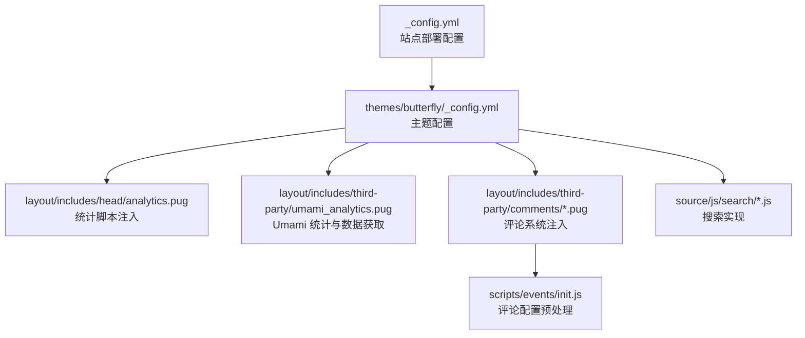
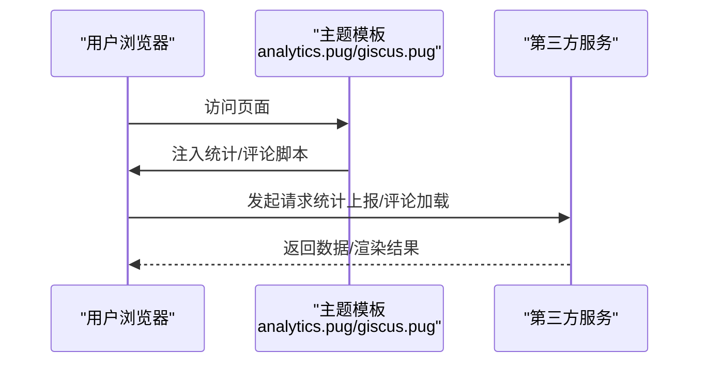
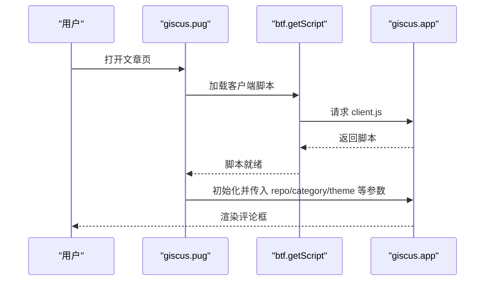
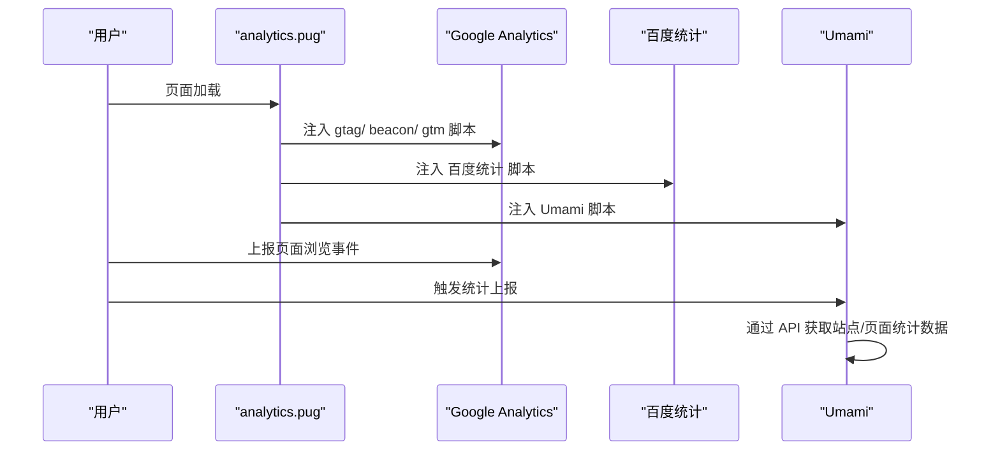
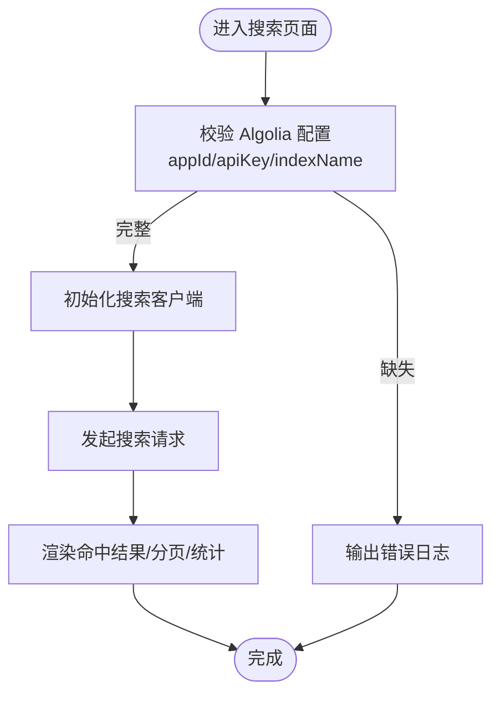
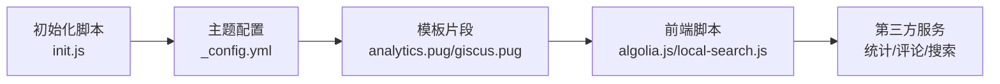

# 第三方服务集成问题

<cite>
**本文引用的文件**
- [themes/butterfly/_config.yml](file://themes/butterfly/_config.yml)
- [themes/butterfly/layout/includes/head/analytics.pug](file://themes/butterfly/layout/includes/head/analytics.pug)
- [themes/butterfly/layout/includes/third-party/umami_analytics.pug](file://themes/butterfly/layout/includes/third-party/umami_analytics.pug)
- [themes/butterfly/layout/includes/third-party/comments/giscus.pug](file://themes/butterfly/layout/includes/third-party/comments/giscus.pug)
- [themes/butterfly/layout/includes/third-party/comments/gitalk.pug](file://themes/butterfly/layout/includes/third-party/comments/gitalk.pug)
- [themes/butterfly/layout/includes/third-party/comments/disqus.pug](file://themes/butterfly/layout/includes/third-party/comments/disqus.pug)
- [themes/butterfly/layout/includes/third-party/comments/disqusjs.pug](file://themes/butterfly/layout/includes/third-party/comments/disqusjs.pug)
- [themes/butterfly/layout/includes/third-party/card-post-count/disqus.pug](file://themes/butterfly/layout/includes/third-party/card-post-count/disqus.pug)
- [themes/butterfly/scripts/events/init.js](file://themes/butterfly/scripts/events/init.js)
- [themes/butterfly/source/js/search/algolia.js](file://themes/butterfly/source/js/search/algolia.js)
- [themes/butterfly/source/js/search/local-search.js](file://themes/butterfly/source/js/search/local-search.js)
- [_config.yml](file://_config.yml)
</cite>

## 目录
1. [简介](#简介)
2. [项目结构](#项目结构)
3. [核心组件](#核心组件)
4. [架构总览](#架构总览)
5. [详细组件分析](#详细组件分析)
6. [依赖关系分析](#依赖关系分析)
7. [性能考量](#性能考量)
8. [故障排除指南](#故障排除指南)
9. [结论](#结论)
10. [附录](#附录)

## 简介
本指南聚焦于 dzz-blog 项目中第三方服务集成的常见问题与排障方法，覆盖评论系统（Giscus、Disqus、DisqusJS、Gitalk 等）、统计分析服务（百度统计、Google Analytics、Cloudflare Analytics、Microsoft Clarity、Umami、Google Tag Manager）、搜索功能（Algolia、本地搜索）。内容包括：API 密钥配置错误、服务不可用、跨域访问限制、数据同步失败等问题定位与解决路径，并提供服务可用性检查方法、配置参数验证步骤以及替代方案使用指南。

## 项目结构
围绕第三方服务集成的关键位置如下：
- 主题配置：用于声明启用的服务与密钥
- 模板片段：在页面头部或评论区注入脚本与初始化逻辑
- 前端脚本：负责搜索、统计上报与交互
- 初始化脚本：对配置进行预处理与冲突消解

**图表来源**
- [_config.yml:101-107](file://_config.yml#L101-L107)
- [themes/butterfly/_config.yml:475-508](file://themes/butterfly/_config.yml#L475-L508)
- [themes/butterfly/layout/includes/head/analytics.pug:1-45](file://themes/butterfly/layout/includes/head/analytics.pug#L1-L45)
- [themes/butterfly/layout/includes/third-party/umami_analytics.pug:1-110](file://themes/butterfly/layout/includes/third-party/umami_analytics.pug#L1-L110)
- [themes/butterfly/layout/includes/third-party/comments/giscus.pug:1-82](file://themes/butterfly/layout/includes/third-party/comments/giscus.pug#L1-L82)
- [themes/butterfly/source/js/search/algolia.js:1-563](file://themes/butterfly/source/js/search/algolia.js#L1-L563)
- [themes/butterfly/source/js/search/local-search.js:1-568](file://themes/butterfly/source/js/search/local-search.js#L1-L568)
- [themes/butterfly/scripts/events/init.js:47-86](file://themes/butterfly/scripts/events/init.js#L47-L86)

**章节来源**
- [_config.yml:101-107](file://_config.yml#L101-L107)
- [themes/butterfly/_config.yml:475-508](file://themes/butterfly/_config.yml#L475-L508)

## 核心组件
- 评论系统
  - 支持 Giscus、Disqus、DisqusJS、Gitalk 等；通过主题配置启用并注入脚本
- 统计分析
  - 百度统计、Google Analytics、Cloudflare Analytics、Microsoft Clarity、Umami、Google Tag Manager
- 搜索功能
  - Algolia 与本地搜索，分别对应前端脚本与数据生成器

**章节来源**
- [themes/butterfly/_config.yml:529-660](file://themes/butterfly/_config.yml#L529-L660)
- [themes/butterfly/_config.yml:475-508](file://themes/butterfly/_config.yml#L475-L508)

## 架构总览
第三方服务在构建阶段由主题配置驱动，在运行时由模板片段注入脚本并在前端执行初始化与上报逻辑。

**图表来源**
- [themes/butterfly/layout/includes/head/analytics.pug:1-45](file://themes/butterfly/layout/includes/head/analytics.pug#L1-L45)
- [themes/butterfly/layout/includes/third-party/comments/giscus.pug:1-82](file://themes/butterfly/layout/includes/third-party/comments/giscus.pug#L1-L82)

## 详细组件分析

### 评论系统（Giscus、Disqus、DisqusJS、Gitalk）
- 配置入口与启用方式
  - 在主题配置中设置 comments.use 指定启用的评论系统；支持多个但默认仅显示第一个
- Giscus
  - 通过注入客户端脚本并传入仓库、分类、主题等参数完成初始化
  - 支持按需加载与主题切换时动态更新主题
- Disqus / DisqusJS
  - 通过短名称与可选 API Key 进行嵌入或基于 API 的渲染
  - 提供独立的评论计数获取流程
- Gitalk
  - 通过 OAuth 客户端 ID/Secret 与仓库信息初始化，支持自定义标识符与管理员列表

**图表来源**
- [themes/butterfly/layout/includes/third-party/comments/giscus.pug:1-82](file://themes/butterfly/layout/includes/third-party/comments/giscus.pug#L1-L82)

**章节来源**
- [themes/butterfly/_config.yml:529-660](file://themes/butterfly/_config.yml#L529-L660)
- [themes/butterfly/layout/includes/third-party/comments/giscus.pug:1-82](file://themes/butterfly/layout/includes/third-party/comments/giscus.pug#L1-L82)
- [themes/butterfly/layout/includes/third-party/comments/disqus.pug:1-80](file://themes/butterfly/layout/includes/third-party/comments/disqus.pug#L1-L80)
- [themes/butterfly/layout/includes/third-party/comments/disqusjs.pug:1-87](file://themes/butterfly/layout/includes/third-party/comments/disqusjs.pug#L1-L87)
- [themes/butterfly/layout/includes/third-party/comments/gitalk.pug:1-47](file://themes/butterfly/layout/includes/third-party/comments/gitalk.pug#L1-L47)
- [themes/butterfly/layout/includes/third-party/card-post-count/disqus.pug:1-25](file://themes/butterfly/layout/includes/third-party/card-post-count/disqus.pug#L1-L25)
- [themes/butterfly/scripts/events/init.js:47-86](file://themes/butterfly/scripts/events/init.js#L47-L86)

### 统计分析服务（百度统计、Google Analytics、Cloudflare、Clarity、Umami、Google Tag Manager）
- 头部注入脚本
  - 百度统计、Google Analytics、Cloudflare、Clarity、Google Tag Manager 的脚本均在页面头部按条件注入
- Umami
  - 动态加载脚本并上报页面事件；同时提供独立 API 获取站点/页面访问量与访客数
  - 支持云版与自托管两种模式，自动选择鉴权头

**图表来源**
- [themes/butterfly/layout/includes/head/analytics.pug:1-45](file://themes/butterfly/layout/includes/head/analytics.pug#L1-L45)
- [themes/butterfly/layout/includes/third-party/umami_analytics.pug:1-110](file://themes/butterfly/layout/includes/third-party/umami_analytics.pug#L1-L110)

**章节来源**
- [themes/butterfly/layout/includes/head/analytics.pug:1-45](file://themes/butterfly/layout/includes/head/analytics.pug#L1-L45)
- [themes/butterfly/layout/includes/third-party/umami_analytics.pug:1-110](file://themes/butterfly/layout/includes/third-party/umami_analytics.pug#L1-L110)

### 搜索功能（Algolia、本地搜索）
- Algolia
  - 前端校验应用 ID、API Key、索引名；初始化搜索客户端；支持 v4/v5 不同接口；提供高亮与分页
- 本地搜索
  - 从指定路径拉取 XML/JSON 数据，解析标题/内容/链接；支持高亮关键词与分页

**图表来源**
- [themes/butterfly/source/js/search/algolia.js:1-563](file://themes/butterfly/source/js/search/algolia.js#L1-L563)

**章节来源**
- [themes/butterfly/source/js/search/algolia.js:1-563](file://themes/butterfly/source/js/search/algolia.js#L1-L563)
- [themes/butterfly/source/js/search/local-search.js:1-568](file://themes/butterfly/source/js/search/local-search.js#L1-L568)

## 依赖关系分析
- 配置到模板
  - 主题配置决定是否注入统计与评论脚本
- 模板到脚本
  - 模板片段负责注入第三方脚本与初始化参数
- 前端脚本到服务
  - 前端脚本直接调用第三方 API 或加载其 SDK
- 初始化脚本
  - 对评论系统配置进行归一化与冲突消解（如 Disqus 与 DisqusJS 冲突仅保留一个）

**图表来源**
- [themes/butterfly/_config.yml:475-508](file://themes/butterfly/_config.yml#L475-L508)
- [themes/butterfly/layout/includes/head/analytics.pug:1-45](file://themes/butterfly/layout/includes/head/analytics.pug#L1-L45)
- [themes/butterfly/layout/includes/third-party/comments/giscus.pug:1-82](file://themes/butterfly/layout/includes/third-party/comments/giscus.pug#L1-L82)
- [themes/butterfly/source/js/search/algolia.js:1-563](file://themes/butterfly/source/js/search/algolia.js#L1-L563)
- [themes/butterfly/scripts/events/init.js:47-86](file://themes/butterfly/scripts/events/init.js#L47-L86)

**章节来源**
- [themes/butterfly/_config.yml:475-508](file://themes/butterfly/_config.yml#L475-L508)
- [themes/butterfly/scripts/events/init.js:47-86](file://themes/butterfly/scripts/events/init.js#L47-L86)

## 性能考量
- 评论懒加载
  - 可开启懒加载以减少首屏资源压力；注意懒加载会禁用评论计数展示
- 搜索预加载
  - 本地搜索可在页面加载时预取数据，提升首次搜索体验
- 分页与高亮
  - Algolia 与本地搜索均支持分页与高亮，合理设置每页条数与高亮策略

[本节为通用建议，不直接分析具体文件]

## 故障排除指南

### 评论系统

- Giscus
  - 常见问题
    - 仓库/分类 ID 错误：确认 repo、repo_id、category_id 是否正确
    - 主题切换无响应：检查主题变更回调是否生效
    - 跨域/隐私模式：确保第三方域名可访问且未被拦截
  - 排障步骤
    - 在控制台查看 giscus 客户端脚本是否成功加载
    - 确认注入的参数（repo、repo_id、category_id、theme）与实际一致
    - 切换深色/浅色主题观察评论主题是否同步变化
  - 替代方案
    - 若 Giscus 不可用，可在主题配置中启用其他评论系统（如 Disqus、Gitalk），或调整 comments.use 顺序

- Disqus / DisqusJS
  - 常见问题
    - API Key 缺失导致计数异常
    - 同时启用 Disqus 与 DisqusJS 冲突
  - 排障步骤
    - 检查短名称与 API Key 是否填写
    - 查看初始化脚本是否成功渲染
    - 确认初始化脚本仅保留一种评论系统
  - 替代方案
    - 使用 DisqusJS 通过 API 渲染评论
    - 切换至 Giscus 或 Gitalk

- Gitalk
  - 常见问题
    - 客户端 ID/Secret 错误导致无法初始化
    - 仓库权限不足或仓库不存在
  - 排障步骤
    - 校验 client_id、client_secret、repo、owner、admin
    - 确认仓库存在且具备写权限
    - 查看控制台是否有脚本报错

**章节来源**
- [themes/butterfly/layout/includes/third-party/comments/giscus.pug:1-82](file://themes/butterfly/layout/includes/third-party/comments/giscus.pug#L1-L82)
- [themes/butterfly/layout/includes/third-party/comments/disqus.pug:1-80](file://themes/butterfly/layout/includes/third-party/comments/disqus.pug#L1-L80)
- [themes/butterfly/layout/includes/third-party/comments/disqusjs.pug:1-87](file://themes/butterfly/layout/includes/third-party/comments/disqusjs.pug#L1-L87)
- [themes/butterfly/layout/includes/third-party/comments/gitalk.pug:1-47](file://themes/butterfly/layout/includes/third-party/comments/gitalk.pug#L1-L47)
- [themes/butterfly/layout/includes/third-party/card-post-count/disqus.pug:1-25](file://themes/butterfly/layout/includes/third-party/card-post-count/disqus.pug#L1-L25)
- [themes/butterfly/scripts/events/init.js:47-86](file://themes/butterfly/scripts/events/init.js#L47-L86)

### 统计分析服务

- 百度统计 / Google Analytics / Cloudflare / Microsoft Clarity / Google Tag Manager
  - 常见问题
    - ID/Key 错误导致脚本注入失败或无法上报
    - 跨域/隐私模式阻止脚本加载
  - 排障步骤
    - 确认主题配置中的 ID/Key 正确无误
    - 检查页面头部是否注入了对应脚本
    - 使用开发者工具 Network 面板确认脚本加载状态
  - 替代方案
    - 如某服务不可用，可暂时关闭该配置项，启用其他服务

- Umami
  - 常见问题
    - 自托管与云版鉴权头不同，导致 API 请求失败
    - 页面未触发统计上报或数据插入失败
  - 排障步骤
    - 确认网站 ID 与脚本名配置正确
    - 检查网络面板中 API 请求头是否包含正确的鉴权字段
    - 查看控制台是否有“脚本加载失败”或“数据获取失败”的错误提示
  - 替代方案
    - 切换至其他统计服务或临时关闭统计功能

**章节来源**
- [themes/butterfly/layout/includes/head/analytics.pug:1-45](file://themes/butterfly/layout/includes/head/analytics.pug#L1-L45)
- [themes/butterfly/layout/includes/third-party/umami_analytics.pug:1-110](file://themes/butterfly/layout/includes/third-party/umami_analytics.pug#L1-L110)

### 搜索功能

- Algolia
  - 常见问题
    - appId/apiKey/indexName 任一缺失导致初始化失败
    - 搜索客户端版本不兼容（v4/v5）
  - 排障步骤
    - 控制台查看是否输出“Algolia 设置无效”或“未找到搜索客户端”
    - 确认已正确安装并引入 Algolia 客户端库
    - 检查索引是否存在且可访问
  - 替代方案
    - 切换至本地搜索，或修复 Algolia 配置

- 本地搜索
  - 常见问题
    - 数据源路径错误或格式不匹配（XML/JSON）
    - 高亮与分页参数不当导致结果异常
  - 排障步骤
    - 确认数据源路径可达且返回格式正确
    - 检查解析逻辑是否能正确提取标题/内容/链接
    - 调整每页显示数量与高亮策略

**章节来源**
- [themes/butterfly/source/js/search/algolia.js:1-563](file://themes/butterfly/source/js/search/algolia.js#L1-L563)
- [themes/butterfly/source/js/search/local-search.js:1-568](file://themes/butterfly/source/js/search/local-search.js#L1-L568)

### 通用检查清单
- 配置参数验证
  - 在主题配置中核对所有第三方服务的 ID/Key/仓库/分类等参数
- 资源加载检查
  - 使用浏览器开发者工具 Network 面板确认脚本是否成功加载
- 跨域与隐私
  - 检查第三方域名可访问性，避免隐私模式或广告拦截导致脚本被阻断
- 日志与错误
  - 查看 Console 输出的错误信息，定位初始化失败或请求失败的具体环节

[本节为通用建议，不直接分析具体文件]

## 结论
通过明确第三方服务的配置入口、模板注入与前端脚本实现，结合本文提供的排障步骤与替代方案，可快速定位并解决评论、统计与搜索集成过程中的常见问题。建议优先核对配置参数与资源加载状态，再根据具体服务特性逐项排查。

[本节为总结，不直接分析具体文件]

## 附录

### 配置参数速查（示例）
- 评论系统
  - Giscus：仓库、仓库 ID、分类 ID、主题（明/暗）
  - Disqus：短名称、API Key
  - DisqusJS：短名称、API Key
  - Gitalk：客户端 ID、客户端密钥、仓库、所有者、管理员
- 统计分析
  - 百度统计：站点 ID
  - Google Analytics：跟踪 ID
  - Cloudflare：Token
  - Microsoft Clarity：项目 ID
  - Umami：服务器地址、脚本名、网站 ID、令牌
  - Google Tag Manager：容器 ID、可选域名
- 搜索
  - Algolia：应用 ID、API Key、索引名、每页条数
  - 本地搜索：数据源路径、每页条数、是否转义 HTML

**章节来源**
- [themes/butterfly/_config.yml:475-508](file://themes/butterfly/_config.yml#L475-L508)
- [themes/butterfly/_config.yml:529-660](file://themes/butterfly/_config.yml#L529-L660)