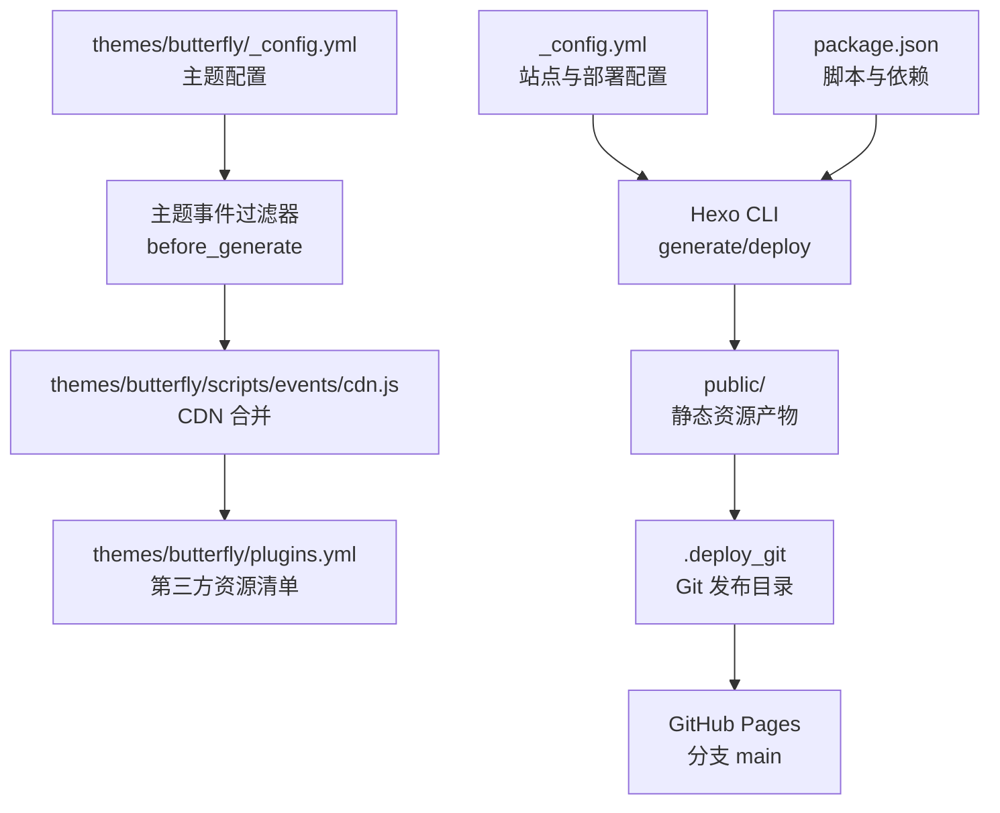
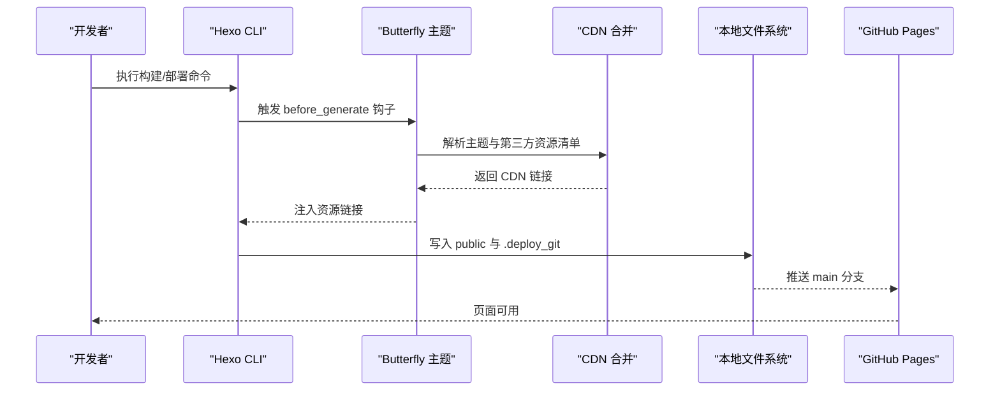
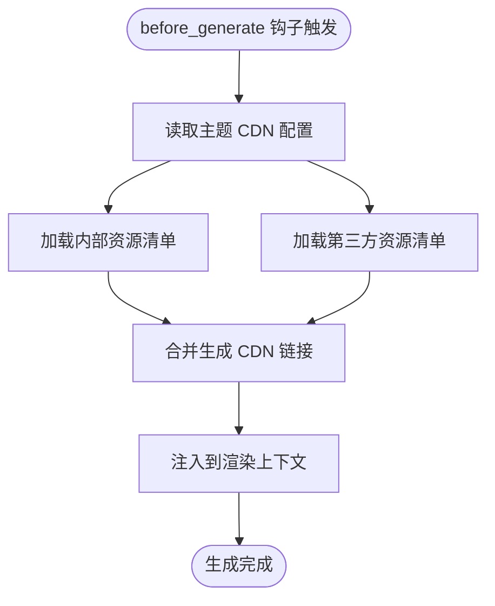
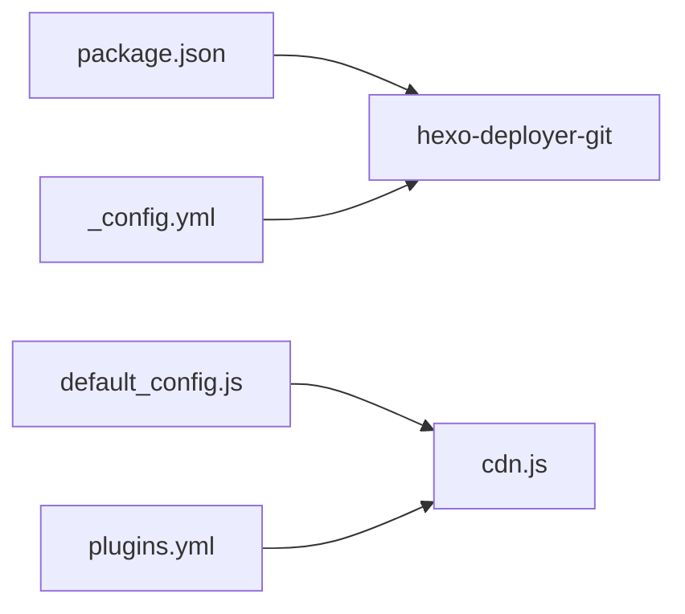

# 部署问题

<cite>
**本文引用的文件**
- [_config.yml](file://_config.yml)
- [package.json](file://package.json)
- [.github/dependabot.yml](file://.github/dependabot.yml)
- [themes/butterfly/_config.yml](file://themes/butterfly/_config.yml)
- [themes/butterfly/scripts/events/cdn.js](file://themes/butterfly/scripts/events/cdn.js)
- [themes/butterfly/scripts/common/default_config.js](file://themes/butterfly/scripts/common/default_config.js)
- [themes/butterfly/plugins.yml](file://themes/butterfly/plugins.yml)
- [.gitignore](file://.gitignore)
</cite>

## 目录
1. [简介](#简介)
2. [项目结构](#项目结构)
3. [核心组件](#核心组件)
4. [架构总览](#架构总览)
5. [详细组件分析](#详细组件分析)
6. [依赖分析](#依赖分析)
7. [性能考虑](#性能考虑)
8. [故障排除指南](#故障排除指南)
9. [结论](#结论)
10. [附录](#附录)

## 简介
本指南面向 dzz-blog 项目在使用 Hexo + GitHub Pages 的部署场景，聚焦以下问题与实践：
- 自动部署（无 GitHub Actions 工作流）与手动部署的差异与注意事项
- 常见部署失败原因：构建超时、权限不足、网络连接问题、CDN 资源加载失败
- CI/CD 流程中可复现的错误定位与修复路径
- 部署前环境检查清单、部署后功能验证方法
- 回滚与重试策略，覆盖自动部署与手动部署两种模式

本指南严格基于仓库内现有配置与脚本进行分析，避免臆测。

## 项目结构
本项目采用 Hexo 博客框架，主题为 Butterfly。部署目标为 GitHub Pages（仓库名与 URL 在站点配置中明确）。Hexo 提供一键部署能力，结合主题的 CDN 合并机制，形成“本地生成 + 远程推送”的发布流程。

图表来源
- [_config.yml:101-107](file://_config.yml#L101-L107)
- [package.json:5-10](file://package.json#L5-L10)
- [themes/butterfly/_config.yml:594-600](file://themes/butterfly/_config.yml#L594-L600)
- [themes/butterfly/scripts/events/cdn.js:11-95](file://themes/butterfly/scripts/events/cdn.js#L11-L95)
- [themes/butterfly/plugins.yml:1-208](file://themes/butterfly/plugins.yml#L1-L208)

章节来源
- [_config.yml:101-107](file://_config.yml#L101-L107)
- [package.json:5-10](file://package.json#L5-L10)
- [themes/butterfly/_config.yml:594-600](file://themes/butterfly/_config.yml#L594-L600)
- [themes/butterfly/scripts/events/cdn.js:11-95](file://themes/butterfly/scripts/events/cdn.js#L11-L95)
- [themes/butterfly/plugins.yml:1-208](file://themes/butterfly/plugins.yml#L1-L208)

## 核心组件
- 站点配置与部署目标
  - 站点 URL、永久链接、分页等基础配置位于根级配置文件
  - 部署类型、仓库地址与分支在部署段落中定义，用于 Hexo 一键部署
- 主题配置与 CDN
  - 主题默认配置包含 CDN 提供商选择、版本参数、自定义格式等
  - 主题事件过滤器在生成前合并内部与第三方资源的 CDN 链接
  - 第三方资源清单由主题插件清单文件维护
- 构建与部署脚本
  - package.json 中提供 build、deploy、server 等常用脚本
- 忽略规则
  - .gitignore 明确忽略 public、.deploy_git 等目录，避免将构建产物提交到源码分支

章节来源
- [_config.yml:15-21](file://_config.yml#L15-L21)
- [_config.yml:101-107](file://_config.yml#L101-L107)
- [themes/butterfly/_config.yml:594-600](file://themes/butterfly/_config.yml#L594-L600)
- [themes/butterfly/scripts/events/cdn.js:11-95](file://themes/butterfly/scripts/events/cdn.js#L11-L95)
- [themes/butterfly/plugins.yml:1-208](file://themes/butterfly/plugins.yml#L1-L208)
- [package.json:5-10](file://package.json#L5-L10)
- [.gitignore:6-7](file://.gitignore#L6-L7)

## 架构总览
下图展示从本地构建到 GitHub Pages 生效的关键步骤与潜在断点：

图表来源
- [themes/butterfly/scripts/events/cdn.js:11-95](file://themes/butterfly/scripts/events/cdn.js#L11-L95)
- [_config.yml:101-107](file://_config.yml#L101-L107)
- [package.json:5-10](file://package.json#L5-L10)

## 详细组件分析

### 组件A：部署配置与目标
- 关键点
  - 部署类型为 git，仓库地址与分支在站点配置中指定
  - URL 与永久链接影响页面内外链与资源相对路径
- 影响范围
  - 若 URL 与实际 Pages 域名不一致，可能导致资源 404 或重定向异常
  - 分支名需与 Pages 源分支一致

章节来源
- [_config.yml:15-21](file://_config.yml#L15-L21)
- [_config.yml:101-107](file://_config.yml#L101-L107)

### 组件B：主题 CDN 合并与资源解析
- 关键点
  - 主题在生成前通过过滤器读取主题配置中的 CDN 设置
  - 合并内部资源与第三方资源清单，生成最终资源链接
  - 支持多种提供商（如 jsDelivr、unpkg、cdnjs），并可启用版本查询参数或最小化文件名
- 影响范围
  - CDN 不可用或跨域限制会导致资源加载失败
  - 自定义格式模板变量需与内部值匹配，否则生成空链接

图表来源
- [themes/butterfly/scripts/events/cdn.js:11-95](file://themes/butterfly/scripts/events/cdn.js#L11-L95)
- [themes/butterfly/_config.yml:594-600](file://themes/butterfly/_config.yml#L594-L600)
- [themes/butterfly/plugins.yml:1-208](file://themes/butterfly/plugins.yml#L1-L208)

章节来源
- [themes/butterfly/scripts/events/cdn.js:11-95](file://themes/butterfly/scripts/events/cdn.js#L11-L95)
- [themes/butterfly/_config.yml:594-600](file://themes/butterfly/_config.yml#L594-L600)
- [themes/butterfly/plugins.yml:1-208](file://themes/butterfly/plugins.yml#L1-L208)

### 组件C：构建与部署脚本
- 关键点
  - 提供 build、deploy、server 等脚本，便于本地验证与一键部署
- 影响范围
  - 本地环境差异（Node 版本、包管理器）可能造成构建不一致

章节来源
- [package.json:5-10](file://package.json#L5-L10)

### 组件D：忽略规则与产物目录
- 关键点
  - public 与 .deploy_git 被忽略，避免将构建产物提交到源码分支
- 影响范围
  - 若误提交构建产物，可能干扰 Pages 渲染或导致意外内容出现在源分支

章节来源
- [.gitignore:6-7](file://.gitignore#L6-L7)

## 依赖分析
- 外部依赖
  - hexo-deployer-git：负责将生成的静态文件推送到指定 Git 仓库与分支
- 主题依赖
  - 主题通过插件清单维护第三方库版本与文件路径
- 主题默认配置
  - CDN 默认提供商与版本控制策略由主题默认配置决定

图表来源
- [package.json:14-26](file://package.json#L14-L26)
- [_config.yml:101-107](file://_config.yml#L101-L107)
- [themes/butterfly/scripts/common/default_config.js:594-600](file://themes/butterfly/scripts/common/default_config.js#L594-L600)
- [themes/butterfly/scripts/events/cdn.js:15-94](file://themes/butterfly/scripts/events/cdn.js#L15-L94)
- [themes/butterfly/plugins.yml:1-208](file://themes/butterfly/plugins.yml#L1-L208)

章节来源
- [package.json:14-26](file://package.json#L14-L26)
- [_config.yml:101-107](file://_config.yml#L101-L107)
- [themes/butterfly/scripts/common/default_config.js:594-600](file://themes/butterfly/scripts/common/default_config.js#L594-L600)
- [themes/butterfly/scripts/events/cdn.js:15-94](file://themes/butterfly/scripts/events/cdn.js#L15-L94)
- [themes/butterfly/plugins.yml:1-208](file://themes/butterfly/plugins.yml#L1-L208)

## 性能考虑
- CDN 加载
  - 使用 CDN 可降低国内访问延迟；但需关注跨域与缓存策略
- 资源最小化
  - 主题会根据文件名生成最小化链接，减少体积
- 生成时间
  - 复杂页面与大量图片会增加生成时间，建议在本地预热缓存与优化资源

## 故障排除指南

### 一、自动部署 vs 手动部署
- 当前仓库未包含 GitHub Actions 工作流文件，因此不存在“自动部署”工作流
- 手动部署流程
  - 本地执行构建与部署脚本，Hexo 将生成静态文件并推送至指定仓库与分支
- 差异与注意
  - 自动部署通常由 CI 平台统一管理环境与依赖；手动部署受本地环境影响更大
  - 本仓库未提供自动部署工作流，故后续如需自动部署，应新增工作流文件以确保环境一致性

章节来源
- [.github/dependabot.yml:1-8](file://.github/dependabot.yml#L1-L8)
- [package.json:5-10](file://package.json#L5-L10)
- [_config.yml:101-107](file://_config.yml#L101-L107)

### 二、部署前环境检查清单
- Node 与包管理器
  - 确认 Node 版本满足 Hexo 与主题要求
  - 确认包管理器版本与锁定文件一致
- 依赖安装
  - 完整安装依赖后再执行构建
- 本地预览
  - 使用 server 脚本在本地验证页面与资源加载
- 配置核对
  - 站点 URL 与 Pages 实际域名一致
  - 部署仓库地址与分支正确
  - 主题 CDN 配置合法（提供商、自定义格式模板变量）

章节来源
- [package.json:11-13](file://package.json#L11-L13)
- [package.json:14-26](file://package.json#L14-L26)
- [package.json:5-10](file://package.json#L5-L10)
- [_config.yml:15-21](file://_config.yml#L15-L21)
- [_config.yml:101-107](file://_config.yml#L101-L107)
- [themes/butterfly/_config.yml:594-600](file://themes/butterfly/_config.yml#L594-L600)

### 三、常见部署问题与诊断

#### 1) 构建超时
- 症状
  - 本地或 CI 环境构建时间过长或中断
- 诊断要点
  - 检查资源数量与体积（图片、视频等）
  - 检查主题渲染器与插件是否引入额外处理开销
  - 本地先用 server 验证页面渲染是否异常
- 修复建议
  - 优化资源体积与数量
  - 减少不必要的渲染器或插件
  - 使用本地缓存与增量构建策略（若可行）

章节来源
- [package.json:5-10](file://package.json#L5-L10)

#### 2) 权限不足
- 症状
  - 推送阶段报错，提示无权访问或认证失败
- 诊断要点
  - 确认部署仓库地址与分支正确
  - 确认本地已配置正确的凭据（如 SSH 密钥或 Token）
- 修复建议
  - 使用 HTTPS + Token 或 SSH 方式推送
  - 在 CI 环境中妥善配置密钥或令牌

章节来源
- [_config.yml:101-107](file://_config.yml#L101-L107)

#### 3) 网络连接问题
- 症状
  - 构建过程中下载依赖失败、CDN 资源加载超时
- 诊断要点
  - 检查 CDN 提供商可用性与跨域策略
  - 检查自定义格式模板变量是否与内部值匹配
- 修复建议
  - 切换到更稳定的 CDN 提供商
  - 临时回退到本地资源或禁用版本参数以排除缓存问题

章节来源
- [themes/butterfly/scripts/events/cdn.js:48-78](file://themes/butterfly/scripts/events/cdn.js#L48-L78)
- [themes/butterfly/_config.yml:594-600](file://themes/butterfly/_config.yml#L594-L600)

#### 4) CDN 配置问题
- 症状
  - 页面资源 404、样式错乱、交互功能异常
- 诊断要点
  - 核对主题 CDN 配置项（提供商、版本、自定义格式）
  - 核对插件清单中的包名与版本是否与主题期望一致
- 修复建议
  - 将主题 CDN 配置调整为稳定提供商
  - 如使用自定义格式，确保模板变量与内部值一致

章节来源
- [themes/butterfly/_config.yml:594-600](file://themes/butterfly/_config.yml#L594-L600)
- [themes/butterfly/scripts/events/cdn.js:48-78](file://themes/butterfly/scripts/events/cdn.js#L48-L78)
- [themes/butterfly/plugins.yml:1-208](file://themes/butterfly/plugins.yml#L1-L208)

#### 5) 资源路径与相对路径问题
- 症状
  - 页面内链或资源路径错误，导致 404
- 诊断要点
  - 核对站点 URL 与永久链接配置
  - 确认 Pages 源分支与实际分支一致
- 修复建议
  - 保持 URL 与 Pages 域名一致
  - 确保分支名与 Pages 源分支一致

章节来源
- [_config.yml:15-21](file://_config.yml#L15-L21)
- [_config.yml:101-107](file://_config.yml#L101-L107)

### 四、部署后功能验证方法
- 页面可用性
  - 访问站点首页，确认导航、文章列表、分页等功能正常
- 资源加载
  - 打开浏览器开发者工具，检查网络面板中关键资源是否加载成功
- 评论与统计
  - 如启用评论或统计，验证其在页面上的显示与交互
- 主题特效
  - 验证主题动画、暗色模式、搜索等特性

### 五、回滚与重试策略
- 回滚
  - 若 Pages 已上线，可在 GitHub 上回退到上一个有效提交
  - 本地回滚到上一次成功的构建产物，重新执行部署
- 重试
  - 对于偶发网络问题，建议清理缓存后重试
  - 对于 CDN 问题，临时切换提供商或禁用版本参数进行验证

## 结论
- 本仓库当前未包含 GitHub Actions 工作流，因此不存在自动部署工作流
- 手动部署依赖本地环境与站点配置，建议在本地充分验证后再执行部署
- 部署问题多集中在 URL/分支配置、CDN 可用性与网络稳定性
- 建议完善 CI 工作流以提升部署一致性，并在主题层面对 CDN 配置进行更严格的校验

## 附录

### A. 部署前检查清单（对照表）
- 环境
  - Node 版本满足要求
  - 依赖完整安装
- 配置
  - 站点 URL 与 Pages 域名一致
  - 部署仓库地址与分支正确
  - 主题 CDN 配置合法
- 产物
  - public 与 .deploy_git 未被提交
  - 本地 server 验证通过

章节来源
- [package.json:11-13](file://package.json#L11-L13)
- [package.json:14-26](file://package.json#L14-L26)
- [_config.yml:15-21](file://_config.yml#L15-L21)
- [_config.yml:101-107](file://_config.yml#L101-L107)
- [themes/butterfly/_config.yml:594-600](file://themes/butterfly/_config.yml#L594-L600)
- [.gitignore:6-7](file://.gitignore#L6-L7)