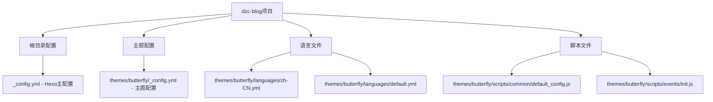
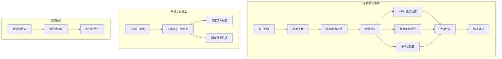
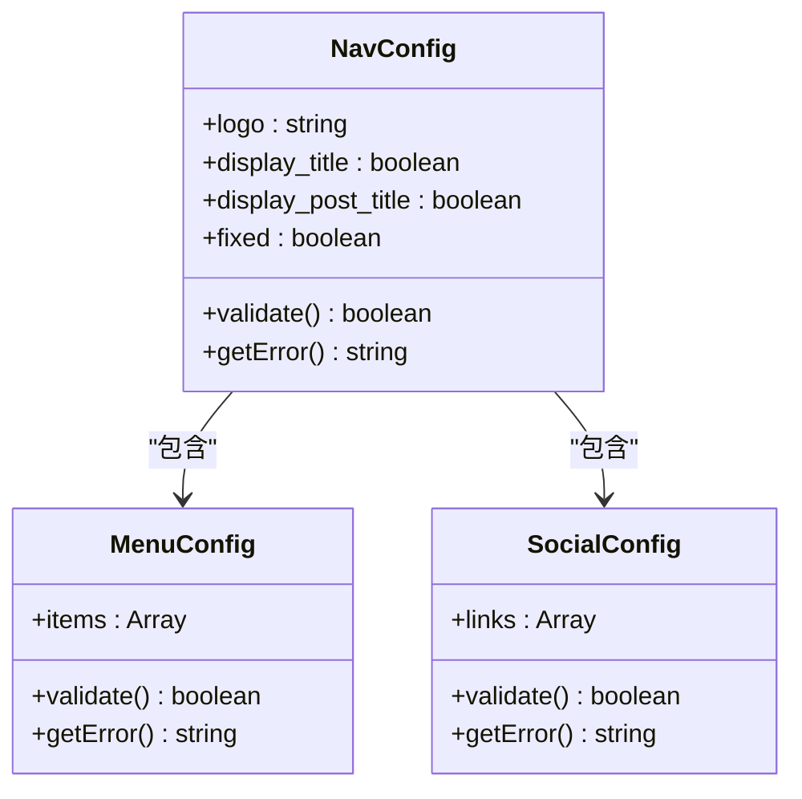
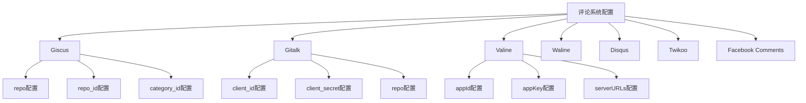
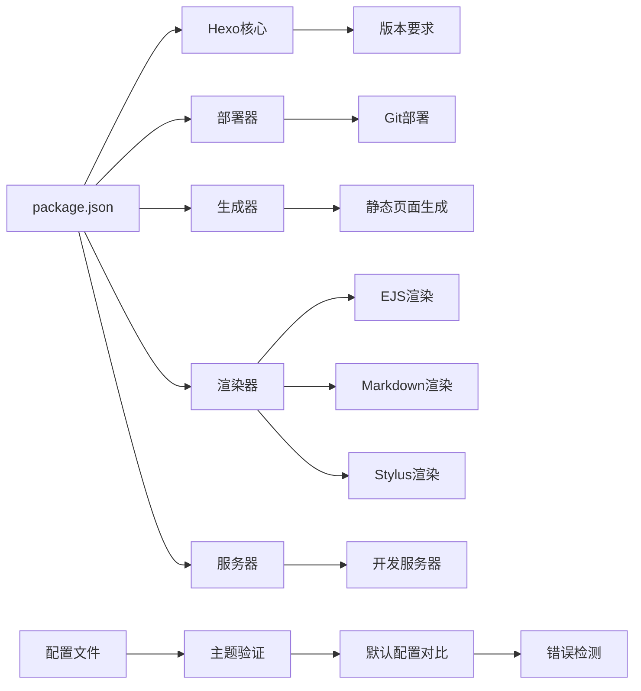
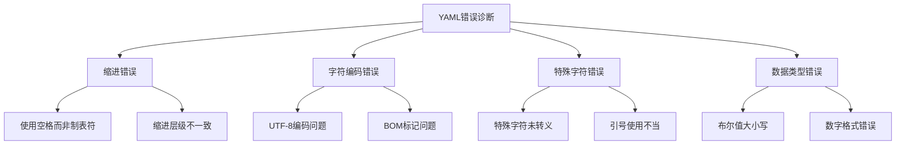
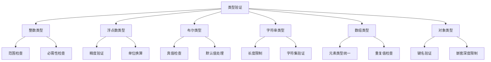
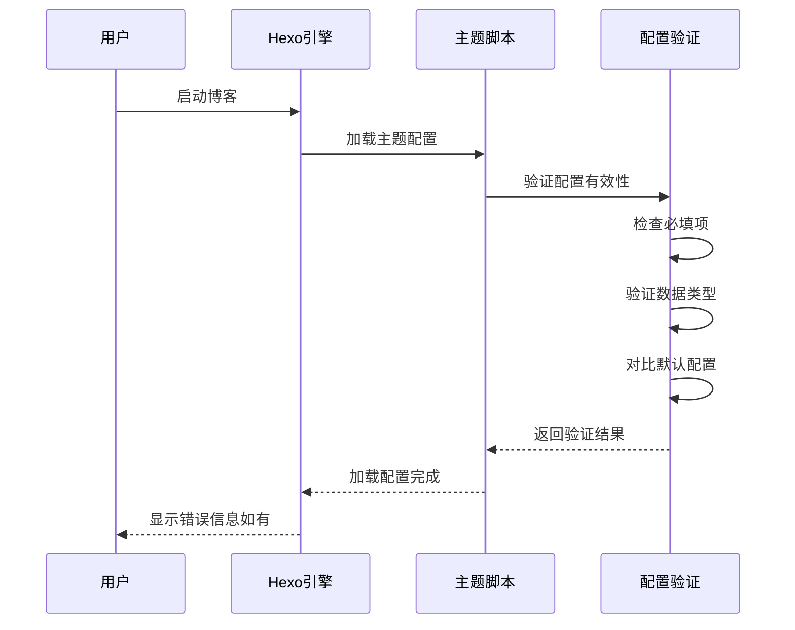
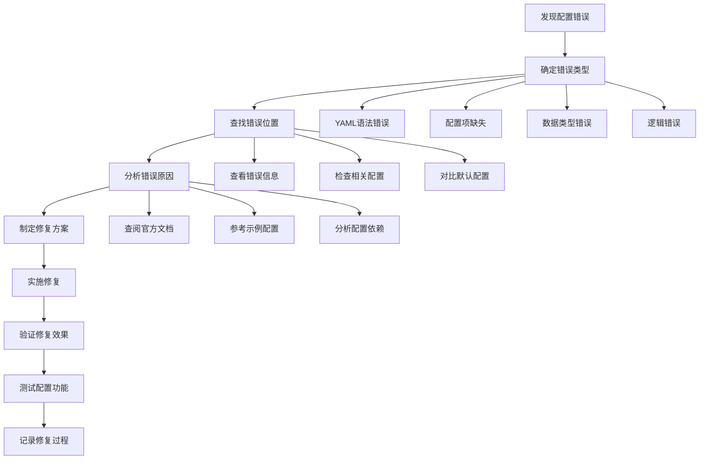

# 配置错误排查指南

<cite>
**本文档引用的文件**
- [_config.yml](file://_config.yml)
- [_config.yml](file://themes/butterfly/_config.yml)
- [default_config.js](file://themes/butterfly/scripts/common/default_config.js)
- [init.js](file://themes/butterfly/scripts/events/init.js)
- [zh-CN.yml](file://themes/butterfly/languages/zh-CN.yml)
- [default.yml](file://themes/butterfly/languages/default.yml)
- [package.json](file://package.json)
</cite>

## 目录
1. [简介](#简介)
2. [项目结构](#项目结构)
3. [核心组件](#核心组件)
4. [架构概览](#架构概览)
5. [详细组件分析](#详细组件分析)
6. [依赖关系分析](#依赖关系分析)
7. [性能考虑](#性能考虑)
8. [故障排除指南](#故障排除指南)
9. [结论](#结论)

## 简介

本指南专注于dzc-blog项目的配置错误排查，涵盖Hexo主配置文件和Butterfly主题配置文件中的常见配置问题。我们将详细说明YAML格式错误、配置项拼写错误、数值类型不匹配等问题的识别和修复方法，并提供配置文件语法检查工具的使用方法和配置项有效性验证的最佳实践。

## 项目结构

dzc-blog项目采用标准的Hexo博客结构，包含主配置文件和主题配置文件：



**图表来源**
- [_config.yml](file://_config.yml)
- [themes/butterfly/_config.yml](file://themes/butterfly/_config.yml)

**章节来源**
- [_config.yml](file://_config.yml)
- [themes/butterfly/_config.yml](file://themes/butterfly/_config.yml)

## 核心组件

### Hexo主配置文件

Hexo主配置文件位于项目根目录，包含站点基本信息、URL设置、目录配置、写作设置等核心配置项。

### Butterfly主题配置文件

Butterfly主题配置文件位于`themes/butterfly/_config.yml`，包含导航设置、代码块设置、社交媒体链接、图片设置、索引页面设置、文章设置、底部设置、侧边栏设置、全局设置、数学公式、搜索系统、评论系统、分享系统、分析统计、广告验证等多个配置区域。

### 默认配置验证

主题提供了默认配置验证机制，通过`default_config.js`文件定义了所有可用配置项的默认值，确保配置的完整性和有效性。

**章节来源**
- [themes/butterfly/scripts/common/default_config.js](file://themes/butterfly/scripts/common/default_config.js)
- [themes/butterfly/scripts/events/init.js](file://themes/butterfly/scripts/events/init.js)

## 架构概览



**图表来源**
- [themes/butterfly/scripts/events/init.js](file://themes/butterfly/scripts/events/init.js)
- [themes/butterfly/scripts/common/default_config.js](file://themes/butterfly/scripts/common/default_config.js)

## 详细组件分析

### 导航设置配置

导航设置是用户访问网站的第一印象，需要确保配置的准确性和完整性。

#### 配置项分析



**图表来源**
- [themes/butterfly/_config.yml](file://themes/butterfly/_config.yml)

#### 常见错误类型

1. **YAML格式错误**
   - 缩进不正确
   - 冒号后缺少空格
   - 字符编码问题

2. **配置项缺失**
   - 必填字段未设置
   - 数组格式错误

3. **数据类型不匹配**
   - 布尔值使用字符串
   - 数字使用文本格式

**章节来源**
- [themes/butterfly/_config.yml](file://themes/butterfly/_config.yml)

### 评论系统配置

评论系统配置涉及多个第三方服务提供商，每个都有特定的配置要求。

#### 支持的评论系统



**图表来源**
- [themes/butterfly/_config.yml](file://themes/butterfly/_config.yml)

#### 配置验证规则

1. **必填字段检查**
   - 每个评论系统都需要相应的认证信息
   - GitHub相关的系统需要完整的仓库信息

2. **格式验证**
   - GitHub仓库格式：`username/repository`
   - ID字段必须为有效的字符串或数字

3. **兼容性检查**
   - 不同评论系统之间的冲突检测
   - 主题支持的评论系统列表验证

**章节来源**
- [themes/butterfly/_config.yml](file://themes/butterfly/_config.yml)
- [themes/butterfly/scripts/common/default_config.js](file://themes/butterfly/scripts/common/default_config.js)

### 搜索功能配置

搜索功能配置相对简单，主要涉及搜索系统的类型选择和基本参数设置。

#### 搜索系统选项

| 搜索系统 | 配置键 | 描述 |
|---------|--------|------|
| Algolia | algolia_search | 第三方Algolia搜索服务 |
| 本地搜索 | local_search | 基于JavaScript的本地搜索 |
| Docsearch | docsearch | Algolia的Docsearch服务 |

**章节来源**
- [themes/butterfly/_config.yml](file://themes/butterfly/_config.yml)

## 依赖关系分析



**图表来源**
- [package.json](file://package.json)

**章节来源**
- [package.json](file://package.json)

## 性能考虑

### 配置优化建议

1. **懒加载配置**
   - 评论系统的懒加载设置
   - 图片懒加载配置
   - 第三方脚本的按需加载

2. **缓存策略**
   - 本地搜索数据预加载
   - CDN配置优化
   - 静态资源缓存

3. **性能监控**
   - 分析统计代码的异步加载
   - 广告脚本的延迟加载
   - 社交媒体插件的条件加载

## 故障排除指南

### YAML格式错误诊断

#### 常见YAML错误类型



**图表来源**
- [themes/butterfly/_config.yml](file://themes/butterfly/_config.yml)

#### 诊断步骤

1. **语法检查**
   - 使用在线YAML验证工具
   - 检查文件编码格式
   - 验证缩进一致性

2. **逐项验证**
   - 从最外层配置开始验证
   - 逐步深入嵌套配置
   - 检查数组和对象格式

3. **错误定位**
   - 查看错误行号
   - 分析错误上下文
   - 对比默认配置

### 配置项拼写错误

#### 常见拼写错误

| 错误配置项 | 正确配置项 | 说明 |
|-----------|-----------|------|
| `disqus_shortname` | `disqus.shortname` | 嵌套配置格式错误 |
| `gitalk_client_id` | `gitalk.client_id` | 下划线vs点号 |
| `valine_app_id` | `valine.appId` | 大小写不一致 |
| `waline_server_url` | `waline.serverURL` | 驼峰命名错误 |

#### 拼写检查清单

1. **配置项名称核对**
   - 对照官方文档的配置项名称
   - 检查大小写和特殊字符
   - 验证嵌套层级的正确性

2. **值格式验证**
   - 检查布尔值的正确格式
   - 验证数字类型的格式
   - 确认字符串值的引号使用

### 数值类型不匹配

#### 类型验证规则



**图表来源**
- [themes/butterfly/scripts/common/default_config.js](file://themes/butterfly/scripts/common/default_config.js)

#### 常见类型错误

1. **布尔值错误**
   - 使用字符串"true/false"而非true/false
   - 数字1/0与布尔值混淆

2. **数字格式错误**
   - 使用文本格式的数字
   - 缺少必要的数值单位

3. **数组格式错误**
   - 缺少方括号
   - 元素类型不一致

### 配置有效性验证最佳实践

#### 启动时验证



**图表来源**
- [themes/butterfly/scripts/events/init.js](file://themes/butterfly/scripts/events/init.js)

#### 运行时验证

1. **实时配置检查**
   - 在修改配置后立即验证
   - 提供即时的错误反馈
   - 支持增量验证

2. **配置备份机制**
   - 自动备份原始配置
   - 支持一键恢复
   - 记录配置变更历史

### 语法检查工具使用

#### 推荐的YAML验证工具

1. **在线验证工具**
   - YAML Lint Online
   - JSON/YAML Validator
   - CodeBeautify YAML Validator

2. **本地验证工具**
   ```bash
   # 使用Python验证YAML
   python -m yaml your_config.yml
   
   # 使用Node.js验证YAML
   npm install -g js-yaml
   js-yaml your_config.yml
   
   # 使用VS Code插件
   # YAML插件 - Red Hat
   ```

3. **IDE集成验证**
   - VS Code的YAML扩展
   - WebStorm的YAML支持
   - Sublime Text的YAML插件

### 配置修复流程



## 结论

配置错误排查是一个系统性的过程，需要从多个维度进行分析和验证。通过理解配置文件的结构、掌握常见的错误类型、使用合适的验证工具，可以有效地提高配置质量并减少部署问题。

关键要点包括：
- 建立完善的配置验证机制
- 使用标准化的配置模板
- 定期进行配置健康检查
- 建立配置变更管理流程
- 提供详细的错误诊断信息

通过遵循本指南提供的最佳实践，可以显著提高dzc-blog项目的配置质量和维护效率。