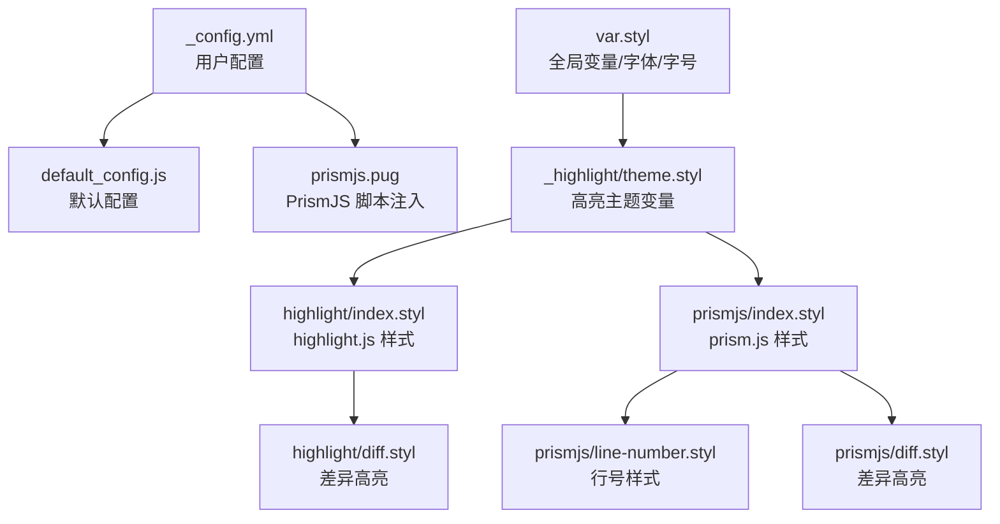
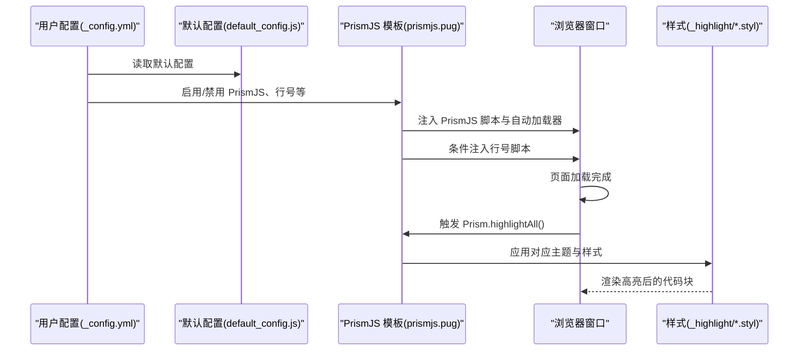
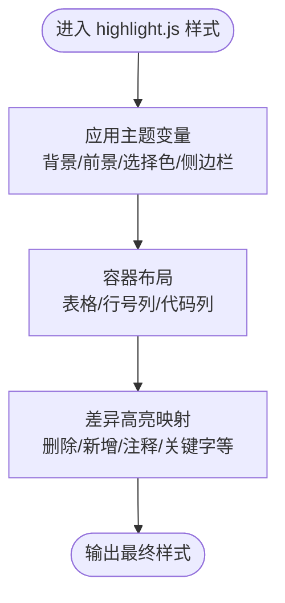
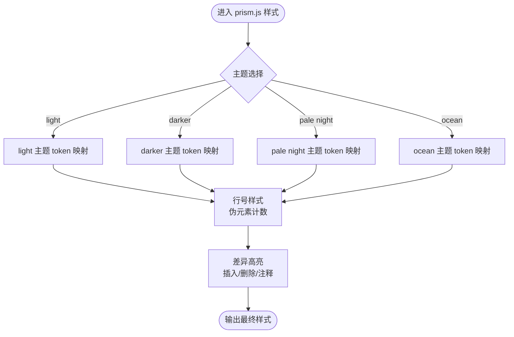
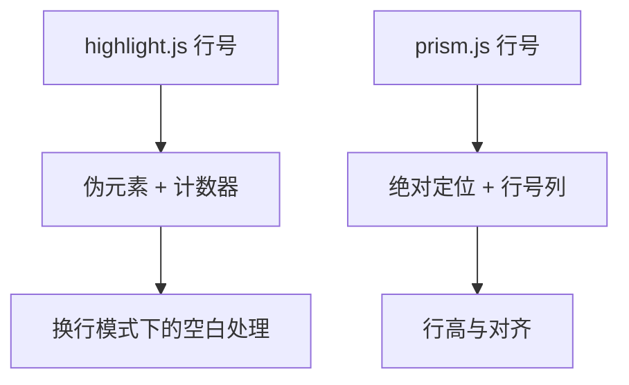
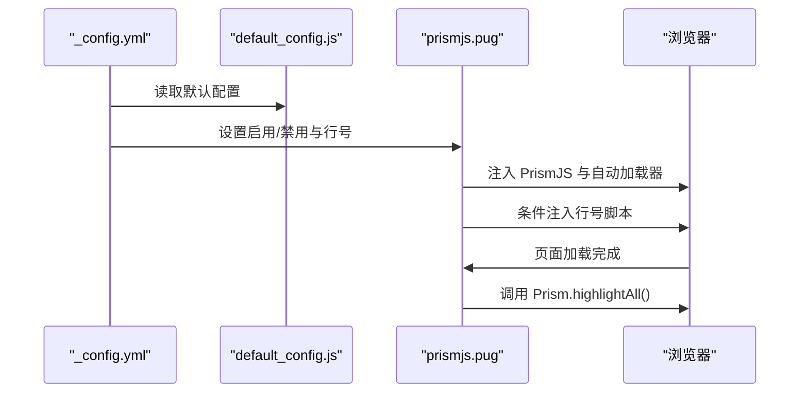
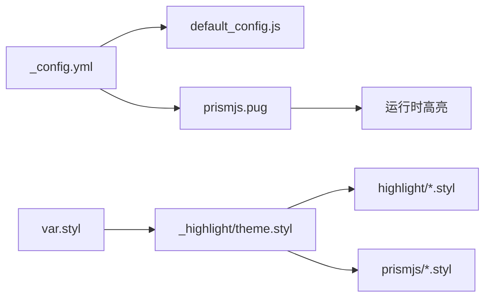

# 代码高亮样式

<cite>
**本文引用的文件**
- [themes/butterfly/_config.yml](file://themes/butterfly/_config.yml)
- [themes/butterfly/scripts/common/default_config.js](file://themes/butterfly/scripts/common/default_config.js)
- [themes/butterfly/layout/includes/third-party/prismjs.pug](file://themes/butterfly/layout/includes/third-party/prismjs.pug)
- [themes/butterfly/source/css/var.styl](file://themes/butterfly/source/css/var.styl)
- [themes/butterfly/source/css/_highlight/theme.styl](file://themes/butterfly/source/css/_highlight/theme.styl)
- [themes/butterfly/source/css/_highlight/highlight/index.styl](file://themes/butterfly/source/css/_highlight/highlight/index.styl)
- [themes/butterfly/source/css/_highlight/highlight/diff.styl](file://themes/butterfly/source/css/_highlight/highlight/diff.styl)
- [themes/butterfly/source/css/_highlight/prismjs/index.styl](file://themes/butterfly/source/css/_highlight/prismjs/index.styl)
- [themes/butterfly/source/css/_highlight/prismjs/line-number.styl](file://themes/butterfly/source/css/_highlight/prismjs/line-number.styl)
- [themes/butterfly/source/css/_highlight/prismjs/diff.styl](file://themes/butterfly/source/css/_highlight/prismjs/diff.styl)
</cite>

## 目录
1. [简介](#简介)
2. [项目结构](#项目结构)
3. [核心组件](#核心组件)
4. [架构总览](#架构总览)
5. [详细组件分析](#详细组件分析)
6. [依赖关系分析](#依赖关系分析)
7. [性能考虑](#性能考虑)
8. [故障排查指南](#故障排查指南)
9. [结论](#结论)
10. [附录](#附录)

## 简介
本文件系统性梳理了该博客主题中“代码高亮样式”的实现与使用方式，覆盖 highlight.js 与 prism.js 两种高亮方案的样式配置、代码块结构、颜色主题、行号显示、字体与背景样式、性能优化、自定义主题与响应式适配等。内容面向不同技术背景的读者，既提供高层概览，也给出可操作的落地建议。

## 项目结构
与代码高亮样式直接相关的目录与文件如下：
- 配置层：主题配置文件与默认配置脚本，用于控制高亮主题、行号、换行、复制按钮等行为
- 模板层：PrismJS 加载与初始化的模板片段
- 样式层：Stylus 文件组织，分别定义 highlight.js 与 prism.js 的样式、主题变量、差异高亮、行号等

图示来源
- [themes/butterfly/_config.yml](file://themes/butterfly/_config.yml)
- [themes/butterfly/scripts/common/default_config.js](file://themes/butterfly/scripts/common/default_config.js)
- [themes/butterfly/layout/includes/third-party/prismjs.pug](file://themes/butterfly/layout/includes/third-party/prismjs.pug)
- [themes/butterfly/source/css/var.styl](file://themes/butterfly/source/css/var.styl)
- [themes/butterfly/source/css/_highlight/theme.styl](file://themes/butterfly/source/css/_highlight/theme.styl)
- [themes/butterfly/source/css/_highlight/highlight/index.styl](file://themes/butterfly/source/css/_highlight/highlight/index.styl)
- [themes/butterfly/source/css/_highlight/highlight/diff.styl](file://themes/butterfly/source/css/_highlight/highlight/diff.styl)
- [themes/butterfly/source/css/_highlight/prismjs/index.styl](file://themes/butterfly/source/css/_highlight/prismjs/index.styl)
- [themes/butterfly/source/css/_highlight/prismjs/line-number.styl](file://themes/butterfly/source/css/_highlight/prismjs/line-number.styl)
- [themes/butterfly/source/css/_highlight/prismjs/diff.styl](file://themes/butterfly/source/css/_highlight/prismjs/diff.styl)

章节来源
- [themes/butterfly/_config.yml](file://themes/butterfly/_config.yml)
- [themes/butterfly/scripts/common/default_config.js](file://themes/butterfly/scripts/common/default_config.js)
- [themes/butterfly/layout/includes/third-party/prismjs.pug](file://themes/butterfly/layout/includes/third-party/prismjs.pug)
- [themes/butterfly/source/css/var.styl](file://themes/butterfly/source/css/var.styl)
- [themes/butterfly/source/css/_highlight/theme.styl](file://themes/butterfly/source/css/_highlight/theme.styl)
- [themes/butterfly/source/css/_highlight/highlight/index.styl](file://themes/butterfly/source/css/_highlight/highlight/index.styl)
- [themes/butterfly/source/css/_highlight/highlight/diff.styl](file://themes/butterfly/source/css/_highlight/highlight/diff.styl)
- [themes/butterfly/source/css/_highlight/prismjs/index.styl](file://themes/butterfly/source/css/_highlight/prismjs/index.styl)
- [themes/butterfly/source/css/_highlight/prismjs/line-number.styl](file://themes/butterfly/source/css/_highlight/prismjs/line-number.styl)
- [themes/butterfly/source/css/_highlight/prismjs/diff.styl](file://themes/butterfly/source/css/_highlight/prismjs/diff.styl)

## 核心组件
- 配置开关与主题选择
  - 通过配置项选择高亮方案（PrismJS 或 highlight.js），并启用行号、换行、复制按钮等
  - 默认配置脚本提供默认值，便于未显式配置时的行为一致性
- PrismJS 注入与初始化
  - 在模板中按需加载 PrismJS 脚本与自动加载器，并在页面加载与 PJAX 完成后触发高亮
  - 可选加载行号插件脚本
- 样式体系
  - 使用 Stylus 组织样式，主题变量集中管理，支持多套主题（light/darker/pale night/ocean）
  - 分别为 highlight.js 与 prism.js 提供独立的样式文件与差异高亮规则
  - 行号样式通过伪元素或专用类实现，支持换行模式下的行号对齐

章节来源
- [themes/butterfly/_config.yml](file://themes/butterfly/_config.yml)
- [themes/butterfly/scripts/common/default_config.js](file://themes/butterfly/scripts/common/default_config.js)
- [themes/butterfly/layout/includes/third-party/prismjs.pug](file://themes/butterfly/layout/includes/third-party/prismjs.pug)
- [themes/butterfly/source/css/_highlight/theme.styl](file://themes/butterfly/source/css/_highlight/theme.styl)
- [themes/butterfly/source/css/_highlight/highlight/index.styl](file://themes/butterfly/source/css/_highlight/highlight/index.styl)
- [themes/butterfly/source/css/_highlight/prismjs/index.styl](file://themes/butterfly/source/css/_highlight/prismjs/index.styl)
- [themes/butterfly/source/css/_highlight/prismjs/line-number.styl](file://themes/butterfly/source/css/_highlight/prismjs/line-number.styl)

## 架构总览
下图展示从配置到渲染的关键流程：用户配置决定高亮方案与特性；PrismJS 模板负责脚本注入与初始化；Stylus 样式根据主题变量生成最终视觉效果。

图示来源
- [themes/butterfly/_config.yml](file://themes/butterfly/_config.yml)
- [themes/butterfly/scripts/common/default_config.js](file://themes/butterfly/scripts/common/default_config.js)
- [themes/butterfly/layout/includes/third-party/prismjs.pug](file://themes/butterfly/layout/includes/third-party/prismjs.pug)
- [themes/butterfly/source/css/_highlight/prismjs/index.styl](file://themes/butterfly/source/css/_highlight/prismjs/index.styl)
- [themes/butterfly/source/css/_highlight/prismjs/line-number.styl](file://themes/butterfly/source/css/_highlight/prismjs/line-number.styl)

## 详细组件分析

### highlight.js 样式结构与主题
- 主题变量集中于主题样式文件，定义背景、前景色、选择色、侧边栏/工具条颜色以及滚动条颜色
- highlight.js 的容器结构由 Stylus 控制，包含行号列、代码列、表格布局与选中行高亮
- 差异高亮针对删除/新增/注释等语义类别提供颜色映射

图示来源
- [themes/butterfly/source/css/_highlight/theme.styl](file://themes/butterfly/source/css/_highlight/theme.styl)
- [themes/butterfly/source/css/_highlight/highlight/index.styl](file://themes/butterfly/source/css/_highlight/highlight/index.styl)
- [themes/butterfly/source/css/_highlight/highlight/diff.styl](file://themes/butterfly/source/css/_highlight/highlight/diff.styl)

章节来源
- [themes/butterfly/source/css/_highlight/theme.styl](file://themes/butterfly/source/css/_highlight/theme.styl)
- [themes/butterfly/source/css/_highlight/highlight/index.styl](file://themes/butterfly/source/css/_highlight/highlight/index.styl)
- [themes/butterfly/source/css/_highlight/highlight/diff.styl](file://themes/butterfly/source/css/_highlight/highlight/diff.styl)

### prism.js 样式结构与主题
- 支持多主题分支（light/darker/pale night/ocean），每种主题对 token 类型进行细粒度颜色映射
- 代码块基础样式包含滚动条风格、标题/链接等装饰；行号通过专用类与伪元素实现
- 差异高亮在不同主题下分别定义插入/删除等语义的视觉表现

图示来源
- [themes/butterfly/source/css/_highlight/prismjs/index.styl](file://themes/butterfly/source/css/_highlight/prismjs/index.styl)
- [themes/butterfly/source/css/_highlight/prismjs/line-number.styl](file://themes/butterfly/source/css/_highlight/prismjs/line-number.styl)
- [themes/butterfly/source/css/_highlight/prismjs/diff.styl](file://themes/butterfly/source/css/_highlight/prismjs/diff.styl)

章节来源
- [themes/butterfly/source/css/_highlight/prismjs/index.styl](file://themes/butterfly/source/css/_highlight/prismjs/index.styl)
- [themes/butterfly/source/css/_highlight/prismjs/line-number.styl](file://themes/butterfly/source/css/_highlight/prismjs/line-number.styl)
- [themes/butterfly/source/css/_highlight/prismjs/diff.styl](file://themes/butterfly/source/css/_highlight/prismjs/diff.styl)

### 行号显示机制
- highlight.js：通过伪元素在行前插入行号，使用计数器实现连续编号，支持选中行背景高亮
- prism.js：通过行号类与绝对定位的行号列实现，支持换行模式下的行高一致与对齐

图示来源
- [themes/butterfly/source/css/_highlight/highlight/index.styl](file://themes/butterfly/source/css/_highlight/highlight/index.styl)
- [themes/butterfly/source/css/_highlight/prismjs/line-number.styl](file://themes/butterfly/source/css/_highlight/prismjs/line-number.styl)

章节来源
- [themes/butterfly/source/css/_highlight/highlight/index.styl](file://themes/butterfly/source/css/_highlight/highlight/index.styl)
- [themes/butterfly/source/css/_highlight/prismjs/line-number.styl](file://themes/butterfly/source/css/_highlight/prismjs/line-number.styl)

### 字体与背景样式
- 全局字体与代码字体由变量统一管理，支持站点级与代码级字号
- 代码块行高、块内背景色、引用与块状元素颜色等由变量集中控制，便于主题切换时保持一致性

章节来源
- [themes/butterfly/source/css/var.styl](file://themes/butterfly/source/css/var.styl)

### 配置与初始化流程
- 用户在配置文件中开启/关闭高亮方案与行号等特性
- 默认配置脚本提供默认值，确保未配置时的行为稳定
- 模板根据配置动态注入脚本并在页面加载完成后执行高亮

图示来源
- [themes/butterfly/_config.yml](file://themes/butterfly/_config.yml)
- [themes/butterfly/scripts/common/default_config.js](file://themes/butterfly/scripts/common/default_config.js)
- [themes/butterfly/layout/includes/third-party/prismjs.pug](file://themes/butterfly/layout/includes/third-party/prismjs.pug)

章节来源
- [themes/butterfly/_config.yml](file://themes/butterfly/_config.yml)
- [themes/butterfly/scripts/common/default_config.js](file://themes/butterfly/scripts/common/default_config.js)
- [themes/butterfly/layout/includes/third-party/prismjs.pug](file://themes/butterfly/layout/includes/third-party/prismjs.pug)

## 依赖关系分析
- 配置依赖：用户配置优先于默认配置；PrismJS 模板依赖配置中的启用标志与行号开关
- 样式依赖：主题变量文件为 highlight.js 与 prism.js 样式提供统一的颜色与尺寸；差异高亮样式依附于主题分支
- 运行时依赖：PrismJS 自动加载器在页面加载后触发高亮；PJAX 完成后再次触发以适配 SPA 场景

图示来源
- [themes/butterfly/_config.yml](file://themes/butterfly/_config.yml)
- [themes/butterfly/scripts/common/default_config.js](file://themes/butterfly/scripts/common/default_config.js)
- [themes/butterfly/layout/includes/third-party/prismjs.pug](file://themes/butterfly/layout/includes/third-party/prismjs.pug)
- [themes/butterfly/source/css/var.styl](file://themes/butterfly/source/css/var.styl)
- [themes/butterfly/source/css/_highlight/theme.styl](file://themes/butterfly/source/css/_highlight/theme.styl)
- [themes/butterfly/source/css/_highlight/highlight/index.styl](file://themes/butterfly/source/css/_highlight/highlight/index.styl)
- [themes/butterfly/source/css/_highlight/prismjs/index.styl](file://themes/butterfly/source/css/_highlight/prismjs/index.styl)

章节来源
- [themes/butterfly/_config.yml](file://themes/butterfly/_config.yml)
- [themes/butterfly/scripts/common/default_config.js](file://themes/butterfly/scripts/common/default_config.js)
- [themes/butterfly/layout/includes/third-party/prismjs.pug](file://themes/butterfly/layout/includes/third-party/prismjs.pug)
- [themes/butterfly/source/css/var.styl](file://themes/butterfly/source/css/var.styl)
- [themes/butterfly/source/css/_highlight/theme.styl](file://themes/butterfly/source/css/_highlight/theme.styl)
- [themes/butterfly/source/css/_highlight/highlight/index.styl](file://themes/butterfly/source/css/_highlight/highlight/index.styl)
- [themes/butterfly/source/css/_highlight/prismjs/index.styl](file://themes/butterfly/source/css/_highlight/prismjs/index.styl)

## 性能考虑
- 按需加载
  - 仅在启用高亮且非预处理场景下注入 PrismJS 脚本与自动加载器
  - 行号脚本仅在需要行号时注入，避免不必要的资源加载
- 初始化时机
  - 在页面加载完成后与 PJAX 完成事件中触发高亮，减少阻塞与重复渲染
- 样式体积
  - 将主题变量与差异高亮拆分为独立文件，便于按需引入与缓存
- 缓存策略
  - 建议通过 CDN 与浏览器缓存机制缓存脚本与样式文件，降低二次访问开销

章节来源
- [themes/butterfly/layout/includes/third-party/prismjs.pug](file://themes/butterfly/layout/includes/third-party/prismjs.pug)
- [themes/butterfly/_config.yml](file://themes/butterfly/_config.yml)

## 故障排查指南
- 高亮未生效
  - 检查配置是否启用高亮方案与预处理开关
  - 确认模板已正确注入脚本与自动加载器
  - 在浏览器控制台查看是否存在脚本加载错误
- 行号不显示
  - 确认行号开关已开启
  - 对比 prism.js 行号样式与 highlight.js 行号样式是否被正确引入
- 主题颜色异常
  - 检查主题变量文件是否被正确编译
  - 确认目标主题分支已被启用
- 复制/展开/语言标签不可用
  - 检查相关配置项是否开启
  - 确认对应 UI 组件已在页面中渲染

章节来源
- [themes/butterfly/_config.yml](file://themes/butterfly/_config.yml)
- [themes/butterfly/layout/includes/third-party/prismjs.pug](file://themes/butterfly/layout/includes/third-party/prismjs.pug)
- [themes/butterfly/source/css/_highlight/theme.styl](file://themes/butterfly/source/css/_highlight/theme.styl)
- [themes/butterfly/source/css/_highlight/prismjs/line-number.styl](file://themes/butterfly/source/css/_highlight/prismjs/line-number.styl)

## 结论
该主题通过清晰的配置、模板与样式分层，实现了对 highlight.js 与 prism.js 的统一支持。主题变量集中管理颜色与尺寸，差异高亮与行号样式分别针对两种方案进行了优化。结合按需加载与初始化时机控制，整体具备良好的性能与可维护性。后续可在主题变量与差异映射上进一步扩展，以满足更丰富的定制需求。

## 附录

### 配置项速览（与高亮相关）
- 代码块主题：light/darker/pale night/ocean/false
- 行号开关：启用/禁用
- 换行：启用/禁用
- 复制按钮：启用/禁用
- 语言标签：启用/禁用
- 展开/收缩：展开/收缩/隐藏按钮
- 全屏：启用/禁用
- Mac 风格：启用/禁用
- 高度限制：数值/禁用

章节来源
- [themes/butterfly/_config.yml](file://themes/butterfly/_config.yml)
- [themes/butterfly/scripts/common/default_config.js](file://themes/butterfly/scripts/common/default_config.js)