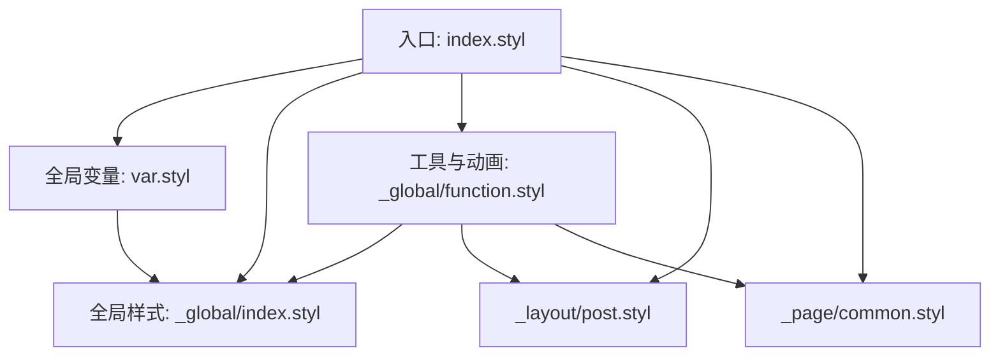
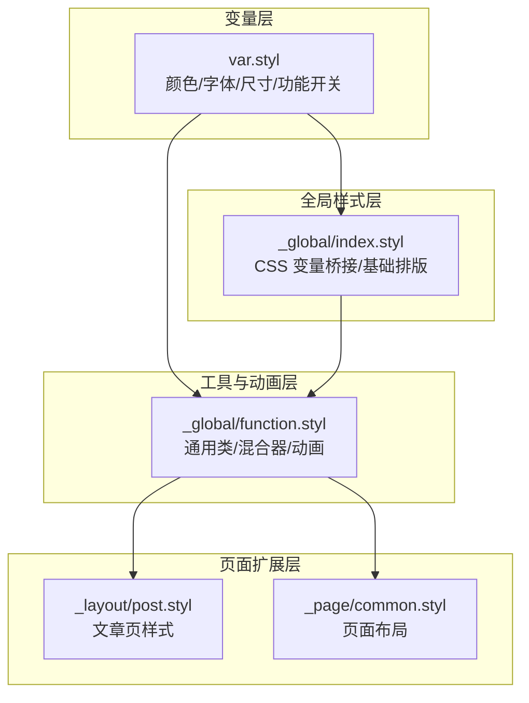
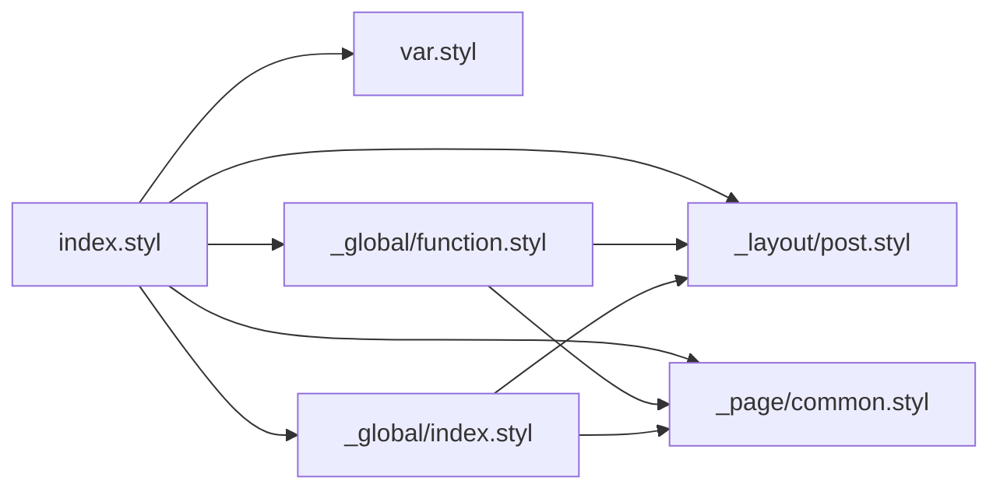

# 全局样式

<cite>
**本文引用的文件**
- [themes/butterfly/source/css/index.styl](file://themes/butterfly/source/css/index.styl)
- [themes/butterfly/source/css/var.styl](file://themes/butterfly/source/css/var.styl)
- [themes/butterfly/source/css/_global/index.styl](file://themes/butterfly/source/css/_global/index.styl)
- [themes/butterfly/source/css/_global/function.styl](file://themes/butterfly/source/css/_global/function.styl)
- [themes/butterfly/source/css/_layout/post.styl](file://themes/butterfly/source/css/_layout/post.styl)
- [themes/butterfly/source/css/_page/common.styl](file://themes/butterfly/source/css/_page/common.styl)
- [themes/butterfly/_config.yml](file://themes/butterfly/_config.yml)
</cite>

## 目录
1. [简介](#简介)
2. [项目结构](#项目结构)
3. [核心组件](#核心组件)
4. [架构总览](#架构总览)
5. [详细组件分析](#详细组件分析)
6. [依赖关系分析](#依赖关系分析)
7. [性能考量](#性能考量)
8. [故障排查指南](#故障排查指南)
9. [结论](#结论)
10. [附录](#附录)

## 简介
本文件聚焦于 Butterfly 主题的“全局样式”体系，系统梳理其组织结构与作用范围，覆盖基础排版、字体与字号、颜色体系、通用样式类与工具函数/混合器，并给出定制指南与最佳实践。读者将了解：
- 全局变量的定义与使用方式（颜色、尺寸、动画等）
- function.styl 中的工具函数与混合器如何被其他样式文件复用
- 如何在不破坏组件隔离的前提下进行样式定制
- 实际可参考的样式路径与配置项位置

## 项目结构
全局样式相关的核心文件集中在 themes/butterfly/source/css 目录，采用“入口聚合 + 分层模块”的组织方式：
- 入口聚合：index.styl 负责统一导入各子模块
- 全局变量：var.styl 定义颜色、字体、尺寸等全局变量
- 全局样式：_global/index.styl 提供基础排版、标签默认样式、滚动条、表格等
- 工具与动画：_global/function.styl 提供通用类、混合器与动画
- 页面布局与内容：_layout/post.styl、_page/common.styl 等按页面维度扩展
- 主题配置：_config.yml 提供主题开关与参数，驱动全局样式行为

图表来源
- [themes/butterfly/source/css/index.styl:1-15](file://themes/butterfly/source/css/index.styl#L1-L15)
- [themes/butterfly/source/css/var.styl:1-233](file://themes/butterfly/source/css/var.styl#L1-L233)
- [themes/butterfly/source/css/_global/index.styl:1-287](file://themes/butterfly/source/css/_global/index.styl#L1-L287)
- [themes/butterfly/source/css/_global/function.styl:1-348](file://themes/butterfly/source/css/_global/function.styl#L1-L348)
- [themes/butterfly/source/css/_layout/post.styl:1-265](file://themes/butterfly/source/css/_layout/post.styl#L1-L265)
- [themes/butterfly/source/css/_page/common.styl:1-61](file://themes/butterfly/source/css/_page/common.styl#L1-L61)

章节来源
- [themes/butterfly/source/css/index.styl:1-15](file://themes/butterfly/source/css/index.styl#L1-L15)

## 核心组件
- 全局变量层（var.styl）
  - 颜色体系：主题主色、链接色、块引用背景与边框、按钮、滚动条、表格等
  - 字体与字号：全局字体族、代码字体族、站点标题字体、全局字号、代码字号
  - 尺寸与布局：首页顶部图高度、侧栏宽度、TOC 移动端宽度等
  - 功能开关：分隔线图标、美化标题前缀、圆角 UI、懒加载等
- 全局样式层（_global/index.styl）
  - CSS 变量桥接：将 var.styl 的变量映射为 CSS 自定义属性，便于运行时切换
  - 基础排版：body、h1-h6、a、table、blockquote、滚动条等
  - 条件样式：根据配置启用背景图、选择文本高亮、圆角等
- 工具与动画层（_global/function.styl）
  - 通用类：单行/多行省略、垂直居中、列表美化、自定义分割线、图片悬停缩放等
  - 混合器：addBorderRadius、媒体查询宏（maxWidth/minWidth 系列）、卡片悬停效果
  - 动画：进入过渡、滚动提示、头像旋转、按钮波纹、侧边菜单逐项动画等
- 页面扩展层（_layout/post.styl、_page/common.styl）
  - 文章页标题美化、列表标记颜色、图片圆角、锚点滚动、HR 组件复用
  - 页面容器布局、侧栏隐藏逻辑、移动端断点适配

章节来源
- [themes/butterfly/source/css/var.styl:1-233](file://themes/butterfly/source/css/var.styl#L1-L233)
- [themes/butterfly/source/css/_global/index.styl:1-287](file://themes/butterfly/source/css/_global/index.styl#L1-L287)
- [themes/butterfly/source/css/_global/function.styl:1-348](file://themes/butterfly/source/css/_global/function.styl#L1-L348)
- [themes/butterfly/source/css/_layout/post.styl:1-265](file://themes/butterfly/source/css/_layout/post.styl#L1-L265)
- [themes/butterfly/source/css/_page/common.styl:1-61](file://themes/butterfly/source/css/_page/common.styl#L1-L61)

## 架构总览
全局样式通过“变量 -> 全局样式 -> 工具/动画 -> 页面扩展”的层级化设计实现：
- 变量层提供主题色彩、字体、尺寸等原子能力
- 全局样式层将变量映射为 CSS 自定义属性，并定义基础标签样式
- 工具/动画层提供可复用的类与混合器，降低重复样式编写
- 页面扩展层在具体页面中组合使用全局能力，形成最终视觉

图表来源
- [themes/butterfly/source/css/var.styl:1-233](file://themes/butterfly/source/css/var.styl#L1-L233)
- [themes/butterfly/source/css/_global/index.styl:1-287](file://themes/butterfly/source/css/_global/index.styl#L1-L287)
- [themes/butterfly/source/css/_global/function.styl:1-348](file://themes/butterfly/source/css/_global/function.styl#L1-L348)
- [themes/butterfly/source/css/_layout/post.styl:1-265](file://themes/butterfly/source/css/_layout/post.styl#L1-L265)
- [themes/butterfly/source/css/_page/common.styl:1-61](file://themes/butterfly/source/css/_page/common.styl#L1-L61)

## 详细组件分析

### 全局变量与颜色体系（var.styl）
- 颜色变量
  - 主题色与派生色：主色、分页器色、链接色、HR 颜色、代码前景/背景、TOC 颜色、块引用边框/背景等
  - 按钮与交互色：按钮文字色、悬停色、伪元素悬停色、滚动条色
  - 语义色：通知过期背景/文字/边框、评论开关颜色、标签隐藏背景等
- 字体与字号
  - 全局字体族与代码字体族，支持从配置覆盖
  - 站点标题字体族，支持从配置覆盖
  - 全局字号与代码字号，支持从配置覆盖
- 尺寸与布局
  - 首页顶部图高度、站点信息相对位置
  - 侧栏宽度、TOC 移动端宽度/最大宽度、移动端 TOC 活跃色
  - 表格表头背景色
- 功能开关
  - 分隔线图标（是否启用、图标 Unicode、顶部偏移）
  - 内容美化（启用、字段、标题前缀图标、颜色）
  - 圆角 UI、文本两端对齐、预加载、进入过渡、暗色模式等

章节来源
- [themes/butterfly/source/css/var.styl:1-233](file://themes/butterfly/source/css/var.styl#L1-L233)
- [themes/butterfly/_config.yml:759-850](file://themes/butterfly/_config.yml#L759-L850)

### 全局样式与 CSS 变量桥接（_global/index.styl）
- CSS 变量桥接
  - 在 :root 定义大量 CSS 自定义属性，将 var.styl 中的变量映射为 --global-*、--card-*、--blockquote-* 等
  - 通过 var(--变量名) 在后续样式中统一引用，便于主题切换或动态更新
- 基础排版与标签默认样式
  - body：背景、文字颜色、字号、字体、行高、滚动行为、选择禁用等
  - 滚动条：Firefox 与 WebKit 的不同实现，颜色由变量控制
  - 表格：边框、单元格、表头背景、圆角等
  - 引用块：边框、背景、颜色、圆角
  - 链接：颜色、悬停效果
  - 字体：站点标题/副标题/作者信息等可选覆盖字体族
- 条件样式
  - 根据配置启用背景图、选择文本高亮、圆角等

章节来源
- [themes/butterfly/source/css/_global/index.styl:1-287](file://themes/butterfly/source/css/_global/index.styl#L1-L287)

### 工具与动画（_global/function.styl）
- 通用类
  - 单行/多行省略：限制文本长度，避免溢出
  - 垂直居中：绝对定位 + transform 实现
  - 列表美化：伪元素实现圆点标记，悬停变色
  - 自定义分割线：支持悬停移动图标、可选 FontAwesome 图标
  - 图片悬停：缩放与滤镜过渡
  - 卡片悬停：阴影与圆角过渡
- 混合器
  - addBorderRadius：条件性添加圆角，支持隐藏溢出
  - 媒体查询宏：maxWidth600/768/900/1024、minWidth768/900/1024/2000，统一传入 {block} 代码块
- 动画
  - 进入过渡：页面主体、导航、标题、背景、侧边菜单逐项动画
  - 滚动提示：无限循环的向下箭头动画
  - 头像旋转：头像无限旋转
  - 捐赠弹窗：淡入动画
  - 按钮波纹：悬停波纹与图标弹跳
  - 侧边菜单项：逐项入场动画
- 关键帧
  - scroll-down-effect、header-effect、bottom-top、titleScale、to_show、to_hide、ribbon_to_show、avatar_turn_around、sub_menus、donate_effcet、sidebarItem、buttonIconBounce

章节来源
- [themes/butterfly/source/css/_global/function.styl:1-348](file://themes/butterfly/source/css/_global/function.styl#L1-L348)

### 页面扩展与复用（_layout/post.styl、_page/common.styl）
- 文章页样式
  - 标题美化：前置图标、悬停效果、点击滚动到锚点
  - 列表标记：颜色与悬停变色
  - 图片：居中显示、最大宽度、圆角、过渡
  - 版权声明：圆角、阴影、图标、悬停效果
  - 过期提示：背景/文字/边框、可选扁平样式与图标
- 页面布局
  - 页面容器：flex 布局、最大宽度、内边距、移动端断点
  - 侧栏：宽度、隐藏逻辑、左右位置切换
  - 适配：Apple 设备特定优化

章节来源
- [themes/butterfly/source/css/_layout/post.styl:1-265](file://themes/butterfly/source/css/_layout/post.styl#L1-L265)
- [themes/butterfly/source/css/_page/common.styl:1-61](file://themes/butterfly/source/css/_page/common.styl#L1-L61)

## 依赖关系分析
- 导入链路
  - index.styl 作为入口，先导入 var.styl，再导入 _global/*，随后是 _highlight、_page/*、_layout/*、_tags/*、_mode/*、_search/index
  - _global/index.styl 依赖 var.styl 的变量
  - _global/function.styl 既可被全局样式复用（如 @extend），也可被页面样式复用（如 addBorderRadius、媒体查询宏）
- 组合关系
  - function.styl 中的 addBorderRadius 与媒体查询宏被 post.styl 与 common.styl 使用
  - function.styl 中的通用类（如 .custom-hr）被 post.styl 的 HR 组件复用
  - index.styl 将全局样式与页面样式整合，形成最终输出

图表来源
- [themes/butterfly/source/css/index.styl:1-15](file://themes/butterfly/source/css/index.styl#L1-L15)
- [themes/butterfly/source/css/var.styl:1-233](file://themes/butterfly/source/css/var.styl#L1-L233)
- [themes/butterfly/source/css/_global/index.styl:1-287](file://themes/butterfly/source/css/_global/index.styl#L1-L287)
- [themes/butterfly/source/css/_global/function.styl:1-348](file://themes/butterfly/source/css/_global/function.styl#L1-L348)
- [themes/butterfly/source/css/_layout/post.styl:1-265](file://themes/butterfly/source/css/_layout/post.styl#L1-L265)
- [themes/butterfly/source/css/_page/common.styl:1-61](file://themes/butterfly/source/css/_page/common.styl#L1-L61)

## 性能考量
- 变量集中管理：通过 var.styl 与 CSS 自定义属性减少重复计算与多处硬编码
- 条件样式：仅在配置开启时注入对应规则，避免无用样式
- 动画与过渡：合理使用 transform 与 opacity，尽量避免重排；对高频动画使用硬件加速友好的属性
- 懒加载与模糊：在图片懒加载场景下使用滤镜模糊，提升首屏体验
- 媒体查询：使用统一的宏封装，减少重复断点定义

## 故障排查指南
- 样式未生效
  - 检查入口文件是否正确导入 var.styl 与 _global/*
  - 确认 CSS 变量桥接是否在 :root 正常生成
- 圆角无效
  - 确认配置项 rounded_corners_ui 是否开启
  - 检查 addBorderRadius 混合器调用是否传参
- 动画不出现
  - 确认 enter_transitions 是否开启
  - 检查目标元素是否满足动画触发条件（如页面主体、导航、标题等）
- 图标不显示
  - 确认 FontAwesome 字体已加载
  - 检查 .fontawesomeIcon 类是否被正确继承
- 滚动条颜色异常
  - Firefox 使用 scrollbar-color，WebKit 使用 ::-webkit-scrollbar-*，确认浏览器类型与规则是否匹配

章节来源
- [themes/butterfly/source/css/index.styl:1-15](file://themes/butterfly/source/css/index.styl#L1-L15)
- [themes/butterfly/source/css/_global/index.styl:117-133](file://themes/butterfly/source/css/_global/index.styl#L117-L133)
- [themes/butterfly/source/css/_global/function.styl:18-24](file://themes/butterfly/source/css/_global/function.styl#L18-L24)
- [themes/butterfly/_config.yml:807-808](file://themes/butterfly/_config.yml#L807-L808)

## 结论
全局样式通过“变量 -> 全局样式 -> 工具/动画 -> 页面扩展”的分层设计，实现了主题色彩、排版与交互的一致性与可维护性。开发者可在不破坏组件隔离的前提下，通过配置项与变量覆盖实现定制化；同时利用工具函数与混合器减少重复代码，提升开发效率与一致性。

## 附录

### 全局变量与使用方法速览
- 颜色变量
  - 主题主色、链接色、块引用边框/背景、按钮、滚动条、表格等
  - 使用路径：[themes/butterfly/source/css/var.styl:1-233](file://themes/butterfly/source/css/var.styl#L1-L233)
- 字体与字号
  - 全局字体族、代码字体族、站点标题字体、全局字号、代码字号
  - 使用路径：[themes/butterfly/source/css/var.styl:15-21](file://themes/butterfly/source/css/var.styl#L15-L21)
- 尺寸变量
  - 首页顶部图高度、侧栏宽度、TOC 移动端宽度/最大宽度等
  - 使用路径：[themes/butterfly/source/css/var.styl:31-66](file://themes/butterfly/source/css/var.styl#L31-L66)
- 功能开关
  - 分隔线图标、内容美化、圆角 UI、懒加载、进入过渡等
  - 使用路径：[themes/butterfly/_config.yml:759-850](file://themes/butterfly/_config.yml#L759-L850)

### function.styl 工具函数与混合器使用指南
- 通用类
  - 单行/多行省略、垂直居中、列表美化、自定义分割线、图片悬停缩放、卡片悬停
  - 使用路径：[themes/butterfly/source/css/_global/function.styl:1-104](file://themes/butterfly/source/css/_global/function.styl#L1-L104)
- 混合器
  - addBorderRadius：条件性添加圆角，支持隐藏溢出
  - 媒体查询宏：maxWidth600/768/900/1024、minWidth768/900/1024/2000
  - 使用路径：[themes/butterfly/source/css/_global/function.styl:18-146](file://themes/butterfly/source/css/_global/function.styl#L18-L146)
- 动画
  - 进入过渡、滚动提示、头像旋转、按钮波纹、侧边菜单项动画等
  - 使用路径：[themes/butterfly/source/css/_global/function.styl:147-348](file://themes/butterfly/source/css/_global/function.styl#L147-L348)

### 定制指南：如何修改基础样式而不影响其他组件
- 优先通过配置项调整行为
  - 示例：开启/关闭进入过渡、圆角 UI、内容美化、分隔线图标等
  - 配置路径：[themes/butterfly/_config.yml:759-850](file://themes/butterfly/_config.yml#L759-L850)
- 使用变量覆盖实现主题色与配色
  - 在 var.styl 中调整颜色变量，或通过配置项 theme_color.* 控制
  - 覆盖路径：[themes/butterfly/source/css/var.styl:6-14](file://themes/butterfly/source/css/var.styl#L6-L14)
- 通过 CSS 自定义属性统一替换
  - 在 :root 中覆写 --global-*、--card-* 等变量，实现全局替换
  - 覆写路径：[themes/butterfly/source/css/_global/index.styl:1-41](file://themes/butterfly/source/css/_global/index.styl#L1-L41)
- 复用工具函数与混合器
  - 在页面样式中直接使用 addBorderRadius、媒体查询宏，避免重复编写
  - 使用路径：[themes/butterfly/source/css/_layout/post.styl:89-90](file://themes/butterfly/source/css/_layout/post.styl#L89-L90)

### 最佳实践建议
- 保持变量集中管理，避免在页面样式中直接硬编码颜色与尺寸
- 优先使用 @extend 复用通用类，减少重复选择器
- 合理拆分工具函数与页面样式，确保工具层可复用、页面层可组合
- 对高频动画使用 transform/opacity，避免频繁触发布局重排
- 通过配置项控制功能开关，减少不必要的样式注入