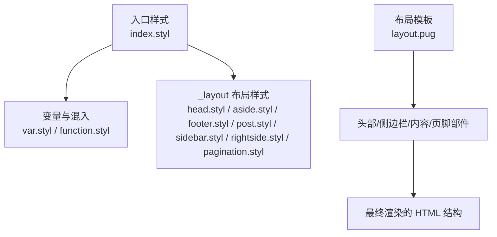
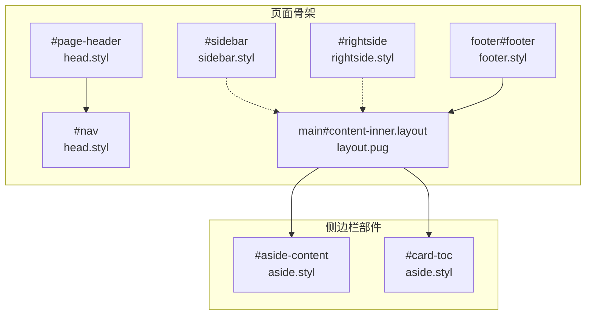
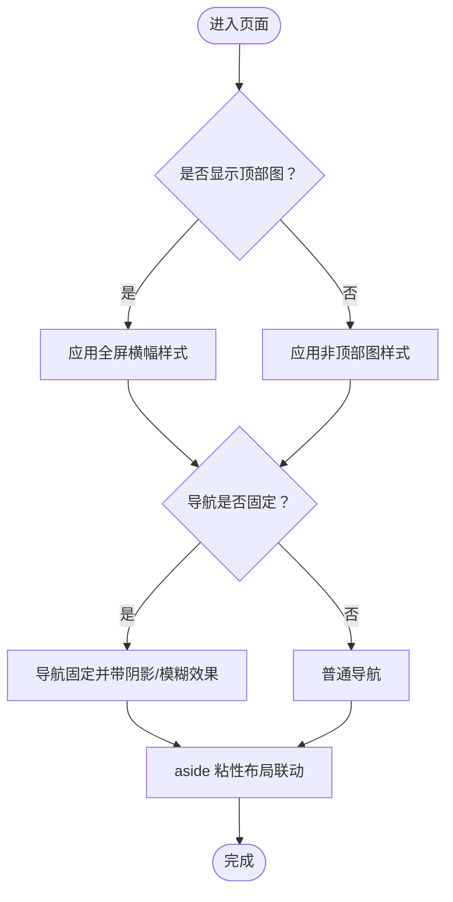
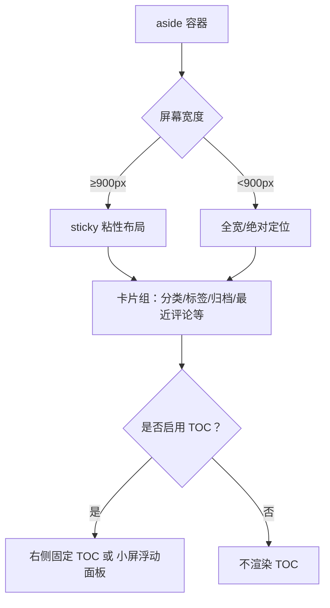
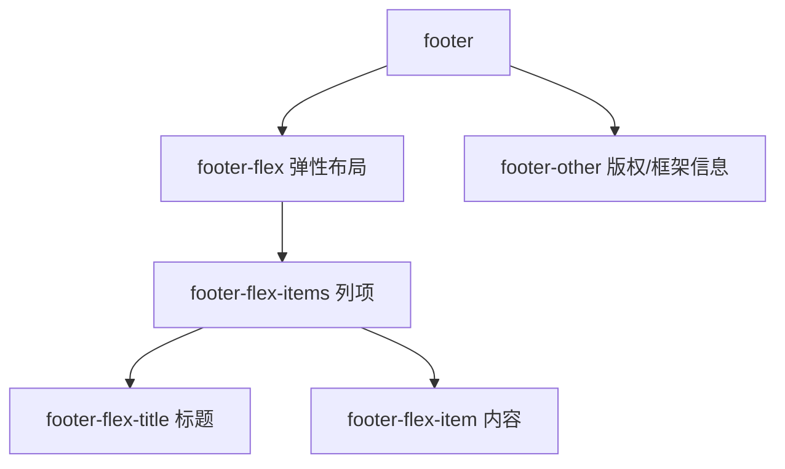
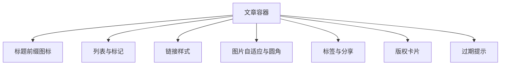
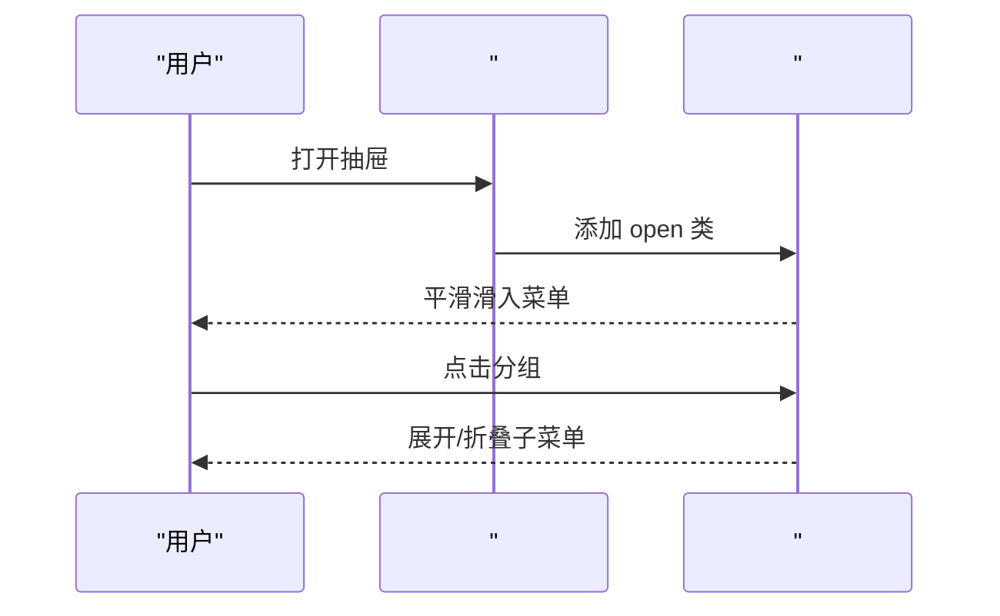
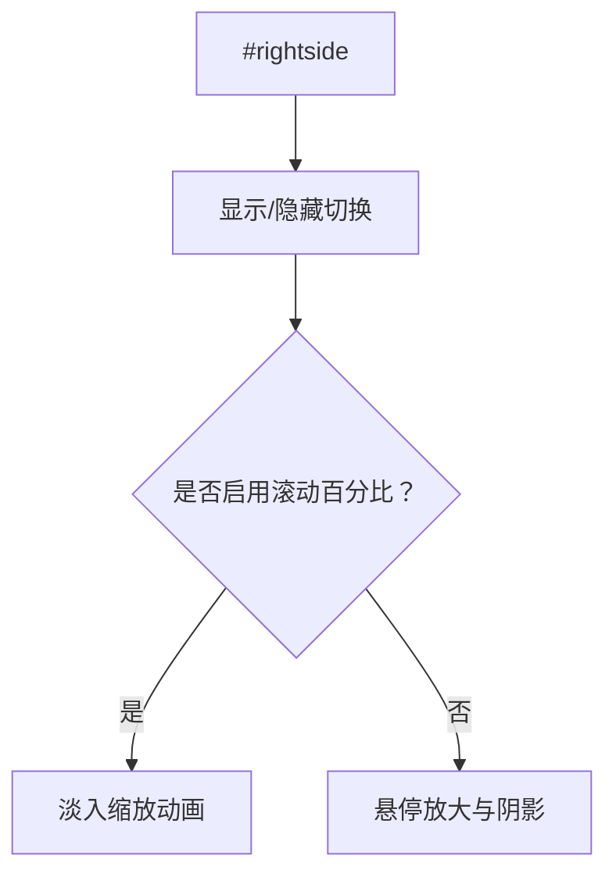
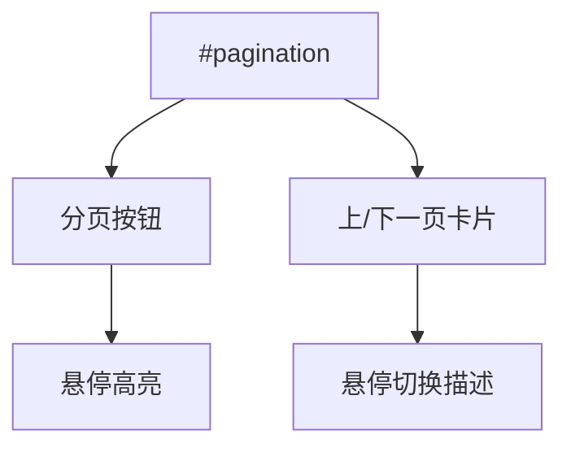
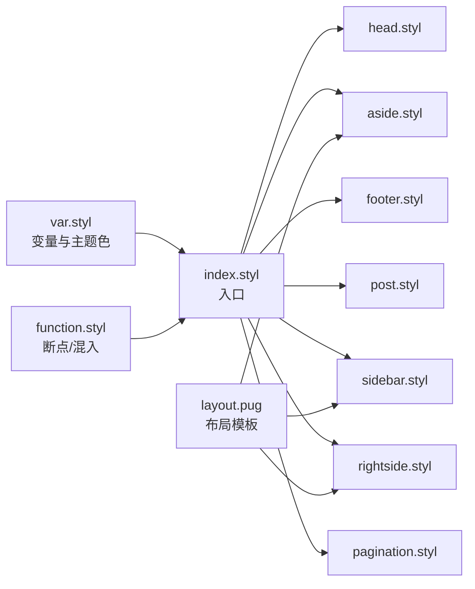

# 布局样式

<cite>
**本文引用的文件**
- [head.styl](file://themes/butterfly/source/css/_layout/head.styl)
- [aside.styl](file://themes/butterfly/source/css/_layout/aside.styl)
- [footer.styl](file://themes/butterfly/source/css/_layout/footer.styl)
- [post.styl](file://themes/butterfly/source/css/_layout/post.styl)
- [sidebar.styl](file://themes/butterfly/source/css/_layout/sidebar.styl)
- [rightside.styl](file://themes/butterfly/source/css/_layout/rightside.styl)
- [function.styl](file://themes/butterfly/source/css/_global/function.styl)
- [var.styl](file://themes/butterfly/source/css/var.styl)
- [layout.pug](file://themes/butterfly/layout/includes/layout.pug)
- [pagination.styl](file://themes/butterfly/source/css/_layout/pagination.styl)
- [_config.yml](file://themes/butterfly/_config.yml)
- [index.styl](file://themes/butterfly/source/css/index.styl)
</cite>

## 目录
1. [简介](#简介)
2. [项目结构](#项目结构)
3. [核心组件](#核心组件)
4. [架构总览](#架构总览)
5. [详细组件分析](#详细组件分析)
6. [依赖关系分析](#依赖关系分析)
7. [性能考量](#性能考量)
8. [故障排查指南](#故障排查指南)
9. [结论](#结论)
10. [附录](#附录)

## 简介
本文件系统性梳理了该博客主题的布局样式体系，覆盖头部导航、侧边栏、主要内容区域与页脚的整体设计；详解响应式断点、网格与移动端适配策略；并提供针对 aside 侧边栏、footer 页脚、head 头部与 post 文章区域的具体样式实现说明。同时给出布局定制指南（间距、宽度、对齐）、组件组合使用方法以及自定义布局的开发技巧。

## 项目结构
主题采用“样式分层 + 模板拼装”的组织方式：
- 样式通过入口文件统一导入，按功能域拆分为 _layout、_page、_tags、_mode 等目录
- 布局容器与页面骨架由 Pug 模板拼装，运行时根据配置动态注入类名与部件
- 响应式能力通过全局混入函数与断点宏实现

**图表来源**
- [index.styl:1-15](file://themes/butterfly/source/css/index.styl#L1-L15)
- [layout.pug:1-59](file://themes/butterfly/layout/includes/layout.pug#L1-L59)

**章节来源**
- [index.styl:1-15](file://themes/butterfly/source/css/index.styl#L1-L15)
- [layout.pug:1-59](file://themes/butterfly/layout/includes/layout.pug#L1-L59)

## 核心组件
- 头部导航与横幅：控制站点标题、副标题、社交图标、导航固定与滚动行为、文章页信息定位等
- 侧边栏与右侧工具：控制侧边卡片、目录树、移动端抽屉菜单、右侧悬浮按钮与回到顶部百分比
- 主要内容区：文章正文排版、标题前缀图标、列表与链接样式、版权与过期提示
- 页脚：多列布局、版权与框架信息、可选遮罩层

**章节来源**
- [head.styl:1-465](file://themes/butterfly/source/css/_layout/head.styl#L1-L465)
- [aside.styl:1-435](file://themes/butterfly/source/css/_layout/aside.styl#L1-L435)
- [post.styl:1-265](file://themes/butterfly/source/css/_layout/post.styl#L1-L265)
- [footer.styl:1-87](file://themes/butterfly/source/css/_layout/footer.styl#L1-L87)
- [sidebar.styl:1-97](file://themes/butterfly/source/css/_layout/sidebar.styl#L1-L97)
- [rightside.styl:1-109](file://themes/butterfly/source/css/_layout/rightside.styl#L1-L109)

## 架构总览
下图展示页面骨架与关键布局容器之间的关系，以及运行时根据配置注入的类名如何影响布局行为。

**图表来源**
- [layout.pug:42-56](file://themes/butterfly/layout/includes/layout.pug#L42-L56)
- [head.styl:289-465](file://themes/butterfly/source/css/_layout/head.styl#L289-L465)
- [aside.styl:1-435](file://themes/butterfly/source/css/_layout/aside.styl#L1-L435)
- [sidebar.styl:1-97](file://themes/butterfly/source/css/_layout/sidebar.styl#L1-L97)
- [rightside.styl:1-109](file://themes/butterfly/source/css/_layout/rightside.styl#L1-L109)
- [footer.styl:1-87](file://themes/butterfly/source/css/_layout/footer.styl#L1-L87)

## 详细组件分析

### 头部导航与横幅（head）
- 背景与遮罩：支持为头部与页脚添加遮罩层，提升文字对比度
- 首页全屏横幅：控制高度、背景固定与站点信息绝对定位
- 文章页横幅：控制高度与信息定位，支持居中或底部定位
- 导航固定与可见性：导航可固定在顶部，支持折叠/展开动画，配合 aside 的粘性布局联动
- 文章元信息：标题、副标题、作者信息、社交图标等

**图表来源**
- [head.styl:19-208](file://themes/butterfly/source/css/_layout/head.styl#L19-L208)
- [head.styl:146-204](file://themes/butterfly/source/css/_layout/head.styl#L146-L204)

**章节来源**
- [head.styl:1-465](file://themes/butterfly/source/css/_layout/head.styl#L1-L465)

### 侧边栏（aside）
- 宽度与位置：默认占 26%，支持左右位置切换；在小屏设备上自动收起为全宽
- 卡片组件：统一的卡片样式、悬停效果、圆角开关；移动端可按配置隐藏
- 粘性布局：大屏使用 sticky，小屏使用绝对定位
- 目录树（TOC）：大屏固定在右侧，小屏为浮动面板，支持缩放动画与展开/折叠
- 排序与隐藏：可通过配置对卡片顺序进行排序或隐藏

**图表来源**
- [aside.styl:1-435](file://themes/butterfly/source/css/_layout/aside.styl#L1-L435)

**章节来源**
- [aside.styl:1-435](file://themes/butterfly/source/css/_layout/aside.styl#L1-L435)

### 页脚（footer）
- 多列弹性布局：flex 方向、换行、间距与最大宽度控制
- 版权与框架信息：支持条件渲染与不同样式
- 可选遮罩层：与头部一致的遮罩机制

**图表来源**
- [footer.styl:36-87](file://themes/butterfly/source/css/_layout/footer.styl#L36-L87)

**章节来源**
- [footer.styl:1-87](file://themes/butterfly/source/css/_layout/footer.styl#L1-L87)

### 文章区域（post）
- 标题前缀图标：通过伪元素实现，支持不同层级标题的前缀尺寸与偏移
- 列表与链接：统一的列表样式、链接颜色与悬停效果
- 图片与容器：图片自适应、圆角、悬停缩放；容器宽度与断行策略
- 标签与分享：标签云、分享按钮样式
- 版权与过期提示：版权卡片、过期提示样式与扁平风格

**图表来源**
- [post.styl:1-265](file://themes/butterfly/source/css/_layout/post.styl#L1-L265)

**章节来源**
- [post.styl:1-265](file://themes/butterfly/source/css/_layout/post.styl#L1-L265)

### 侧边抽屉菜单（sidebar）
- 抽屉定位：右侧滑出，支持遮罩层与平滑过渡
- 菜单分组：支持分组与展开/折叠动画
- 菜单项：圆角、阴影、悬停位移与图标旋转

**图表来源**
- [sidebar.styl:10-97](file://themes/butterfly/source/css/_layout/sidebar.styl#L10-L97)

**章节来源**
- [sidebar.styl:1-97](file://themes/butterfly/source/css/_layout/sidebar.styl#L1-L97)

### 右侧悬浮工具（rightside）
- 固定位置与显隐：右下角固定，支持显隐动画与透明度过渡
- 移动端适配：小屏隐藏部分按钮，仅保留必要入口
- 回到顶部百分比：可选显示滚动百分比与淡入缩放动画

**图表来源**
- [rightside.styl:1-109](file://themes/butterfly/source/css/_layout/rightside.styl#L1-L109)

**章节来源**
- [rightside.styl:1-109](file://themes/butterfly/source/css/_layout/rightside.styl#L1-L109)

### 分页（pagination）
- 分页按钮：卡片化样式、悬停高亮
- 上一页/下一页：图片化卡片，悬停切换描述
- 响应式布局：小屏时垂直堆叠

**图表来源**
- [pagination.styl:1-106](file://themes/butterfly/source/css/_layout/pagination.styl#L1-L106)

**章节来源**
- [pagination.styl:1-106](file://themes/butterfly/source/css/_layout/pagination.styl#L1-L106)

## 依赖关系分析
- 入口样式统一导入变量与混入，再按功能域引入各模块样式
- 布局模板通过运行时变量决定 aside 显示、页面类型与隐藏状态
- 断点与混入函数集中于全局，供所有布局样式复用

**图表来源**
- [index.styl:1-15](file://themes/butterfly/source/css/index.styl#L1-L15)
- [function.styl:111-146](file://themes/butterfly/source/css/_global/function.styl#L111-L146)
- [layout.pug:1-59](file://themes/butterfly/layout/includes/layout.pug#L1-L59)

**章节来源**
- [index.styl:1-15](file://themes/butterfly/source/css/index.styl#L1-L15)
- [function.styl:111-146](file://themes/butterfly/source/css/_global/function.styl#L111-L146)
- [layout.pug:1-59](file://themes/butterfly/layout/includes/layout.pug#L1-L59)

## 性能考量
- 减少重绘与回流：导航固定与 aside 粘性布局使用 transform/opacity 动画，避免频繁触发布局
- 条件加载：移动端隐藏部分卡片与按钮，降低 DOM 体积
- 图片优化：图片自适应与对象裁剪，减少超大图带来的渲染压力
- 动画节流：按钮与菜单动画采用过渡与缓动，避免过度消耗 CPU/GPU

## 故障排查指南
- 导航不固定或闪烁
  - 检查导航固定类与过渡时间设置
  - 确认 aside 粘性布局与导航 top 值联动
  - 参考路径：[head.styl:146-204](file://themes/butterfly/source/css/_layout/head.styl#L146-L204)
- 侧边栏不显示或遮挡内容
  - 检查 aside 显示开关与隐藏类
  - 确认 aside 在小屏下的全宽模式
  - 参考路径：[aside.styl:10-12](file://themes/butterfly/source/css/_layout/aside.styl#L10-L12)，[layout.pug:2-4](file://themes/butterfly/layout/includes/layout.pug#L2-L4)
- TOC 不显示或无法展开
  - 检查 TOC 开关与小屏浮动面板
  - 确认展开/折叠动画与 active 状态
  - 参考路径：[aside.styl:235-290](file://themes/butterfly/source/css/_layout/aside.styl#L235-L290)
- 页脚布局错位
  - 检查 footer-flex 的 gap、padding、最大宽度
  - 参考路径：[footer.styl:36-51](file://themes/butterfly/source/css/_layout/footer.styl#L36-L51)
- 文章图片溢出或比例异常
  - 检查图片自适应与圆角设置
  - 参考路径：[post.styl:85-91](file://themes/butterfly/source/css/_layout/post.styl#L85-L91)

**章节来源**
- [head.styl:146-204](file://themes/butterfly/source/css/_layout/head.styl#L146-L204)
- [aside.styl:10-12](file://themes/butterfly/source/css/_layout/aside.styl#L10-L12)
- [layout.pug:2-4](file://themes/butterfly/layout/includes/layout.pug#L2-L4)
- [aside.styl:235-290](file://themes/butterfly/source/css/_layout/aside.styl#L235-L290)
- [footer.styl:36-51](file://themes/butterfly/source/css/_layout/footer.styl#L36-L51)
- [post.styl:85-91](file://themes/butterfly/source/css/_layout/post.styl#L85-L91)

## 结论
该主题的布局样式以“变量 + 混入 + 断点”为核心，结合 Pug 模板的运行时逻辑，实现了灵活且可定制的页面骨架。通过统一的 aside、footer、head 与 post 样式模块，开发者可以快速组合出符合需求的布局，并在移动端与桌面端获得一致体验。

## 附录

### 响应式断点与网格系统
- 断点宏：提供 maxWidth768/minWidth768/maxWidth900/minWidth900/minWidth1024/maxWidth1024/minWidth2000 等
- 网格与布局：aside 默认 26% 宽度，小屏 100%；footer 使用 flex gap 控制列间距；head 与 post 使用相对单位与媒体查询适配
- 移动端适配：侧边栏与 TOC 在小屏下切换为全宽或浮动面板；导航与 aside 的联动确保内容不被遮挡

**章节来源**
- [function.styl:111-146](file://themes/butterfly/source/css/_global/function.styl#L111-L146)
- [aside.styl:2-12](file://themes/butterfly/source/css/_layout/aside.styl#L2-L12)
- [footer.styl:36-51](file://themes/butterfly/source/css/_layout/footer.styl#L36-L51)
- [head.styl:19-208](file://themes/butterfly/source/css/_layout/head.styl#L19-L208)

### 布局定制指南
- 间距与对齐
  - 通过变量文件中的全局字号、行高、卡片间距等进行统一调整
  - 参考路径：[var.styl:31-36](file://themes/butterfly/source/css/var.styl#L31-L36)
- 宽度与位置
  - aside 宽度与位置：修改 aside 容器宽度与左右位置开关
  - 参考路径：[aside.styl:2-8](file://themes/butterfly/source/css/_layout/aside.styl#L2-L8)，[_config.yml:280-281](file://themes/butterfly/_config.yml#L280-L281)
- 对齐方式
  - 文章标题与元信息：通过 head 中的定位与变换实现居中或底部对齐
  - 参考路径：[head.styl:106-127](file://themes/butterfly/source/css/_layout/head.styl#L106-L127)
- 组件组合
  - 在 layout.pug 中根据页面类型与 aside 显示状态动态注入类名
  - 参考路径：[layout.pug:2-4](file://themes/butterfly/layout/includes/layout.pug#L2-L4)
- 自定义布局技巧
  - 使用断点宏包裹小屏样式，避免重复代码
  - 通过卡片排序与隐藏控制侧边栏内容密度
  - 参考路径：[aside.styl:407-435](file://themes/butterfly/source/css/_layout/aside.styl#L407-L435)

**章节来源**
- [var.styl:31-36](file://themes/butterfly/source/css/var.styl#L31-L36)
- [aside.styl:2-8](file://themes/butterfly/source/css/_layout/aside.styl#L2-L8)
- [_config.yml:280-281](file://themes/butterfly/_config.yml#L280-L281)
- [head.styl:106-127](file://themes/butterfly/source/css/_layout/head.styl#L106-L127)
- [layout.pug:2-4](file://themes/butterfly/layout/includes/layout.pug#L2-L4)
- [aside.styl:407-435](file://themes/butterfly/source/css/_layout/aside.styl#L407-L435)