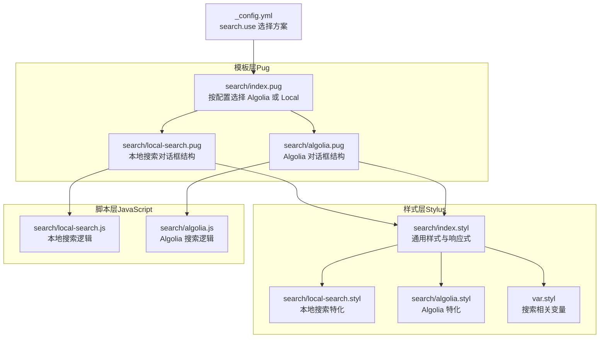
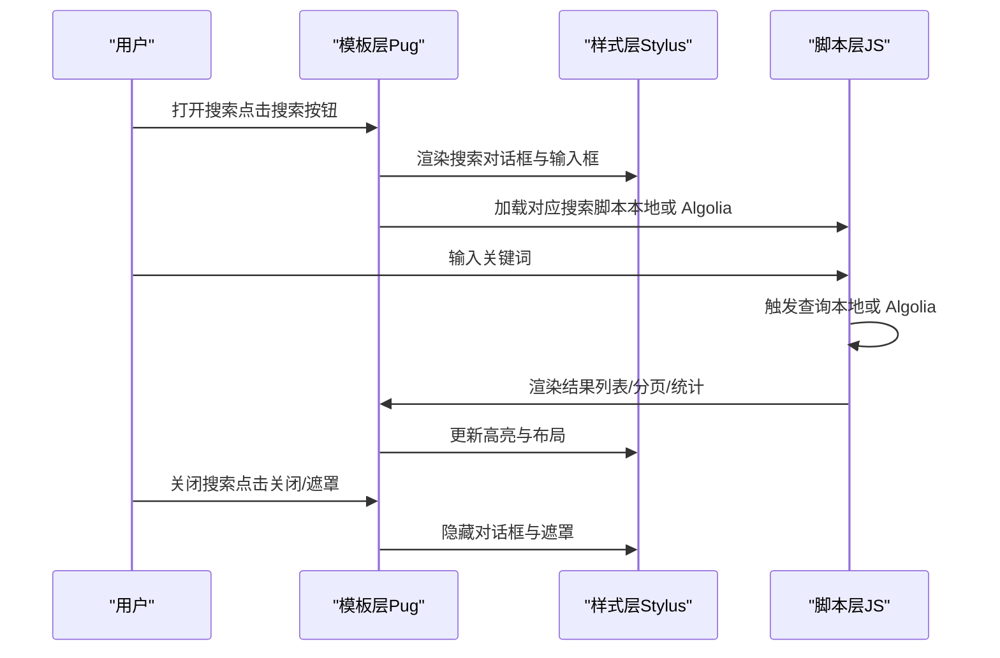
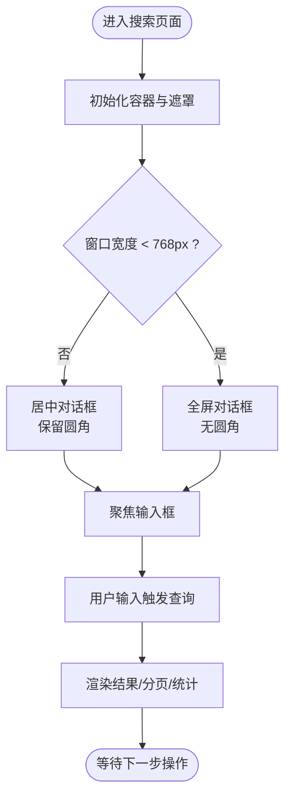
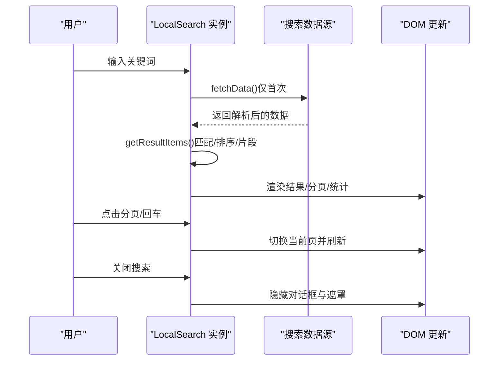
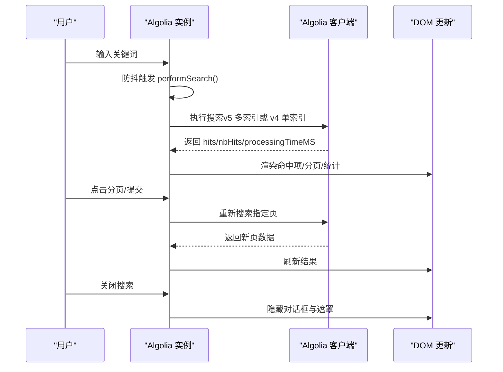
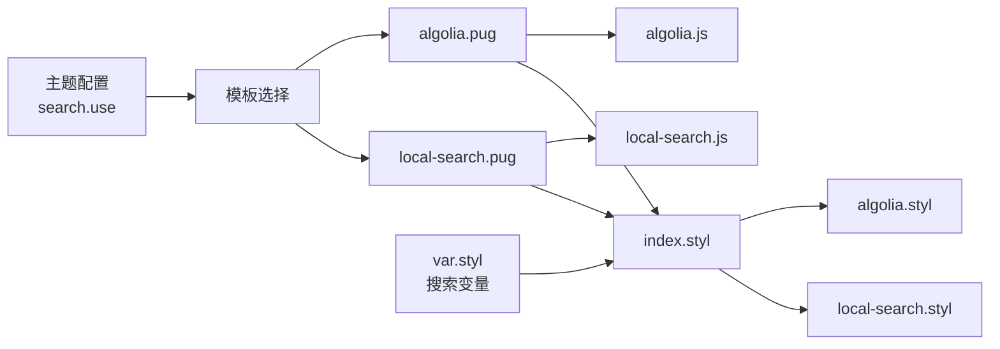

# 搜索样式

<cite>
**本文引用的文件**
- [themes/butterfly/source/css/_search/index.styl](file://themes/butterfly/source/css/_search/index.styl)
- [themes/butterfly/source/css/_search/local-search.styl](file://themes/butterfly/source/css/_search/local-search.styl)
- [themes/butterfly/source/css/_search/algolia.styl](file://themes/butterfly/source/css/_search/algolia.styl)
- [themes/butterfly/source/js/search/local-search.js](file://themes/butterfly/source/js/search/local-search.js)
- [themes/butterfly/source/js/search/algolia.js](file://themes/butterfly/source/js/search/algolia.js)
- [themes/butterfly/layout/includes/third-party/search/index.pug](file://themes/butterfly/layout/includes/third-party/search/index.pug)
- [themes/butterfly/layout/includes/third-party/search/local-search.pug](file://themes/butterfly/layout/includes/third-party/search/local-search.pug)
- [themes/butterfly/layout/includes/third-party/search/algolia.pug](file://themes/butterfly/layout/includes/third-party/search/algolia.pug)
- [themes/butterfly/languages/default.yml](file://themes/butterfly/languages/default.yml)
- [themes/butterfly/source/css/var.styl](file://themes/butterfly/source/css/var.styl)
- [themes/butterfly/_config.yml](file://themes/butterfly/_config.yml)
</cite>

## 目录
1. [简介](#简介)
2. [项目结构](#项目结构)
3. [核心组件](#核心组件)
4. [架构总览](#架构总览)
5. [详细组件分析](#详细组件分析)
6. [依赖关系分析](#依赖关系分析)
7. [性能考量](#性能考量)
8. [故障排查指南](#故障排查指南)
9. [结论](#结论)
10. [附录](#附录)

## 简介
本文件聚焦于 Hexo 主题 Butterfly 中“搜索样式”的实现与使用，覆盖本地搜索与 Algolia 搜索两种方案的界面设计与交互细节。内容包括：
- 搜索框、搜索结果列表、搜索指示器的样式结构与响应式布局
- 在不同屏幕尺寸下的布局调整与交互优化
- 样式定制指南（颜色主题、字体、动画）
- 用户体验设计（加载状态、错误提示、空结果处理）
- 性能优化与 SEO 友好性建议

## 项目结构
搜索样式由“模板层（Pug）+ 样式层（Stylus）+ 脚本层（JavaScript）”三部分协同完成，并通过主题配置进行方案选择。

**图表来源**
- [themes/butterfly/layout/includes/third-party/search/index.pug:1-7](file://themes/butterfly/layout/includes/third-party/search/index.pug#L1-L7)
- [themes/butterfly/layout/includes/third-party/search/local-search.pug:1-24](file://themes/butterfly/layout/includes/third-party/search/local-search.pug#L1-L24)
- [themes/butterfly/layout/includes/third-party/search/algolia.pug:1-34](file://themes/butterfly/layout/includes/third-party/search/algolia.pug#L1-L34)
- [themes/butterfly/source/css/_search/index.styl:1-240](file://themes/butterfly/source/css/_search/index.styl#L1-L240)
- [themes/butterfly/source/css/_search/local-search.styl:1-18](file://themes/butterfly/source/css/_search/local-search.styl#L1-L18)
- [themes/butterfly/source/css/_search/algolia.styl:1-13](file://themes/butterfly/source/css/_search/algolia.styl#L1-L13)
- [themes/butterfly/source/css/var.styl:80-86](file://themes/butterfly/source/css/var.styl#L80-L86)
- [themes/butterfly/_config.yml:472-508](file://themes/butterfly/_config.yml#L472-L508)

**章节来源**
- [themes/butterfly/layout/includes/third-party/search/index.pug:1-7](file://themes/butterfly/layout/includes/third-party/search/index.pug#L1-L7)
- [themes/butterfly/layout/includes/third-party/search/local-search.pug:1-24](file://themes/butterfly/layout/includes/third-party/search/local-search.pug#L1-L24)
- [themes/butterfly/layout/includes/third-party/search/algolia.pug:1-34](file://themes/butterfly/layout/includes/third-party/search/algolia.pug#L1-L34)
- [themes/butterfly/source/css/_search/index.styl:1-240](file://themes/butterfly/source/css/_search/index.styl#L1-L240)
- [themes/butterfly/source/css/_search/local-search.styl:1-18](file://themes/butterfly/source/css/_search/local-search.styl#L1-L18)
- [themes/butterfly/source/css/_search/algolia.styl:1-13](file://themes/butterfly/source/css/_search/algolia.styl#L1-L13)
- [themes/butterfly/source/css/var.styl:80-86](file://themes/butterfly/source/css/var.styl#L80-L86)
- [themes/butterfly/_config.yml:472-508](file://themes/butterfly/_config.yml#L472-L508)

## 核心组件
- 搜索对话框容器：固定定位、居中显示，移动端铺满全屏；支持打开/关闭动画与遮罩层。
- 搜索输入框：圆角边框、占位符颜色、主题色边框；Algolia 使用 Algolia 提供的 SearchBox 组件类名。
- 结果列表：本地搜索与 Algolia 分别使用不同的容器与分页组件；支持高亮关键词标记。
- 指示器与统计：加载旋转图标、搜索统计文案（命中数、耗时等）、空结果提示。
- 响应式适配：768px 断点下切换为全屏对话框、调整列表高度与分页布局。

**章节来源**
- [themes/butterfly/source/css/_search/index.styl:1-240](file://themes/butterfly/source/css/_search/index.styl#L1-L240)
- [themes/butterfly/source/css/_search/local-search.styl:1-18](file://themes/butterfly/source/css/_search/local-search.styl#L1-L18)
- [themes/butterfly/source/css/_search/algolia.styl:1-13](file://themes/butterfly/source/css/_search/algolia.styl#L1-L13)
- [themes/butterfly/layout/includes/third-party/search/local-search.pug:1-24](file://themes/butterfly/layout/includes/third-party/search/local-search.pug#L1-L24)
- [themes/butterfly/layout/includes/third-party/search/algolia.pug:1-34](file://themes/butterfly/layout/includes/third-party/search/algolia.pug#L1-L34)

## 架构总览
搜索样式在运行时根据主题配置选择具体方案，模板层渲染对应对话框结构，样式层定义视觉与交互，脚本层负责数据加载、查询与渲染。

**图表来源**
- [themes/butterfly/layout/includes/third-party/search/index.pug:1-7](file://themes/butterfly/layout/includes/third-party/search/index.pug#L1-L7)
- [themes/butterfly/layout/includes/third-party/search/local-search.pug:1-24](file://themes/butterfly/layout/includes/third-party/search/local-search.pug#L1-L24)
- [themes/butterfly/layout/includes/third-party/search/algolia.pug:1-34](file://themes/butterfly/layout/includes/third-party/search/algolia.pug#L1-L34)
- [themes/butterfly/source/js/search/local-search.js:237-568](file://themes/butterfly/source/js/search/local-search.js#L237-L568)
- [themes/butterfly/source/js/search/algolia.js:1-563](file://themes/butterfly/source/js/search/algolia.js#L1-L563)

## 详细组件分析

### 通用样式与响应式（index.styl）
- 容器与遮罩：固定定位、居中布局；移动端断点切换为全屏与无圆角。
- 导航栏：标题、加载指示器、关闭按钮；指示器默认隐藏，查询时显示。
- 输入框：统一圆角、主题色边框、占位符颜色；Algolia 使用特定类名。
- 结果列表：滚动条覆盖、最大高度限制；项内高亮关键词标记。
- 分页组件：居中布局、圆角按钮、禁用态与选中态；移动端间距微调。
- 统计与高亮：统计文案居中；关键词高亮使用专用类名。

**图表来源**
- [themes/butterfly/source/css/_search/index.styl:1-240](file://themes/butterfly/source/css/_search/index.styl#L1-L240)
- [themes/butterfly/source/js/search/local-search.js:482-520](file://themes/butterfly/source/js/search/local-search.js#L482-L520)
- [themes/butterfly/source/js/search/algolia.js:20-46](file://themes/butterfly/source/js/search/algolia.js#L20-L46)

**章节来源**
- [themes/butterfly/source/css/_search/index.styl:1-240](file://themes/butterfly/source/css/_search/index.styl#L1-L240)

### 本地搜索样式（local-search.styl）
- 列表高度自适应：根据是否启用分页动态计算最小/最大高度，保证在小屏下不溢出。
- 统计文案对齐：左侧对齐以适配本地搜索统计信息。
- 关键词高亮：加粗强调。
- 数据加载提示：加载数据库时隐藏后续内容，避免闪烁。

**章节来源**
- [themes/butterfly/source/css/_search/local-search.styl:1-18](file://themes/butterfly/source/css/_search/local-search.styl#L1-L18)

### Algolia 搜索样式（algolia.styl）
- 列表高度自适应：在小屏下预留“Powered by Algolia”区域高度。
- 平台标识：右浮动的“powered by”徽标，控制尺寸与间距。

**章节来源**
- [themes/butterfly/source/css/_search/algolia.styl:1-13](file://themes/butterfly/source/css/_search/algolia.styl#L1-L13)

### 本地搜索脚本（local-search.js）
- 数据加载：按路径拉取 XML/JSON 源，预处理标题/内容/链接，移除空白与 HTML 标签，过滤空标题。
- 查询算法：按关键词匹配标题与内容，合并重叠片段，按关键词数量与命中数排序，支持每文章最多 N 片段。
- 高亮策略：生成带标记的片段，支持 URL 参数高亮。
- 分页与渲染：可选分页模式，移动端响应式分页按钮，统计文案替换。
- 交互行为：打开/关闭动画、遮罩点击关闭、Esc 键关闭、Safari 高度修正、Pjax 刷新后重新绑定事件。

**图表来源**
- [themes/butterfly/source/js/search/local-search.js:173-235](file://themes/butterfly/source/js/search/local-search.js#L173-L235)
- [themes/butterfly/source/js/search/local-search.js:442-479](file://themes/butterfly/source/js/search/local-search.js#L442-L479)
- [themes/butterfly/source/js/search/local-search.js:521-568](file://themes/butterfly/source/js/search/local-search.js#L521-L568)

**章节来源**
- [themes/butterfly/source/js/search/local-search.js:1-568](file://themes/butterfly/source/js/search/local-search.js#L1-L568)

### Algolia 搜索脚本（algolia.js）
- 客户端初始化：优先使用 liteClient，其次使用 algoliasearch，否则报错。
- 查询流程：防抖输入、多索引搜索（v5）或单索引搜索（v4），高亮标签包裹，内容截取与标签平衡。
- 渲染逻辑：命中项标题/内容渲染、空结果提示、统计文案、分页渲染、Pjax 刷新。
- 交互行为：打开/关闭动画、遮罩点击关闭、Esc 键关闭、Safari 高度修正、移动端分页响应式。

**图表来源**
- [themes/butterfly/source/js/search/algolia.js:442-508](file://themes/butterfly/source/js/search/algolia.js#L442-L508)
- [themes/butterfly/source/js/search/algolia.js:517-556](file://themes/butterfly/source/js/search/algolia.js#L517-L556)

**章节来源**
- [themes/butterfly/source/js/search/algolia.js:1-563](file://themes/butterfly/source/js/search/algolia.js#L1-L563)

### 模板与语言配置
- 方案选择：根据配置选择 Algolia 或本地搜索模板。
- 本地搜索模板：包含加载提示、输入框、结果区、分页、统计区与遮罩。
- Algolia 模板：包含 SearchBox、命中列表、分页、统计与“powered by”徽标。
- 语言资源：搜索标题、占位符、加载提示、命中统计文案、空结果提示。

**章节来源**
- [themes/butterfly/layout/includes/third-party/search/index.pug:1-7](file://themes/butterfly/layout/includes/third-party/search/index.pug#L1-L7)
- [themes/butterfly/layout/includes/third-party/search/local-search.pug:1-24](file://themes/butterfly/layout/includes/third-party/search/local-search.pug#L1-L24)
- [themes/butterfly/layout/includes/third-party/search/algolia.pug:1-34](file://themes/butterfly/layout/includes/third-party/search/algolia.pug#L1-L34)
- [themes/butterfly/languages/default.yml:37-47](file://themes/butterfly/languages/default.yml#L37-L47)

## 依赖关系分析
- 配置驱动：主题配置决定加载哪套模板与脚本。
- 样式依赖：通用样式为本地与 Algolia 共享，各自特化样式在小屏下进一步细化。
- 脚本耦合：本地搜索与 Algolia 的 DOM 结构与类名需与模板一致，否则无法正确渲染。
- 动画与交互：遮罩与对话框动画依赖工具函数，Safari 高度修正依赖窗口尺寸监听。

**图表来源**
- [themes/butterfly/_config.yml:472-508](file://themes/butterfly/_config.yml#L472-L508)
- [themes/butterfly/layout/includes/third-party/search/index.pug:1-7](file://themes/butterfly/layout/includes/third-party/search/index.pug#L1-L7)
- [themes/butterfly/layout/includes/third-party/search/local-search.pug:1-24](file://themes/butterfly/layout/includes/third-party/search/local-search.pug#L1-L24)
- [themes/butterfly/layout/includes/third-party/search/algolia.pug:1-34](file://themes/butterfly/layout/includes/third-party/search/algolia.pug#L1-L34)
- [themes/butterfly/source/css/_search/index.styl:1-240](file://themes/butterfly/source/css/_search/index.styl#L1-L240)
- [themes/butterfly/source/css/_search/local-search.styl:1-18](file://themes/butterfly/source/css/_search/local-search.styl#L1-L18)
- [themes/butterfly/source/css/_search/algolia.styl:1-13](file://themes/butterfly/source/css/_search/algolia.styl#L1-L13)
- [themes/butterfly/source/css/var.styl:80-86](file://themes/butterfly/source/css/var.styl#L80-L86)
- [themes/butterfly/source/js/search/local-search.js:237-568](file://themes/butterfly/source/js/search/local-search.js#L237-L568)
- [themes/butterfly/source/js/search/algolia.js:1-563](file://themes/butterfly/source/js/search/algolia.js#L1-L563)

**章节来源**
- [themes/butterfly/_config.yml:472-508](file://themes/butterfly/_config.yml#L472-L508)
- [themes/butterfly/source/css/var.styl:80-86](file://themes/butterfly/source/css/var.styl#L80-L86)

## 性能考量
- 本地搜索
  - 预加载：可通过配置开启预加载，减少首次查询延迟。
  - 分页：在结果较多时启用分页，降低一次性渲染压力。
  - 高亮：仅对命中片段进行标记，避免全量 DOM 操作。
- Algolia
  - 防抖：输入防抖减少请求频率。
  - 内容截取：对命中内容进行安全截取与标签平衡，避免渲染异常。
  - 缓存：客户端实例复用，避免重复初始化。
- 通用
  - 小屏自适应：在窄屏下动态计算高度，避免滚动条占用过多空间。
  - 动画与事件：关闭时移除事件监听，防止内存泄漏。

[本节为通用性能建议，无需特定文件引用]

## 故障排查指南
- 配置无效
  - 确认配置项存在且值正确，Algolia 缺少 appId/apiKey/indexName 会直接报错。
- 本地搜索无结果
  - 检查数据源路径与格式（XML/JSON），确认标题非空且已预处理。
  - 若启用分页，检查分页参数与命中数。
- Algolia 未显示结果
  - 检查客户端版本（liteClient 或 algoliasearch），确保可用。
  - 确认 SearchBox 类名与模板一致，避免样式覆盖导致不可见。
- 移动端显示异常
  - Safari 高度问题：脚本会在 resize 时修正对话框高度。
  - 分页按钮过密：移动端自动减少可见页码数量。
- 加载状态与遮罩
  - 加载指示器默认隐藏，查询时显示；关闭时确保移除事件监听。

**章节来源**
- [themes/butterfly/_config.yml:472-508](file://themes/butterfly/_config.yml#L472-L508)
- [themes/butterfly/source/js/search/local-search.js:173-197](file://themes/butterfly/source/js/search/local-search.js#L173-L197)
- [themes/butterfly/source/js/search/algolia.js:218-231](file://themes/butterfly/source/js/search/algolia.js#L218-L231)
- [themes/butterfly/source/js/search/algolia.js:510-515](file://themes/butterfly/source/js/search/algolia.js#L510-L515)

## 结论
本主题的搜索样式通过“模板 + 样式 + 脚本”的清晰分层实现，既支持本地全文检索，也支持 Algolia 云检索。通用样式与响应式规则保证了跨设备的一致体验，而本地与 Algolia 的特化样式则针对各自场景做了针对性优化。结合配置与语言资源，用户可以灵活切换方案并定制外观与交互。

## 附录

### 样式定制指南
- 颜色主题
  - 通过变量文件统一管理搜索背景、输入色、高亮色、链接色等。
  - 修改主题色与分页色可影响整体视觉一致性。
- 字体设置
  - 通过全局字体变量统一输入与结果文本的字体族。
- 动画效果
  - 对话框与遮罩使用预设动画类，可按需调整时长与缓动。
- 高亮与统计
  - 关键词高亮类名固定，保持与脚本输出一致。
  - 统计文案来自语言文件，可按需扩展多语言。

**章节来源**
- [themes/butterfly/source/css/var.styl:80-86](file://themes/butterfly/source/css/var.styl#L80-L86)
- [themes/butterfly/languages/default.yml:37-47](file://themes/butterfly/languages/default.yml#L37-L47)

### 用户体验设计要点
- 加载状态：查询开始显示旋转指示器，结束隐藏。
- 错误提示：配置缺失或网络异常时，脚本会输出错误日志并清空结果。
- 空结果处理：本地与 Algolia 均提供空结果文案，引导用户调整关键词。
- 无障碍：输入框设置自动拼写关闭、最大长度限制，提升可访问性。

**章节来源**
- [themes/butterfly/layout/includes/third-party/search/local-search.pug:9-11](file://themes/butterfly/layout/includes/third-party/search/local-search.pug#L9-L11)
- [themes/butterfly/layout/includes/third-party/search/algolia.pug:11-15](file://themes/butterfly/layout/includes/third-party/search/algolia.pug#L11-L15)
- [themes/butterfly/source/js/search/algolia.js:500-507](file://themes/butterfly/source/js/search/algolia.js#L500-L507)