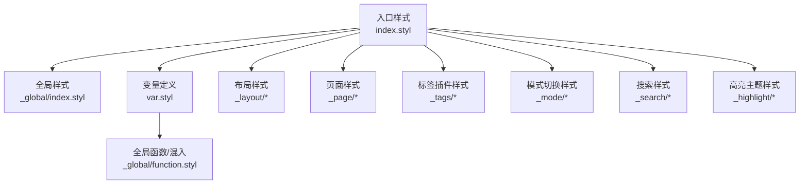
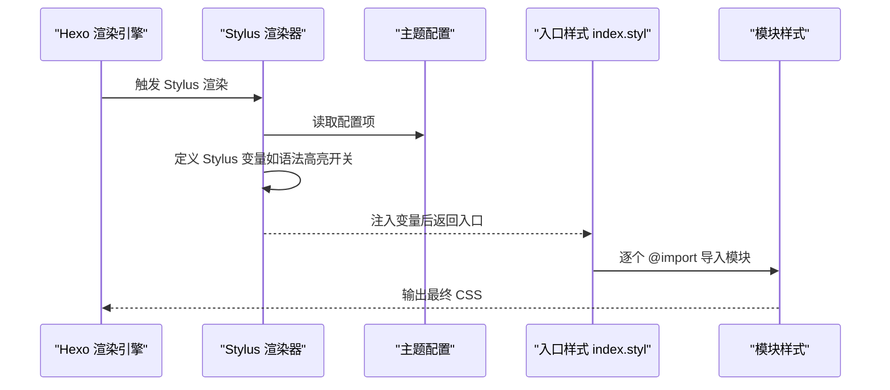
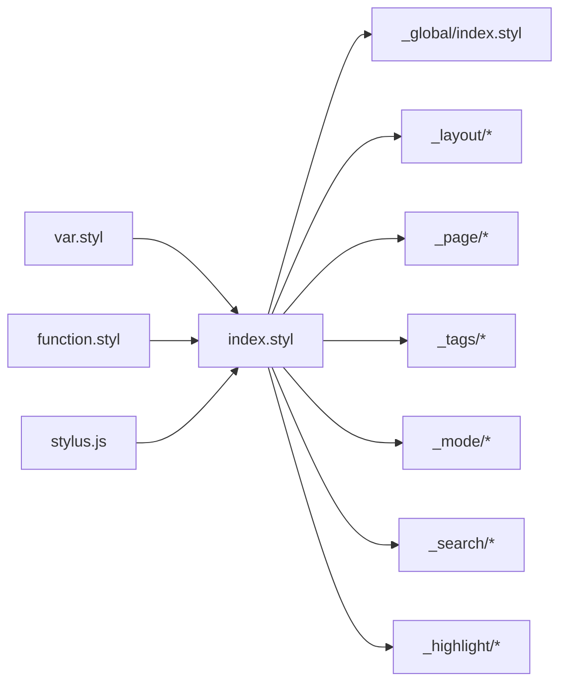

# 样式系统

<cite>
**本文引用的文件**
- [var.styl](file://themes/butterfly/source/css/var.styl)
- [index.styl](file://themes/butterfly/source/css/index.styl)
- [function.styl](file://themes/butterfly/source/css/_global/function.styl)
- [index.styl（全局）](file://themes/butterfly/source/css/_global/index.styl)
- [aside.styl](file://themes/butterfly/source/css/_layout/aside.styl)
- [post.styl](file://themes/butterfly/source/css/_layout/post.styl)
- [homepage.styl](file://themes/butterfly/source/css/_page/homepage.styl)
- [note.styl](file://themes/butterfly/source/css/_tags/note.styl)
- [theme.styl（高亮主题）](file://themes/butterfly/source/css/_highlight/theme.styl)
- [darkmode.styl](file://themes/butterfly/source/css/_mode/darkmode.styl)
- [stylus.js](file://themes/butterfly/scripts/events/stylus.js)
- [_config.yml](file://themes/butterfly/_config.yml)
- [package.json](file://themes/butterfly/package.json)
</cite>

## 目录
1. [简介](#简介)
2. [项目结构](#项目结构)
3. [核心组件](#核心组件)
4. [架构总览](#架构总览)
5. [详细组件分析](#详细组件分析)
6. [依赖关系分析](#依赖关系分析)
7. [性能与兼容性](#性能与兼容性)
8. [故障排查](#故障排查)
9. [结论](#结论)
10. [附录：定制化开发指南](#附录定制化开发指南)

## 简介
本文件系统性梳理 Butterfly 主题的样式系统，围绕 Stylus 预处理器的变量体系、混合器与嵌套规则展开；详解 CSS 模块化组织（全局、布局、页面、标签插件、模式切换），并给出响应式断点与移动端适配策略；提供主题色与暗黑模式的定制指南；说明样式编译流程、性能优化与浏览器兼容处理，并附带可直接定位到源码的路径示例。

## 项目结构
Butterfly 的样式采用“入口聚合 + 分层模块”的组织方式：
- 入口聚合：通过入口样式文件统一导入各模块，形成构建链路
- 分层模块：按作用域划分为全局、布局、页面、标签插件、高亮主题、模式切换等目录
- 变量与工具：集中于变量文件与全局函数/混入文件，供各模块复用

图表来源
- [index.styl:1-15](file://themes/butterfly/source/css/index.styl#L1-L15)
- [var.styl:1-233](file://themes/butterfly/source/css/var.styl#L1-L233)
- [function.styl:1-348](file://themes/butterfly/source/css/_global/function.styl#L1-L348)

章节来源
- [index.styl:1-15](file://themes/butterfly/source/css/index.styl#L1-L15)
- [var.styl:1-233](file://themes/butterfly/source/css/var.styl#L1-L233)

## 核心组件
- 变量系统：集中于变量文件，支持主题色、字体、间距、颜色、UI 组件默认值等，且与配置项联动
- 全局样式：负责基础排版、滚动条、选择文本、表格、链接、标题前缀图标等
- 响应式与混入：提供媒体查询混入与通用 UI 动效、悬停效果、圆角控制等
- 布局与页面：侧栏、TOC、文章内容、首页卡片布局等
- 模式切换：明暗两套变量映射，配合数据属性与 CSS 自定义属性实现动态切换
- 高亮主题：根据配置选择不同高亮主题，生成对应颜色变量
- 标签插件：Note、Tabs、Gallery、Button 等扩展样式的统一样式规范

章节来源
- [var.styl:1-233](file://themes/butterfly/source/css/var.styl#L1-L233)
- [index.styl（全局）:1-287](file://themes/butterfly/source/css/_global/index.styl#L1-L287)
- [function.styl:1-348](file://themes/butterfly/source/css/_global/function.styl#L1-L348)
- [aside.styl:1-435](file://themes/butterfly/source/css/_layout/aside.styl#L1-L435)
- [post.styl:1-265](file://themes/butterfly/source/css/_layout/post.styl#L1-L265)
- [homepage.styl:1-175](file://themes/butterfly/source/css/_page/homepage.styl#L1-L175)
- [darkmode.styl:1-205](file://themes/butterfly/source/css/_mode/darkmode.styl#L1-L205)
- [theme.styl（高亮主题）:1-122](file://themes/butterfly/source/css/_highlight/theme.styl#L1-L122)
- [note.styl:1-126](file://themes/butterfly/source/css/_tags/note.styl#L1-L126)

## 架构总览
样式编译链路由 Hexo 渲染器驱动，Stylus 渲染器在渲染前注入运行时配置为 Stylus 变量，随后按入口样式文件顺序导入模块，最终输出 CSS。

图表来源
- [stylus.js:1-25](file://themes/butterfly/scripts/events/stylus.js#L1-L25)
- [index.styl:1-15](file://themes/butterfly/source/css/index.styl#L1-L15)

章节来源
- [stylus.js:1-25](file://themes/butterfly/scripts/events/stylus.js#L1-L25)
- [package.json:25-30](file://themes/butterfly/package.json#L25-L30)

## 详细组件分析

### 变量系统与主题色定制
- 主题色与多处颜色变量：通过配置项启用/覆盖主色、分页器、按钮悬停、选中背景、链接色、HR、代码前景/背景、TOC 等
- 字体与字号：支持全局字体、代码字体、站点标题字体，提供默认值与配置覆盖
- 页面与 UI 默认值：卡片背景、边距、阴影、滚动条、表格、评论开关、公告、相册、搜索、预加载等
- Note 标签插件：内置多类型（default/primary/info/success/warning/danger）及现代风格、扁平风格、图标等

建议定制路径
- 修改主题色与相关变量：[var.styl:1-233](file://themes/butterfly/source/css/var.styl#L1-L233)
- 启用/配置主题色覆盖：[_config.yml 主题色段落:759-779](file://themes/butterfly/_config.yml#L759-L779)

章节来源
- [var.styl:1-233](file://themes/butterfly/source/css/var.styl#L1-L233)
- [_config.yml:759-779](file://themes/butterfly/_config.yml#L759-L779)

### 全局样式与基础排版
- CSS 自定义属性桥接：将 Stylus 变量映射为 :root 变量，便于暗黑模式与 JS 动态切换
- 基础排版：body 背景/文字色/字号/字体/行高、滚动行为、选择文本颜色、占位符颜色
- 滚动条：Firefox 与 WebKit 双通道适配
- 表格：边框、圆角、表头背景、单元格内边距
- 链接与标题：悬停色、标题前缀图标与动画
- 图片懒加载与模糊过渡：根据配置启用

建议参考路径
- CSS 变量桥接与基础排版：[index.styl（全局）:1-287](file://themes/butterfly/source/css/_global/index.styl#L1-L287)
- 滚动条与图片懒加载：同上文件

章节来源
- [index.styl（全局）:1-287](file://themes/butterfly/source/css/_global/index.styl#L1-L287)

### 响应式与媒体查询混入
- 媒体查询混入：maxWidth600/768/900/1024/minWidth768/900/901/1024/2000 等
- 使用场景：侧栏位置、卡片宽度、封面高度、TOC 固定/弹窗、移动端隐藏卡片等
- 动画与交互：进入动画、按钮悬停涟漪、滚动百分比显示等

建议参考路径
- 媒体查询与动画混入：[function.styl:111-146](file://themes/butterfly/source/css/_global/function.styl#L111-L146)
- 动画与按钮效果：同上文件

章节来源
- [function.styl:111-146](file://themes/butterfly/source/css/_global/function.styl#L111-L146)

### 布局与页面样式
- 侧栏与菜单：抽屉式侧栏、菜单组折叠、子菜单展开、圆角与阴影
- 文章内容：标题前缀图标、列表标记色、HR、图片圆角与悬停缩放、锚点点击滚动
- 首页布局：多种卡片布局（左图右文、上下结构、瀑布流等）、封面遮罩与标题居中、元信息与摘要截断

建议参考路径
- 侧栏与菜单：[sidebar.styl:1-97](file://themes/butterfly/source/css/_layout/sidebar.styl#L1-L97)
- 侧栏卡片与 TOC：[aside.styl:1-435](file://themes/butterfly/source/css/_layout/aside.styl#L1-L435)
- 文章内容排版：[post.styl:1-265](file://themes/butterfly/source/css/_layout/post.styl#L1-L265)
- 首页卡片布局：[homepage.styl:1-175](file://themes/butterfly/source/css/_page/homepage.styl#L1-L175)

章节来源
- [sidebar.styl:1-97](file://themes/butterfly/source/css/_layout/sidebar.styl#L1-L97)
- [aside.styl:1-435](file://themes/butterfly/source/css/_layout/aside.styl#L1-L435)
- [post.styl:1-265](file://themes/butterfly/source/css/_layout/post.styl#L1-L265)
- [homepage.styl:1-175](file://themes/butterfly/source/css/_page/homepage.styl#L1-L175)

### 模式切换（明暗模式）
- 切换触发：当启用暗黑模式或显式设置为 dark 时，根元素添加 data-theme="dark"
- 明暗映射：将大量 :root 变量映射为暗色版本，含卡片、表格、搜索、按钮、滚动条、Note 等
- 外观增强：针对代码块、评论区、第三方组件进行亮度/对比度调整
- 适配范围：页面背景、侧栏、卡片、按钮、链接、表格、注记、评论组件等

建议参考路径
- 暗黑模式映射与增强：[darkmode.styl:1-205](file://themes/butterfly/source/css/_mode/darkmode.styl#L1-L205)

章节来源
- [darkmode.styl:1-205](file://themes/butterfly/source/css/_mode/darkmode.styl#L1-L205)

### 高亮主题与代码块
- 主题选择：darker/pale night/light/ocean/false
- 颜色变量：背景、选择色、前景、边框、工具栏、滚动条、注释、关键字等
- 与 Stylus 渲染器联动：通过渲染器注入的高亮开关与行号开关变量控制样式

建议参考路径
- 高亮主题变量映射：[theme.styl（高亮主题）:1-122](file://themes/butterfly/source/css/_highlight/theme.styl#L1-L122)
- 渲染器注入变量：[stylus.js:1-25](file://themes/butterfly/scripts/events/stylus.js#L1-L25)

章节来源
- [theme.styl（高亮主题）:1-122](file://themes/butterfly/source/css/_highlight/theme.styl#L1-L122)
- [stylus.js:1-25](file://themes/butterfly/scripts/events/stylus.js#L1-L25)

### 标签插件样式（Note/Tabs/Gallery/Button 等）
- Note：支持 simple/modern/flat 三种风格，多类型映射，图标与圆角可配置
- Tabs：按钮状态、激活态、圆角与悬停
- Gallery/Button：颜色体系与交互
- 与 CSS 变量联动：通过 :root 变量实现主题色一致性

建议参考路径
- Note 插件样式：[note.styl:1-126](file://themes/butterfly/source/css/_tags/note.styl#L1-L126)

章节来源
- [note.styl:1-126](file://themes/butterfly/source/css/_tags/note.styl#L1-L126)

## 依赖关系分析
- 入口聚合：入口样式统一导入全局、页面、布局、标签、模式、搜索与高亮模块
- 变量与函数：全局函数/混入被广泛复用，变量文件为所有模块提供统一色板与尺寸
- 渲染器：Stylus 渲染器在渲染前注入配置为变量，影响高亮主题与语言等

图表来源
- [index.styl:1-15](file://themes/butterfly/source/css/index.styl#L1-L15)
- [var.styl:1-233](file://themes/butterfly/source/css/var.styl#L1-L233)
- [function.styl:1-348](file://themes/butterfly/source/css/_global/function.styl#L1-L348)
- [stylus.js:1-25](file://themes/butterfly/scripts/events/stylus.js#L1-L25)

章节来源
- [index.styl:1-15](file://themes/butterfly/source/css/index.styl#L1-L15)
- [stylus.js:1-25](file://themes/butterfly/scripts/events/stylus.js#L1-L25)

## 性能与兼容性
- 性能优化
  - 按需导入：入口仅导入必要模块，避免冗余
  - 圆角与阴影：通过混入统一控制，减少重复声明
  - 懒加载与模糊过渡：图片懒加载与模糊过渡降低首屏抖动
  - 动画：使用 transform/opacity 等 GPU 友好属性
- 浏览器兼容
  - WebKit/Firefox 滚动条差异化适配
  - CSS Grid/Flex 混合布局在现代浏览器良好支持
  - 关键动画使用 CSS 原生动画，避免 JS 卡顿

章节来源
- [index.styl（全局）:117-133](file://themes/butterfly/source/css/_global/index.styl#L117-L133)
- [function.styl:148-173](file://themes/butterfly/source/css/_global/function.styl#L148-L173)

## 故障排查
- 暗黑模式不生效
  - 检查是否启用暗黑模式或显式设置为 dark
  - 确认根元素是否具备 data-theme="dark"
  - 参考：[darkmode.styl:1-205](file://themes/butterfly/source/css/_mode/darkmode.styl#L1-L205)
- 高亮主题未生效
  - 检查渲染器注入的高亮开关变量
  - 确认配置项中的主题选择
  - 参考：[stylus.js:1-25](file://themes/butterfly/scripts/events/stylus.js#L1-L25)、[theme.styl（高亮主题）:1-122](file://themes/butterfly/source/css/_highlight/theme.styl#L1-L122)
- 响应式异常
  - 检查媒体查询混入使用是否正确
  - 参考：[function.styl:111-146](file://themes/butterfly/source/css/_global/function.styl#L111-L146)
- 样式未更新
  - 确认入口样式导入顺序与模块存在
  - 参考：[index.styl:1-15](file://themes/butterfly/source/css/index.styl#L1-L15)

章节来源
- [darkmode.styl:1-205](file://themes/butterfly/source/css/_mode/darkmode.styl#L1-L205)
- [stylus.js:1-25](file://themes/butterfly/scripts/events/stylus.js#L1-L25)
- [theme.styl（高亮主题）:1-122](file://themes/butterfly/source/css/_highlight/theme.styl#L1-L122)
- [function.styl:111-146](file://themes/butterfly/source/css/_global/function.styl#L111-L146)
- [index.styl:1-15](file://themes/butterfly/source/css/index.styl#L1-L15)

## 结论
Butterfly 的样式系统以 Stylus 为核心，通过变量、混入与模块化组织实现强一致的主题风格与良好的可维护性。借助 CSS 自定义属性与 data-theme 切换，明暗模式与主题色定制得以无缝衔接。响应式断点与动画混入确保了跨设备体验的一致性。遵循本文档的组织方式与最佳实践，可在不破坏整体风格的前提下进行深度定制。

## 附录：定制化开发指南
- 主题色定制
  - 在配置中启用主题色覆盖并设置主色、按钮悬停、链接色等
  - 参考：[_config.yml 主题色段落:759-779](file://themes/butterfly/_config.yml#L759-L779)
  - 变量映射：[var.styl:1-233](file://themes/butterfly/source/css/var.styl#L1-L233)
- 暗黑模式
  - 启用暗黑模式或设置为 dark，确认 data-theme="dark" 生效
  - 参考：[darkmode.styl:1-205](file://themes/butterfly/source/css/_mode/darkmode.styl#L1-L205)
- 响应式断点
  - 使用媒体查询混入控制布局与组件显示
  - 参考：[function.styl:111-146](file://themes/butterfly/source/css/_global/function.styl#L111-L146)
- 高亮主题
  - 在配置中选择主题，渲染器自动注入变量
  - 参考：[theme.styl（高亮主题）:1-122](file://themes/butterfly/source/css/_highlight/theme.styl#L1-L122)、[stylus.js:1-25](file://themes/butterfly/scripts/events/stylus.js#L1-L25)
- 样式编译与入口
  - 入口样式统一导入模块，确保变更及时生效
  - 参考：[index.styl:1-15](file://themes/butterfly/source/css/index.styl#L1-L15)