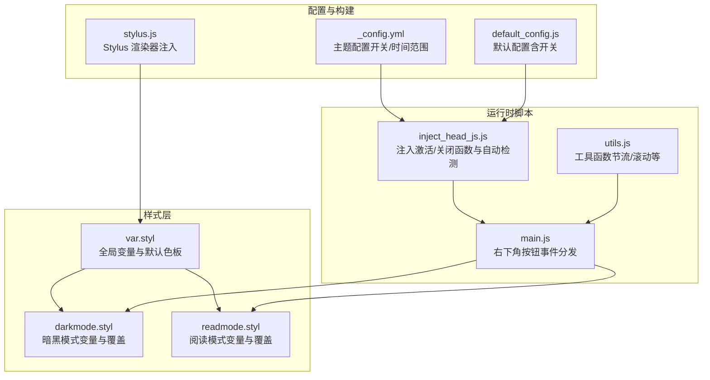
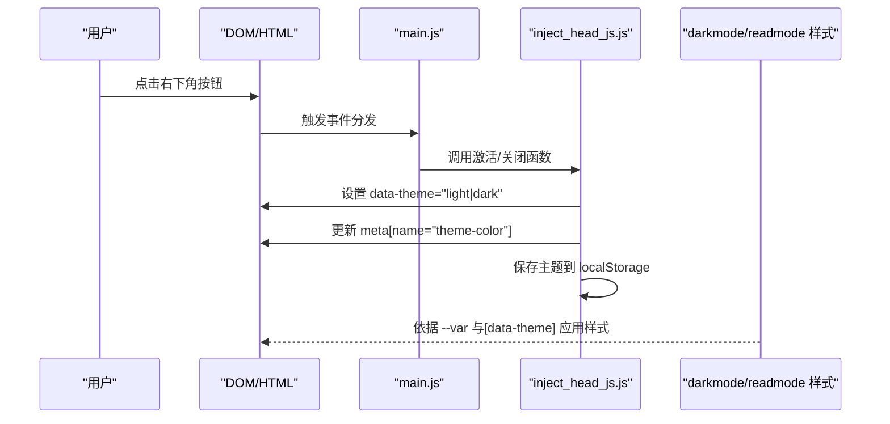
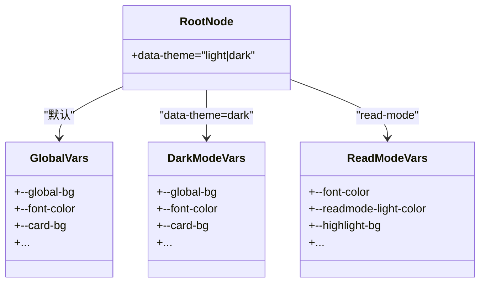
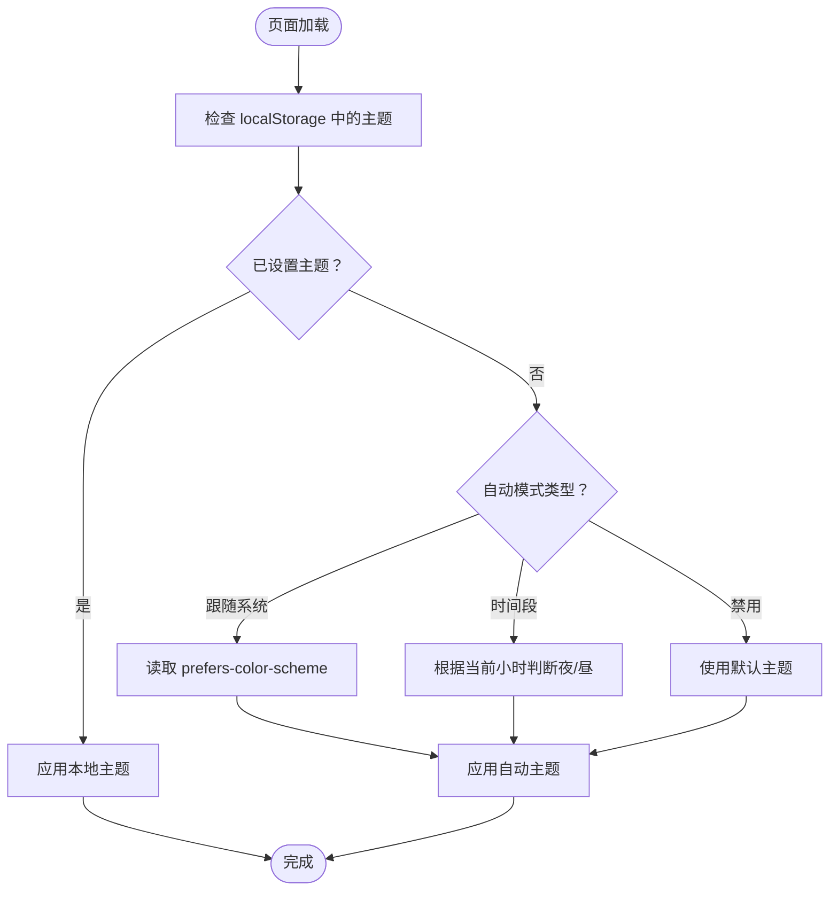
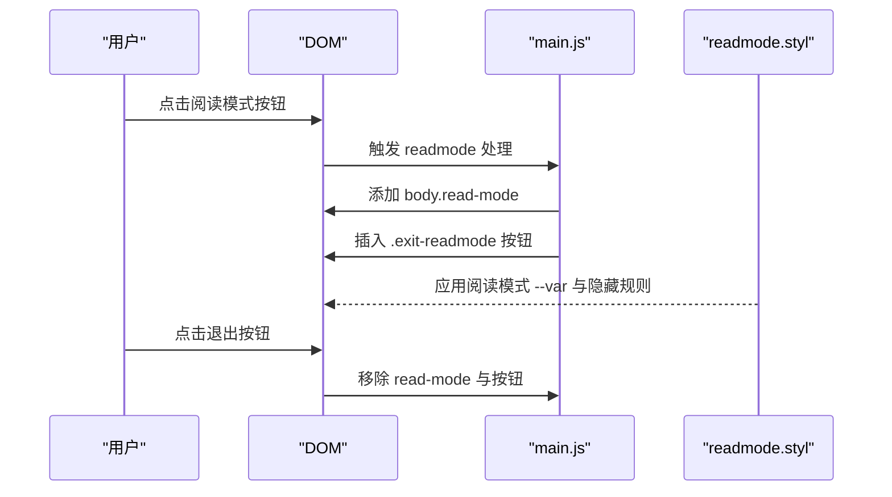
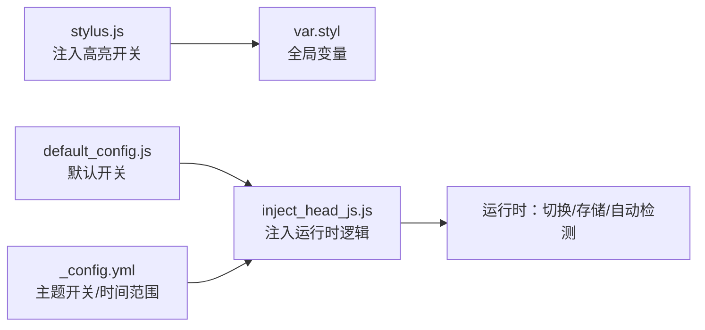
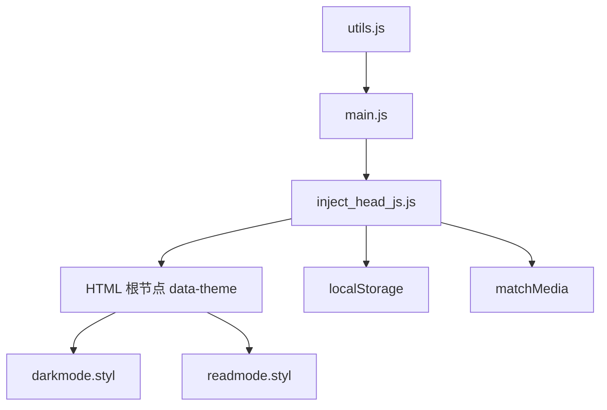

# 模式切换样式

<cite>
**本文引用的文件**
- [themes/butterfly/source/css/var.styl](file://themes/butterfly/source/css/var.styl)
- [themes/butterfly/source/css/_mode/darkmode.styl](file://themes/butterfly/source/css/_mode/darkmode.styl)
- [themes/butterfly/source/css/_mode/readmode.styl](file://themes/butterfly/source/css/_mode/readmode.styl)
- [themes/butterfly/scripts/helpers/inject_head_js.js](file://themes/butterfly/scripts/helpers/inject_head_js.js)
- [themes/butterfly/source/js/main.js](file://themes/butterfly/source/js/main.js)
- [themes/butterfly/source/js/utils.js](file://themes/butterfly/source/js/utils.js)
- [themes/butterfly/_config.yml](file://themes/butterfly/_config.yml)
- [themes/butterfly/scripts/events/stylus.js](file://themes/butterfly/scripts/events/stylus.js)
- [themes/butterfly/scripts/common/default_config.js](file://themes/butterfly/scripts/common/default_config.js)
</cite>

## 目录
1. [简介](#简介)
2. [项目结构](#项目结构)
3. [核心组件](#核心组件)
4. [架构总览](#架构总览)
5. [详细组件分析](#详细组件分析)
6. [依赖关系分析](#依赖关系分析)
7. [性能考量](#性能考量)
8. [故障排查指南](#故障排查指南)
9. [结论](#结论)
10. [附录：模式定制与无障碍建议](#附录模式定制与无障碍建议)

## 简介
本文件聚焦于 Butterfly 主题的“模式切换样式”实现，系统阐述暗黑模式与阅读模式的设计原理、CSS 自定义属性（CSS 变量）在动态主题切换中的作用、模式切换的触发方式、用户偏好的本地存储与自动模式检测机制，并提供完整的模式定制指南、性能优化技巧与无障碍支持建议。

## 项目结构
围绕模式切换的关键文件分布如下：
- 样式层
  - 全局变量与默认值：themes/butterfly/source/css/var.styl
  - 暗黑模式样式：themes/butterfly/source/css/_mode/darkmode.styl
  - 阅读模式样式：themes/butterfly/source/css/_mode/readmode.styl
- 运行时脚本
  - 注入主题切换逻辑：themes/butterfly/scripts/helpers/inject_head_js.js
  - 页面交互入口（右下角按钮等）：themes/butterfly/source/js/main.js
  - 工具函数（节流、防抖、滚动等）：themes/butterfly/source/js/utils.js
- 配置与构建
  - 主题配置：themes/butterfly/_config.yml
  - Stylus 渲染器注入语言与高亮开关：themes/butterfly/scripts/events/stylus.js
  - 默认配置（含暗黑/阅读模式开关）：themes/butterfly/scripts/common/default_config.js

图表来源
- [themes/butterfly/source/css/var.styl:1-233](file://themes/butterfly/source/css/var.styl#L1-L233)
- [themes/butterfly/source/css/_mode/darkmode.styl:1-205](file://themes/butterfly/source/css/_mode/darkmode.styl#L1-L205)
- [themes/butterfly/source/css/_mode/readmode.styl:1-187](file://themes/butterfly/source/css/_mode/readmode.styl#L1-L187)
- [themes/butterfly/scripts/helpers/inject_head_js.js:1-156](file://themes/butterfly/scripts/helpers/inject_head_js.js#L1-L156)
- [themes/butterfly/source/js/main.js:626-720](file://themes/butterfly/source/js/main.js#L626-L720)
- [themes/butterfly/source/js/utils.js:1-339](file://themes/butterfly/source/js/utils.js#L1-L339)
- [themes/butterfly/_config.yml:379-395](file://themes/butterfly/_config.yml#L379-L395)
- [themes/butterfly/scripts/events/stylus.js:1-25](file://themes/butterfly/scripts/events/stylus.js#L1-L25)
- [themes/butterfly/scripts/common/default_config.js:217-225](file://themes/butterfly/scripts/common/default_config.js#L217-L225)

章节来源
- [themes/butterfly/source/css/var.styl:1-233](file://themes/butterfly/source/css/var.styl#L1-L233)
- [themes/butterfly/source/css/_mode/darkmode.styl:1-205](file://themes/butterfly/source/css/_mode/darkmode.styl#L1-L205)
- [themes/butterfly/source/css/_mode/readmode.styl:1-187](file://themes/butterfly/source/css/_mode/readmode.styl#L1-L187)
- [themes/butterfly/scripts/helpers/inject_head_js.js:1-156](file://themes/butterfly/scripts/helpers/inject_head_js.js#L1-L156)
- [themes/butterfly/source/js/main.js:626-720](file://themes/butterfly/source/js/main.js#L626-L720)
- [themes/butterfly/source/js/utils.js:1-339](file://themes/butterfly/source/js/utils.js#L1-L339)
- [themes/butterfly/_config.yml:379-395](file://themes/butterfly/_config.yml#L379-L395)
- [themes/butterfly/scripts/events/stylus.js:1-25](file://themes/butterfly/scripts/events/stylus.js#L1-L25)
- [themes/butterfly/scripts/common/default_config.js:217-225](file://themes/butterfly/scripts/common/default_config.js#L217-L225)

## 核心组件
- CSS 变量与主题根节点
  - 通过在 HTML 根节点设置 data-theme 属性，配合 CSS 自定义属性实现全站主题切换。
  - 暗黑模式与阅读模式分别在对应样式文件中定义一组 --var 变量，覆盖全局变量。
- 暗黑模式
  - 支持手动切换与自动模式（跟随系统深色/浅色、或按时间段）。
  - 切换时同步更新 meta[name="theme-color"] 的内容以适配移动浏览器地址栏主题色。
- 阅读模式
  - 仅针对文章区域进行极简化布局与色彩调整，隐藏侧边栏、导航、页脚等非必要元素。
- 用户偏好与自动检测
  - 使用 localStorage 存储用户选择的主题；若未设置则根据自动模式策略初始化。
- 构建期注入
  - Stylus 渲染器注入语言与高亮开关，确保样式编译时具备上下文。

章节来源
- [themes/butterfly/scripts/helpers/inject_head_js.js:64-126](file://themes/butterfly/scripts/helpers/inject_head_js.js#L64-L126)
- [themes/butterfly/source/css/_mode/darkmode.styl:1-205](file://themes/butterfly/source/css/_mode/darkmode.styl#L1-L205)
- [themes/butterfly/source/css/_mode/readmode.styl:1-187](file://themes/butterfly/source/css/_mode/readmode.styl#L1-L187)
- [themes/butterfly/source/js/main.js:664-675](file://themes/butterfly/source/js/main.js#L664-L675)
- [themes/butterfly/scripts/events/stylus.js:7-24](file://themes/butterfly/scripts/events/stylus.js#L7-L24)

## 架构总览
整体流程：页面加载时注入激活/关闭函数与自动检测逻辑；用户点击右下角按钮触发切换；切换时设置 data-theme 并持久化到 localStorage；CSS 变量随 data-theme 动态生效。

图表来源
- [themes/butterfly/source/js/main.js:664-675](file://themes/butterfly/source/js/main.js#L664-L675)
- [themes/butterfly/scripts/helpers/inject_head_js.js:64-82](file://themes/butterfly/scripts/helpers/inject_head_js.js#L64-L82)
- [themes/butterfly/source/css/_mode/darkmode.styl:1-205](file://themes/butterfly/source/css/_mode/darkmode.styl#L1-L205)
- [themes/butterfly/source/css/_mode/readmode.styl:1-187](file://themes/butterfly/source/css/_mode/readmode.styl#L1-L187)

## 详细组件分析

### 组件一：CSS 变量与主题根节点
- 设计要点
  - 在 HTML 根节点设置 data-theme="light|dark"，作为主题状态的唯一权威来源。
  - 所有颜色、背景、阴影等视觉属性优先使用 --var 变量，避免硬编码。
  - 暗黑模式与阅读模式各自维护一套 --var 映射，覆盖全局变量。
- 关键文件
  - 全局变量与默认色板：themes/butterfly/source/css/var.styl
  - 暗黑模式变量覆盖：themes/butterfly/source/css/_mode/darkmode.styl
  - 阅读模式变量覆盖：themes/butterfly/source/css/_mode/readmode.styl

图表来源
- [themes/butterfly/source/css/var.styl:30-110](file://themes/butterfly/source/css/var.styl#L30-L110)
- [themes/butterfly/source/css/_mode/darkmode.styl:1-86](file://themes/butterfly/source/css/_mode/darkmode.styl#L1-L86)
- [themes/butterfly/source/css/_mode/readmode.styl:1-32](file://themes/butterfly/source/css/_mode/readmode.styl#L1-L32)

章节来源
- [themes/butterfly/source/css/var.styl:1-233](file://themes/butterfly/source/css/var.styl#L1-L233)
- [themes/butterfly/source/css/_mode/darkmode.styl:1-205](file://themes/butterfly/source/css/_mode/darkmode.styl#L1-L205)
- [themes/butterfly/source/css/_mode/readmode.styl:1-187](file://themes/butterfly/source/css/_mode/readmode.styl#L1-L187)

### 组件二：暗黑模式切换机制
- 触发方式
  - 右下角按钮点击：调用激活/关闭函数，切换 data-theme。
  - 自动模式：根据系统深色/浅色或时间段自动初始化。
- 用户偏好存储
  - 使用 localStorage 保存主题选择，下次进入页面优先读取。
- 主题色同步
  - 切换时同步更新 meta[name="theme-color"]，适配移动端浏览器地址栏主题色。
- 时间段与系统偏好
  - 支持跟随系统深色/浅色、固定时间段（如夜间）或禁用自动切换。

图表来源
- [themes/butterfly/scripts/helpers/inject_head_js.js:84-123](file://themes/butterfly/scripts/helpers/inject_head_js.js#L84-L123)
- [themes/butterfly/source/js/main.js:664-675](file://themes/butterfly/source/js/main.js#L664-L675)

章节来源
- [themes/butterfly/scripts/helpers/inject_head_js.js:64-126](file://themes/butterfly/scripts/helpers/inject_head_js.js#L64-L126)
- [themes/butterfly/source/js/main.js:664-675](file://themes/butterfly/source/js/main.js#L664-L675)
- [themes/butterfly/_config.yml:382-395](file://themes/butterfly/_config.yml#L382-L395)

### 组件三：阅读模式切换机制
- 触发方式
  - 右下角按钮点击：为 body 添加 read-mode 类，并插入退出按钮。
- 视觉与布局
  - 针对文章区域进行极简化：隐藏侧边栏、导航、页脚、广告等；突出正文与代码块。
  - 使用 --var 变量统一控制文字、背景、高亮等颜色。
- 退出机制
  - 点击退出按钮移除 read-mode 类与按钮，恢复原状。

图表来源
- [themes/butterfly/source/js/main.js:647-663](file://themes/butterfly/source/js/main.js#L647-L663)
- [themes/butterfly/source/css/_mode/readmode.styl:1-187](file://themes/butterfly/source/css/_mode/readmode.styl#L1-L187)

章节来源
- [themes/butterfly/source/js/main.js:647-663](file://themes/butterfly/source/js/main.js#L647-L663)
- [themes/butterfly/source/css/_mode/readmode.styl:1-187](file://themes/butterfly/source/css/_mode/readmode.styl#L1-L187)

### 组件四：构建期与运行时的协作
- Stylus 渲染器注入
  - 将高亮与 PrismJS 开关注入到编译上下文，确保样式编译时具备正确开关。
- 默认配置与主题配置
  - 默认配置提供开关与缺省值；主题配置可覆盖默认值。
- 注入脚本
  - 注入激活/关闭函数、自动模式检测与 aside 状态恢复逻辑。

图表来源
- [themes/butterfly/scripts/events/stylus.js:7-24](file://themes/butterfly/scripts/events/stylus.js#L7-L24)
- [themes/butterfly/scripts/common/default_config.js:217-225](file://themes/butterfly/scripts/common/default_config.js#L217-L225)
- [themes/butterfly/_config.yml:379-395](file://themes/butterfly/_config.yml#L379-L395)
- [themes/butterfly/scripts/helpers/inject_head_js.js:1-156](file://themes/butterfly/scripts/helpers/inject_head_js.js#L1-L156)

章节来源
- [themes/butterfly/scripts/events/stylus.js:1-25](file://themes/butterfly/scripts/events/stylus.js#L1-L25)
- [themes/butterfly/scripts/common/default_config.js:217-225](file://themes/butterfly/scripts/common/default_config.js#L217-L225)
- [themes/butterfly/_config.yml:379-395](file://themes/butterfly/_config.yml#L379-L395)
- [themes/butterfly/scripts/helpers/inject_head_js.js:1-156](file://themes/butterfly/scripts/helpers/inject_head_js.js#L1-L156)

## 依赖关系分析
- 组件耦合
  - JS 与 CSS 强耦合：JS 通过设置 data-theme 控制 CSS 变量生效域。
  - 注入脚本与配置强耦合：自动模式与时间段由配置决定。
- 外部依赖
  - 浏览器媒体查询用于系统深色偏好检测。
  - localStorage 用于持久化用户选择。
- 潜在循环依赖
  - 当前结构清晰，无明显循环依赖风险。

图表来源
- [themes/butterfly/scripts/helpers/inject_head_js.js:64-126](file://themes/butterfly/scripts/helpers/inject_head_js.js#L64-L126)
- [themes/butterfly/source/js/main.js:626-720](file://themes/butterfly/source/js/main.js#L626-L720)
- [themes/butterfly/source/js/utils.js:1-339](file://themes/butterfly/source/js/utils.js#L1-L339)
- [themes/butterfly/source/css/_mode/darkmode.styl:1-205](file://themes/butterfly/source/css/_mode/darkmode.styl#L1-L205)
- [themes/butterfly/source/css/_mode/readmode.styl:1-187](file://themes/butterfly/source/css/_mode/readmode.styl#L1-L187)

章节来源
- [themes/butterfly/scripts/helpers/inject_head_js.js:64-126](file://themes/butterfly/scripts/helpers/inject_head_js.js#L64-L126)
- [themes/butterfly/source/js/main.js:626-720](file://themes/butterfly/source/js/main.js#L626-L720)
- [themes/butterfly/source/js/utils.js:1-339](file://themes/butterfly/source/js/utils.js#L1-L339)

## 性能考量
- 事件节流与防抖
  - 使用节流/防抖减少滚动、窗口大小变化等高频事件对渲染的影响。
- 按需加载与懒执行
  - 评论系统等第三方资源采用懒加载策略，避免阻塞首屏。
- CSS 变量的优势
  - 通过 CSS 变量与单点 data-theme 控制，避免大量重复样式重绘。
- 自动模式检测
  - 使用媒体查询监听系统偏好变化，避免轮询带来的性能损耗。
- 代码块与图片
  - 图片与代码块的懒加载与模糊过渡策略，提升长页面加载体验。

章节来源
- [themes/butterfly/source/js/utils.js:3-46](file://themes/butterfly/source/js/utils.js#L3-L46)
- [themes/butterfly/scripts/helpers/inject_head_js.js:101-108](file://themes/butterfly/scripts/helpers/inject_head_js.js#L101-L108)
- [themes/butterfly/source/js/main.js:57-242](file://themes/butterfly/source/js/main.js#L57-L242)

## 故障排查指南
- 暗黑模式未生效
  - 检查 data-theme 是否被正确设置；确认 --var 变量是否在 darkmode.styl 中定义。
  - 若启用自动模式，检查系统深色偏好与时间段设置。
- 主题色未更新
  - 确认 meta[name="theme-color"] 是否被注入并更新。
- 阅读模式布局异常
  - 检查 readmode 类是否正确添加；确认 readmode.styl 中的选择器优先级。
- 用户偏好未持久化
  - 检查 localStorage 写入与读取逻辑；确认键名一致且未过期。
- 构建期变量未生效
  - 确认 stylus.js 已注入高亮开关；检查 var.styl 中的全局变量是否被覆盖。

章节来源
- [themes/butterfly/scripts/helpers/inject_head_js.js:64-126](file://themes/butterfly/scripts/helpers/inject_head_js.js#L64-L126)
- [themes/butterfly/source/css/_mode/darkmode.styl:1-205](file://themes/butterfly/source/css/_mode/darkmode.styl#L1-L205)
- [themes/butterfly/source/css/_mode/readmode.styl:1-187](file://themes/butterfly/source/css/_mode/readmode.styl#L1-L187)
- [themes/butterfly/source/js/main.js:647-663](file://themes/butterfly/source/js/main.js#L647-L663)

## 结论
本主题通过 data-theme 根节点与 CSS 自定义属性实现了轻量、可扩展的动态主题系统。暗黑模式与阅读模式分别在样式层提供独立的变量覆盖，运行时通过注入脚本与右下角按钮实现一键切换与自动检测。结合 localStorage 持久化与媒体查询监听，既保证了良好的用户体验，也兼顾了性能与可维护性。

## 附录：模式定制与无障碍建议
- 模式定制指南
  - 修改颜色方案：在主题配置中启用主题色功能，或在样式层调整 var.styl 中的颜色变量。
  - 修改字体设置：通过配置项调整全局与代码字体家族与字号。
  - 界面元素样式：在对应模式样式文件中增加或覆盖 --var，确保与全局变量命名一致。
- 用户偏好与自动模式
  - 在主题配置中开启暗黑模式开关与自动模式类型；可设置时间段起止时间。
- 性能优化建议
  - 合理使用 CSS 变量，避免过度嵌套与重复计算。
  - 对高频事件使用节流/防抖；对第三方资源采用懒加载。
- 无障碍支持建议
  - 确保对比度满足 WCAG 基本要求；为按钮与链接提供键盘可达性与焦点可见性。
  - 提供手动切换入口，避免仅依赖系统偏好导致的不可控体验。

章节来源
- [themes/butterfly/_config.yml:379-395](file://themes/butterfly/_config.yml#L379-L395)
- [themes/butterfly/scripts/common/default_config.js:217-225](file://themes/butterfly/scripts/common/default_config.js#L217-L225)
- [themes/butterfly/source/css/var.styl:15-32](file://themes/butterfly/source/css/var.styl#L15-L32)
- [themes/butterfly/source/js/utils.js:1-339](file://themes/butterfly/source/js/utils.js#L1-L339)