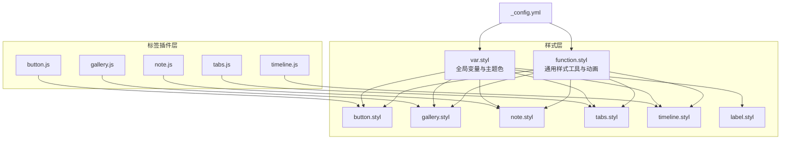
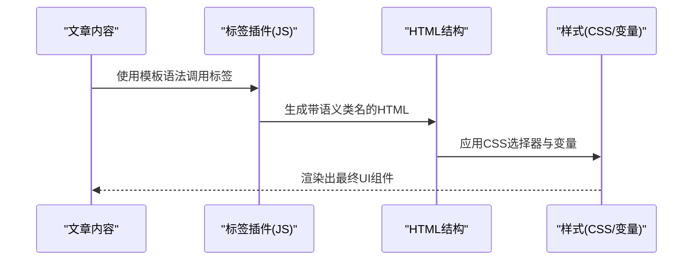
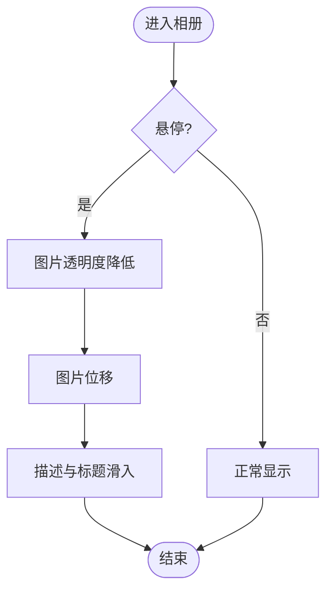
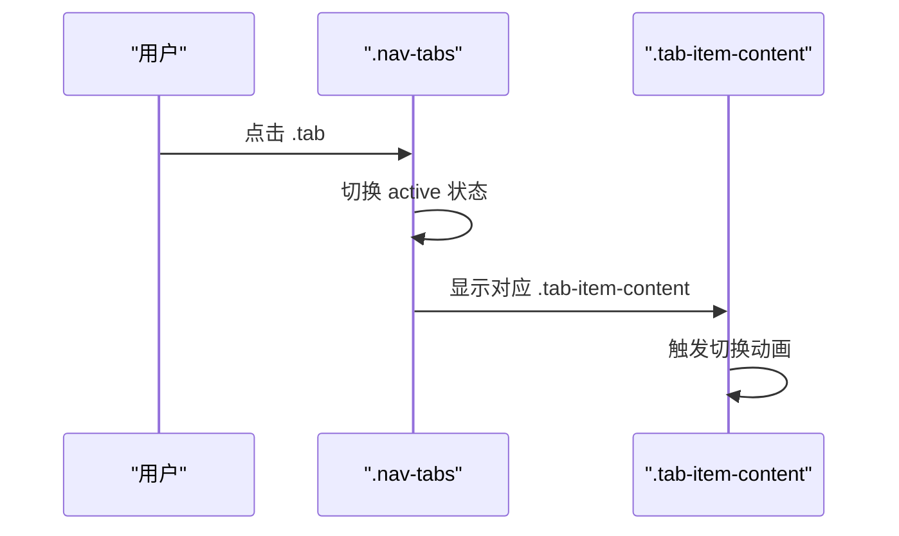
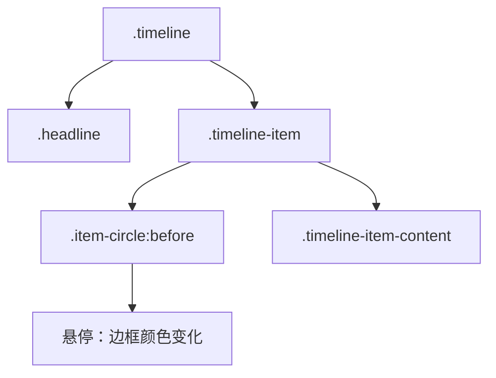
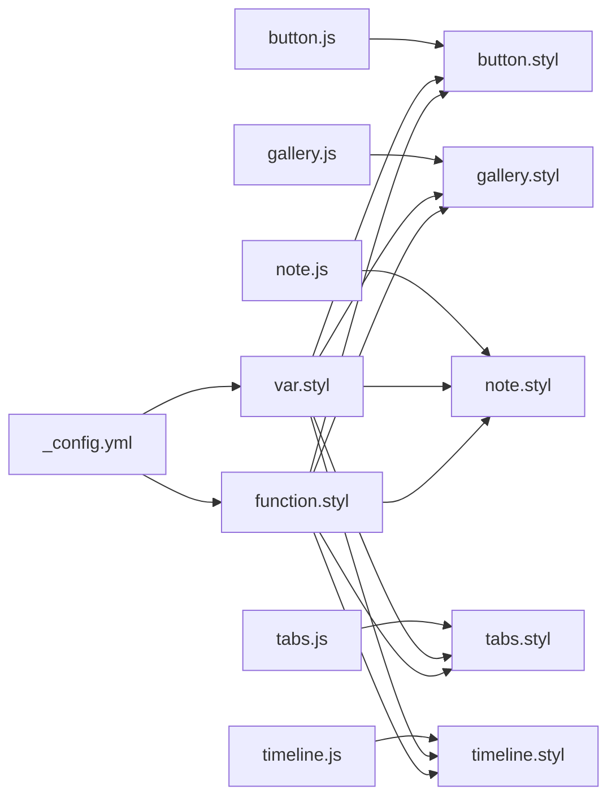

# 组件样式

<cite>
**本文引用的文件**
- [button.styl](file://themes/butterfly/source/css/_tags/button.styl)
- [gallery.styl](file://themes/butterfly/source/css/_tags/gallery.styl)
- [note.styl](file://themes/butterfly/source/css/_tags/note.styl)
- [tabs.styl](file://themes/butterfly/source/css/_tags/tabs.styl)
- [timeline.styl](file://themes/butterfly/source/css/_tags/timeline.styl)
- [label.styl](file://themes/butterfly/source/css/_tags/label.styl)
- [var.styl](file://themes/butterfly/source/css/var.styl)
- [function.styl](file://themes/butterfly/source/css/_global/function.styl)
- [button.js](file://themes/butterfly/scripts/tag/button.js)
- [gallery.js](file://themes/butterfly/scripts/tag/gallery.js)
- [note.js](file://themes/butterfly/scripts/tag/note.js)
- [tabs.js](file://themes/butterfly/scripts/tag/tabs.js)
- [timeline.js](file://themes/butterfly/scripts/tag/timeline.js)
- [_config.yml](file://themes/butterfly/_config.yml)
</cite>

## 目录
1. [简介](#简介)
2. [项目结构](#项目结构)
3. [核心组件](#核心组件)
4. [架构总览](#架构总览)
5. [组件详细分析](#组件详细分析)
6. [依赖关系分析](#依赖关系分析)
7. [性能考量](#性能考量)
8. [故障排查指南](#故障排查指南)
9. [结论](#结论)
10. [附录](#附录)

## 简介
本文件聚焦于 Hexo 主题 Butterfly 中“标签插件”（Tag Plugins）的组件样式体系，围绕按钮、相册、提示框、标签页与时间线等 UI 组件进行系统化梳理。内容覆盖样式结构、状态与交互、可定制属性（颜色、尺寸、边框、阴影等）、最佳实践、扩展与自定义开发指南，以及响应式设计与无障碍访问支持建议。

## 项目结构
- 样式层：位于 source/css/_tags 下，每个组件一个 styl 文件；全局变量与工具函数位于 source/css/var.styl 与 source/css/_global/function.styl。
- 标签插件层：位于 themes/butterfly/scripts/tag 下，每个组件一个 JS 文件，负责解析模板语法并输出 HTML 结构。
- 配置层：主题配置文件 themes/butterfly/_config.yml 提供主题色、圆角、动画等开关与默认值。



图表来源
- [button.styl:1-64](file://themes/butterfly/source/css/_tags/button.styl#L1-L64)
- [gallery.styl:1-219](file://themes/butterfly/source/css/_tags/gallery.styl#L1-L219)
- [note.styl:1-126](file://themes/butterfly/source/css/_tags/note.styl#L1-L126)
- [tabs.styl:1-78](file://themes/butterfly/source/css/_tags/tabs.styl#L1-L78)
- [timeline.styl:1-68](file://themes/butterfly/source/css/_tags/timeline.styl#L1-L68)
- [label.styl:1-12](file://themes/butterfly/source/css/_tags/label.styl#L1-L12)
- [var.styl:1-233](file://themes/butterfly/source/css/var.styl#L1-L233)
- [function.styl:1-348](file://themes/butterfly/source/css/_global/function.styl#L1-L348)
- [button.js:1-22](file://themes/butterfly/scripts/tag/button.js#L1-L22)
- [gallery.js:1-77](file://themes/butterfly/scripts/tag/gallery.js#L1-L77)
- [note.js:1-28](file://themes/butterfly/scripts/tag/note.js#L1-L28)
- [tabs.js:1-52](file://themes/butterfly/scripts/tag/tabs.js#L1-L52)
- [timeline.js:1-51](file://themes/butterfly/scripts/tag/timeline.js#L1-L51)
- [_config.yml:759-788](file://themes/butterfly/_config.yml#L759-L788)

章节来源
- [button.styl:1-64](file://themes/butterfly/source/css/_tags/button.styl#L1-L64)
- [gallery.styl:1-219](file://themes/butterfly/source/css/_tags/gallery.styl#L1-L219)
- [note.styl:1-126](file://themes/butterfly/source/css/_tags/note.styl#L1-L126)
- [tabs.styl:1-78](file://themes/butterfly/source/css/_tags/tabs.styl#L1-L78)
- [timeline.styl:1-68](file://themes/butterfly/source/css/_tags/timeline.styl#L1-L68)
- [label.styl:1-12](file://themes/butterfly/source/css/_tags/label.styl#L1-L12)
- [var.styl:1-233](file://themes/butterfly/source/css/var.styl#L1-L233)
- [function.styl:1-348](file://themes/butterfly/source/css/_global/function.styl#L1-L348)
- [button.js:1-22](file://themes/butterfly/scripts/tag/button.js#L1-L22)
- [gallery.js:1-77](file://themes/butterfly/scripts/tag/gallery.js#L1-L77)
- [note.js:1-28](file://themes/butterfly/scripts/tag/note.js#L1-L28)
- [tabs.js:1-52](file://themes/butterfly/scripts/tag/tabs.js#L1-L52)
- [timeline.js:1-51](file://themes/butterfly/scripts/tag/timeline.js#L1-L51)
- [_config.yml:759-788](file://themes/butterfly/_config.yml#L759-L788)

## 核心组件
- 按钮（Button）
  - 类名：.btn-beautify 及其修饰类（如 block、center、right、larger、outline 等）
  - 支持颜色类型：通过 CSS 变量映射到主题色系
  - 交互：悬停、点击波纹、图标动画、块级与对齐布局
- 相册（Gallery）
  - 容器与网格：.gallery-container、.gallery-group
  - 布局：响应式宽度、悬停缩放与遮罩、加载动画
- 提示框（Note）
  - 形态：simple、flat、modern、disabled
  - 图标：可选 FontAwesome 图标，支持居左留白
  - 主题色：多类型映射，支持浅色背景偏移
- 标签页（Tabs）
  - 导航：.nav-tabs、.tab（含活动态 active）
  - 内容区：.tab-contents、.tab-item-content（含切换动画）
  - 工具：回到顶部按钮
- 时间线（Timeline）
  - 主干：.timeline（左侧竖线），支持按类型变色
  - 节点：.timeline-item、.item-circle（圆点）、标题与内容区域
  - 头条：.headline 特殊样式

章节来源
- [button.styl:6-64](file://themes/butterfly/source/css/_tags/button.styl#L6-L64)
- [gallery.styl:2-129](file://themes/butterfly/source/css/_tags/gallery.styl#L2-L129)
- [note.styl:1-126](file://themes/butterfly/source/css/_tags/note.styl#L1-L126)
- [tabs.styl:2-78](file://themes/butterfly/source/css/_tags/tabs.styl#L2-L78)
- [timeline.styl:1-68](file://themes/butterfly/source/css/_tags/timeline.styl#L1-L68)

## 架构总览
- 标签插件 JS 负责解析模板语法，生成带语义类名的 HTML 结构。
- Stylus 样式文件通过 CSS 变量与工具函数实现主题化与一致性。
- 全局变量与工具函数统一管理颜色、圆角、阴影、动画等基础样式能力。
- 配置文件控制主题色、圆角、动画等开关，影响最终渲染。



图表来源
- [button.js:12-22](file://themes/butterfly/scripts/tag/button.js#L12-L22)
- [gallery.js:48-77](file://themes/butterfly/scripts/tag/gallery.js#L48-L77)
- [note.js:9-28](file://themes/butterfly/scripts/tag/note.js#L9-L28)
- [tabs.js:9-52](file://themes/butterfly/scripts/tag/tabs.js#L9-L52)
- [timeline.js:16-51](file://themes/butterfly/scripts/tag/timeline.js#L16-L51)
- [button.styl:6-64](file://themes/butterfly/source/css/_tags/button.styl#L6-L64)
- [gallery.styl:2-129](file://themes/butterfly/source/css/_tags/gallery.styl#L2-L129)
- [note.styl:1-126](file://themes/butterfly/source/css/_tags/note.styl#L1-L126)
- [tabs.styl:2-78](file://themes/butterfly/source/css/_tags/tabs.styl#L2-L78)
- [timeline.styl:1-68](file://themes/butterfly/source/css/_tags/timeline.styl#L1-L68)
- [var.styl:165-182](file://themes/butterfly/source/css/var.styl#L165-L182)
- [function.styl:18-34](file://themes/butterfly/source/css/_global/function.styl#L18-L34)

## 组件详细分析

### 按钮组件（Button）
- 样式结构
  - 基础类：.btn-beautify
  - 修饰类：block、center、right、larger、outline
  - 颜色类型：通过循环为每种类型注入 CSS 变量
- 状态与交互
  - 悬停：背景色变化、阴影与位移动画
  - 图标：悬停时图标与文字间距变化、图标抖动动效
  - 边框描边：outline 模式下边框与背景互换
- 可定制属性
  - 颜色：--btn-beautify-color、--btn-hover-color、--btn-color
  - 尺寸：larger 对应内边距与 hover 扩展
  - 边框：圆角由全局工具函数控制
  - 阴影：hover 时阴影增强
- 最佳实践
  - 使用 outline 时注意文本颜色反转，确保对比度
  - block 与 center/right 组合用于对齐布局
  - 合理使用 larger 以突出重要操作
- 扩展与自定义
  - 新增颜色类型：在主题配置中设置对应 CSS 变量或在样式中扩展颜色类型列表
  - 自定义尺寸：基于 .btn-effects-large 的模式扩展新的尺寸类
- 无障碍与响应式
  - 保持足够的对比度与可点击面积
  - 在小屏设备上避免过密排列

```mermaid
classDiagram
class ButtonStyles {
"+.btn-beautify"
"+.block/.center/.right"
"+.larger"
"+.outline"
"--btn-beautify-color"
"--btn-hover-color"
"--btn-color"
}
class FunctionUtils {
"+addBorderRadius()"
"+.btn-effects"
"+.btn-effects-large"
}
ButtonStyles --> FunctionUtils : "使用工具函数"
```

图表来源
- [button.styl:6-64](file://themes/butterfly/source/css/_tags/button.styl#L6-L64)
- [function.styl:18-34](file://themes/butterfly/source/css/_global/function.styl#L18-L34)
- [function.styl:184-237](file://themes/butterfly/source/css/_global/function.styl#L184-L237)

章节来源
- [button.styl:6-64](file://themes/butterfly/source/css/_tags/button.styl#L6-L64)
- [function.styl:18-34](file://themes/butterfly/source/css/_global/function.styl#L18-L34)
- [function.styl:184-237](file://themes/butterfly/source/css/_global/function.styl#L184-L237)
- [button.js:12-22](file://themes/butterfly/scripts/tag/button.js#L12-L22)
- [var.styl:165-173](file://themes/butterfly/source/css/var.styl#L165-L173)

### 相册组件（Gallery）
- 样式结构
  - .gallery-group：网格项容器，含图片与描述
  - .gallery-container：整体容器，含数据与加载态
  - 加载动画：自定义 keyframes 实现多球旋转
- 状态与交互
  - 悬停：图片透明度降低、位移；描述与标题滑入
  - 加载：初始不透明度低，加载完成后显示
- 可定制属性
  - 颜色：.gallery-group-name 的下划线颜色
  - 圆角：通过全局工具函数控制
  - 动画：过渡时长与缓动曲线
- 最佳实践
  - 合理设置图片宽高比与 object-fit，保证填充与裁剪一致
  - 控制网格列数与间距，适配不同屏幕宽度
- 扩展与自定义
  - 新增布局：通过媒体查询调整列数与宽度
  - 自定义动画：修改 keyframes 或引入新动画
- 无障碍与响应式
  - 为图片提供 alt 文本
  - 在小屏设备上优先展示单列布局



图表来源
- [gallery.styl:19-30](file://themes/butterfly/source/css/_tags/gallery.styl#L19-L30)
- [gallery.styl:137-219](file://themes/butterfly/source/css/_tags/gallery.styl#L137-L219)

章节来源
- [gallery.styl:2-129](file://themes/butterfly/source/css/_tags/gallery.styl#L2-L129)
- [gallery.js:48-77](file://themes/butterfly/scripts/tag/gallery.js#L48-L77)
- [var.styl:95-96](file://themes/butterfly/source/css/var.styl#L95-L96)
- [function.styl:111-146](file://themes/butterfly/source/css/_global/function.styl#L111-L146)

### 提示框组件（Note）
- 样式结构
  - .note：基础容器，支持 simple、flat、modern、disabled
  - 可选图标：.note-icon，支持居左留白
  - 多类型：default、primary、info、success、warning、danger
- 状态与交互
  - 不同形态：边框、背景、文字颜色随形态变化
  - 图标：可配置 FontAwesome 图标，现代风格下图标颜色与文字一致
- 可定制属性
  - 边框半径：通过配置控制
  - 边框与背景：支持浅色背景偏移
  - 现代风格：边框透明，背景与文字颜色独立
- 最佳实践
  - 使用 modern 形态提升信息层级感
  - simple 适合轻量提示，modern 适合强调信息
- 扩展与自定义
  - 新增类型：在变量中添加新类型的颜色与图标映射
  - 自定义图标：通过配置启用图标并指定图标类
- 无障碍与响应式
  - 保持足够的对比度，避免纯色背景与纯色文字组合
  - 在移动端适当增大内边距

```mermaid
classDiagram
class NoteStyles {
"+.note.simple/.flat/.modern/.disabled"
"+.note-icon"
"+$note-types"
"--note-* 变量"
}
NoteStyles --> VarStyl : "使用主题变量"
```

图表来源
- [note.styl:1-126](file://themes/butterfly/source/css/_tags/note.styl#L1-L126)
- [var.styl:109-163](file://themes/butterfly/source/css/var.styl#L109-L163)
- [note.js:9-28](file://themes/butterfly/scripts/tag/note.js#L9-L28)

章节来源
- [note.styl:1-126](file://themes/butterfly/source/css/_tags/note.styl#L1-L126)
- [note.js:9-28](file://themes/butterfly/scripts/tag/note.js#L9-L28)
- [var.styl:109-163](file://themes/butterfly/source/css/var.styl#L109-L163)

### 标签页组件（Tabs）
- 样式结构
  - .tabs：外层容器，含导航与内容区
  - .nav-tabs：导航栏，.tab 为选项卡项
  - .tab-contents：内容区，.tab-item-content 为内容项
  - 回到顶部：.tab-to-top
- 状态与交互
  - active：当前激活项，禁用鼠标指针事件
  - hover：非激活项悬停改变背景与边框
  - 切换动画：内容区显示时有位移动画
- 可定制属性
  - 边框与背景：导航栏边框与按钮背景/颜色
  - 活动态样式：活动态边框与背景
  - 动画：切换动画时长与缓动
- 最佳实践
  - 合理组织内容分组，避免单页内容过多
  - 使用回到顶部按钮提升长内容可访问性
- 扩展与自定义
  - 新增样式：通过 CSS 变量扩展按钮与边框颜色
  - 动画：修改 keyframes 或引入新动画
- 无障碍与响应式
  - 为按钮添加 aria-label
  - 在小屏设备上考虑折叠或滚动导航



图表来源
- [tabs.styl:12-78](file://themes/butterfly/source/css/_tags/tabs.styl#L12-L78)
- [tabs.js:9-52](file://themes/butterfly/scripts/tag/tabs.js#L9-L52)

章节来源
- [tabs.styl:2-78](file://themes/butterfly/source/css/_tags/tabs.styl#L2-L78)
- [tabs.js:9-52](file://themes/butterfly/scripts/tag/tabs.js#L9-L52)
- [var.styl:174-182](file://themes/butterfly/source/css/var.styl#L174-L182)

### 时间线组件（Timeline）
- 样式结构
  - .timeline：主干容器，支持按类型变色
  - .timeline-item：节点项，含标题与内容
  - .item-circle：圆点，before 伪元素绘制
- 状态与交互
  - 悬停：圆点边框颜色变化
  - 头条：.headline 样式加粗与定位
- 可定制属性
  - 颜色：--timeline-color 与 --timeline-bg
  - 圆点：大小、边框、背景
  - 内容区：圆角与字体大小
- 最佳实践
  - 使用 headline 区分关键节点
  - 控制节点间距与内容长度
- 扩展与自定义
  - 新增类型：通过循环为每种类型注入 CSS 变量
  - 自定义圆点样式：修改伪元素与过渡
- 无障碍与响应式
  - 为标题与内容提供清晰语义
  - 在窄屏设备上调整边距与字体大小



图表来源
- [timeline.styl:1-68](file://themes/butterfly/source/css/_tags/timeline.styl#L1-L68)

章节来源
- [timeline.styl:1-68](file://themes/butterfly/source/css/_tags/timeline.styl#L1-L68)
- [timeline.js:16-51](file://themes/butterfly/scripts/tag/timeline.js#L16-L51)
- [var.styl:183-184](file://themes/butterfly/source/css/var.styl#L183-L184)

### 标签组件（Label）
- 样式结构
  - .hl-label：高亮标签，支持 default 与多种颜色类型
- 可定制属性
  - 背景色：通过 CSS 变量映射到主题色系
  - 圆角：通过全局工具函数控制
- 最佳实践
  - 与按钮配合使用，形成统一的视觉层级
- 扩展与自定义
  - 新增颜色类型：在变量中扩展颜色类型列表

章节来源
- [label.styl:1-12](file://themes/butterfly/source/css/_tags/label.styl#L1-L12)
- [var.styl:165-173](file://themes/butterfly/source/css/var.styl#L165-L173)

## 依赖关系分析
- 组件样式依赖全局变量与工具函数
  - 主题色与类型色：var.styl
  - 圆角、阴影、动画：function.styl
- 标签插件负责生成语义类名，样式文件通过选择器与变量驱动最终呈现
- 配置文件控制主题色、圆角、动画等开关，间接影响组件外观



图表来源
- [_config.yml:759-788](file://themes/butterfly/_config.yml#L759-L788)
- [var.styl:165-182](file://themes/butterfly/source/css/var.styl#L165-L182)
- [function.styl:18-34](file://themes/butterfly/source/css/_global/function.styl#L18-L34)
- [button.js:12-22](file://themes/butterfly/scripts/tag/button.js#L12-L22)
- [gallery.js:48-77](file://themes/butterfly/scripts/tag/gallery.js#L48-L77)
- [note.js:9-28](file://themes/butterfly/scripts/tag/note.js#L9-L28)
- [tabs.js:9-52](file://themes/butterfly/scripts/tag/tabs.js#L9-L52)
- [timeline.js:16-51](file://themes/butterfly/scripts/tag/timeline.js#L16-L51)

章节来源
- [_config.yml:759-788](file://themes/butterfly/_config.yml#L759-L788)
- [var.styl:165-182](file://themes/butterfly/source/css/var.styl#L165-L182)
- [function.styl:18-34](file://themes/butterfly/source/css/_global/function.styl#L18-L34)

## 性能考量
- 样式层面
  - 使用 CSS 变量减少重复定义，提高维护效率
  - 合理使用 transform 与 opacity 触发硬件加速，优化动画性能
  - 避免在大范围组件上频繁重排重绘
- 代码层面
  - 标签插件尽量在服务端生成静态 HTML，减少运行时计算
  - 相册组件的图片加载建议配合懒加载策略（可在模板侧实现）

## 故障排查指南
- 按钮无悬停效果
  - 检查是否正确引入 .btn-effects 与 .btn-effects-large
  - 确认 CSS 变量未被覆盖
- 相册布局错乱
  - 检查媒体查询断点与列数设置
  - 确认图片宽高比与 object-fit 一致
- 提示框颜色异常
  - 检查主题色配置与类型变量映射
  - 确认 modern/simple/flat 形态未冲突
- 标签页切换无效
  - 检查 .active 类是否正确切换
  - 确认 .tab-item-content 的显示逻辑
- 时间线颜色不生效
  - 检查类型类名与 CSS 变量注入
  - 确认伪元素的边框与背景变量

章节来源
- [button.styl:6-64](file://themes/butterfly/source/css/_tags/button.styl#L6-L64)
- [gallery.styl:2-129](file://themes/butterfly/source/css/_tags/gallery.styl#L2-L129)
- [note.styl:1-126](file://themes/butterfly/source/css/_tags/note.styl#L1-L126)
- [tabs.styl:2-78](file://themes/butterfly/source/css/_tags/tabs.styl#L2-L78)
- [timeline.styl:1-68](file://themes/butterfly/source/css/_tags/timeline.styl#L1-L68)

## 结论
Butterfly 主题的组件样式通过“标签插件 + Stylus 样式 + 全局变量与工具函数”的分层架构实现高度一致且可定制的 UI 表达。按钮、相册、提示框、标签页与时间线均具备明确的状态与交互边界，并通过 CSS 变量与工具函数实现主题化与响应式适配。遵循本文的最佳实践与扩展指南，可在不破坏整体风格的前提下灵活定制组件外观与行为。

## 附录
- 可定制属性清单（节选）
  - 颜色：--btn-beautify-color、--btn-hover-color、--btn-color、--timeline-color、--note-*、--tags-* 系列
  - 尺寸：larger、圆角半径、边框宽度
  - 阴影：hover 时阴影强度与扩散
  - 动画：过渡时长、缓动曲线、图标抖动
- 响应式断点参考
  - maxWidth600()/maxWidth768()/minWidth1024() 等媒体查询断点
- 无障碍建议
  - 为交互元素提供 aria-label
  - 保持足够的对比度与可点击面积
  - 为图片提供 alt 文本