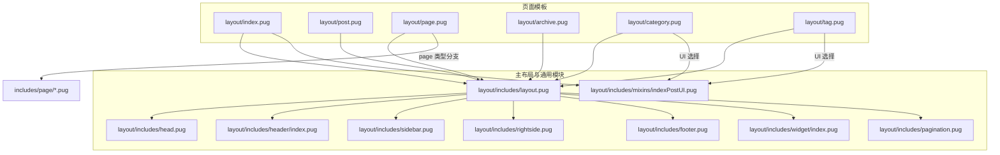
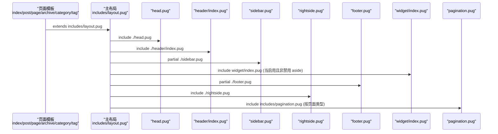
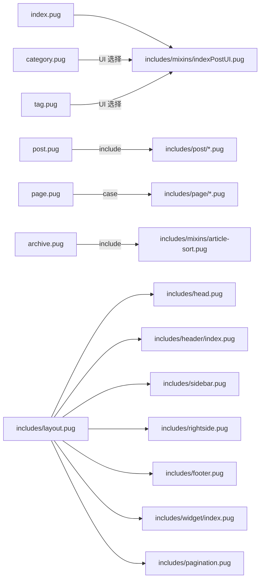

# 布局系统

<cite>
**本文引用的文件**
- [layout/includes/layout.pug](file://themes/butterfly/layout/includes/layout.pug)
- [layout/includes/head.pug](file://themes/butterfly/layout/includes/head.pug)
- [layout/includes/header/index.pug](file://themes/butterfly/layout/includes/header/index.pug)
- [layout/includes/sidebar.pug](file://themes/butterfly/layout/includes/sidebar.pug)
- [layout/includes/rightside.pug](file://themes/butterfly/layout/includes/rightside.pug)
- [layout/includes/footer.pug](file://themes/butterfly/layout/includes/footer.pug)
- [layout/includes/widget/index.pug](file://themes/butterfly/layout/includes/widget/index.pug)
- [layout/includes/pagination.pug](file://themes/butterfly/layout/includes/pagination.pug)
- [layout/includes/mixins/indexPostUI.pug](file://themes/butterfly/layout/includes/mixins/indexPostUI.pug)
- [layout/index.pug](file://themes/butterfly/layout/index.pug)
- [layout/post.pug](file://themes/butterfly/layout/post.pug)
- [layout/page.pug](file://themes/butterfly/layout/page.pug)
- [layout/archive.pug](file://themes/butterfly/layout/archive.pug)
- [layout/category.pug](file://themes/butterfly/layout/category.pug)
- [layout/tag.pug](file://themes/butterfly/layout/tag.pug)
- [layout/includes/page/default-page.pug](file://themes/butterfly/layout/includes/page/default-page.pug)
- [layout/includes/page/404.pug](file://themes/butterfly/layout/includes/page/404.pug)
- [layout/includes/page/categories.pug](file://themes/butterfly/layout/includes/page/categories.pug)
- [_config.yml](file://themes/butterfly/_config.yml)
</cite>

## 目录
1. [引言](#引言)
2. [项目结构](#项目结构)
3. [核心组件](#核心组件)
4. [架构总览](#架构总览)
5. [详细组件分析](#详细组件分析)
6. [依赖分析](#依赖分析)
7. [性能考虑](#性能考虑)
8. [故障排查指南](#故障排查指南)
9. [结论](#结论)
10. [附录：布局定制与开发指南](#附录布局定制与开发指南)

## 引言
本文件系统性梳理 Butterfly 主题的布局体系，聚焦主布局文件的结构与继承机制，详解头部、底部、侧边栏与右侧栏的组织方式；阐述各布局文件间的继承关系与 include/ partial 机制；覆盖布局变量、条件渲染与响应式布局实现；给出布局定制开发指南（新增/修改布局）、编译流程与性能优化策略，并提供调试技巧与实践建议。

## 项目结构
Butterfly 的布局采用 Pug 模板语言，以“主布局 + 头部/底部/侧边栏/右侧栏 + 小部件 + 分页 + 页面特化”分层组织。核心入口通过各页面模板继承主布局，再由主布局统一 include 各子模块，形成高内聚、低耦合的可扩展布局骨架。

图表来源
- [layout/index.pug:1-5](file://themes/butterfly/layout/index.pug#L1-L5)
- [layout/post.pug:1-36](file://themes/butterfly/layout/post.pug#L1-L36)
- [layout/page.pug:1-32](file://themes/butterfly/layout/page.pug#L1-L32)
- [layout/archive.pug:1-8](file://themes/butterfly/layout/archive.pug#L1-L8)
- [layout/category.pug:1-12](file://themes/butterfly/layout/category.pug#L1-L12)
- [layout/tag.pug:1-12](file://themes/butterfly/layout/tag.pug#L1-L12)
- [layout/includes/layout.pug:1-59](file://themes/butterfly/layout/includes/layout.pug#L1-L59)
- [layout/includes/mixins/indexPostUI.pug:1-119](file://themes/butterfly/layout/includes/mixins/indexPostUI.pug#L1-L119)

章节来源
- [layout/index.pug:1-5](file://themes/butterfly/layout/index.pug#L1-L5)
- [layout/post.pug:1-36](file://themes/butterfly/layout/post.pug#L1-L36)
- [layout/page.pug:1-32](file://themes/butterfly/layout/page.pug#L1-L32)
- [layout/includes/layout.pug:1-59](file://themes/butterfly/layout/includes/layout.pug#L1-L59)

## 核心组件
- 主布局 includes/layout.pug：定义全局 HTML 结构、主题模式、背景、侧边栏、主体内容区、页脚与右侧栏挂载点；通过 partial/include 组织子模块；根据页面类型动态设置类名与 aside 显示策略。
- 头部 includes/header/index.pug：根据页面类型决定顶部图与文案展示，支持固定导航、滚动下拉等行为；在首页支持副标题与社交图标。
- 侧边栏 includes/sidebar.pug：菜单遮罩、作者信息卡片、站点数据统计与菜单项入口。
- 右侧栏 includes/rightside.pug：右下角悬浮按钮集合，按配置显示/隐藏，支持阅读模式、翻译、深色模式、隐藏侧边栏、目录、聊天、评论跳转等。
- 底部 includes/footer.pug：多区块导航、版权信息、框架版本信息与自定义文本。
- 小部件 includes/widget/index.pug：根据页面类型（文章/非文章）加载不同卡片组合（作者、公告、最近文章、分类、标签、归档、站点信息等），以及文章页目录卡片。
- 分页 includes/pagination.pug：首页分页与文章页上一页/下一页导航，支持封面与简介展示。
- 首页混入 includes/mixins/indexPostUI.pug：首页文章流布局（多种布局样式、瀑布流、置顶标记、元信息、评论计数、广告位）。
- 页面特化：page.pug 根据 page.type 分派到不同 includes/page/* 模块；archive/category/tag 支持列表或首页混入两种 UI 路径。

章节来源
- [layout/includes/layout.pug:1-59](file://themes/butterfly/layout/includes/layout.pug#L1-L59)
- [layout/includes/header/index.pug:1-52](file://themes/butterfly/layout/includes/header/index.pug#L1-L52)
- [layout/includes/sidebar.pug:1-18](file://themes/butterfly/layout/includes/sidebar.pug#L1-L18)
- [layout/includes/rightside.pug:1-54](file://themes/butterfly/layout/includes/rightside.pug#L1-L54)
- [layout/includes/footer.pug:1-40](file://themes/butterfly/layout/includes/footer.pug#L1-L40)
- [layout/includes/widget/index.pug:1-36](file://themes/butterfly/layout/includes/widget/index.pug#L1-L36)
- [layout/includes/pagination.pug:1-38](file://themes/butterfly/layout/includes/pagination.pug#L1-L38)
- [layout/includes/mixins/indexPostUI.pug:1-119](file://themes/butterfly/layout/includes/mixins/indexPostUI.pug#L1-L119)
- [layout/page.pug:1-32](file://themes/butterfly/layout/page.pug#L1-L32)
- [layout/archive.pug:1-8](file://themes/butterfly/layout/archive.pug#L1-L8)
- [layout/category.pug:1-12](file://themes/butterfly/layout/category.pug#L1-L12)
- [layout/tag.pug:1-12](file://themes/butterfly/layout/tag.pug#L1-L12)

## 架构总览
下图展示从页面模板到主布局再到各子模块的继承与包含关系，体现“统一骨架 + 按需装配”的设计思想。

图表来源
- [layout/index.pug:1-5](file://themes/butterfly/layout/index.pug#L1-L5)
- [layout/post.pug:1-36](file://themes/butterfly/layout/post.pug#L1-L36)
- [layout/page.pug:1-32](file://themes/butterfly/layout/page.pug#L1-L32)
- [layout/archive.pug:1-8](file://themes/butterfly/layout/archive.pug#L1-L8)
- [layout/category.pug:1-12](file://themes/butterfly/layout/category.pug#L1-L12)
- [layout/tag.pug:1-12](file://themes/butterfly/layout/tag.pug#L1-L12)
- [layout/includes/layout.pug:1-59](file://themes/butterfly/layout/includes/layout.pug#L1-L59)

## 详细组件分析

### 主布局 includes/layout.pug
- 全局变量与类名
  - 通过 getPageType 计算页面类型，设置 html class 与 body class，控制 aside 显示/隐藏。
  - 根据主题配置与页面类型动态决定 aside 的显示策略。
- 结构组织
  - head 区域引入 head.pug；body 内容依次为加载动画、背景、侧边栏、头部、主内容区、页脚、右侧栏、附加 JS。
  - 主内容区根据是否存在 body 片段或 block content 渲染；当启用 aside 且未禁用时，渲染小部件区域。
- 条件渲染与响应式
  - 背景支持单值或数组随机切换，配合 pjax 生命周期事件更新。
  - aside 的显示/隐藏通过类名控制，影响整体布局宽度与移动端体验。
- 性能要点
  - 使用 partial 并开启缓存，减少重复渲染开销。
  - 背景随机切换逻辑仅在 DOMContentLoaded 与 pjax:complete 时触发，避免频繁重排。

章节来源
- [layout/includes/layout.pug:1-59](file://themes/butterfly/layout/includes/layout.pug#L1-L59)

### 头部 includes/header/index.pug
- 顶部图与文案
  - 根据页面类型（首页、文章、标签、分类、归档）选择不同的顶部图策略；首页支持副标题与社交图标；无顶部图时保留 SEO 标题。
- 导航与固定样式
  - 支持固定导航条样式，提升滚动体验。
- 条件渲染
  - 文章页顶部信息与首页信息分别渲染；首页副标题支持延迟加载脚本。

章节来源
- [layout/includes/header/index.pug:1-52](file://themes/butterfly/layout/includes/header/index.pug#L1-L52)

### 侧边栏 includes/sidebar.pug
- 菜单遮罩与菜单项
  - 提供菜单遮罩层与菜单项入口，承载作者头像、站点数据统计与菜单项。
- 条件渲染
  - 依赖主题 menu 配置，若未配置则不渲染。

章节来源
- [layout/includes/sidebar.pug:1-18](file://themes/butterfly/layout/includes/sidebar.pug#L1-L18)

### 右侧栏 includes/rightside.pug
- 功能按钮集合
  - 支持阅读模式、简繁转换、深色模式、隐藏侧边栏、目录、聊天、评论跳转等；按钮是否显示由配置与页面类型共同决定。
- 排序与显隐
  - 通过 rightside_item_order 控制默认显隐与顺序；必要时显示设置按钮。
- 条件渲染
  - 仅在满足条件时渲染对应按钮，避免冗余 DOM。

章节来源
- [layout/includes/rightside.pug:1-54](file://themes/butterfly/layout/includes/rightside.pug#L1-L54)

### 底部 includes/footer.pug
- 多区块导航
  - 支持嵌套区块与子项链接/HTML/纯文本混合渲染。
- 版权与框架信息
  - 年份范围计算、版权开关、框架与主题版本信息拼接。
- 自定义文本
  - 支持注入自定义文本片段。

章节来源
- [layout/includes/footer.pug:1-40](file://themes/butterfly/layout/includes/footer.pug#L1-L40)

### 小部件 includes/widget/index.pug
- 文章页
  - 目录卡片优先级高于作者/公告/置顶卡片；随后按顺序加载最近文章、广告、系列、目录等。
- 非文章页
  - 加载作者/公告/置顶卡片后，按顺序加载最近文章、广告、最新评论、分类、标签、归档、站点信息与底部卡片。
- 条件渲染
  - showToc 控制目录卡片是否渲染；series 字段控制系列卡片。

章节来源
- [layout/includes/widget/index.pug:1-36](file://themes/butterfly/layout/includes/widget/index.pug#L1-L36)

### 分页 includes/pagination.pug
- 首页分页
  - 使用 paginator 生成分页导航，格式化为 “page/%d/#content-inner”。
- 文章页分页
  - 根据主题配置决定上一页/下一页顺序；支持封面与简介展示；根据是否存在简介添加样式类。
- 条件渲染
  - 当仅一页时不渲染分页容器。

章节来源
- [layout/includes/pagination.pug:1-38](file://themes/butterfly/layout/includes/pagination.pug#L1-L38)

### 首页混入 includes/mixins/indexPostUI.pug
- 布局样式
  - 支持多种首页布局（左右/上下/交错/瀑布流等），通过索引奇偶或布局编号控制左右分布。
- 元信息与评论计数
  - 支持创建/更新日期、分类、标签、评论计数（按评论系统类型注入）。
- 广告位
  - 在每三篇文章后插入主题广告配置。
- 条件渲染
  - 根据主题开关与 cover 配置决定封面是否渲染；根据主题开关决定是否显示简介。

章节来源
- [layout/includes/mixins/indexPostUI.pug:1-119](file://themes/butterfly/layout/includes/mixins/indexPostUI.pug#L1-L119)

### 页面特化
- index.pug
  - 继承主布局并在 content 区 include 首页混入，渲染首页文章流。
- post.pug
  - 继承主布局；根据 top_img 是否存在决定是否渲染文章页顶部信息；支持过期提醒、版权、打赏、广告、分页、相关文章与评论系统。
- page.pug
  - 继承主布局；根据 page.type 分派到不同 includes/page/* 模块；支持评论懒加载 mixin。
- archive.pug
  - 继承主布局；渲染归档文章排序列表与分页。
- category.pug / tag.pug
  - 继承主布局；根据主题配置选择“首页混入”或“文章排序”两种 UI 路径。

章节来源
- [layout/index.pug:1-5](file://themes/butterfly/layout/index.pug#L1-L5)
- [layout/post.pug:1-36](file://themes/butterfly/layout/post.pug#L1-L36)
- [layout/page.pug:1-32](file://themes/butterfly/layout/page.pug#L1-L32)
- [layout/archive.pug:1-8](file://themes/butterfly/layout/archive.pug#L1-L8)
- [layout/category.pug:1-12](file://themes/butterfly/layout/category.pug#L1-L12)
- [layout/tag.pug:1-12](file://themes/butterfly/layout/tag.pug#L1-L12)
- [layout/includes/page/default-page.pug:1-2](file://themes/butterfly/layout/includes/page/default-page.pug#L1-L2)
- [layout/includes/page/404.pug:1-9](file://themes/butterfly/layout/includes/page/404.pug#L1-L9)
- [layout/includes/page/categories.pug:1-1](file://themes/butterfly/layout/includes/page/categories.pug#L1-L1)

## 依赖分析
- 继承关系
  - 所有页面模板均继承 includes/layout.pug，确保一致的骨架与模块装配。
- include 与 partial
  - 主布局通过 include 引入 head.pug、header/index.pug、widget/index.pug、footer.pug、rightside.pug、pagination.pug；
  - 通过 partial 引入 sidebar.pug 与 additional-js.pug，并开启缓存。
- 页面特化与混入
  - index.pug include 首页混入；post.pug include 多个功能模块；page.pug 根据 page.type 分派至 includes/page/*。
- 配置驱动
  - 大量渲染逻辑受 _config.yml 中的主题配置控制，如 aside、toc、comments、rightside_item_order、index_layout 等。

图表来源
- [layout/index.pug:1-5](file://themes/butterfly/layout/index.pug#L1-L5)
- [layout/post.pug:1-36](file://themes/butterfly/layout/post.pug#L1-L36)
- [layout/page.pug:1-32](file://themes/butterfly/layout/page.pug#L1-L32)
- [layout/archive.pug:1-8](file://themes/butterfly/layout/archive.pug#L1-L8)
- [layout/category.pug:1-12](file://themes/butterfly/layout/category.pug#L1-L12)
- [layout/tag.pug:1-12](file://themes/butterfly/layout/tag.pug#L1-L12)
- [layout/includes/layout.pug:1-59](file://themes/butterfly/layout/includes/layout.pug#L1-L59)

章节来源
- [layout/includes/layout.pug:1-59](file://themes/butterfly/layout/includes/layout.pug#L1-L59)
- [_config.yml:1-1140](file://themes/butterfly/_config.yml#L1-L1140)

## 性能考虑
- 模板缓存
  - 使用 partial 并开启缓存，降低重复渲染成本；对 head 注入与全局 JS 采用片段缓存。
- 背景随机切换
  - 仅在 DOMContentLoaded 与 pjax:complete 时执行，避免频繁重排；pjax:send 时清理样式，保证状态一致。
- 条件渲染
  - 通过主题配置与页面类型精确控制渲染路径，避免不必要的 DOM 与网络请求。
- 资源加载
  - 根据主题配置按需加载字体、图标、snackbar、fancybox 等资源，减少首屏负担。
- 分页与瀑布流
  - 首页瀑布流与分页仅在需要时渲染，避免大列表一次性渲染带来的卡顿。

[本节为通用性能建议，无需具体文件分析]

## 故障排查指南
- 顶部图未显示
  - 检查页面 top_img 配置与主题 default_top_img 设置；确认 header/index.pug 的类型分支逻辑是否命中预期。
- 侧边栏不出现
  - 确认主题 menu 配置；检查 aside.enable 与 page.aside 是否被显式禁用。
- 右侧栏按钮缺失
  - 检查 rightside_item_order 的 enable、hide、show 配置；确认页面类型与功能开关（如 darkmode.button、translate.enable）。
- 评论系统未加载
  - 确认 page.comments 与 theme.comments.use；page.pug 中的评论 mixin 是否被调用；post.pug 中的 partial 调用是否生效。
- 分页不显示
  - 检查 page.total 与主题 post_pagination 配置；确认 archive/category/tag 的 UI 选择与分页 include。
- 背景随机切换异常
  - 检查 theme.background 是否为数组；确认 pjax 事件监听与 DOM 更新逻辑。

章节来源
- [layout/includes/header/index.pug:1-52](file://themes/butterfly/layout/includes/header/index.pug#L1-L52)
- [layout/includes/sidebar.pug:1-18](file://themes/butterfly/layout/includes/sidebar.pug#L1-L18)
- [layout/includes/rightside.pug:1-54](file://themes/butterfly/layout/includes/rightside.pug#L1-L54)
- [layout/page.pug:1-32](file://themes/butterfly/layout/page.pug#L1-L32)
- [layout/post.pug:1-36](file://themes/butterfly/layout/post.pug#L1-L36)
- [layout/includes/pagination.pug:1-38](file://themes/butterfly/layout/includes/pagination.pug#L1-L38)
- [layout/includes/layout.pug:1-59](file://themes/butterfly/layout/includes/layout.pug#L1-L59)

## 结论
Butterfly 的布局系统以主布局为核心，通过继承与 include/ partial 机制实现高度模块化与可配置化。借助主题配置与页面类型判断，系统在保证一致性的同时提供了丰富的定制能力。遵循本文的结构理解、依赖关系与性能建议，可高效完成布局定制与问题排查。

[本节为总结性内容，无需具体文件分析]

## 附录：布局定制与开发指南

### 新增页面布局
- 步骤
  - 在 layout 下新建页面模板（如 layout/my-page.pug），继承 includes/layout.pug。
  - 在 block content 中 include 或直接渲染所需模块。
  - 如需独立 head 行为，可在 my-page.pug 中覆盖 head.pug 的 include，或在 includes/head.pug 中增加条件分支。
- 注意事项
  - 保持与主布局一致的结构；合理使用 partial 缓存。
  - 通过主题配置或页面 front-matter 控制模块显隐。

章节来源
- [layout/includes/layout.pug:1-59](file://themes/butterfly/layout/includes/layout.pug#L1-L59)
- [layout/includes/head.pug:1-78](file://themes/butterfly/layout/includes/head.pug#L1-L78)

### 修改现有布局
- 修改主布局
  - 在 includes/layout.pug 中调整模块 include 顺序或新增模块；注意缓存与 pjax 事件联动。
- 修改头部/底部/侧边栏/右侧栏
  - 在对应模块中增加/删减条件渲染；确保与主题配置联动。
- 调整首页布局
  - 在 includes/mixins/indexPostUI.pug 中调整布局样式与模块顺序；注意与主题 index_layout 配置的映射。
- 调整分页
  - 在 includes/pagination.pug 中调整样式类与渲染逻辑；确保与主题 post_pagination 配置一致。

章节来源
- [layout/includes/layout.pug:1-59](file://themes/butterfly/layout/includes/layout.pug#L1-L59)
- [layout/includes/mixins/indexPostUI.pug:1-119](file://themes/butterfly/layout/includes/mixins/indexPostUI.pug#L1-L119)
- [layout/includes/pagination.pug:1-38](file://themes/butterfly/layout/includes/pagination.pug#L1-L38)

### 布局变量与条件渲染清单
- 页面类型与 aside 控制
  - 通过 getPageType 与 theme.aside.* 配置控制 aside 显示/隐藏与位置。
- 顶部图与标题
  - 通过 globalPageType 与 theme.*_img 配置决定顶部图；head.pug 动态生成 tab 标题。
- 右侧栏按钮
  - 通过 theme.rightside_item_order 与功能开关控制按钮显隐与顺序。
- 评论系统
  - 通过 theme.comments.use 与 page.comments 控制评论系统加载与计数。
- 分页
  - 通过 theme.post_pagination 与 page.total 控制文章页分页顺序与显示。

章节来源
- [layout/includes/layout.pug:1-59](file://themes/butterfly/layout/includes/layout.pug#L1-L59)
- [layout/includes/head.pug:1-78](file://themes/butterfly/layout/includes/head.pug#L1-L78)
- [layout/includes/rightside.pug:1-54](file://themes/butterfly/layout/includes/rightside.pug#L1-L54)
- [layout/page.pug:1-32](file://themes/butterfly/layout/page.pug#L1-L32)
- [layout/post.pug:1-36](file://themes/butterfly/layout/post.pug#L1-L36)
- [layout/includes/pagination.pug:1-38](file://themes/butterfly/layout/includes/pagination.pug#L1-L38)

### 响应式布局实现要点
- 视口与主题色
  - head.pug 设置 viewport 与 theme-color，适配移动端。
- aside 显隐
  - 通过类名控制 aside 显示/隐藏，影响整体布局宽度。
- 右侧栏按钮
  - 按配置与页面类型动态显示，避免遮挡正文。
- 顶部图与滚动
  - header/index.pug 支持固定导航与滚动下拉效果，改善移动端体验。

章节来源
- [layout/includes/head.pug:1-78](file://themes/butterfly/layout/includes/head.pug#L1-L78)
- [layout/includes/layout.pug:1-59](file://themes/butterfly/layout/includes/layout.pug#L1-L59)
- [layout/includes/header/index.pug:1-52](file://themes/butterfly/layout/includes/header/index.pug#L1-L52)
- [layout/includes/rightside.pug:1-54](file://themes/butterfly/layout/includes/rightside.pug#L1-L54)

### 布局编译与性能优化策略
- 编译流程
  - Hexo 渲染阶段：Pug 模板经继承与 include/ partial 组装为 HTML；静态资源由主题配置注入。
- 优化策略
  - 启用 partial 缓存；按需加载第三方资源；精简模块 include；合理使用条件渲染。
- 调试技巧
  - 利用浏览器开发者工具查看 DOM 结构与类名；核对主题配置键值；在 pjax 事件中观察背景与 aside 的状态变化。

章节来源
- [layout/includes/layout.pug:1-59](file://themes/butterfly/layout/includes/layout.pug#L1-L59)
- [layout/includes/head.pug:1-78](file://themes/butterfly/layout/includes/head.pug#L1-L78)
- [_config.yml:1-1140](file://themes/butterfly/_config.yml#L1-L1140)