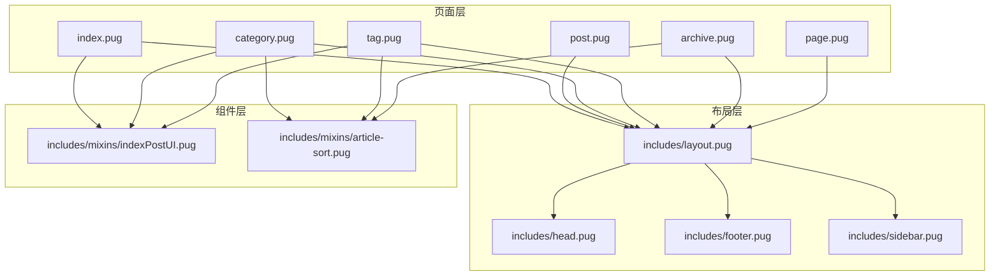
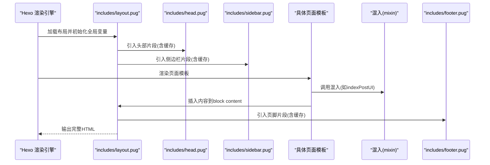
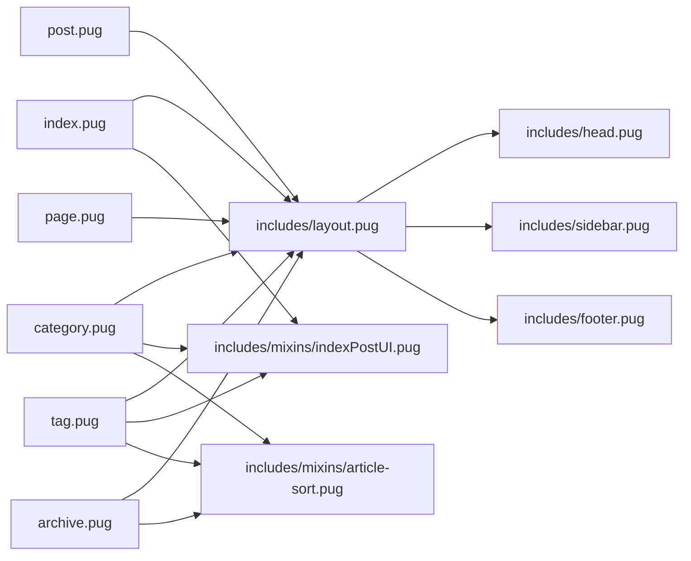

# 模板系统

<cite>
**本文引用的文件**
- [layout/includes/layout.pug](file://themes/butterfly/layout/includes/layout.pug)
- [layout/includes/head.pug](file://themes/butterfly/layout/includes/head.pug)
- [layout/includes/footer.pug](file://themes/butterfly/layout/includes/footer.pug)
- [layout/includes/sidebar.pug](file://themes/butterfly/layout/includes/sidebar.pug)
- [layout/index.pug](file://themes/butterfly/layout/index.pug)
- [layout/post.pug](file://themes/butterfly/layout/post.pug)
- [layout/category.pug](file://themes/butterfly/layout/category.pug)
- [layout/tag.pug](file://themes/butterfly/layout/tag.pug)
- [layout/archive.pug](file://themes/butterfly/layout/archive.pug)
- [layout/page.pug](file://themes/butterfly/layout/page.pug)
- [layout/includes/mixins/indexPostUI.pug](file://themes/butterfly/layout/includes/mixins/indexPostUI.pug)
- [layout/includes/mixins/article-sort.pug](file://themes/butterfly/layout/includes/mixins/article-sort.pug)
- [themes/butterfly/_config.yml](file://themes/butterfly/_config.yml)
</cite>

## 目录
1. [简介](#简介)
2. [项目结构](#项目结构)
3. [核心组件](#核心组件)
4. [架构总览](#架构总览)
5. [详细组件分析](#详细组件分析)
6. [依赖关系分析](#依赖关系分析)
7. [性能考虑](#性能考虑)
8. [故障排查指南](#故障排查指南)
9. [结论](#结论)
10. [附录](#附录)

## 简介
本文件面向Butterfly主题的Pug模板系统，系统性阐述模板继承、布局嵌套与组件复用模式；详解首页、文章页、分类页、标签页与归档页的渲染流程；说明模板变量、条件渲染与循环处理；提供自定义模板开发指南（新增页面类型与修改既有模板）；解释模板编译、缓存与性能优化策略，并给出调试技巧与实践建议。

## 项目结构
Butterfly主题采用“布局继承 + 组件混入 + 局部片段”的分层组织方式：
- 布局层：统一的站点骨架与通用部件（头部、侧边栏、页脚、右侧工具等）
- 页面层：针对不同页面类型的入口模板（首页、文章、分类、标签、归档、独立页）
- 组件层：可复用的混入（mixin）与局部片段（partial），如文章列表、排序、统计等
- 配置层：主题配置文件集中控制UI行为与功能开关

图表来源
- [layout/includes/layout.pug:1-59](file://themes/butterfly/layout/includes/layout.pug#L1-L59)
- [layout/index.pug:1-5](file://themes/butterfly/layout/index.pug#L1-L5)
- [layout/post.pug:1-36](file://themes/butterfly/layout/post.pug#L1-L36)
- [layout/category.pug:1-12](file://themes/butterfly/layout/category.pug#L1-L12)
- [layout/tag.pug:1-12](file://themes/butterfly/layout/tag.pug#L1-L12)
- [layout/archive.pug:1-8](file://themes/butterfly/layout/archive.pug#L1-L8)
- [layout/page.pug:1-32](file://themes/butterfly/layout/page.pug#L1-L32)
- [layout/includes/mixins/indexPostUI.pug:1-119](file://themes/butterfly/layout/includes/mixins/indexPostUI.pug#L1-L119)
- [layout/includes/mixins/article-sort.pug:1-23](file://themes/butterfly/layout/includes/mixins/article-sort.pug#L1-L23)

章节来源
- [layout/includes/layout.pug:1-59](file://themes/butterfly/layout/includes/layout.pug#L1-L59)
- [layout/index.pug:1-5](file://themes/butterfly/layout/index.pug#L1-L5)
- [layout/post.pug:1-36](file://themes/butterfly/layout/post.pug#L1-L36)
- [layout/category.pug:1-12](file://themes/butterfly/layout/category.pug#L1-L12)
- [layout/tag.pug:1-12](file://themes/butterfly/layout/tag.pug#L1-L12)
- [layout/archive.pug:1-8](file://themes/butterfly/layout/archive.pug#L1-L8)
- [layout/page.pug:1-32](file://themes/butterfly/layout/page.pug#L1-L32)
- [layout/includes/mixins/indexPostUI.pug:1-119](file://themes/butterfly/layout/includes/mixins/indexPostUI.pug#L1-L119)
- [layout/includes/mixins/article-sort.pug:1-23](file://themes/butterfly/layout/includes/mixins/article-sort.pug#L1-L23)

## 核心组件
- 布局骨架：通过includes/layout.pug统一输出HTML结构、注入头部、侧边栏、主体内容区、页脚与右侧工具条，并根据页面类型动态设置aside显示与样式类名。
- 头部构建：includes/head.pug根据全局页面类型计算标题、OpenGraph、结构化数据、预连接、站点验证、PWA、CSS、注入脚本等。
- 页脚与侧边栏：includes/footer.pug与includes/sidebar.pug分别负责页脚导航与统计、社交信息以及侧边菜单与站点数据。
- 混入组件：
  - indexPostUI：首页/聚合页的文章卡片流式布局与元信息展示，支持瀑布流、交替左右布局、封面图、评论计数等。
  - article-sort：按年份分组的文章列表，支持封面图、日期、标题与无封面模式。
- 页面模板：
  - index：首页入口，调用indexPostUI混入。
  - post：文章详情页，条件渲染过期提示、版权、打赏、广告、分页、相关文章与评论。
  - category/tag：分类/标签页，支持“首页风格”或“归档风格”两种UI模式。
  - archive：归档页，按年/月/日排序的文章列表与分页。
  - page：独立页面（含多种type），根据type选择对应局部模板并按需加载评论。

章节来源
- [layout/includes/layout.pug:1-59](file://themes/butterfly/layout/includes/layout.pug#L1-L59)
- [layout/includes/head.pug:1-78](file://themes/butterfly/layout/includes/head.pug#L1-L78)
- [layout/includes/footer.pug:1-40](file://themes/butterfly/layout/includes/footer.pug#L1-L40)
- [layout/includes/sidebar.pug:1-18](file://themes/butterfly/layout/includes/sidebar.pug#L1-L18)
- [layout/includes/mixins/indexPostUI.pug:1-119](file://themes/butterfly/layout/includes/mixins/indexPostUI.pug#L1-L119)
- [layout/includes/mixins/article-sort.pug:1-23](file://themes/butterfly/layout/includes/mixins/article-sort.pug#L1-L23)
- [layout/index.pug:1-5](file://themes/butterfly/layout/index.pug#L1-L5)
- [layout/post.pug:1-36](file://themes/butterfly/layout/post.pug#L1-L36)
- [layout/category.pug:1-12](file://themes/butterfly/layout/category.pug#L1-L12)
- [layout/tag.pug:1-12](file://themes/butterfly/layout/tag.pug#L1-L12)
- [layout/archive.pug:1-8](file://themes/butterfly/layout/archive.pug#L1-L8)
- [layout/page.pug:1-32](file://themes/butterfly/layout/page.pug#L1-L32)

## 架构总览
模板系统遵循“布局继承 + 局部片段缓存 + 混入复用”的设计：
- 所有页面模板均extend includes/layout.pug，确保一致的HTML结构与全局变量。
- includes/layout.pug内部通过partial调用多个局部片段，并启用缓存以减少重复渲染成本。
- 页面模板在block content中插入具体业务逻辑，如首页的indexPostUI、文章页的版权与评论、分类/标签页的排序列表等。
- 混入（mixin）封装可复用的UI片段，如indexPostUI与article-sort，降低重复代码与提升可维护性。

图表来源
- [layout/includes/layout.pug:1-59](file://themes/butterfly/layout/includes/layout.pug#L1-L59)
- [layout/includes/head.pug:1-78](file://themes/butterfly/layout/includes/head.pug#L1-L78)
- [layout/includes/sidebar.pug:1-18](file://themes/butterfly/layout/includes/sidebar.pug#L1-L18)
- [layout/includes/footer.pug:1-40](file://themes/butterfly/layout/includes/footer.pug#L1-L40)
- [layout/index.pug:1-5](file://themes/butterfly/layout/index.pug#L1-L5)
- [layout/includes/mixins/indexPostUI.pug:1-119](file://themes/butterfly/layout/includes/mixins/indexPostUI.pug#L1-L119)

## 详细组件分析

### 布局骨架（includes/layout.pug）
- 全局变量
  - 通过getPageType(page, is_home)推导页面类型，用于控制aside显示与body类名。
  - 根据页面类型选择aside在归档/分类/标签页的默认显示策略。
- 结构与部件
  - 头部：引入includes/head.pug。
  - 加载动画：通过partial加载loading片段并启用缓存。
  - 背景：支持单张或多张背景随机切换。
  - 侧边栏：引入sidebar.pug并注入菜单项。
  - 主体：header、main、aside（可选）、footer。
  - 右侧工具条与附加JS：引入includes/rightside.pug与includes/additional-js.pug。
- 缓存策略
  - 使用partial并传入{cache:true}对头部、侧边栏、页脚等静态或半静态片段进行缓存，减少重复计算。

章节来源
- [layout/includes/layout.pug:1-59](file://themes/butterfly/layout/includes/layout.pug#L1-L59)

### 头部构建（includes/head.pug）
- 动态标题
  - 根据globalPageType计算tabTitle，支持首页、归档、分类、标签、404等场景。
- SEO与结构化数据
  - 引入Open_Graph与structured_data片段，生成标准SEO元信息。
- 资源与注入
  - 预连接、站点验证、PWA、主CSS、图标、注入脚本与自定义注入内容。
- 片段缓存
  - injectHeadJs与injectHtml通过fragment_cache进行缓存，避免重复执行。

章节来源
- [layout/includes/head.pug:1-78](file://themes/butterfly/layout/includes/head.pug#L1-L78)

### 页脚与侧边栏
- 页脚（includes/footer.pug）
  - 支持多列导航区块、版权信息、框架版本信息与自定义文本。
  - 通过循环渲染导航与内容，支持HTML、链接与纯文本混合。
- 侧边栏（includes/sidebar.pug）
  - 显示头像、站点数据统计（文章、标签、分类数量）与菜单项。
  - 菜单项通过partial('includes/header/menu_item', {}, { cache: true })注入。

章节来源
- [layout/includes/footer.pug:1-40](file://themes/butterfly/layout/includes/footer.pug#L1-L40)
- [layout/includes/sidebar.pug:1-18](file://themes/butterfly/layout/includes/sidebar.pug#L1-L18)

### 混入组件

#### indexPostUI（首页/聚合页文章流）
- 输入：page.posts.data
- 行为：
  - 根据主题配置选择布局（含瀑布流）。
  - 循环渲染每篇文章，支持封面图、标题、日期、分类/标签、评论计数等。
  - 评论计数根据所选评论系统分支渲染，且通过mixin countBlockInIndex注入。
  - 首页可插入广告位（每N篇文章插入一次）。
  - 底部引入分页组件。
- 性能：通过mixin内联渲染，减少模板层级与重复逻辑。

章节来源
- [layout/includes/mixins/indexPostUI.pug:1-119](file://themes/butterfly/layout/includes/mixins/indexPostUI.pug#L1-L119)

#### article-sort（归档/分类/标签页排序）
- 输入：posts数组
- 行为：
  - 按年份分组，输出年份标题与条目列表。
  - 条目支持封面图、日期、标题与无封面模式。
- 适用：category.pug、tag.pug、archive.pug中的排序展示。

章节来源
- [layout/includes/mixins/article-sort.pug:1-23](file://themes/butterfly/layout/includes/mixins/article-sort.pug#L1-L23)

### 页面模板

#### 首页（index.pug）
- 继承布局后，在block content中引入indexPostUI混入并调用。
- 适合展示最新文章流与聚合信息。

章节来源
- [layout/index.pug:1-5](file://themes/butterfly/layout/index.pug#L1-L5)

#### 文章页（post.pug）
- 继承布局后，在block content中：
  - 条件渲染顶部图片与文章信息。
  - 文章内容区域根据过期提示配置决定显示notice或原始content。
  - 版权、分享、打赏、广告、分页、相关文章。
  - 评论：根据page.comments与theme.comments.use决定是否加载评论片段并标记commentsJsLoad。
- 变量与控制：
  - top_img、page.tags、theme.noticeOutdate、theme.reward、theme.post_pagination、theme.related_post、theme.ad、theme.post_meta等。

章节来源
- [layout/post.pug:1-36](file://themes/butterfly/layout/post.pug#L1-L36)

#### 分类页（category.pug）
- 继承布局后：
  - 若theme.category_ui为'index'，则使用indexPostUI混入。
  - 否则使用article-sort混入，输出按年份分组的文章列表与分页。
- 变量：page.category、page.posts。

章节来源
- [layout/category.pug:1-12](file://themes/butterfly/layout/category.pug#L1-L12)

#### 标签页（tag.pug）
- 继承布局后：
  - 若theme.tag_ui为'index'，则使用indexPostUI混入。
  - 否则使用article-sort混入，输出按年份分组的文章列表与分页。
- 变量：page.tag、page.posts。

章节来源
- [layout/tag.pug:1-12](file://themes/butterfly/layout/tag.pug#L1-L12)

#### 归档页（archive.pug）
- 继承布局后：
  - 使用article-sort混入输出文章列表。
  - 标题包含“文章总数”统计。
- 变量：page.posts。

章节来源
- [layout/archive.pug:1-8](file://themes/butterfly/layout/archive.pug#L1-L8)

#### 独立页面（page.pug）
- 继承布局后：
  - 根据page.type选择对应局部模板（tags、link、categories、404、shuoshuo、default-page）。
  - 通过mixin commentLoad按需加载评论。
- 变量：page.type、page.title、page.comments。

章节来源
- [layout/page.pug:1-32](file://themes/butterfly/layout/page.pug#L1-L32)

## 依赖关系分析
- 继承关系
  - 所有页面模板均继承includes/layout.pug，形成统一骨架。
- 组件依赖
  - index.pug、category.pug、tag.pug在特定UI模式下依赖indexPostUI混入。
  - category.pug、tag.pug、archive.pug依赖article-sort混入。
- 片段依赖
  - includes/layout.pug依赖head、sidebar、footer等局部片段，并广泛使用partial缓存。
- 配置依赖
  - 多处逻辑受主题配置影响（如aside显示、UI模式、封面开关、评论系统、广告位等）。

图表来源
- [layout/includes/layout.pug:1-59](file://themes/butterfly/layout/includes/layout.pug#L1-L59)
- [layout/index.pug:1-5](file://themes/butterfly/layout/index.pug#L1-L5)
- [layout/post.pug:1-36](file://themes/butterfly/layout/post.pug#L1-L36)
- [layout/category.pug:1-12](file://themes/butterfly/layout/category.pug#L1-L12)
- [layout/tag.pug:1-12](file://themes/butterfly/layout/tag.pug#L1-L12)
- [layout/archive.pug:1-8](file://themes/butterfly/layout/archive.pug#L1-L8)
- [layout/page.pug:1-32](file://themes/butterfly/layout/page.pug#L1-L32)
- [layout/includes/mixins/indexPostUI.pug:1-119](file://themes/butterfly/layout/includes/mixins/indexPostUI.pug#L1-L119)
- [layout/includes/mixins/article-sort.pug:1-23](file://themes/butterfly/layout/includes/mixins/article-sort.pug#L1-L23)

章节来源
- [layout/includes/layout.pug:1-59](file://themes/butterfly/layout/includes/layout.pug#L1-L59)
- [layout/index.pug:1-5](file://themes/butterfly/layout/index.pug#L1-L5)
- [layout/post.pug:1-36](file://themes/butterfly/layout/post.pug#L1-L36)
- [layout/category.pug:1-12](file://themes/butterfly/layout/category.pug#L1-L12)
- [layout/tag.pug:1-12](file://themes/butterfly/layout/tag.pug#L1-L12)
- [layout/archive.pug:1-8](file://themes/butterfly/layout/archive.pug#L1-L8)
- [layout/page.pug:1-32](file://themes/butterfly/layout/page.pug#L1-L32)
- [layout/includes/mixins/indexPostUI.pug:1-119](file://themes/butterfly/layout/includes/mixins/indexPostUI.pug#L1-L119)
- [layout/includes/mixins/article-sort.pug:1-23](file://themes/butterfly/layout/includes/mixins/article-sort.pug#L1-L23)

## 性能考虑
- 片段缓存
  - includes/layout.pug中对loading、sidebar、footer等使用partial并开启缓存，显著降低重复渲染开销。
  - includes/head.pug中对注入脚本与注入HTML使用fragment_cache缓存。
- 混入内联
  - indexPostUI与article-sort将常用UI逻辑内聚，减少模板嵌套层级与重复判断。
- 条件渲染
  - 对于非必要模块（如过期提示、打赏、广告、分页、相关文章、评论）采用条件渲染，避免不必要DOM与请求。
- 资源懒加载
  - 评论系统可通过配置实现懒加载，减少首屏负载。
- 主题配置驱动
  - 通过主题配置（如aside显示、封面开关、UI模式、广告位）在编译期裁剪模板分支，减少运行时判断。

章节来源
- [layout/includes/layout.pug:1-59](file://themes/butterfly/layout/includes/layout.pug#L1-L59)
- [layout/includes/head.pug:1-78](file://themes/butterfly/layout/includes/head.pug#L1-L78)
- [layout/includes/mixins/indexPostUI.pug:1-119](file://themes/butterfly/layout/includes/mixins/indexPostUI.pug#L1-L119)
- [layout/includes/mixins/article-sort.pug:1-23](file://themes/butterfly/layout/includes/mixins/article-sort.pug#L1-L23)

## 故障排查指南
- 页面空白或结构异常
  - 检查includes/layout.pug的doctype与html根节点是否正确渲染。
  - 确认block content是否被正确覆盖，避免遗漏include。
- 标题与SEO异常
  - 检查includes/head.pug中globalPageType与pageTitle计算逻辑，确认page.title与config.title是否有效。
- 评论未加载
  - 检查page.comments与theme.comments.use配置，确认mixin commentLoad是否被调用。
- 侧边栏/页脚不显示
  - 检查theme.aside.enable与page.aside配置，确认partial缓存未被意外禁用。
- 文章列表错位或缺失
  - 检查indexPostUI与article-sort的输入数据（page.posts.data）与主题配置（index_layout、cover开关等）。
- 广告位不出现
  - 检查theme.ad配置与indexPostUI中的插入条件。

章节来源
- [layout/includes/layout.pug:1-59](file://themes/butterfly/layout/includes/layout.pug#L1-L59)
- [layout/includes/head.pug:1-78](file://themes/butterfly/layout/includes/head.pug#L1-L78)
- [layout/page.pug:1-32](file://themes/butterfly/layout/page.pug#L1-L32)
- [layout/includes/mixins/indexPostUI.pug:1-119](file://themes/butterfly/layout/includes/mixins/indexPostUI.pug#L1-L119)
- [layout/includes/mixins/article-sort.pug:1-23](file://themes/butterfly/layout/includes/mixins/article-sort.pug#L1-L23)

## 结论
Butterfly主题的Pug模板系统通过“布局继承 + 局部片段缓存 + 混入复用”的架构实现了高内聚、低耦合的页面渲染体系。借助主题配置，系统在编译期完成大量裁剪与优化，运行时仅保留必要逻辑，兼顾了灵活性与性能。开发者可在不破坏整体结构的前提下，通过新增页面模板、扩展混入与调整配置来实现定制化需求。

## 附录

### 模板变量与常用函数
- 全局变量
  - globalPageType：由getPageType(page, is_home)推导的页面类型（home/archive/category/tag/post/page/404）。
  - htmlClassHideAside、hideAside：控制aside显示的CSS类。
  - pageType：基于page.type拼接的页面类型类名。
- 辅助函数
  - url_for、urlNoIndex、favicon_tag：资源路径与标签生成。
  - date、date_xml、full_date：日期格式化与XML时间。
  - _p：国际化文案获取。
  - findArchivesTitle：归档页标题计算。
  - getArchiveLength：归档文章数量统计。
  - inject_head_js、injectHtml：注入脚本与HTML。
  - fragment_cache：片段缓存包装器。
  - related_posts：相关文章辅助（在post.pug中调用）。
  - getBgPath：背景路径处理。
- 配置键（节选）
  - theme.aside、theme.cover、theme.post_meta、theme.index_layout、theme.ad、theme.comments、theme.toc、theme.darkmode、theme.readmode等。

章节来源
- [layout/includes/layout.pug:1-59](file://themes/butterfly/layout/includes/layout.pug#L1-L59)
- [layout/includes/head.pug:1-78](file://themes/butterfly/layout/includes/head.pug#L1-L78)
- [layout/post.pug:1-36](file://themes/butterfly/layout/post.pug#L1-L36)
- [layout/category.pug:1-12](file://themes/butterfly/layout/category.pug#L1-L12)
- [layout/tag.pug:1-12](file://themes/butterfly/layout/tag.pug#L1-L12)
- [layout/archive.pug:1-8](file://themes/butterfly/layout/archive.pug#L1-L8)
- [layout/page.pug:1-32](file://themes/butterfly/layout/page.pug#L1-L32)
- [themes/butterfly/_config.yml:1-1140](file://themes/butterfly/_config.yml#L1-L1140)

### 自定义模板开发指南
- 新增页面类型
  - 在layout/page.pug中通过page.type的case分支添加新的type分支，并引入对应的局部模板。
  - 如需评论，请在相应分支中调用commentLoad mixin。
- 修改既有模板
  - 首页：调整layout/index.pug中的indexPostUI调用或替换为其他混入。
  - 文章页：在layout/post.pug中增删条件块（过期提示、打赏、广告、分页、相关文章、评论）。
  - 分类/标签页：通过theme.category_ui或theme.tag_ui切换至首页风格或归档风格。
  - 归档页：直接在layout/archive.pug中调整article-sort参数或增加额外内容。
- 混入扩展
  - 在layout/includes/mixins目录新增混入文件，并在需要的页面模板中include与调用。
- 配置驱动
  - 通过themes/butterfly/_config.yml调整UI模式、封面开关、评论系统、广告位等，实现“零代码”定制。

章节来源
- [layout/page.pug:1-32](file://themes/butterfly/layout/page.pug#L1-L32)
- [layout/index.pug:1-5](file://themes/butterfly/layout/index.pug#L1-L5)
- [layout/post.pug:1-36](file://themes/butterfly/layout/post.pug#L1-L36)
- [layout/category.pug:1-12](file://themes/butterfly/layout/category.pug#L1-L12)
- [layout/tag.pug:1-12](file://themes/butterfly/layout/tag.pug#L1-L12)
- [layout/archive.pug:1-8](file://themes/butterfly/layout/archive.pug#L1-L8)
- [themes/butterfly/_config.yml:1-1140](file://themes/butterfly/_config.yml#L1-L1140)

### 模板编译与缓存机制
- 编译阶段
  - Hexo在渲染前会解析所有Pug模板，构建AST并合并include与extends。
- 运行阶段
  - includes/layout.pug通过partial调用各局部片段，并在多处启用{cache:true}。
  - includes/head.pug对注入脚本与HTML使用fragment_cache进行缓存。
- 性能优化建议
  - 将稳定不变的内容放入partial并启用缓存。
  - 减少不必要的条件分支与循环层级。
  - 利用主题配置在编译期裁剪模板分支。

章节来源
- [layout/includes/layout.pug:1-59](file://themes/butterfly/layout/includes/layout.pug#L1-L59)
- [layout/includes/head.pug:1-78](file://themes/butterfly/layout/includes/head.pug#L1-L78)

### 调试技巧
- 使用浏览器开发者工具检查网络与DOM，定位缺失的片段或资源。
- 在关键位置临时输出变量值（如globalPageType、pageType）以验证逻辑分支。
- 逐步注释掉条件块（如广告、分页、相关文章）以缩小问题范围。
- 通过主题配置临时关闭复杂功能（如评论、暗色模式、瀑布流）以排除干扰。