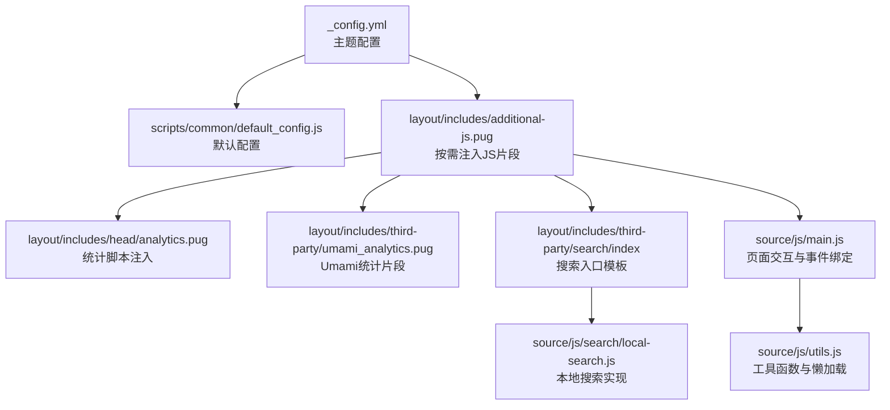
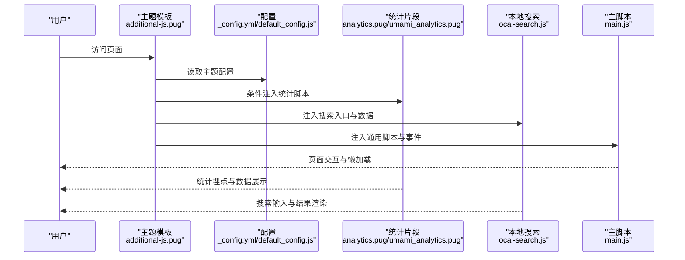
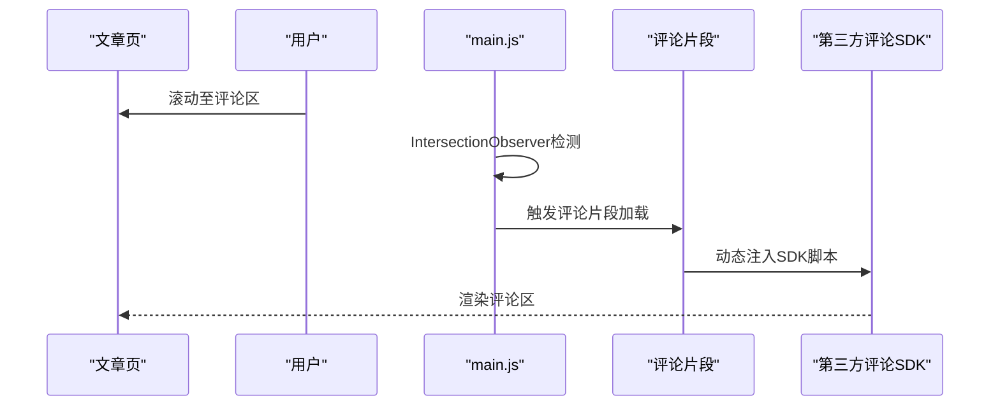
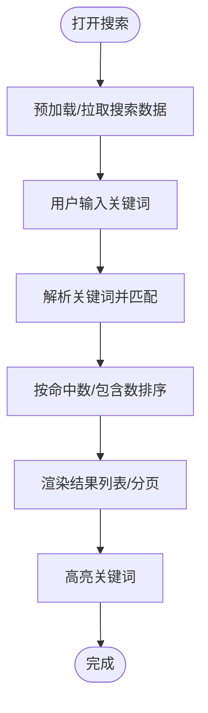
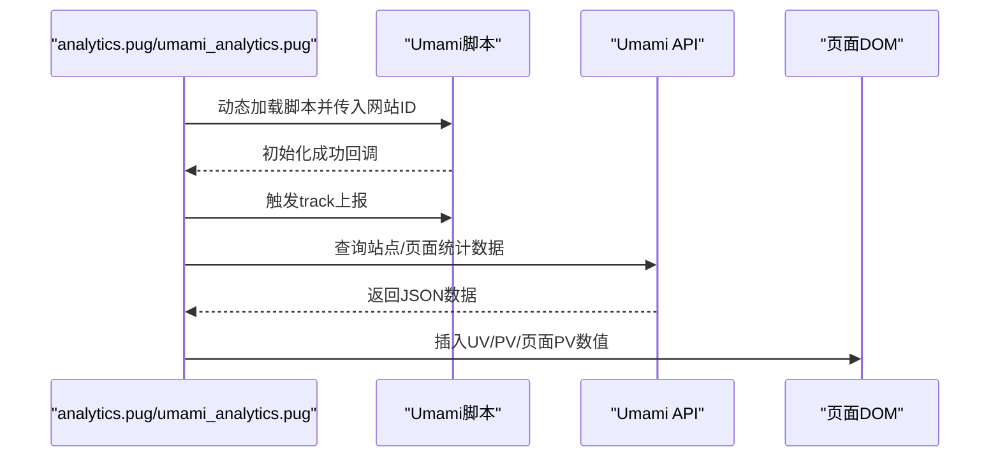
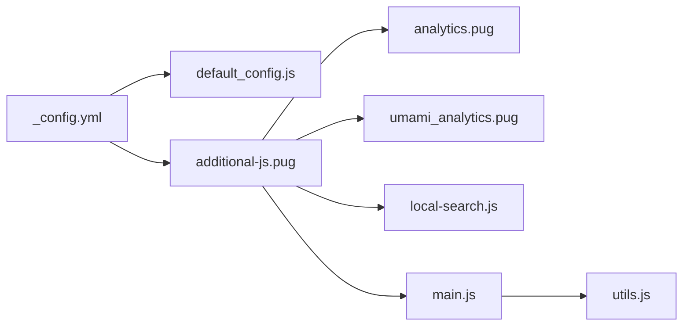

# 第三方集成

<cite>
**本文引用的文件**
- [_config.yml](file://themes/butterfly/_config.yml)
- [plugins.yml](file://themes/butterfly/plugins.yml)
- [default_config.js](file://themes/butterfly/scripts/common/default_config.js)
- [additional-js.pug](file://themes/butterfly/layout/includes/additional-js.pug)
- [analytics.pug](file://themes/butterfly/layout/includes/head/analytics.pug)
- [umami_analytics.pug](file://themes/butterfly/layout/includes/third-party/umami_analytics.pug)
- [local-search.js](file://themes/butterfly/source/js/search/local-search.js)
- [main.js](file://themes/butterfly/source/js/main.js)
- [utils.js](file://themes/butterfly/source/js/utils.js)
</cite>

## 目录
1. [简介](#简介)
2. [项目结构](#项目结构)
3. [核心组件](#核心组件)
4. [架构总览](#架构总览)
5. [详细组件分析](#详细组件分析)
6. [依赖关系分析](#依赖关系分析)
7. [性能考量](#性能考量)
8. [故障排除指南](#故障排除指南)
9. [结论](#结论)
10. [附录](#附录)

## 简介
本文件面向Butterfly主题的第三方服务集成，围绕评论系统、站内搜索、统计分析与社交分享等模块，系统性说明配置项、调用流程、数据处理与隐私设置，并提供扩展新服务与优化性能的实践建议。读者可据此完成第三方服务的接入、定制与维护。

## 项目结构
Butterfly主题通过配置文件集中管理第三方能力开关与参数；模板层按需引入脚本与片段；运行时通过JavaScript在浏览器侧加载与初始化第三方SDK或执行本地逻辑。

图示来源
- [_config.yml](file://themes/butterfly/_config.yml)
- [default_config.js](file://themes/butterfly/scripts/common/default_config.js)
- [additional-js.pug](file://themes/butterfly/layout/includes/additional-js.pug)
- [analytics.pug](file://themes/butterfly/layout/includes/head/analytics.pug)
- [umami_analytics.pug](file://themes/butterfly/layout/includes/third-party/umami_analytics.pug)
- [local-search.js](file://themes/butterfly/source/js/search/local-search.js)
- [main.js](file://themes/butterfly/source/js/main.js)
- [utils.js](file://themes/butterfly/source/js/utils.js)

章节来源
- [_config.yml](file://themes/butterfly/_config.yml)
- [default_config.js](file://themes/butterfly/scripts/common/default_config.js)
- [additional-js.pug](file://themes/butterfly/layout/includes/additional-js.pug)

## 核心组件
- 评论系统：支持多种后端（如Giscus、Waline、Artalk等），通过配置启用、懒加载与切换按钮。
- 搜索功能：提供Algolia、Docsearch与本地搜索三种方案，本地搜索以XML/JSON数据源解析并高亮命中词。
- 统计分析：内置百度统计、Google Analytics、Cloudflare分析、Microsoft Clarity与Umami，支持页面级与站点级指标展示。
- 社交分享：支持Share.js与AddToAny两种方案，可配置分享平台列表。
- 客服聊天：支持Chatra、Tidio、Crisp等，可配置右侧悬浮按钮与显示隐藏策略。
- 广告与验证：支持Google AdSense与站点验证元标签注入。

章节来源
- [_config.yml](file://themes/butterfly/_config.yml)
- [default_config.js](file://themes/butterfly/scripts/common/default_config.js)

## 架构总览
下图展示从配置到页面渲染的关键路径：配置驱动模板片段注入，模板片段再驱动JS脚本加载与初始化。

图示来源
- [additional-js.pug](file://themes/butterfly/layout/includes/additional-js.pug)
- [_config.yml](file://themes/butterfly/_config.yml)
- [default_config.js](file://themes/butterfly/scripts/common/default_config.js)
- [analytics.pug](file://themes/butterfly/layout/includes/head/analytics.pug)
- [umami_analytics.pug](file://themes/butterfly/layout/includes/third-party/umami_analytics.pug)
- [local-search.js](file://themes/butterfly/source/js/search/local-search.js)
- [main.js](file://themes/butterfly/source/js/main.js)

## 详细组件分析

### 评论系统集成
- 支持服务：Disqus/DisqusJS、Livere、Gitalk、Valine、Waline、Utterances、Facebook Comments、Twikoo、Giscus、Remark42、Artalk 等。
- 启用方式：在配置中设置使用的服务列表，可选择是否懒加载、是否显示评论数卡片。
- 懒加载机制：通过工具函数在元素进入视口时触发加载，减少首屏开销。
- 切换与计数：支持在文章页切换不同评论系统，以及在首页/顶部展示评论数。

图示来源
- [main.js](file://themes/butterfly/source/js/main.js)
- [additional-js.pug](file://themes/butterfly/layout/includes/additional-js.pug)
- [_config.yml](file://themes/butterfly/_config.yml)

章节来源
- [_config.yml](file://themes/butterfly/_config.yml)
- [default_config.js](file://themes/butterfly/scripts/common/default_config.js)
- [main.js](file://themes/butterfly/source/js/main.js)
- [utils.js](file://themes/butterfly/source/js/utils.js)

### 搜索功能集成
- 本地搜索：基于XML/JSON数据源，解析标题与正文，按关键词匹配与排序，支持分页与命中高亮。
- Algolia/Docsearch：通过CDN引入SDK，按配置传入索引参数，实现快速检索。
- 数据预加载：可配置在页面加载时预拉取搜索数据，提升首次输入体验。
- 分页与高亮：支持每篇文章最多N条结果，移动端响应式分页，URL高亮参数回显。

图示来源
- [local-search.js](file://themes/butterfly/source/js/search/local-search.js)
- [_config.yml](file://themes/butterfly/_config.yml)

章节来源
- [_config.yml](file://themes/butterfly/_config.yml)
- [local-search.js](file://themes/butterfly/source/js/search/local-search.js)

### 统计分析集成
- 百度统计、Google Analytics、Cloudflare分析、Microsoft Clarity：通过模板注入对应脚本，支持Pjax页面切换时重新上报。
- Umami：支持云版与自托管，动态加载脚本并按需调用track接口；同时提供API查询站点/页面访问量并在DOM中插入数值。
- 令牌与鉴权：Umami根据是否自托管选择不同的鉴权头字段；错误处理保证不影响页面渲染。

图示来源
- [analytics.pug](file://themes/butterfly/layout/includes/head/analytics.pug)
- [umami_analytics.pug](file://themes/butterfly/layout/includes/third-party/umami_analytics.pug)

章节来源
- [_config.yml](file://themes/butterfly/_config.yml)
- [analytics.pug](file://themes/butterfly/layout/includes/head/analytics.pug)
- [umami_analytics.pug](file://themes/butterfly/layout/includes/third-party/umami_analytics.pug)

### 社交分享集成
- Share.js：可配置分享平台列表，支持多平台一键分享。
- AddToAny：提供更丰富的平台集合与样式选项。
- 使用方式：在配置中选择use与具体平台列表，模板按需注入对应脚本与样式。

章节来源
- [_config.yml](file://themes/butterfly/_config.yml)
- [plugins.yml](file://themes/butterfly/plugins.yml)

### 客服聊天集成
- 支持Chatra、Tidio、Crisp，可配置右侧悬浮按钮与滚动显示/隐藏策略。
- 通过模板注入对应SDK脚本，按需初始化聊天组件。

章节来源
- [_config.yml](file://themes/butterfly/_config.yml)
- [additional-js.pug](file://themes/butterfly/layout/includes/additional-js.pug)

### 广告与站点验证
- Google AdSense：可配置自动广告、客户端ID与脚本地址，支持页面级广告位。
- 站点验证：支持在头部注入多个验证meta标签，便于搜索引擎收录校验。

章节来源
- [_config.yml](file://themes/butterfly/_config.yml)
- [additional-js.pug](file://themes/butterfly/layout/includes/additional-js.pug)

## 依赖关系分析
- 配置驱动：_config.yml与default_config.js共同决定功能开关与默认值。
- 模板注入：additional-js.pug根据配置条件性引入各第三方片段与脚本。
- 运行时依赖：main.js负责事件绑定与懒加载；utils.js提供节流/防抖、滚动、动画等通用能力；local-search.js负责搜索逻辑；analytics/umami片段负责统计埋点与数据展示。

图示来源
- [_config.yml](file://themes/butterfly/_config.yml)
- [default_config.js](file://themes/butterfly/scripts/common/default_config.js)
- [additional-js.pug](file://themes/butterfly/layout/includes/additional-js.pug)
- [analytics.pug](file://themes/butterfly/layout/includes/head/analytics.pug)
- [umami_analytics.pug](file://themes/butterfly/layout/includes/third-party/umami_analytics.pug)
- [local-search.js](file://themes/butterfly/source/js/search/local-search.js)
- [main.js](file://themes/butterfly/source/js/main.js)
- [utils.js](file://themes/butterfly/source/js/utils.js)

章节来源
- [_config.yml](file://themes/butterfly/_config.yml)
- [default_config.js](file://themes/butterfly/scripts/common/default_config.js)
- [additional-js.pug](file://themes/butterfly/layout/includes/additional-js.pug)

## 性能考量
- 懒加载策略：评论系统与部分交互组件采用IntersectionObserver在进入视口时加载，降低首屏资源压力。
- 搜索预加载：本地搜索可配置预加载数据，避免首次输入卡顿；同时支持分页与命中高亮，控制DOM节点数量。
- 统计脚本：按需注入，避免不必要的SDK加载；Pjax切换时仅重新上报页面路径，减少重复初始化。
- 工具函数：提供debounce/throttle与滚动百分比计算，优化高频事件处理与UI反馈。
- CDN与版本：plugins.yml统一管理第三方库版本与文件名，便于缓存与升级。

章节来源
- [main.js](file://themes/butterfly/source/js/main.js)
- [utils.js](file://themes/butterfly/source/js/utils.js)
- [local-search.js](file://themes/butterfly/source/js/search/local-search.js)
- [plugins.yml](file://themes/butterfly/plugins.yml)

## 故障排除指南
- 评论系统不显示
  - 检查配置中的服务参数是否正确填写。
  - 若启用懒加载，确认目标容器已进入视口。
  - 查看浏览器控制台是否存在跨域或脚本加载失败。
- 本地搜索无结果
  - 确认搜索数据源路径与格式（XML/JSON）正确。
  - 检查预加载开关与命中高亮配置。
  - 在URL中携带高亮参数验证命中逻辑。
- Umami数据不显示
  - 自托管与云版鉴权头不同，确保token与域名配置正确。
  - 检查API返回状态与数据结构，关注空值或异常分支。
- 统计未上报
  - 确认对应统计ID已配置且未被浏览器拦截。
  - Pjax切换后检查是否重新上报页面路径。
- 广告未展示
  - 检查AdSense客户端ID与脚本地址，确认网络可访问。
  - 确认广告位配置与页面位置。

章节来源
- [_config.yml](file://themes/butterfly/_config.yml)
- [umami_analytics.pug](file://themes/butterfly/layout/includes/third-party/umami_analytics.pug)
- [local-search.js](file://themes/butterfly/source/js/search/local-search.js)
- [analytics.pug](file://themes/butterfly/layout/includes/head/analytics.pug)

## 结论
Butterfly主题通过配置驱动与模板注入的方式，将评论、搜索、统计、分享、客服等第三方能力有机整合。借助懒加载、预加载与Pjax适配等策略，兼顾功能完整性与性能表现。按本文档指引，可快速完成现有服务的配置与优化，并安全地扩展新的第三方服务。

## 附录
- 新增第三方服务的开发指南
  - 在配置文件中新增服务段落与默认值，参考现有结构。
  - 在模板中增加条件性注入片段，确保仅在启用时加载。
  - 在JS侧补充必要的初始化与事件绑定逻辑，必要时复用工具函数。
  - 提供最小化示例与错误兜底，避免阻塞页面渲染。
- 配置参数清单（节选）
  - 评论：comments.use、comments.lazyload、评论服务各自的参数段。
  - 搜索：search.use、local_search.preload、algolia_search.hitsPerPage、docsearch.*。
  - 统计：baidu_analytics、google_analytics、cloudflare_analytics、microsoft_clarity、umami_analytics.*。
  - 分享：share.use、share.sharejs.sites、share.addtoany.item。
  - 客服：chat.use、chat.rightside_button、chat.button_hide_show、chat.*。
  - 广告与验证：google_adsense.*、site_verification。

章节来源
- [_config.yml](file://themes/butterfly/_config.yml)
- [default_config.js](file://themes/butterfly/scripts/common/default_config.js)
- [plugins.yml](file://themes/butterfly/plugins.yml)