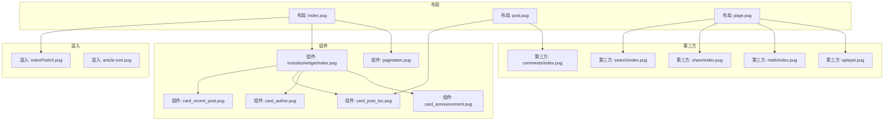
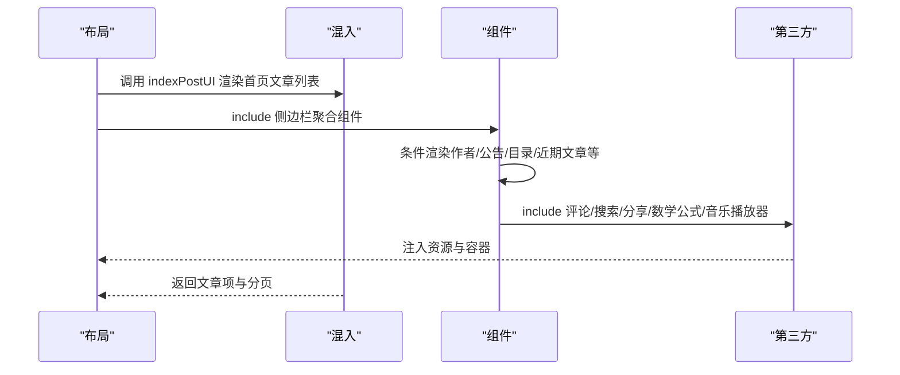
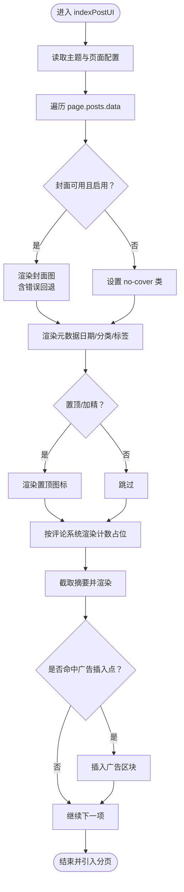
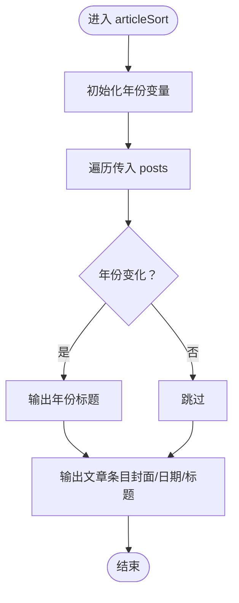
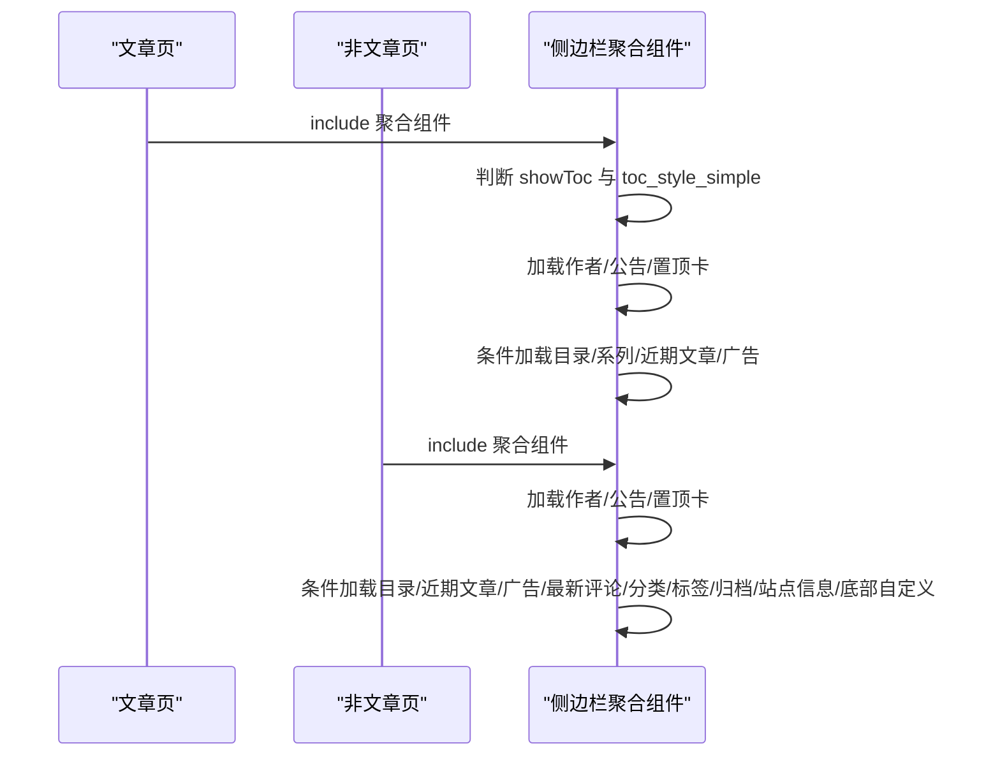
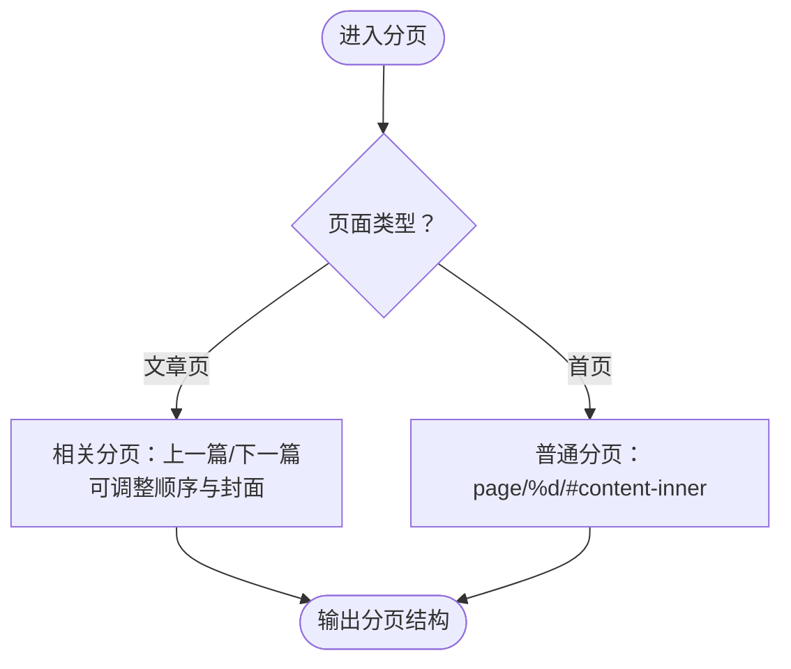
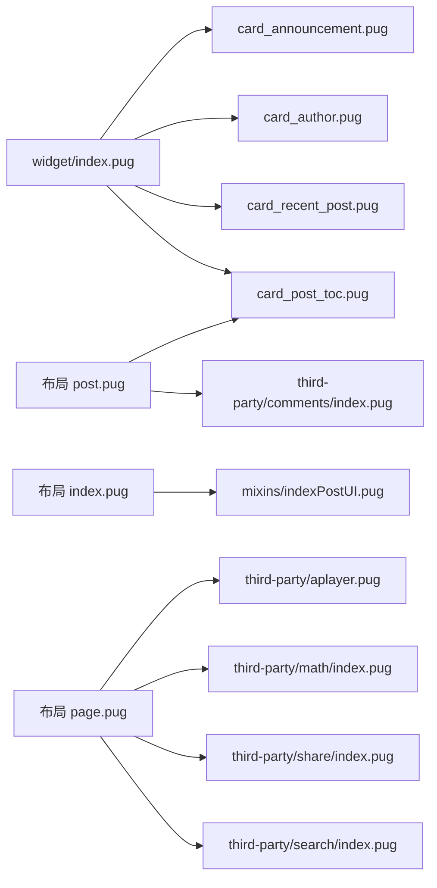

# 组件系统

<cite>
**本文引用的文件**
- [indexPostUI.pug](file://themes/butterfly/layout/includes/mixins/indexPostUI.pug)
- [article-sort.pug](file://themes/butterfly/layout/includes/mixins/article-sort.pug)
- [index.pug（侧边栏组件聚合）](file://themes/butterfly/layout/includes/widget/index.pug)
- [index.pug（头部导航与信息）](file://themes/butterfly/layout/includes/header/index.pug)
- [footer.pug](file://themes/butterfly/layout/includes/footer.pug)
- [card_recent_post.pug](file://themes/butterfly/layout/includes/widget/card_recent_post.pug)
- [card_post_toc.pug](file://themes/butterfly/layout/includes/widget/card_post_toc.pug)
- [card_author.pug](file://themes/butterfly/layout/includes/widget/card_author.pug)
- [card_announcement.pug](file://themes/butterfly/layout/includes/widget/card_announcement.pug)
- [pagination.pug](file://themes/butterfly/layout/includes/pagination.pug)
- [评论组件入口 index.pug](file://themes/butterfly/layout/includes/third-party/comments/index.pug)
- [数学公式组件入口 index.pug](file://themes/butterfly/layout/includes/third-party/math/index.pug)
- [搜索组件入口 index.pug](file://themes/butterfly/layout/includes/third-party/search/index.pug)
- [分享组件入口 index.pug](file://themes/butterfly/layout/includes/third-party/share/index.pug)
- [音乐播放器组件 aplayer.pug](file://themes/butterfly/layout/includes/third-party/aplayer.pug)
</cite>

## 目录
1. [引言](#引言)
2. [项目结构](#项目结构)
3. [核心组件](#核心组件)
4. [架构总览](#架构总览)
5. [详细组件分析](#详细组件分析)
6. [依赖关系分析](#依赖关系分析)
7. [性能考量](#性能考量)
8. [故障排查指南](#故障排查指南)
9. [结论](#结论)
10. [附录：自定义组件开发指南](#附录自定义组件开发指南)

## 引言
本文件系统性梳理 Butterfly 主题的组件体系，聚焦 Pug Mixin 的使用与组件化开发模式，覆盖 UI 组件、功能组件与布局组件的组织方式；详解各组件的功能特性、参数配置与使用方法；阐述组件的复用机制、条件渲染与动态加载；并提供自定义组件的开发指南、性能优化与缓存策略建议，以及实际代码示例路径与组合使用技巧。

## 项目结构
Butterfly 主题采用“布局 + 组件 + 混入”的分层组织方式：
- 布局层：负责页面骨架与全局结构（如头部、侧边栏、页脚、分页等）
- 组件层：可复用的 UI/功能模块（卡片、列表、导航、统计等）
- 混入层：封装可复用的模板片段与逻辑（Mixin），用于在不同布局中统一渲染

图表来源
- [indexPostUI.pug:1-119](file://themes/butterfly/layout/includes/mixins/indexPostUI.pug#L1-L119)
- [article-sort.pug:1-23](file://themes/butterfly/layout/includes/mixins/article-sort.pug#L1-L23)
- [index.pug（侧边栏组件聚合）:1-36](file://themes/butterfly/layout/includes/widget/index.pug#L1-L36)
- [card_recent_post.pug:1-27](file://themes/butterfly/layout/includes/widget/card_recent_post.pug#L1-L27)
- [card_post_toc.pug:1-15](file://themes/butterfly/layout/includes/widget/card_post_toc.pug#L1-L15)
- [card_author.pug:1-27](file://themes/butterfly/layout/includes/widget/card_author.pug#L1-L27)
- [card_announcement.pug:1-6](file://themes/butterfly/layout/includes/widget/card_announcement.pug#L1-L6)
- [pagination.pug:1-38](file://themes/butterfly/layout/includes/pagination.pug#L1-L38)
- [评论组件入口 index.pug:1-47](file://themes/butterfly/layout/includes/third-party/comments/index.pug#L1-L47)
- [数学公式组件入口 index.pug:1-14](file://themes/butterfly/layout/includes/third-party/math/index.pug#L1-L14)
- [搜索组件入口 index.pug:1-7](file://themes/butterfly/layout/includes/third-party/search/index.pug#L1-L7)
- [分享组件入口 index.pug:1-9](file://themes/butterfly/layout/includes/third-party/share/index.pug#L1-L9)
- [音乐播放器组件 aplayer.pug:1-24](file://themes/butterfly/layout/includes/third-party/aplayer.pug#L1-L24)

章节来源
- [indexPostUI.pug:1-119](file://themes/butterfly/layout/includes/mixins/indexPostUI.pug#L1-L119)
- [index.pug（侧边栏组件聚合）:1-36](file://themes/butterfly/layout/includes/widget/index.pug#L1-L36)
- [pagination.pug:1-38](file://themes/butterfly/layout/includes/pagination.pug#L1-L38)

## 核心组件
- 混入（Mixins）
  - indexPostUI：统一首页文章列表渲染，支持多种索引布局、封面图、置顶标记、元数据展示、评论计数占位与广告插入，并包含分页引入
  - articleSort：归档页按年份分组的文章条目渲染，支持封面图与日期显示
- 组件（Widgets）
  - 侧边栏聚合：根据当前页面类型决定加载作者卡、公告、置顶卡、目录、近期文章、广告、分类、标签、归档、站点信息等，并支持缓存
  - 近期文章卡：按更新或发布日期排序，限制数量，支持缩略图与日期
  - 文章目录卡：根据页面或主题配置控制数字编号与展开状态
  - 作者信息卡：头像、名称、简介、统计数据与社交图标
  - 公告卡：展示主题配置的公告内容
- 第三方组件
  - 评论：按主题配置动态渲染多个评论系统容器
  - 数学公式：MathJax/KaTeX/Mermaid/Chart.js 条件加载
  - 搜索：Algolia/本地搜索/Docsearch
  - 分享：AddToAny/Share.js
  - 音乐播放器：APlayer 资源与 PJAX 生命周期集成

章节来源
- [indexPostUI.pug:1-119](file://themes/butterfly/layout/includes/mixins/indexPostUI.pug#L1-L119)
- [article-sort.pug:1-23](file://themes/butterfly/layout/includes/mixins/article-sort.pug#L1-L23)
- [index.pug（侧边栏组件聚合）:1-36](file://themes/butterfly/layout/includes/widget/index.pug#L1-L36)
- [card_recent_post.pug:1-27](file://themes/butterfly/layout/includes/widget/card_recent_post.pug#L1-L27)
- [card_post_toc.pug:1-15](file://themes/butterfly/layout/includes/widget/card_post_toc.pug#L1-L15)
- [card_author.pug:1-27](file://themes/butterfly/layout/includes/widget/card_author.pug#L1-L27)
- [card_announcement.pug:1-6](file://themes/butterfly/layout/includes/widget/card_announcement.pug#L1-L6)
- [评论组件入口 index.pug:1-47](file://themes/butterfly/layout/includes/third-party/comments/index.pug#L1-L47)
- [数学公式组件入口 index.pug:1-14](file://themes/butterfly/layout/includes/third-party/math/index.pug#L1-L14)
- [搜索组件入口 index.pug:1-7](file://themes/butterfly/layout/includes/third-party/search/index.pug#L1-L7)
- [分享组件入口 index.pug:1-9](file://themes/butterfly/layout/includes/third-party/share/index.pug#L1-L9)
- [音乐播放器组件 aplayer.pug:1-24](file://themes/butterfly/layout/includes/third-party/aplayer.pug#L1-L24)

## 架构总览
组件系统通过“混入 + 组件 + 布局”的协作实现高内聚、低耦合的页面构建：
- 布局层负责页面骨架与上下文变量（如 globalPageType、page、site 等）
- 混入层封装可复用的渲染片段与条件逻辑
- 组件层以 partial/include 形式拼装页面区域，支持缓存与条件渲染
- 第三方组件通过主题配置进行按需加载与切换

图表来源
- [indexPostUI.pug:1-119](file://themes/butterfly/layout/includes/mixins/indexPostUI.pug#L1-L119)
- [index.pug（侧边栏组件聚合）:1-36](file://themes/butterfly/layout/includes/widget/index.pug#L1-L36)
- [评论组件入口 index.pug:1-47](file://themes/butterfly/layout/includes/third-party/comments/index.pug#L1-L47)
- [搜索组件入口 index.pug:1-7](file://themes/butterfly/layout/includes/third-party/search/index.pug#L1-L7)
- [分享组件入口 index.pug:1-9](file://themes/butterfly/layout/includes/third-party/share/index.pug#L1-L9)
- [数学公式组件入口 index.pug:1-14](file://themes/butterfly/layout/includes/third-party/math/index.pug#L1-L14)
- [音乐播放器组件 aplayer.pug:1-24](file://themes/butterfly/layout/includes/third-party/aplayer.pug#L1-L24)

## 详细组件分析

### 混入：indexPostUI（首页文章列表）
- 功能特性
  - 支持多种索引布局（含瀑布流类名控制）
  - 封面图渲染与错误回退
  - 置顶/加精标记
  - 文章元数据（创建/更新时间、分类、标签）
  - 评论计数占位与多评论系统适配
  - 文章摘要截断
  - 广告位按索引位置插入
  - 引入分页组件
- 参数与上下文
  - 读取主题配置与页面上下文（如 page.posts.data、globalPageType）
  - 使用工具函数（如 url_for、date、_p、postDesc 等）
- 复用与条件渲染
  - 通过主题开关控制封面、元数据、评论计数等模块
  - 不同评论系统使用不同的占位与数据属性
- 性能与缓存
  - 仅在需要时加载评论计数脚本，避免无谓请求
  - 列表渲染为纯前端循环，复杂度 O(n)

图表来源
- [indexPostUI.pug:1-119](file://themes/butterfly/layout/includes/mixins/indexPostUI.pug#L1-L119)

章节来源
- [indexPostUI.pug:1-119](file://themes/butterfly/layout/includes/mixins/indexPostUI.pug#L1-L119)

### 混入：articleSort（归档页文章分组）
- 功能特性
  - 按年份分组输出文章条目
  - 支持封面图与日期显示
  - 无封面时应用 no-article-cover 类
- 使用场景
  - 归档页按年份折叠展示文章列表

图表来源
- [article-sort.pug:1-23](file://themes/butterfly/layout/includes/mixins/article-sort.pug#L1-L23)

章节来源
- [article-sort.pug:1-23](file://themes/butterfly/layout/includes/mixins/article-sort.pug#L1-L23)

### 组件：侧边栏聚合（widget/index.pug）
- 功能特性
  - 根据页面类型（文章页/非文章页）选择加载的卡片集合
  - 支持缓存（partial 的 cache 选项）
  - 目录卡片在文章页按主题配置决定是否简单样式
  - 支持系列卡片、最新评论、分类、标签、归档、站点信息等
- 条件渲染
  - showToc 控制目录卡片显示
  - 各卡片通过主题开关控制启用/禁用

图表来源
- [index.pug（侧边栏组件聚合）:1-36](file://themes/butterfly/layout/includes/widget/index.pug#L1-L36)

章节来源
- [index.pug（侧边栏组件聚合）:1-36](file://themes/butterfly/layout/includes/widget/index.pug#L1-L36)

### 组件：近期文章卡（card_recent_post.pug）
- 功能特性
  - 从全站文章中排序并限制数量
  - 支持按更新时间或发布时间排序
  - 可选封面图与日期显示
- 参数
  - limit：显示数量
  - sort：排序字段（updated/date）

章节来源
- [card_recent_post.pug:1-27](file://themes/butterfly/layout/includes/widget/card_recent_post.pug#L1-L27)

### 组件：文章目录卡（card_post_toc.pug）
- 功能特性
  - 根据页面或主题配置控制编号与展开
  - 对加密文章隐藏目录内容
- 参数
  - toc_number：是否显示编号
  - toc_expand：是否默认展开

章节来源
- [card_post_toc.pug:1-15](file://themes/butterfly/layout/includes/widget/card_post_toc.pug#L1-L15)

### 组件：作者信息卡（card_author.pug）
- 功能特性
  - 展示头像、名称、简介
  - 统计文章、标签、分类数量
  - 可选按钮与社交图标
- 参数
  - 描述、按钮开关、链接、图标、文本

章节来源
- [card_author.pug:1-27](file://themes/butterfly/layout/includes/widget/card_author.pug#L1-L27)

### 组件：公告卡（card_announcement.pug）
- 功能特性
  - 展示主题配置的公告内容
- 参数
  - enable 开关与 content 内容

章节来源
- [card_announcement.pug:1-6](file://themes/butterfly/layout/includes/widget/card_announcement.pug#L1-L6)

### 组件：分页（pagination.pug）
- 功能特性
  - 支持首页分页与文章页相关分页
  - 文章页支持前后顺序调整与描述显示控制
  - 首页使用 paginator 辅助
- 参数
  - 主题配置：post_pagination、pagination_cover 等

图表来源
- [pagination.pug:1-38](file://themes/butterfly/layout/includes/pagination.pug#L1-L38)

章节来源
- [pagination.pug:1-38](file://themes/butterfly/layout/includes/pagination.pug#L1-L38)

### 第三方：评论组件入口（comments/index.pug）
- 功能特性
  - 根据主题配置动态渲染多个评论系统的容器
  - 支持评论系统切换 UI
- 参数
  - theme.comments.use：启用的评论系统数组

章节来源
- [评论组件入口 index.pug:1-47](file://themes/butterfly/layout/includes/third-party/comments/index.pug#L1-L47)

### 第三方：数学公式组件入口（math/index.pug）
- 功能特性
  - MathJax/KaTeX/Mermaid/Chart.js 按需加载
  - 支持 per_page 或页面级开关
- 参数
  - theme.math.use、theme.mermaid.enable、theme.chartjs.enable

章节来源
- [数学公式组件入口 index.pug:1-14](file://themes/butterfly/layout/includes/third-party/math/index.pug#L1-L14)

### 第三方：搜索组件入口（search/index.pug）
- 功能特性
  - Algolia/本地搜索/Docsearch 三选一
- 参数
  - theme.search.use

章节来源
- [搜索组件入口 index.pug:1-7](file://themes/butterfly/layout/includes/third-party/search/index.pug#L1-L7)

### 第三方：分享组件入口（share/index.pug）
- 功能特性
  - AddToAny/Share.js 容器注入
- 参数
  - theme.share.use

章节来源
- [分享组件入口 index.pug:1-9](file://themes/butterfly/layout/includes/third-party/share/index.pug#L1-L9)

### 第三方：音乐播放器（aplayer.pug）
- 功能特性
  - 资源异步加载与 PJAX 生命周期钩子
  - 销毁非固定实例，完成 Meting 初始化
- 参数
  - theme.asset.aplayer_css/js、theme.asset.meting_js、theme.pjax.enable

章节来源
- [音乐播放器组件 aplayer.pug:1-24](file://themes/butterfly/layout/includes/third-party/aplayer.pug#L1-L24)

## 依赖关系分析
- 组件耦合
  - 侧边栏聚合组件对各卡片组件存在直接依赖（include/partial）
  - 文章页目录卡依赖页面内容（toc 函数）与主题配置
  - 首页文章列表依赖主题配置与工具函数
- 外部依赖
  - 第三方组件依赖主题配置与资源路径
  - 分页组件依赖 Hexo 提供的 paginator 工具
- 缓存策略
  - 侧边栏聚合组件广泛使用 partial 的 cache 选项，减少重复渲染开销

图表来源
- [index.pug（侧边栏组件聚合）:1-36](file://themes/butterfly/layout/includes/widget/index.pug#L1-L36)
- [card_recent_post.pug:1-27](file://themes/butterfly/layout/includes/widget/card_recent_post.pug#L1-L27)
- [card_post_toc.pug:1-15](file://themes/butterfly/layout/includes/widget/card_post_toc.pug#L1-L15)
- [card_author.pug:1-27](file://themes/butterfly/layout/includes/widget/card_author.pug#L1-L27)
- [card_announcement.pug:1-6](file://themes/butterfly/layout/includes/widget/card_announcement.pug#L1-L6)
- [indexPostUI.pug:1-119](file://themes/butterfly/layout/includes/mixins/indexPostUI.pug#L1-L119)
- [评论组件入口 index.pug:1-47](file://themes/butterfly/layout/includes/third-party/comments/index.pug#L1-L47)
- [搜索组件入口 index.pug:1-7](file://themes/butterfly/layout/includes/third-party/search/index.pug#L1-L7)
- [分享组件入口 index.pug:1-9](file://themes/butterfly/layout/includes/third-party/share/index.pug#L1-L9)
- [数学公式组件入口 index.pug:1-14](file://themes/butterfly/layout/includes/third-party/math/index.pug#L1-L14)
- [音乐播放器组件 aplayer.pug:1-24](file://themes/butterfly/layout/includes/third-party/aplayer.pug#L1-L24)

## 性能考量
- 渲染层面
  - 使用 partial 的 cache 选项缓存静态/半静态组件，降低重复计算
  - 混入中的条件判断避免不必要的 DOM 生成
- 资源层面
  - 第三方组件按需加载（per_page/page 级开关），减少首屏负担
  - 音乐播放器在 PJAX 中销毁非固定实例，避免内存泄漏
- 数据层面
  - 近期文章卡对全站文章进行排序与限制，建议合理设置 limit 与排序策略

## 故障排查指南
- 评论计数不显示
  - 检查主题配置 comments.use 是否包含对应系统
  - 确认目标页面已正确引入评论容器
- 封面图不显示或报错
  - 检查主题开关 cover.index_enable/cover.aside_enable
  - 确认 url_for 解析与错误回退路径
- 目录不显示
  - 检查 toc_number/toc_expand 配置
  - 加密文章会隐藏目录内容，请确认页面加密状态
- 分页异常
  - 首页分页格式需匹配主题配置的分页路径格式
  - 文章页分页顺序可通过主题配置调整

章节来源
- [indexPostUI.pug:1-119](file://themes/butterfly/layout/includes/mixins/indexPostUI.pug#L1-L119)
- [card_post_toc.pug:1-15](file://themes/butterfly/layout/includes/widget/card_post_toc.pug#L1-L15)
- [pagination.pug:1-38](file://themes/butterfly/layout/includes/pagination.pug#L1-L38)

## 结论
Butterfly 主题通过混入与组件的清晰分层，实现了高度可配置、可扩展的页面构建能力。借助条件渲染、缓存与按需加载策略，系统在保证灵活性的同时兼顾性能。开发者可基于现有模式快速扩展新的 UI/功能组件，并通过主题配置实现灵活的组合与定制。

## 附录：自定义组件开发指南
- 新建组件
  - 在 includes/widget 下创建新组件文件（如 my_component.pug）
  - 在布局或聚合组件中通过 include/partial 引入
- 参数传递
  - 通过调用方上下文传入数据（如 theme.xxx、page.xxx、site.xxx）
  - 在组件内部使用局部变量接收并做条件判断
- 样式定制
  - 在对应 Stylus 文件中新增样式规则，遵循现有命名规范
  - 如需全局样式，可在 _global 或 var.styl 中扩展
- 缓存与性能
  - 对静态/半静态组件使用 partial 的 cache 选项
  - 对复杂计算使用工具函数或在数据层预处理
- 示例路径参考
  - [近期文章卡:1-27](file://themes/butterfly/layout/includes/widget/card_recent_post.pug#L1-L27)
  - [侧边栏聚合:1-36](file://themes/butterfly/layout/includes/widget/index.pug#L1-L36)
  - [首页文章列表混入:1-119](file://themes/butterfly/layout/includes/mixins/indexPostUI.pug#L1-L119)
  - [分页组件:1-38](file://themes/butterfly/layout/includes/pagination.pug#L1-L38)