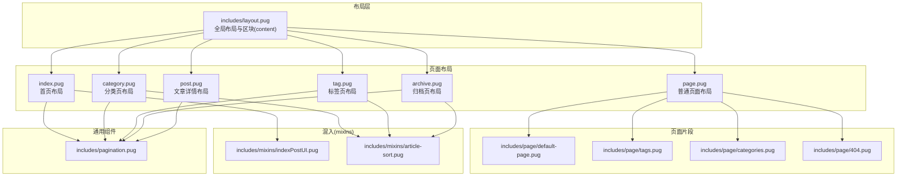
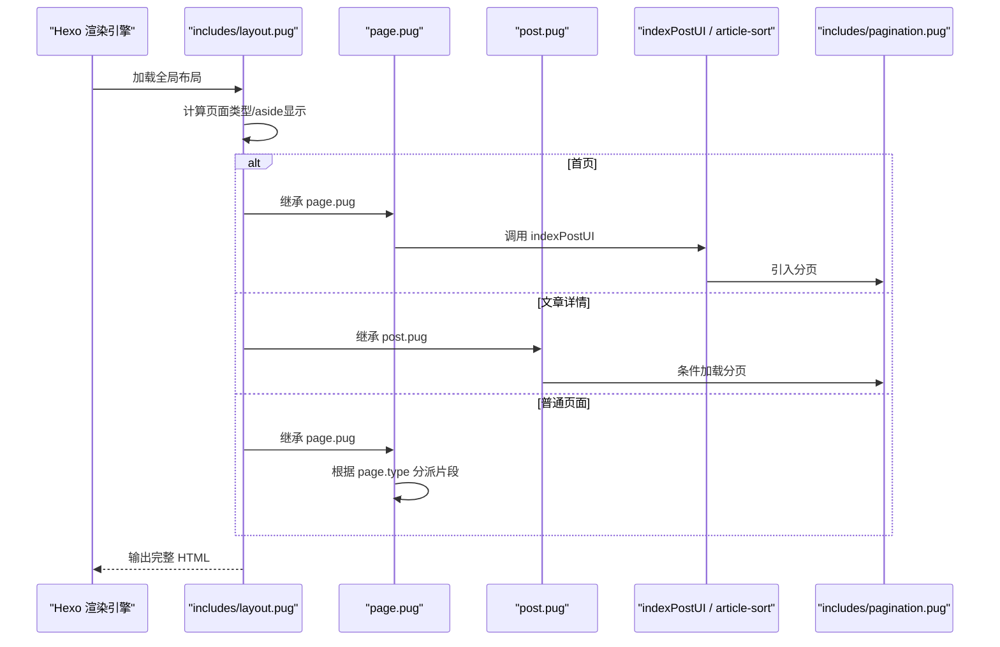
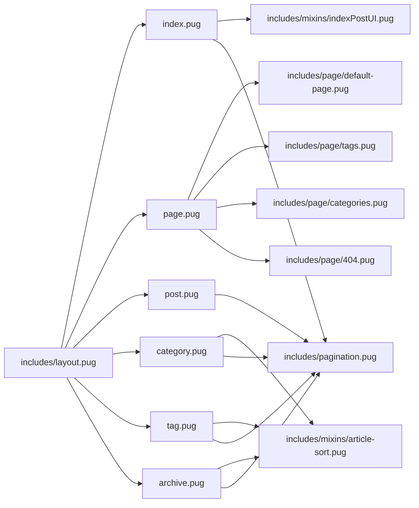

# 页面模板

<cite>
**本文引用的文件**
- [themes/butterfly/layout/includes/layout.pug](file://themes/butterfly/layout/includes/layout.pug)
- [themes/butterfly/layout/index.pug](file://themes/butterfly/layout/index.pug)
- [themes/butterfly/layout/page.pug](file://themes/butterfly/layout/page.pug)
- [themes/butterfly/layout/post.pug](file://themes/butterfly/layout/post.pug)
- [themes/butterfly/layout/category.pug](file://themes/butterfly/layout/category.pug)
- [themes/butterfly/layout/tag.pug](file://themes/butterfly/layout/tag.pug)
- [themes/butterfly/layout/archive.pug](file://themes/butterfly/layout/archive.pug)
- [themes/butterfly/layout/includes/page/default-page.pug](file://themes/butterfly/layout/includes/page/default-page.pug)
- [themes/butterfly/layout/includes/page/tags.pug](file://themes/butterfly/layout/includes/page/tags.pug)
- [themes/butterfly/layout/includes/page/categories.pug](file://themes/butterfly/layout/includes/page/categories.pug)
- [themes/butterfly/layout/includes/page/404.pug](file://themes/butterfly/layout/includes/page/404.pug)
- [themes/butterfly/layout/includes/mixins/indexPostUI.pug](file://themes/butterfly/layout/includes/mixins/indexPostUI.pug)
- [themes/butterfly/layout/includes/mixins/article-sort.pug](file://themes/butterfly/layout/includes/mixins/article-sort.pug)
- [themes/butterfly/layout/includes/pagination.pug](file://themes/butterfly/layout/includes/pagination.pug)
- [themes/butterfly/_config.yml](file://themes/butterfly/_config.yml)
</cite>

## 目录
1. [简介](#简介)
2. [项目结构](#项目结构)
3. [核心组件](#核心组件)
4. [架构总览](#架构总览)
5. [详细组件分析](#详细组件分析)
6. [依赖分析](#依赖分析)
7. [性能考虑](#性能考虑)
8. [故障排查指南](#故障排查指南)
9. [结论](#结论)
10. [附录](#附录)

## 简介
本文件系统性梳理 Butterfly 主题的页面模板体系，覆盖首页、文章详情页、普通页面（含标签页、分类页、友链页、说说页、404页）、归档页与分类/标签页的模板结构、变量使用、数据获取与内容渲染流程。文档同时解释模板继承关系、block 定义与内容注入机制，并提供自定义页面模板的开发指南、性能与 SEO 优化策略以及最佳实践。

## 项目结构
Butterfly 的页面模板采用 Pug 模板引擎，通过“布局 + 片段 + mixin”的分层组织方式实现高内聚低耦合的可扩展结构。核心入口布局位于 includes/layout.pug，各页面类型通过独立的 layout/*.pug 文件继承该布局，并在 block content 中注入具体页面片段或 mixin。

图表来源
- [themes/butterfly/layout/includes/layout.pug:1-59](file://themes/butterfly/layout/includes/layout.pug#L1-L59)
- [themes/butterfly/layout/index.pug:1-5](file://themes/butterfly/layout/index.pug#L1-L5)
- [themes/butterfly/layout/page.pug:1-32](file://themes/butterfly/layout/page.pug#L1-L32)
- [themes/butterfly/layout/post.pug:1-36](file://themes/butterfly/layout/post.pug#L1-L36)
- [themes/butterfly/layout/category.pug:1-12](file://themes/butterfly/layout/category.pug#L1-L12)
- [themes/butterfly/layout/tag.pug:1-12](file://themes/butterfly/layout/tag.pug#L1-L12)
- [themes/butterfly/layout/archive.pug:1-8](file://themes/butterfly/layout/archive.pug#L1-L8)
- [themes/butterfly/layout/includes/page/default-page.pug:1-2](file://themes/butterfly/layout/includes/page/default-page.pug#L1-L2)
- [themes/butterfly/layout/includes/page/tags.pug:1-3](file://themes/butterfly/layout/includes/page/tags.pug#L1-L3)
- [themes/butterfly/layout/includes/page/categories.pug:1-1](file://themes/butterfly/layout/includes/page/categories.pug#L1-L1)
- [themes/butterfly/layout/includes/page/404.pug:1-9](file://themes/butterfly/layout/includes/page/404.pug#L1-L9)
- [themes/butterfly/layout/includes/mixins/indexPostUI.pug:1-119](file://themes/butterfly/layout/includes/mixins/indexPostUI.pug#L1-L119)
- [themes/butterfly/layout/includes/mixins/article-sort.pug:1-23](file://themes/butterfly/layout/includes/mixins/article-sort.pug#L1-L23)
- [themes/butterfly/layout/includes/pagination.pug:1-38](file://themes/butterfly/layout/includes/pagination.pug#L1-L38)

章节来源
- [themes/butterfly/layout/includes/layout.pug:1-59](file://themes/butterfly/layout/includes/layout.pug#L1-L59)
- [themes/butterfly/layout/index.pug:1-5](file://themes/butterfly/layout/index.pug#L1-L5)
- [themes/butterfly/layout/page.pug:1-32](file://themes/butterfly/layout/page.pug#L1-L32)
- [themes/butterfly/layout/post.pug:1-36](file://themes/butterfly/layout/post.pug#L1-L36)
- [themes/butterfly/layout/category.pug:1-12](file://themes/butterfly/layout/category.pug#L1-L12)
- [themes/butterfly/layout/tag.pug:1-12](file://themes/butterfly/layout/tag.pug#L1-L12)
- [themes/butterfly/layout/archive.pug:1-8](file://themes/butterfly/layout/archive.pug#L1-L8)

## 核心组件
- 全局布局 includes/layout.pug：负责生成 HTML 结构、注入头部、侧边栏、主体内容区、页脚与右侧控制按钮；根据 page 与 is_home 推导页面类型，设置 aside 显示策略与 body/content 区块选择。
- 首页 index.pug：继承全局布局，在 content 区引入首页专用 mixin，渲染最近文章列表。
- 普通页面 page.pug：继承全局布局，根据 page.type 分派到不同页面片段（默认页、标签云、分类列表、友链、说说、404），并按需加载评论组件。
- 文章详情 post.pug：继承全局布局，渲染文章标题信息、正文、版权、标签分享、打赏、广告位、分页、相关文章与评论。
- 分类/标签/归档页：分别继承全局布局，支持两种 UI 模式（首页风格或归档排序风格），使用 mixin 渲染文章列表与分页。
- 混入与片段：indexPostUI 提供首页文章卡片渲染；article-sort 提供按年份/月份归档排序；分页组件统一处理首页与文章分页。
- 配置中心 _config.yml：集中管理首页布局、封面开关、文章元信息、侧边栏卡片、评论系统、搜索、统计、广告等大量运行时参数。

章节来源
- [themes/butterfly/layout/includes/layout.pug:1-59](file://themes/butterfly/layout/includes/layout.pug#L1-L59)
- [themes/butterfly/layout/includes/mixins/indexPostUI.pug:1-119](file://themes/butterfly/layout/includes/mixins/indexPostUI.pug#L1-L119)
- [themes/butterfly/layout/includes/mixins/article-sort.pug:1-23](file://themes/butterfly/layout/includes/mixins/article-sort.pug#L1-L23)
- [themes/butterfly/layout/includes/pagination.pug:1-38](file://themes/butterfly/layout/includes/pagination.pug#L1-L38)
- [themes/butterfly/_config.yml:1-1140](file://themes/butterfly/_config.yml#L1-L1140)

## 架构总览
下图展示页面模板从“请求触发”到“最终渲染”的端到端流程，强调模板继承、区块注入与数据流。

图表来源
- [themes/butterfly/layout/includes/layout.pug:1-59](file://themes/butterfly/layout/includes/layout.pug#L1-L59)
- [themes/butterfly/layout/page.pug:1-32](file://themes/butterfly/layout/page.pug#L1-L32)
- [themes/butterfly/layout/post.pug:1-36](file://themes/butterfly/layout/post.pug#L1-L36)
- [themes/butterfly/layout/includes/mixins/indexPostUI.pug:1-119](file://themes/butterfly/layout/includes/mixins/indexPostUI.pug#L1-L119)
- [themes/butterfly/layout/includes/mixins/article-sort.pug:1-23](file://themes/butterfly/layout/includes/mixins/article-sort.pug#L1-L23)
- [themes/butterfly/layout/includes/pagination.pug:1-38](file://themes/butterfly/layout/includes/pagination.pug#L1-L38)

## 详细组件分析

### 首页模板（index.pug）
- 继承关系：index.pug 仅包含一个 block content，其中引入首页专用 mixin，实现统一的首页文章卡片渲染。
- 数据与变量：使用 page.posts.data 获取文章集合；通过 theme.index_layout 控制布局样式；通过 theme.cover.index_enable 控制封面显示。
- 渲染逻辑：循环输出每篇文章的封面、标题、日期、分类、标签、评论数摘要与简介；支持 Masonry 布局；最后引入分页组件。
- 可定制点：index_layout、index_post_content.method/length、cover.index_enable、post_meta.page.*、ad.index。

章节来源
- [themes/butterfly/layout/index.pug:1-5](file://themes/butterfly/layout/index.pug#L1-L5)
- [themes/butterfly/layout/includes/mixins/indexPostUI.pug:1-119](file://themes/butterfly/layout/includes/mixins/indexPostUI.pug#L1-L119)
- [themes/butterfly/layout/includes/pagination.pug:1-38](file://themes/butterfly/layout/includes/pagination.pug#L1-L38)
- [themes/butterfly/_config.yml:108-111](file://themes/butterfly/_config.yml#L108-L111)
- [themes/butterfly/_config.yml:170-190](file://themes/butterfly/_config.yml#L170-L190)

### 文章详情页模板（post.pug）
- 继承关系：post.pug 同样继承全局布局，内容区直接渲染文章详情。
- 数据与变量：使用 page.* 字段（如 title、content、tags、updated/date 等）；通过 theme.post_meta.post.* 控制元信息显示；通过 theme.post_pagination、theme.related_post、theme.reward、theme.ad.* 控制功能开关。
- 渲染逻辑：顶部可选显示文章信息；正文区域条件渲染过期提示；版权、标签分享、打赏、广告位；分页与相关文章；最后按需加载评论组件。
- 可定制点：post_meta.post.*、toc、post_copyright、post_pagination、related_post、reward、ad.post、comments.use。

章节来源
- [themes/butterfly/layout/post.pug:1-36](file://themes/butterfly/layout/post.pug#L1-L36)
- [themes/butterfly/_config.yml:194-255](file://themes/butterfly/_config.yml#L194-L255)

### 普通页面模板（page.pug）
- 继承关系：page.pug 继承全局布局，通过 page.type 判断页面类型并分派到对应片段。
- 分派逻辑：tags → 标签云；link → 友链；categories → 分类列表；404 → 404 页面；shuoshuo → 说说；default → 默认页面（直接输出 page.content）。
- 评论加载：除特定类型外，默认加载评论组件；通过 commentsJsLoad 标记避免重复加载。
- 可定制点：page.type、comments.use、aside 显示策略、各页面片段样式。

章节来源
- [themes/butterfly/layout/page.pug:1-32](file://themes/butterfly/layout/page.pug#L1-L32)
- [themes/butterfly/layout/includes/page/default-page.pug:1-2](file://themes/butterfly/layout/includes/page/default-page.pug#L1-L2)
- [themes/butterfly/layout/includes/page/tags.pug:1-3](file://themes/butterfly/layout/includes/page/tags.pug#L1-L3)
- [themes/butterfly/layout/includes/page/categories.pug:1-1](file://themes/butterfly/layout/includes/page/categories.pug#L1-L1)
- [themes/butterfly/layout/includes/page/404.pug:1-9](file://themes/butterfly/layout/includes/page/404.pug#L1-L9)

### 分类页模板（category.pug）
- 继承关系：category.pug 继承全局布局。
- UI 模式：当 theme.category_ui == 'index' 时，使用首页 mixin 渲染；否则使用 article-sort mixin，按年份/月份排序展示文章列表，并引入分页。
- 数据与变量：page.category、page.posts。
- 可定制点：category_ui、post_meta.page.*、cover.archives_enable。

章节来源
- [themes/butterfly/layout/category.pug:1-12](file://themes/butterfly/layout/category.pug#L1-L12)
- [themes/butterfly/layout/includes/mixins/article-sort.pug:1-23](file://themes/butterfly/layout/includes/mixins/article-sort.pug#L1-L23)
- [themes/butterfly/_config.yml:780-784](file://themes/butterfly/_config.yml#L780-L784)

### 标签页模板（tag.pug）
- 继承关系：tag.pug 继承全局布局。
- UI 模式：当 theme.tag_ui == 'index' 时，使用首页 mixin；否则使用 article-sort mixin，展示文章列表与分页。
- 数据与变量：page.tag、page.posts。
- 可定制点：tag_ui、post_meta.page.*、cover.archives_enable。

章节来源
- [themes/butterfly/layout/tag.pug:1-12](file://themes/butterfly/layout/tag.pug#L1-L12)
- [themes/butterfly/layout/includes/mixins/article-sort.pug:1-23](file://themes/butterfly/layout/includes/mixins/article-sort.pug#L1-L23)
- [themes/butterfly/_config.yml:780-784](file://themes/butterfly/_config.yml#L780-L784)

### 归档页模板（archive.pug）
- 继承关系：archive.pug 继承全局布局。
- 渲染逻辑：使用 article-sort mixin 展示文章列表，标题显示文章总数统计；引入分页。
- 数据与变量：page.posts、getArchiveLength()。
- 可定制点：post_meta.page.*、cover.archives_enable。

章节来源
- [themes/butterfly/layout/archive.pug:1-8](file://themes/butterfly/layout/archive.pug#L1-L8)
- [themes/butterfly/layout/includes/mixins/article-sort.pug:1-23](file://themes/butterfly/layout/includes/mixins/article-sort.pug#L1-L23)

### 首页 mixin（indexPostUI）
- 功能：统一渲染首页文章卡片，支持多种布局（左右交替、封面置顶、瀑布流等），按需显示封面、标题、日期、分类、标签、评论计数与简介。
- 关键变量：theme.index_layout、theme.cover.index_enable、theme.post_meta.page.*、theme.ad.index。
- 性能注意：瀑布流布局通过类名控制；评论计数按评论系统类型分支注入，避免不必要加载。

章节来源
- [themes/butterfly/layout/includes/mixins/indexPostUI.pug:1-119](file://themes/butterfly/layout/includes/mixins/indexPostUI.pug#L1-L119)
- [themes/butterfly/_config.yml:170-190](file://themes/butterfly/_config.yml#L170-L190)

### 归档排序 mixin（article-sort）
- 功能：按年份分组展示文章列表，支持封面与标题、日期、时间戳等字段渲染。
- 关键变量：theme.cover.archives_enable、date_xml、date、full_date。
- 使用场景：分类/标签/归档页的统一排序展示。

章节来源
- [themes/butterfly/layout/includes/mixins/article-sort.pug:1-23](file://themes/butterfly/layout/includes/mixins/article-sort.pug#L1-L23)
- [themes/butterfly/_config.yml:98-106](file://themes/butterfly/_config.yml#L98-L106)

### 分页组件（pagination）
- 功能：统一处理首页分页与文章分页（上一篇/下一篇），支持格式化链接与描述文本。
- 关键变量：globalPageType、theme.post_pagination、page.*、paginator。
- 使用场景：首页、分类/标签/归档页、文章详情页。

章节来源
- [themes/butterfly/layout/includes/pagination.pug:1-38](file://themes/butterfly/layout/includes/pagination.pug#L1-L38)
- [themes/butterfly/_config.yml:242-242](file://themes/butterfly/_config.yml#L242-L242)

## 依赖分析
- 模板继承链：所有页面布局均继承 includes/layout.pug，后者再依赖 head、sidebar、footer、rightside 等子片段。
- 模块耦合：首页与归档页共享 mixin；分页组件被多处复用；page.pug 通过 page.type 与片段解耦。
- 外部依赖：评论系统、统计脚本、广告脚本通过 partial 注入；部分功能依赖 Hexo 辅助函数（如 url_for、date_xml、paginator 等）。

图表来源
- [themes/butterfly/layout/includes/layout.pug:1-59](file://themes/butterfly/layout/includes/layout.pug#L1-L59)
- [themes/butterfly/layout/index.pug:1-5](file://themes/butterfly/layout/index.pug#L1-L5)
- [themes/butterfly/layout/page.pug:1-32](file://themes/butterfly/layout/page.pug#L1-L32)
- [themes/butterfly/layout/post.pug:1-36](file://themes/butterfly/layout/post.pug#L1-L36)
- [themes/butterfly/layout/category.pug:1-12](file://themes/butterfly/layout/category.pug#L1-L12)
- [themes/butterfly/layout/tag.pug:1-12](file://themes/butterfly/layout/tag.pug#L1-L12)
- [themes/butterfly/layout/archive.pug:1-8](file://themes/butterfly/layout/archive.pug#L1-L8)
- [themes/butterfly/layout/includes/mixins/indexPostUI.pug:1-119](file://themes/butterfly/layout/includes/mixins/indexPostUI.pug#L1-L119)
- [themes/butterfly/layout/includes/mixins/article-sort.pug:1-23](file://themes/butterfly/layout/includes/mixins/article-sort.pug#L1-L23)
- [themes/butterfly/layout/includes/pagination.pug:1-38](file://themes/butterfly/layout/includes/pagination.pug#L1-L38)
- [themes/butterfly/layout/includes/page/default-page.pug:1-2](file://themes/butterfly/layout/includes/page/default-page.pug#L1-L2)
- [themes/butterfly/layout/includes/page/tags.pug:1-3](file://themes/butterfly/layout/includes/page/tags.pug#L1-L3)
- [themes/butterfly/layout/includes/page/categories.pug:1-1](file://themes/butterfly/layout/includes/page/categories.pug#L1-L1)
- [themes/butterfly/layout/includes/page/404.pug:1-9](file://themes/butterfly/layout/includes/page/404.pug#L1-L9)

## 性能考虑
- 减少不必要的 DOM 与脚本加载
  - 首页瀑布流与封面显示由 theme.index_layout 与 theme.cover.index_enable 控制，避免在不需要时渲染封面与瀑布流。
  - 文章详情页的分页、相关文章、打赏、广告位均受配置控制，建议仅在需要时开启。
- 评论系统懒加载
  - page.pug 与 post.pug 中对评论组件的加载条件判断，避免在不支持或禁用评论时加载脚本。
- 分页与长列表
  - 归档/分类/标签页使用 article-sort mixin，结合分页组件减少单页渲染压力。
- 缓存与静态资源
  - partial 调用支持缓存参数，有助于减少重复渲染成本。
- 图片与错误回退
  - 封面图片错误时使用回退图，减少异常渲染开销。

章节来源
- [themes/butterfly/layout/includes/mixins/indexPostUI.pug:1-119](file://themes/butterfly/layout/includes/mixins/indexPostUI.pug#L1-L119)
- [themes/butterfly/layout/includes/mixins/article-sort.pug:1-23](file://themes/butterfly/layout/includes/mixins/article-sort.pug#L1-L23)
- [themes/butterfly/layout/includes/pagination.pug:1-38](file://themes/butterfly/layout/includes/pagination.pug#L1-L38)
- [themes/butterfly/layout/page.pug:1-32](file://themes/butterfly/layout/page.pug#L1-L32)
- [themes/butterfly/layout/post.pug:1-36](file://themes/butterfly/layout/post.pug#L1-L36)

## 故障排查指南
- 404 页面未生效
  - 检查 page.type 是否正确传递；确认 includes/page/404.pug 片段存在且路径正确。
- 评论未显示
  - 确认 page.comments !== false 且 theme.comments.use 已配置；检查 commentsJsLoad 标记是否被正确赋值。
- 分类/标签/归档页无文章
  - 检查 page.posts 是否为空；确认 theme.category_ui/tag_ui 与 UI 模式一致；核对文章与分类/标签关联。
- 首页瀑布流不生效
  - 检查 theme.index_layout 是否为 6/7；确认 theme.cover.index_enable 开启。
- 分页不显示
  - 确认 page.total !== 1；检查 paginator 配置与分页链接格式。

章节来源
- [themes/butterfly/layout/includes/page/404.pug:1-9](file://themes/butterfly/layout/includes/page/404.pug#L1-L9)
- [themes/butterfly/layout/page.pug:1-32](file://themes/butterfly/layout/page.pug#L1-L32)
- [themes/butterfly/layout/post.pug:1-36](file://themes/butterfly/layout/post.pug#L1-L36)
- [themes/butterfly/layout/category.pug:1-12](file://themes/butterfly/layout/category.pug#L1-L12)
- [themes/butterfly/layout/tag.pug:1-12](file://themes/butterfly/layout/tag.pug#L1-L12)
- [themes/butterfly/layout/archive.pug:1-8](file://themes/butterfly/layout/archive.pug#L1-L8)
- [themes/butterfly/layout/includes/pagination.pug:1-38](file://themes/butterfly/layout/includes/pagination.pug#L1-L38)

## 结论
Butterfly 的页面模板系统以“布局 + 片段 + mixin + 分页”的组合实现高度模块化与可扩展性。通过统一的全局布局与清晰的继承关系，开发者可以快速扩展新的页面类型或修改既有模板。配合配置中心的丰富参数，可在不改动代码的前提下完成大量外观与功能调整。建议在自定义时遵循现有命名规范与数据约定，确保与主题其他模块的兼容性。

## 附录

### 自定义页面模板开发指南
- 新增页面类型步骤
  - 在 layout/ 下新增页面布局文件（如 mytype.pug），继承 includes/layout.pug 并在 block content 中注入所需片段或 mixin。
  - 在 includes/page/ 下新增对应片段（如 includes/page/mytype.pug），用于渲染具体内容。
  - 在 page.pug 的 case 分支中添加新类型映射，确保 page.type 能正确分派。
  - 如需分页，引入 includes/pagination.pug；如需 mixin，引入相应文件。
- 修改现有模板
  - 首页：调整 includes/mixins/indexPostUI.pug 的布局与字段显示；通过 _config.yml 调整 index_layout、index_post_content 等。
  - 文章详情：在 post.pug 中增删版权、打赏、广告、分页与相关文章模块；通过 _config.yml 控制开关。
  - 分类/标签/归档：在 category.pug/tag.pug/archive.pug 中切换 UI 模式；或直接使用 mixin 控制展示细节。
  - 普通页面：在 page.pug 中扩展 case 分支；在 includes/page/ 下新增片段并按需加载评论。

章节来源
- [themes/butterfly/layout/page.pug:1-32](file://themes/butterfly/layout/page.pug#L1-L32)
- [themes/butterfly/layout/includes/page/default-page.pug:1-2](file://themes/butterfly/layout/includes/page/default-page.pug#L1-L2)
- [themes/butterfly/layout/includes/mixins/indexPostUI.pug:1-119](file://themes/butterfly/layout/includes/mixins/indexPostUI.pug#L1-L119)
- [themes/butterfly/layout/includes/mixins/article-sort.pug:1-23](file://themes/butterfly/layout/includes/mixins/article-sort.pug#L1-L23)
- [themes/butterfly/layout/includes/pagination.pug:1-38](file://themes/butterfly/layout/includes/pagination.pug#L1-L38)
- [themes/butterfly/_config.yml:170-190](file://themes/butterfly/_config.yml#L170-L190)

### SEO 优化策略
- 标题与描述
  - 使用 page.title 与 page.description（若可用）作为页面标题与描述，确保搜索引擎抓取准确信息。
- 结构化数据
  - 在 includes/head/structured_data.pug 中按需注入结构化数据片段，提升搜索结果丰富度。
- 图片与封面
  - 为文章与页面设置合适的封面图，并在模板中正确回退至错误图，避免 404 导致的 SEO 问题。
- 分页与去重
  - 正确使用分页组件，避免重复内容与索引分散；在首页与归档页设置合理的分页链接格式。
- 评论与社交
  - 通过 comments.use 与 share.use 集成社交分享与评论，提升用户互动与传播。

章节来源
- [themes/butterfly/layout/includes/head/structured_data.pug](file://themes/butterfly/layout/includes/head/structured_data.pug)
- [themes/butterfly/layout/includes/mixins/indexPostUI.pug:1-119](file://themes/butterfly/layout/includes/mixins/indexPostUI.pug#L1-L119)
- [themes/butterfly/layout/includes/pagination.pug:1-38](file://themes/butterfly/layout/includes/pagination.pug#L1-L38)
- [themes/butterfly/_config.yml:532-548](file://themes/butterfly/_config.yml#L532-L548)
- [themes/butterfly/_config.yml:513-527](file://themes/butterfly/_config.yml#L513-L527)