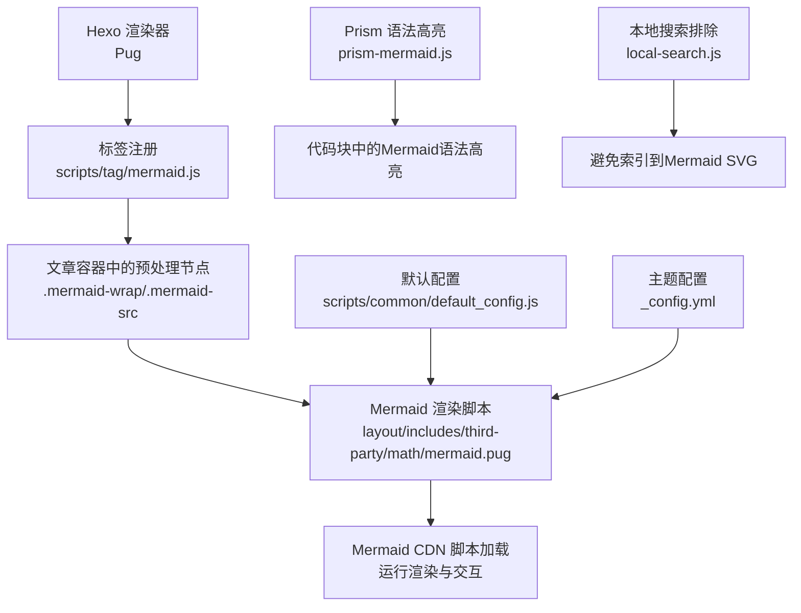
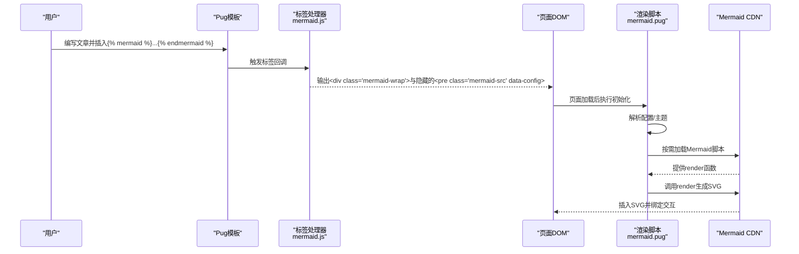
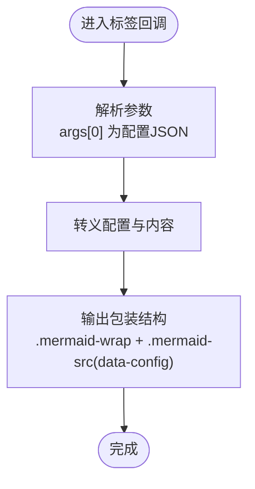
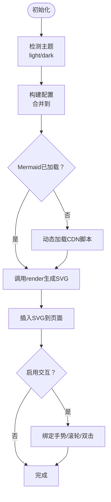
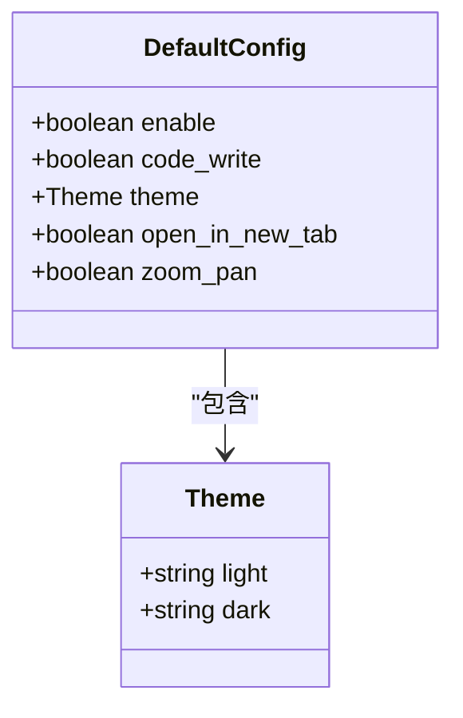
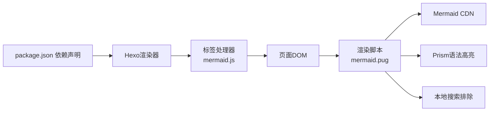

# Mermaid流程图标签

<cite>
**本文引用的文件**
- [mermaid.js](file://themes/butterfly/scripts/tag/mermaid.js)
- [mermaid.pug](file://themes/butterfly/layout/includes/third-party/math/mermaid.pug)
- [default_config.js](file://themes/butterfly/scripts/common/default_config.js)
- [_config.yml](file://themes/butterfly/_config.yml)
- [package.json](file://themes/butterfly/package.json)
- [prism-mermaid.js](file://node_modules/prismjs/components/prism-mermaid.js)
- [local-search.js](file://public/js/search/local-search.js)
</cite>

## 目录
1. [简介](#简介)
2. [项目结构](#项目结构)
3. [核心组件](#核心组件)
4. [架构总览](#架构总览)
5. [详细组件分析](#详细组件分析)
6. [依赖分析](#依赖分析)
7. [性能考量](#性能考量)
8. [故障排查指南](#故障排查指南)
9. [结论](#结论)
10. [附录](#附录)

## 简介
本文件面向在 Hexo 博客主题 Butterfly 中使用 Mermaid 流程图标签的用户与开发者，系统性讲解以下内容：
- Mermaid 标签的集成方式与渲染机制
- 流程图、时序图、甘特图等复杂图表的创建方法与语法要点
- 配置参数（启用开关、主题、缩放平移、新窗口查看等）
- 在系统设计、算法演示、项目管理等场景中的应用示例
- JavaScript 依赖关系与交互功能（手势缩放、双击复位、新窗口查看）
- 样式定制与最佳实践

## 项目结构
围绕 Mermaid 的关键文件分布如下：
- 标签注册：scripts/tag/mermaid.js
- 渲染与交互：layout/includes/third-party/math/mermaid.pug
- 默认配置：scripts/common/default_config.js
- 主题配置入口：themes/butterfly/_config.yml
- 依赖声明：themes/butterfly/package.json
- 语法高亮支持：node_modules/prismjs/components/prism-mermaid.js
- 搜索排除：public/js/search/local-search.js

**图表来源**
- [mermaid.js:11-18](file://themes/butterfly/scripts/tag/mermaid.js#L11-L18)
- [mermaid.pug:311-323](file://themes/butterfly/layout/includes/third-party/math/mermaid.pug#L311-L323)
- [default_config.js:520-529](file://themes/butterfly/scripts/common/default_config.js#L520-L529)
- [_config.yml:1-20](file://themes/butterfly/_config.yml#L1-L20)

**章节来源**
- [mermaid.js:1-19](file://themes/butterfly/scripts/tag/mermaid.js#L1-L19)
- [mermaid.pug:1-324](file://themes/butterfly/layout/includes/third-party/math/mermaid.pug#L1-L324)
- [default_config.js:515-602](file://themes/butterfly/scripts/common/default_config.js#L515-L602)
- [_config.yml:1-800](file://themes/butterfly/_config.yml#L1-L800)
- [package.json:1-35](file://themes/butterfly/package.json#L1-L35)
- [prism-mermaid.js:1-200](file://node_modules/prismjs/components/prism-mermaid.js#L1-L200)
- [local-search.js:220-230](file://public/js/search/local-search.js#L220-L230)

## 核心组件
- 标签注册与输出
  - 使用自定义标签将 Mermaid 定义文本包裹为隐藏的预处理节点，并注入配置参数，供前端渲染脚本读取。
- 渲染与交互脚本
  - 动态加载 Mermaid CDN，按需渲染，支持主题切换、手势缩放、双击复位、新窗口查看等交互。
- 默认配置与主题配置
  - 提供默认开关、主题(light/dark)、交互行为等配置项；可通过主题配置覆盖。

**章节来源**
- [mermaid.js:11-18](file://themes/butterfly/scripts/tag/mermaid.js#L11-L18)
- [mermaid.pug:261-293](file://themes/butterfly/layout/includes/third-party/math/mermaid.pug#L261-L293)
- [default_config.js:520-529](file://themes/butterfly/scripts/common/default_config.js#L520-L529)
- [_config.yml:1-20](file://themes/butterfly/_config.yml#L1-L20)

## 架构总览
从标签到渲染的完整流程如下：

**图表来源**
- [mermaid.js:11-18](file://themes/butterfly/scripts/tag/mermaid.js#L11-L18)
- [mermaid.pug:311-323](file://themes/butterfly/layout/includes/third-party/math/mermaid.pug#L311-L323)
- [mermaid.pug:261-293](file://themes/butterfly/layout/includes/third-party/math/mermaid.pug#L261-L293)

## 详细组件分析

### 标签注册与输出（scripts/tag/mermaid.js）
- 功能：注册名为 mermaid 的标签，接收一个可选的 JSON 配置字符串作为参数，将内容安全转义后放入隐藏的预处理节点中，便于前端统一读取。
- 关键点：
  - 使用 HTML 转义防止 XSS。
  - 通过 data-config 注入配置，前端解析后合并到渲染配置中。
  - 标签为结束型标签，支持多行 Mermaid 定义。

**图表来源**
- [mermaid.js:11-18](file://themes/butterfly/scripts/tag/mermaid.js#L11-L18)

**章节来源**
- [mermaid.js:1-19](file://themes/butterfly/scripts/tag/mermaid.js#L1-L19)

### 渲染与交互脚本（layout/includes/third-party/math/mermaid.pug）
- 功能概览：
  - 将代码块中的 Mermaid 代码转换为预处理节点（可选）。
  - 动态加载 Mermaid CDN 并渲染，支持主题切换、手势缩放、双击复位、新窗口查看。
  - 兼容 Mermaid v9/v10 的渲染接口差异。
- 关键流程：
  - 初始化：根据主题选择 light/dark 主题，拼装 %%{init: ...}%% 配置。
  - 渲染：调用 mermaid.render，插入 SVG 到页面。
  - 交互：绑定指针事件、滚轮缩放、双击复位、附加“在新窗口打开”按钮。
- 交互细节：
  - 支持单指拖动平移、双指捏合缩放、滚轮缩放。
  - 复位：双击恢复初始 viewBox。
  - 新窗口：点击按钮克隆 SVG，注入背景色以适配当前主题，弹出新窗口展示。

**图表来源**
- [mermaid.pug:261-293](file://themes/butterfly/layout/includes/third-party/math/mermaid.pug#L261-L293)
- [mermaid.pug:113-259](file://themes/butterfly/layout/includes/third-party/math/mermaid.pug#L113-L259)
- [mermaid.pug:34-102](file://themes/butterfly/layout/includes/third-party/math/mermaid.pug#L34-L102)

**章节来源**
- [mermaid.pug:1-324](file://themes/butterfly/layout/includes/third-party/math/mermaid.pug#L1-L324)

### 配置参数与主题设置
- 默认配置（default_config.js）：
  - enable：是否启用 Mermaid
  - code_write：是否自动将代码块中的 Mermaid 转换为预处理节点
  - theme.light/dark：默认主题
  - open_in_new_tab：是否显示“在新窗口打开”按钮
  - zoom_pan：是否启用缩放与平移
- 主题配置（_config.yml）：
  - 与主题配置项对齐，可在站点配置中开启/关闭及调整行为。

**图表来源**
- [default_config.js:520-529](file://themes/butterfly/scripts/common/default_config.js#L520-L529)

**章节来源**
- [default_config.js:515-602](file://themes/butterfly/scripts/common/default_config.js#L515-L602)
- [_config.yml:1-20](file://themes/butterfly/_config.yml#L1-L20)

### 语法高亮与搜索排除
- Prism 语法高亮：提供 Mermaid 语言高亮支持，便于在代码块中编写与阅读语法。
- 搜索排除：本地搜索逻辑会跳过 .mermaid 容器内的节点，避免将 SVG 内容索引进搜索结果。

**章节来源**
- [prism-mermaid.js:1-200](file://node_modules/prismjs/components/prism-mermaid.js#L1-L200)
- [local-search.js:220-230](file://public/js/search/local-search.js#L220-L230)

## 依赖分析
- 运行时依赖
  - Mermaid CDN：由渲染脚本按需加载，提供渲染函数与主题能力。
  - 主题切换：通过读取根元素的主题属性决定 light/dark 主题。
- 构建与打包
  - 主题包管理：package.json 中声明渲染器与工具依赖，Mermaid 本身通过 CDN 引入。
- 第三方集成
  - Prism：提供语法高亮；本地搜索：排除 SVG 内容。

**图表来源**
- [package.json:25-30](file://themes/butterfly/package.json#L25-L30)
- [mermaid.js:11-18](file://themes/butterfly/scripts/tag/mermaid.js#L11-L18)
- [mermaid.pug:311-323](file://themes/butterfly/layout/includes/third-party/math/mermaid.pug#L311-L323)
- [prism-mermaid.js:1-200](file://node_modules/prismjs/components/prism-mermaid.js#L1-L200)
- [local-search.js:220-230](file://public/js/search/local-search.js#L220-L230)

**章节来源**
- [package.json:1-35](file://themes/butterfly/package.json#L1-L35)
- [mermaid.pug:311-323](file://themes/butterfly/layout/includes/third-party/math/mermaid.pug#L311-L323)

## 性能考量
- 按需加载：仅在存在 .mermaid-wrap 容器时才加载 Mermaid 脚本，减少首屏开销。
- 渲染兼容：兼容 v9/v10 接口差异，避免重复渲染与错误。
- 交互优化：手势缩放采用指针事件与滚轮监听，限制最小/最大视窗比例，避免过度放大导致性能问题。
- 搜索性能：排除 SVG 节点，降低搜索索引体积与检索成本。

[本节为通用建议，不直接分析具体文件]

## 故障排查指南
- 图表未渲染
  - 检查标签是否正确闭合，确认输出了 .mermaid-wrap 与 .mermaid-src 节点。
  - 确认配置中已启用 Mermaid 或在主题配置中开启。
- 主题不生效
  - 确认根元素 data-theme 属性是否正确，渲染脚本据此选择 light/dark。
- 交互无效
  - 确认 zoom_pan 已启用；检查浏览器控制台是否有脚本报错。
- 新窗口按钮不可见
  - 确认 open_in_new_tab 已启用。
- 搜索结果异常
  - 检查本地搜索是否排除了 .mermaid 容器。

**章节来源**
- [mermaid.js:11-18](file://themes/butterfly/scripts/tag/mermaid.js#L11-L18)
- [mermaid.pug:261-293](file://themes/butterfly/layout/includes/third-party/math/mermaid.pug#L261-L293)
- [default_config.js:520-529](file://themes/butterfly/scripts/common/default_config.js#L520-L529)
- [local-search.js:220-230](file://public/js/search/local-search.js#L220-L230)

## 结论
通过标签注册与前端渲染脚本的协同，Butterfly 主题实现了对 Mermaid 的灵活集成与丰富的交互体验。合理配置主题与交互参数，可在系统设计、算法演示、项目管理等场景中高效呈现复杂图表。建议结合 Prism 语法高亮与搜索排除策略，进一步提升写作与检索体验。

[本节为总结性内容，不直接分析具体文件]

## 附录

### Mermaid 语法与图表类型速览
- 流程图（flowchart）
  - 适合描述线性或分支流程，节点连接清晰。
- 时序图（sequenceDiagram）
  - 适合展示对象间消息传递与时间顺序。
- 甘特图（gantt）
  - 适合展示项目进度与时程安排。
- 其他常用类型
  - 状态图、类图、实体关系图、需求图等。

[本节为通用概念说明，不直接分析具体文件]

### 使用示例场景
- 系统设计：使用流程图与状态图描述模块交互与状态变迁。
- 算法演示：用时序图展示数据结构操作步骤。
- 项目管理：用甘特图规划任务周期与里程碑。

[本节为通用场景说明，不直接分析具体文件]

### 样式定制与交互
- 主题定制：通过配置 light/dark 主题，适配站点整体风格。
- 交互增强：启用缩放与平移，支持双击复位；必要时在新窗口查看高清 SVG。
- 代码高亮：借助 Prism 的 Mermaid 语法高亮，提升可读性。

**章节来源**
- [default_config.js:520-529](file://themes/butterfly/scripts/common/default_config.js#L520-L529)
- [prism-mermaid.js:1-200](file://node_modules/prismjs/components/prism-mermaid.js#L1-L200)
- [mermaid.pug:113-259](file://themes/butterfly/layout/includes/third-party/math/mermaid.pug#L113-L259)