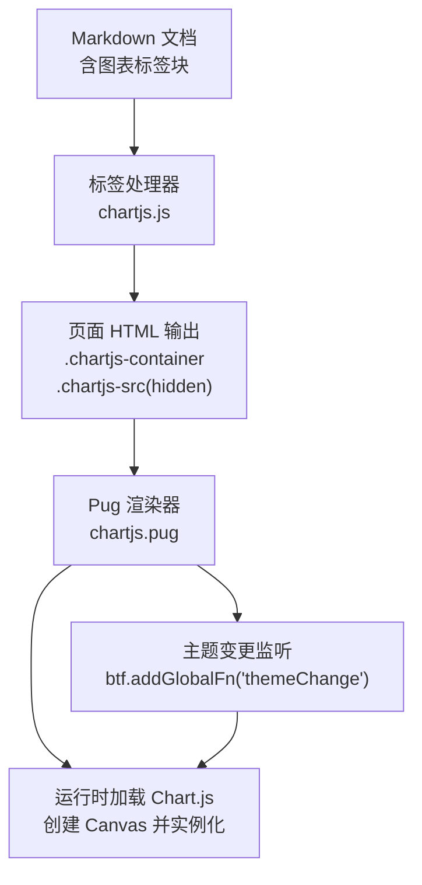
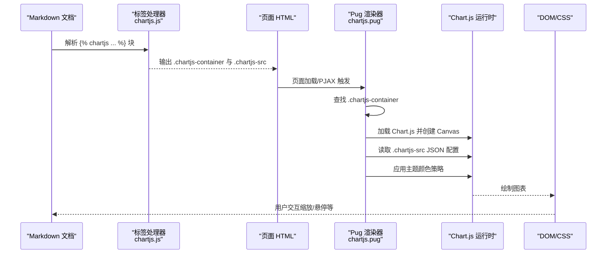
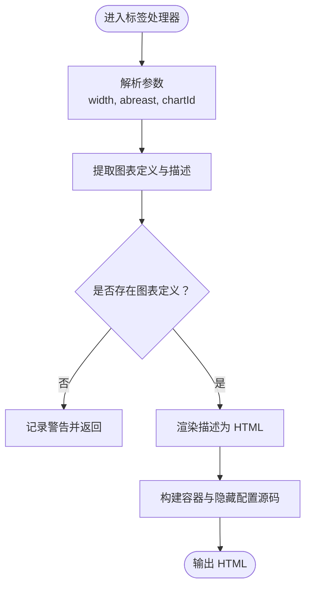
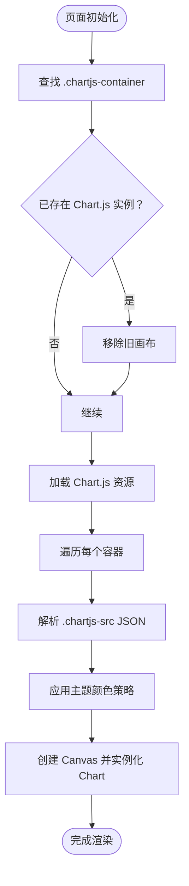
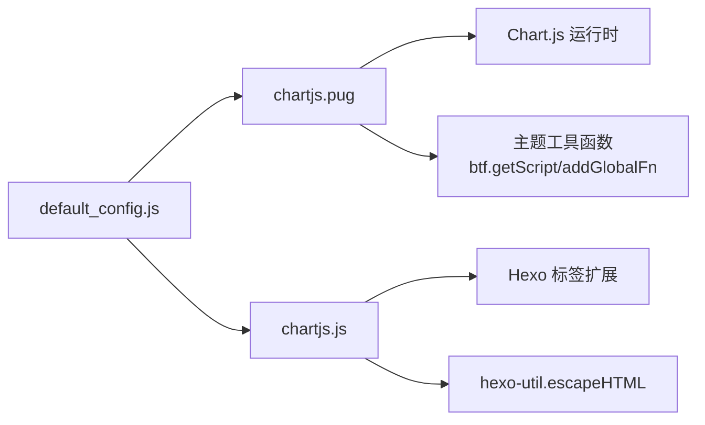

# 图表标签

<cite>
**本文引用的文件**
- [chartjs.js](file://themes/butterfly/scripts/tag/chartjs.js)
- [chartjs.pug](file://themes/butterfly/layout/includes/third-party/math/chartjs.pug)
- [default_config.js](file://themes/butterfly/scripts/common/default_config.js)
- [_config.yml](file://themes/butterfly/_config.yml)
- [package.json](file://themes/butterfly/package.json)
</cite>

## 目录
1. [简介](#简介)
2. [项目结构](#项目结构)
3. [核心组件](#核心组件)
4. [架构总览](#架构总览)
5. [详细组件分析](#详细组件分析)
6. [依赖关系分析](#依赖关系分析)
7. [性能考虑](#性能考虑)
8. [故障排查指南](#故障排查指南)
9. [结论](#结论)
10. [附录](#附录)

## 简介
本文件面向使用 Hexo 主题 Butterfly 的用户与开发者，系统化讲解“图表标签”（Chart.js）的使用方法与实现原理。内容涵盖：
- 标签语法与参数说明
- 支持的图表类型与配置要点
- 数据可视化在数据分析、统计展示、趋势分析中的应用思路
- JavaScript 集成与动态渲染机制
- 样式定制与深浅色主题适配
- 性能优化与浏览器兼容性建议

## 项目结构
图表标签功能由三部分协同完成：
- 标签处理器：负责解析 Markdown 中的图表标签块，提取配置与图表定义，输出容器与隐藏的配置源码
- Pug 渲染器：负责在页面中按需加载 Chart.js 并执行渲染，支持主题切换时的重新渲染
- 默认配置：提供图表默认颜色与主题变量，便于统一风格

**图表来源**
- [chartjs.js:17-49](file://themes/butterfly/scripts/tag/chartjs.js#L17-L49)
- [chartjs.pug:35-91](file://themes/butterfly/layout/includes/third-party/math/chartjs.pug#L35-L91)

**章节来源**
- [chartjs.js:17-49](file://themes/butterfly/scripts/tag/chartjs.js#L17-L49)
- [chartjs.pug:35-91](file://themes/butterfly/layout/includes/third-party/math/chartjs.pug#L35-L91)
- [default_config.js:530-544](file://themes/butterfly/scripts/common/default_config.js#L530-L544)

## 核心组件
- 标签处理器（chartjs.js）
  - 解析标签块内的图表定义与描述
  - 提供宽度、并排布局、自定义 ID 等参数
  - 输出隐藏的配置源码与可选描述区域
- Pug 渲染器（chartjs.pug）
  - 在 DOMContentLoaded 或 PJAX 后自动查找容器并渲染
  - 动态加载 Chart.js 资源
  - 应用深浅色主题的颜色策略
  - 监听主题切换事件以重建图表
- 默认配置（default_config.js）
  - 定义图表字体色、边框色、刻度背景色等主题变量
  - 控制图表标签功能开关

**章节来源**
- [chartjs.js:17-49](file://themes/butterfly/scripts/tag/chartjs.js#L17-L49)
- [chartjs.pug:35-91](file://themes/butterfly/layout/includes/third-party/math/chartjs.pug#L35-L91)
- [default_config.js:530-544](file://themes/butterfly/scripts/common/default_config.js#L530-L544)

## 架构总览
图表标签从 Markdown 到可视化的完整流程如下：

**图表来源**
- [chartjs.js:17-49](file://themes/butterfly/scripts/tag/chartjs.js#L17-L49)
- [chartjs.pug:35-91](file://themes/butterfly/layout/includes/third-party/math/chartjs.pug#L35-L91)

## 详细组件分析

### 标签处理器（chartjs.js）
- 功能要点
  - 提取图表定义与可选描述
  - 支持参数：宽度百分比、并排布局、自定义图表 ID
  - 输出隐藏的配置源码，避免影响页面渲染
- 关键行为
  - 若未找到图表定义则记录警告并跳过
  - 将描述内容以 Markdown 方式渲染为 HTML 插入容器
  - 根据参数动态添加类名与内联样式

**图表来源**
- [chartjs.js:17-49](file://themes/butterfly/scripts/tag/chartjs.js#L17-L49)

**章节来源**
- [chartjs.js:17-49](file://themes/butterfly/scripts/tag/chartjs.js#L17-L49)

### Pug 渲染器（chartjs.pug）
- 功能要点
  - 自动发现页面中的图表容器
  - 按需加载 Chart.js 资源
  - 读取隐藏的配置源码并实例化图表
  - 主题切换时自动重建图表
- 主题适配
  - 通过全局默认值与递归遍历策略，自动为配置对象注入深浅色主题变量
- 动态渲染
  - 支持 DOMContentLoaded 与 PJAX 场景
  - 避免重复渲染：若已有同 ID 的画布则先移除再创建

**图表来源**
- [chartjs.pug:35-91](file://themes/butterfly/layout/includes/third-party/math/chartjs.pug#L35-L91)

**章节来源**
- [chartjs.pug:35-91](file://themes/butterfly/layout/includes/third-party/math/chartjs.pug#L35-L91)

### 默认配置（default_config.js）
- 关键项
  - chartjs.enable：控制是否启用图表标签功能
  - chartjs.fontColor / borderColor / scale_ticks_backdropColor：深浅主题颜色映射
- 使用方式
  - 在主题配置中开启后，Pug 渲染器会读取这些变量并应用到图表默认样式与配置对象

**章节来源**
- [default_config.js:530-544](file://themes/butterfly/scripts/common/default_config.js#L530-L544)

## 依赖关系分析
- 标签处理器依赖 Hexo 的标签扩展机制与工具函数
- Pug 渲染器依赖 Chart.js 资源与主题工具函数
- 主题配置提供颜色与开关控制

**图表来源**
- [chartjs.js:15-16](file://themes/butterfly/scripts/tag/chartjs.js#L15-L16)
- [chartjs.pug:79-91](file://themes/butterfly/layout/includes/third-party/math/chartjs.pug#L79-L91)
- [default_config.js:530-544](file://themes/butterfly/scripts/common/default_config.js#L530-L544)

**章节来源**
- [chartjs.js:15-16](file://themes/butterfly/scripts/tag/chartjs.js#L15-L16)
- [chartjs.pug:79-91](file://themes/butterfly/layout/includes/third-party/math/chartjs.pug#L79-L91)
- [default_config.js:530-544](file://themes/butterfly/scripts/common/default_config.js#L530-L544)

## 性能考虑
- 按需加载
  - Pug 渲染器仅在存在图表容器时才加载 Chart.js，避免无谓资源消耗
- 避免重复渲染
  - 若检测到同 ID 画布已存在，则先移除再创建，减少内存占用
- 主题切换
  - 通过全局回调在主题切换时重建图表，保证视觉一致性
- 建议
  - 合理控制图表数量与复杂度，避免一次性渲染过多图表
  - 对于大数据集，优先采用分页或懒加载策略

**章节来源**
- [chartjs.pug:35-91](file://themes/butterfly/layout/includes/third-party/math/chartjs.pug#L35-L91)

## 故障排查指南
- 图表不显示
  - 检查是否正确使用标签块与包含图表定义
  - 确认主题配置中已开启图表标签功能
  - 查看浏览器控制台是否存在 Chart.js 加载失败
- 图表颜色异常
  - 确认主题变量配置是否正确
  - 检查是否存在覆盖配置导致颜色未生效
- 主题切换后图表未更新
  - 确认主题切换回调是否注册成功
  - 检查是否存在自定义脚本阻止了回调执行

**章节来源**
- [chartjs.js:29-32](file://themes/butterfly/scripts/tag/chartjs.js#L29-L32)
- [chartjs.pug:79-91](file://themes/butterfly/layout/includes/third-party/math/chartjs.pug#L79-L91)
- [default_config.js:530-544](file://themes/butterfly/scripts/common/default_config.js#L530-L544)

## 结论
图表标签通过“标签处理器 + Pug 渲染器 + 主题配置”的组合，在 Hexo 生态中实现了开箱即用的图表可视化能力。其按需加载、主题适配与动态渲染机制，既保证了易用性，也兼顾了性能与可维护性。

## 附录

### 使用示例与最佳实践
- 示例场景
  - 数据分析：使用柱状图对比不同指标
  - 统计展示：使用饼图呈现占比分布
  - 趋势分析：使用折线图展示时间序列变化
- 参数建议
  - 合理设置容器宽度与并排布局，提升阅读体验
  - 为图表提供简要描述，增强可读性
- 交互与样式
  - 充分利用 Chart.js 的交互能力（缩放、悬停、图例切换）
  - 通过主题变量统一图表配色，保持整体风格一致

### 浏览器兼容性
- Chart.js 对现代浏览器有良好支持；如需兼容旧环境，建议在主题配置中引入必要的 polyfill 或选择兼容版本

**章节来源**
- [chartjs.pug:35-91](file://themes/butterfly/layout/includes/third-party/math/chartjs.pug#L35-L91)
- [package.json:25-30](file://themes/butterfly/package.json#L25-L30)