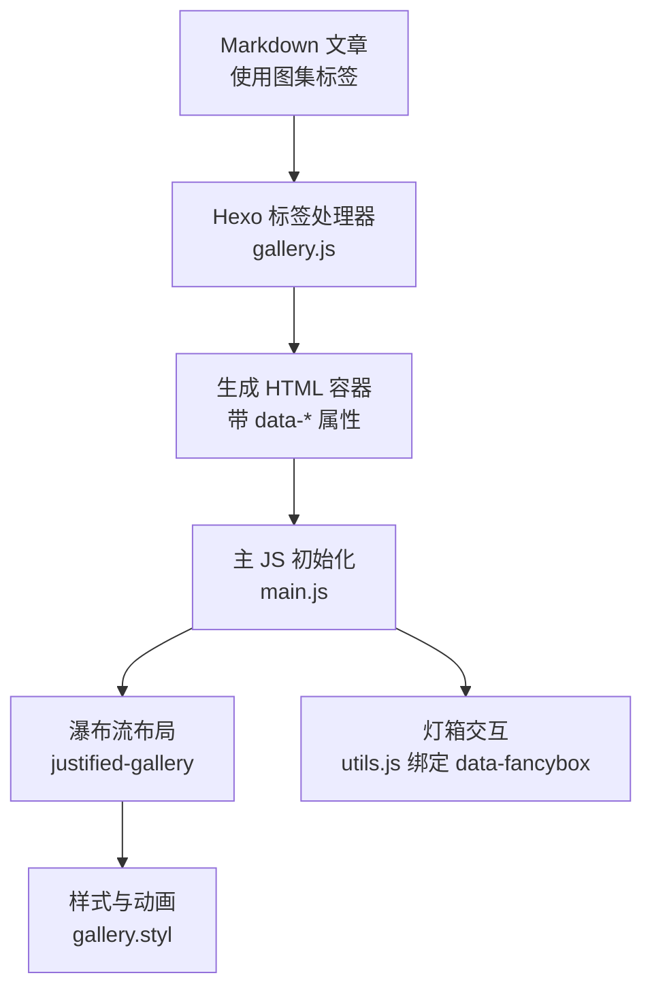
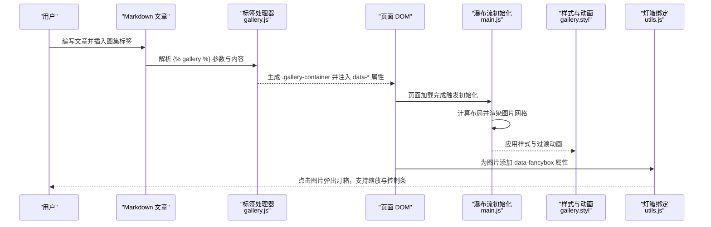
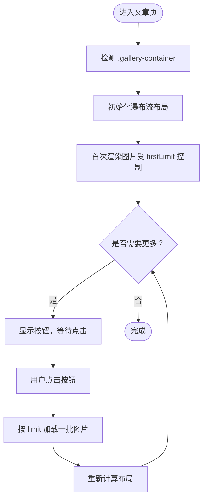
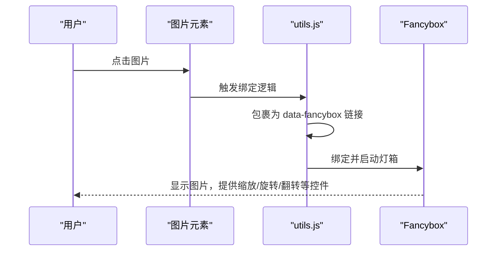
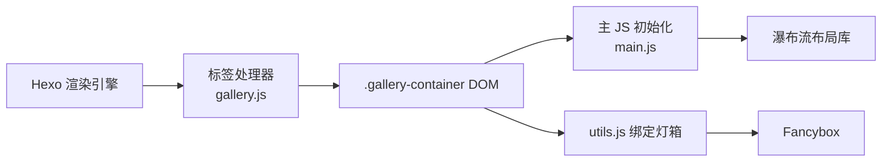

# 图集标签

<cite>
**本文引用的文件**
- [gallery.js](file://themes/butterfly/scripts/tag/gallery.js)
- [gallery.styl](file://themes/butterfly/source/css/_tags/gallery.styl)
- [main.js](file://themes/butterfly/source/js/main.js)
- [utils.js](file://themes/butterfly/source/js/utils.js)
- [_config.yml](file://themes/butterfly/_config.yml)
- [README.md](file://themes/butterfly/README.md)
- [package.json](file://themes/butterfly/package.json)
</cite>

## 目录
1. [简介](#简介)
2. [项目结构](#项目结构)
3. [核心组件](#核心组件)
4. [架构总览](#架构总览)
5. [详细组件分析](#详细组件分析)
6. [依赖关系分析](#依赖关系分析)
7. [性能考量](#性能考量)
8. [故障排查指南](#故障排查指南)
9. [结论](#结论)
10. [附录](#附录)

## 简介
本篇文档围绕 Hexo 主题 Butterfly 中的“图集标签”展开，系统讲解其语法、渲染流程、图片排列与交互、参数配置、响应式与移动端适配、样式定制与性能优化。读者可据此在博客文章中实现产品展示、相册管理、图片轮播等场景。

## 项目结构
图集标签由三部分协同完成：
- 标签注册与数据准备：在脚本层解析标签参数与内容，生成容器与数据属性。
- 前端渲染与布局：通过主 JS 初始化图集容器，调用瀑布流布局库进行排列。
- 样式与交互：通过样式表定义图集外观、悬停动画与加载态；通过工具函数绑定灯箱（Lightbox）交互。

图表来源
- [gallery.js:48-76](file://themes/butterfly/scripts/tag/gallery.js#L48-L76)
- [main.js:942-951](file://themes/butterfly/source/js/main.js#L942-L951)
- [gallery.styl:100-136](file://themes/butterfly/source/css/_tags/gallery.styl#L100-L136)
- [utils.js:180-257](file://themes/butterfly/source/js/utils.js#L180-L257)

章节来源
- [gallery.js:1-77](file://themes/butterfly/scripts/tag/gallery.js#L1-L77)
- [main.js:942-951](file://themes/butterfly/source/js/main.js#L942-L951)
- [gallery.styl:100-136](file://themes/butterfly/source/css/_tags/gallery.styl#L100-L136)
- [utils.js:180-257](file://themes/butterfly/source/js/utils.js#L180-L257)

## 核心组件
- 标签处理器（gallery.js）
  - 提供两个标签： 与 。
  - 支持两种模式：
    - 数据内联模式：在标签块内直接书写 Markdown 图片，自动提取图片 URL、alt、title。
    - URL 模式：传入一个目录或资源路径，按需懒加载。
  - 输出统一的容器元素，携带 data-type、data-button、data-limit、data-first 等属性，供前端读取。

- 前端初始化（main.js）
  - 在文章页加载完成后，对页面内的 .gallery-container 进行瀑布流布局初始化。
  - 对“展开/切换”按钮与“标签页”场景，分别在点击后重新计算布局。

- 灯箱交互（utils.js）
  - 将图片包裹为 data-fancybox="gallery" 的链接，支持缩放、旋转、缩放至原始尺寸等操作。
  - 自动读取图片的 alt 或 title 作为 caption。

- 样式与动画（gallery.styl）
  - 定义图集容器、按钮、加载动画等视觉样式。
  - 针对不同屏幕宽度提供栅格化布局策略，确保移动端友好。

章节来源
- [gallery.js:48-76](file://themes/butterfly/scripts/tag/gallery.js#L48-L76)
- [main.js:942-951](file://themes/butterfly/source/js/main.js#L942-L951)
- [utils.js:180-257](file://themes/butterfly/source/js/utils.js#L180-L257)
- [gallery.styl:100-136](file://themes/butterfly/source/css/_tags/gallery.styl#L100-L136)

## 架构总览
下图展示了从标签到渲染再到交互的整体流程：

图表来源
- [gallery.js:48-76](file://themes/butterfly/scripts/tag/gallery.js#L48-L76)
- [main.js:942-951](file://themes/butterfly/source/js/main.js#L942-L951)
- [gallery.styl:100-136](file://themes/butterfly/source/css/_tags/gallery.styl#L100-L136)
- [utils.js:180-257](file://themes/butterfly/source/js/utils.js#L180-L257)

## 详细组件分析

### 语法与参数
-  语法
  - 内联数据模式：在标签块内直接写 Markdown 图片，标签参数用于控制按钮、分页数量等。
  - URL 模式：传入一个路径，配合按钮与分页参数，按需加载该目录下的图片。
-  语法
  - 用于展示“图集分组卡片”，包含名称、描述、跳转链接与封面图。

参数说明（来自标签处理器行为）
- button：是否显示“加载更多/展开”按钮。
- limit：每批加载的图片数量。
- firstLimit：首次渲染时加载的数量。
- url：当使用 URL 模式时，指定图片目录或资源路径。

章节来源
- [gallery.js:4-8](file://themes/butterfly/scripts/tag/gallery.js#L4-L8)
- [gallery.js:48-76](file://themes/butterfly/scripts/tag/gallery.js#L48-L76)

### 渲染流程与图片排列
- 标签处理阶段
  - 若为 URL 模式，将路径转换为绝对地址并注入容器。
  - 若为内联模式，解析标签块内的 Markdown 图片，序列化为 JSON 字符串注入容器。
- 前端初始化阶段
  - 页面加载完成后，对 .gallery-container 调用瀑布流布局初始化。
  - 在“展开按钮”点击或“标签页切换”后，重新计算布局以适配新增内容。

图表来源
- [main.js:942-951](file://themes/butterfly/source/js/main.js#L942-L951)
- [gallery.js:48-76](file://themes/butterfly/scripts/tag/gallery.js#L48-L76)

章节来源
- [main.js:942-951](file://themes/butterfly/source/js/main.js#L942-L951)
- [gallery.js:48-76](file://themes/butterfly/scripts/tag/gallery.js#L48-L76)

### 交互效果与灯箱
- 灯箱绑定
  - 将图片外层包裹为 data-fancybox="gallery" 的链接，自动读取图片的 alt 或 title 作为 caption。
  - 支持缩放、旋转、翻转、全屏播放等操作；版本差异会自动选择合适的配置项。
- 点击行为
  - 用户点击图片后，弹出灯箱面板，支持键盘与手势控制。

图表来源
- [utils.js:180-257](file://themes/butterfly/source/js/utils.js#L180-L257)

章节来源
- [utils.js:180-257](file://themes/butterfly/source/js/utils.js#L180-L257)

### 响应式设计与移动端适配
- 栅格策略
  - 在不同断点下，图集卡片宽度采用百分比与 calc 计算，保证在小屏设备上占满宽度，在大屏设备上按列数平均分配。
- 动画与过渡
  - 使用 CSS 过渡与 transform 实现悬停效果，避免重排与重绘开销。
- 移动端体验
  - 灯箱在移动端同样可用，支持手势缩放与滑动切换。
  - 图集容器在小屏设备上优先采用单列展示，提升可读性。

章节来源
- [gallery.styl:13-17](file://themes/butterfly/source/css/_tags/gallery.styl#L13-L17)
- [gallery.styl:100-136](file://themes/butterfly/source/css/_tags/gallery.styl#L100-L136)
- [utils.js:180-257](file://themes/butterfly/source/js/utils.js#L180-L257)

### 样式定制方法
- 调整图集容器与按钮
  - 可修改 .gallery-container、button 的背景色、圆角、字体大小等。
- 调整加载动画
  - 可调整 .loading-container 与 .loading-item 的尺寸与颜色。
- 调整分组卡片
  - 可修改 .gallery-group 的宽高、圆角、悬停动画与文字截断策略。

章节来源
- [gallery.styl:100-136](file://themes/butterfly/source/css/_tags/gallery.styl#L100-L136)
- [gallery.styl:1-95](file://themes/butterfly/source/css/_tags/gallery.styl#L1-L95)

### 性能优化技巧
- 分批加载
  - 利用 limit 与 firstLimit 控制首屏渲染压力，仅在用户交互时加载更多。
- 懒加载与延迟初始化
  - 图片本身可结合主题提供的懒加载机制；图集布局在页面加载完成后初始化，避免阻塞。
- 减少重排与重绘
  - 使用 transform 与 opacity 实现动画，尽量避免改变布局相关的属性。
- 合理的缓存与 CDN
  - 将图片托管于 CDN，减少首屏加载时间；必要时开启浏览器缓存策略。

章节来源
- [gallery.js:14-16](file://themes/butterfly/scripts/tag/gallery.js#L14-L16)
- [main.js:942-951](file://themes/butterfly/source/js/main.js#L942-L951)
- [gallery.styl:100-136](file://themes/butterfly/source/css/_tags/gallery.styl#L100-L136)

## 依赖关系分析
- 标签处理器依赖
  - 使用 hexo-util 的 url_for 工具，将相对路径转换为绝对路径。
  - 使用正则表达式解析 Markdown 图片，提取 URL、alt、title。
- 前端依赖
  - 主 JS 依赖瀑布流布局库（如 justified-gallery），在页面加载完成后初始化。
  - 灯箱依赖 Fancybox，根据版本自动选择配置项。
- 主题配置
  - 主题配置文件中未直接暴露图集标签的开关，但可通过引入样式与脚本生效。

图表来源
- [gallery.js:12](file://themes/butterfly/scripts/tag/gallery.js#L12)
- [main.js:942-951](file://themes/butterfly/source/js/main.js#L942-L951)
- [utils.js:180-257](file://themes/butterfly/source/js/utils.js#L180-L257)

章节来源
- [gallery.js:12](file://themes/butterfly/scripts/tag/gallery.js#L12)
- [main.js:942-951](file://themes/butterfly/source/js/main.js#L942-L951)
- [utils.js:180-257](file://themes/butterfly/source/js/utils.js#L180-L257)
- [_config.yml:1-800](file://themes/butterfly/_config.yml#L1-L800)

## 性能考量
- 首屏优化
  - 使用 firstLimit 控制首屏加载数量，降低初始渲染成本。
- 异步加载
  - 按需加载更多图片，避免一次性渲染过多节点。
- 布局计算
  - 在内容变化后再触发布局计算，减少不必要的重排。
- 图片体积
  - 建议使用合适尺寸与格式的图片，必要时开启压缩与懒加载。

## 故障排查指南
- 图集不显示
  - 检查标签参数是否正确，确认 data-type 与 data-limit 是否被正确注入。
  - 确认页面已加载主 JS，且 .gallery-container 存在。
- 灯箱无法打开
  - 检查 utils.js 是否成功为图片包裹 data-fancybox 属性。
  - 确认 Fancybox 资源已加载且版本兼容。
- 布局错乱
  - 确认在“展开按钮”或“标签页切换”后已重新初始化布局。
  - 检查样式是否被覆盖，尤其是 .gallery-container 的宽度与间距。

章节来源
- [gallery.js:48-76](file://themes/butterfly/scripts/tag/gallery.js#L48-L76)
- [main.js:942-951](file://themes/butterfly/source/js/main.js#L942-L951)
- [utils.js:180-257](file://themes/butterfly/source/js/utils.js#L180-L257)

## 结论
图集标签在 Butterfly 主题中提供了灵活的图片展示能力：既支持内联 Markdown 图片，也支持按目录懒加载；配合瀑布流布局与灯箱交互，能够满足产品展示、相册管理与图片轮播等多种场景。通过合理设置分批加载与样式定制，可在保证性能的同时获得良好的用户体验。

## 附录
- 相关文件与职责
  - gallery.js：标签注册、参数解析、容器生成。
  - main.js：图集初始化、布局计算、事件绑定。
  - utils.js：图片灯箱绑定、Fancybox 配置。
  - gallery.styl：图集样式与动画。
  - _config.yml：主题配置入口（未直接暴露图集开关）。
  - README.md：主题特性概览，包含图片效果与灯箱说明。
  - package.json：主题依赖（含 hexo-util）。

章节来源
- [README.md:118-119](file://themes/butterfly/README.md#L118-L119)
- [package.json:25-30](file://themes/butterfly/package.json#L25-L30)