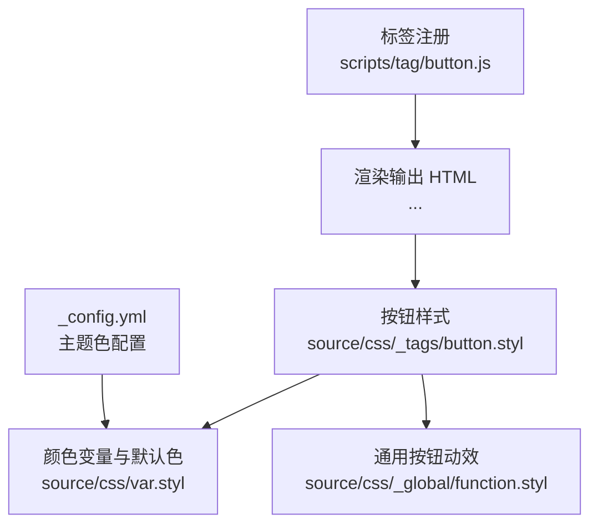
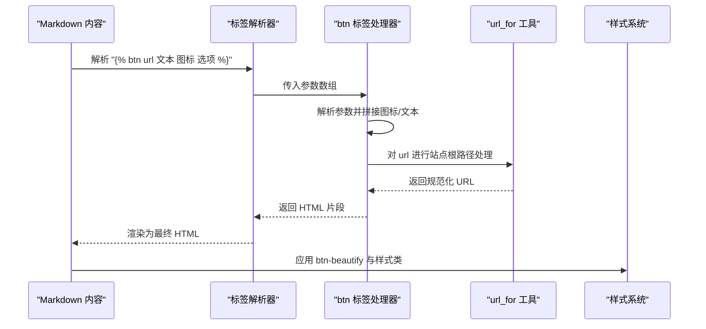
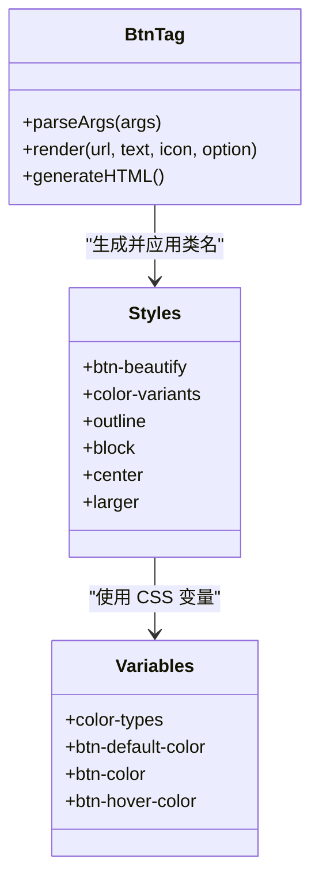
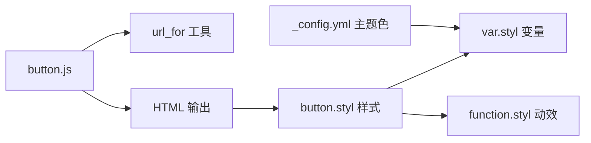

# 按钮标签

<cite>
**本文引用的文件**
- [button.js](file://themes/butterfly/scripts/tag/button.js)
- [button.styl](file://themes/butterfly/source/css/_tags/button.styl)
- [var.styl](file://themes/butterfly/source/css/var.styl)
- [function.styl](file://themes/butterfly/source/css/_global/function.styl)
- [_config.yml](file://themes/butterfly/_config.yml)
</cite>

## 目录
1. [简介](#简介)
2. [项目结构](#项目结构)
3. [核心组件](#核心组件)
4. [架构总览](#架构总览)
5. [详细组件分析](#详细组件分析)
6. [依赖关系分析](#依赖关系分析)
7. [性能考量](#性能考量)
8. [故障排查指南](#故障排查指南)
9. [结论](#结论)
10. [附录](#附录)

## 简介
本篇文档聚焦于 Hexo 主题 Butterfly 中的按钮标签（tag），其语法为：。本文将从语法格式、参数取值、HTML 生成逻辑、CSS 样式应用机制入手，系统讲解颜色与样式选项的使用方法，并提供多种使用示例与最佳实践，帮助你在不同页面布局中合理运用按钮标签。

## 项目结构
按钮标签功能由三部分组成：
- 标签注册与渲染逻辑：scripts/tag/button.js
- 样式与变量：source/css/_tags/button.styl、source/css/var.styl
- 动画与通用效果：source/css/_global/function.styl
- 主题配置项：themes/butterfly/_config.yml（主题色与按钮悬停色）

图表来源
- [button.js:12-21](file://themes/butterfly/scripts/tag/button.js#L12-L21)
- [button.styl:6-64](file://themes/butterfly/source/css/_tags/button.styl#L6-L64)
- [var.styl:68-173](file://themes/butterfly/source/css/var.styl#L68-L173)
- [function.styl:184-237](file://themes/butterfly/source/css/_global/function.styl#L184-L237)
- [_config.yml:762-778](file://themes/butterfly/_config.yml#L762-L778)

章节来源
- [button.js:12-21](file://themes/butterfly/scripts/tag/button.js#L12-L21)
- [button.styl:6-64](file://themes/butterfly/source/css/_tags/button.styl#L6-L64)
- [var.styl:68-173](file://themes/butterfly/source/css/var.styl#L68-L173)
- [function.styl:184-237](file://themes/butterfly/source/css/_global/function.styl#L184-L237)
- [_config.yml:762-778](file://themes/butterfly/_config.yml#L762-L778)

## 核心组件
- 标签注册与参数解析
  - 注册名为 btn 的标签，接收参数数组并进行拆分与清洗。
  - 参数顺序：url、text、icon、option；其中 option 可包含多个样式类名。
- HTML 生成
  - 输出一个带类名的链接元素，标题属性为文本内容，图标与文本按需拼接。
  - 使用 url_for 工具对相对路径进行站点根路径解析。
- 样式体系
  - 基础类名：btn-beautify；可叠加样式类：outline、block、center、larger。
  - 颜色类型：通过循环生成 blue、pink、red、purple、orange、green 类名。
  - 默认色与悬停色来自主题变量，支持通过配置覆盖。

章节来源
- [button.js:12-21](file://themes/butterfly/scripts/tag/button.js#L12-L21)
- [button.styl:6-64](file://themes/butterfly/source/css/_tags/button.styl#L6-L64)
- [var.styl:165-173](file://themes/butterfly/source/css/var.styl#L165-L173)

## 架构总览
按钮标签的运行流程如下：

图表来源
- [button.js:12-21](file://themes/butterfly/scripts/tag/button.js#L12-L21)
- [button.styl:6-64](file://themes/butterfly/source/css/_tags/button.styl#L6-L64)

## 详细组件分析

### 语法格式与参数说明
- 语法：
- 参数说明
  - url：必填，按钮跳转地址；支持绝对/相对路径，内部通过 url_for 处理。
  - 文本：选填，按钮显示文字；为空时仅显示图标。
  - 图标：选填，图标类名字符串（如 Font Awesome 的类名）；为空则不插入图标。
  - 选项：选填，空格分隔的样式类组合，常见取值：
    - 颜色类：default、blue、pink、red、purple、orange、green
    - 样式类：color、outline、center、block、larger
- 注意事项
  - 参数之间以逗号分隔，内部会去除多余空白。
  - 若未指定颜色类，默认使用 default（对应默认背景色）。
  - 若同时指定多个样式类，将按顺序叠加到同一链接元素上。

章节来源
- [button.js:3-6](file://themes/butterfly/scripts/tag/button.js#L3-L6)
- [button.js:12-18](file://themes/butterfly/scripts/tag/button.js#L12-L18)

### HTML 生成逻辑
- 生成结构
  - 外层为链接元素，类名包含 btn-beautify 与所有选项类。
  - 标题属性为文本内容，便于鼠标悬停提示。
  - 图标与文本按存在性拼接，图标在前、文本在后。
- 关键点
  - 使用 url_for 对 url 进行站点根路径解析，确保跨页面链接正确。
  - 图标与文本的间距与对齐由样式控制，图标与文本之间有过渡动画。

章节来源
- [button.js:15-18](file://themes/butterfly/scripts/tag/button.js#L15-L18)

### CSS 样式应用机制
- 基础样式
  - 显示为内联块级元素，设置内外边距、圆角、垂直居中与行高。
  - 背景色与文字色由 CSS 变量控制，支持主题色覆盖。
- 颜色类映射
  - 通过循环生成颜色类（blue、pink、red、purple、orange、green），每个类名对应一个 CSS 变量，用于覆盖背景色。
  - 默认色 fallback 到 default 类对应的变量。
- 样式类
  - outline：描边样式，背景透明，文字色与边框色一致，悬停时填充背景并改变文字色。
  - block：块级按钮，宽度自适应，支持 center/right 居中或靠右。
  - center：配合 block 使用，使按钮在容器中水平居中。
  - larger：增大内边距，配合更大的动效类。
- 动画与交互
  - 通用按钮动效类提供悬停提升、阴影变化、图标弹跳等效果。
  - 悬停时背景色与变量绑定的颜色一致，outline 模式下文字与背景同步变色。

章节来源
- [button.styl:6-64](file://themes/butterfly/source/css/_tags/button.styl#L6-L64)
- [function.styl:184-237](file://themes/butterfly/source/css/_global/function.styl#L184-L237)
- [var.styl:165-173](file://themes/butterfly/source/css/var.styl#L165-L173)

### 颜色与样式选项详解
- 颜色选项
  - default：默认灰阶背景，适合中性信息。
  - blue/pink/red/purple/orange/green：对应主题色系，适合强调或分类标识。
- 样式选项
  - color：默认实心样式（无需额外类名，基础类已包含）。
  - outline：描边样式，适合弱化强调或对比度要求高的场景。
  - center：按钮居中，适合内容区段落中心。
  - block：块级按钮，适合列表末尾或独立操作区域。
  - larger：增大按钮尺寸，适合移动端或需要更大触控目标的场景。

章节来源
- [button.styl:17-20](file://themes/butterfly/source/css/_tags/button.styl#L17-L20)
- [button.styl:43-63](file://themes/butterfly/source/css/_tags/button.styl#L43-L63)
- [var.styl:165-173](file://themes/butterfly/source/css/var.styl#L165-L173)

### 使用示例与最佳实践
- 示例场景
  - 导航按钮：使用 block + center 组合，配合 larger 提升点击面积。
  - 强调按钮：使用 red 或 orange，突出重要操作。
  - 描边按钮：使用 outline + blue，弱化强调但保持可识别性。
  - 图标+文本：在图标类名后添加文本，增强可读性。
- 最佳实践
  - 在列表页或文章页底部使用 block 按钮，避免与正文混杂。
  - 移动端优先使用 larger，提高可触达性。
  - 颜色选择遵循语义：绿色常用于成功/继续，红色用于危险/删除，蓝色用于信息/跳转。
  - 合理使用 center 与 right，避免页面布局混乱。

（本节为概念性说明，不直接分析具体文件）

### 代码级类图

图表来源
- [button.js:12-21](file://themes/butterfly/scripts/tag/button.js#L12-L21)
- [button.styl:6-64](file://themes/butterfly/source/css/_tags/button.styl#L6-L64)
- [var.styl:165-173](file://themes/butterfly/source/css/var.styl#L165-L173)

## 依赖关系分析
- 标签处理器依赖
  - url_for 工具：负责将相对路径转换为站点根路径下的绝对链接。
  - 标签注册：声明为非结束型标签，便于在 Markdown 中直接使用。
- 样式依赖
  - 颜色变量：通过 var.styl 中的颜色类型数组与变量映射，实现动态颜色覆盖。
  - 动效：function.styl 中的按钮动效类与关键帧，提供悬停与点击反馈。
- 配置依赖
  - 主题色配置：可通过 _config.yml 中的主题色相关字段调整按钮悬停色与默认色。

图表来源
- [button.js:10-21](file://themes/butterfly/scripts/tag/button.js#L10-L21)
- [button.styl:6-64](file://themes/butterfly/source/css/_tags/button.styl#L6-L64)
- [var.styl:68-173](file://themes/butterfly/source/css/var.styl#L68-L173)
- [function.styl:184-237](file://themes/butterfly/source/css/_global/function.styl#L184-L237)
- [_config.yml:762-778](file://themes/butterfly/_config.yml#L762-L778)

章节来源
- [button.js:10-21](file://themes/butterfly/scripts/tag/button.js#L10-L21)
- [button.styl:6-64](file://themes/butterfly/source/css/_tags/button.styl#L6-L64)
- [var.styl:68-173](file://themes/butterfly/source/css/var.styl#L68-L173)
- [function.styl:184-237](file://themes/butterfly/source/css/_global/function.styl#L184-L237)
- [_config.yml:762-778](file://themes/butterfly/_config.yml#L762-L778)

## 性能考量
- 渲染开销
  - 标签处理为纯前端模板渲染，无额外网络请求，开销极低。
- 样式体积
  - 颜色类通过变量映射，避免重复定义，样式体积可控。
- 交互体验
  - 动效采用 CSS 过渡与变换，硬件加速友好，性能稳定。

（本节为通用指导，不直接分析具体文件）

## 故障排查指南
- 问题：按钮无法跳转或链接错误
  - 检查 url 是否为有效路径，必要时使用绝对路径或站点根路径。
  - 确认 url_for 工具是否正常工作。
- 问题：颜色不生效或显示异常
  - 确认选项中是否包含正确的颜色类名（如 blue、pink 等）。
  - 检查 var.styl 中颜色变量是否被主题配置覆盖。
- 问题：样式类无效
  - 确认选项字符串中类名拼写正确，且与 button.styl 中定义一致。
  - 检查是否存在样式冲突（如自定义样式覆盖）。
- 问题：图标不显示
  - 确认图标类名是否正确，且字体库已加载。

章节来源
- [button.js:10-18](file://themes/butterfly/scripts/tag/button.js#L10-L18)
- [button.styl:6-64](file://themes/butterfly/source/css/_tags/button.styl#L6-L64)
- [var.styl:165-173](file://themes/butterfly/source/css/var.styl#L165-L173)

## 结论
按钮标签通过简洁的语法与灵活的样式组合，为内容页提供了统一、美观且易用的操作入口。依托变量驱动的颜色体系与动效系统，既能满足视觉一致性，又能适配不同语义与布局需求。建议在实际使用中结合页面语境选择合适的颜色与样式类，并遵循移动端优先的设计原则，以获得最佳的用户体验。

## 附录
- 选项对照表
  - 颜色类：default、blue、pink、red、purple、orange、green
  - 样式类：color（默认）、outline、center、block、larger
- 参考路径
  - 标签实现：[button.js:12-21](file://themes/butterfly/scripts/tag/button.js#L12-L21)
  - 样式定义：[button.styl:6-64](file://themes/butterfly/source/css/_tags/button.styl#L6-L64)
  - 变量与颜色：[var.styl:165-173](file://themes/butterfly/source/css/var.styl#L165-L173)
  - 动效与过渡：[function.styl:184-237](file://themes/butterfly/source/css/_global/function.styl#L184-L237)
  - 主题色配置：[_config.yml:762-778](file://themes/butterfly/_config.yml#L762-L778)