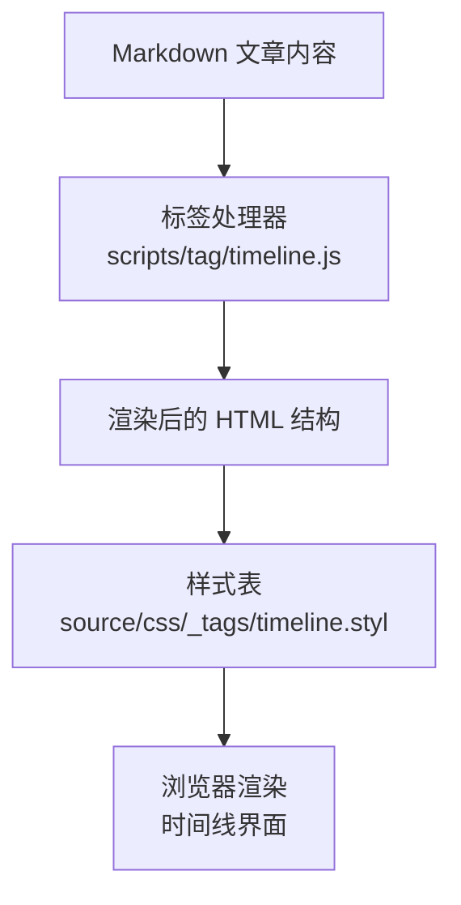
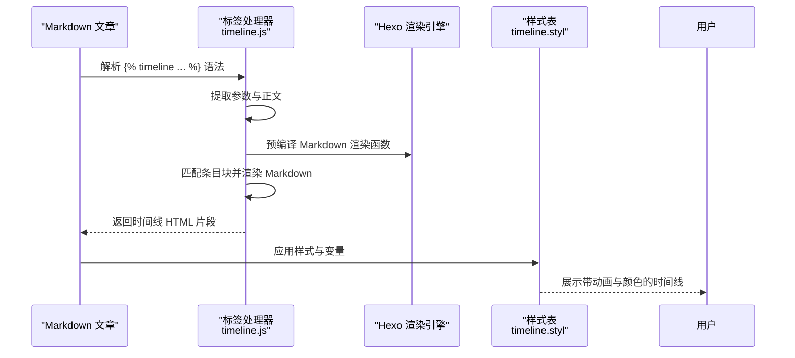
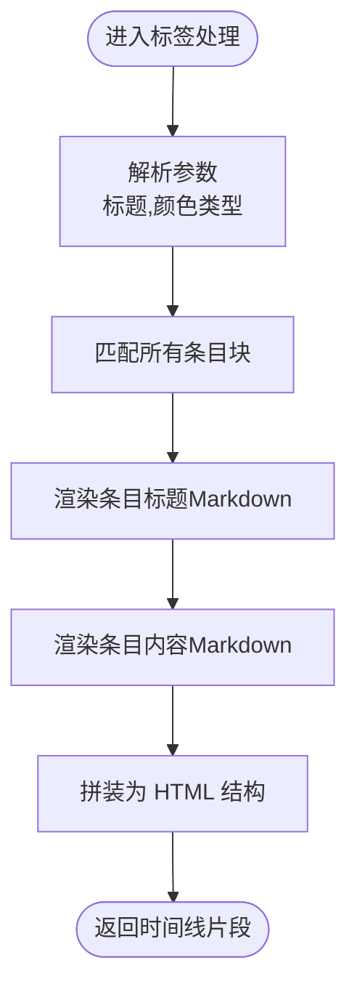
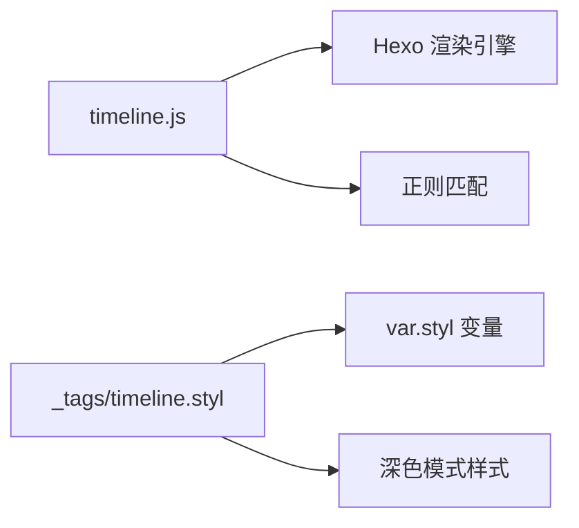

# 时间线标签

<cite>
**本文引用的文件**
- [scripts/tag/timeline.js](file://themes/butterfly/scripts/tag/timeline.js)
- [source/css/_tags/timeline.styl](file://themes/butterfly/source/css/_tags/timeline.styl)
- [source/css/var.styl](file://themes/butterfly/source/css/var.styl)
- [_config.yml](file://themes/butterfly/_config.yml)
- [source/css/index.styl](file://themes/butterfly/source/css/index.styl)
</cite>

## 目录
1. [简介](#简介)
2. [项目结构](#项目结构)
3. [核心组件](#核心组件)
4. [架构总览](#架构总览)
5. [组件详解](#组件详解)
6. [依赖关系分析](#依赖关系分析)
7. [性能与可访问性](#性能与可访问性)
8. [故障排查指南](#故障排查指南)
9. [结论](#结论)
10. [附录](#附录)

## 简介
本篇文档围绕 Hexo 主题 Butterfly 中的时间线标签（timeline）展开，系统讲解其语法、渲染流程、样式与交互、响应式与移动端适配、以及在个人经历、项目进展、历史事件等场景下的最佳实践与设计规范。读者将能够基于现有实现快速上手并定制符合自身风格的时间线展示。

## 项目结构
时间线标签由“标签处理器 + 样式表”两部分组成：
- 标签处理器负责解析模板语法、提取条目、渲染 Markdown 并输出时间线容器与条目结构。
- 样式表负责时间线的视觉呈现、颜色体系、悬停动画与响应式布局。

图表来源
- [scripts/tag/timeline.js:16-51](file://themes/butterfly/scripts/tag/timeline.js#L16-L51)
- [source/css/_tags/timeline.styl:1-68](file://themes/butterfly/source/css/_tags/timeline.styl#L1-L68)

章节来源
- [scripts/tag/timeline.js:1-51](file://themes/butterfly/scripts/tag/timeline.js#L1-L51)
- [source/css/_tags/timeline.styl:1-68](file://themes/butterfly/source/css/_tags/timeline.styl#L1-L68)
- [source/css/index.styl:1-15](file://themes/butterfly/source/css/index.styl#L1-L15)

## 核心组件
- 标签处理器（JavaScript）
  - 支持的语法：起始标签、条目块、结束标签；支持可选的颜色类型参数；支持在条目内嵌入 Markdown。
  - 渲染逻辑：预编译 Markdown 渲染函数；解析参数；匹配所有条目块；拼接为最终 HTML。
- 样式系统（Stylus）
  - 时间线主容器、条目标题与内容区域、圆点装饰、悬停动画、背景色与边框色变量化。
  - 支持多种颜色类型，通过 CSS 变量与主题色映射实现统一风格。

章节来源
- [scripts/tag/timeline.js:16-51](file://themes/butterfly/scripts/tag/timeline.js#L16-L51)
- [source/css/_tags/timeline.styl:1-68](file://themes/butterfly/source/css/_tags/timeline.styl#L1-L68)
- [source/css/var.styl:182-184](file://themes/butterfly/source/css/var.styl#L182-L184)

## 架构总览
时间线标签从“语法解析 → 内容渲染 → 样式应用”的完整链路如下：

图表来源
- [scripts/tag/timeline.js:16-51](file://themes/butterfly/scripts/tag/timeline.js#L16-L51)
- [source/css/_tags/timeline.styl:1-68](file://themes/butterfly/source/css/_tags/timeline.styl#L1-L68)

## 组件详解

### 语法与参数
- 起始标签
  - 语法：
  - 说明：可选的标题用于渲染“标题行”；可选的颜色类型用于切换时间线主题色系。
- 条目块
  - 语法：<!-- timeline [标题] --> ... <!-- endtimeline -->
  - 说明：每个条目包含一个标题与内容，内容支持 Markdown。
- 结束标签
  - 语法：
  - 说明：结束当前时间线容器。

章节来源
- [scripts/tag/timeline.js:3-11](file://themes/butterfly/scripts/tag/timeline.js#L3-L11)

### 渲染流程与数据结构
- 参数解析
  - 将传入参数按逗号拆分，得到标题与颜色类型，默认颜色类型为空字符串。
- 条目匹配
  - 使用正则一次性匹配所有条目块，提取标题与内容。
- Markdown 渲染
  - 预编译渲染函数，确保条目标题与内容均以 Markdown 渲染。
- 结构拼装
  - 生成时间线容器与条目节点，条目包含标题区与内容区。

图表来源
- [scripts/tag/timeline.js:16-51](file://themes/butterfly/scripts/tag/timeline.js#L16-L51)

章节来源
- [scripts/tag/timeline.js:16-51](file://themes/butterfly/scripts/tag/timeline.js#L16-L51)

### 视觉设计与动画
- 边框与颜色
  - 时间线主容器使用左侧竖线作为轴，颜色由 CSS 变量控制；支持多种颜色类型映射。
- 圆点装饰
  - 每个条目标题前的圆点通过伪元素实现，悬停时改变边框颜色，过渡动画平滑。
- 内容区域
  - 条目内容区域具有圆角背景与内边距，背景色与主题色透明度组合，提升层次感。
- 悬停交互
  - 鼠标悬停在条目上时，圆点边框颜色与伪元素颜色过渡到悬停态，增强反馈。

章节来源
- [source/css/_tags/timeline.styl:1-68](file://themes/butterfly/source/css/_tags/timeline.styl#L1-L68)
- [source/css/var.styl:182-184](file://themes/butterfly/source/css/var.styl#L182-L184)

### 响应式与移动端适配
- 样式层面
  - 时间线容器与条目采用相对定位与绝对定位配合，保证在不同屏幕宽度下保持对齐与间距稳定。
  - 圆点与内容区域的尺寸与间距在小屏设备上仍保持可读性与可触达性。
- 主题集成
  - 样式通过全局入口导入，确保在深色模式与浅色模式下颜色变量正确生效。

章节来源
- [source/css/_tags/timeline.styl:1-68](file://themes/butterfly/source/css/_tags/timeline.styl#L1-L68)
- [source/css/index.styl:1-15](file://themes/butterfly/source/css/index.styl#L1-L15)

### 设计规范与内容组织建议
- 标题层级
  - 建议使用简洁明确的标题表达时间点或阶段名称，便于快速浏览。
- 内容组织
  - 条目内容建议采用要点式或短句，避免冗长段落；必要时使用列表与链接增强可读性。
- 颜色类型
  - 同一时间线内尽量保持一致的颜色类型，以强化视觉连贯性；不同主题或阶段可用多个时间线容器区分。
- 顺序与时间轴
  - 条目顺序应遵循时间先后；如需强调“里程碑”，可在相应条目使用加粗或特殊标题格式突出。
- 可访问性
  - 保持足够的对比度；避免仅用颜色传达信息；为图片提供替代文本（如适用）。

## 依赖关系分析
- 标签处理器依赖
  - Hexo 渲染引擎：用于预编译 Markdown 渲染函数。
  - 正则表达式：用于一次性匹配所有条目块，提升性能。
- 样式依赖
  - CSS 变量：时间线颜色与背景色通过变量控制，便于主题切换。
  - 主题色映射：颜色类型与主题色的映射关系定义在变量文件中。
  - 深色模式：深色模式样式覆盖时间线背景色，确保夜间阅读体验。

图表来源
- [scripts/tag/timeline.js:16-51](file://themes/butterfly/scripts/tag/timeline.js#L16-L51)
- [source/css/_tags/timeline.styl:1-68](file://themes/butterfly/source/css/_tags/timeline.styl#L1-L68)
- [source/css/var.styl:182-184](file://themes/butterfly/source/css/var.styl#L182-L184)

章节来源
- [scripts/tag/timeline.js:16-51](file://themes/butterfly/scripts/tag/timeline.js#L16-L51)
- [source/css/_tags/timeline.styl:1-68](file://themes/butterfly/source/css/_tags/timeline.styl#L1-L68)
- [source/css/var.styl:182-184](file://themes/butterfly/source/css/var.styl#L182-L184)

## 性能与可访问性
- 性能
  - 使用一次性正则匹配所有条目块，减少多次遍历；预编译 Markdown 渲染函数降低重复开销。
- 可访问性
  - 保持语义化结构（容器 + 标题 + 内容），便于屏幕阅读器理解；确保颜色对比度满足基本可读性要求。

[本节为通用指导，不直接分析具体文件]

## 故障排查指南
- 标签未生效
  - 检查是否正确使用起始与结束标签；确认条目块闭合是否完整。
- 颜色不正确
  - 检查颜色类型参数是否与主题变量映射一致；确认深色模式下样式覆盖是否生效。
- Markdown 渲染异常
  - 确认条目标题与内容中使用的 Markdown 语法是否正确；避免在标题中使用未闭合的代码块或特殊符号。

章节来源
- [scripts/tag/timeline.js:3-11](file://themes/butterfly/scripts/tag/timeline.js#L3-L11)
- [source/css/_tags/timeline.styl:1-68](file://themes/butterfly/source/css/_tags/timeline.styl#L1-L68)

## 结论
时间线标签在 Butterfly 主题中提供了简洁而强大的时间顺序展示能力。通过清晰的语法、稳定的渲染流程与灵活的样式系统，用户可以在个人经历、项目进展、历史事件等多种场景中高效地组织与呈现信息。建议结合设计规范与响应式特性，合理规划条目结构与颜色类型，以获得最佳的阅读与交互体验。

[本节为总结性内容，不直接分析具体文件]

## 附录

### 语法速查
- 起始标签：
- 条目块：<!-- timeline [标题] --> ... <!-- endtimeline -->
- 结束标签：

章节来源
- [scripts/tag/timeline.js:3-11](file://themes/butterfly/scripts/tag/timeline.js#L3-L11)

### 颜色类型与变量映射
- 颜色类型来源于主题变量定义，时间线通过 CSS 变量映射到具体颜色与背景色。
- 默认颜色类型与主题色关联，深色模式下背景色会相应调整。

章节来源
- [source/css/var.styl:165-184](file://themes/butterfly/source/css/var.styl#L165-L184)
- [source/css/_tags/timeline.styl:7-10](file://themes/butterfly/source/css/_tags/timeline.styl#L7-L10)