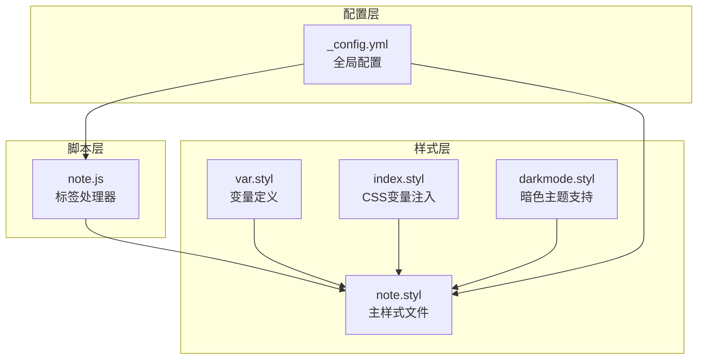
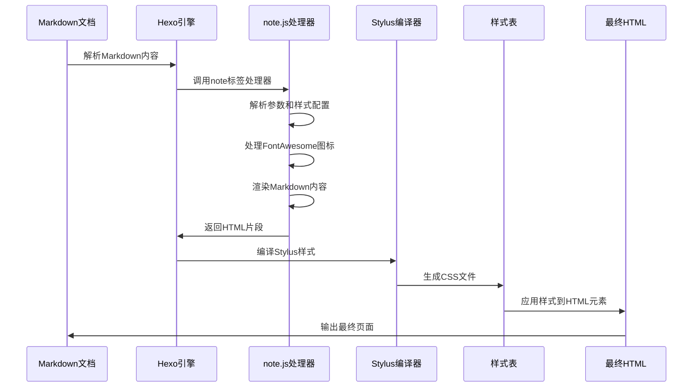
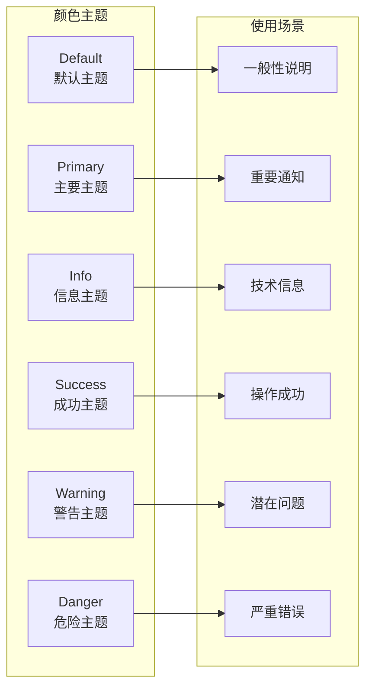
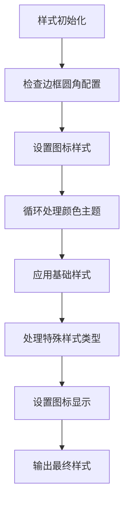
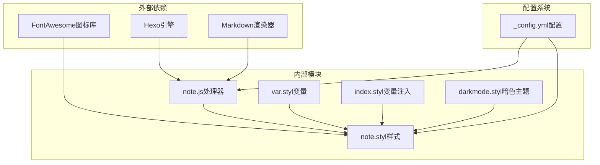
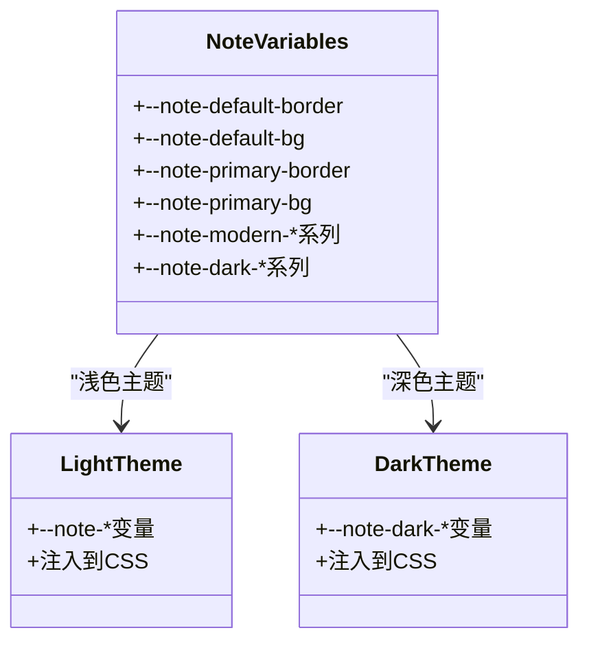

# 注释标签

<cite>
**本文档引用的文件**
- [note.js](file://themes/butterfly/scripts/tag/note.js)
- [note.styl](file://themes/butterfly/source/css/_tags/note.styl)
- [var.styl](file://themes/butterfly/source/css/var.styl)
- [_config.yml](file://themes/butterfly/_config.yml)
- [index.styl](file://themes/butterfly/source/css/_global/index.styl)
- [darkmode.styl](file://themes/butterfly/source/css/_mode/darkmode.styl)
</cite>

## 目录
1. [简介](#简介)
2. [项目结构](#项目结构)
3. [核心组件](#核心组件)
4. [架构概览](#架构概览)
5. [详细组件分析](#详细组件分析)
6. [依赖关系分析](#依赖关系分析)
7. [性能考虑](#性能考虑)
8. [故障排除指南](#故障排除指南)
9. [结论](#结论)

## 简介

注释标签（Note Tag）是 Hexo 主题 Butterfly 中的一个强大功能，用于在技术文档中创建各种类型的提示框和注释。它提供了多种样式选项和颜色主题，能够帮助作者更好地组织和突出显示不同类型的重要信息。

该功能基于 Hexo 的标签插件系统构建，通过自定义的 JavaScript 处理器和 CSS 样式表实现，支持 Markdown 内容渲染和丰富的视觉效果。

## 项目结构

注释标签功能分布在以下关键文件中：



**图表来源**
- [note.js:1-28](file://themes/butterfly/scripts/tag/note.js#L1-L28)
- [note.styl:1-126](file://themes/butterfly/source/css/_tags/note.styl#L1-L126)
- [var.styl:107-233](file://themes/butterfly/source/css/var.styl#L107-L233)

**章节来源**
- [note.js:1-28](file://themes/butterfly/scripts/tag/note.js#L1-L28)
- [note.styl:1-126](file://themes/butterfly/source/css/_tags/note.styl#L1-L126)
- [var.styl:107-233](file://themes/butterfly/source/css/var.styl#L107-L233)

## 核心组件

### 标签处理器（JavaScript）

注释标签的处理逻辑由 `note.js` 文件实现，它注册了两个标签处理器：

- `note` 标签：标准注释标签
- `subnote` 标签：子注释标签（功能相同）

### 样式系统（CSS）

样式系统采用 Stylus 预处理器编写，提供了完整的视觉样式支持：

- **四种样式类型**：flat、modern、simple、disabled
- **六种颜色主题**：default、primary、info、success、warning、danger
- **响应式设计**：支持不同屏幕尺寸的适配
- **暗色主题兼容**：自动适配深色模式

**章节来源**
- [note.js:9-27](file://themes/butterfly/scripts/tag/note.js#L9-L27)
- [note.styl:19-126](file://themes/butterfly/source/css/_tags/note.styl#L19-L126)

## 架构概览

注释标签的完整工作流程如下：



**图表来源**
- [note.js:9-24](file://themes/butterfly/scripts/tag/note.js#L9-L24)
- [note.styl:1-126](file://themes/butterfly/source/css/_tags/note.styl#L1-L126)

## 详细组件分析

### 标签语法格式

注释标签支持灵活的语法格式：

```markdown

内容



内容

```

#### 参数说明

| 参数 | 类型 | 必需 | 默认值 | 描述 |
|------|------|------|--------|------|
| style | 字符串 | 否 | 来自配置 | 样式类型（flat/modern/simple/disabled） |
| type | 字符串 | 否 | default | 颜色主题（default/primary/info/success/warning/danger） |
| icon-class | 字符串 | 否 | 无 | FontAwesome 图标类名 |

### 样式类型详解

#### Flat 样式
Flat 样式是最常用的样式，具有以下特点：
- 使用背景色填充整个容器
- 左侧有明显的彩色边框
- 支持所有颜色主题
- 适合大多数技术文档场景

#### Modern 样式
Modern 样式提供现代化的设计：
- 透明边框，仅显示内侧阴影
- 背景色半透明
- 更加简洁的视觉效果
- 适合追求现代感的文档

#### Simple 样式
Simple 样式是最简单的样式：
- 仅显示左侧细边框
- 无背景色填充
- 适合轻微提示信息

#### Disabled 样式
Disabled 样式禁用所有样式：
- 不应用任何样式
- 仅保留基本的 HTML 结构
- 适合自定义样式的场景

### 颜色主题系统

注释标签支持六种颜色主题，每种主题都有其特定的使用场景：



**图表来源**
- [var.styl:109](file://themes/butterfly/source/css/var.styl#L109)
- [note.styl:90-126](file://themes/butterfly/source/css/_tags/note.styl#L90-L126)

### HTML 结构和 CSS 实现

#### HTML 结构
注释标签生成的标准 HTML 结构如下：

```html
<div class="note [style] [type] [icon-padding]">
    <i class="note-icon [fa-icon-class]"></i>
    <!-- 渲染后的 Markdown 内容 -->
</div>
```

#### CSS 样式实现
样式系统采用 Stylus 预处理器，通过变量和循环实现：



**图表来源**
- [note.styl:1-126](file://themes/butterfly/source/css/_tags/note.styl#L1-L126)

### 配置选项

注释标签的配置选项位于主题配置文件中：

| 配置项 | 类型 | 默认值 | 描述 |
|--------|------|--------|------|
| note.style | 字符串 | flat | 默认样式类型 |
| note.icons | 布尔值 | true | 是否显示图标 |
| note.border_radius | 数字 | 3 | 边框圆角半径（像素） |
| note.light_bg_offset | 数字 | 0 | 背景色偏移百分比 |

**章节来源**
- [_config.yml:970-983](file://themes/butterfly/_config.yml#L970-L983)
- [note.styl:7-8](file://themes/butterfly/source/css/_tags/note.styl#L7-L8)

## 依赖关系分析

注释标签功能的依赖关系如下：



**图表来源**
- [note.js:10-23](file://themes/butterfly/scripts/tag/note.js#L10-L23)
- [note.styl:1-126](file://themes/butterfly/source/css/_tags/note.styl#L1-L126)

### 样式变量系统

注释标签使用 CSS 变量系统实现主题切换：



**图表来源**
- [var.styl:107-233](file://themes/butterfly/source/css/var.styl#L107-L233)
- [index.styl:60-99](file://themes/butterfly/source/css/_global/index.styl#L60-L99)
- [darkmode.styl:57-82](file://themes/butterfly/source/css/_mode/darkmode.styl#L57-L82)

**章节来源**
- [var.styl:107-233](file://themes/butterfly/source/css/var.styl#L107-L233)
- [index.styl:60-99](file://themes/butterfly/source/css/_global/index.styl#L60-L99)
- [darkmode.styl:57-82](file://themes/butterfly/source/css/_mode/darkmode.styl#L57-L82)

## 性能考虑

### 渲染性能
- **懒加载支持**：注释标签内容支持懒加载，减少初始页面加载时间
- **CSS 优化**：使用 CSS 变量减少重复样式定义
- **条件渲染**：根据配置动态决定是否渲染图标和样式

### 样式性能
- **变量复用**：通过 Stylus 变量系统减少 CSS 体积
- **响应式设计**：优化移动端显示性能
- **主题切换**：支持快速的主题切换而无需重新加载

## 故障排除指南

### 常见问题及解决方案

#### 问题1：注释标签不显示样式
**可能原因**：
- CSS 文件未正确编译
- 配置文件中的样式设置无效

**解决方法**：
1. 检查 `_config.yml` 中的 `note` 配置
2. 确认 Stylus 文件已正确编译
3. 清除浏览器缓存重新加载页面

#### 问题2：图标不显示
**可能原因**：
- FontAwesome 库未正确加载
- 图标类名格式不正确

**解决方法**：
1. 确认 FontAwesome 库已正确引入
2. 检查图标类名格式（必须以 `fa` 开头）
3. 验证图标名称是否存在于 FontAwesome 库中

#### 问题3：样式冲突
**可能原因**：
- 自定义 CSS 覆盖了注释标签样式
- 多个注释标签嵌套导致样式混乱

**解决方法**：
1. 检查自定义 CSS 是否覆盖了 `.note` 类
2. 避免在注释标签中嵌套其他注释标签
3. 使用更具体的选择器避免冲突

**章节来源**
- [note.js:10-23](file://themes/butterfly/scripts/tag/note.js#L10-L23)
- [note.styl:79-125](file://themes/butterfly/source/css/_tags/note.styl#L79-L125)

## 结论

注释标签功能为 Hexo 主题 Butterfly 提供了一个强大而灵活的技术文档注释解决方案。通过精心设计的架构和丰富的样式选项，它能够满足各种技术文档的注释需求。

### 主要优势
- **灵活性**：支持多种样式类型和颜色主题
- **易用性**：简洁的语法和直观的配置
- **可扩展性**：基于 Hexo 标签插件系统，易于扩展
- **性能优化**：采用现代前端技术栈，性能优异

### 最佳实践建议
1. **合理选择样式**：根据内容的重要性选择合适的样式类型
2. **统一颜色使用**：在整个文档中保持颜色使用的统一性
3. **语义化使用**：确保注释内容与样式类型相匹配
4. **无障碍访问**：注意颜色对比度和文本可读性

注释标签功能展现了现代静态站点生成器的强大能力，为技术文档的创作提供了专业的工具支持。