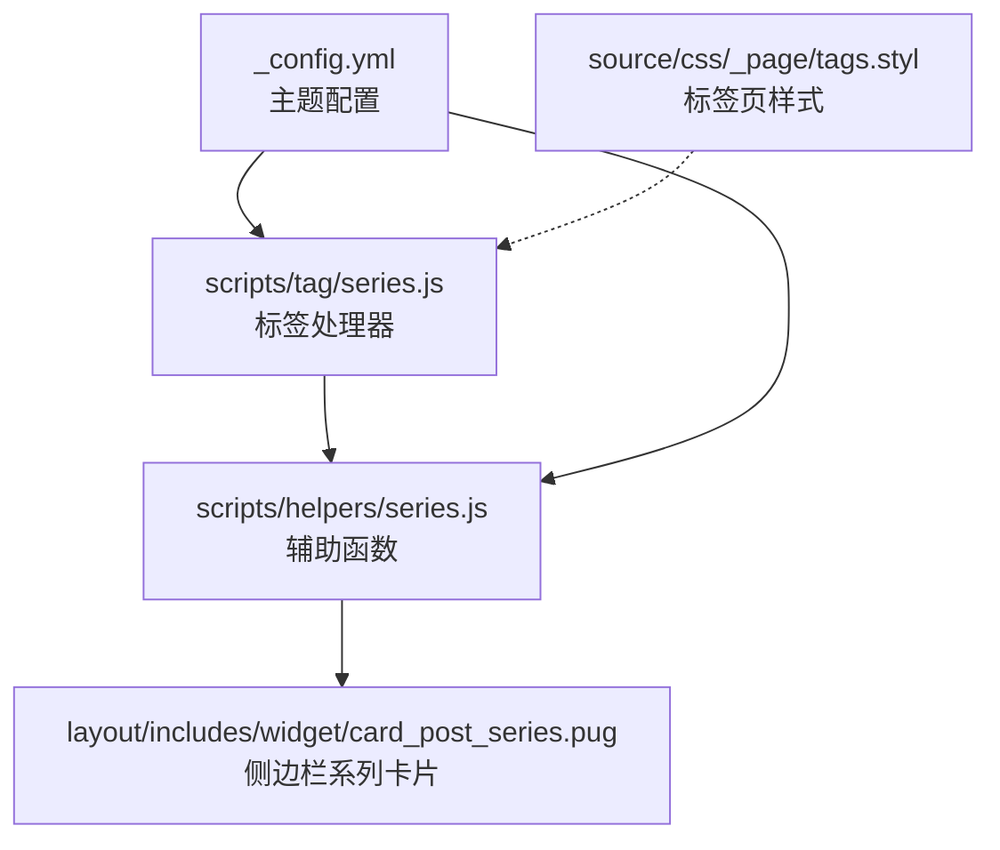
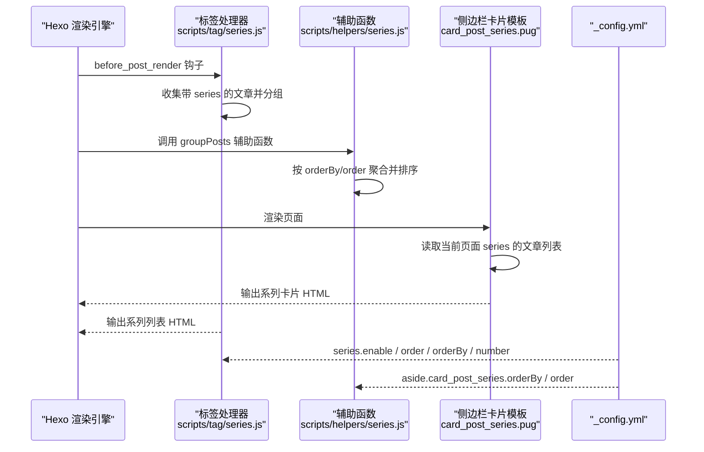
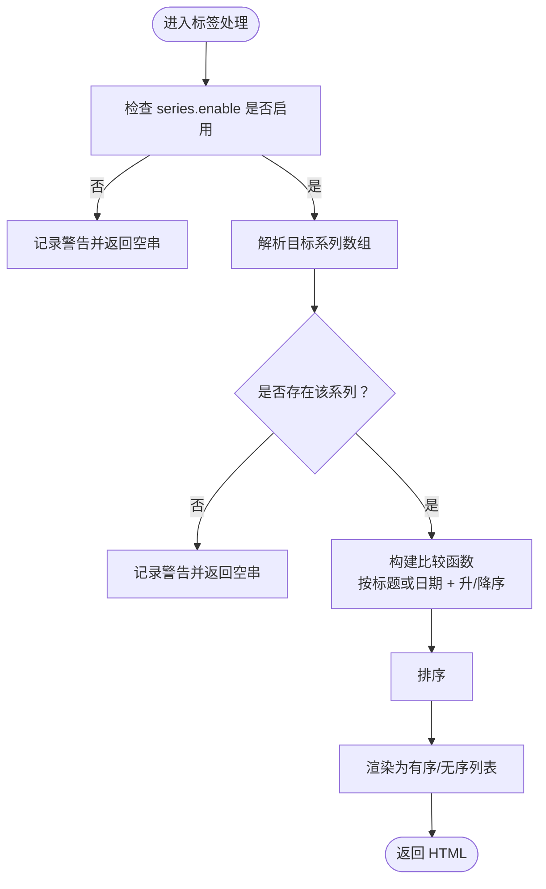
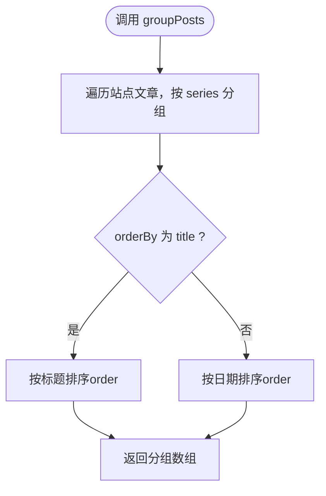
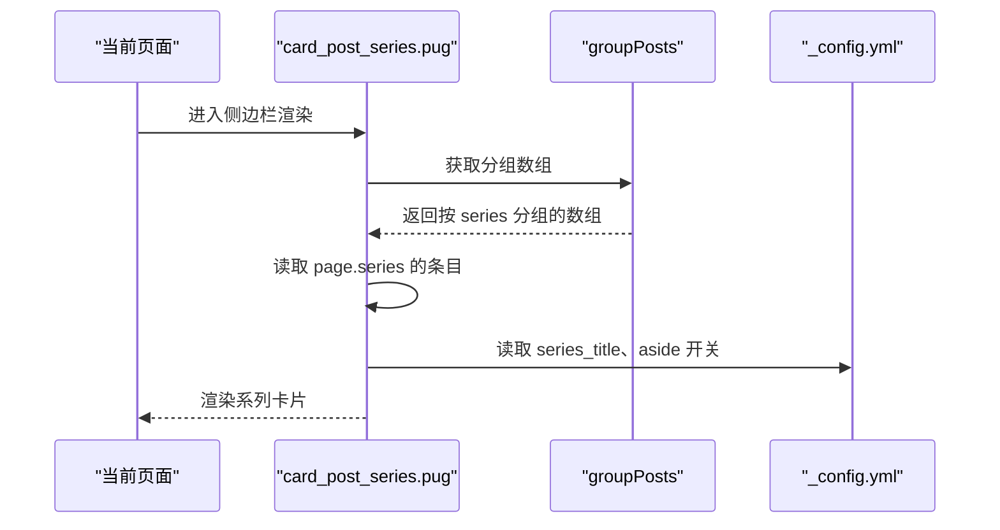
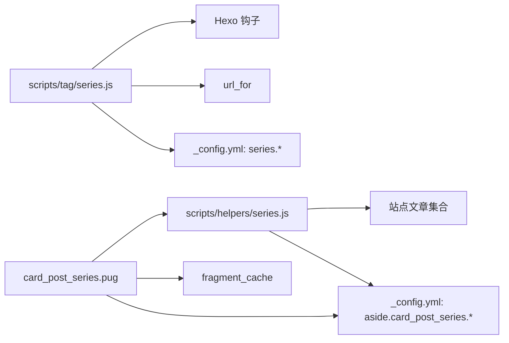

# 系列标签

<cite>
**本文引用的文件**
- [scripts/tag/series.js](file://themes/butterfly/scripts/tag/series.js)
- [scripts/helpers/series.js](file://themes/butterfly/scripts/helpers/series.js)
- [layout/includes/widget/card_post_series.pug](file://themes/butterfly/layout/includes/widget/card_post_series.pug)
- [_config.yml](file://themes/butterfly/_config.yml)
- [source/css/_page/tags.styl](file://themes/butterfly/source/css/_page/tags.styl)
- [source/_posts/Vscode-Github-Copilot接入MATLAB.md](file://source/_posts/Vscode-Github-Copilot接入MATLAB.md)
- [source/_posts/Windows系统如何删除nul文件.md](file://source/_posts/Windows系统如何删除nul文件.md)
</cite>

## 目录
1. [简介](#简介)
2. [项目结构](#项目结构)
3. [核心组件](#核心组件)
4. [架构总览](#架构总览)
5. [组件详解](#组件详解)
6. [依赖关系分析](#依赖关系分析)
7. [性能与可用性](#性能与可用性)
8. [故障排查指南](#故障排查指南)
9. [结论](#结论)
10. [附录](#附录)

## 简介
本篇文档围绕主题“蝴蝶”（Butterfly）中的系列标签能力展开，系统阐述其在博客文章系列化展示中的功能定位、参数配置、文章关联机制、导航与用户引导、样式定制与体验优化，以及组织规范与内容管理建议。读者可据此在教程系列、技术专题、连载文章等场景中高效落地系列化内容。

## 项目结构
系列标签涉及的关键文件分布于脚本、模板与配置三类位置：
- 标签脚本：负责在渲染阶段收集文章并生成系列列表
- 辅助函数：负责侧边栏系列卡片的数据聚合与排序
- 模板：负责在页面中渲染系列卡片与系列列表
- 配置：控制系列功能开关、排序规则、是否编号等
- 样式：提供系列列表的基础视觉表现

图表来源
- [scripts/tag/series.js:1-64](file://themes/butterfly/scripts/tag/series.js#L1-L64)
- [scripts/helpers/series.js:1-23](file://themes/butterfly/scripts/helpers/series.js#L1-L23)
- [layout/includes/widget/card_post_series.pug:1-22](file://themes/butterfly/layout/includes/widget/card_post_series.pug#L1-L22)
- [_config.yml:340-347](file://themes/butterfly/_config.yml#L340-L347)
- [source/css/_page/tags.styl:1-92](file://themes/butterfly/source/css/_page/tags.styl#L1-L92)

章节来源
- [scripts/tag/series.js:1-64](file://themes/butterfly/scripts/tag/series.js#L1-L64)
- [scripts/helpers/series.js:1-23](file://themes/butterfly/scripts/helpers/series.js#L1-L23)
- [layout/includes/widget/card_post_series.pug:1-22](file://themes/butterfly/layout/includes/widget/card_post_series.pug#L1-L22)
- [_config.yml:340-347](file://themes/butterfly/_config.yml#L340-L347)
- [source/css/_page/tags.styl:1-92](file://themes/butterfly/source/css/_page/tags.styl#L1-L92)

## 核心组件
- 标签处理器（scripts/tag/series.js）
  - 在渲染前过滤并收集带 series 字段的文章，按系列分组
  - 提供系列标签语法，输出有序或无序列表
- 辅助函数（scripts/helpers/series.js）
  - 聚合站点全部文章，按 series 分组
  - 支持按标题或日期排序，并由侧边栏卡片读取
- 侧边栏卡片（layout/includes/widget/card_post_series.pug）
  - 读取当前页面所属系列的文章列表，渲染缩略图、标题与日期
- 主题配置（_config.yml）
  - 控制系列功能开关、排序字段与顺序、是否显示系列标题等
- 样式（source/css/_page/tags.styl）
  - 提供标签页通用样式，系列列表可复用基础样式体系

章节来源
- [scripts/tag/series.js:15-28](file://themes/butterfly/scripts/tag/series.js#L15-L28)
- [scripts/tag/series.js:30-61](file://themes/butterfly/scripts/tag/series.js#L30-L61)
- [scripts/helpers/series.js:3-22](file://themes/butterfly/scripts/helpers/series.js#L3-L22)
- [layout/includes/widget/card_post_series.pug:1-22](file://themes/butterfly/layout/includes/widget/card_post_series.pug#L1-L22)
- [_config.yml:340-347](file://themes/butterfly/_config.yml#L340-L347)
- [source/css/_page/tags.styl:1-92](file://themes/butterfly/source/css/_page/tags.styl#L1-L92)

## 架构总览
系列标签从“数据采集—排序—渲染—展示”的链路工作，贯穿标签语法、辅助函数与侧边栏卡片。

图表来源
- [scripts/tag/series.js:15-28](file://themes/butterfly/scripts/tag/series.js#L15-L28)
- [scripts/tag/series.js:30-61](file://themes/butterfly/scripts/tag/series.js#L30-L61)
- [scripts/helpers/series.js:3-22](file://themes/butterfly/scripts/helpers/series.js#L3-L22)
- [layout/includes/widget/card_post_series.pug:1-22](file://themes/butterfly/layout/includes/widget/card_post_series.pug#L1-L22)
- [_config.yml:340-347](file://themes/butterfly/_config.yml#L340-L347)

## 组件详解

### 标签处理器（系列标签）
- 功能要点
  - 在渲染前收集所有带 series 的文章，按 series 名称分组
  - 提供系列标签语法，支持传入系列名或使用上下文系列名
  - 支持按标题或日期升/降序排序
  - 可选择输出有序列表或无序列表
- 关键行为
  - 若未启用系列功能，记录警告并返回空字符串
  - 若指定系列不存在，记录警告并返回空字符串
  - 排序比较逻辑区分标题与日期，支持升/降序
  - 列表项包含标题与链接，使用 url_for 生成绝对路径

图表来源
- [scripts/tag/series.js:30-61](file://themes/butterfly/scripts/tag/series.js#L30-L61)

章节来源
- [scripts/tag/series.js:15-28](file://themes/butterfly/scripts/tag/series.js#L15-L28)
- [scripts/tag/series.js:30-61](file://themes/butterfly/scripts/tag/series.js#L30-L61)

### 辅助函数（侧边栏系列卡片数据）
- 功能要点
  - 聚合站点全部文章，按 series 分组
  - 依据侧边栏配置决定排序字段与顺序
  - 返回可用于模板遍历的分组数组
- 关键行为
  - 读取 theme.aside.card_post_series.orderBy 与 order
  - 若 orderBy 为 title，则按标题排序；否则按日期排序
  - 返回分组后的数组，供侧边栏卡片读取当前页面 series 的条目

图表来源
- [scripts/helpers/series.js:3-22](file://themes/butterfly/scripts/helpers/series.js#L3-L22)

章节来源
- [scripts/helpers/series.js:3-22](file://themes/butterfly/scripts/helpers/series.js#L3-L22)

### 侧边栏卡片（系列导航与用户引导）
- 功能要点
  - 仅在侧边栏开启时渲染
  - 读取当前页面的 series，展示该系列下的文章列表
  - 支持缩略图、标题、发布日期等信息
  - 可根据配置显示系列标题或默认文案
- 关键行为
  - 使用 fragment_cache 缓存分组结果，减少重复计算
  - 通过 url_for 生成链接，onerror 回退到错误图片
  - 日期格式化与本地化文案由模板函数提供

图表来源
- [layout/includes/widget/card_post_series.pug:1-22](file://themes/butterfly/layout/includes/widget/card_post_series.pug#L1-L22)
- [scripts/helpers/series.js:3-22](file://themes/butterfly/scripts/helpers/series.js#L3-L22)
- [_config.yml:340-347](file://themes/butterfly/_config.yml#L340-L347)

章节来源
- [layout/includes/widget/card_post_series.pug:1-22](file://themes/butterfly/layout/includes/widget/card_post_series.pug#L1-L22)
- [scripts/helpers/series.js:3-22](file://themes/butterfly/scripts/helpers/series.js#L3-L22)
- [_config.yml:340-347](file://themes/butterfly/_config.yml#L340-L347)

### 参数与配置
- 主题配置项（_config.yml）
  - series.enable：控制系列标签功能开关
  - series.orderBy：排序字段，支持 date 或 title
  - series.order：排序方向，1 为升序，-1 为降序
  - series.number：是否输出有序列表
  - aside.card_post_series.enable：侧边栏系列卡片开关
  - aside.card_post_series.orderBy：侧边栏卡片排序字段
  - aside.card_post_series.order：侧边栏卡片排序方向
  - aside.card_post_series.series_title：是否显示系列标题
- 文章 Front Matter
  - series：用于标识文章所属系列名称（字符串）

章节来源
- [_config.yml:340-347](file://themes/butterfly/_config.yml#L340-L347)
- [source/_posts/Vscode-Github-Copilot接入MATLAB.md:1-10](file://source/_posts/Vscode-Github-Copilot接入MATLAB.md#L1-L10)
- [source/_posts/Windows系统如何删除nul文件.md:1-9](file://source/_posts/Windows系统如何删除nul文件.md#L1-L9)

### 使用示例与场景
- 教程系列
  - 在每篇教程文章的 Front Matter 中设置相同的 series 值
  - 在教程首页或每篇文章中插入系列标签，自动生成系列列表
- 技术专题
  - 将同一专题下的文章统一归入相同 series
  - 结合侧边栏卡片，形成“专题导航”
- 连载文章
  - 为连载文章设置连续的 series 名称
  - 使用系列标签展示连载进度，提升阅读连贯性

章节来源
- [scripts/tag/series.js:30-61](file://themes/butterfly/scripts/tag/series.js#L30-L61)
- [layout/includes/widget/card_post_series.pug:1-22](file://themes/butterfly/layout/includes/widget/card_post_series.pug#L1-L22)
- [source/_posts/Vscode-Github-Copilot接入MATLAB.md:1-10](file://source/_posts/Vscode-Github-Copilot接入MATLAB.md#L1-L10)
- [source/_posts/Windows系统如何删除nul文件.md:1-9](file://source/_posts/Windows系统如何删除nul文件.md#L1-L9)

### 样式定制与用户体验优化
- 列表样式
  - 系列列表基于通用标签页样式体系，具备悬停效果与过渡动画
  - 可通过覆盖 CSS 变量或新增类名实现个性化
- 侧边栏卡片
  - 支持缩略图、标题、日期等信息展示
  - 图片加载失败回退至错误图片，提升健壮性
- 交互与可访问性
  - 列表项包含 title 属性，增强可读性
  - 有序/无序列表由配置项控制，满足不同语义需求

章节来源
- [source/css/_page/tags.styl:1-92](file://themes/butterfly/source/css/_page/tags.styl#L1-L92)
- [layout/includes/widget/card_post_series.pug:13-21](file://themes/butterfly/layout/includes/widget/card_post_series.pug#L13-L21)

## 依赖关系分析
- 标签处理器依赖
  - Hexo 渲染钩子 before_post_render
  - url_for 工具生成链接
  - 主题配置中的 series.* 选项
- 辅助函数依赖
  - 站点文章集合
  - 侧边栏配置 aside.card_post_series.*
- 模板依赖
  - 辅助函数 groupPosts
  - 片段缓存 fragment_cache
  - 主题配置 aside.card_post_series.*

图表来源
- [scripts/tag/series.js:12-13](file://themes/butterfly/scripts/tag/series.js#L12-L13)
- [scripts/tag/series.js:30-61](file://themes/butterfly/scripts/tag/series.js#L30-L61)
- [scripts/helpers/series.js:3-22](file://themes/butterfly/scripts/helpers/series.js#L3-L22)
- [layout/includes/widget/card_post_series.pug:1-22](file://themes/butterfly/layout/includes/widget/card_post_series.pug#L1-L22)
- [_config.yml:340-347](file://themes/butterfly/_config.yml#L340-L347)

章节来源
- [scripts/tag/series.js:12-13](file://themes/butterfly/scripts/tag/series.js#L12-L13)
- [scripts/helpers/series.js:3-22](file://themes/butterfly/scripts/helpers/series.js#L3-L22)
- [layout/includes/widget/card_post_series.pug:1-22](file://themes/butterfly/layout/includes/widget/card_post_series.pug#L1-L22)
- [_config.yml:340-347](file://themes/butterfly/_config.yml#L340-L347)

## 性能与可用性
- 性能
  - 标签处理器在渲染前一次性收集，避免运行时重复扫描
  - 侧边栏卡片使用片段缓存，降低重复计算成本
- 可用性
  - 系列标签与侧边栏卡片均提供配置项，便于按需启用/禁用与排序
  - 图片加载失败回退与链接生成确保页面稳定性

章节来源
- [layout/includes/widget/card_post_series.pug:2](file://themes/butterfly/layout/includes/widget/card_post_series.pug#L2)
- [scripts/tag/series.js:30-61](file://themes/butterfly/scripts/tag/series.js#L30-L61)

## 故障排查指南
- 系列标签不显示
  - 检查主题配置 series.enable 是否开启
  - 确认文章 Front Matter 中已设置 series
  - 若指定系列名，确认系列名拼写一致
- 侧边栏系列卡片不显示
  - 检查 aside.card_post_series.enable 是否开启
  - 确认当前页面存在 series，且该系列下有文章
- 排序不符合预期
  - 检查 series.orderBy 与 series.order 的配置
  - 侧边栏卡片排序由 aside.card_post_series.orderBy 与 order 控制
- 样式异常
  - 系列列表样式复用标签页样式，可检查 tags.styl 的覆盖情况

章节来源
- [scripts/tag/series.js:32-42](file://themes/butterfly/scripts/tag/series.js#L32-L42)
- [layout/includes/widget/card_post_series.pug:1-7](file://themes/butterfly/layout/includes/widget/card_post_series.pug#L1-L7)
- [_config.yml:340-347](file://themes/butterfly/_config.yml#L340-L347)
- [source/css/_page/tags.styl:1-92](file://themes/butterfly/source/css/_page/tags.styl#L1-L92)

## 结论
系列标签通过“标签语法 + 辅助函数 + 侧边栏卡片”的组合，为教程系列、技术专题与连载文章提供了完整的系列化展示方案。借助灵活的配置与稳定的渲染流程，既能满足内容组织需求，也能兼顾用户体验与性能表现。建议在内容规划阶段明确系列命名规范，并结合侧边栏与系列标签实现良好的导航与用户引导。

## 附录
- 组织规范与内容管理建议
  - 统一系列命名：采用清晰、稳定的命名策略，避免频繁变更
  - 明确排序规则：在配置中固定 orderBy 与 order，保持一致性
  - 合理使用编号：根据场景选择有序/无序列表，突出阅读节奏
  - 侧边栏卡片：开启 aside.card_post_series，提升系列可达性
  - 图片与回退：为系列卡片配图并关注加载失败回退，保证页面质量

章节来源
- [_config.yml:340-347](file://themes/butterfly/_config.yml#L340-L347)
- [layout/includes/widget/card_post_series.pug:13-21](file://themes/butterfly/layout/includes/widget/card_post_series.pug#L13-L21)