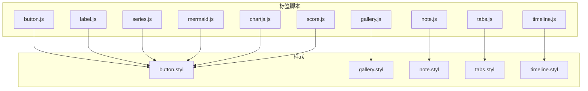
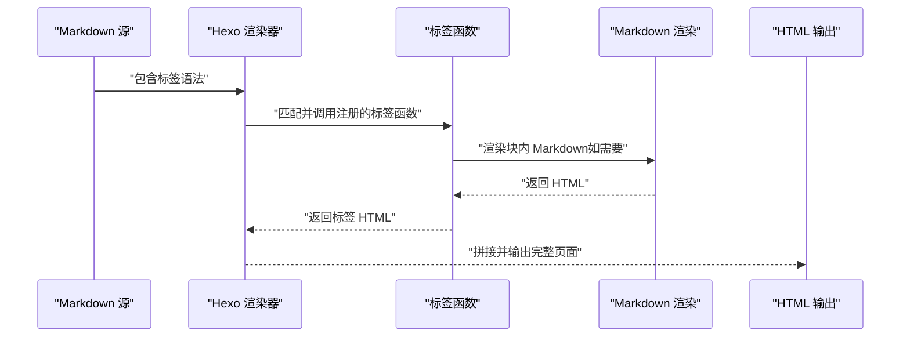
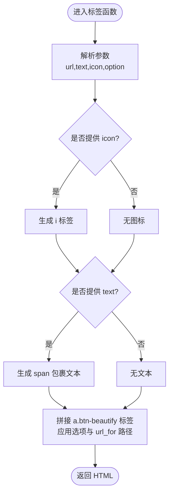
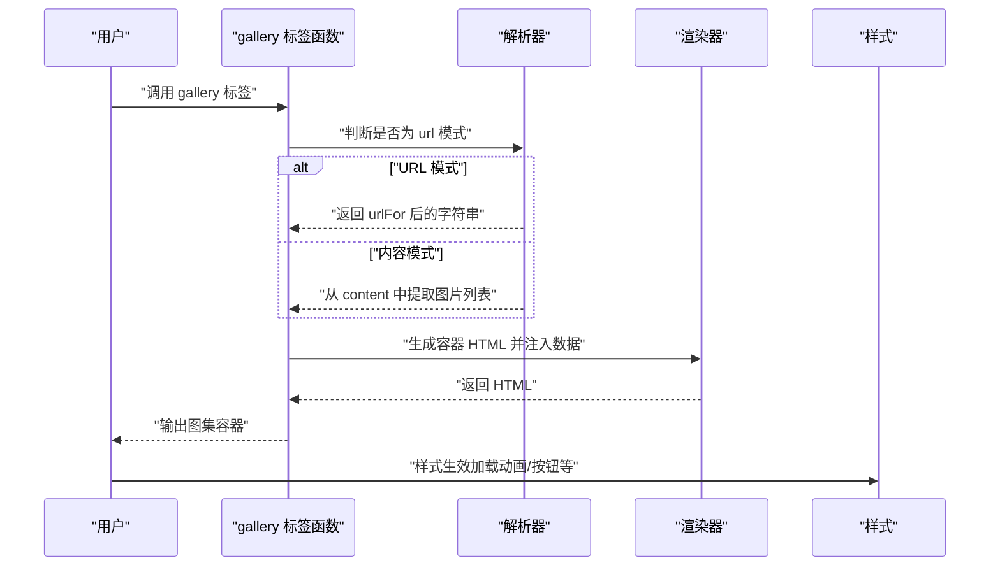
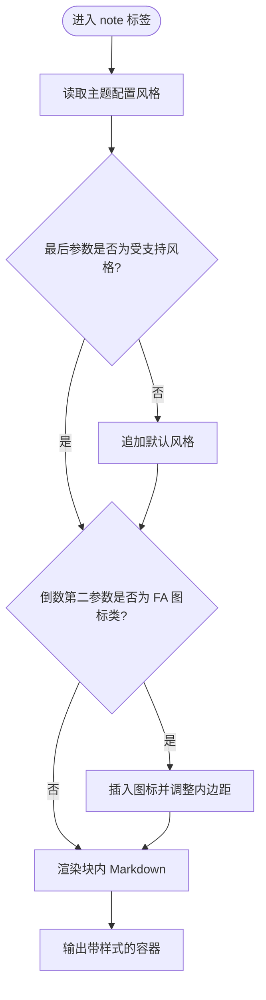
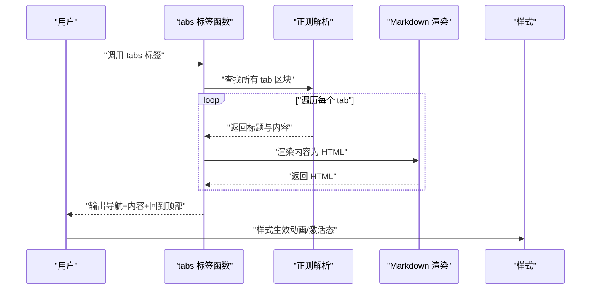
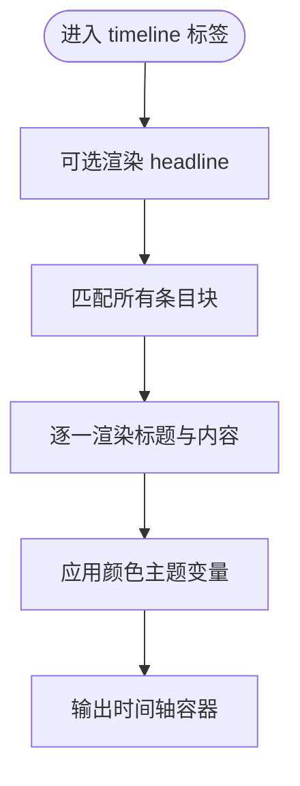
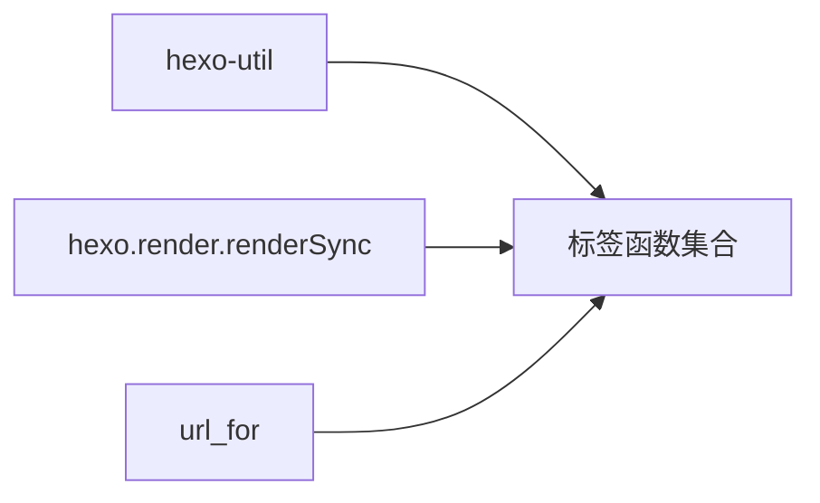

# 自定义标签

<cite>
**本文引用的文件**
- [button.js](file://themes/butterfly/scripts/tag/button.js)
- [gallery.js](file://themes/butterfly/scripts/tag/gallery.js)
- [note.js](file://themes/butterfly/scripts/tag/note.js)
- [tabs.js](file://themes/butterfly/scripts/tag/tabs.js)
- [timeline.js](file://themes/butterfly/scripts/tag/timeline.js)
- [label.js](file://themes/butterfly/scripts/tag/label.js)
- [series.js](file://themes/butterfly/scripts/tag/series.js)
- [mermaid.js](file://themes/butterfly/scripts/tag/mermaid.js)
- [chartjs.js](file://themes/butterfly/scripts/tag/chartjs.js)
- [score.js](file://themes/butterfly/scripts/tag/score.js)
- [button.styl](file://themes/butterfly/source/css/_tags/button.styl)
- [gallery.styl](file://themes/butterfly/source/css/_tags/gallery.styl)
- [note.styl](file://themes/butterfly/source/css/_tags/note.styl)
- [tabs.styl](file://themes/butterfly/source/css/_tags/tabs.styl)
- [timeline.styl](file://themes/butterfly/source/css/_tags/timeline.styl)
</cite>

## 目录
1. [简介](#简介)
2. [项目结构](#项目结构)
3. [核心组件](#核心组件)
4. [架构总览](#架构总览)
5. [详细组件分析](#详细组件分析)
6. [依赖关系分析](#依赖关系分析)
7. [性能考量](#性能考量)
8. [故障排查指南](#故障排查指南)
9. [结论](#结论)
10. [附录：使用示例与最佳实践](#附录使用示例与最佳实践)

## 简介
本文件系统性梳理 Butterfly 主题的自定义标签体系，覆盖标签注册机制、参数解析、HTML 生成与样式定制，并对常用内置标签（按钮、图集、注释、选项卡、时间线、标签、系列、流程图、图表、乐谱）进行功能说明与使用指导。同时提供自定义标签开发指南与渲染生命周期、性能优化策略，帮助读者在不直接阅读源码的情况下高效掌握标签能力。

## 项目结构
Butterfly 主题通过 scripts/tag 下的各标签脚本实现 Hexo 标签扩展，配合 source/css/_tags 下的样式文件完成视觉呈现。标签注册统一通过 hexo.extend.tag.register 完成，部分标签还结合了 hexo.extend.filter 进行数据预处理（如系列标签）。

**图表来源**
- [button.js:1-22](file://themes/butterfly/scripts/tag/button.js#L1-L22)
- [gallery.js:1-77](file://themes/butterfly/scripts/tag/gallery.js#L1-L77)
- [note.js:1-28](file://themes/butterfly/scripts/tag/note.js#L1-L28)
- [tabs.js:1-52](file://themes/butterfly/scripts/tag/tabs.js#L1-L52)
- [timeline.js:1-51](file://themes/butterfly/scripts/tag/timeline.js#L1-L51)
- [label.js:1-15](file://themes/butterfly/scripts/tag/label.js#L1-L15)
- [series.js:1-64](file://themes/butterfly/scripts/tag/series.js#L1-L64)
- [mermaid.js:1-19](file://themes/butterfly/scripts/tag/mermaid.js#L1-L19)
- [chartjs.js:1-50](file://themes/butterfly/scripts/tag/chartjs.js#L1-L50)
- [score.js:1-51](file://themes/butterfly/scripts/tag/score.js#L1-L51)
- [button.styl:1-64](file://themes/butterfly/source/css/_tags/button.styl#L1-L64)
- [gallery.styl:1-219](file://themes/butterfly/source/css/_tags/gallery.styl#L1-L219)
- [note.styl:1-126](file://themes/butterfly/source/css/_tags/note.styl#L1-L126)
- [tabs.styl:1-78](file://themes/butterfly/source/css/_tags/tabs.styl#L1-L78)
- [timeline.styl:1-68](file://themes/butterfly/source/css/_tags/timeline.styl#L1-L68)

**章节来源**
- [button.js:1-22](file://themes/butterfly/scripts/tag/button.js#L1-L22)
- [gallery.js:1-77](file://themes/butterfly/scripts/tag/gallery.js#L1-L77)
- [note.js:1-28](file://themes/butterfly/scripts/tag/note.js#L1-L28)
- [tabs.js:1-52](file://themes/butterfly/scripts/tag/tabs.js#L1-L52)
- [timeline.js:1-51](file://themes/butterfly/scripts/tag/timeline.js#L1-L51)
- [label.js:1-15](file://themes/butterfly/scripts/tag/label.js#L1-L15)
- [series.js:1-64](file://themes/butterfly/scripts/tag/series.js#L1-L64)
- [mermaid.js:1-19](file://themes/butterfly/scripts/tag/mermaid.js#L1-L19)
- [chartjs.js:1-50](file://themes/butterfly/scripts/tag/chartjs.js#L1-L50)
- [score.js:1-51](file://themes/butterfly/scripts/tag/score.js#L1-L51)

## 核心组件
- 标签注册与生命周期
  - 所有标签通过 hexo.extend.tag.register 注册，支持 ends: true/false 控制是否为块级标签。
  - 部分标签使用 hexo.extend.filter（如 before_post_render）进行数据收集或预处理。
- 参数解析与 HTML 生成
  - 多数标签采用 args 数组解析参数，content 获取块内 Markdown 内容并通过 hexo.render.renderSync 渲染为 HTML。
  - 使用 url_for 对链接进行站点路径转换，确保跨环境兼容。
- 样式与主题变量
  - 样式通过 Stylus 编写，广泛使用 CSS 变量与颜色类型枚举，便于主题切换与个性化定制。

**章节来源**
- [button.js:10-21](file://themes/butterfly/scripts/tag/button.js#L10-L21)
- [gallery.js:12-76](file://themes/butterfly/scripts/tag/gallery.js#L12-L76)
- [note.js:9-27](file://themes/butterfly/scripts/tag/note.js#L9-L27)
- [tabs.js:9-49](file://themes/butterfly/scripts/tag/tabs.js#L9-L49)
- [timeline.js:16-50](file://themes/butterfly/scripts/tag/timeline.js#L16-L50)
- [label.js:9-14](file://themes/butterfly/scripts/tag/label.js#L9-L14)
- [series.js:15-63](file://themes/butterfly/scripts/tag/series.js#L15-L63)
- [mermaid.js:11-18](file://themes/butterfly/scripts/tag/mermaid.js#L11-L18)
- [chartjs.js:17-49](file://themes/butterfly/scripts/tag/chartjs.js#L17-L49)
- [score.js:8-50](file://themes/butterfly/scripts/tag/score.js#L8-L50)

## 架构总览
下图展示标签系统在渲染过程中的调用链：Markdown 文本经由 Hexo 渲染器识别标签语法，调用对应标签函数，生成 HTML 片段，最终拼接到文章内容中；样式文件根据类名与变量控制外观。

**图表来源**
- [note.js:9-24](file://themes/butterfly/scripts/tag/note.js#L9-L24)
- [tabs.js:9-46](file://themes/butterfly/scripts/tag/tabs.js#L9-L46)
- [timeline.js:16-47](file://themes/butterfly/scripts/tag/timeline.js#L16-L47)
- [chartjs.js:17-46](file://themes/butterfly/scripts/tag/chartjs.js#L17-L46)
- [mermaid.js:11-16](file://themes/butterfly/scripts/tag/mermaid.js#L11-L16)

## 详细组件分析

### 按钮标签（btn）
- 功能概述
  - 生成带图标与文本的可点击按钮，支持多种样式选项与颜色。
- 参数与行为
  - 语法：
  - 参数解析：按逗号拆分，逐项 trim 后取默认值。
  - 选项：颜色（多色）、outline（描边）、center/block/larger 等。
  - 图标：若提供 icon，则包裹为 i 标签；文本包裹为 span。
  - 链接：通过 url_for 转换为绝对路径。
- 样式与定制
  - 基于 button.styl 的变量与颜色类型枚举，支持 hover 效果、描边变体等。
- 典型场景
  - 导航按钮、资源下载入口、外链跳转。

**图表来源**
- [button.js:12-19](file://themes/butterfly/scripts/tag/button.js#L12-L19)
- [button.styl:6-64](file://themes/butterfly/source/css/_tags/button.styl#L6-L64)

**章节来源**
- [button.js:3-21](file://themes/butterfly/scripts/tag/button.js#L3-L21)
- [button.styl:1-64](file://themes/butterfly/source/css/_tags/button.styl#L1-L64)

### 图集标签（gallery 与 galleryGroup）
- 功能概述
  - gallery 支持两种模式：URL 模式（传入外部集合地址）与内容模式（从块内解析 Markdown 图片）。
  - galleryGroup 提供图集分组卡片展示，含标题、描述与封面图。
- 参数与行为
  - gallery： 或 ；支持 button、limit、firstLimit 等参数；内容模式通过正则提取图片信息。
  - galleryGroup：。
  - 数据传递：URL 模式使用 url_for；内容模式将图片数组序列化为 JSON 字符串。
- 样式与交互
  - gallery 容器通过 data-* 属性承载配置；加载完成后显示透明度过渡；提供加载动画与“更多”按钮样式。
- 典型场景
  - 相册墙、作品集、图库导航。

**图表来源**
- [gallery.js:42-76](file://themes/butterfly/scripts/tag/gallery.js#L42-L76)
- [gallery.styl:100-219](file://themes/butterfly/source/css/_tags/gallery.styl#L100-L219)

**章节来源**
- [gallery.js:4-76](file://themes/butterfly/scripts/tag/gallery.js#L4-L76)
- [gallery.styl:1-219](file://themes/butterfly/source/css/_tags/gallery.styl#L1-L219)

### 注释标签（note 与 subnote）
- 功能概述
  - 将块内 Markdown 渲染为带样式的提示框，支持多种风格与颜色。
- 参数与行为
  - 语法：...，末尾参数决定风格（flat/modern/simple/disabled），未提供时取主题配置。
  - 支持在倒数第二位传入 Font Awesome 图标类名，自动插入图标并调整内边距。
  - 通过 hexo.render.renderSync 渲染块内 Markdown。
- 样式与定制
  - note.styl 定义了不同风格与颜色类型的样式映射，支持现代、扁平、简洁等风格以及图标显示控制。

**图表来源**
- [note.js:9-24](file://themes/butterfly/scripts/tag/note.js#L9-L24)
- [note.styl:1-126](file://themes/butterfly/source/css/_tags/note.styl#L1-L126)

**章节来源**
- [note.js:1-28](file://themes/butterfly/scripts/tag/note.js#L1-L28)
- [note.styl:1-126](file://themes/butterfly/source/css/_tags/note.styl#L1-L126)

### 选项卡标签（tabs、subtabs、subsubtabs）
- 功能概述
  - 在块内以注释分隔的方式定义多个选项卡页签，支持图标、标题与默认激活页。
- 参数与行为
  - 语法：，内部使用 <!-- tab 标题@图标 --> ... <!-- endtab --> 分割内容。
  - 解析：遍历所有匹配，渲染每个页签内容为 Markdown，构造导航按钮与内容区。
  - 默认激活：默认激活第 1 个，或根据参数指定索引。
  - 底部“回到顶部”按钮用于快速滚动。
- 样式与交互
  - tabs.styl 定义页签按钮、内容区与动画效果，支持悬停与激活态样式。

**图表来源**
- [tabs.js:9-49](file://themes/butterfly/scripts/tag/tabs.js#L9-L49)
- [tabs.styl:1-78](file://themes/butterfly/source/css/_tags/tabs.styl#L1-L78)

**章节来源**
- [tabs.js:1-52](file://themes/butterfly/scripts/tag/tabs.js#L1-L52)
- [tabs.styl:1-78](file://themes/butterfly/source/css/_tags/tabs.styl#L1-L78)

### 时间线标签（timeline）
- 功能概述
  - 以时间轴形式展示一系列条目，支持可选的“头条”标题与颜色主题。
- 参数与行为
  - 语法：，内部使用 <!-- timeline 标题 --> ... <!-- endtimeline --> 定义条目。
  - 解析：使用命名捕获组一次性匹配所有条目，逐一渲染标题与内容。
  - 颜色：支持多色主题变量映射。
- 样式与交互
  - timeline.styl 定义时间轴主干、圆点、标题与内容区域的样式与悬停效果。

**图表来源**
- [timeline.js:16-47](file://themes/butterfly/scripts/tag/timeline.js#L16-L47)
- [timeline.styl:1-68](file://themes/butterfly/source/css/_tags/timeline.styl#L1-L68)

**章节来源**
- [timeline.js:1-51](file://themes/butterfly/scripts/tag/timeline.js#L1-L51)
- [timeline.styl:1-68](file://themes/butterfly/source/css/_tags/timeline.styl#L1-L68)

### 标签（label）
- 功能概述
  - 生成高亮标签（mark），支持颜色类名。
- 参数与行为
  - 语法：，默认颜色类名为 default。
- 样式与定制
  - 与按钮等标签共享颜色类型系统，便于统一风格。

**章节来源**
- [label.js:1-15](file://themes/butterfly/scripts/tag/label.js#L1-L15)

### 系列（series）
- 功能概述
  - 基于文章的 series 字段，按配置排序生成系列文章列表。
- 参数与行为
  - 注册过滤器 before_post_render 收集同系列文章；标签函数根据系列名或当前文章系列生成列表。
  - 支持升序/降序与按标题或日期排序。
- 样式与定制
  - 列表类型由配置决定（有序/无序）。

**章节来源**
- [series.js:15-63](file://themes/butterfly/scripts/tag/series.js#L15-L63)

### 流程图（mermaid）
- 功能概述
  - 将块内 Mermaid 语法封装为可执行的图示容器，支持传入配置对象。
- 参数与行为
  - 语法：...；配置通过 data-config 传递，内容通过隐藏元素保存。
- 样式与定制
  - 作为独立容器存在，样式由主题全局样式控制。

**章节来源**
- [mermaid.js:1-19](file://themes/butterfly/scripts/tag/mermaid.js#L1-L19)

### 图表（chartjs）
- 功能概述
  - 通过自定义注释块定义图表配置与描述，生成图表容器。
- 参数与行为
  - 语法：，内部使用 <!-- chart --> 与 <!-- desc --> 注释块。
  - 支持横向并排布局、宽度百分比与图表 ID。
- 样式与定制
  - 容器通过 data-* 属性承载配置，样式由主题样式控制。

**章节来源**
- [chartjs.js:1-50](file://themes/butterfly/scripts/tag/chartjs.js#L1-L50)

### 乐谱（score）
- 功能概述
  - 解析 ABC 乐谱内容，支持参数块与乐谱主体分离。
- 参数与行为
  - 语法：...；以六条短横线作为分隔，第一段为参数 JSON，其余为乐谱内容。
  - 参数通过 data-params 传递，内容进行 HTML 转义以保证安全。
- 样式与定制
  - 作为独立容器存在，样式由主题全局样式控制。

**章节来源**
- [score.js:1-51](file://themes/butterfly/scripts/tag/score.js#L1-L51)

## 依赖关系分析
- 组件耦合
  - 标签函数之间低耦合，均通过 hexo.extend.tag.register 注册，彼此独立。
  - 部分标签依赖 hexo.render.renderSync 进行 Markdown 渲染，形成渲染层依赖。
  - gallery 与 series 依赖 url_for 进行链接转换。
- 外部依赖
  - hexo-util 提供 url_for 与 escapeHTML 等工具。
  - 样式依赖主题变量与颜色类型枚举，便于主题切换。
- 潜在循环依赖
  - 当前结构无显式循环依赖，但需注意标签间不要互相调用导致的渲染死循环。

**图表来源**
- [button.js:10-10](file://themes/butterfly/scripts/tag/button.js#L10-L10)
- [gallery.js:12-12](file://themes/butterfly/scripts/tag/gallery.js#L12-L12)
- [note.js:23-23](file://themes/butterfly/scripts/tag/note.js#L23-L23)
- [tabs.js:29-29](file://themes/butterfly/scripts/tag/tabs.js#L29-L29)
- [timeline.js:21-21](file://themes/butterfly/scripts/tag/timeline.js#L21-L21)
- [chartjs.js:15-15](file://themes/butterfly/scripts/tag/chartjs.js#L15-L15)
- [mermaid.js:9-9](file://themes/butterfly/scripts/tag/mermaid.js#L9-L9)
- [score.js:9-9](file://themes/butterfly/scripts/tag/score.js#L9-L9)

**章节来源**
- [button.js:10-10](file://themes/butterfly/scripts/tag/button.js#L10-L10)
- [gallery.js:12-12](file://themes/butterfly/scripts/tag/gallery.js#L12-L12)
- [note.js:23-23](file://themes/butterfly/scripts/tag/note.js#L23-L23)
- [tabs.js:29-29](file://themes/butterfly/scripts/tag/tabs.js#L29-L29)
- [timeline.js:21-21](file://themes/butterfly/scripts/tag/timeline.js#L21-L21)
- [chartjs.js:15-15](file://themes/butterfly/scripts/tag/chartjs.js#L15-L15)
- [mermaid.js:9-9](file://themes/butterfly/scripts/tag/mermaid.js#L9-L9)
- [score.js:9-9](file://themes/butterfly/scripts/tag/score.js#L9-L9)

## 性能考量
- 渲染成本控制
  - 尽量减少块内复杂 Markdown 渲染次数，优先在标签函数内合并渲染。
  - 对于需要多次遍历的内容（如 tabs、timeline），使用一次正则匹配或迭代，避免重复计算。
- 资源加载
  - 图集与图表类标签建议按需加载，避免一次性渲染过多节点。
- 样式体积
  - 复用颜色类型与变量，减少重复样式定义，降低 CSS 体积。
- 日志与错误
  - 对缺失必要内容的标签（如 chartjs 缺少 chart 内容）输出警告日志，便于定位问题。

[本节为通用性能建议，无需特定文件引用]

## 故障排查指南
- 常见问题
  - 标签未生效：确认标签语法正确且已注册；检查 ends: true/false 是否与标签类型一致。
  - 链接异常：确认使用 url_for 转换相对路径；检查站点根路径配置。
  - 图集不显示：检查 gallery 参数与内容模式是否匹配；确认图片链接有效。
  - 选项卡不切换：检查 tab 注释分隔是否规范；确认默认激活索引合法。
  - 时间线无内容：检查 timeline 注释块是否闭合；确认标题与内容已正确包裹。
- 调试建议
  - 在标签函数中打印关键参数与中间结果，定位解析问题。
  - 使用浏览器开发者工具查看生成的 HTML 结构与样式类名。

**章节来源**
- [chartjs.js:29-32](file://themes/butterfly/scripts/tag/chartjs.js#L29-L32)
- [gallery.js:48-59](file://themes/butterfly/scripts/tag/gallery.js#L48-L59)
- [tabs.js:21-40](file://themes/butterfly/scripts/tag/tabs.js#L21-L40)
- [timeline.js:18-47](file://themes/butterfly/scripts/tag/timeline.js#L18-L47)

## 结论
Butterfly 主题的自定义标签体系以轻量、可扩展为核心设计原则：通过统一的注册机制与参数解析，结合主题变量与样式系统，实现了丰富的可视化组件。理解标签的渲染生命周期与样式映射，有助于在不修改源码的前提下灵活定制内容表现。

[本节为总结性内容，无需特定文件引用]

## 附录：使用示例与最佳实践
- 示例与建议
  - 按钮：合理使用 outline 与颜色类名，保持与主题配色一致；图标与文本搭配提升可读性。
  - 图集：内容模式适合小规模图集，URL 模式适合大规模图集；为图集设置合适的 limit 与 firstLimit。
  - 注释：优先使用现代风格，图标与颜色增强信息层级；避免在简洁风格中混用复杂装饰。
  - 选项卡：为每个 tab 提供清晰标题与可选图标；限制每页内容长度，提升可读性。
  - 时间线：为重要节点添加 headline；使用颜色区分不同类型事件。
  - 标签：与按钮等组件统一颜色类型，保持一致性。
  - 系列：启用 before_post_render 过滤器后，系列列表会自动按配置排序。
  - 流程图/图表/乐谱：将配置与内容分离，便于维护；必要时使用 data-* 属性传递参数。
- 最佳实践
  - 优先使用主题提供的颜色类型与变量，减少自定义样式。
  - 对复杂标签（tabs、timeline、gallery）尽量控制单次渲染的数据量。
  - 在标签函数中进行必要的输入校验与日志输出，便于调试。

[本节为通用实践建议，无需特定文件引用]