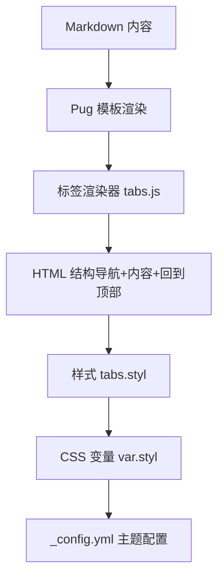
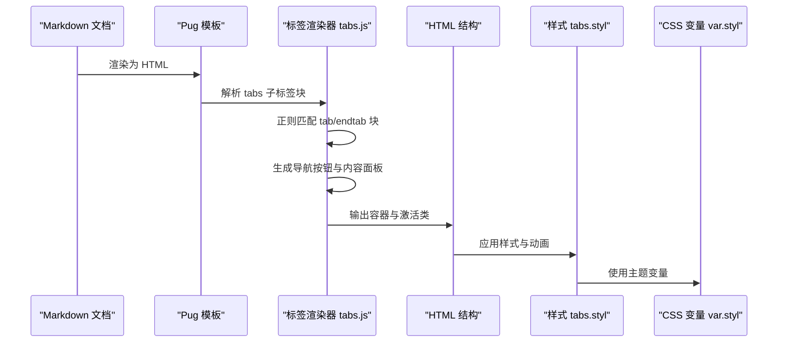
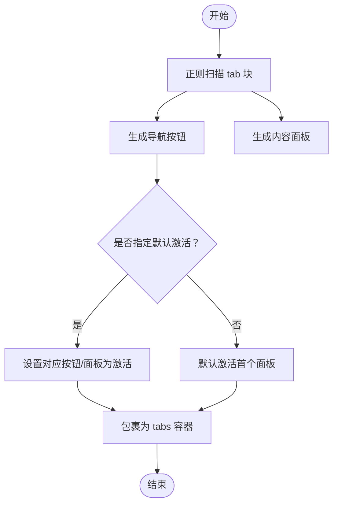
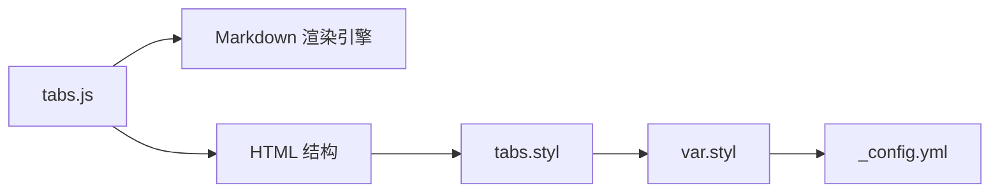

# 选项卡标签

<cite>
**本文引用的文件**
- [scripts/tag/tabs.js](file://themes/butterfly/scripts/tag/tabs.js)
- [source/css/_tags/tabs.styl](file://themes/butterfly/source/css/_tags/tabs.styl)
- [source/css/var.styl](file://themes/butterfly/source/css/var.styl)
- [_config.yml](file://themes/butterfly/_config.yml)
- [layout/includes/layout.pug](file://themes/butterfly/layout/includes/layout.pug)
</cite>

## 目录
1. [简介](#简介)
2. [项目结构](#项目结构)
3. [核心组件](#核心组件)
4. [架构总览](#架构总览)
5. [组件详解](#组件详解)
6. [依赖关系分析](#依赖关系分析)
7. [性能与体验](#性能与体验)
8. [故障排查](#故障排查)
9. [结论](#结论)
10. [附录](#附录)

## 简介
本篇文档围绕 Hexo 主题 Butterfly 中的“选项卡标签”（tabs）标签插件展开，系统讲解其嵌套结构、多面板内容组织、创建语法、样式定制、响应式设计以及交互体验优化策略。同时给出在复杂内容场景（如代码对比、多语言支持、功能介绍）中的应用思路与最佳实践。

## 项目结构
选项卡标签由三部分组成：
- 标签渲染器：负责解析模板语法并生成 DOM 结构
- 样式层：定义选项卡按钮、内容区、动画与响应式行为
- 变量与主题配置：通过 CSS 变量控制颜色与主题一致性

图表来源
- [scripts/tag/tabs.js:9-52](file://themes/butterfly/scripts/tag/tabs.js#L9-L52)
- [source/css/_tags/tabs.styl:1-78](file://themes/butterfly/source/css/_tags/tabs.styl#L1-L78)
- [source/css/var.styl:174-182](file://themes/butterfly/source/css/var.styl#L174-L182)
- [_config.yml](file://themes/butterfly/_config.yml)

章节来源
- [scripts/tag/tabs.js:9-52](file://themes/butterfly/scripts/tag/tabs.js#L9-L52)
- [source/css/_tags/tabs.styl:1-78](file://themes/butterfly/source/css/_tags/tabs.styl#L1-L78)
- [source/css/var.styl:174-182](file://themes/butterfly/source/css/var.styl#L174-L182)
- [_config.yml](file://themes/butterfly/_config.yml)

## 核心组件
- 标签渲染器（tabs.js）
  - 支持主标签组与嵌套子标签组（subtabs、subsubtabs）
  - 解析每一块 tab 内容，生成带激活状态的导航按钮与内容面板
  - 自动注入“回到顶部”按钮，便于长内容切换
- 样式层（tabs.styl）
  - 导航区采用弹性布局，支持换行
  - 内容区默认隐藏，仅显示当前激活面板，配合淡入动画
  - 响应式适配移动端内边距
- 变量与主题配置（var.styl、_config.yml）
  - 通过 CSS 变量统一控制边框色、按钮背景/悬停、激活态边框、回到顶部颜色等
  - 主题配置可影响整体视觉风格，确保与站点一致

章节来源
- [scripts/tag/tabs.js:9-52](file://themes/butterfly/scripts/tag/tabs.js#L9-L52)
- [source/css/_tags/tabs.styl:12-78](file://themes/butterfly/source/css/_tags/tabs.styl#L12-L78)
- [source/css/var.styl:174-182](file://themes/butterfly/source/css/var.styl#L174-L182)
- [_config.yml](file://themes/butterfly/_config.yml)

## 架构总览
从 Markdown 到最终渲染的流程如下：

图表来源
- [scripts/tag/tabs.js:10-49](file://themes/butterfly/scripts/tag/tabs.js#L10-L49)
- [source/css/_tags/tabs.styl:12-78](file://themes/butterfly/source/css/_tags/tabs.styl#L12-L78)
- [source/css/var.styl:174-182](file://themes/butterfly/source/css/var.styl#L174-L182)

## 组件详解

### 1) 语法与嵌套结构
- 语法要点
  - 使用 tabs 开始与结束标记包裹多个 tab 块
  - 每个 tab 块以特定分隔符开头，内部为 Markdown 内容
  - 支持主标签组与嵌套子标签组（subtabs、subsubtabs），用于构建层级化内容
- 标签块格式
  - 标题与图标：标题文本可与图标类名组合；若未提供标题或图标，则自动生成序号标题
  - 激活规则：可通过参数指定默认激活的面板索引；未指定时默认第一个激活
- 导航与内容
  - 导航区：每个标签页生成一个按钮，包含图标与标题
  - 内容区：每个标签页对应一个内容面板，默认隐藏，仅当前激活面板可见
  - 回到顶部：在导航下方提供“回到顶部”按钮，提升长内容切换体验

章节来源
- [scripts/tag/tabs.js:9-49](file://themes/butterfly/scripts/tag/tabs.js#L9-L49)

### 2) 数据流与处理逻辑
- 输入：Markdown 文档中包含 tabs 标签块
- 处理：
  - 正则扫描所有 tab/endtab 块，提取标题与内容
  - 将内容通过 Markdown 渲染引擎转换为 HTML
  - 根据激活规则为对应按钮与内容面板添加“激活”类
- 输出：包含导航区、内容区与回到顶部按钮的整体容器

图表来源
- [scripts/tag/tabs.js:10-46](file://themes/butterfly/scripts/tag/tabs.js#L10-L46)

### 3) 样式与响应式设计
- 导航区
  - 弹性布局，支持换行；按钮具有过渡动画与悬停效果
  - 激活态按钮改变边框与背景色，突出当前选中
- 内容区
  - 默认隐藏，激活态显示并带有上移淡入动画
  - 移动端内边距适配，保证阅读体验
- 回到顶部
  - 仅在存在默认激活时显示，点击后平滑滚动至顶部

章节来源
- [source/css/_tags/tabs.styl:12-78](file://themes/butterfly/source/css/_tags/tabs.styl#L12-L78)

### 4) 样式定制与主题变量
- 关键变量
  - 边框色、按钮背景/文字色、悬停背景、激活态边框色、回到顶部颜色与悬停色
- 定制方式
  - 通过主题配置文件设置主题色，进而影响选项卡的视觉风格
  - 直接覆盖 CSS 变量可实现更精细的定制

章节来源
- [source/css/var.styl:174-182](file://themes/butterfly/source/css/var.styl#L174-L182)
- [_config.yml](file://themes/butterfly/_config.yml)

### 5) JavaScript 交互逻辑与用户体验
- 交互机制
  - 点击导航按钮切换对应内容面板，保持其余面板隐藏
  - 激活态按钮禁用交互，避免重复切换
  - “回到顶部”按钮在导航区下方，便于长内容浏览
- 体验优化
  - 淡入动画提升切换流畅度
  - 悬停高亮增强可发现性
  - 响应式布局适配移动端

章节来源
- [scripts/tag/tabs.js:31-46](file://themes/butterfly/scripts/tag/tabs.js#L31-L46)
- [source/css/_tags/tabs.styl:36-78](file://themes/butterfly/source/css/_tags/tabs.styl#L36-L78)

### 6) 复杂内容场景应用示例
- 代码对比
  - 使用多个 tab 展示不同语言或版本的代码片段，便于横向对比
- 多语言支持
  - 以语言为标签页组织内容，适合多语言文档或教程
- 功能介绍
  - 将复杂功能拆分为若干子模块，分别置于不同标签页，提升可读性与导航效率

（本节为概念性说明，不直接分析具体文件）

### 7) 最佳实践与注意事项
- 结构清晰
  - 合理划分标签页数量，避免过多导致信息过载
  - 标题简洁明确，必要时配合图标增强识别度
- 性能与可访问性
  - 控制内容体积，避免在激活态一次性加载大量资源
  - 为按钮提供可读的标题与无障碍标签
- 样式一致性
  - 使用主题变量统一风格，确保与站点整体设计协调
- 嵌套层级
  - 适度使用子标签组，避免层级过深影响用户理解

（本节为通用指导，不直接分析具体文件）

## 依赖关系分析
- 标签渲染器依赖 Markdown 渲染引擎将内容转为 HTML
- 样式层依赖 CSS 变量实现主题化
- 主题配置通过变量影响样式表现

图表来源
- [scripts/tag/tabs.js:29](file://themes/butterfly/scripts/tag/tabs.js#L29)
- [source/css/_tags/tabs.styl:12-78](file://themes/butterfly/source/css/_tags/tabs.styl#L12-L78)
- [source/css/var.styl:174-182](file://themes/butterfly/source/css/var.styl#L174-L182)
- [_config.yml](file://themes/butterfly/_config.yml)

章节来源
- [scripts/tag/tabs.js:29](file://themes/butterfly/scripts/tag/tabs.js#L29)
- [source/css/_tags/tabs.styl:12-78](file://themes/butterfly/source/css/_tags/tabs.styl#L12-L78)
- [source/css/var.styl:174-182](file://themes/butterfly/source/css/var.styl#L174-L182)
- [_config.yml](file://themes/butterfly/_config.yml)

## 性能与体验
- 性能
  - 内容按需渲染，仅激活面板参与动画与布局计算
  - 建议避免在激活态加载超大资源，可采用懒加载或延迟初始化
- 体验
  - 悬停与激活态的视觉反馈提升交互感知
  - 移动端内边距与换行策略改善触摸与阅读体验

（本节为通用指导，不直接分析具体文件）

## 故障排查
- 标签页未显示或全部隐藏
  - 检查是否存在有效的 tab 块与正确的结束标记
  - 确认激活参数是否正确，避免默认激活被覆盖
- 图标不生效
  - 确认图标类名正确且外部字体库已加载
- 样式异常
  - 检查主题变量是否被覆盖或冲突
  - 确认样式文件已正确编译并加载

章节来源
- [scripts/tag/tabs.js:10-46](file://themes/butterfly/scripts/tag/tabs.js#L10-L46)
- [source/css/_tags/tabs.styl:12-78](file://themes/butterfly/source/css/_tags/tabs.styl#L12-L78)
- [source/css/var.styl:174-182](file://themes/butterfly/source/css/var.styl#L174-L182)

## 结论
选项卡标签在 Butterfly 主题中提供了结构化、可嵌套、可主题化的多面板内容组织能力。通过合理的语法与样式配置，可在复杂内容场景中显著提升信息密度与可读性。结合主题变量与响应式设计，可进一步优化跨设备体验。

## 附录
- 相关文件路径
  - 标签渲染器：[scripts/tag/tabs.js](file://themes/butterfly/scripts/tag/tabs.js)
  - 样式定义：[source/css/_tags/tabs.styl](file://themes/butterfly/source/css/_tags/tabs.styl)
  - 主题变量：[source/css/var.styl](file://themes/butterfly/source/css/var.styl)
  - 主题配置：[_config.yml](file://themes/butterfly/_config.yml)
  - 页面布局（渲染入口）：[layout/includes/layout.pug](file://themes/butterfly/layout/includes/layout.pug)