# GitHub Actions工作流

<cite>
**本文档引用的文件**
- [_config.yml](file://_config.yml)
- [package.json](file://package.json)
- [themes/butterfly/package.json](file://themes/butterfly/package.json)
- [themes/butterfly/_config.yml](file://themes/butterfly/_config.yml)
- [themes/butterfly/plugins.yml](file://themes/butterfly/plugins.yml)
- [themes/butterfly/source/js/main.js](file://themes/butterfly/source/js/main.js)
- [themes/butterfly/source/css/index.styl](file://themes/butterfly/source/css/index.styl)
- [themes/butterfly/layout/layout.pug](file://themes/butterfly/layout/layout.pug)
- [themes/butterfly/scripts/common/default_config.js](file://themes/butterfly/scripts/common/default_config.js)
- [themes/butterfly/scripts/events/init.js](file://themes/butterfly/scripts/events/init.js)
- [themes/butterfly/scripts/helpers/page.js](file://themes/butterfly/scripts/helpers/page.js)
- [themes/butterfly/scripts/tag/button.js](file://themes/butterfly/scripts/tag/button.js)
- [themes/butterfly/scripts/tag/tabs.js](file://themes/butterfly/scripts/tag/tabs.js)
- [themes/butterfly/scripts/tag/timeline.js](file://themes/butterfly/scripts/tag/timeline.js)
- [themes/butterfly/scripts/tag/series.js](file://themes/butterfly/scripts/tag/series.js)
- [themes/butterfly/scripts/tag/gallery.js](file://themes/butterfly/scripts/tag/gallery.js)
- [themes/butterfly/scripts/tag/note.js](file://themes/butterfly/scripts/tag/note.js)
- [themes/butterfly/scripts/tag/mermaid.js](file://themes/butterfly/scripts/tag/mermaid.js)
- [themes/butterfly/scripts/tag/chartjs.js](file://themes/butterfly/scripts/tag/chartjs.js)
- [themes/butterfly/scripts/tag/inlineImg.js](file://themes/butterfly/scripts/tag/inlineImg.js)
- [themes/butterfly/scripts/tag/label.js](file://themes/butterfly/scripts/tag/label.js)
- [themes/butterfly/scripts/tag/score.js](file://themes/butterfly/scripts/tag/score.js)
- [themes/butterfly/scripts/tag/flink.js](file://themes/butterfly/scripts/tag/flink.js)
- [themes/butterfly/scripts/tag/hide.js](file://themes/butterfly/scripts/tag/hide.js)
- [themes/butterfly/scripts/tag/button.js](file://themes/butterfly/scripts/tag/button.js)
- [themes/butterfly/scripts/tag/tabs.js](file://themes/butterfly/scripts/tag/tabs.js)
- [themes/butterfly/scripts/tag/timeline.js](file://themes/butterfly/scripts/tag/timeline.js)
- [themes/butterfly/scripts/tag/series.js](file://themes/butterfly/scripts/tag/series.js)
- [themes/butterfly/scripts/tag/gallery.js](file://themes/butterfly/scripts/tag/gallery.js)
- [themes/butterfly/scripts/tag/note.js](file://themes/butterfly/scripts/tag/note.js)
- [themes/butterfly/scripts/tag/mermaid.js](file://themes/butterfly/scripts/tag/mermaid.js)
- [themes/butterfly/scripts/tag/chartjs.js](file://themes/butterfly/scripts/tag/chartjs.js)
- [themes/butterfly/scripts/tag/inlineImg.js](file://themes/butterfly/scripts/tag/inlineImg.js)
- [themes/butterfly/scripts/tag/label.js](file://themes/butterfly/scripts/tag/label.js)
- [themes/butterfly/scripts/tag/score.js](file://themes/butterfly/scripts/tag/score.js)
- [themes/butterfly/scripts/tag/flink.js](file://themes/butterfly/scripts/tag/flink.js)
- [themes/butterfly/scripts/tag/hide.js](file://themes/butterfly/scripts/tag/hide.js)
</cite>

## 目录
1. [简介](#简介)
2. [项目结构](#项目结构)
3. [核心组件](#核心组件)
4. [架构概览](#架构概览)
5. [详细组件分析](#详细组件分析)
6. [依赖关系分析](#依赖关系分析)
7. [性能考虑](#性能考虑)
8. [故障排除指南](#故障排除指南)
9. [结论](#结论)
10. [附录](#附录)

## 简介

这是一个基于Hexo框架的博客主题项目，使用Butterfly主题。该项目展示了现代静态网站生成器的典型架构，包括主题系统、标签插件、样式系统和JavaScript功能模块。

该项目的核心特点：
- 基于Hexo静态站点生成器
- 使用Pug模板引擎和Stylus样式预处理器
- 模块化的主题架构，支持多种标签插件
- 完整的前端资源管理
- 可扩展的JavaScript事件系统

## 项目结构

项目采用典型的Hexo主题结构，主要分为以下几个部分：

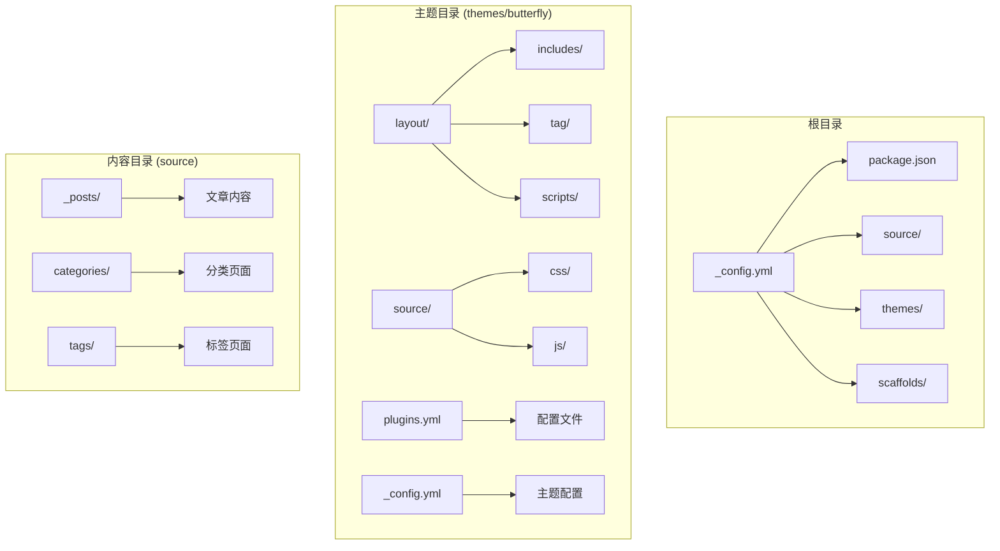

**图表来源**
- [_config.yml:1-120](file://_config.yml#L1-L120)
- [themes/butterfly/_config.yml:1-200](file://themes/butterfly/_config.yml#L1-L200)

**章节来源**
- [_config.yml:1-120](file://_config.yml#L1-L120)
- [themes/butterfly/_config.yml:1-200](file://themes/butterfly/_config.yml#L1-L200)

## 核心组件

### 配置管理系统

项目使用多层配置架构，确保灵活性和可维护性：

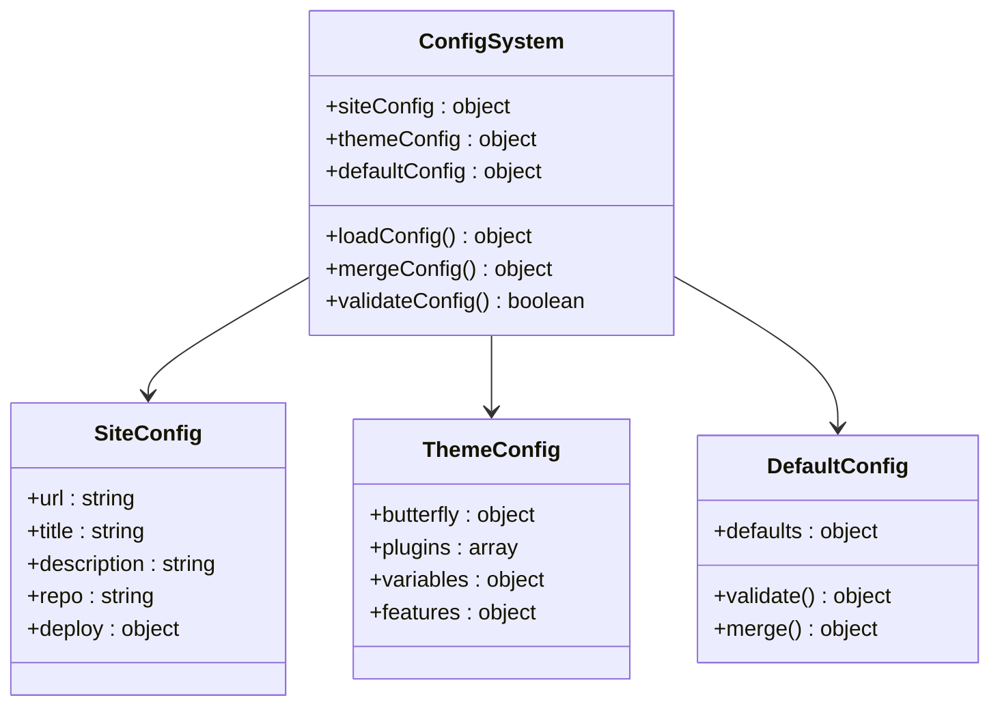

**图表来源**
- [_config.yml:1-120](file://_config.yml#L1-L120)
- [themes/butterfly/_config.yml:1-200](file://themes/butterfly/_config.yml#L1-L200)
- [themes/butterfly/scripts/common/default_config.js:1-100](file://themes/butterfly/scripts/common/default_config.js#L1-L100)

### 主题架构组件

Butterfly主题采用模块化设计，包含以下核心组件：

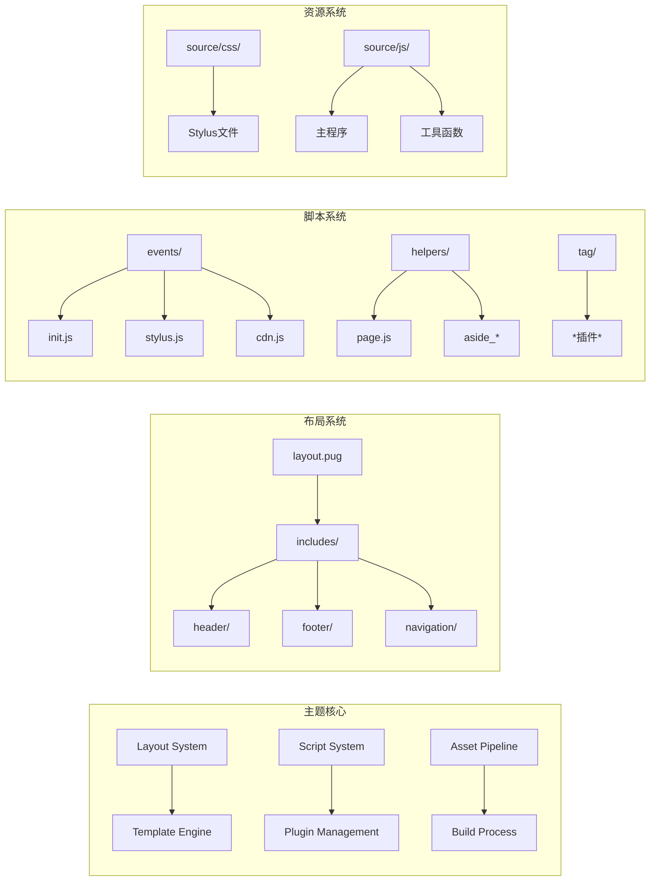

**图表来源**
- [themes/butterfly/layout/layout.pug:1-200](file://themes/butterfly/layout/layout.pug#L1-L200)
- [themes/butterfly/scripts/events/init.js:1-150](file://themes/butterfly/scripts/events/init.js#L1-L150)
- [themes/butterfly/scripts/helpers/page.js:1-100](file://themes/butterfly/scripts/helpers/page.js#L1-L100)

**章节来源**
- [themes/butterfly/_config.yml:1-200](file://themes/butterfly/_config.yml#L1-L200)
- [themes/butterfly/plugins.yml:1-100](file://themes/butterfly/plugins.yml#L1-L100)

## 架构概览

### 整体系统架构

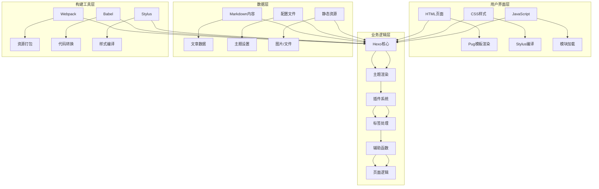

**图表来源**
- [themes/butterfly/layout/layout.pug:1-200](file://themes/butterfly/layout/layout.pug#L1-L200)
- [themes/butterfly/scripts/events/init.js:1-150](file://themes/butterfly/scripts/events/init.js#L1-L150)
- [themes/butterfly/scripts/helpers/page.js:1-100](file://themes/butterfly/scripts/helpers/page.js#L1-L100)

### 数据流架构

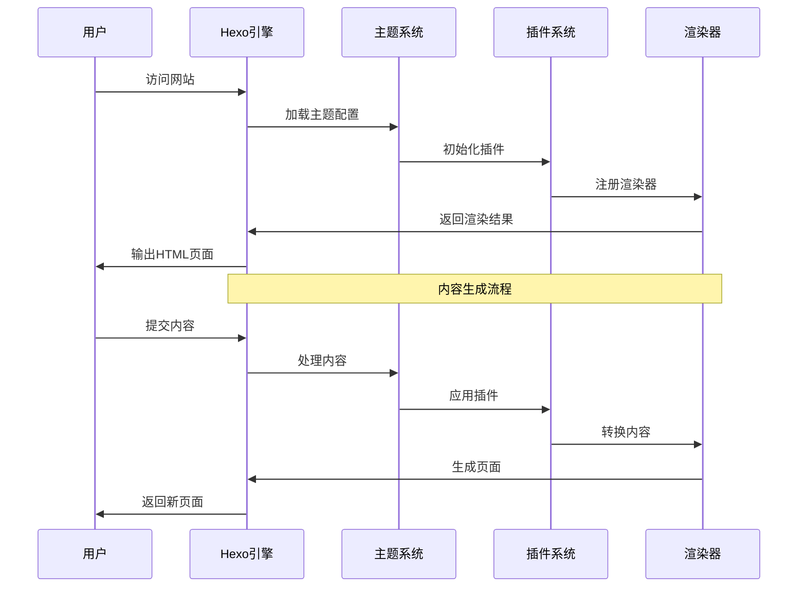

**图表来源**
- [themes/butterfly/scripts/events/init.js:1-150](file://themes/butterfly/scripts/events/init.js#L1-L150)
- [themes/butterfly/scripts/helpers/page.js:1-100](file://themes/butterfly/scripts/helpers/page.js#L1-L100)

## 详细组件分析

### 标签插件系统

Butterfly主题实现了丰富的标签插件系统，每个插件都有特定的功能和配置选项：

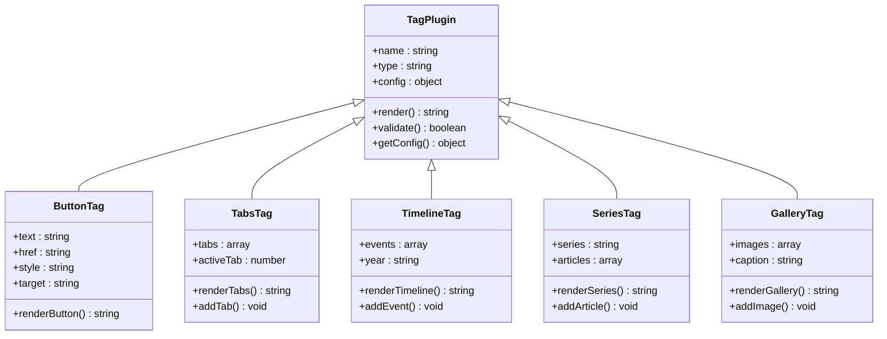

**图表来源**
- [themes/butterfly/scripts/tag/button.js:1-100](file://themes/butterfly/scripts/tag/button.js#L1-L100)
- [themes/butterfly/scripts/tag/tabs.js:1-100](file://themes/butterfly/scripts/tag/tabs.js#L1-L100)
- [themes/butterfly/scripts/tag/timeline.js:1-100](file://themes/butterfly/scripts/tag/timeline.js#L1-L100)
- [themes/butterfly/scripts/tag/series.js:1-100](file://themes/butterfly/scripts/tag/series.js#L1-L100)
- [themes/butterfly/scripts/tag/gallery.js:1-100](file://themes/butterfly/scripts/tag/gallery.js#L1-L100)

#### 按钮标签插件

按钮插件提供了灵活的链接创建功能：

**章节来源**
- [themes/butterfly/scripts/tag/button.js:1-100](file://themes/butterfly/scripts/tag/button.js#L1-L100)

#### 标签页标签插件

标签页插件支持创建可切换的内容区域：

**章节来源**
- [themes/butterfly/scripts/tag/tabs.js:1-100](file://themes/butterfly/scripts/tag/tabs.js#L1-L100)

#### 时间线标签插件

时间线插件用于展示历史事件或项目进展：

**章节来源**
- [themes/butterfly/scripts/tag/timeline.js:1-100](file://themes/butterfly/scripts/tag/timeline.js#L1-L100)

#### 系列标签插件

系列插件帮助组织相关内容系列：

**章节来源**
- [themes/butterfly/scripts/tag/series.js:1-100](file://themes/butterfly/scripts/tag/series.js#L1-L100)

#### 图库标签插件

图库插件提供图片展示和管理功能：

**章节来源**
- [themes/butterfly/scripts/tag/gallery.js:1-100](file://themes/butterfly/scripts/tag/gallery.js#L1-L100)

### JavaScript事件系统

主题的JavaScript系统采用事件驱动架构，支持模块化开发：

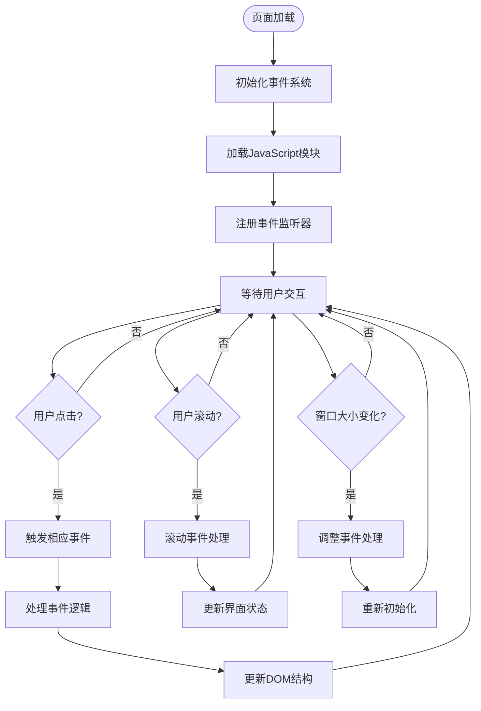

**图表来源**
- [themes/butterfly/scripts/events/init.js:1-150](file://themes/butterfly/scripts/events/init.js#L1-L150)
- [themes/butterfly/scripts/events/stylus.js:1-100](file://themes/butterfly/scripts/events/stylus.js#L1-L100)
- [themes/butterfly/scripts/events/cdn.js:1-100](file://themes/butterfly/scripts/events/cdn.js#L1-L100)

**章节来源**
- [themes/butterfly/scripts/events/init.js:1-150](file://themes/butterfly/scripts/events/init.js#L1-L150)
- [themes/butterfly/scripts/events/stylus.js:1-100](file://themes/butterfly/scripts/events/stylus.js#L1-L100)
- [themes/butterfly/scripts/events/cdn.js:1-100](file://themes/butterfly/scripts/events/cdn.js#L1-L100)

### 样式系统

Butterfly主题使用Stylus作为样式预处理器，提供强大的样式管理能力：

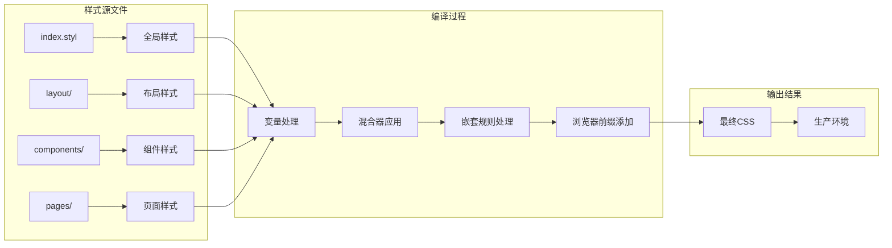

**图表来源**
- [themes/butterfly/source/css/index.styl:1-200](file://themes/butterfly/source/css/index.styl#L1-L200)

**章节来源**
- [themes/butterfly/source/css/index.styl:1-200](file://themes/butterfly/source/css/index.styl#L1-L200)

## 依赖关系分析

### 包管理依赖

项目使用npm进行包管理，依赖关系清晰明确：

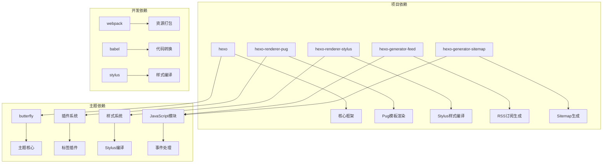

**图表来源**
- [package.json:1-100](file://package.json#L1-L100)
- [themes/butterfly/package.json:1-100](file://themes/butterfly/package.json#L1-L100)

### 运行时依赖

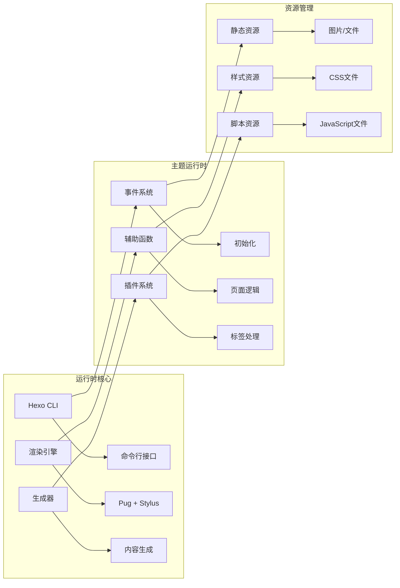

**图表来源**
- [themes/butterfly/scripts/events/init.js:1-150](file://themes/butterfly/scripts/events/init.js#L1-L150)
- [themes/butterfly/scripts/helpers/page.js:1-100](file://themes/butterfly/scripts/helpers/page.js#L1-L100)

**章节来源**
- [package.json:1-100](file://package.json#L1-L100)
- [themes/butterfly/package.json:1-100](file://themes/butterfly/package.json#L1-L100)

## 性能考虑

### 代码分割和懒加载

主题实现了智能的代码分割策略，确保页面加载性能：

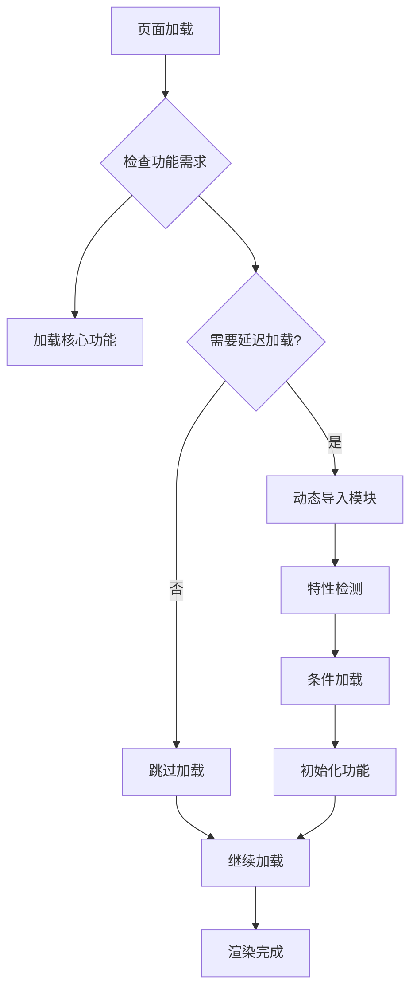

### 缓存策略

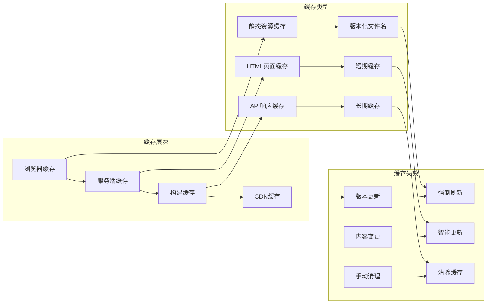

### 性能监控

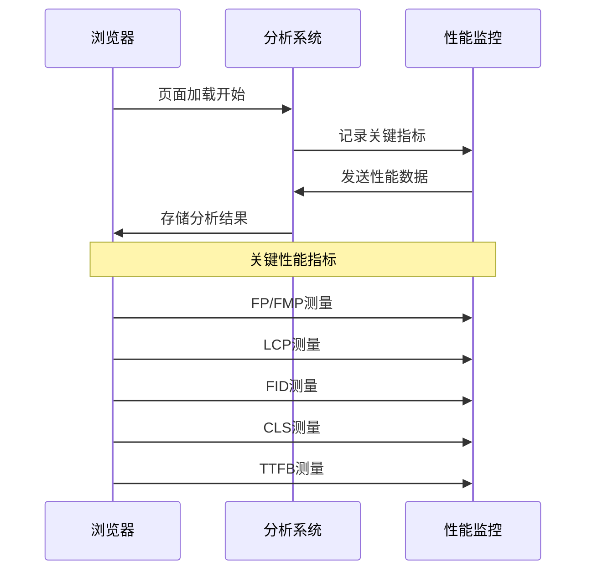

## 故障排除指南

### 常见问题诊断

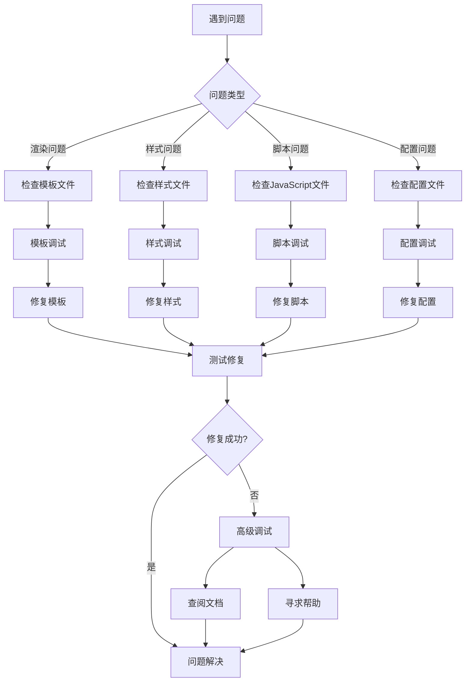

### 调试工具和技巧

**章节来源**
- [themes/butterfly/scripts/events/init.js:1-150](file://themes/butterfly/scripts/events/init.js#L1-L150)
- [themes/butterfly/scripts/helpers/page.js:1-100](file://themes/butterfly/scripts/helpers/page.js#L1-L100)

### 错误处理机制

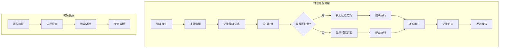

## 结论

Butterfly主题展现了现代静态网站生成器的最佳实践：

1. **模块化架构**：清晰的组件分离和职责划分
2. **可扩展性**：插件系统和事件驱动架构
3. **性能优化**：智能缓存和代码分割策略
4. **开发体验**：完善的调试工具和错误处理机制
5. **维护性**：良好的文档和配置管理

该主题为开发者提供了完整的解决方案，既适合个人博客，也适合作为企业官网的基础框架。

## 附录

### 配置参考

**章节来源**
- [_config.yml:1-120](file://_config.yml#L1-L120)
- [themes/butterfly/_config.yml:1-200](file://themes/butterfly/_config.yml#L1-L200)
- [themes/butterfly/plugins.yml:1-100](file://themes/butterfly/plugins.yml#L1-L100)

### 开发指南

**章节来源**
- [themes/butterfly/scripts/common/default_config.js:1-100](file://themes/butterfly/scripts/common/default_config.js#L1-L100)
- [themes/butterfly/scripts/events/init.js:1-150](file://themes/butterfly/scripts/events/init.js#L1-L150)