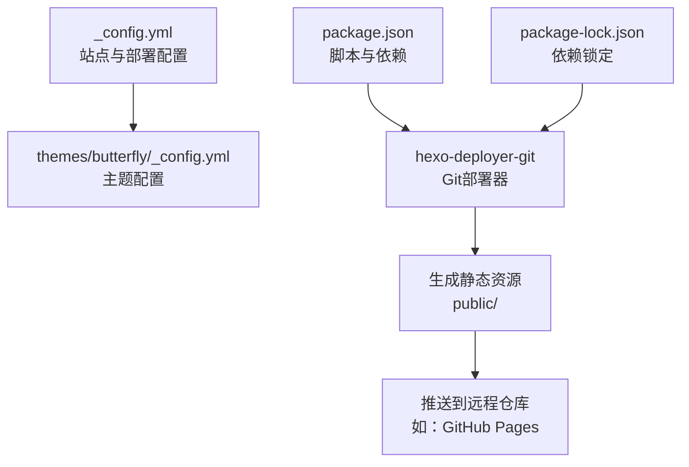
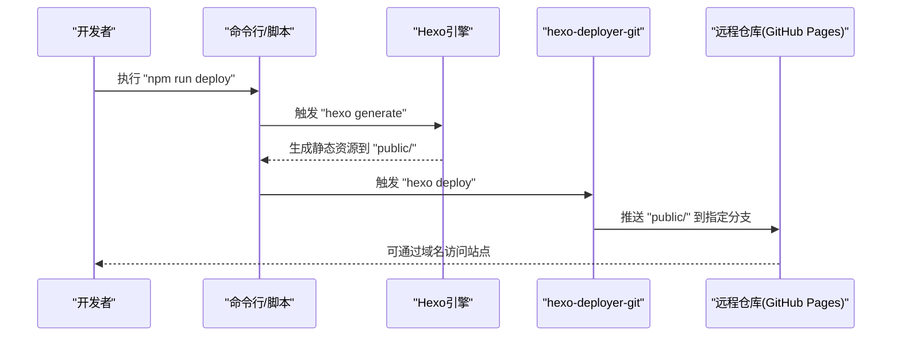
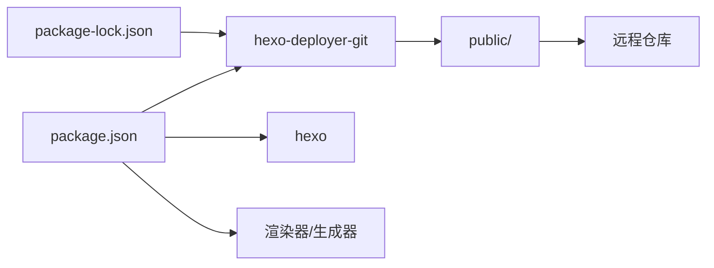

# Hexo部署配置

<cite>
**本文引用的文件**
- [_config.yml](file://_config.yml)
- [package.json](file://package.json)
- [themes/butterfly/_config.yml](file://themes/butterfly/_config.yml)
- [package-lock.json](file://package-lock.json)
</cite>

## 目录
1. [简介](#简介)
2. [项目结构](#项目结构)
3. [核心组件](#核心组件)
4. [架构总览](#架构总览)
5. [详细组件分析](#详细组件分析)
6. [依赖关系分析](#依赖关系分析)
7. [性能考量](#性能考量)
8. [故障排查指南](#故障排查指南)
9. [结论](#结论)
10. [附录](#附录)

## 简介
本文件面向使用 Hexo 的用户与运维人员，围绕“部署配置”这一核心目标，系统梳理并解释以下内容：
- 部署方式与配置项：重点覆盖 Git 部署（含 GitHub Pages），以及在当前仓库中未启用的 FTP/SFTP 部署思路与注意事项
- 部署参数详解：分支选择、提交信息格式、推送策略等
- 多环境部署：开发、测试、生产三类环境的配置建议与切换策略
- 安全考虑：密钥管理、访问权限、网络配置与最小暴露原则
- 实战示例与常见问题：提供可直接参考的配置路径与排障步骤

## 项目结构
本仓库采用标准 Hexo 结构，关键与部署相关的文件如下：
- 根配置：_config.yml（站点与部署配置）
- 主题配置：themes/butterfly/_config.yml（主题功能开关与第三方集成）
- 依赖与脚本：package.json（包含构建、清理、部署脚本）
- 依赖锁定：package-lock.json（包含 hexo-deployer-git 等插件版本）

图表来源
- [_config.yml:101-107](file://_config.yml#L101-L107)
- [package.json:5-10](file://package.json#L5-L10)
- [package-lock.json:1144-1160](file://package-lock.json#L1144-L1160)

章节来源
- [_config.yml:101-107](file://_config.yml#L101-L107)
- [package.json:5-10](file://package.json#L5-L10)
- [package-lock.json:1144-1160](file://package-lock.json#L1144-L1160)

## 核心组件
- 部署配置入口：根配置文件中的部署段落，定义部署类型、仓库地址与分支
- 部署器：hexo-deployer-git（默认安装），负责将 public/ 内容推送到指定远程仓库
- 构建与部署脚本：通过 npm/yarn 脚本统一触发 hexo generate 与 hexo deploy
- 主题配置：主题侧的第三方服务（评论、统计等）不影响部署，但会影响最终生成内容

章节来源
- [_config.yml:101-107](file://_config.yml#L101-L107)
- [package.json:5-10](file://package.json#L5-L10)
- [package-lock.json:1144-1160](file://package-lock.json#L1144-L1160)

## 架构总览
下图展示从本地构建到远程托管的典型流程，适用于 GitHub Pages 场景。

图表来源
- [package.json:5-10](file://package.json#L5-L10)
- [_config.yml:101-107](file://_config.yml#L101-L107)
- [package-lock.json:1144-1160](file://package-lock.json#L1144-L1160)

## 详细组件分析

### Git 部署配置详解
- 配置位置与关键项
  - 类型：type
  - 仓库地址：repo
  - 分支：branch
- 参数作用与最佳实践
  - 类型：type 指定为 git，确保使用 hexo-deployer-git 插件
  - 仓库地址：repo 建议使用 HTTPS 或 SSH；若使用 HTTPS，需配合凭据或令牌；若使用 SSH，需提前配置公钥
  - 分支：branch 建议固定到主分支（如 main）或专用页面分支（如 gh-pages），避免频繁切换
  - 提交信息：可通过部署器的提交模板或钩子自定义；建议包含版本号或时间戳以便追溯
  - 推送策略：优先使用 fast-forward；遇到冲突时先拉取再推送，或在 CI 中开启强制推送（谨慎）
- 多环境分支策略
  - 开发：dev 分支，用于预览与联调
  - 测试：test 分支，用于质量验证
  - 生产：main/gh-pages 分支，用于线上发布
- 安全建议
  - 使用 SSH 代替 HTTPS，减少明文密码风险
  - 若必须使用 HTTPS，结合 CI 的机密变量注入令牌
  - 限制部署器权限，仅授予必要分支的推送权限

章节来源
- [_config.yml:101-107](file://_config.yml#L101-L107)
- [package-lock.json:1144-1160](file://package-lock.json#L1144-L1160)

### FTP/SFTP 部署（概念性说明）
- 当前仓库未启用 FTP/SFTP 部署器，但可按以下思路扩展：
  - 选择部署器：如 hexo-deployer-ftp 或 hexo-deployer-sftp（需安装）
  - 配置项：服务器地址、端口、用户名、密码/密钥、远程目录、文件过滤规则
  - 最佳实践：使用密钥认证；限定只上传 public/；忽略日志与临时文件
  - 安全建议：最小权限原则；网络隔离；定期轮换密钥
- 注意：本仓库未包含相关部署器，请勿在未安装的情况下配置对应字段

[本节为概念性说明，不直接分析具体文件，故无章节来源]

### 部署参数与提交信息
- 分支选择
  - 建议固定分支，避免每次部署切换分支导致的混乱
- 提交信息格式
  - 可通过钩子或部署器参数定制提交信息，建议包含时间戳、版本号、作者信息
- 推送策略
  - 正常情况下使用 fast-forward；冲突时先合并再推送；CI 中可配置自动处理策略

[本节为通用实践说明，不直接分析具体文件，故无章节来源]

### 多环境部署配置方法
- 环境划分
  - 开发：本地或专用 dev 分支，便于快速迭代
  - 测试：独立 test 分支，配合自动化测试
  - 生产：稳定 main/gh-pages 分支，严格审核与回滚机制
- 切换策略
  - 通过不同配置文件或环境变量控制部署分支与仓库地址
  - 在 CI 中根据分支或标签触发不同部署作业

[本节为通用实践说明，不直接分析具体文件，故无章节来源]

### 部署安全考虑
- 密钥管理
  - 使用 SSH 密钥或令牌；在 CI 中使用受保护的机密变量
- 访问权限
  - 仓库仅授予部署所需分支的推送权限
- 网络配置
  - 限制出站网络，仅允许访问必要的托管平台域名
- 最小暴露
  - 不在仓库中存储敏感信息；使用环境变量或 CI 凭据

[本节为通用实践说明，不直接分析具体文件，故无章节来源]

### 实际配置示例与路径
- Git 部署基础配置
  - 参考路径：[_config.yml 部署段:101-107](file://_config.yml#L101-L107)
  - 依赖安装：[package.json 依赖列表:14-26](file://package.json#L14-L26)
  - 部署器版本：[package-lock.json 中 hexo-deployer-git 版本:1144-1160](file://package-lock.json#L1144-L1160)
- 构建与部署脚本
  - 参考路径：[package.json 脚本:5-10](file://package.json#L5-L10)
- 主题配置（与部署无关，但影响生成内容）
  - 参考路径：[themes/butterfly/_config.yml:1-120](file://themes/butterfly/_config.yml#L1-L120)

章节来源
- [_config.yml:101-107](file://_config.yml#L101-L107)
- [package.json:5-10](file://package.json#L5-L10)
- [package-lock.json:1144-1160](file://package-lock.json#L1144-L1160)
- [themes/butterfly/_config.yml:1-120](file://themes/butterfly/_config.yml#L1-L120)

## 依赖关系分析
- 部署器依赖
  - hexo-deployer-git：负责 Git 推送
  - 依赖版本：见 package-lock.json 中 hexo-deployer-git 的版本范围与运行时依赖
- 构建链路
  - npm/yarn 脚本 -> hexo generate -> hexo deploy -> 远程仓库
- 主题与部署的关系
  - 主题配置影响生成内容，但不改变部署器行为

图表来源
- [package.json:14-26](file://package.json#L14-L26)
- [package-lock.json:1144-1160](file://package-lock.json#L1144-L1160)

章节来源
- [package.json:14-26](file://package.json#L14-L26)
- [package-lock.json:1144-1160](file://package-lock.json#L1144-L1160)

## 性能考量
- 生成阶段
  - 合理配置分页、代码高亮与图片压缩，减少生成时间
- 部署阶段
  - 使用增量推送或缓存策略，避免重复传输
  - 控制 public/ 文件规模，剔除不必要的中间文件

[本节为通用指导，不直接分析具体文件，故无章节来源]

## 故障排查指南
- 常见问题与定位
  - 权限不足：检查仓库访问权限与凭据配置
  - 网络超时：确认代理与 DNS 设置，必要时更换镜像源
  - 分支冲突：先拉取再推送，或在 CI 中启用自动合并
  - 生成失败：检查渲染器与插件版本兼容性
- 参考路径
  - 部署器版本与依赖：[package-lock.json:1144-1160](file://package-lock.json#L1144-L1160)
  - 脚本入口：[package.json:5-10](file://package.json#L5-L10)
  - 部署配置：[_config.yml:101-107](file://_config.yml#L101-L107)

章节来源
- [package-lock.json:1144-1160](file://package-lock.json#L1144-L1160)
- [package.json:5-10](file://package.json#L5-L10)
- [_config.yml:101-107](file://_config.yml#L101-L107)

## 结论
- 本仓库已内置 Git 部署能力，建议优先使用 HTTPS/SSH + 令牌的方式进行安全部署
- 多环境部署可通过分支策略与 CI 配置实现自动化与可追溯
- FTP/SFTP 部署在当前仓库未启用，如需请按概念性说明补充相应部署器与配置
- 始终遵循最小权限与最小暴露原则，结合 CI 机密变量强化安全

[本节为总结性内容，不直接分析具体文件，故无章节来源]

## 附录
- 相关文件清单
  - 根配置：[_config.yml](file://_config.yml)
  - 依赖与脚本：[package.json](file://package.json)
  - 依赖锁定：[package-lock.json](file://package-lock.json)
  - 主题配置：[themes/butterfly/_config.yml](file://themes/butterfly/_config.yml)

[本节为索引性内容，不直接分析具体文件，故无章节来源]