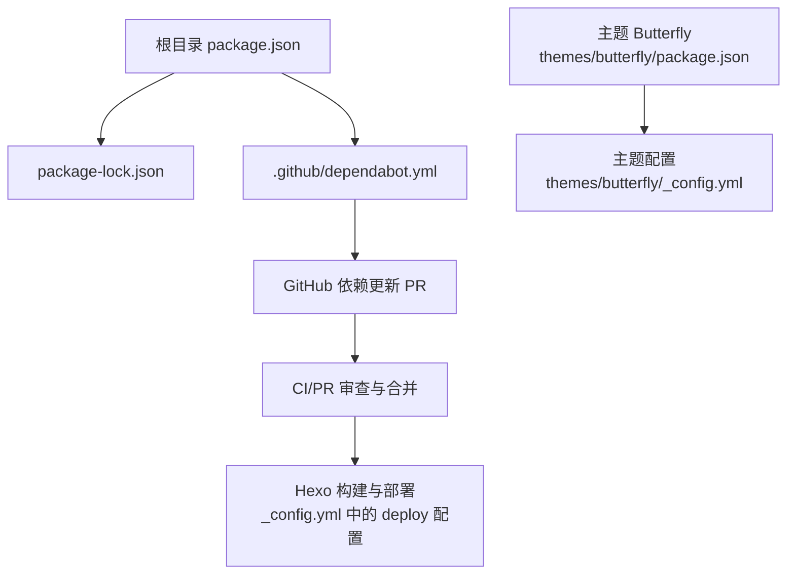
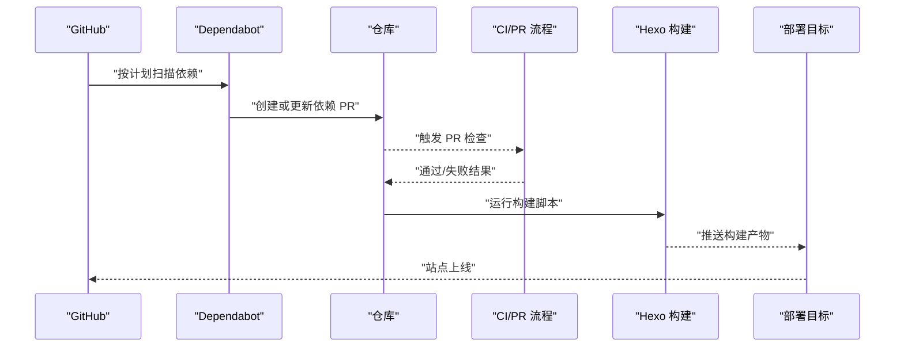
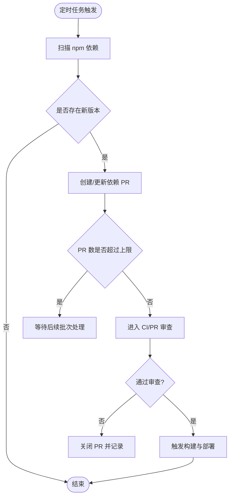
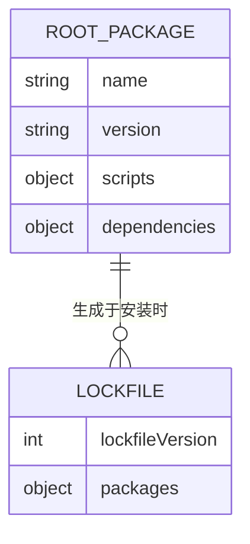
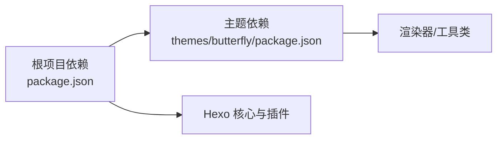
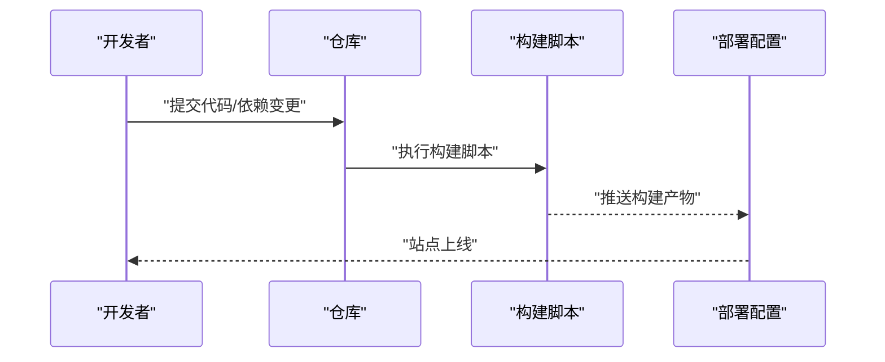
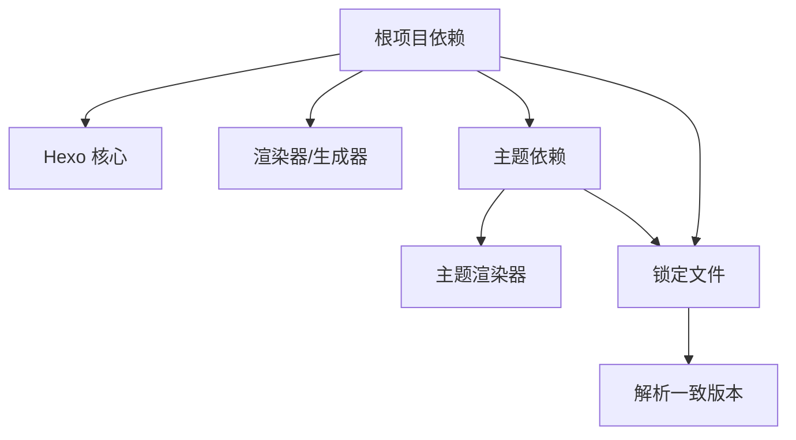

# 自动化依赖管理

<cite>
**本文引用的文件**
- [.github/dependabot.yml](file://.github/dependabot.yml)
- [package.json](file://package.json)
- [package-lock.json](file://package-lock.json)
- [_config.yml](file://_config.yml)
- [themes/butterfly/package.json](file://themes/butterfly/package.json)
- [themes/butterfly/_config.yml](file://themes/butterfly/_config.yml)
- [themes/butterfly/README.md](file://themes/butterfly/README.md)
</cite>

## 目录
1. [简介](#简介)
2. [项目结构](#项目结构)
3. [核心组件](#核心组件)
4. [架构总览](#架构总览)
5. [详细组件分析](#详细组件分析)
6. [依赖关系分析](#依赖关系分析)
7. [性能考量](#性能考量)
8. [故障排查指南](#故障排查指南)
9. [结论](#结论)
10. [附录](#附录)

## 简介
本文件围绕本仓库的自动化依赖管理展开，重点解释 Dependabot 的工作机制与配置方法，覆盖依赖更新策略、安全补丁与版本升级规则；同时总结依赖管理最佳实践（如依赖锁定、版本兼容性与安全审计），并说明自动化更新的触发与执行流程（含 Pull Request 创建与合并策略）。最后提供依赖冲突的解决思路与手动干预方法，并讨论依赖管理对部署流程的影响与优化策略。

## 项目结构
本项目采用 Hexo 静态站点生成器，主题使用 Butterfly。依赖管理主要由 npm 生态与 GitHub Dependabot 协同完成：根目录的 package.json 声明项目依赖与脚本，package-lock.json 提供精确锁定；.github/dependabot.yml 配置 Dependabot 的扫描范围与更新频率；主题目录 themes/butterfly 下包含主题自身的依赖与配置。

图表来源
- [.github/dependabot.yml:1-8](file://.github/dependabot.yml#L1-L8)
- [package.json:1-29](file://package.json#L1-L29)
- [package-lock.json:1-200](file://package-lock.json#L1-L200)
- [_config.yml:101-107](file://_config.yml#L101-L107)
- [themes/butterfly/package.json:1-35](file://themes/butterfly/package.json#L1-L35)
- [themes/butterfly/_config.yml:1-800](file://themes/butterfly/_config.yml#L1-L800)

章节来源
- [.github/dependabot.yml:1-8](file://.github/dependabot.yml#L1-L8)
- [package.json:1-29](file://package.json#L1-L29)
- [package-lock.json:1-200](file://package-lock.json#L1-L200)
- [_config.yml:101-107](file://_config.yml#L101-L107)
- [themes/butterfly/package.json:1-35](file://themes/butterfly/package.json#L1-L35)
- [themes/butterfly/_config.yml:1-800](file://themes/butterfly/_config.yml#L1-L800)

## 核心组件
- Dependabot 配置：定义扫描生态（npm）、扫描路径（根目录）、更新频率（每日）与并发 PR 上限（20）。
- 依赖声明与锁定：根 package.json 声明依赖与脚本；package-lock.json 提供精确锁定以确保可复现构建。
- 主题依赖：Butterfly 主题自身有独立的依赖清单，影响渲染器与工具类等能力。
- 部署配置：_config.yml 中的 deploy 字段定义了构建产物的发布分支与仓库地址，是依赖变更影响最终上线的关键环节。

章节来源
- [.github/dependabot.yml:1-8](file://.github/dependabot.yml#L1-L8)
- [package.json:14-28](file://package.json#L14-L28)
- [package-lock.json:6-23](file://package-lock.json#L6-L23)
- [themes/butterfly/package.json:25-30](file://themes/butterfly/package.json#L25-L30)
- [_config.yml:101-107](file://_config.yml#L101-L107)

## 架构总览
下图展示从 Dependabot 触发到 PR 创建、审查与部署的整体流程，以及与主题依赖的关系。

图表来源
- [.github/dependabot.yml:3-7](file://.github/dependabot.yml#L3-L7)
- [package.json:5-10](file://package.json#L5-L10)
- [_config.yml:101-107](file://_config.yml#L101-L107)

## 详细组件分析

### Dependabot 配置与更新策略
- 扫描生态：npm
- 扫描路径：根目录（/）
- 更新频率：每日一次
- 并发 PR 上限：20
- 作用范围：自动检测依赖版本更新，创建 Pull Request，推动项目持续保持依赖新鲜度

图表来源
- [.github/dependabot.yml:3-7](file://.github/dependabot.yml#L3-L7)

章节来源
- [.github/dependabot.yml:1-8](file://.github/dependabot.yml#L1-L8)

### 依赖声明与锁定
- 依赖声明：根 package.json 的 dependencies 字段列出项目直接依赖，如 Hexo 核心、渲染器、生成器、服务器与主题等。
- 锁定文件：package-lock.json 记录所有依赖树的精确版本与解析结果，确保不同环境一致安装。
- 脚本命令：scripts 字段提供 build、clean、deploy、server 等常用命令，用于本地开发与自动化流水线。

图表来源
- [package.json:1-29](file://package.json#L1-L29)
- [package-lock.json:1-200](file://package-lock.json#L1-L200)

章节来源
- [package.json:1-29](file://package.json#L1-L29)
- [package-lock.json:1-200](file://package-lock.json#L1-L200)

### 主题依赖与兼容性
- 主题依赖：Butterfly 主题在自身 package.json 中声明渲染器与工具类依赖，直接影响站点的渲染与功能特性。
- 兼容性注意：主题依赖与根项目依赖存在交集或重叠时，需关注版本范围与锁定一致性，避免冲突。

图表来源
- [themes/butterfly/package.json:25-30](file://themes/butterfly/package.json#L25-L30)
- [package.json:14-26](file://package.json#L14-L26)

章节来源
- [themes/butterfly/package.json:1-35](file://themes/butterfly/package.json#L1-L35)
- [package.json:14-28](file://package.json#L14-L28)

### 部署流程与依赖影响
- 部署配置：_config.yml 的 deploy 字段指定 Git 发布仓库与分支，依赖变更可能影响构建产物与站点行为。
- 构建脚本：package.json 的 scripts 提供一键构建与部署命令，便于在 CI 中调用。
- 影响范围：依赖升级可能导致渲染差异、样式变化或功能异常，因此建议在 PR 合并前进行本地预览与自动化测试。

图表来源
- [_config.yml:101-107](file://_config.yml#L101-L107)
- [package.json:5-10](file://package.json#L5-L10)

章节来源
- [_config.yml:101-107](file://_config.yml#L101-L107)
- [package.json:5-10](file://package.json#L5-L10)

## 依赖关系分析
- 依赖层次：根项目依赖 Hexo 核心与相关插件；主题依赖渲染器与工具类；锁定文件确保安装一致性。
- 冲突风险：当主题与根项目对同一依赖提出不同版本范围时，可能出现冲突；建议优先统一到更严格的版本范围或使用锁定文件约束。
- 安全审计：可通过 npm audit 或第三方工具定期扫描，结合 Dependabot 的安全更新建议进行修复。

图表来源
- [package.json:14-28](file://package.json#L14-L28)
- [themes/butterfly/package.json:25-30](file://themes/butterfly/package.json#L25-L30)
- [package-lock.json:6-23](file://package-lock.json#L6-L23)

章节来源
- [package.json:14-28](file://package.json#L14-L28)
- [themes/butterfly/package.json:25-30](file://themes/butterfly/package.json#L25-L30)
- [package-lock.json:6-23](file://package-lock.json#L6-L23)

## 性能考量
- 依赖体积与安装时间：减少不必要的依赖与深层嵌套，有助于缩短安装时间与降低构建体积。
- 锁定文件稳定性：保持 package-lock.json 不被随意改动，避免引入不必要版本漂移。
- 更新频率权衡：每日更新可及时获得安全补丁，但可能增加 PR 数量；可根据团队审阅能力调整频率或分批处理。

## 故障排查指南
- PR 数过多：当前配置允许最多 20 个并发 PR。若短期内出现大量 PR，建议临时提高上限或延后部分更新。
- 构建失败：当依赖升级导致构建错误时，优先回滚至上一稳定版本，定位具体破坏性变更后再择机合并。
- 主题渲染异常：若主题依赖升级引起样式或功能问题，检查主题 README 的兼容性要求与最低 Hexo 版本。
- 安全告警：结合 npm audit 结果与 Dependabot 建议，优先修复高危漏洞；必要时临时锁定受影响版本并制定升级计划。

章节来源
- [.github/dependabot.yml:7](file://.github/dependabot.yml#L7)
- [themes/butterfly/README.md:50-70](file://themes/butterfly/README.md#L50-L70)

## 结论
通过合理配置 Dependabot、严格依赖锁定与版本兼容性管理，可以有效提升项目的安全性与稳定性。建议将依赖更新纳入 CI 审查流程，结合本地预览与自动化测试，确保每次升级不会破坏站点功能与体验。同时，针对主题依赖与核心 Hexo 版本保持同步，有助于减少冲突与回归问题。

## 附录
- Dependabot 配置要点
  - 扫描生态：npm
  - 扫描路径：/
  - 更新频率：daily
  - 并发 PR 上限：20
- 依赖管理最佳实践
  - 使用 package-lock.json 锁定版本
  - 明确版本范围与升级策略（主/次/补丁）
  - 定期进行安全审计
  - 在 CI 中加入构建与测试步骤
- 依赖冲突与手动干预
  - 统一版本范围或使用锁定文件
  - 临时回滚并制定修复计划
  - 对主题依赖遵循其官方兼容性说明