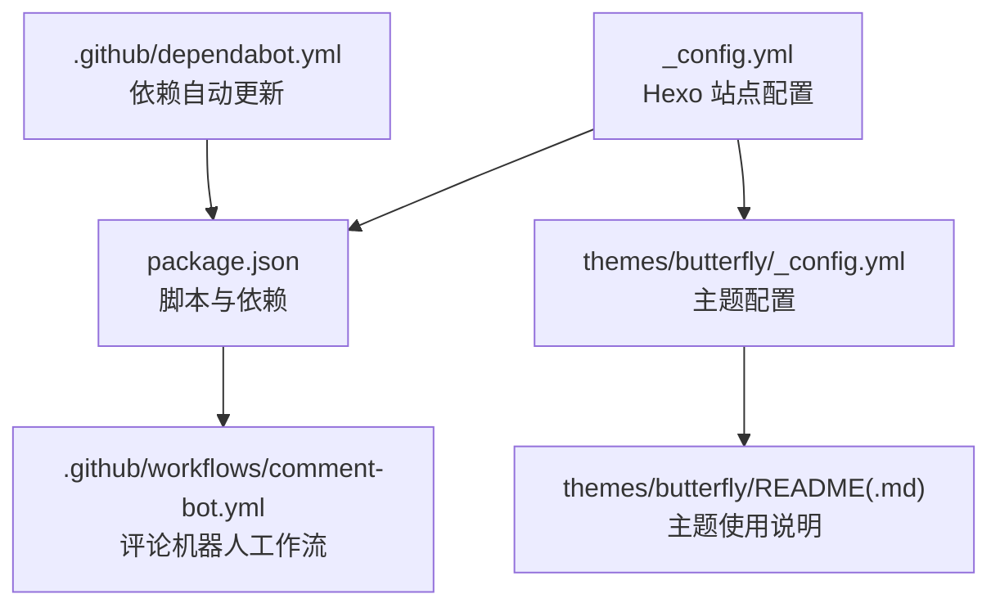
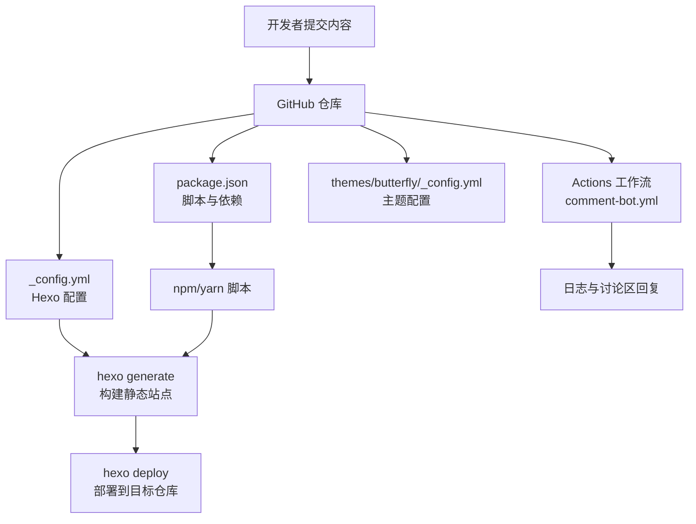
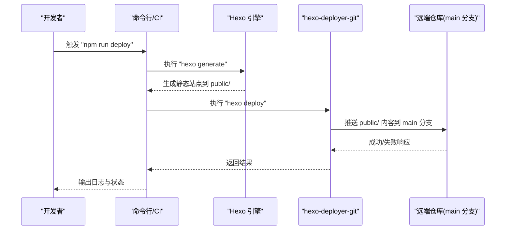
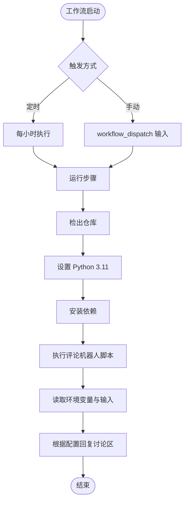
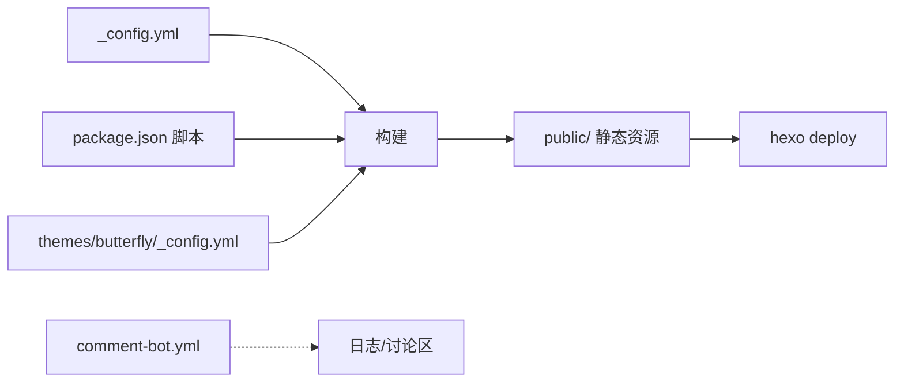

# 部署与自动化

<cite>
**本文引用的文件**
- [_config.yml](file://_config.yml)
- [package.json](file://package.json)
- [.github/dependabot.yml](file://.github/dependabot.yml)
- [.github/workflows/comment-bot.yml](file://.github/workflows/comment-bot.yml)
- [themes/butterfly/_config.yml](file://themes/butterfly/_config.yml)
- [themes/butterfly/README.md](file://themes/butterfly/README.md)
- [themes/butterfly/README_CN.md](file://themes/butterfly/README_CN.md)
- [themes/butterfly/package.json](file://themes/butterfly/package.json)
</cite>

## 目录
1. [简介](#简介)
2. [项目结构](#项目结构)
3. [核心组件](#核心组件)
4. [架构总览](#架构总览)
5. [详细组件分析](#详细组件分析)
6. [依赖关系分析](#依赖关系分析)
7. [性能考量](#性能考量)
8. [故障排除指南](#故障排除指南)
9. [结论](#结论)
10. [附录](#附录)

## 简介
本文件面向 ddddzc’s blog 的部署与自动化体系，聚焦以下目标：
- 解释 GitHub Actions 工作流的配置与执行流程，覆盖自动构建、测试与部署的完整链路
- 详解 Hexo 部署配置项，包括 Git 部署、FTP 部署及其他可选部署方式
- 设计 CI/CD 流水线理念：分支管理、版本控制与发布策略
- 提供部署环境配置指南：环境变量、密钥管理与安全注意事项
- 部署优化策略：缓存机制、增量构建与回滚方案
- 实际配置示例与故障排除建议

## 项目结构
该仓库采用 Hexo 静态站点生成器组织内容，主题使用 Butterfly。部署与自动化主要涉及：
- 根级 Hexo 配置与脚本定义
- 主题配置与特性开关
- GitHub Actions 工作流（评论机器人）
- 依赖自动更新配置（Dependabot）

图表来源
- [_config.yml:1-107](file://_config.yml#L1-L107)
- [package.json:1-29](file://package.json#L1-L29)
- [themes/butterfly/_config.yml:1-1140](file://themes/butterfly/_config.yml#L1-L1140)
- [.github/workflows/comment-bot.yml:1-44](file://.github/workflows/comment-bot.yml#L1-L44)
- [.github/dependabot.yml:1-8](file://.github/dependabot.yml#L1-L8)
- [themes/butterfly/README.md:1-194](file://themes/butterfly/README.md#L1-L194)

章节来源
- [_config.yml:1-107](file://_config.yml#L1-L107)
- [package.json:1-29](file://package.json#L1-L29)
- [themes/butterfly/_config.yml:1-1140](file://themes/butterfly/_config.yml#L1-L1140)
- [.github/workflows/comment-bot.yml:1-44](file://.github/workflows/comment-bot.yml#L1-L44)
- [.github/dependabot.yml:1-8](file://.github/dependabot.yml#L1-L8)
- [themes/butterfly/README.md:1-194](file://themes/butterfly/README.md#L1-L194)

## 核心组件
- Hexo 根配置与部署
  - 站点基础信息、URL、目录、分页等
  - 部署配置：类型、仓库地址、分支
- 主题配置
  - 导航、代码块、社交链接、统计与评论系统等
- 项目脚本
  - build、clean、deploy、server 等命令
- GitHub Actions
  - 评论机器人工作流：定时调度与手动触发
- 依赖自动更新
  - Dependabot 对 npm 生态的每日扫描与 PR 限额

章节来源
- [_config.yml:1-107](file://_config.yml#L1-L107)
- [themes/butterfly/_config.yml:1-1140](file://themes/butterfly/_config.yml#L1-L1140)
- [package.json:1-29](file://package.json#L1-L29)
- [.github/workflows/comment-bot.yml:1-44](file://.github/workflows/comment-bot.yml#L1-L44)
- [.github/dependabot.yml:1-8](file://.github/dependabot.yml#L1-L8)

## 架构总览
下图展示了从内容提交到部署完成的关键路径，以及评论机器人的辅助角色。

图表来源
- [_config.yml:101-107](file://_config.yml#L101-L107)
- [package.json:5-10](file://package.json#L5-L10)
- [.github/workflows/comment-bot.yml:1-44](file://.github/workflows/comment-bot.yml#L1-L44)
- [themes/butterfly/_config.yml:1-1140](file://themes/butterfly/_config.yml#L1-L1140)

## 详细组件分析

### 组件一：Hexo 部署配置与执行流程
- 部署类型与目标
  - 类型：git
  - 仓库：用户主仓库用于托管 GitHub Pages
  - 分支：main
- 执行顺序
  - 通过脚本触发构建与部署
  - 构建产物输出至 public 目录
  - 部署器将 public 内容推送到指定分支

图表来源
- [_config.yml:101-107](file://_config.yml#L101-L107)
- [package.json:5-10](file://package.json#L5-L10)

章节来源
- [_config.yml:101-107](file://_config.yml#L101-L107)
- [package.json:5-10](file://package.json#L5-L10)

### 组件二：GitHub Actions 工作流（评论机器人）
- 触发条件
  - 定时任务：每小时执行一次
  - 手动触发：支持 dry-run 模式
- 运行环境
  - Ubuntu 最新运行器
  - Python 3.11
- 关键步骤
  - 检出仓库并安装依赖
  - 使用 PAT 与 DashScope API 密钥进行讨论区回复
  - 根据输入参数切换生产/试运行模式

图表来源
- [.github/workflows/comment-bot.yml:1-44](file://.github/workflows/comment-bot.yml#L1-L44)

章节来源
- [.github/workflows/comment-bot.yml:1-44](file://.github/workflows/comment-bot.yml#L1-L44)

### 组件三：主题配置与扩展能力
- 主题特性开关
  - 代码块样式、工具栏、全屏按钮
  - 社交链接、头像、封面图、背景
  - 评论系统（如 Giscus）、分析统计（如 Umami）等
- 使用与安装
  - 支持 Git 与 NPM 两种安装方式
  - 需要渲染器依赖（Pug/Stylus）

章节来源
- [themes/butterfly/_config.yml:1-1140](file://themes/butterfly/_config.yml#L1-L1140)
- [themes/butterfly/README.md:30-70](file://themes/butterfly/README.md#L30-L70)
- [themes/butterfly/package.json:25-30](file://themes/butterfly/package.json#L25-L30)

### 组件四：依赖自动更新（Dependabot）
- 配置要点
  - 扫描范围：npm
  - 目录：根目录
  - 频率：每日
  - 同时打开的 PR 上限：20

章节来源
- [.github/dependabot.yml:1-8](file://.github/dependabot.yml#L1-L8)

## 依赖关系分析
- Hexo 根配置与主题配置相互独立但共同决定站点行为
- package.json 中的脚本为 CI/CD 提供统一入口
- Actions 工作流与仓库内容解耦，仅依赖环境变量与令牌

图表来源
- [_config.yml:101-107](file://_config.yml#L101-L107)
- [package.json:5-10](file://package.json#L5-L10)
- [themes/butterfly/_config.yml:1-1140](file://themes/butterfly/_config.yml#L1-L1140)
- [.github/workflows/comment-bot.yml:1-44](file://.github/workflows/comment-bot.yml#L1-L44)

章节来源
- [_config.yml:101-107](file://_config.yml#L101-L107)
- [package.json:5-10](file://package.json#L5-L10)
- [themes/butterfly/_config.yml:1-1140](file://themes/butterfly/_config.yml#L1-L1140)
- [.github/workflows/comment-bot.yml:1-44](file://.github/workflows/comment-bot.yml#L1-L44)

## 性能考量
- 构建性能
  - 使用 Yarn 作为包管理器，有助于更快安装与缓存复用
  - 通过脚本统一入口减少重复安装与编译时间
- 部署效率
  - Git 部署直接推送 public/，适合 GitHub Pages
  - 若需更快部署，可结合 CDN 或边缘缓存策略
- 维护成本
  - Dependabot 每日扫描降低依赖陈旧风险
  - PR 数量上限避免过多合并冲突

章节来源
- [package.json:27-28](file://package.json#L27-L28)
- [.github/dependabot.yml:1-8](file://.github/dependabot.yml#L1-L8)

## 故障排除指南
- 部署失败（权限/令牌问题）
  - 确认已配置正确的访问令牌与仓库地址
  - 检查分支名称是否匹配
- 构建失败（依赖缺失）
  - 确保渲染器依赖已安装（Pug/Stylus）
  - 清理缓存后重试构建
- Actions 失败（环境变量）
  - 确认 PAT 与 API 密钥已在仓库 Secrets 中配置
  - 如需调试，启用 dry-run 模式观察日志
- 评论机器人无响应
  - 检查定时任务是否正常触发
  - 核对讨论区分类 ID 与仓库名一致性

章节来源
- [_config.yml:101-107](file://_config.yml#L101-L107)
- [themes/butterfly/README.md:30-70](file://themes/butterfly/README.md#L30-L70)
- [.github/workflows/comment-bot.yml:37-42](file://.github/workflows/comment-bot.yml#L37-L42)

## 结论
本项目以 Hexo 为核心，结合 Butterfly 主题与 GitHub Actions 实现了从内容创作到静态站点发布的自动化闭环。根配置与主题配置共同定义站点外观与功能；package.json 提供统一的构建与部署脚本入口；Dependabot 保障依赖健康；评论机器人工作流则增强社区互动与维护效率。建议在生产环境中进一步引入缓存、增量构建与回滚策略，以提升稳定性与交付质量。

## 附录

### A. 部署配置清单（基于现有配置）
- 站点基础
  - 站点标题、副标题、语言与时区
  - URL、永久链接与美化链接
- 目录与分页
  - 源目录、公开目录、归档/分类/标签目录
  - 分页数量与分页目录
- 写作与高亮
  - 新文章命名、默认布局、外链行为
  - 代码高亮与 PrismJS 设置
- 主题与扩展
  - 主题名称
  - 插件与主题依赖
- 部署
  - 类型：git
  - 仓库地址：用户主仓库
  - 分支：main

章节来源
- [_config.yml:5-107](file://_config.yml#L5-L107)
- [package.json:14-26](file://package.json#L14-L26)

### B. 部署方式概览（概念性说明）
- Git 部署
  - 适用于 GitHub Pages 等静态托管平台
  - 优点：简单可靠、与平台集成度高
- FTP 部署
  - 适用于传统虚拟主机或 VPS
  - 注意：需在 CI 中安全存储凭据
- 其他部署方式
  - SFTP、rsync、CDN 加速、对象存储直传
  - 建议配合缓存与回滚策略

[本节为通用指导，不直接对应具体文件]