# 项目概述

<cite>
**本文档引用的文件**
- [_config.yml](file://_config.yml)
- [package.json](file://package.json)
- [themes/butterfly/_config.yml](file://themes/butterfly/_config.yml)
- [themes/butterfly/README.md](file://themes/butterfly/README.md)
- [themes/butterfly/package.json](file://themes/butterfly/package.json)
- [themes/butterfly/layout/index.pug](file://themes/butterfly/layout/index.pug)
- [themes/butterfly/scripts/common/default_config.js](file://themes/butterfly/scripts/common/default_config.js)
- [themes/butterfly/languages/zh-CN.yml](file://themes/butterfly/languages/zh-CN.yml)
- [scaffolds/post.md](file://scaffolds/post.md)
- [source/_posts/Vscode-Github-Copilot接入MATLAB.md](file://source/_posts/Vscode-Github-Copilot接入MATLAB.md)
</cite>

## 目录
1. [简介](#简介)
2. [项目结构](#项目结构)
3. [核心组件](#核心组件)
4. [架构概览](#架构概览)
5. [详细组件分析](#详细组件分析)
6. [依赖关系分析](#依赖关系分析)
7. [性能考量](#性能考量)
8. [故障排除指南](#故障排除指南)
9. [结论](#结论)

## 简介

dzc-blog是一个基于Hexo静态博客系统的个人技术博客项目。该项目采用现代化的Butterfly主题，专注于提供优质的阅读体验和丰富的功能特性。项目通过静态站点生成器将Markdown内容转换为高性能的静态HTML页面，实现快速加载和良好的SEO表现。

### 项目核心目标

- **技术分享平台**：为编程爱好者提供技术文章发布和分享的空间
- **学习记录工具**：记录个人学习过程中的知识点和实践经验
- **知识管理**：建立系统化的知识体系和分类索引
- **社区互动**：通过评论系统与读者建立有效沟通

### 技术架构理念

项目采用"静态优先"的设计理念，通过以下原则指导技术选型：
- **性能至上**：静态页面无服务器端逻辑，加载速度快
- **安全可靠**：无动态脚本，降低安全风险
- **易于部署**：支持多种托管平台，部署简单
- **内容优先**：专注内容创作，减少技术复杂度

## 项目结构

项目的整体结构遵循Hexo的标准目录规范，采用模块化设计：

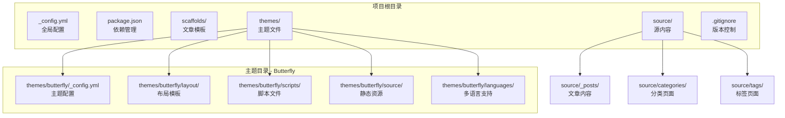

**图表来源**
- [_config.yml:1-107](file://_config.yml#L1-L107)
- [package.json:1-29](file://package.json#L1-L29)
- [themes/butterfly/_config.yml:1-800](file://themes/butterfly/_config.yml#L1-L800)

### 目录组织说明

- **根配置文件**：统一管理站点基本信息、URL设置、分页配置等
- **主题配置**：独立的主题配置文件，提供丰富的样式和功能选项
- **内容管理**：结构化的文章、分类、标签组织方式
- **模板系统**：基于Pug的布局模板和Stylus样式系统

**章节来源**
- [_config.yml:1-107](file://_config.yml#L1-L107)
- [themes/butterfly/_config.yml:1-800](file://themes/butterfly/_config.yml#L1-L800)

## 核心组件

### Hexo静态博客系统

Hexo作为Node.js开发的静态博客框架，提供了完整的从内容到静态页面的生成流水线：

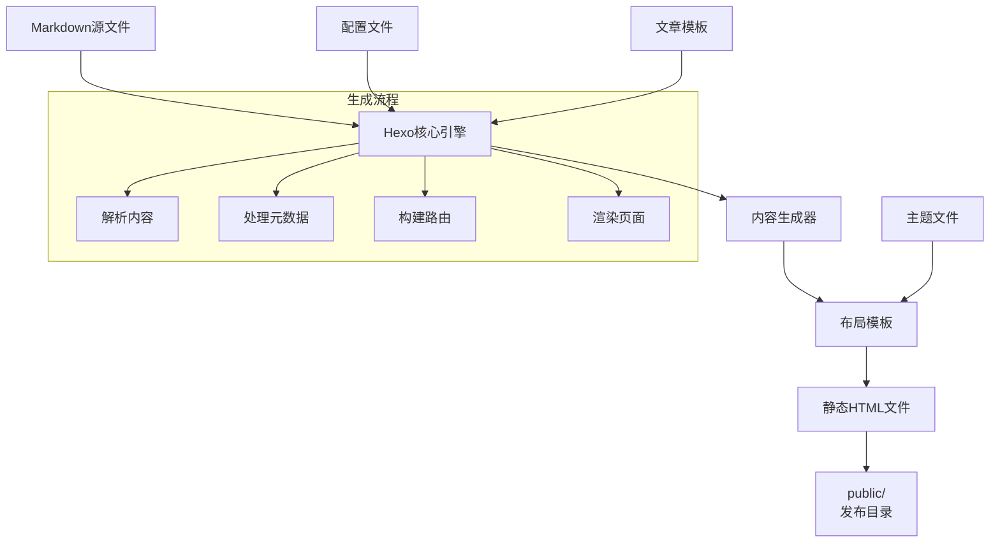

**图表来源**
- [themes/butterfly/layout/index.pug:1-5](file://themes/butterfly/layout/index.pug#L1-L5)

### Butterfly主题系统

Butterfly主题提供了现代化的用户界面和丰富的交互功能：

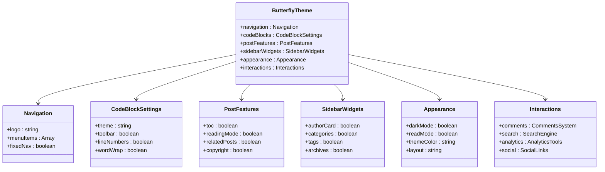

**图表来源**
- [themes/butterfly/scripts/common/default_config.js:1-602](file://themes/butterfly/scripts/common/default_config.js#L1-L602)

**章节来源**
- [themes/butterfly/README.md:72-131](file://themes/butterfly/README.md#L72-L131)
- [themes/butterfly/_config.yml:118-255](file://themes/butterfly/_config.yml#L118-L255)

## 架构概览

### 整体架构设计

项目采用分层架构，清晰分离关注点：

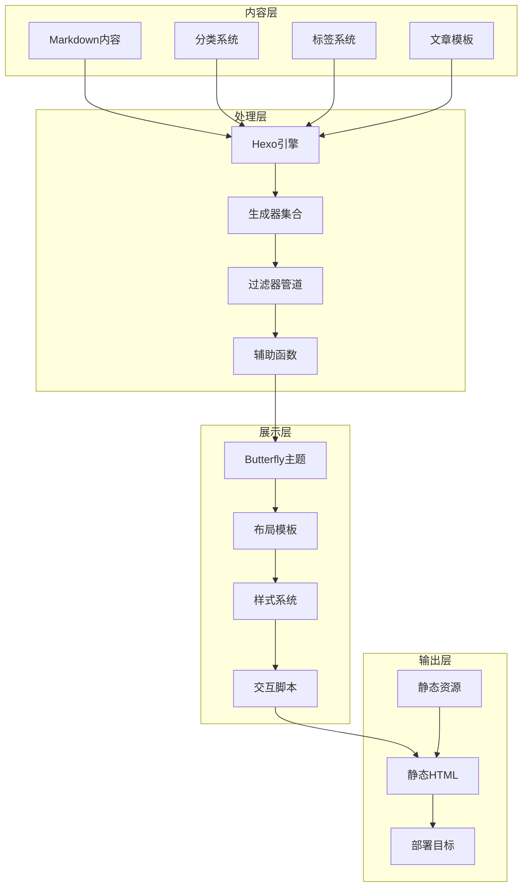

**图表来源**
- [themes/butterfly/package.json:25-30](file://themes/butterfly/package.json#L25-L30)
- [package.json:14-26](file://package.json#L14-L26)

### 数据流处理

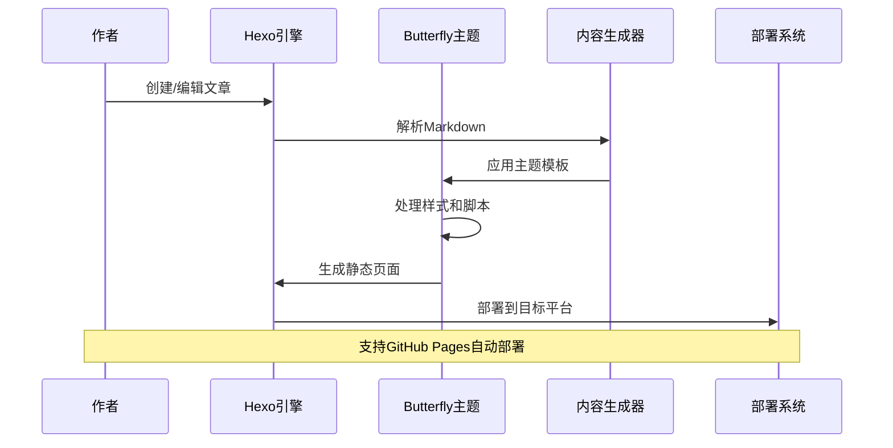

**图表来源**
- [_config.yml:101-107](file://_config.yml#L101-L107)

**章节来源**
- [themes/butterfly/_config.yml:1-800](file://themes/butterfly/_config.yml#L1-L800)
- [package.json:1-29](file://package.json#L1-L29)

## 详细组件分析

### 配置管理系统

#### 全局配置(_config.yml)

全局配置文件定义了站点的基本属性和行为：

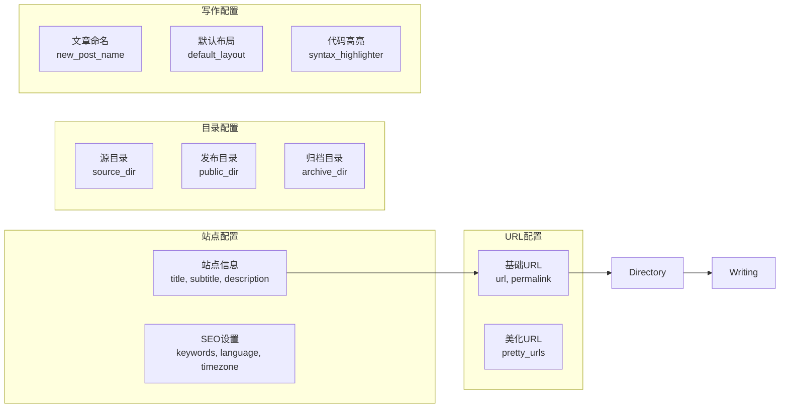

**图表来源**
- [_config.yml:5-99](file://_config.yml#L5-L99)

#### 主题配置(themes/butterfly/_config.yml)

Butterfly主题提供了超过800行的详细配置选项：

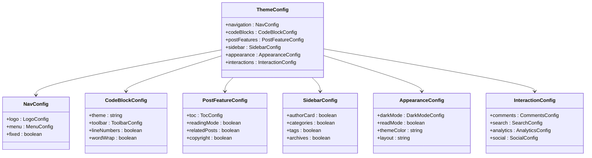

**图表来源**
- [themes/butterfly/_config.yml:12-500](file://themes/butterfly/_config.yml#L12-L500)

**章节来源**
- [_config.yml:1-107](file://_config.yml#L1-L107)
- [themes/butterfly/_config.yml:1-800](file://themes/butterfly/_config.yml#L1-L800)

### 内容管理系统

#### 文章模板系统

Hexo的scaffold机制提供了标准化的文章创建流程：

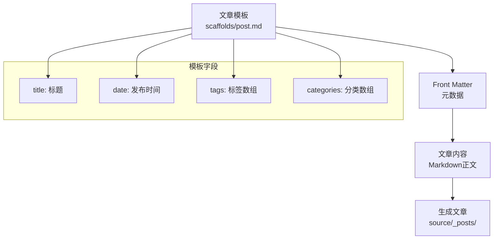

**图表来源**
- [scaffolds/post.md:1-7](file://scaffolds/post.md#L1-L7)

#### 实际内容示例

项目中的示例文章展示了标准的Markdown格式和元数据配置：

| 元数据字段 | 示例值 | 用途 |
|------------|--------|------|
| title | Vscode + Github Copilot接入MATLAB | 文章标题 |
| date | 2026-03-14 15:50:36 | 发布时间 |
| tags | vscode, github copilot, matlab | 关键词标签 |
| categories | 编程工具 | 文章分类 |

**章节来源**
- [scaffolds/post.md:1-7](file://scaffolds/post.md#L1-L7)
- [source/_posts/Vscode-Github-Copilot接入MATLAB.md:1-69](file://source/_posts/Vscode-Github-Copilot接入MATLAB.md#L1-L69)

### 主题渲染系统

#### 布局模板结构

Butterfly主题采用Pug模板引擎，提供了灵活的布局系统：

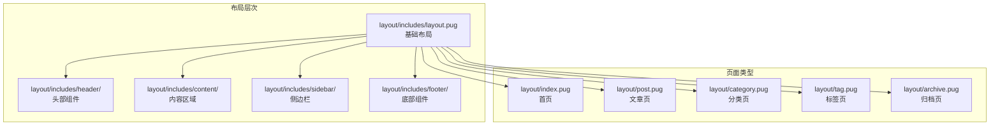

**图表来源**
- [themes/butterfly/layout/index.pug:1-5](file://themes/butterfly/layout/index.pug#L1-L5)

#### 样式系统架构

主题采用Stylus预处理器，提供模块化的CSS管理：

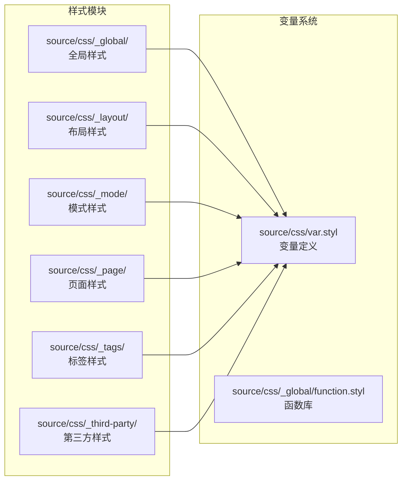

**图表来源**
- [themes/butterfly/scripts/common/default_config.js:1-602](file://themes/butterfly/scripts/common/default_config.js#L1-L602)

**章节来源**
- [themes/butterfly/layout/index.pug:1-5](file://themes/butterfly/layout/index.pug#L1-L5)
- [themes/butterfly/scripts/common/default_config.js:1-602](file://themes/butterfly/scripts/common/default_config.js#L1-L602)

## 依赖关系分析

### 核心依赖架构

项目采用模块化依赖管理，确保功能的可维护性和扩展性：

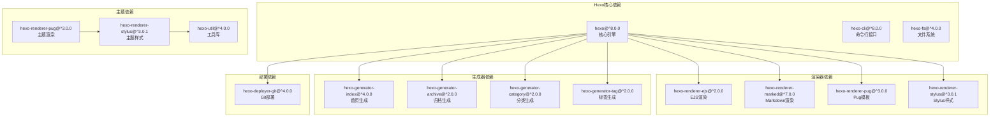

**图表来源**
- [package.json:14-26](file://package.json#L14-L26)
- [themes/butterfly/package.json:25-30](file://themes/butterfly/package.json#L25-L30)

### 主题功能模块

Butterfly主题的功能模块化设计体现了现代前端架构的最佳实践：

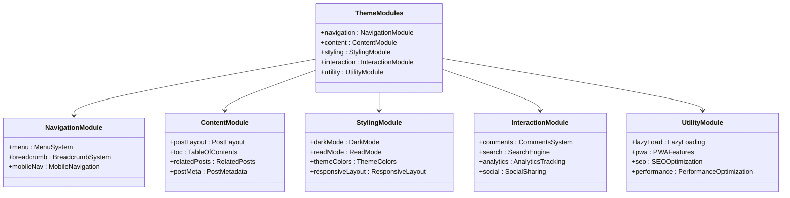

**图表来源**
- [themes/butterfly/_config.yml:118-500](file://themes/butterfly/_config.yml#L118-L500)

**章节来源**
- [package.json:1-29](file://package.json#L1-L29)
- [themes/butterfly/package.json:1-35](file://themes/butterfly/package.json#L1-L35)

## 性能考量

### 静态生成优势

静态博客架构在性能方面的优势体现在多个层面：

- **零服务器负载**：静态文件直接由CDN或Web服务器提供
- **缓存友好**：静态资源可长期缓存，提升重复访问速度
- **全球加速**：CDN分发确保全球用户的访问延迟最小化
- **成本效益**：无需动态服务器资源，运营成本大幅降低

### 优化策略

#### 代码优化
- 使用Prism.js和Highlight.js提供高效的语法高亮
- 模块化的样式系统减少不必要的CSS加载
- 按需加载JavaScript组件，避免阻塞渲染

#### 资源优化
- 图片懒加载和响应式适配
- CSS和JavaScript的压缩与合并
- 字体图标的SVG化处理

#### 用户体验优化
- 预加载关键资源
- 渐进式增强的交互功能
- 无障碍访问支持

## 故障排除指南

### 常见问题诊断

#### 部署问题
- **权限错误**：检查Git仓库的推送权限配置
- **网络超时**：验证GitHub Pages的可用性和网络连接
- **分支冲突**：确认部署分支与配置一致

#### 构建问题
- **依赖缺失**：运行`npm install`重新安装依赖
- **版本兼容**：检查Node.js和Hexo版本兼容性
- **配置错误**：验证_config.yml和主题配置的语法

#### 显示问题
- **样式异常**：清理浏览器缓存或检查CDN缓存
- **主题失效**：确认主题文件完整性和版本匹配
- **图片加载**：检查相对路径和CDN配置

### 调试工具

#### 开发环境
- 使用`hexo server`启动本地开发服务器
- 启用调试模式查看详细的构建日志
- 利用浏览器开发者工具分析性能瓶颈

#### 生产环境
- 监控CDN状态和响应时间
- 分析Google Analytics数据了解用户行为
- 使用Lighthouse进行性能评估

**章节来源**
- [_config.yml:101-107](file://_config.yml#L101-L107)
- [themes/butterfly/_config.yml:500-800](file://themes/butterfly/_config.yml#L500-L800)

## 结论

dzc-blog项目展现了现代静态博客系统的最佳实践。通过精心设计的架构和丰富的功能特性，项目为个人技术博客提供了一个完整且可扩展的解决方案。

### 技术优势总结

1. **架构清晰**：分层设计确保了各组件职责明确，便于维护和扩展
2. **功能丰富**：Butterfly主题提供了现代化的用户界面和交互体验
3. **性能优异**：静态生成架构确保了出色的加载速度和SEO表现
4. **部署简便**：支持多种部署方式，降低了运维复杂度

### 适用场景

- **个人技术博客**：记录学习笔记和项目经验
- **知识分享平台**：建立专业领域的知识库
- **作品展示网站**：展示设计作品和技术项目
- **学习记录系统**：系统化整理学习内容和进度

### 发展建议

1. **持续集成**：建立自动化测试和部署流程
2. **性能监控**：实施网站性能和用户体验监控
3. **内容策略**：制定长期的内容发布计划和质量标准
4. **社区建设**：通过评论系统和社交功能增强用户互动

该项目为初学者提供了友好的入门路径，同时为有经验的开发者提供了足够的灵活性和扩展空间。通过合理利用Hexo和Butterfly的优势，可以构建一个既美观又实用的个人博客平台。